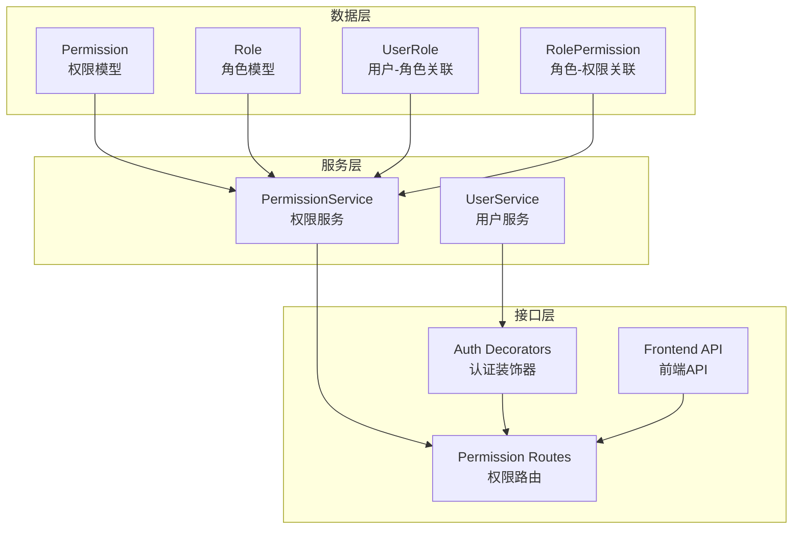
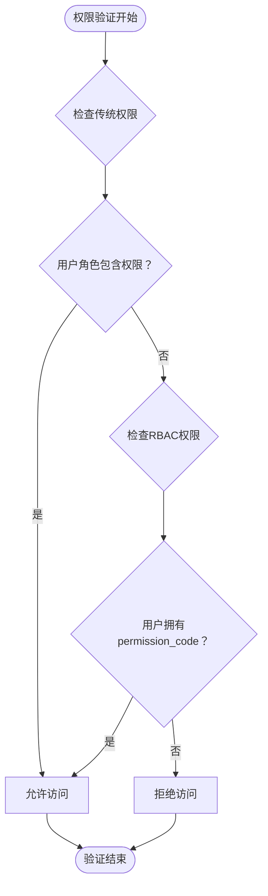
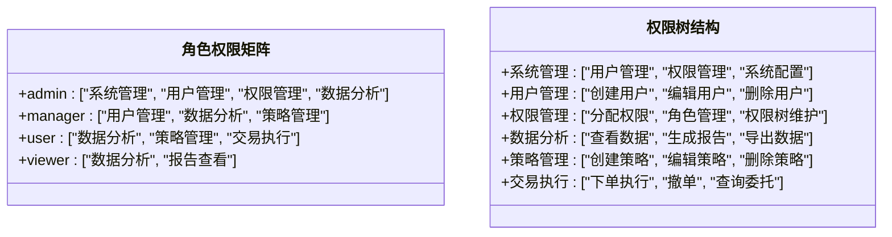

# 用户权限管理

<cite>
**本文档引用的文件**
- [backend_api_python/app/models/permission.py](file://backend_api_python/app/models/permission.py)
- [backend_api_python/app/services/permission_service.py](file://backend_api_python/app/services/permission_service.py)
- [backend_api_python/app/routes/permission.py](file://backend_api_python/app/routes/permission.py)
- [backend_api_python/app/utils/auth.py](file://backend_api_python/app/utils/auth.py)
- [backend_api_python/app/services/user_service.py](file://backend_api_python/app/services/user_service.py)
- [backend_api_python/app/route/auth.py](file://backend_api_python/app/route/auth.py)
- [backend_api_python/app/route/user.py](file://backend_api_python/app/route/user.py)
- [backend_api_python/app/route/dashboard.py](file://backend_api_python/app/route/dashboard.py)
- [backend_api_python/app/route/strategy.py](file://backend_api_python/app/route/strategy.py)
- [backend_api_python/app/route/backtest.py](file://backend_api_python/app/route/backtest.py)
- [frontend/src/api/permission.js](file://frontend/src/api/permission.js)
- [frontend/src/core/permission/permission.js](file://frontend/src/core/permission/permission.js)
- [frontend/src/core/directives/action.js](file://frontend/src/core/directives/action.js)
- [frontend/src/store/modules/user.js](file://frontend/src/store/modules/user.js)
- [frontend/src/views/role-manage/index.vue](file://frontend/src/views/role-manage/index.vue)
- [frontend/src/views/permission-manage/index.vue](file://frontend/src/views/permission-manage/index.vue)
</cite>

## 更新摘要
**所做更改**
- 集成了完整的RBAC权限管理系统的数据库模型和业务逻辑
- 新增了权限树结构支持和动态菜单生成功能
- 增强了权限验证机制，支持基于permission_code的精确权限控制
- 完善了前端权限管理界面和API接口
- 更新了权限继承和权限组合的处理方式

## 目录
1. [简介](#简介)
2. [RBAC系统架构](#rbac系统架构)
3. [数据库模型设计](#数据库模型设计)
4. [权限管理API](#权限管理api)
5. [权限验证机制](#权限验证机制)
6. [角色权限矩阵](#角色权限矩阵)
7. [前端权限控制](#前端权限控制)
8. [权限配置最佳实践](#权限配置最佳实践)
9. [迁移指南](#迁移指南)
10. [故障排查指南](#故障排查指南)
11. [结论](#结论)

## 简介
QuantDinger的用户权限管理系统现已全面升级为基于角色的访问控制(RBAC)架构。新系统提供了更加灵活和精细的权限管理能力，支持权限树结构、动态菜单生成、权限继承和组合等功能。系统采用"权限代码(permission_code)"作为核心标识符，实现了对菜单、按钮、API接口等全方位的权限控制。

**更新** 新增了完整的RBAC系统实现，包括数据库模型、业务服务、API接口和前端管理界面。

## RBAC系统架构
RBAC系统采用三层架构设计，包括数据层、服务层和接口层，支持权限的动态管理和实时验证。



**图表来源**
- [backend_api_python/app/models/permission.py:15-106](file://backend_api_python/app/models/permission.py#L15-L106)
- [backend_api_python/app/services/permission_service.py:16-346](file://backend_api_python/app/services/permission_service.py#L16-L346)
- [backend_api_python/app/routes/permission.py:1-277](file://backend_api_python/app/routes/permission.py#L1-L277)

## 数据库模型设计
RBAC系统的核心数据模型包括权限、角色、用户角色关联和角色权限关联四个表，支持权限树结构和多对多关系。

### 权限模型(Permission)
权限模型支持菜单、目录、按钮等多种类型的权限，并建立了自引用的父子关系。

**章节来源**
- [backend_api_python/app/models/permission.py:15-48](file://backend_api_python/app/models/permission.py#L15-L48)

### 角色模型(Role)
角色模型定义了角色的基本属性，包括角色代码、名称和描述，并与权限建立多对多关系。

**章节来源**
- [backend_api_python/app/models/permission.py:50-72](file://backend_api_python/app/models/permission.py#L50-L72)

### 关联表(UserRole, RolePermission)
关联表实现了用户与角色、角色与权限之间的多对多关系管理。

**章节来源**
- [backend_api_python/app/models/permission.py:74-106](file://backend_api_python/app/models/permission.py#L74-L106)

## 权限管理API
系统提供了完整的权限管理API，支持权限和角色的CRUD操作、权限分配和用户角色管理。

### 权限CRUD接口
- `GET /api/permission/tree` - 获取权限树结构
- `POST /api/permission` - 创建权限
- `PUT /api/permission/<id>` - 更新权限
- `DELETE /api/permission/<id>` - 删除权限

**章节来源**
- [backend_api_python/app/routes/permission.py:21-95](file://backend_api_python/app/routes/permission.py#L21-L95)

### 角色管理接口
- `GET /api/permission/roles` - 分页获取角色列表
- `GET /api/permission/roles/all` - 获取所有角色
- `POST /api/permission/roles` - 创建角色
- `PUT /api/permission/roles/<id>` - 更新角色
- `DELETE /api/permission/roles/<id>` - 删除角色

**章节来源**
- [backend_api_python/app/routes/permission.py:101-188](file://backend_api_python/app/routes/permission.py#L101-L188)

### 权限分配接口
- `PUT /api/permission/roles/<id>/permissions` - 为角色分配权限
- `GET /api/permission/users/<id>/roles` - 获取用户角色
- `PUT /api/permission/users/<id>/roles` - 为用户分配角色

**章节来源**
- [backend_api_python/app/routes/permission.py:194-247](file://backend_api_python/app/routes/permission.py#L194-L247)

### 用户权限接口
- `GET /api/permission/my/menu` - 获取用户菜单权限树
- `GET /api/permission/my/codes` - 获取用户权限编码列表

**章节来源**
- [backend_api_python/app/routes/permission.py:253-277](file://backend_api_python/app/routes/permission.py#L253-L277)

## 权限验证机制
新系统提供了双重权限验证机制，既支持传统的基于角色的权限检查，也支持基于permission_code的精确权限控制。

### 双重验证流程


**图表来源**
- [backend_api_python/app/utils/auth.py:124-146](file://backend_api_python/app/utils/auth.py#L124-L146)

### 权限装饰器
系统提供了多种权限装饰器来满足不同的验证需求：

**章节来源**
- [backend_api_python/app/utils/auth.py:124-172](file://backend_api_python/app/utils/auth.py#L124-L172)

## 角色权限矩阵
新系统支持更灵活的角色权限配置，每个角色可以拥有多个权限，支持权限的继承和组合。

### 角色权限结构


**图表来源**
- [backend_api_python/app/services/permission_service.py:262-334](file://backend_api_python/app/services/permission_service.py#L262-L334)

**章节来源**
- [backend_api_python/app/services/permission_service.py:262-334](file://backend_api_python/app/services/permission_service.py#L262-L334)

## 前端权限控制
前端系统提供了完整的权限控制机制，包括权限树渲染、动态菜单生成和按钮级权限控制。

### 权限树渲染
前端通过`getPermissionTree`接口获取权限树结构，支持菜单和按钮权限的区分显示。

**章节来源**
- [frontend/src/api/permission.js:10-16](file://frontend/src/api/permission.js#L10-L16)

### 动态菜单生成
系统支持根据用户的权限动态生成菜单，只显示用户有权访问的菜单项。

**章节来源**
- [frontend/src/api/permission.js:58-63](file://frontend/src/api/permission.js#L58-L63)

### 按钮级权限控制
通过`v-action`指令实现按钮级权限控制，支持对不同操作的细粒度权限管理。

**章节来源**
- [frontend/src/core/directives/action.js:17-32](file://frontend/src/core/directives/action.js#L17-L32)

## 权限配置最佳实践
### 权限设计原则
1. **最小权限原则** - 每个角色只授予完成工作所需的最小权限
2. **权限分离原则** - 关键操作应分离到不同角色
3. **权限继承原则** - 通过角色继承简化权限配置
4. **权限审计原则** - 建立权限变更的审计日志

### 权限命名规范
- 使用`模块:操作:资源`的命名格式
- 例如：`system:user:create`, `data:analysis:view`
- 避免使用过于宽泛的权限名称

### 角色配置建议
- **admin** - 系统超级管理员，拥有所有权限
- **manager** - 部门管理者，拥有业务管理权限
- **user** - 业务操作员，拥有日常操作权限
- **viewer** - 只读用户，只能查看数据

## 迁移指南
### 从传统权限系统迁移
1. **备份现有数据** - 在迁移前备份用户和角色数据
2. **创建新权限** - 将传统权限映射到新的permission_code
3. **迁移用户角色** - 将用户角色映射到新的角色系统
4. **测试权限验证** - 验证新权限系统的功能完整性
5. **更新前端界面** - 升级前端权限控制逻辑

### 数据迁移步骤
```sql
-- 示例：将传统权限转换为RBAC权限
INSERT INTO sys_permissions (name, permission_code, type, status)
VALUES 
    ('用户管理', 'system:user', 'menu', 'active'),
    ('创建用户', 'system:user:create', 'button', 'active'),
    ('编辑用户', 'system:user:edit', 'button', 'active');
```

## 故障排查指南
### 常见问题及解决方案

#### 权限验证失败
**问题**：用户无法访问某些功能
**排查步骤**：
1. 检查用户是否拥有正确的角色
2. 验证角色是否分配了相应的权限
3. 确认permission_code是否正确
4. 检查权限状态是否为active

#### 菜单显示异常
**问题**：某些菜单项不显示或显示错误
**排查步骤**：
1. 检查权限树结构是否正确
2. 验证父权限是否正确设置
3. 确认权限状态和可见性设置
4. 检查用户权限继承关系

#### 前端权限控制失效
**问题**：按钮权限控制不生效
**排查步骤**：
1. 检查用户权限列表是否正确加载
2. 验证v-action指令的参数设置
3. 确认路由meta.permission配置
4. 检查权限代码格式是否正确

**章节来源**
- [backend_api_python/app/utils/auth.py:142-144](file://backend_api_python/app/utils/auth.py#L142-L144)
- [frontend/src/core/directives/action.js:23-30](file://frontend/src/core/directives/action.js#L23-L30)

## 结论
QuantDinger的新RBAC权限管理系统提供了更加灵活和精细的权限控制能力。通过权限树结构、动态菜单生成、权限继承和组合等功能，系统能够满足复杂的企业级权限管理需求。新系统在保持向后兼容性的同时，为未来的权限扩展奠定了坚实的基础。

系统的主要优势包括：
- **灵活性**：支持复杂的权限组合和继承关系
- **可扩展性**：基于permission_code的权限标识便于扩展
- **可视化**：提供完整的权限管理界面
- **安全性**：双重验证机制确保权限控制的可靠性
- **易用性**：简化的权限配置和管理流程

通过合理的权限设计和配置，QuantDinger能够为企业用户提供安全、灵活、易用的权限管理解决方案。