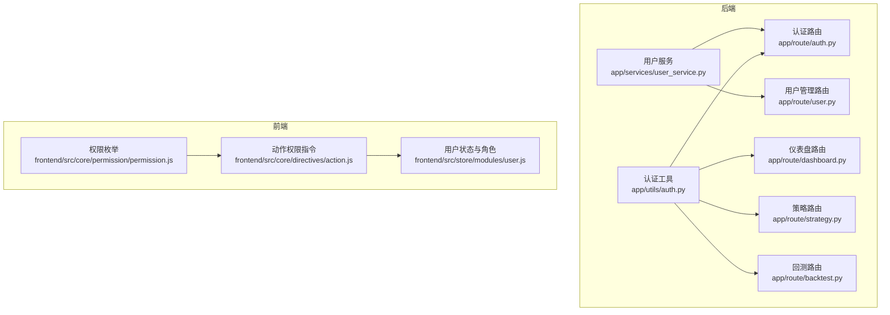
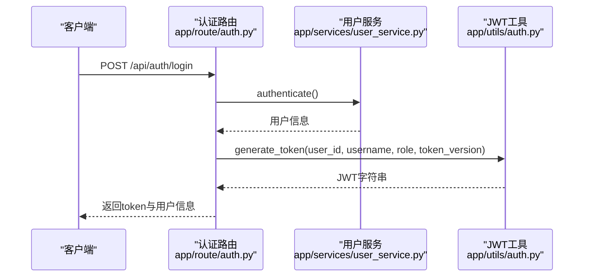
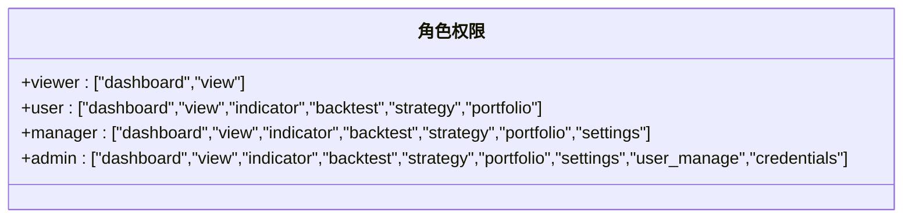
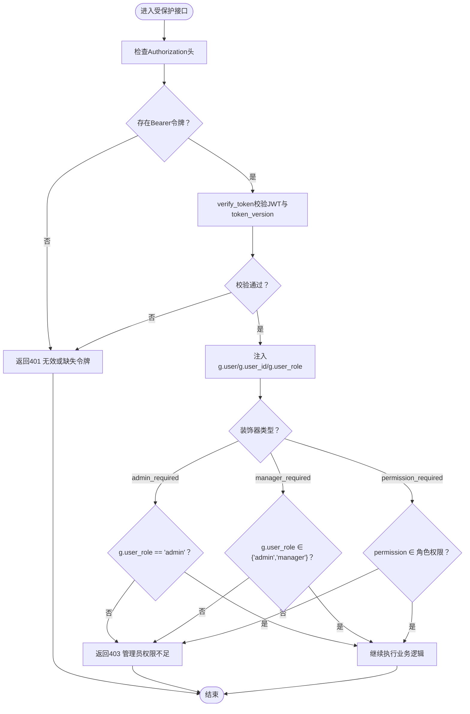
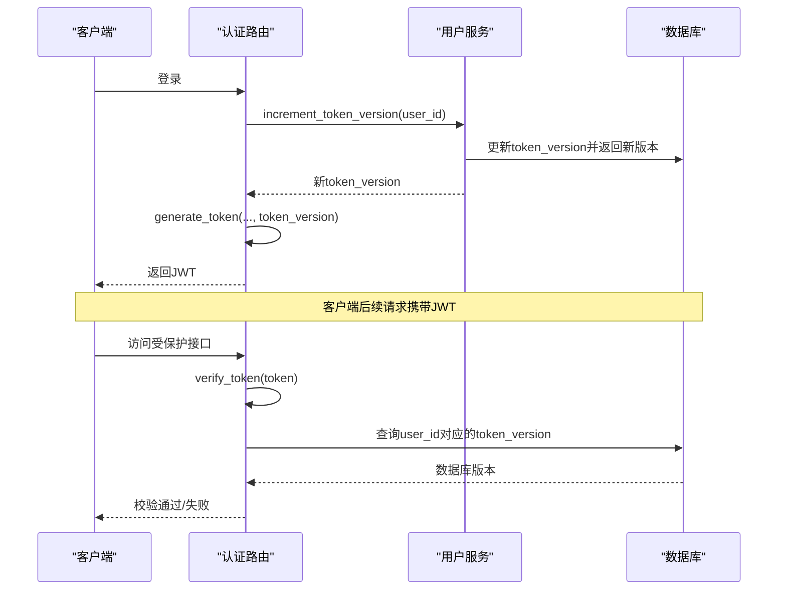
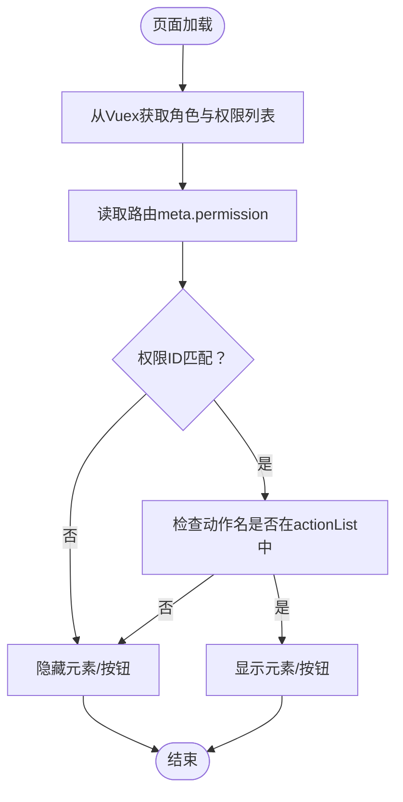
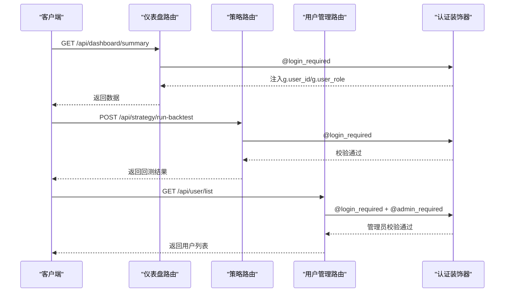
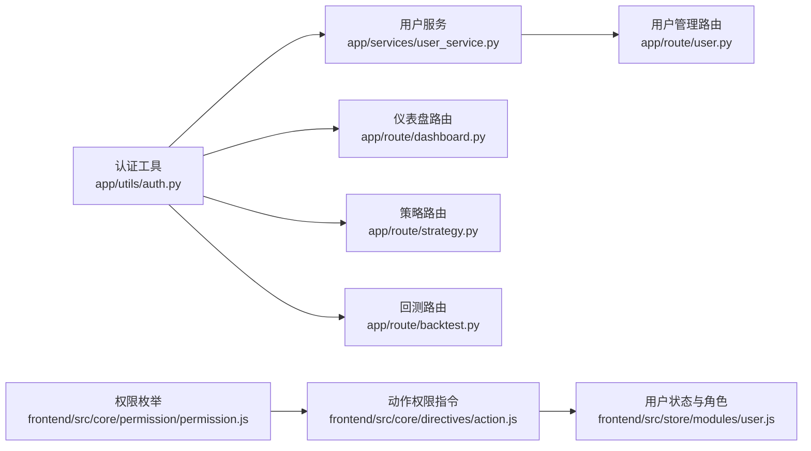

# 用户权限管理

<cite>
**本文档引用的文件**
- [backend_api_python/app/utils/auth.py](file://backend_api_python/app/utils/auth.py)
- [backend_api_python/app/services/user_service.py](file://backend_api_python/app/services/user_service.py)
- [backend_api_python/app/route/auth.py](file://backend_api_python/app/route/auth.py)
- [backend_api_python/app/route/user.py](file://backend_api_python/app/route/user.py)
- [backend_api_python/app/route/dashboard.py](file://backend_api_python/app/route/dashboard.py)
- [backend_api_python/app/route/strategy.py](file://backend_api_python/app/route/strategy.py)
- [backend_api_python/app/route/backtest.py](file://backend_api_python/app/route/backtest.py)
- [frontend/src/core/permission/permission.js](file://frontend/src/core/permission/permission.js)
- [frontend/src/core/directives/action.js](file://frontend/src/core/directives/action.js)
- [frontend/src/store/modules/user.js](file://frontend/src/store/modules/user.js)
</cite>

## 目录
1. [简介](#简介)
2. [项目结构](#项目结构)
3. [核心组件](#核心组件)
4. [架构总览](#架构总览)
5. [详细组件分析](#详细组件分析)
6. [依赖关系分析](#依赖关系分析)
7. [性能考量](#性能考量)
8. [故障排查指南](#故障排查指南)
9. [结论](#结论)

## 简介
本文件面向QuantDinger的用户权限管理体系，系统化阐述基于角色的访问控制（RBAC）架构与实现细节。项目采用“角色-权限”映射模型，定义viewer、user、manager、admin四类角色，每类角色对应一组权限集合，覆盖仪表盘访问、指标与策略开发、回测执行、设置修改、用户管理等操作域。后端通过JWT令牌与装饰器实现认证与授权，前端通过指令与工具函数实现UI级权限控制与按钮级动作权限校验。

## 项目结构
权限相关代码主要分布在后端Python服务与前端Vue应用两部分：
- 后端
  - 认证与授权工具：app/utils/auth.py
  - 用户与权限服务：app/services/user_service.py
  - 路由与业务接口：app/route/*（auth、user、dashboard、strategy、backtest等）
- 前端
  - 权限枚举与指令：frontend/src/core/permission/permission.js、frontend/src/core/directives/action.js
  - 用户状态与角色存储：frontend/src/store/modules/user.js

**图表来源**
- [backend_api_python/app/utils/auth.py:18-158](file://backend_api_python/app/utils/auth.py#L18-L158)
- [backend_api_python/app/services/user_service.py:59-68](file://backend_api_python/app/services/user_service.py#L59-L68)
- [backend_api_python/app/route/auth.py:156-325](file://backend_api_python/app/route/auth.py#L156-L325)
- [backend_api_python/app/route/user.py:41-109](file://backend_api_python/app/route/user.py#L41-L109)
- [backend_api_python/app/route/dashboard.py:307-341](file://backend_api_python/app/route/dashboard.py#L307-L341)
- [backend_api_python/app/route/strategy.py:370-411](file://backend_api_python/app/route/strategy.py#L370-L411)
- [backend_api_python/app/route/backtest.py:179-249](file://backend_api_python/app/route/backtest.py#L179-L249)
- [frontend/src/core/permission/permission.js:1-56](file://frontend/src/core/permission/permission.js#L1-L56)
- [frontend/src/core/directives/action.js:17-32](file://frontend/src/core/directives/action.js#L17-L32)
- [frontend/src/store/modules/user.js:42-106](file://frontend/src/store/modules/user.js#L42-L106)

**章节来源**
- [backend_api_python/app/utils/auth.py:18-158](file://backend_api_python/app/utils/auth.py#L18-L158)
- [backend_api_python/app/services/user_service.py:59-68](file://backend_api_python/app/services/user_service.py#L59-L68)
- [frontend/src/core/permission/permission.js:1-56](file://frontend/src/core/permission/permission.js#L1-L56)
- [frontend/src/core/directives/action.js:17-32](file://frontend/src/core/directives/action.js#L17-L32)
- [frontend/src/store/modules/user.js:42-106](file://frontend/src/store/modules/user.js#L42-L106)

## 核心组件
- 角色与权限映射
  - viewer：仪表盘查看
  - user：仪表盘、指标、回测、策略、投资组合
  - manager：在user基础上增加设置修改
  - admin：在manager基础上增加用户管理、凭证管理
- 认证与授权装饰器
  - login_required：Bearer令牌校验，注入g.user、g.user_id、g.user_role
  - admin_required：管理员校验
  - manager_required：管理员/经理校验
  - permission_required(permission)：按权限字符串校验（通过用户服务获取角色权限列表）
- JWT与令牌版本控制
  - generate_token：签发含role、token_version的JWT
  - verify_token：解码JWT并校验token_version一致性
  - token_version：用于单点登录（踢出旧会话）

**章节来源**
- [backend_api_python/app/services/user_service.py:59-68](file://backend_api_python/app/services/user_service.py#L59-L68)
- [backend_api_python/app/utils/auth.py:18-158](file://backend_api_python/app/utils/auth.py#L18-L158)
- [backend_api_python/app/utils/auth.py:82-114](file://backend_api_python/app/utils/auth.py#L82-L114)

## 架构总览
后端采用Flask蓝图组织路由，所有受保护接口均通过装饰器链路进行认证与授权。前端通过指令与工具函数在UI层面进行权限控制，结合Vuex存储用户角色与权限列表，实现按钮级与页面级的权限屏蔽。

**图表来源**
- [backend_api_python/app/route/auth.py:156-325](file://backend_api_python/app/route/auth.py#L156-L325)
- [backend_api_python/app/services/user_service.py:194-246](file://backend_api_python/app/services/user_service.py#L194-L246)
- [backend_api_python/app/utils/auth.py:18-47](file://backend_api_python/app/utils/auth.py#L18-L47)

## 详细组件分析

### 角色与权限矩阵
- viewer：dashboard、view
- user：dashboard、view、indicator、backtest、strategy、portfolio
- manager：在user基础上追加settings
- admin：在manager基础上追加user_manage、credentials

**图表来源**
- [backend_api_python/app/services/user_service.py:62-68](file://backend_api_python/app/services/user_service.py#L62-L68)

**章节来源**
- [backend_api_python/app/services/user_service.py:62-68](file://backend_api_python/app/services/user_service.py#L62-L68)

### 认证与授权装饰器
- login_required：从Authorization头解析Bearer令牌，解码并校验，成功后将用户信息写入flask.g上下文
- admin_required：要求g.user_role为admin
- manager_required：要求g.user_role为admin或manager
- permission_required(permission)：动态获取角色权限列表，判断是否包含指定permission

**图表来源**
- [backend_api_python/app/utils/auth.py:126-158](file://backend_api_python/app/utils/auth.py#L126-L158)
- [backend_api_python/app/utils/auth.py:160-185](file://backend_api_python/app/utils/auth.py#L160-L185)
- [backend_api_python/app/utils/auth.py:188-217](file://backend_api_python/app/utils/auth.py#L188-L217)

**章节来源**
- [backend_api_python/app/utils/auth.py:126-217](file://backend_api_python/app/utils/auth.py#L126-L217)

### JWT与令牌版本控制
- generate_token：签发含exp、iat、sub、user_id、role、token_version的JWT
- verify_token：解码JWT并校验token_version与数据库中当前版本一致
- token_version：每次登录或特定操作后递增，旧令牌立即失效，实现单点登录

**图表来源**
- [backend_api_python/app/route/auth.py:273-291](file://backend_api_python/app/route/auth.py#L273-L291)
- [backend_api_python/app/services/user_service.py:274-312](file://backend_api_python/app/services/user_service.py#L274-L312)
- [backend_api_python/app/utils/auth.py:82-114](file://backend_api_python/app/utils/auth.py#L82-L114)

**章节来源**
- [backend_api_python/app/route/auth.py:273-291](file://backend_api_python/app/route/auth.py#L273-L291)
- [backend_api_python/app/services/user_service.py:248-312](file://backend_api_python/app/services/user_service.py#L248-L312)
- [backend_api_python/app/utils/auth.py:82-114](file://backend_api_python/app/utils/auth.py#L82-L114)

### 前端权限控制
- 权限枚举：PERMISSION_ENUM定义通用权限键与标签
- 动作权限指令v-action：根据路由meta.permission与用户角色权限列表，动态隐藏无权限的DOM节点
- 用户状态与角色：登录后将角色与权限列表写入Vuex，供指令与页面逻辑使用

**图表来源**
- [frontend/src/core/directives/action.js:17-32](file://frontend/src/core/directives/action.js#L17-L32)
- [frontend/src/core/permission/permission.js:1-56](file://frontend/src/core/permission/permission.js#L1-L56)
- [frontend/src/store/modules/user.js:94-105](file://frontend/src/store/modules/user.js#L94-L105)

**章节来源**
- [frontend/src/core/directives/action.js:17-32](file://frontend/src/core/directives/action.js#L17-L32)
- [frontend/src/core/permission/permission.js:1-56](file://frontend/src/core/permission/permission.js#L1-L56)
- [frontend/src/store/modules/user.js:94-105](file://frontend/src/store/modules/user.js#L94-L105)

### 接口保护策略与最佳实践
- 仪表盘接口：@login_required，仅限登录用户访问
- 用户管理接口：@login_required + @admin_required，仅管理员可用
- 回测与策略接口：@login_required，配合业务侧校验用户ID与策略归属
- 权限校验：在需要细粒度权限的场景使用@permission_required(permission)，例如策略开发、回测执行等

**图表来源**
- [backend_api_python/app/route/dashboard.py:307-341](file://backend_api_python/app/route/dashboard.py#L307-L341)
- [backend_api_python/app/route/strategy.py:467-501](file://backend_api_python/app/route/strategy.py#L467-L501)
- [backend_api_python/app/route/user.py:41-109](file://backend_api_python/app/route/user.py#L41-L109)

**章节来源**
- [backend_api_python/app/route/dashboard.py:307-341](file://backend_api_python/app/route/dashboard.py#L307-L341)
- [backend_api_python/app/route/strategy.py:467-501](file://backend_api_python/app/route/strategy.py#L467-L501)
- [backend_api_python/app/route/user.py:41-109](file://backend_api_python/app/route/user.py#L41-L109)

## 依赖关系分析
- 后端
  - 认证工具依赖用户服务获取角色权限列表
  - 用户管理路由依赖用户服务进行CRUD与角色变更
  - 各业务路由依赖认证装饰器保证访问安全
- 前端
  - 动作权限指令依赖Vuex中的角色与权限列表
  - 权限枚举为指令提供权限键定义

**图表来源**
- [backend_api_python/app/utils/auth.py:188-217](file://backend_api_python/app/utils/auth.py#L188-L217)
- [backend_api_python/app/services/user_service.py:656-658](file://backend_api_python/app/services/user_service.py#L656-L658)
- [backend_api_python/app/route/user.py:41-109](file://backend_api_python/app/route/user.py#L41-L109)
- [frontend/src/core/directives/action.js:17-32](file://frontend/src/core/directives/action.js#L17-L32)
- [frontend/src/store/modules/user.js:94-105](file://frontend/src/store/modules/user.js#L94-L105)
- [frontend/src/core/permission/permission.js:1-56](file://frontend/src/core/permission/permission.js#L1-L56)

**章节来源**
- [backend_api_python/app/utils/auth.py:188-217](file://backend_api_python/app/utils/auth.py#L188-L217)
- [backend_api_python/app/services/user_service.py:656-658](file://backend_api_python/app/services/user_service.py#L656-L658)
- [frontend/src/core/directives/action.js:17-32](file://frontend/src/core/directives/action.js#L17-L32)
- [frontend/src/store/modules/user.js:94-105](file://frontend/src/store/modules/user.js#L94-L105)

## 性能考量
- JWT解码与token_version校验为O(1)数据库查询，开销极低
- 角色权限列表在用户登录时下发至前端，避免重复计算
- 建议
  - 对高频接口可考虑缓存热点权限判断结果
  - 合理设置token有效期，平衡安全性与用户体验
  - 在前端指令中尽量复用已有的权限判断逻辑，避免重复计算

## 故障排查指南
- 401 未授权
  - 检查请求头Authorization是否包含Bearer令牌
  - 校验JWT签名与有效期
  - 确认token_version是否与数据库一致（单点登录生效）
- 403 禁止访问
  - 管理员/经理权限不足：确认g.user_role是否正确
  - 权限字符串不在角色权限列表：确认permission_required传参与服务端映射一致
- 前端按钮不可见
  - 检查路由meta.permission与用户角色权限列表是否匹配
  - 确认v-action指令参数与actionList一致

**章节来源**
- [backend_api_python/app/utils/auth.py:143-149](file://backend_api_python/app/utils/auth.py#L143-L149)
- [backend_api_python/app/utils/auth.py:167-170](file://backend_api_python/app/utils/auth.py#L167-L170)
- [backend_api_python/app/utils/auth.py:208-213](file://backend_api_python/app/utils/auth.py#L208-L213)
- [frontend/src/core/directives/action.js:23-30](file://frontend/src/core/directives/action.js#L23-L30)

## 结论
QuantDinger的权限体系以RBAC为核心，通过角色-权限映射与JWT令牌实现前后端协同的安全控制。后端以装饰器链路保障接口安全，前端以指令与工具函数实现UI级权限屏蔽。该方案具备清晰的权限边界、良好的扩展性与较低的运行时开销，适合多用户场景下的权限治理需求。