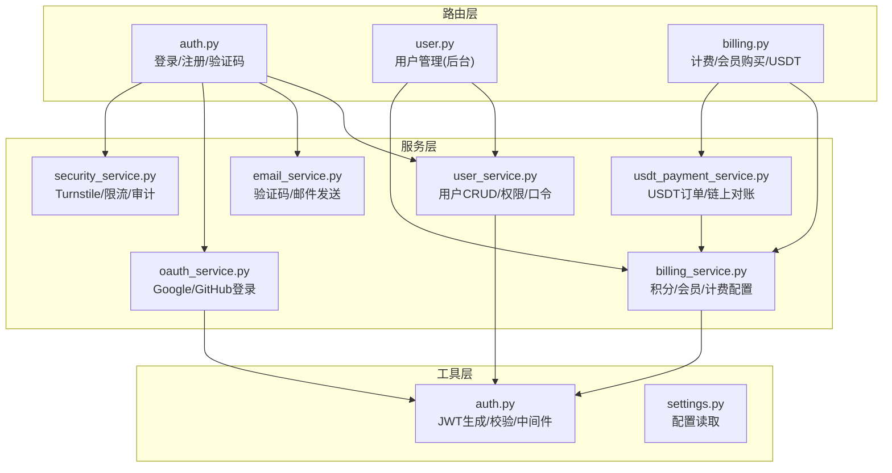
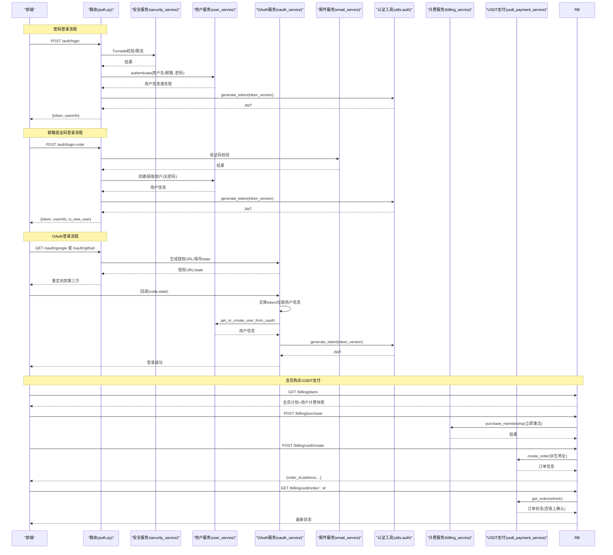
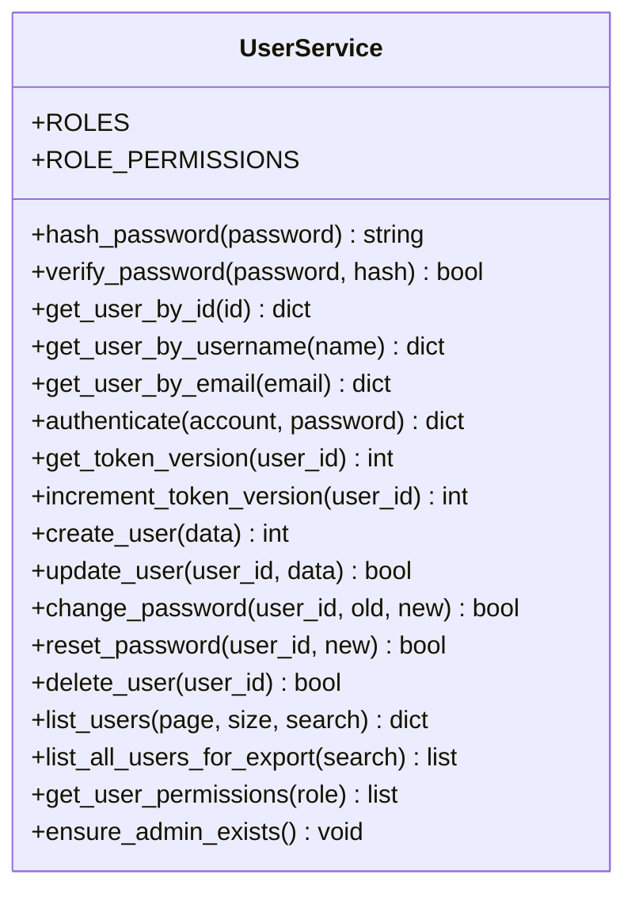
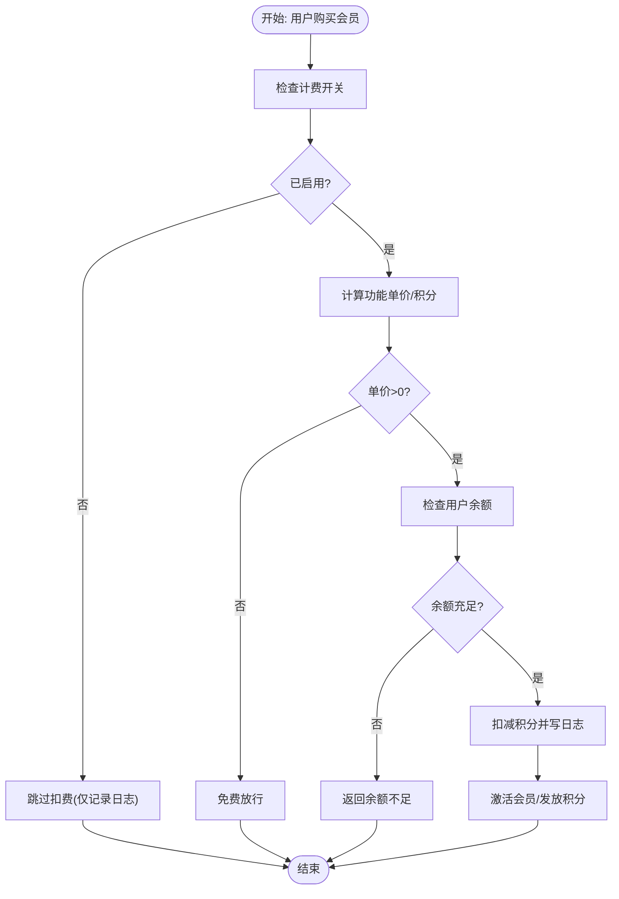
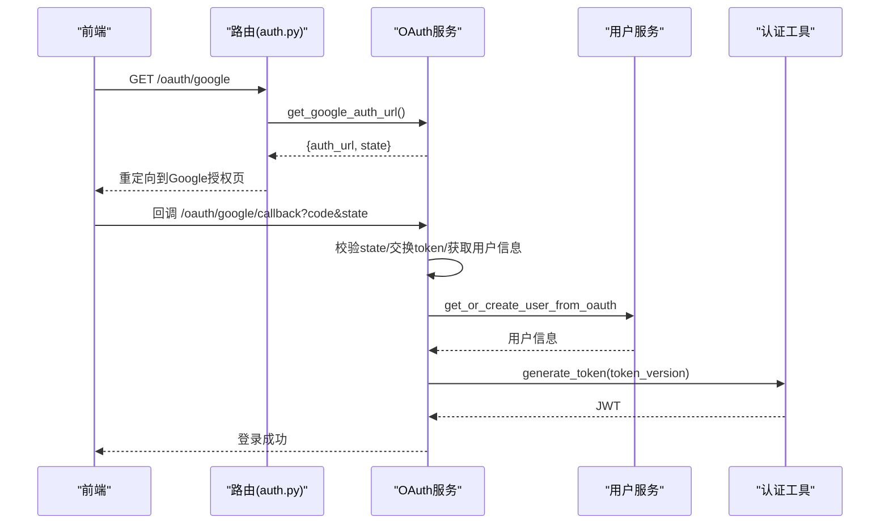
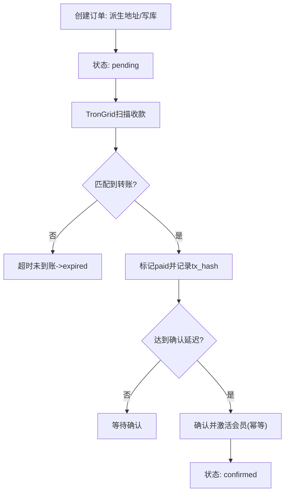
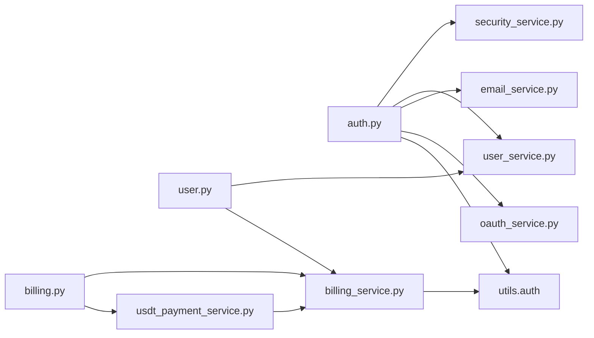

# 用户管理与商业化

<cite>
**本文引用的文件**
- [backend_api_python/app/services/user_service.py](file://backend_api_python/app/services/user_service.py)
- [backend_api_python/app/route/user.py](file://backend_api_python/app/route/user.py)
- [backend_api_python/app/services/billing_service.py](file://backend_api_python/app/services/billing_service.py)
- [backend_api_python/app/route/billing.py](file://backend_api_python/app/route/billing.py)
- [backend_api_python/app/services/oauth_service.py](file://backend_api_python/app/services/oauth_service.py)
- [backend_api_python/app/route/auth.py](file://backend_api_python/app/route/auth.py)
- [backend_api_python/app/services/email_service.py](file://backend_api_python/app/services/email_service.py)
- [backend_api_python/app/services/usdt_payment_service.py](file://backend_api_python/app/services/usdt_payment_service.py)
- [backend_api_python/app/utils/auth.py](file://backend_api_python/app/utils/auth.py)
- [backend_api_python/app/services/security_service.py](file://backend_api_python/app/services/security_service.py)
- [backend_api_python/app/config/settings.py](file://backend_api_python/app/config/settings.py)
</cite>

## 目录
1. [简介](#简介)
2. [项目结构](#项目结构)
3. [核心组件](#核心组件)
4. [架构总览](#架构总览)
5. [详细组件分析](#详细组件分析)
6. [依赖分析](#依赖分析)
7. [性能考虑](#性能考虑)
8. [故障排查指南](#故障排查指南)
9. [结论](#结论)
10. [附录](#附录)

## 简介
本文件面向QuantDinger的用户管理与商业化系统，系统性梳理用户服务、计费服务、OAuth登录、邮件通知以及USDT支付服务的架构设计与实现要点。文档旨在帮助开发者与运维人员快速理解模块职责、数据流与扩展点，并提供排障与优化建议。

## 项目结构
后端采用Flask微服务架构，按“路由-服务-工具”分层组织：
- 路由层：定义REST接口，负责参数解析、鉴权装饰器与响应封装
- 服务层：封装业务逻辑（用户、计费、OAuth、邮件、支付、安全）
- 工具层：通用工具（认证、数据库连接、日志、加密）

图表来源
- [backend_api_python/app/route/auth.py:156-324](file://backend_api_python/app/route/auth.py#L156-L324)
- [backend_api_python/app/route/user.py:41-108](file://backend_api_python/app/route/user.py#L41-L108)
- [backend_api_python/app/route/billing.py:21-121](file://backend_api_python/app/route/billing.py#L21-L121)
- [backend_api_python/app/services/user_service.py:56-701](file://backend_api_python/app/services/user_service.py#L56-L701)
- [backend_api_python/app/services/billing_service.py:47-747](file://backend_api_python/app/services/billing_service.py#L47-L747)
- [backend_api_python/app/services/oauth_service.py:27-715](file://backend_api_python/app/services/oauth_service.py#L27-L715)
- [backend_api_python/app/services/email_service.py:29-362](file://backend_api_python/app/services/email_service.py#L29-L362)
- [backend_api_python/app/services/usdt_payment_service.py:23-820](file://backend_api_python/app/services/usdt_payment_service.py#L23-L820)
- [backend_api_python/app/utils/auth.py:18-239](file://backend_api_python/app/utils/auth.py#L18-L239)
- [backend_api_python/app/services/security_service.py:26-399](file://backend_api_python/app/services/security_service.py#L26-L399)
- [backend_api_python/app/config/settings.py:1-99](file://backend_api_python/app/config/settings.py#L1-L99)

章节来源
- [backend_api_python/app/route/auth.py:1-800](file://backend_api_python/app/route/auth.py#L1-L800)
- [backend_api_python/app/route/user.py:1-800](file://backend_api_python/app/route/user.py#L1-L800)
- [backend_api_python/app/route/billing.py:1-243](file://backend_api_python/app/route/billing.py#L1-L243)
- [backend_api_python/app/services/user_service.py:1-701](file://backend_api_python/app/services/user_service.py#L1-L701)
- [backend_api_python/app/services/billing_service.py:1-747](file://backend_api_python/app/services/billing_service.py#L1-L747)
- [backend_api_python/app/services/oauth_service.py:1-715](file://backend_api_python/app/services/oauth_service.py#L1-L715)
- [backend_api_python/app/services/email_service.py:1-362](file://backend_api_python/app/services/email_service.py#L1-L362)
- [backend_api_python/app/services/usdt_payment_service.py:1-820](file://backend_api_python/app/services/usdt_payment_service.py#L1-L820)
- [backend_api_python/app/utils/auth.py:1-239](file://backend_api_python/app/utils/auth.py#L1-L239)
- [backend_api_python/app/services/security_service.py:1-399](file://backend_api_python/app/services/security_service.py#L1-L399)
- [backend_api_python/app/config/settings.py:1-99](file://backend_api_python/app/config/settings.py#L1-L99)

## 核心组件
- 用户服务：提供用户注册、登录认证、角色权限、密码哈希/校验、令牌版本强制单点登录、用户信息维护与批量导出等能力
- 计费服务：统一的积分体系、会员计划（包月/包年/终身）、购买流程、消费扣减、充值/调整、日志审计与余额查询
- OAuth服务：支持Google与GitHub第三方登录，状态防重放、OAuth链接绑定/解绑、首次OAuth自动注册与奖励
- 邮件服务：SMTP配置、验证码生成/校验、邮件模板发送、防暴力与锁定期保护
- USDT支付服务：TRC20每单派生地址、链上扫描与自动对账、确认延迟、后台Worker轮询、幂等激活
- 安全服务：Turnstile人机验证、登录尝试记录与限流、账户/IP封禁、安全事件审计、验证码发送速率限制、密码强度校验
- 认证工具：JWT生成/校验、token版本一致性校验、多级权限装饰器、单用户模式兼容

章节来源
- [backend_api_python/app/services/user_service.py:56-701](file://backend_api_python/app/services/user_service.py#L56-L701)
- [backend_api_python/app/services/billing_service.py:47-747](file://backend_api_python/app/services/billing_service.py#L47-L747)
- [backend_api_python/app/services/oauth_service.py:27-715](file://backend_api_python/app/services/oauth_service.py#L27-L715)
- [backend_api_python/app/services/email_service.py:29-362](file://backend_api_python/app/services/email_service.py#L29-L362)
- [backend_api_python/app/services/usdt_payment_service.py:23-820](file://backend_api_python/app/services/usdt_payment_service.py#L23-L820)
- [backend_api_python/app/services/security_service.py:26-399](file://backend_api_python/app/services/security_service.py#L26-L399)
- [backend_api_python/app/utils/auth.py:18-239](file://backend_api_python/app/utils/auth.py#L18-L239)

## 架构总览
下图展示了用户登录与计费/支付的关键交互流程，覆盖多用户与OAuth两种登录路径、验证码登录、JWT令牌与单点登录控制、计费与USDT支付的调用链。

图表来源
- [backend_api_python/app/route/auth.py:156-562](file://backend_api_python/app/route/auth.py#L156-L562)
- [backend_api_python/app/services/security_service.py:72-219](file://backend_api_python/app/services/security_service.py#L72-L219)
- [backend_api_python/app/services/user_service.py:194-246](file://backend_api_python/app/services/user_service.py#L194-L246)
- [backend_api_python/app/services/oauth_service.py:200-426](file://backend_api_python/app/services/oauth_service.py#L200-L426)
- [backend_api_python/app/services/email_service.py:277-350](file://backend_api_python/app/services/email_service.py#L277-L350)
- [backend_api_python/app/utils/auth.py:18-80](file://backend_api_python/app/utils/auth.py#L18-L80)
- [backend_api_python/app/route/billing.py:21-242](file://backend_api_python/app/route/billing.py#L21-L242)
- [backend_api_python/app/services/billing_service.py:202-334](file://backend_api_python/app/services/billing_service.py#L202-L334)
- [backend_api_python/app/services/usdt_payment_service.py:132-187](file://backend_api_python/app/services/usdt_payment_service.py#L132-L187)

## 详细组件分析

### 用户服务（多用户管理与权限）
- 角色与权限
  - 角色顺序：viewer → user → manager → admin
  - 权限映射：不同角色具备不同功能集合（仪表盘、查看、指标、回测、策略、组合、设置、用户管理、凭证等）
- 口令安全
  - 优先使用bcrypt；若不可用则降级为SHA256+盐
  - 支持修改/重置口令，变更口令时需校验旧口令（无口令用户可直接设置）
- 单点登录
  - 引入token_version字段，每次登录递增，JWT中携带该版本，服务端校验与数据库一致以实现踢出旧会话
- 用户管理
  - 支持按ID/用户名/邮箱查询、创建、更新、删除、列表与导出
  - 支持设置时区、头像、昵称、角色、状态等
  - 首次注册默认注入自选清单与内置指标样例
- 管理后台
  - 后台路由提供用户列表、导出、详情、创建、更新、删除、重置口令、设置积分、设置VIP、查看积分日志等接口

图表来源
- [backend_api_python/app/services/user_service.py:56-701](file://backend_api_python/app/services/user_service.py#L56-L701)
- [backend_api_python/app/route/user.py:41-800](file://backend_api_python/app/route/user.py#L41-L800)

章节来源
- [backend_api_python/app/services/user_service.py:56-701](file://backend_api_python/app/services/user_service.py#L56-L701)
- [backend_api_python/app/route/user.py:41-800](file://backend_api_python/app/route/user.py#L41-L800)

### 计费服务（积分与会员）
- 计费配置
  - 通过环境变量加载，支持全局开关与各功能单价配置
  - 配置带缓存，避免频繁读取环境变量
- 积分体系
  - 查询余额、消费扣减、充值/管理员调整、日志审计
  - 消费前检查余额与计费开关，记录日志（UTC时间）
- 会员计划
  - 三档计划：包月、包年、终身
  - 购买即刻激活，支持叠加有效期（包月/包年）
  - 终身计划按月发放积分，后台定时补发
- 管理后台
  - 提供设置用户积分、设置VIP、查看积分日志等接口

图表来源
- [backend_api_python/app/services/billing_service.py:450-514](file://backend_api_python/app/services/billing_service.py#L450-L514)
- [backend_api_python/app/services/billing_service.py:202-334](file://backend_api_python/app/services/billing_service.py#L202-L334)

章节来源
- [backend_api_python/app/services/billing_service.py:47-747](file://backend_api_python/app/services/billing_service.py#L47-L747)
- [backend_api_python/app/route/billing.py:21-121](file://backend_api_python/app/route/billing.py#L21-L121)
- [backend_api_python/app/route/user.py:561-800](file://backend_api_python/app/route/user.py#L561-L800)

### OAuth服务（第三方登录与单点登录）
- 支持Google与GitHub
  - 生成授权URL、保存state（带过期时间）、回调交换token并拉取用户信息
  - 状态表持久化，解决多Worker/多副本场景下的state一致性问题
- 用户绑定与创建
  - 若OAuth用户存在则复用；若邮箱相同则绑定至现有用户；否则自动创建新用户并授予注册奖励积分
  - 支持OAuth解绑（若仅剩一种认证方式则禁止）
- 重定向白名单
  - 严格校验允许的重定向域名，防止开放重定向风险

图表来源
- [backend_api_python/app/route/auth.py:1-800](file://backend_api_python/app/route/auth.py#L1-L800)
- [backend_api_python/app/services/oauth_service.py:200-426](file://backend_api_python/app/services/oauth_service.py#L200-L426)
- [backend_api_python/app/services/user_service.py:432-640](file://backend_api_python/app/services/user_service.py#L432-L640)
- [backend_api_python/app/utils/auth.py:18-80](file://backend_api_python/app/utils/auth.py#L18-L80)

章节来源
- [backend_api_python/app/services/oauth_service.py:27-715](file://backend_api_python/app/services/oauth_service.py#L27-L715)
- [backend_api_python/app/route/auth.py:1-800](file://backend_api_python/app/route/auth.py#L1-L800)

### 邮件服务（验证码与通知）
- 配置项
  - SMTP主机、端口、账号、密码、发件人、TLS/SSL开关
  - 验证码长度、过期分钟、最大尝试次数、锁定分钟
- 功能
  - 生成随机验证码并入库（覆盖同类型未使用记录）
  - 验证码校验带防暴力与锁定期保护
  - 发送HTML/纯文本邮件，支持多种验证码用途（注册、登录、重置密码、改密、改绑）
- 安全
  - 未配置SMTP时不发送邮件并告警
  - 防止枚举邮箱，重置密码场景对不存在邮箱也返回成功提示

章节来源
- [backend_api_python/app/services/email_service.py:29-362](file://backend_api_python/app/services/email_service.py#L29-L362)
- [backend_api_python/app/route/auth.py:569-688](file://backend_api_python/app/route/auth.py#L569-L688)

### USDT支付服务（TRC20）
- 地址派生
  - 基于xpub按索引派生TRC20地址，支持账户级/变更级/地址级xpub规范化
- 订单管理
  - 每单一个地址，记录计划、金额、过期时间、状态、链上哈希、确认时间
  - 支持创建订单、查询订单、刷新状态
- 链上对账
  - TronGrid分页扫描收款，匹配目标金额与接收地址、区块时间窗口
  - 支付后进入paid，满足确认延迟后激活会员并幂等处理
- 后台Worker
  - 定时扫描pending/paid订单，异步刷新链上状态，减少DB连接占用

图表来源
- [backend_api_python/app/services/usdt_payment_service.py:132-187](file://backend_api_python/app/services/usdt_payment_service.py#L132-L187)
- [backend_api_python/app/services/usdt_payment_service.py:282-420](file://backend_api_python/app/services/usdt_payment_service.py#L282-L420)
- [backend_api_python/app/services/usdt_payment_service.py:538-740](file://backend_api_python/app/services/usdt_payment_service.py#L538-L740)

章节来源
- [backend_api_python/app/services/usdt_payment_service.py:23-820](file://backend_api_python/app/services/usdt_payment_service.py#L23-L820)
- [backend_api_python/app/route/billing.py:129-242](file://backend_api_python/app/route/billing.py#L129-L242)

### 安全服务（人机验证与风控）
- Turnstile
  - 可选的人机验证，失败则拒绝请求
- 登录风控
  - IP与账户维度的失败次数统计与封禁
  - 成功登录清理尝试记录，失败记录审计
- 审计日志
  - 记录登录、注册、重置密码等关键事件
- 验证码速率限制
  - 邮箱维度与IP维度的发送频率限制
- 密码强度
  - 至少8位且包含大小写字母与数字

章节来源
- [backend_api_python/app/services/security_service.py:26-399](file://backend_api_python/app/services/security_service.py#L26-L399)
- [backend_api_python/app/route/auth.py:115-149](file://backend_api_python/app/route/auth.py#L115-L149)

### 认证工具（JWT与权限）
- JWT
  - 生成：包含用户ID、用户名、角色、token_version，有效期7天
  - 校验：校验签名与过期，同时校验token_version与数据库一致
- 权限装饰器
  - @login_required、@admin_required、@manager_required、@permission_required
- 单用户模式
  - 兼容传统单用户模式，使用环境变量管理员凭据

章节来源
- [backend_api_python/app/utils/auth.py:18-239](file://backend_api_python/app/utils/auth.py#L18-L239)
- [backend_api_python/app/services/user_service.py:56-701](file://backend_api_python/app/services/user_service.py#L56-L701)

## 依赖分析
- 路由到服务
  - auth路由依赖安全、用户、邮件、OAuth、认证工具
  - user路由依赖用户服务与计费服务（后台管理）
  - billing路由依赖计费与USDT支付服务
- 服务内聚与耦合
  - 计费服务与USDT支付服务强耦合（前者负责激活，后者负责链上对账）
  - 用户服务与OAuth服务耦合（OAuth创建/绑定用户）
  - 安全服务横切多个路由（人机验证、限流、审计）
- 外部依赖
  - OAuth：Google/GitHub OpenID/OAuth API
  - 邮件：SMTP服务器
  - 链上：TronGrid API（TRC20扫描）
  - 数据库：PostgreSQL（用户、订单、日志、验证码等表）

图表来源
- [backend_api_python/app/route/auth.py:1-800](file://backend_api_python/app/route/auth.py#L1-L800)
- [backend_api_python/app/route/user.py:1-800](file://backend_api_python/app/route/user.py#L1-L800)
- [backend_api_python/app/route/billing.py:1-243](file://backend_api_python/app/route/billing.py#L1-L243)
- [backend_api_python/app/services/user_service.py:1-701](file://backend_api_python/app/services/user_service.py#L1-L701)
- [backend_api_python/app/services/billing_service.py:1-747](file://backend_api_python/app/services/billing_service.py#L1-L747)
- [backend_api_python/app/services/oauth_service.py:1-715](file://backend_api_python/app/services/oauth_service.py#L1-L715)
- [backend_api_python/app/services/email_service.py:1-362](file://backend_api_python/app/services/email_service.py#L1-L362)
- [backend_api_python/app/services/usdt_payment_service.py:1-820](file://backend_api_python/app/services/usdt_payment_service.py#L1-L820)
- [backend_api_python/app/utils/auth.py:1-239](file://backend_api_python/app/utils/auth.py#L1-L239)

章节来源
- [backend_api_python/app/route/auth.py:1-800](file://backend_api_python/app/route/auth.py#L1-L800)
- [backend_api_python/app/route/user.py:1-800](file://backend_api_python/app/route/user.py#L1-L800)
- [backend_api_python/app/route/billing.py:1-243](file://backend_api_python/app/route/billing.py#L1-L243)

## 性能考虑
- 连接池与事务
  - 尽量短事务，避免长时间持有数据库连接；链上对账在DB外进行，减少锁竞争
- 缓存与批处理
  - 计费配置带缓存；USDT后台Worker批量扫描，限制每次扫描数量
- 并发与幂等
  - USDT确认激活幂等，避免重复发放；订单状态更新使用条件更新
- 网络超时
  - TronGrid请求设置合理超时；失败时记录调试信息但不影响主流程

## 故障排查指南
- 登录失败
  - 检查Turnstile配置与网络连通性
  - 查看IP/账户是否被限流或封禁
  - 核对口令哈希算法（bcrypt优先）
- OAuth登录异常
  - 校验state是否过期或被消费
  - 检查第三方回调URL与重定向白名单
- 邮件发送失败
  - 确认SMTP配置正确；关注认证错误与网络异常
- USDT支付未到账
  - 检查订单状态与过期时间；确认链上扫描参数（合约地址、页面限制、API Key）
  - 后台Worker是否运行；确认确认延迟配置
- 积分异常
  - 核对消费日志与余额变化；检查计费开关与单价配置

章节来源
- [backend_api_python/app/services/security_service.py:72-219](file://backend_api_python/app/services/security_service.py#L72-L219)
- [backend_api_python/app/services/oauth_service.py:125-143](file://backend_api_python/app/services/oauth_service.py#L125-L143)
- [backend_api_python/app/services/email_service.py:267-275](file://backend_api_python/app/services/email_service.py#L267-L275)
- [backend_api_python/app/services/usdt_payment_service.py:538-740](file://backend_api_python/app/services/usdt_payment_service.py#L538-L740)
- [backend_api_python/app/services/billing_service.py:450-514](file://backend_api_python/app/services/billing_service.py#L450-L514)

## 结论
QuantDinger的用户管理与商业化系统以清晰的分层架构实现了多用户、多登录方式、计费与支付闭环。通过JWT单点登录控制、严格的风控与审计、以及USDT链上对账，系统在安全性与可用性之间取得平衡。建议在生产环境中完善监控与告警、优化链上扫描参数与Worker调度，并持续评估计费与会员策略的合理性。

## 附录
- 环境变量与配置
  - 认证与安全：SECRET_KEY、TURNSTILE_*、RATE_LIMIT、ENABLE_CACHE、ENABLE_REQUEST_LOG
  - OAuth：GOOGLE_*、GITHUB_*、FRONTEND_URL、OAUTH_ALLOWED_REDIRECTS、OAUTH_STATE_TTL_MINUTES
  - 邮件：SMTP_*、VERIFICATION_CODE_*、VERIFICATION_CODE_EXPIRE_MINUTES
  - 计费：BILLING_*、MEMBERSHIP_*、CREDITS_REGISTER_BONUS、CREDITS_REFERRAL_BONUS
  - USDT：USDT_PAY_*、TRONGRID_*、USDT_TRC20_*、USDT_PAY_*配置项
- 数据库表
  - 用户：qd_users（含token_version、积分、VIP字段）
  - 订单：qd_usdt_orders（USDT订单）
  - 日志：qd_credits_log（积分日志）、qd_security_logs（安全审计）、qd_login_attempts（登录尝试）、qd_verification_codes（验证码）
- 前端集成要点
  - 登录成功后保存JWT；在每次请求头携带Authorization: Bearer
  - OAuth回调后根据返回的token更新本地状态
  - USDT支付完成后轮询订单状态直至confirmed

章节来源
- [backend_api_python/app/config/settings.py:1-99](file://backend_api_python/app/config/settings.py#L1-L99)
- [backend_api_python/app/services/billing_service.py:24-44](file://backend_api_python/app/services/billing_service.py#L24-L44)
- [backend_api_python/app/services/usdt_payment_service.py:33-46](file://backend_api_python/app/services/usdt_payment_service.py#L33-L46)
- [backend_api_python/app/services/oauth_service.py:145-171](file://backend_api_python/app/services/oauth_service.py#L145-L171)