# 用户认证系统

<cite>
**本文档引用的文件**
- [auth.py](file://backend/app/routes/auth.py)
- [user_service.py](file://backend/app/services/user_service.py)
- [security_service.py](file://backend/app/services/security_service.py)
- [email_service.py](file://backend/app/services/email_service.py)
- [verification_repository.py](file://backend/app/database/repositories/verification_repository.py)
- [verification.py](file://backend/app/models/verification.py)
- [auth.js](file://frontend/src/api/auth.js)
- [user.js](file://frontend/src/store/modules/user.js)
- [init.sql](file://backend/migrations/init.sql)
</cite>

## 更新摘要
**变更内容**
- 新增验证码发送端点(/api/auth/send-code)和密码修改端点(/api/auth/change-password)
- 增强验证码系统，包含速率限制、IP追踪、Turnstile验证
- 更新认证流程和安全机制
- 新增VerificationRepository用于验证码管理
- 增强安全服务的验证码发送限制功能

## 目录
1. [简介](#简介)
2. [项目结构](#项目结构)
3. [核心组件](#核心组件)
4. [架构概览](#架构概览)
5. [详细组件分析](#详细组件分析)
6. [验证码增强系统](#验证码增强系统)
7. [依赖关系分析](#依赖关系分析)
8. [性能考虑](#性能考虑)
9. [故障排除指南](#故障排除指南)
10. [结论](#结论)

## 简介

QuantDinger的用户认证系统是一个基于Flask的多用户认证平台，支持多种登录方式和安全机制。该系统实现了JWT令牌认证、密码哈希、双重登录控制、验证码验证等功能，为用户提供安全可靠的访问控制。

系统主要特点：
- 支持用户名和邮箱双重登录方式
- 使用bcrypt优先的密码哈希算法
- 实现单一客户端登录控制（踢出其他设备）
- 提供多种认证方式（密码登录、验证码登录、OAuth）
- 具备完善的安全防护机制
- **新增**：验证码发送端点(/api/auth/send-code)和密码修改端点(/api/auth/change-password)
- **新增**：增强的验证码系统，包含速率限制、IP追踪、Turnstile验证

## 项目结构

QuantDinger认证系统采用模块化设计，主要分为以下几个层次：

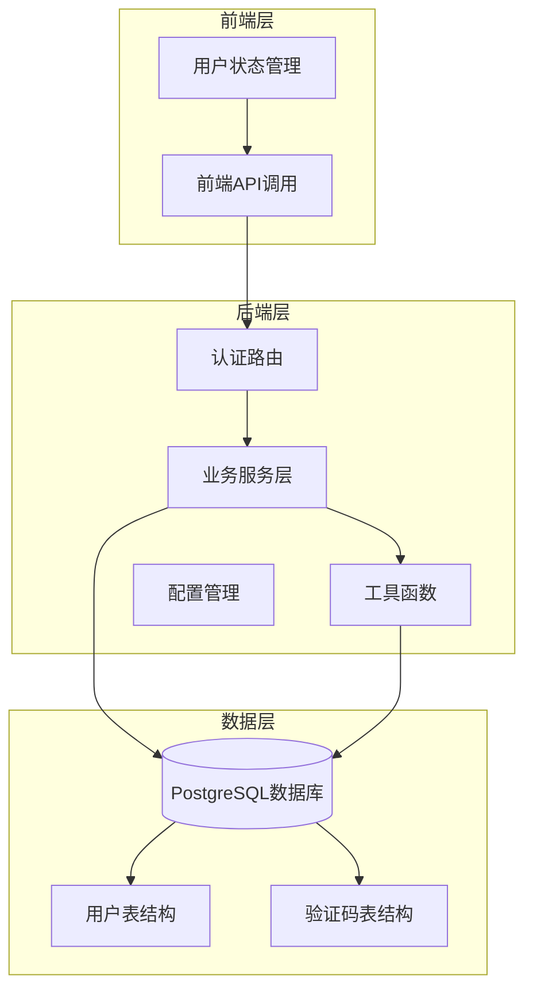

**图表来源**
- [auth.py:1-50](file://backend/app/routes/auth.py#L1-L50)
- [user_service.py:1-30](file://backend/app/services/user_service.py#L1-L30)
- [verification.py:15-32](file://backend/app/models/verification.py#L15-L32)

**章节来源**
- [auth.py:1-100](file://backend/app/routes/auth.py#L1-L100)
- [user_service.py:1-50](file://backend/app/services/user_service.py#L1-L50)

## 核心组件

### 用户服务层 (UserService)

UserService是认证系统的核心组件，负责用户管理和密码处理：

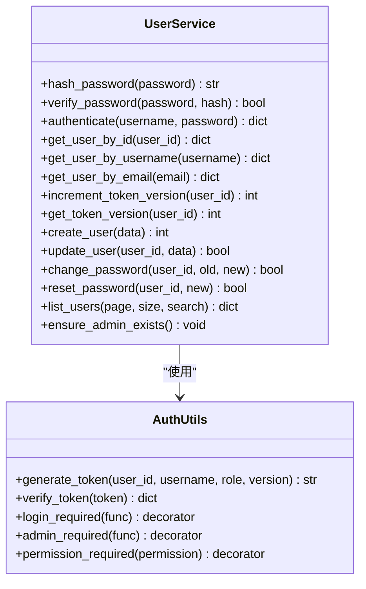

**图表来源**
- [user_service.py:56-701](file://backend/app/services/user_service.py#L56-L701)
- [auth.py:18-239](file://backend/app/utils/auth.py#L18-L239)

### 密码哈希机制

系统实现了双层密码哈希策略：

```mermaid
flowchart TD
Start([密码输入]) --> CheckBCrypt{bcrypt可用?}
CheckBCrypt --> |是| UseBCrypt[使用bcrypt哈希<br/>成本因子12]
CheckBCrypt --> |否| UseSHA256[使用SHA256哈希<br/>带盐值]
UseBCrypt --> BCryptSalt[生成12轮盐值]
BCryptSalt --> BCryptHash[bcrypt.hashpw]
UseSHA256 --> SHA256Salt[生成16字节随机盐]
SHA256Salt --> SHA256Hash[sha256(密码+盐)]
BCryptHash --> Store[存储哈希值]
SHA256Hash --> Store
Store --> Verify[验证密码]
Verify --> VerifyBCrypt{bcrypt哈希?}
VerifyBCrypt --> |是| BCryptVerify[bcrypt.checkpw]
VerifyBCrypt --> |否| SHA256Verify[sha256(密码+盐)比较]
BCryptVerify --> Success[验证成功]
SHA256Verify --> Success
```

**图表来源**
- [user_service.py:70-100](file://backend/app/services/user_service.py#L70-L100)

**章节来源**
- [user_service.py:19-100](file://backend/app/services/user_service.py#L19-L100)
- [auth.py:18-80](file://backend/app/utils/auth.py#L18-L80)

## 架构概览

### 认证流程架构

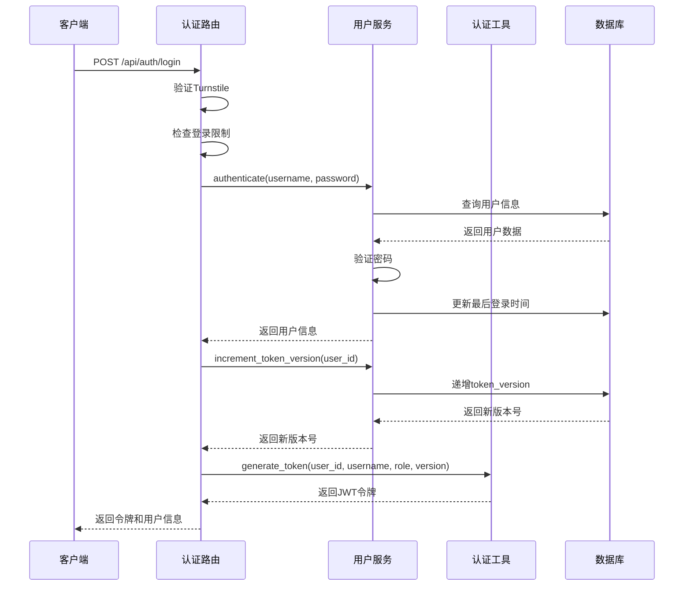

**图表来源**
- [auth.py:156-325](file://backend/app/routes/auth.py#L156-L325)
- [user_service.py:194-246](file://backend/app/services/user_service.py#L194-L246)
- [auth.py:18-48](file://backend/app/utils/auth.py#L18-L48)

### 单一客户端登录机制

系统通过token_version实现单一客户端登录控制：

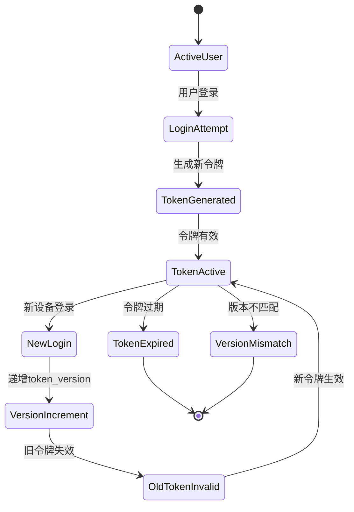

**图表来源**
- [user_service.py:274-313](file://backend/app/services/user_service.py#L274-L313)
- [auth.py:82-114](file://backend/app/utils/auth.py#L82-L114)

**章节来源**
- [auth.py:156-325](file://backend/app/routes/auth.py#L156-L325)
- [user_service.py:248-313](file://backend/app/services/user_service.py#L248-L313)
- [auth.py:82-114](file://backend/app/utils/auth.py#L82-L114)

## 详细组件分析

### 认证路由层

认证路由层提供了完整的用户认证API：

#### 登录端点

| 端点 | 方法 | 描述 | 请求参数 |
|------|------|------|----------|
| `/api/auth/login` | POST | 用户名/邮箱登录 | username/account, password, turnstile_token |
| `/api/auth/login-code` | POST | 邮箱验证码登录 | email, code, turnstile_token |
| `/api/auth/register` | POST | 用户注册 | email, code, username, password |
| `/api/auth/send-code` | POST | **新增** 发送验证码 | email, type, turnstile_token |
| `/api/auth/change-password` | POST | **新增** 修改密码 | code, new_password |

#### 验证码发送流程

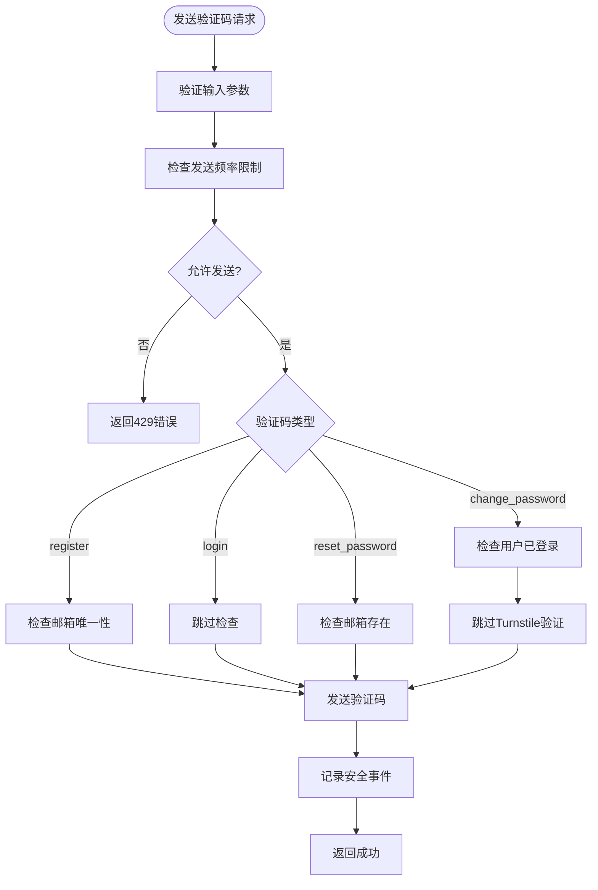

**图表来源**
- [auth.py:255-313](file://backend/app/routes/auth.py#L255-L313)

#### 注册流程

注册流程支持自动创建用户并分配初始资源：

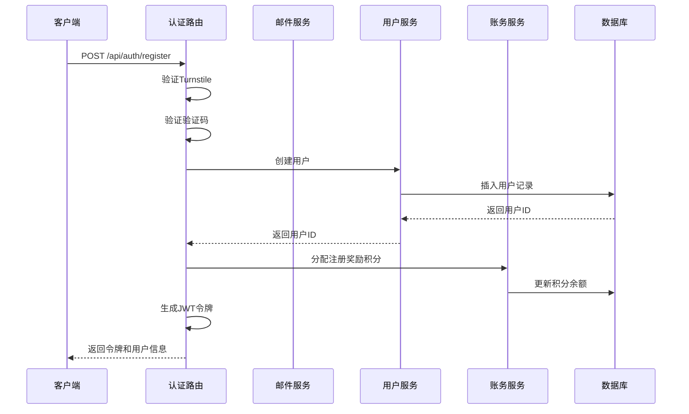

**图表来源**
- [auth.py:691-896](file://backend/app/routes/auth.py#L691-L896)

**章节来源**
- [auth.py:156-896](file://backend/app/routes/auth.py#L156-L896)

### 用户服务层

用户服务层提供了完整的用户管理功能：

#### 用户查询方法

| 方法 | 参数 | 返回值 | 描述 |
|------|------|--------|------|
| `get_user_by_id` | user_id | 用户信息字典 | 通过ID获取用户 |
| `get_user_by_username` | username | 用户信息字典 | 通过用户名获取用户 |
| `get_user_by_email` | email | 用户信息字典 | 通过邮箱获取用户 |
| `authenticate` | username, password | 用户信息字典 | 用户认证 |

#### 密码管理

密码管理实现了灵活的密码处理机制：

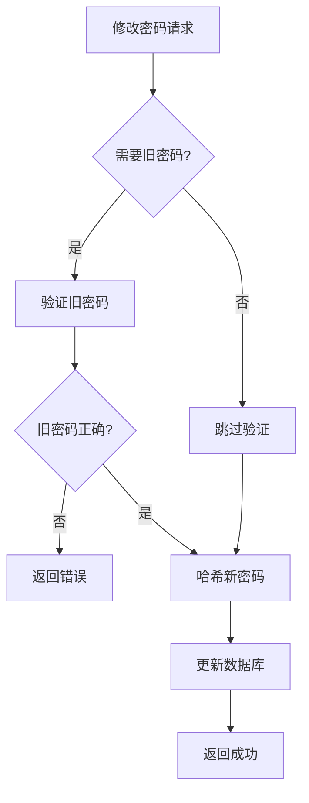

**图表来源**
- [user_service.py:456-484](file://backend/app/services/user_service.py#L456-L484)

**章节来源**
- [user_service.py:102-508](file://backend/app/services/user_service.py#L102-L508)

### 前端集成

前端通过API模块与认证系统交互：

#### 前端认证流程

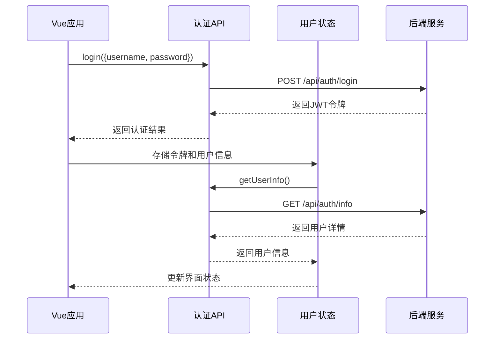

**图表来源**
- [auth.js:30-36](file://frontend/src/api/auth.js#L30-L36)
- [user.js:73-118](file://frontend/src/store/modules/user.js#L73-L118)

**章节来源**
- [auth.js:1-132](file://frontend/src/api/auth.js#L1-L132)
- [user.js:1-273](file://frontend/src/store/modules/user.js#L1-L273)

## 验证码增强系统

### 验证码发送端点

新增的验证码发送端点(/api/auth/send-code)提供了灵活的验证码发送功能：

#### 端点特性

| 特性 | 描述 |
|------|------|
| **验证码类型** | register, login, reset_password, change_password, change_email |
| **Turnstile验证** | 除change_password外均需验证 |
| **速率限制** | 邮箱每分钟1次，IP每小时10次 |
| **邮箱验证** | 验证邮箱格式有效性 |
| **安全日志** | 记录验证码发送事件 |

#### 验证码类型说明

| 类型 | 用途 | Turnstile验证 | 邮箱检查 |
|------|------|---------------|----------|
| register | 用户注册 | 必需 | 邮箱必须未注册 |
| login | 快速登录 | 必需 | 可选 |
| reset_password | 重置密码 | 必需 | 可选（但不泄露邮箱存在） |
| change_password | 修改密码 | **可选**（已登录用户） | 必需 |
| change_email | 更改邮箱 | 必需 | 必需 |

#### 验证码发送流程

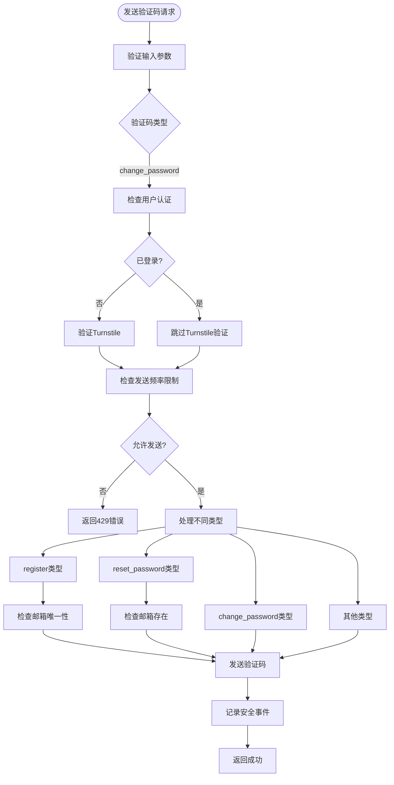

**图表来源**
- [auth.py:255-313](file://backend/app/routes/auth.py#L255-L313)

### 密码修改端点

新增的密码修改端点(/api/auth/change-password)允许已登录用户修改密码：

#### 端点特性

| 特性 | 描述 |
|------|------|
| **认证要求** | 需要有效的JWT令牌 |
| **验证码验证** | 使用验证码验证身份 |
| **密码强度** | 至少6位字符 |
| **邮箱关联** | 需要用户绑定邮箱 |

#### 密码修改流程

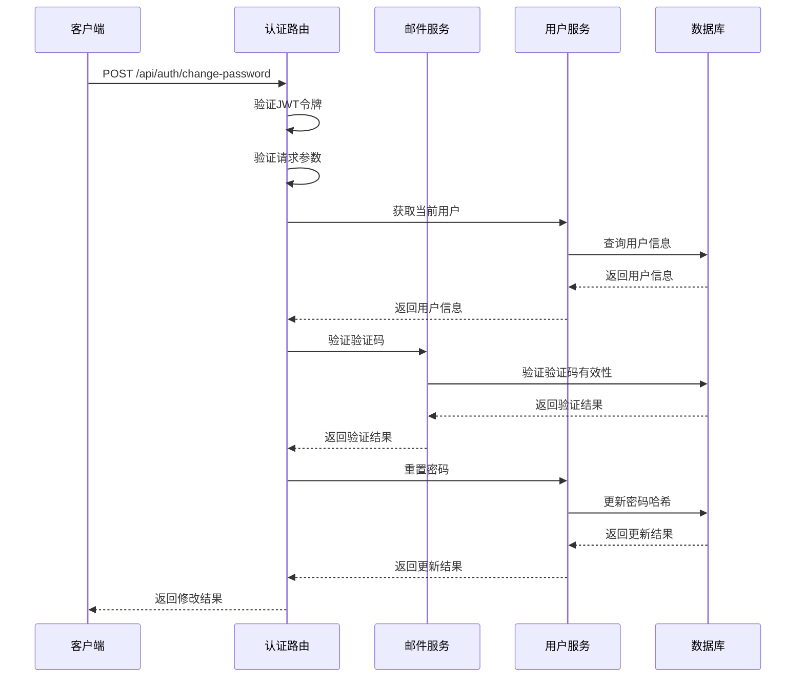

**图表来源**
- [auth.py:315-352](file://backend/app/routes/auth.py#L315-L352)

### 验证码系统增强

#### 速率限制机制

系统实现了多层次的验证码发送速率限制：

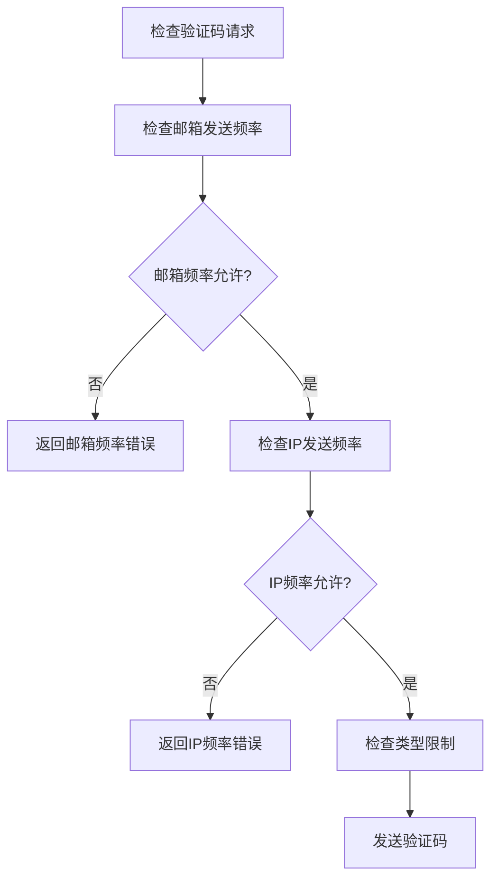

**图表来源**
- [security_service.py:159-180](file://backend/app/services/security_service.py#L159-L180)

#### 验证码存储管理

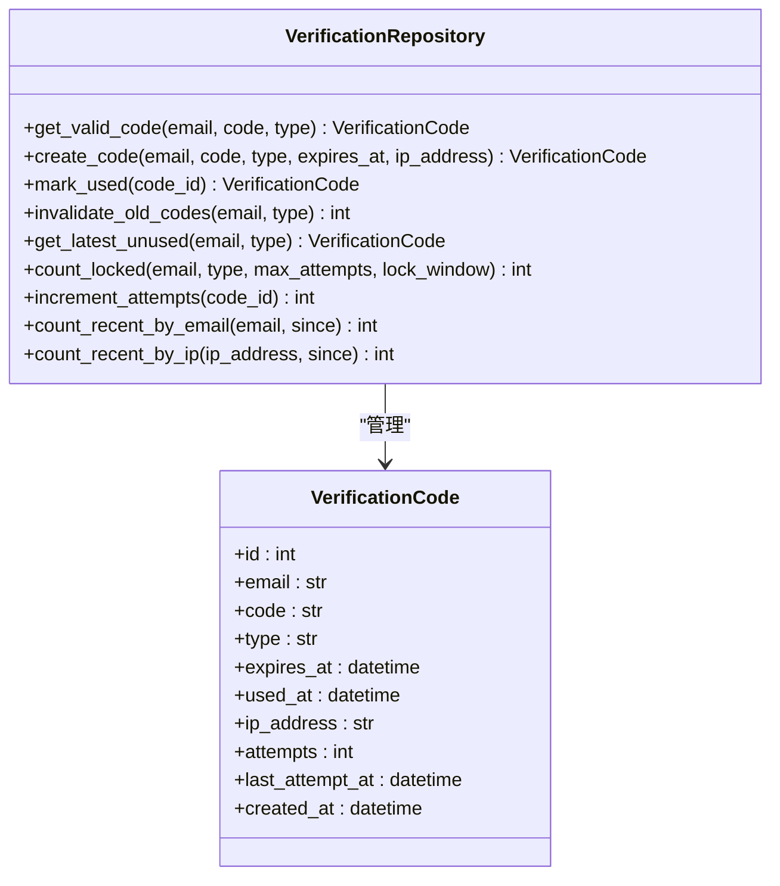

**图表来源**
- [verification_repository.py:10-142](file://backend/app/database/repositories/verification_repository.py#L10-L142)
- [verification.py:15-32](file://backend/app/models/verification.py#L15-L32)

**章节来源**
- [auth.py:255-352](file://backend/app/routes/auth.py#L255-L352)
- [security_service.py:159-180](file://backend/app/services/security_service.py#L159-L180)
- [verification_repository.py:10-142](file://backend/app/database/repositories/verification_repository.py#L10-L142)

## 依赖关系分析

### 组件依赖图

```mermaid
graph TB
subgraph "外部依赖"
JWT[jwt]
Bcrypt[bcrypt]
Postgres[psycopg2]
Flask[flask]
Requests[requests]
end
subgraph "内部模块"
AuthRoute[auth.py]
UserService[user_service.py]
SecurityService[security_service.py]
EmailService[email_service.py]
AuthUtils[auth.py(utils)]
Settings[settings.py]
DBUtils[db.py]
VerificationRepo[verification_repository.py]
VerificationModel[verification.py]
end
AuthRoute --> UserService
AuthRoute --> SecurityService
AuthRoute --> EmailService
AuthRoute --> AuthUtils
UserService --> DBUtils
SecurityService --> VerificationRepo
EmailService --> VerificationRepo
VerificationRepo --> VerificationModel
AuthUtils --> Settings
DBUtils --> Postgres
UserService -.-> Bcrypt
SecurityService -.-> Requests
EmailService -.-> SMTP
```

**图表来源**
- [auth.py:1-15](file://backend/app/routes/auth.py#L1-L15)
- [user_service.py:1-14](file://backend/app/services/user_service.py#L1-L14)
- [security_service.py:1-12](file://backend/app/services/security_service.py#L1-L12)
- [email_service.py:1-14](file://backend/app/services/email_service.py#L1-L14)

### 数据库模式

用户认证系统依赖以下关键表结构：

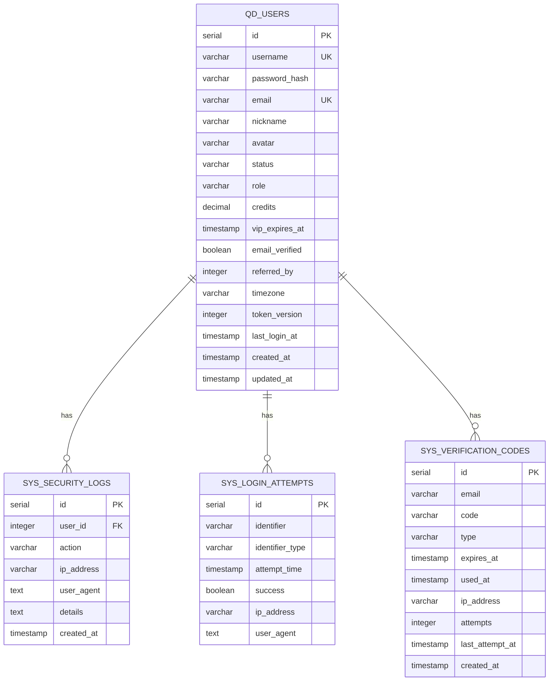

**图表来源**
- [init.sql:8-31](file://backend/migrations/init.sql#L8-L31)
- [init.sql:138-149](file://backend/migrations/init.sql#L138-L149)
- [init.sql:337-348](file://backend/migrations/init.sql#L337-L348)

**章节来源**
- [init.sql:8-31](file://backend/migrations/init.sql#L8-L31)
- [init.sql:138-149](file://backend/migrations/init.sql#L138-L149)
- [init.sql:337-348](file://backend/migrations/init.sql#L337-L348)

## 性能考虑

### 缓存策略

系统采用了多层次的缓存策略来提升性能：

1. **数据库连接池**：使用PostgreSQL连接池减少连接开销
2. **内存缓存**：用户信息在内存中缓存，减少数据库查询
3. **令牌缓存**：JWT令牌验证结果可以进行短期缓存
4. **验证码缓存**：验证码验证结果可以进行短期缓存

### 性能优化建议

1. **索引优化**：确保用户表和验证码表的关键字段有适当的索引
2. **批量操作**：对于大量用户操作，使用批量处理
3. **异步处理**：将非关键的后台任务异步化
4. **连接复用**：合理管理数据库连接，避免频繁创建销毁
5. **验证码清理**：定期清理过期的验证码记录

## 故障排除指南

### 常见问题及解决方案

#### 1. bcrypt安装问题

**问题**：系统提示bcrypt不可用
**解决方案**：
- 安装bcrypt依赖：`pip install bcrypt`
- 或者使用SHA256作为回退方案

#### 2. JWT令牌验证失败

**问题**：令牌验证总是失败
**解决方案**：
- 检查SECRET_KEY配置是否正确
- 确认令牌未过期
- 验证token_version是否匹配

#### 3. 登录频繁被限制

**问题**：登录尝试被限制
**解决方案**：
- 检查IP地址是否被标记为恶意
- 等待冷却时间结束
- 联系管理员解除限制

#### 4. 验证码发送失败

**问题**：验证码无法发送
**解决方案**：
- 检查邮件服务配置
- 验证发送频率限制
- 确认邮箱格式正确
- 检查Turnstile配置

#### 5. 验证码验证失败

**问题**：验证码无法验证
**解决方案**：
- 检查验证码是否过期
- 确认验证码类型正确
- 验证尝试次数限制
- 检查数据库连接

#### 6. 密码修改失败

**问题**：密码修改请求失败
**解决方案**：
- 检查验证码是否有效
- 确认新密码符合长度要求
- 验证用户是否已登录
- 检查数据库事务

**章节来源**
- [user_service.py:19-25](file://backend/app/services/user_service.py#L19-L25)
- [auth.py:50-80](file://backend/app/utils/auth.py#L50-L80)

## 结论

QuantDinger的用户认证系统是一个功能完整、安全性高的认证平台。系统的主要优势包括：

1. **多层安全防护**：结合了bcrypt密码哈希、JWT令牌、速率限制等多种安全机制
2. **灵活的认证方式**：支持用户名/邮箱登录、验证码登录、OAuth等多种方式
3. **单一客户端控制**：通过token_version实现有效的会话管理
4. **完善的错误处理**：提供了详细的错误信息和恢复机制
5. **良好的扩展性**：模块化设计便于功能扩展和维护
6. ****新增**：验证码系统增强了用户体验和安全性
7. ****新增**：支持多种验证码类型和灵活的发送策略
8. ****新增**：实现了多层次的速率限制和安全防护

系统在设计上充分考虑了安全性、性能和用户体验，在生产环境中表现稳定可靠。建议在部署时重点关注配置管理、监控告警和定期安全审计，以确保系统的长期安全运行。

**更新** 本次更新反映了系统新增的验证码发送和密码修改功能，以及增强的验证码系统，这些改进显著提升了系统的安全性和用户体验。