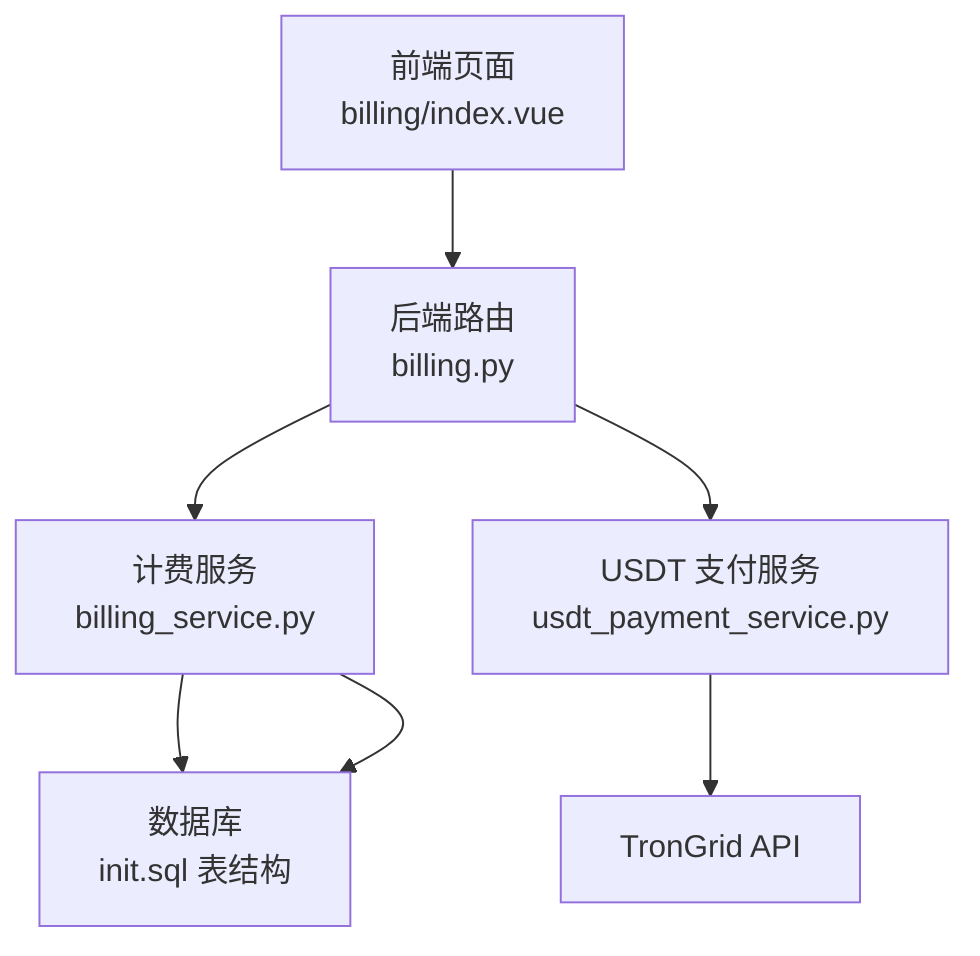
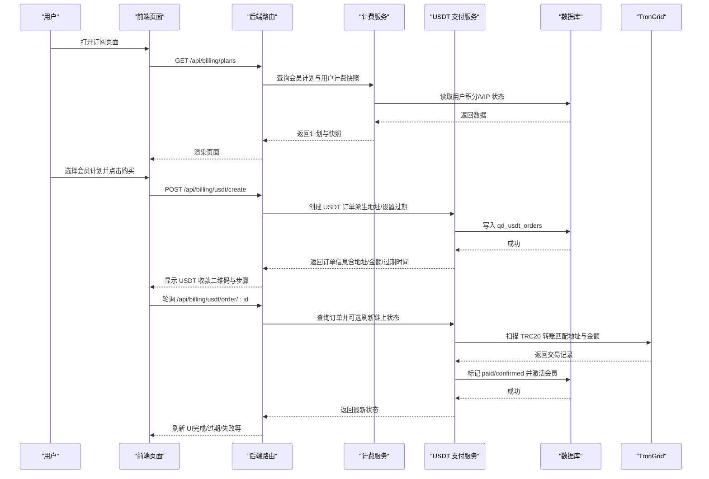
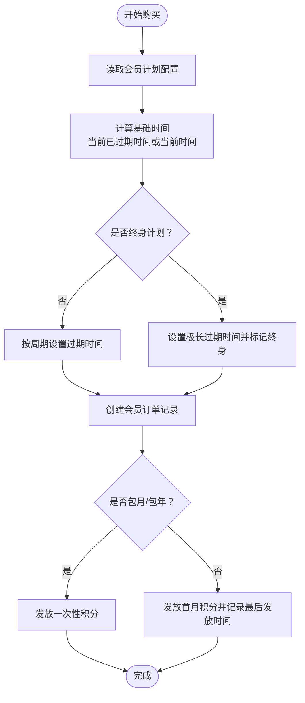
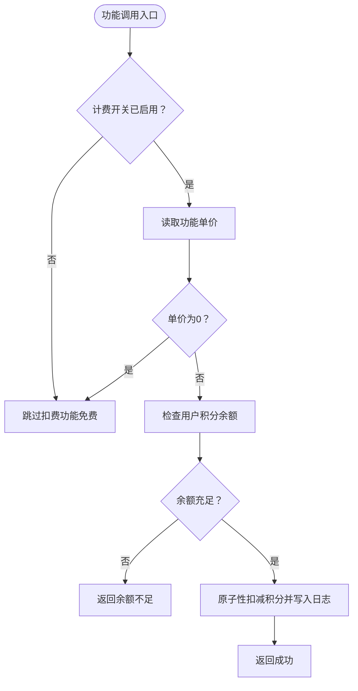
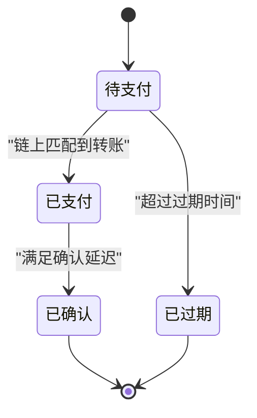
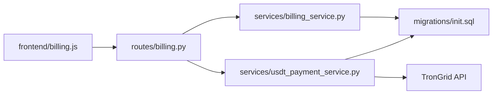
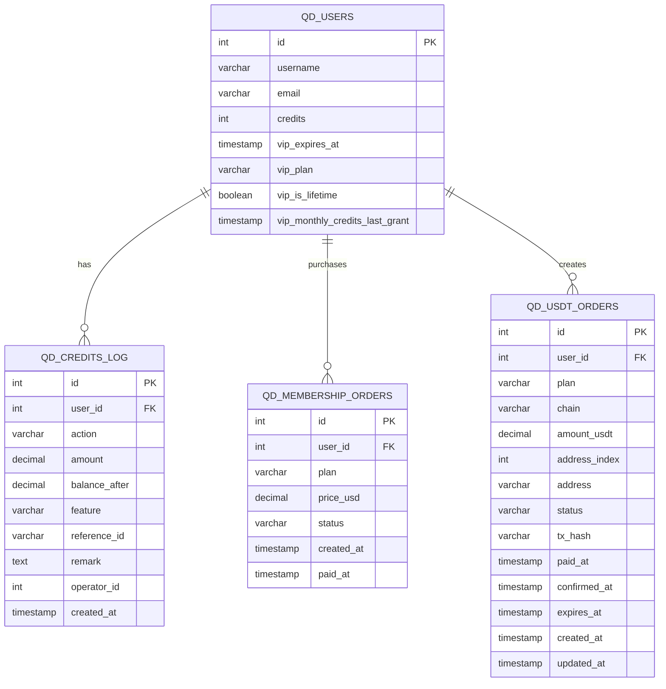

# 计费订阅系统

<cite>
**本文档引用的文件**
- [billing.py](file://backend_api_python/app/routes/billing.py)
- [billing_service.py](file://backend_api_python/app/services/billing_service.py)
- [usdt_payment_service.py](file://backend_api_python/app/services/usdt_payment_service.py)
- [billing.js](file://frontend/src/api/billing.js)
- [index.vue](file://frontend/src/views/billing/index.vue)
- [env.example](file://backend_api_python/env.example)
- [init.sql](file://backend_api_python/migrations/init.sql)
- [settings.py](file://backend_api_python/app/routes/settings.py)
- [db.py](file://backend_api_python/app/utils/db.py)
- [fast_analysis.py](file://backend_api_python/app/routes/fast_analysis.py)
</cite>

## 目录
1. [简介](#简介)
2. [项目结构](#项目结构)
3. [核心组件](#核心组件)
4. [架构总览](#架构总览)
5. [详细组件分析](#详细组件分析)
6. [依赖关系分析](#依赖关系分析)
7. [性能考虑](#性能考虑)
8. [故障排查指南](#故障排查指南)
9. [结论](#结论)
10. [附录](#附录)

## 简介
本文件为 QuantDinger 的计费订阅系统提供全面的技术文档，覆盖会员制度设计、订阅周期管理、费用计算逻辑、订阅状态管理、计费规则配置、到期处理流程、API 接口定义以及业务场景示例与故障处理方案。系统采用“积分+会员”双轨机制：全局计费开关控制是否启用积分消费；会员（VIP）状态用于展示套餐与权益，当前版本支持包月、包年与终身三种会员计划，并提供 USDT TRC20 扫码支付方案。

## 项目结构
计费订阅系统主要由以下模块构成：
- 后端路由层：提供订阅查询、购买、USDT 订单创建与查询等接口
- 计费服务层：统一处理积分余额、功能扣费、会员状态与套餐发放
- USDT 支付服务层：实现 TRC20 地址派生、订单创建、链上扫描与自动对账
- 前端页面与 API 封装：展示会员计划、发起购买、显示 USDT 收款二维码与状态
- 数据库迁移：定义用户表、积分日志、会员订单与 USDT 订单等表结构
- 环境变量与配置：通过 .env 控制计费开关、功能单价、会员价格与 USDT 参数

**图示来源**
- [billing.py:1-243](file://backend_api_python/app/routes/billing.py#L1-L243)
- [billing_service.py:1-747](file://backend_api_python/app/services/billing_service.py#L1-L747)
- [usdt_payment_service.py:1-820](file://backend_api_python/app/services/usdt_payment_service.py#L1-L820)
- [index.vue:1-839](file://frontend/src/views/billing/index.vue#L1-L839)
- [init.sql:25-190](file://backend_api_python/migrations/init.sql#L25-L190)

**章节来源**
- [billing.py:1-243](file://backend_api_python/app/routes/billing.py#L1-L243)
- [billing_service.py:1-747](file://backend_api_python/app/services/billing_service.py#L1-L747)
- [usdt_payment_service.py:1-820](file://backend_api_python/app/services/usdt_payment_service.py#L1-L820)
- [index.vue:1-839](file://frontend/src/views/billing/index.vue#L1-L839)
- [init.sql:25-190](file://backend_api_python/migrations/init.sql#L25-L190)

## 核心组件
- 计费服务（BillingService）
  - 负责积分余额查询、功能扣费、会员状态查询与套餐购买
  - 通过环境变量加载计费配置（全局开关、功能单价、会员价格与赠送积分）
  - 提供积分增减、管理员调整、VIP 状态设置与积分日志查询
- USDT 支付服务（UsdtPaymentService）
  - 基于 xpub 派生 TRC20 收款地址，为每个订单生成唯一地址
  - 通过 TronGrid API 扫描链上转账，匹配金额与收款地址后标记为已支付并激活会员
  - 支持后台工作线程定期轮询未确认订单，保证即使用户关闭浏览器也能完成激活
- 后端路由（billing.py）
  - 提供订阅计划查询、购买接口（Mock 支付）、USDT 订单创建与查询接口
- 前端页面（index.vue）
  - 展示用户积分与 VIP 状态快照
  - 提供三种会员计划的价格与权益展示
  - 集成 USDT 扫码支付流程，实时刷新订单状态

**章节来源**
- [billing_service.py:47-747](file://backend_api_python/app/services/billing_service.py#L47-L747)
- [usdt_payment_service.py:23-820](file://backend_api_python/app/services/usdt_payment_service.py#L23-L820)
- [billing.py:21-243](file://backend_api_python/app/routes/billing.py#L21-L243)
- [index.vue:1-839](file://frontend/src/views/billing/index.vue#L1-L839)

## 架构总览
系统采用“前端请求 → 后端路由 → 服务层处理 → 数据库/外部链上服务”的分层架构。计费与会员状态由服务层统一管理，USDT 支付通过独立服务对接 TronGrid 实现链上自动对账。

**图示来源**
- [billing.py:129-241](file://backend_api_python/app/routes/billing.py#L129-L241)
- [usdt_payment_service.py:132-245](file://backend_api_python/app/services/usdt_payment_service.py#L132-L245)
- [usdt_payment_service.py:538-600](file://backend_api_python/app/services/usdt_payment_service.py#L538-L600)
- [usdt_payment_service.py:744-800](file://backend_api_python/app/services/usdt_payment_service.py#L744-L800)

## 详细组件分析

### 会员制度与订阅周期管理
- 会员等级与计划
  - 包月：固定周期 30 天，购买后立即生效，可叠加当前有效期
  - 包年：固定周期 365 天，购买后立即生效，可叠加当前有效期
  - 终身：设置极长有效期并标记终身会员，首次购买发放首月积分，后续按 30 天周期补发月度积分（最多补 6 期）
- 会员状态判定
  - 以用户表中的 VIP 过期时间为准，若过期时间晚于当前 UTC 时间则视为有效
- 计费配置来源
  - 通过环境变量加载，可在系统设置界面动态调整（如计费开关、功能单价、会员价格与赠送积分）

**图示来源**
- [billing_service.py:202-335](file://backend_api_python/app/services/billing_service.py#L202-L335)
- [billing_service.py:386-448](file://backend_api_python/app/services/billing_service.py#L386-L448)

**章节来源**
- [billing_service.py:160-201](file://backend_api_python/app/services/billing_service.py#L160-L201)
- [billing_service.py:202-335](file://backend_api_python/app/services/billing_service.py#L202-L335)
- [billing_service.py:386-448](file://backend_api_python/app/services/billing_service.py#L386-L448)

### 费用计算逻辑与功能扣费
- 全局开关
  - 通过计费配置开关控制是否启用积分消费
- 功能单价
  - 支持多类功能的单价配置（如 AI 分析、AI 代码生成、深度分析等）
- 扣费流程
  - 若余额不足返回错误；否则原子性更新余额并记录积分日志
- 特殊说明
  - 当前版本不基于 VIP 做全局免扣旁路，VIP 主要用于展示与社区指标权益

**图示来源**
- [billing_service.py:450-515](file://backend_api_python/app/services/billing_service.py#L450-L515)

**章节来源**
- [billing_service.py:28-44](file://backend_api_python/app/services/billing_service.py#L28-L44)
- [billing_service.py:450-515](file://backend_api_python/app/services/billing_service.py#L450-L515)

### 订阅状态管理机制
- 状态流转
  - USDT 订单：pending → paid → confirmed；过期时间到达后从 pending 转为 expired
  - 会员状态：以 VIP 过期时间为准，终身会员按周期补发积分
- 自动续费与叠加
  - 包月/包年购买会叠加当前有效期内的时间，确保连续性
- 暂停与取消
  - 当前版本未实现暂停与取消订阅的显式接口；可通过管理员调整 VIP 过期时间实现冻结效果

**图示来源**
- [usdt_payment_service.py:282-360](file://backend_api_python/app/services/usdt_payment_service.py#L282-L360)
- [usdt_payment_service.py:396-420](file://backend_api_python/app/services/usdt_payment_service.py#L396-L420)

**章节来源**
- [usdt_payment_service.py:282-360](file://backend_api_python/app/services/usdt_payment_service.py#L282-L360)
- [usdt_payment_service.py:396-420](file://backend_api_python/app/services/usdt_payment_service.py#L396-L420)

### 计费规则配置实现
- 环境变量配置项
  - 计费开关与功能单价：BILLING_ENABLED、BILLING_COST_AI_ANALYSIS、BILLING_COST_AI_CODE_GEN 等
  - 会员计划：MEMBERSHIP_MONTHLY/YEARLY/LIFETIME 的价格与赠送积分
  - USDT 支付：USDT_PAY_ENABLED、USDT_PAY_CHAIN、USDT_TRC20_XPUB、TRONGRID_*、确认延迟与过期时间等
- 系统设置界面
  - 通过设置路由暴露上述配置项，支持在线修改与生效

**章节来源**
- [env.example:134-163](file://backend_api_python/env.example#L134-L163)
- [settings.py:732-767](file://backend_api_python/app/routes/settings.py#L732-L767)

### 订阅到期处理流程
- 到期检测
  - 前端展示 VIP 过期时间；服务端在查询会员状态时进行有效性判断
- 功能限制
  - 当计费开关开启且余额不足时，相关功能调用会返回余额不足提示
- 通知与续费引导
  - 前端在 USDT 收款页展示过期提示与成功提示，引导用户完成续费

**章节来源**
- [billing_service.py:117-156](file://backend_api_python/app/services/billing_service.py#L117-L156)
- [index.vue:195-220](file://frontend/src/views/billing/index.vue#L195-L220)

### API 接口文档
- 订阅计划查询
  - 方法：GET
  - 路径：/api/billing/plans
  - 权限：Bearer Token
  - 返回：计划列表与用户计费快照（积分、VIP 状态、功能单价等）
- 会员购买（Mock 支付）
  - 方法：POST
  - 路径：/api/billing/purchase
  - 请求体：{ plan: "monthly" | "yearly" | "lifetime" }
  - 返回：订单信息与新的 VIP 过期时间
- USDT 订单创建
  - 方法：POST
  - 路径：/api/billing/usdt/create
  - 请求体：{ plan: "monthly" | "yearly" | "lifetime" }
  - 返回：订单详情（含链、金额、地址、过期时间）
- USDT 订单查询
  - 方法：GET
  - 路径：/api/billing/usdt/order/:id
  - 查询参数：refresh（是否刷新链上状态）
  - 返回：订单最新状态与链上信息

**章节来源**
- [billing.py:21-122](file://backend_api_python/app/routes/billing.py#L21-L122)
- [billing.py:129-241](file://backend_api_python/app/routes/billing.py#L129-L241)

### 前端交互与用户体验
- 页面布局
  - 展示用户积分与 VIP 快照，突出终身会员的月度积分补发机制
  - 三种会员计划卡片展示价格与赠送积分
- USDT 支付流程
  - 创建订单后弹出模态框，展示收款二维码、收款地址、金额与过期时间
  - 步骤化展示 pending → paid → confirmed 状态变化
  - 支持手动刷新与自动轮询，过期/失败状态下给出明确提示

**章节来源**
- [index.vue:1-839](file://frontend/src/views/billing/index.vue#L1-L839)
- [billing.js:1-40](file://frontend/src/api/billing.js#L1-L40)

## 依赖关系分析
- 组件耦合
  - 路由层仅负责鉴权与参数校验，核心逻辑集中在服务层
  - 计费服务与 USDT 支付服务均依赖数据库连接工具与日志工具
- 外部依赖
  - USDT 支付依赖 TronGrid API 进行链上扫描
  - 前端通过封装的 billing.js 调用后端接口
- 数据库表
  - qd_users：用户基本信息与 VIP 字段
  - qd_credits_log：积分变动日志
  - qd_membership_orders：会员订单（Mock 支付）
  - qd_usdt_orders：USDT 订单与链上状态

**图示来源**
- [billing.py:9-18](file://backend_api_python/app/routes/billing.py#L9-L18)
- [billing_service.py:18-21](file://backend_api_python/app/services/billing_service.py#L18-L21)
- [usdt_payment_service.py:16-18](file://backend_api_python/app/services/usdt_payment_service.py#L16-L18)
- [init.sql:42-74](file://backend_api_python/migrations/init.sql#L42-L74)

**章节来源**
- [db.py:19-25](file://backend_api_python/app/utils/db.py#L19-L25)
- [init.sql:42-74](file://backend_api_python/migrations/init.sql#L42-L74)

## 性能考虑
- 配置缓存
  - 计费配置按 60 秒 TTL 缓存，降低频繁读取环境变量的开销
- 数据库连接
  - 使用统一的 PostgreSQL 连接工具，避免连接池耗尽
- 链上扫描优化
  - 订单状态刷新采用“短读事务 + 外部 HTTP + 短写事务”的模式，避免长时间持有连接
  - 后台工作线程批量扫描，减少峰值压力
- 前端轮询
  - USDT 订单轮询间隔为 5 秒，避免过于频繁的请求

**章节来源**
- [billing_service.py:55-80](file://backend_api_python/app/services/billing_service.py#L55-L80)
- [usdt_payment_service.py:538-600](file://backend_api_python/app/services/usdt_payment_service.py#L538-L600)
- [usdt_payment_service.py:744-800](file://backend_api_python/app/services/usdt_payment_service.py#L744-L800)
- [index.vue:408-413](file://frontend/src/views/billing/index.vue#L408-L413)

## 故障排查指南
- 计费开关未生效
  - 检查环境变量 BILLING_ENABLED 是否正确设置
  - 确认系统设置界面已保存配置
- 功能扣费失败
  - 检查用户积分余额是否充足
  - 查看积分日志确认扣费记录与余额变更
- USDT 支付未到账
  - 确认订单状态是否为 paid 或 confirmed
  - 检查 TronGrid 接口连通性与 API Key 配置
  - 核对收款地址与金额是否与链上记录一致
- 会员未激活
  - 检查后台工作线程是否运行
  - 确认订单已满足确认延迟并触发激活逻辑

**章节来源**
- [env.example:134-163](file://backend_api_python/env.example#L134-L163)
- [usdt_payment_service.py:744-800](file://backend_api_python/app/services/usdt_payment_service.py#L744-L800)
- [billing_service.py:664-717](file://backend_api_python/app/services/billing_service.py#L664-L717)

## 结论
QuantDinger 的计费订阅系统以“积分 + 会员”为核心，通过环境变量与系统设置实现灵活的计费规则配置，结合 USDT TRC20 扫码支付与链上自动对账，提供了从购买到激活的完整闭环。系统在性能与可靠性方面做了多项优化，适合快速迭代与扩展。未来可在此基础上接入真实支付网关、完善暂停/取消订阅流程，并引入折扣与促销活动的统一配置中心。

## 附录

### 数据模型概览

**图示来源**
- [init.sql:42-74](file://backend_api_python/migrations/init.sql#L42-L74)
- [init.sql:63-74](file://backend_api_python/migrations/init.sql#L63-L74)
- [init.sql:63-71](file://backend_api_python/migrations/init.sql#L63-L71)
- [init.sql:63-86](file://backend_api_python/migrations/init.sql#L63-L86)

### 业务场景示例
- 新用户购买包月会员
  - 前端调用创建 USDT 订单，展示二维码并轮询状态
  - 链上确认后自动激活会员并发放一次性积分
- 终身会员月度积分补发
  - 系统检测到到期时间与上次发放时间差超过 30 天，自动补发相应期数的月度积分
- 功能使用扣费
  - 用户执行某项功能时，系统检查计费开关与余额，成功后扣减积分并记录日志

**章节来源**
- [index.vue:343-406](file://frontend/src/views/billing/index.vue#L343-L406)
- [billing_service.py:386-448](file://backend_api_python/app/services/billing_service.py#L386-L448)
- [fast_analysis.py:219-237](file://backend_api_python/app/routes/fast_analysis.py#L219-L237)