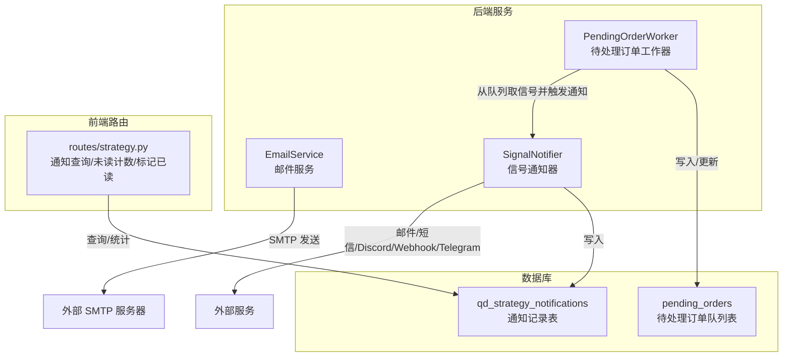
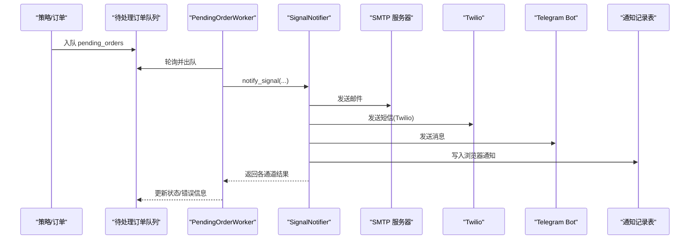
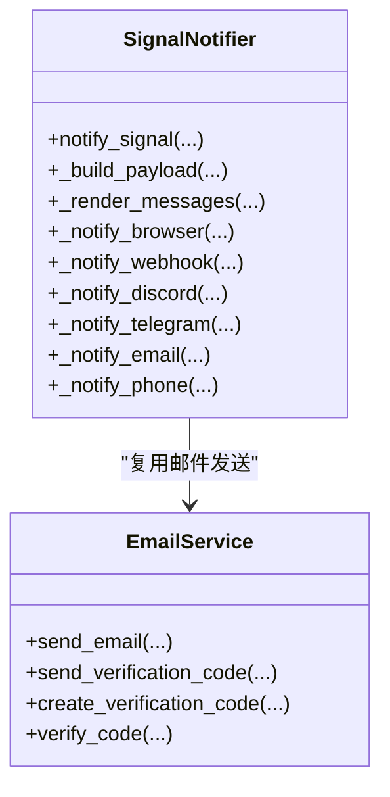
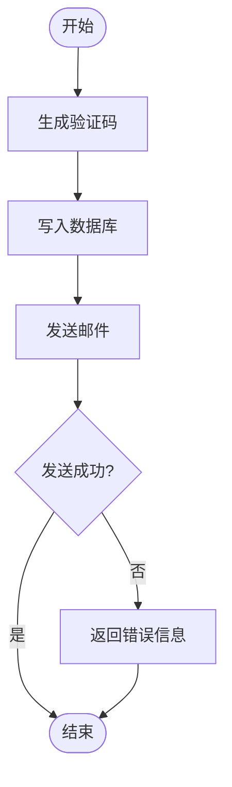
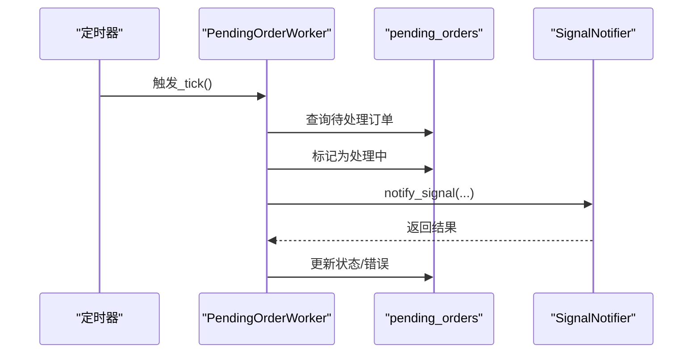
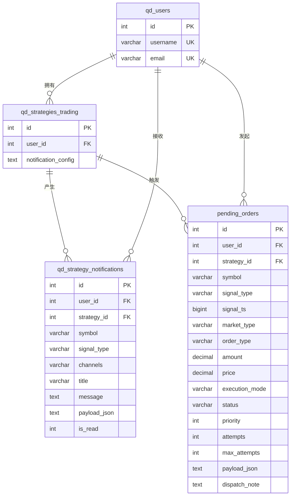
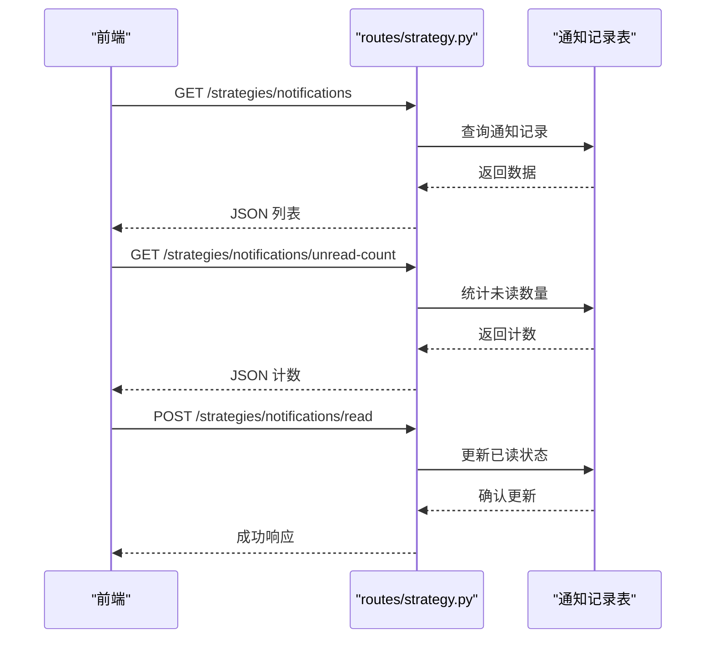
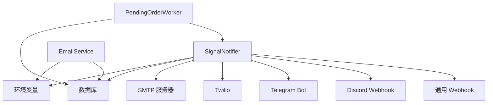

# 通知系统

<cite>
**本文引用的文件**
- [email_service.py](file://backend_api_python/app/services/email_service.py)
- [signal_notifier.py](file://backend_api_python/app/services/signal_notifier.py)
- [pending_order_worker.py](file://backend_api_python/app/services/pending_order_worker.py)
- [init.sql](file://backend_api_python/migrations/init.sql)
- [strategy.py](file://backend_api_python/app/routes/strategy.py)
- [NOTIFICATION_EMAIL_CONFIG_EN.md](file://docs/NOTIFICATION_EMAIL_CONFIG_EN.md)
- [NOTIFICATION_TELEGRAM_CONFIG_EN.md](file://docs/NOTIFICATION_TELEGRAM_CONFIG_EN.md)
- [NOTIFICATION_SMS_CONFIG_EN.md](file://docs/NOTIFICATION_SMS_CONFIG_EN.md)
- [env.example](file://backend_api_python/env.example)
</cite>

## 目录
1. [简介](#简介)
2. [项目结构](#项目结构)
3. [核心组件](#核心组件)
4. [架构总览](#架构总览)
5. [详细组件分析](#详细组件分析)
6. [依赖关系分析](#依赖关系分析)
7. [性能考虑](#性能考虑)
8. [故障排查指南](#故障排查指南)
9. [结论](#结论)
10. [附录](#附录)

## 简介
QuantDinger 的通知系统是一个多渠道通知基础设施，支持邮件、Telegram、短信（Twilio）、Discord Webhook、通用 HTTP Webhook 以及前端浏览器内通知。系统通过统一的信号通知器在策略执行、订单排队、账户变更、系统状态变化等场景下触发通知，并提供可扩展的通道扩展能力。

通知系统的关键特性：
- 多通道并行通知：同一信号可同时投递至多个渠道
- 统一消息渲染：根据渠道类型生成合适的纯文本、HTML 或富媒体内容
- 数据持久化：浏览器通知写入数据库，便于前端查看历史
- 可配置性：管理员可配置公共 SMTP/Twilio 参数；用户可在个人中心配置 Telegram、Discord、Webhook 等私有目标
- 可靠性：对部分外部服务提供最小重试与错误降级处理

## 项目结构
通知系统主要分布在以下模块：
- 后端服务层
  - 邮件服务：负责邮件发送与验证码流程
  - 信号通知器：统一构建消息、选择通道并投递
  - 待处理订单工作器：从队列取出待执行信号，触发通知
- 前端路由层
  - 提供通知查询、未读计数、标记已读等接口
- 数据库迁移
  - 定义通知相关表结构与索引
- 文档
  - 邮件、Telegram、短信配置指南

**图示来源**
- [signal_notifier.py:130-800](file://backend_api_python/app/services/signal_notifier.py#L130-L800)
- [email_service.py:29-362](file://backend_api_python/app/services/email_service.py#L29-L362)
- [pending_order_worker.py:52-800](file://backend_api_python/app/services/pending_order_worker.py#L52-L800)
- [init.sql:348-364](file://backend_api_python/migrations/init.sql#L348-L364)
- [strategy.py:2070-2269](file://backend_api_python/app/routes/strategy.py#L2070-L2269)

**章节来源**
- [signal_notifier.py:130-800](file://backend_api_python/app/services/signal_notifier.py#L130-L800)
- [email_service.py:29-362](file://backend_api_python/app/services/email_service.py#L29-L362)
- [pending_order_worker.py:52-800](file://backend_api_python/app/services/pending_order_worker.py#L52-L800)
- [init.sql:348-364](file://backend_api_python/migrations/init.sql#L348-L364)
- [strategy.py:2070-2269](file://backend_api_python/app/routes/strategy.py#L2070-L2269)

## 核心组件
- SignalNotifier：统一的信号通知器，负责解析策略配置、构建消息体、选择通道并投递，支持浏览器、Webhook、Discord、Telegram、邮件、短信等通道。
- EmailService：封装 SMTP 发送、验证码生成与校验、HTML/纯文本邮件构造。
- PendingOrderWorker：轮询待处理订单队列，将“signal”模式的订单转换为通知并投递，同时支持“live”模式下的辅助通知钩子。
- 数据模型：通知记录表与待处理订单表，支撑通知持久化与队列调度。

关键配置项（环境变量）：
- 邮件：SMTP_HOST、SMTP_PORT、SMTP_USER、SMTP_PASSWORD、SMTP_FROM、SMTP_USE_TLS、SMTP_USE_SSL
- 短信（Twilio）：TWILIO_ACCOUNT_SID、TWILIO_AUTH_TOKEN、TWILIO_FROM_NUMBER
- 通知超时：SIGNAL_NOTIFY_TIMEOUT_SEC
- Telegram：TELEGRAM_BOT_TOKEN（用户可在个人中心覆盖）

**章节来源**
- [signal_notifier.py:130-170](file://backend_api_python/app/services/signal_notifier.py#L130-L170)
- [email_service.py:32-55](file://backend_api_python/app/services/email_service.py#L32-L55)
- [env.example:92-102](file://backend_api_python/env.example#L92-L102)
- [env.example:230-234](file://backend_api_python/env.example#L230-L234)
- [env.example](file://backend_api_python/env.example#L184)

## 架构总览
通知系统采用“队列驱动 + 通道投递”的架构：
- 策略执行或订单进入待处理队列（pending_orders）
- 工作器从队列取出信号，调用通知器进行多通道投递
- 浏览器通知写入数据库，前端通过 API 查询与管理
- 外部服务（SMTP、Telegram、Discord、Twilio）作为异步投递目标

**图示来源**
- [pending_order_worker.py:712-798](file://backend_api_python/app/services/pending_order_worker.py#L712-L798)
- [signal_notifier.py:171-283](file://backend_api_python/app/services/signal_notifier.py#L171-L283)
- [init.sql:309-338](file://backend_api_python/migrations/init.sql#L309-L338)
- [init.sql:348-364](file://backend_api_python/migrations/init.sql#L348-L364)

## 详细组件分析

### SignalNotifier 组件分析
SignalNotifier 是通知系统的核心，负责：
- 解析策略通知配置（channels/targets）
- 构建标准化事件载荷（payload）
- 渲染多通道消息体（纯文本、HTML、富文本）
- 选择并投递到指定通道
- 记录浏览器通知到数据库

**图示来源**
- [signal_notifier.py:130-800](file://backend_api_python/app/services/signal_notifier.py#L130-L800)
- [email_service.py:29-362](file://backend_api_python/app/services/email_service.py#L29-L362)

**章节来源**
- [signal_notifier.py:130-800](file://backend_api_python/app/services/signal_notifier.py#L130-L800)

### EmailService 组件分析
EmailService 提供两类能力：
- 验证码流程：生成、存储、校验一次性验证码，带防暴力破解与锁定机制
- 邮件发送：基于 SMTP，支持 TLS/SSL，自动构造 HTML 与纯文本双版本

**图示来源**
- [email_service.py:67-213](file://backend_api_python/app/services/email_service.py#L67-L213)
- [email_service.py:218-276](file://backend_api_python/app/services/email_service.py#L218-L276)

**章节来源**
- [email_service.py:29-362](file://backend_api_python/app/services/email_service.py#L29-L362)

### PendingOrderWorker 组件分析
PendingOrderWorker 负责：
- 轮询待处理订单队列
- 标记处理中、回收“卡住”的订单
- 将“signal”模式的订单转换为通知并投递
- 在“live”模式下提供通知钩子（不影响订单状态）

**图示来源**
- [pending_order_worker.py:99-122](file://backend_api_python/app/services/pending_order_worker.py#L99-L122)
- [pending_order_worker.py:712-798](file://backend_api_python/app/services/pending_order_worker.py#L712-L798)

**章节来源**
- [pending_order_worker.py:52-800](file://backend_api_python/app/services/pending_order_worker.py#L52-L800)

### 数据模型与持久化
通知系统涉及两张关键表：
- qd_strategy_notifications：保存浏览器通知（标题、正文、payload、通道列表、是否已读）
- pending_orders：保存待处理订单（含信号、价格、数量、执行模式、通知配置等）

**图示来源**
- [init.sql:8-31](file://backend_api_python/migrations/init.sql#L8-L31)
- [init.sql:195-220](file://backend_api_python/migrations/init.sql#L195-L220)
- [init.sql:348-364](file://backend_api_python/migrations/init.sql#L348-L364)
- [init.sql:309-338](file://backend_api_python/migrations/init.sql#L309-L338)

**章节来源**
- [init.sql:348-364](file://backend_api_python/migrations/init.sql#L348-L364)
- [init.sql:309-338](file://backend_api_python/migrations/init.sql#L309-L338)

### 通知触发机制与场景
- 策略信号通知：策略产生买卖信号时，PendingOrderWorker 将其转换为通知并投递
- 账户变更提醒：可通过 Webhook/Discord/Telegram 推送账户状态变化
- 系统状态更新：工作器运行状态、队列积压、错误告警等
- 通知配置来源：
  - 策略级 notification_config（JSON 字符串或对象）
  - 用户个人中心默认配置（Telegram、Discord、Webhook、Email、Phone）
  - 管理员全局配置（公共 SMTP/Twilio）

**章节来源**
- [pending_order_worker.py:748-798](file://backend_api_python/app/services/pending_order_worker.py#L748-L798)
- [signal_notifier.py:171-283](file://backend_api_python/app/services/signal_notifier.py#L171-L283)

### 配置指南

#### 邮件通知配置
- 环境变量
  - SMTP_HOST、SMTP_PORT、SMTP_USER、SMTP_PASSWORD、SMTP_FROM、SMTP_USE_TLS、SMTP_USE_SSL
- 配置步骤
  - 获取 SMTP 服务商信息（不同提供商端口与加密方式不同）
  - 在 .env 中填写上述参数
  - 在策略配置中启用“Email”通道并填写收件人
- 测试与验证
  - 使用邮件服务的发送方法进行测试
  - 查看日志确认发送状态

**章节来源**
- [NOTIFICATION_EMAIL_CONFIG_EN.md:46-112](file://docs/NOTIFICATION_EMAIL_CONFIG_EN.md#L46-L112)
- [env.example:92-102](file://backend_api_python/env.example#L92-L102)
- [email_service.py:218-276](file://backend_api_python/app/services/email_service.py#L218-L276)

#### Telegram 通知配置
- 环境变量
  - TELEGRAM_BOT_TOKEN（用户可在个人中心覆盖）
- 配置步骤
  - 创建 Bot 并获取 Token
  - 获取用户 ID 或群组 ID
  - 在 .env 中配置 Token
  - 在策略配置中启用“Telegram”通道并填写 Chat ID
- 测试与验证
  - 确认已向 Bot 发送消息以激活
  - 查看日志确认发送状态

**章节来源**
- [NOTIFICATION_TELEGRAM_CONFIG_EN.md:77-100](file://docs/NOTIFICATION_TELEGRAM_CONFIG_EN.md#L77-L100)
- [signal_notifier.py:240-259](file://backend_api_python/app/services/signal_notifier.py#L240-L259)

#### 短信通知配置（Twilio）
- 环境变量
  - TWILIO_ACCOUNT_SID、TWILIO_AUTH_TOKEN、TWILIO_FROM_NUMBER
- 配置步骤
  - 注册 Twilio 账户并获取凭据
  - 购买短信发送号码
  - 在 .env 中配置三要素
  - 在策略配置中启用“Phone”通道并填写手机号
- 测试与验证
  - 查看 Twilio 控制台日志
  - 注意国际短信限制与费用

**章节来源**
- [NOTIFICATION_SMS_CONFIG_EN.md:87-131](file://docs/NOTIFICATION_SMS_CONFIG_EN.md#L87-L131)
- [env.example:230-234](file://backend_api_python/env.example#L230-L234)
- [signal_notifier.py:787-800](file://backend_api_python/app/services/signal_notifier.py#L787-L800)

#### Webhook/Discord 通知配置
- Webhook
  - 在策略配置中提供 webhook_url、可选 webhook_token、webhook_headers、webhook_signing_secret
  - 支持自动重试与签名验证
- Discord
  - 在策略配置中提供 Discord Webhook URL
  - 支持 Embed 富文本与回退纯文本

**章节来源**
- [signal_notifier.py:540-704](file://backend_api_python/app/services/signal_notifier.py#L540-L704)

### 前端交互与通知管理
- 通知查询接口：支持按策略或全局筛选、分页、时间戳过滤
- 未读计数接口：统计当前用户的未读通知数量
- 标记已读接口：将单条通知标记为已读

**图示来源**
- [strategy.py:2070-2141](file://backend_api_python/app/routes/strategy.py#L2070-L2141)
- [strategy.py:2144-2214](file://backend_api_python/app/routes/strategy.py#L2144-L2214)
- [strategy.py:2217-2269](file://backend_api_python/app/routes/strategy.py#L2217-L2269)

**章节来源**
- [strategy.py:2070-2269](file://backend_api_python/app/routes/strategy.py#L2070-L2269)

## 依赖关系分析
- SignalNotifier 依赖：
  - 环境变量（SMTP/Twilio/Telegram/超时）
  - 数据库（读取用户时区、持久化浏览器通知）
  - 外部服务（SMTP、Twilio、Telegram、Discord、Webhook）
- EmailService 依赖：
  - 环境变量（SMTP）
  - 数据库（验证码存储与校验）
- PendingOrderWorker 依赖：
  - 队列表（pending_orders）
  - SignalNotifier
  - 外部服务（用于 live 模式的通知钩子）

**图示来源**
- [signal_notifier.py:148-170](file://backend_api_python/app/services/signal_notifier.py#L148-L170)
- [email_service.py:32-55](file://backend_api_python/app/services/email_service.py#L32-L55)
- [pending_order_worker.py](file://backend_api_python/app/services/pending_order_worker.py#L59)

**章节来源**
- [signal_notifier.py:148-170](file://backend_api_python/app/services/signal_notifier.py#L148-L170)
- [email_service.py:32-55](file://backend_api_python/app/services/email_service.py#L32-L55)
- [pending_order_worker.py](file://backend_api_python/app/services/pending_order_worker.py#L59)

## 性能考虑
- 通知超时控制：SIGNAL_NOTIFY_TIMEOUT_SEC 控制外部服务请求超时，避免阻塞
- 最小重试：Webhook、Discord 在特定错误码下进行一次重试
- 批量与并发：PendingOrderWorker 以批处理方式轮询队列，降低数据库压力
- 数据库索引：通知与队列表均建立必要索引，提升查询与写入效率
- 邮件发送：根据端口与加密标志自动选择 SSL/TLS，避免不必要的握手开销

**章节来源**
- [env.example](file://backend_api_python/env.example#L184)
- [signal_notifier.py:560-628](file://backend_api_python/app/services/signal_notifier.py#L560-L628)
- [signal_notifier.py:630-704](file://backend_api_python/app/services/signal_notifier.py#L630-L704)
- [init.sql:341-343](file://backend_api_python/migrations/init.sql#L341-L343)
- [init.sql:362-364](file://backend_api_python/migrations/init.sql#L362-L364)

## 故障排查指南
- 邮件发送失败
  - 检查 SMTP 凭据与加密配置
  - 查看认证错误与网络超时
  - 确认发件地址与域名 DNS 记录（SPF/DKIM/DMARC）
- Telegram 未收到通知
  - 确认已向 Bot 发送消息以激活
  - 检查 Token 与 Chat ID
  - 确认环境变量与用户配置优先级
- 短信发送失败（Twilio）
  - 检查账户 SID、Token、发件号码
  - 查看国际短信限制与费用
  - 参考 Twilio 控制台日志定位问题
- Webhook/Discord 投递失败
  - 检查 URL、Token、Headers
  - 查看签名验证与重试逻辑
  - 关注 429/5xx 错误码与回退策略

**章节来源**
- [NOTIFICATION_EMAIL_CONFIG_EN.md:202-244](file://docs/NOTIFICATION_EMAIL_CONFIG_EN.md#L202-L244)
- [NOTIFICATION_TELEGRAM_CONFIG_EN.md:103-120](file://docs/NOTIFICATION_TELEGRAM_CONFIG_EN.md#L103-L120)
- [NOTIFICATION_SMS_CONFIG_EN.md:158-193](file://docs/NOTIFICATION_SMS_CONFIG_EN.md#L158-L193)
- [signal_notifier.py:540-704](file://backend_api_python/app/services/signal_notifier.py#L540-L704)

## 结论
QuantDinger 的通知系统通过统一的 SignalNotifier 实现多通道并行投递，结合队列与数据库持久化，满足策略信号、账户变更与系统状态等多场景通知需求。系统具备良好的可配置性与可扩展性，能够快速接入新的通知渠道，并通过最小重试与超时控制保障可靠性。配合完善的配置文档与故障排查指南，可帮助用户高效部署与维护通知体系。

## 附录
- 相关文档链接
  - 邮件 SMTP 配置指南
  - Telegram 通知配置指南
  - 短信通知（Twilio）配置指南
  - 策略开发指南

**章节来源**
- [NOTIFICATION_EMAIL_CONFIG_EN.md:248-253](file://docs/NOTIFICATION_EMAIL_CONFIG_EN.md#L248-L253)
- [NOTIFICATION_TELEGRAM_CONFIG_EN.md:122-127](file://docs/NOTIFICATION_TELEGRAM_CONFIG_EN.md#L122-L127)
- [NOTIFICATION_SMS_CONFIG_EN.md:206-211](file://docs/NOTIFICATION_SMS_CONFIG_EN.md#L206-L211)