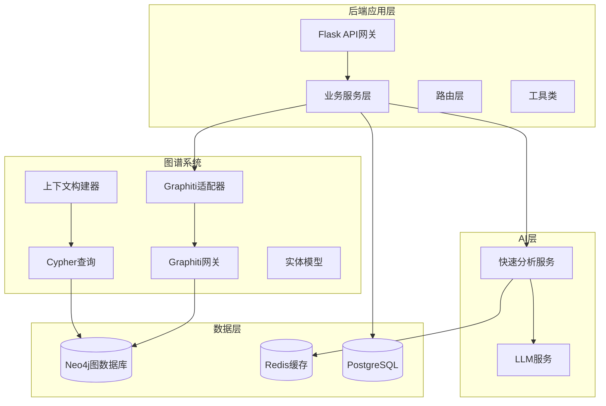
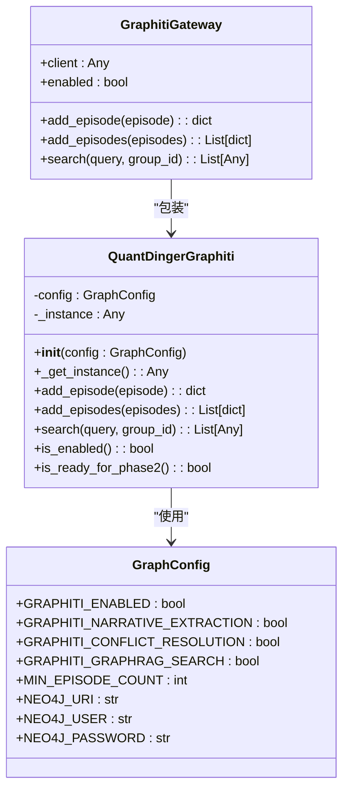
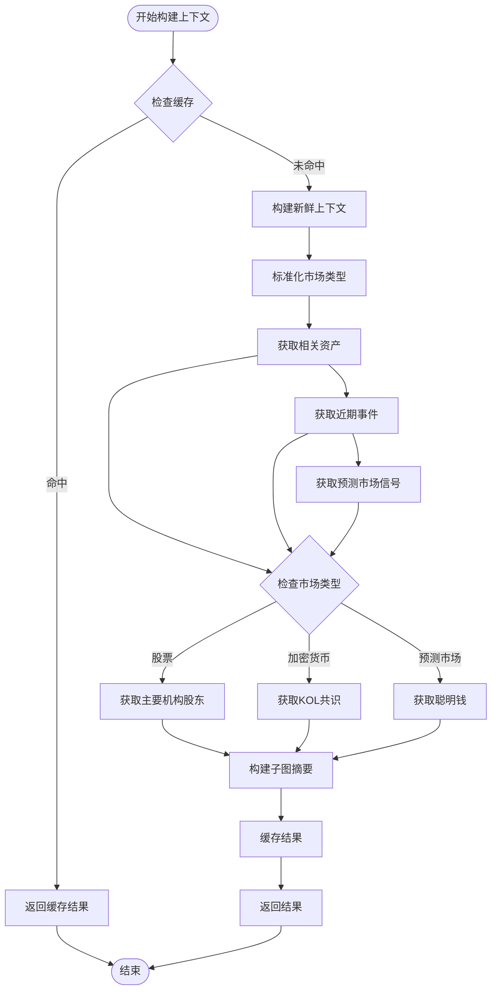
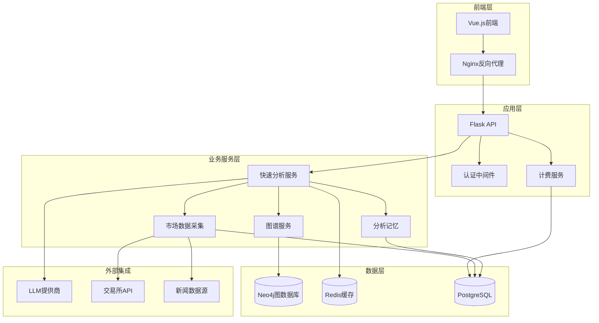
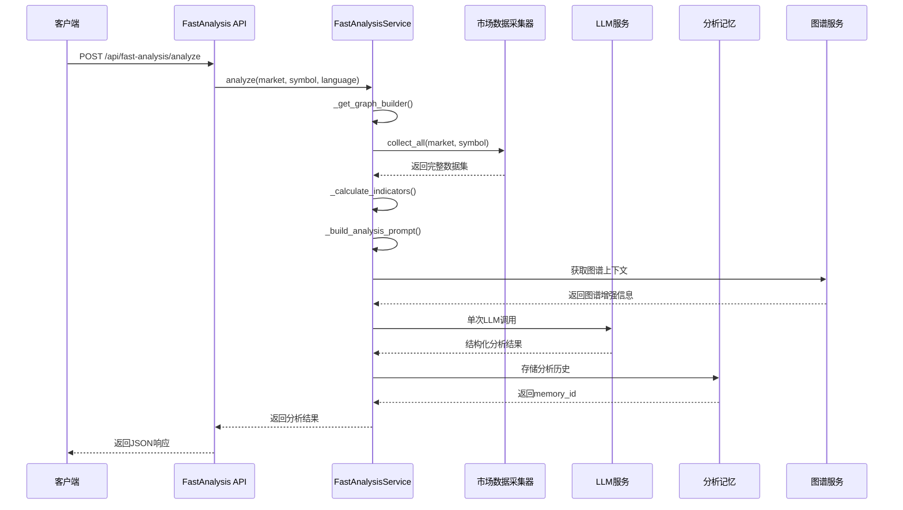
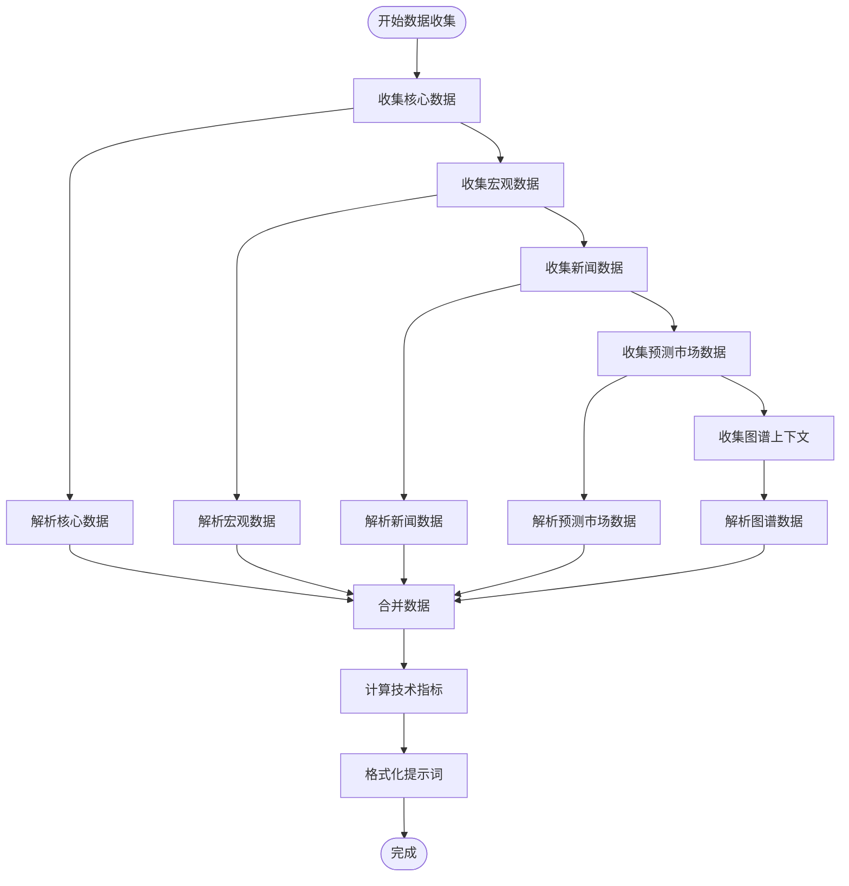
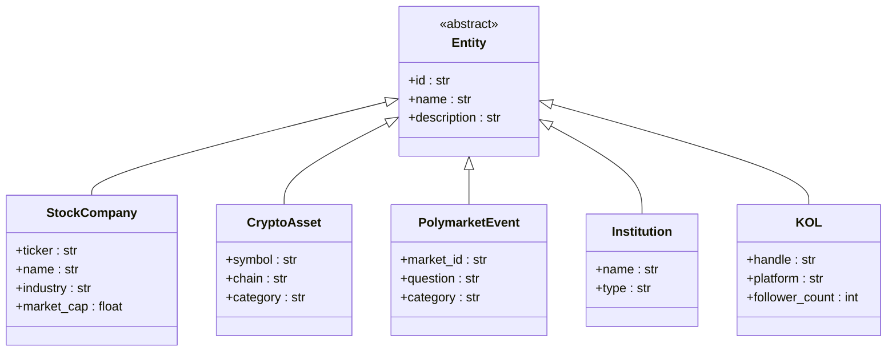
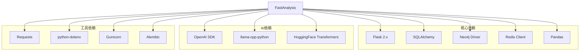

# 知识图谱分析系统

<cite>
**本文档引用的文件**
- [README.md](file://README.md)
- [backend/README.md](file://backend/README.md)
- [frontend/README.md](file://frontend/README.md)
- [run.py](file://backend/run.py)
- [graphiti_gateway.py](file://backend/app/graph/graphiti_gateway.py)
- [graphiti_adapter.py](file://backend/app/graph/graphiti_adapter.py)
- [context_builder.py](file://backend/app/graph/context_builder.py)
- [entities.py](file://backend/app/graph/entities.py)
- [queries.py](file://backend/app/graph/queries.py)
- [cache_gateway.py](file://backend/app/graph/cache_gateway.py)
- [graph_config.py](file://backend/app/config/graph_config.py)
- [connection.py](file://backend/app/graph/connection.py)
- [fast_analysis.py](file://backend/app/services/fast_analysis.py)
- [fast_analysis_routes.py](file://backend/app/route/fast_analysis.py)
- [analysis_model.py](file://backend/app/models/analysis.py)
</cite>

## 目录
1. [简介](#简介)
2. [项目结构](#项目结构)
3. [核心组件](#核心组件)
4. [架构概览](#架构概览)
5. [详细组件分析](#详细组件分析)
6. [依赖关系分析](#依赖关系分析)
7. [性能考虑](#性能考虑)
8. [故障排除指南](#故障排除指南)
9. [结论](#结论)

## 简介

QuantDinger是一个基于Flask的Python后端系统，专注于知识图谱分析和AI驱动的量化交易研究。该系统集成了知识图谱技术，通过Graphiti框架实现实体关系抽取、事件管理和智能搜索功能。

系统的核心特色包括：
- **多市场数据层**：支持加密货币、美股、外汇、期货等多种市场的数据采集
- **AI多代理分析**：集成OpenRouter LLM提供快速市场分析
- **策略运行时**：支持多用户环境下的策略执行
- **知识图谱集成**：通过Graphiti实现实体关系抽取和智能搜索
- **缓存优化**：使用Redis进行图谱查询缓存

## 项目结构

**图表来源**
- [run.py:100-151](file://backend/run.py#L100-L151)
- [graphiti_adapter.py:16-106](file://backend/app/graph/graphiti_adapter.py#L16-L106)
- [fast_analysis.py:186-214](file://backend/app/services/fast_analysis.py#L186-L214)

**章节来源**
- [README.md:265-351](file://README.md#L265-L351)
- [backend/README.md:15-33](file://backend/README.md#L15-L33)

## 核心组件

### 图谱适配器层

图谱适配器是系统的核心组件，负责管理Graphiti实例的生命周期和优雅降级机制。

**图表来源**
- [graphiti_adapter.py:16-106](file://backend/app/graph/graphiti_adapter.py#L16-L106)
- [graph_config.py:5-41](file://backend/app/config/graph_config.py#L5-L41)
- [graphiti_gateway.py:10-48](file://backend/app/graph/graphiti_gateway.py#L10-L48)

### 上下文构建器

上下文构建器负责从多个数据源收集和整合图谱信息，提供统一的分析上下文。

**图表来源**
- [context_builder.py:15-106](file://backend/app/graph/context_builder.py#L15-L106)

**章节来源**
- [context_builder.py:15-106](file://backend/app/graph/context_builder.py#L15-L106)
- [cache_gateway.py:5-26](file://backend/app/graph/cache_gateway.py#L5-L26)

## 架构概览

系统采用分层架构设计，实现了清晰的关注点分离：

**图表来源**
- [README.md:297-351](file://README.md#L297-L351)
- [run.py:100-151](file://backend/run.py#L100-L151)

## 详细组件分析

### 快速分析服务

快速分析服务是系统的核心AI组件，提供单次LLM调用的综合市场分析。

**图表来源**
- [fast_analysis.py:186-214](file://backend/app/services/fast_analysis.py#L186-L214)
- [fast_analysis_routes.py:116-354](file://backend/app/route/fast_analysis.py#L116-L354)

#### 数据收集流程

快速分析服务使用统一的数据采集器收集多维度市场数据：

**图表来源**
- [fast_analysis.py:217-248](file://backend/app/services/fast_analysis.py#L217-L248)

**章节来源**
- [fast_analysis.py:186-800](file://backend/app/services/fast_analysis.py#L186-L800)

### 图谱实体模型

系统定义了多种图谱实体类型，支持不同市场的知识表示：

**图表来源**
- [entities.py:19-57](file://backend/app/graph/entities.py#L19-L57)

**章节来源**
- [entities.py:12-57](file://backend/app/graph/entities.py#L12-L57)

### Cypher查询层

系统提供了针对不同领域优化的Cypher查询函数：

| 查询类型 | 功能描述 | 关键参数 | 性能特点 |
|---------|---------|---------|---------|
| find_related_assets | 查找相关资产 | symbol, market, depth | 支持多跳关系查询 |
| get_recent_events | 获取近期事件 | symbol, limit | 时间排序，限制数量 |
| get_prediction_market_signals | 获取预测市场信号 | symbol | 关联预测市场事件 |
| get_stock_holders | 获取机构股东 | ticker | 股权关系查询 |
| get_crypto_kol_consensus | 获取KOL共识 | symbol | 资产持有者统计 |
| get_polymarket_smart_money | 获取聪明钱 | market_id | 用户交易行为分析 |

**章节来源**
- [queries.py:7-79](file://backend/app/graph/queries.py#L7-L79)

## 依赖关系分析

**图表来源**
- [README.md:527-545](file://README.md#L527-L545)

**章节来源**
- [README.md:527-566](file://README.md#L527-L566)

## 性能考虑

### 缓存策略

系统采用了多层次的缓存机制来优化性能：

1. **图谱查询缓存**：使用Redis缓存图谱查询结果，减少Neo4j查询压力
2. **上下文缓存**：缓存完整的分析上下文，避免重复构建
3. **LLM响应缓存**：缓存相似查询的LLM响应
4. **静态资源缓存**：前端静态资源通过Nginx缓存

### 并发处理

- **异步分析任务**：支持后台分析任务，避免阻塞主线程
- **并发控制**：使用锁机制防止重复分析请求
- **连接池管理**：合理配置数据库和外部API连接池

### 内存优化

- **流式数据处理**：大数据集采用流式处理方式
- **分页查询**：大量数据采用分页查询避免内存溢出
- **及时释放**：及时释放不再使用的对象和连接

## 故障排除指南

### 常见问题及解决方案

| 问题类型 | 症状 | 可能原因 | 解决方案 |
|---------|------|---------|---------|
| 图谱连接失败 | Graphiti初始化失败 | Neo4j服务不可达 | 检查NEO4J_URI配置和网络连通性 |
| LLM调用超时 | 分析服务响应缓慢 | 外部API响应慢 | 增加超时时间，检查网络代理设置 |
| 缓存失效 | 查询结果不一致 | Redis连接异常 | 重启Redis服务，检查连接配置 |
| 数据缺失 | 分析结果不完整 | 数据源访问失败 | 检查API密钥和配额限制 |
| 权限错误 | 访问被拒绝 | JWT令牌过期或无效 | 重新登录获取新令牌 |

### 监控和调试

- **日志级别**：生产环境使用INFO级别，开发环境使用DEBUG级别
- **性能监控**：监控关键指标如响应时间、错误率、缓存命中率
- **健康检查**：定期检查各服务的健康状态

**章节来源**
- [backend/README.md:231-237](file://backend/README.md#L231-L237)

## 结论

QuantDinger的知识图谱分析系统通过以下关键特性实现了高效的AI驱动量化分析：

1. **模块化架构**：清晰的分层设计使得系统易于维护和扩展
2. **优雅降级**：在外部服务不可用时提供降级方案，保证系统稳定性
3. **性能优化**：多层次缓存和并发处理机制确保高并发场景下的响应速度
4. **可扩展性**：插件化的数据源和AI服务集成支持灵活的功能扩展
5. **安全性**：完善的认证授权机制和数据隔离确保系统安全

该系统为量化研究人员和交易员提供了强大的知识图谱分析能力，通过AI驱动的洞察帮助做出更明智的投资决策。其开源特性和自托管架构使其成为个人和团队的理想选择。