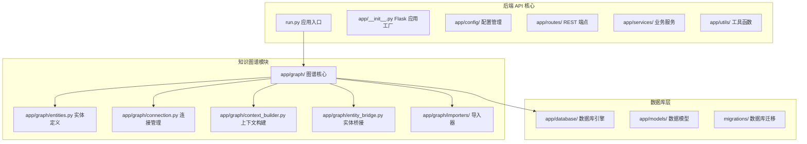
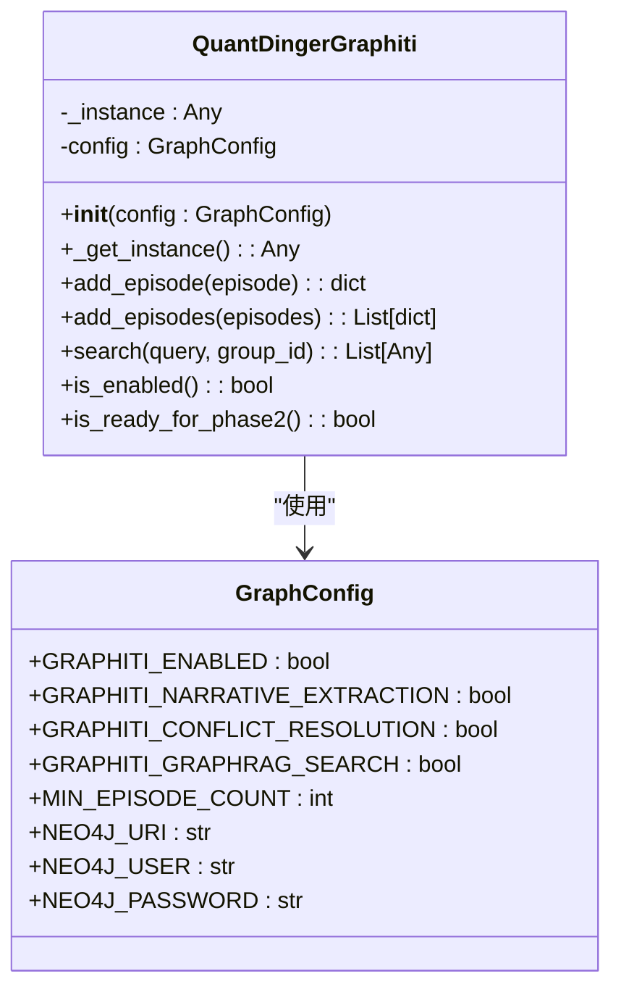
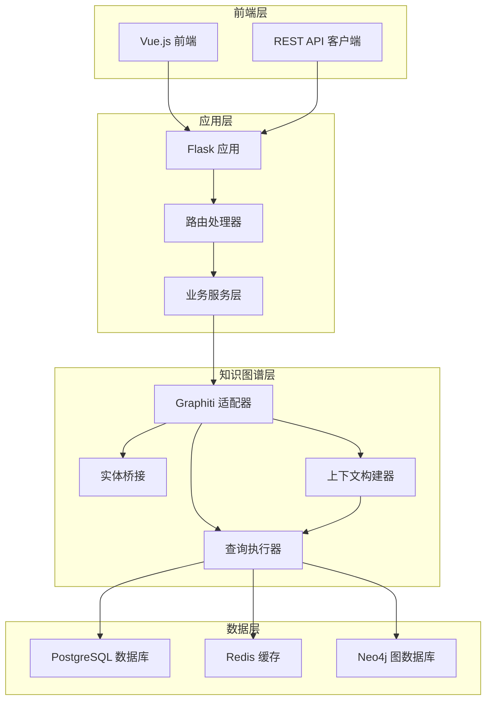
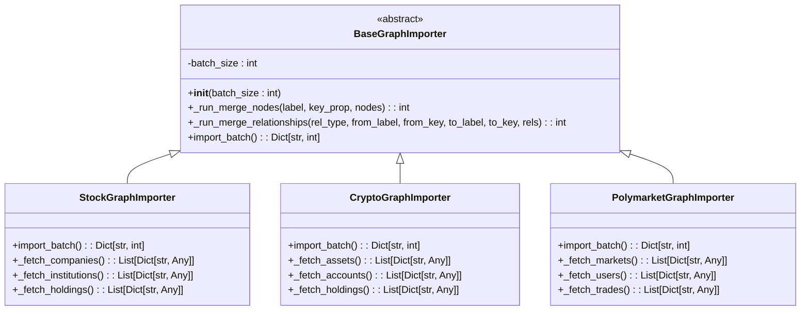
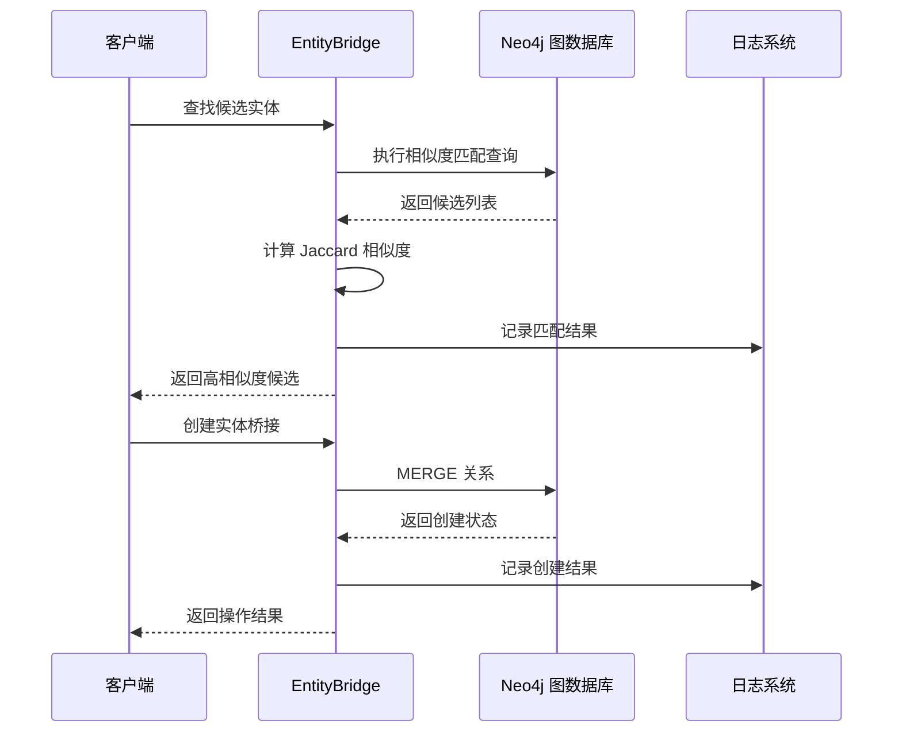
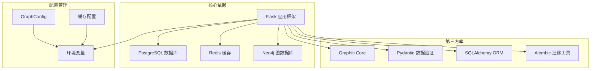

# 知识图谱基础设施

<cite>
**本文档引用的文件**
- [backend_api_python/README.md](file://backend_api_python/README.md)
- [backend_api_python/run.py](file://backend_api_python/run.py)
- [backend_api_python/app/graph/entities.py](file://backend_api_python/app/graph/entities.py)
- [backend_api_python/app/graph/connection.py](file://backend_api_python/app/graph/connection.py)
- [backend_api_python/app/config/graph_config.py](file://backend_api_python/app/config/graph_config.py)
- [backend_api_python/app/graph/graphiti_adapter.py](file://backend_api_python/app/graph/graphiti_adapter.py)
- [backend_api_python/app/graph/context_builder.py](file://backend_api_python/app/graph/context_builder.py)
- [backend_api_python/app/graph/entity_bridge.py](file://backend_api_python/app/graph/entity_bridge.py)
- [backend_api_python/app/graph/queries.py](file://backend_api_python/app/graph/queries.py)
- [backend_api_python/app/graph/cache_gateway.py](file://backend_api_python/app/graph/cache_gateway.py)
- [backend_api_python/app/graph/importers/base.py](file://backend_api_python/app/graph/importers/base.py)
- [backend_api_python/app/graph/importers/stock_importer.py](file://backend_api_python/app/graph/importers/stock_importer.py)
- [backend_api_python/app/graph/importers/crypto_importer.py](file://backend_api_python/app/graph/importers/crypto_importer.py)
- [backend_api_python/app/graph/importers/polymarket_importer.py](file://backend_api_python/app/graph/importers/polymarket_importer.py)
</cite>

## 目录
1. [简介](#简介)
2. [项目结构](#项目结构)
3. [核心组件](#核心组件)
4. [架构概览](#架构概览)
5. [详细组件分析](#详细组件分析)
6. [依赖关系分析](#依赖关系分析)
7. [性能考虑](#性能考虑)
8. [故障排除指南](#故障排除指南)
9. [结论](#结论)

## 简介

QuantDinger 是一个基于 Flask 的金融知识图谱基础设施，专注于多市场数据整合、智能分析和策略执行。该项目的核心是构建一个强大的知识图谱系统，用于连接股票、加密货币、外汇、期货等不同市场的实体和关系。

该系统的主要特点包括：
- 多市场数据层：支持加密货币、美国股票、外汇、期货等多种市场
- 指标计算和回测：在 PostgreSQL 中持久化运行历史
- AI 多代理分析：可选的网络搜索和 OpenRouter LLM 集成
- 策略运行时：基于线程的执行器，支持启动时自动恢复
- 多用户认证：基于角色的访问控制（管理员/经理/用户/查看者）

## 项目结构

QuantDinger 后端 API 采用模块化设计，主要分为以下几个核心部分：



**图表来源**
- [backend_api_python/run.py:1-147](file://backend_api_python/run.py#L1-L147)
- [backend_api_python/app/graph/entities.py:1-57](file://backend_api_python/app/graph/entities.py#L1-L57)
- [backend_api_python/app/graph/connection.py:1-45](file://backend_api_python/app/graph/connection.py#L1-L45)

**章节来源**
- [backend_api_python/README.md:15-33](file://backend_api_python/README.md#L15-L33)
- [backend_api_python/run.py:96-101](file://backend_api_python/run.py#L96-L101)

## 核心组件

### 知识图谱适配器 (Graphiti Adapter)

Graphiti 适配器是整个知识图谱系统的核心组件，提供了对 Graphiti 核心功能的封装和优雅降级机制。



**图表来源**
- [backend_api_python/app/graph/graphiti_adapter.py:16-106](file://backend_api_python/app/graph/graphiti_adapter.py#L16-L106)
- [backend_api_python/app/config/graph_config.py:5-41](file://backend_api_python/app/config/graph_config.py#L5-L41)

### 实体定义系统

系统定义了多种金融领域特定的实体类型，用于知识图谱的数据建模：

| 实体类型 | 描述 | 关键属性 |
|---------|------|----------|
| StockCompany | 股票市场公司实体 | ticker(股票代码), name(公司名称), industry(行业), market_cap(市值) |
| CryptoAsset | 加密货币资产实体 | symbol(交易对符号), chain(公链), category(类别) |
| PolymarketEvent | Polymarket 预测市场事件实体 | market_id(市场ID), question(预测问题), category(分类) |
| Institution | 金融机构或基金实体 | name(机构名称), type(机构类型) |
| KOL | 关键意见领袖实体 | handle(社交媒体账号), platform(平台), follower_count(粉丝数) |

**章节来源**
- [backend_api_python/app/graph/entities.py:19-57](file://backend_api_python/app/graph/entities.py#L19-L57)

### 上下文构建器

上下文构建器负责从知识图谱中提取相关信息，为 AI 分析提供增强的上下文信息。

```mermaid
flowchart TD
A[输入: 市场类型 + 代码] --> B{检查缓存}
B --> |命中| C[返回缓存结果]
B --> |未命中| D[构建新鲜上下文]
D --> E[查询相关资产]
D --> F[查询最近事件]
D --> G[查询预测市场信号]
D --> H{根据市场类型分支}
H --> |股票| I[查询主要机构股东]
H --> |加密货币| J[查询 KOL 共识]
H --> |Polymarket| K[查询聪明钱]
I --> L[构建总结信息]
J --> L
K --> L
L --> M[设置缓存(TTL 300秒)]
M --> N[返回最终上下文]
```

**图表来源**
- [backend_api_python/app/graph/context_builder.py:19-57](file://backend_api_python/app/graph/context_builder.py#L19-L57)

**章节来源**
- [backend_api_python/app/graph/context_builder.py:15-106](file://backend_api_python/app/graph/context_builder.py#L15-L106)

## 架构概览

QuantDinger 的知识图谱基础设施采用了分层架构设计，确保了系统的可扩展性和维护性：



**图表来源**
- [backend_api_python/run.py:137-142](file://backend_api_python/run.py#L137-L142)
- [backend_api_python/app/graph/graphiti_adapter.py:26-49](file://backend_api_python/app/graph/graphiti_adapter.py#L26-L49)

## 详细组件分析

### 导入器系统

导入器系统负责将不同市场的数据从 PostgreSQL 导入到 Neo4j 图数据库中，支持批量处理和幂等性保证。



**图表来源**
- [backend_api_python/app/graph/importers/base.py:12-72](file://backend_api_python/app/graph/importers/base.py#L12-L72)
- [backend_api_python/app/graph/importers/stock_importer.py:15-76](file://backend_api_python/app/graph/importers/stock_importer.py#L15-L76)
- [backend_api_python/app/graph/importers/crypto_importer.py:15-71](file://backend_api_python/app/graph/importers/crypto_importer.py#L15-L71)
- [backend_api_python/app/graph/importers/polymarket_importer.py:15-90](file://backend_api_python/app/graph/importers/polymarket_importer.py#L15-L90)

### 实体桥接系统

实体桥接系统实现了跨域实体对齐，允许在不同市场之间建立关系映射。



**图表来源**
- [backend_api_python/app/graph/entity_bridge.py:86-162](file://backend_api_python/app/graph/entity_bridge.py#L86-L162)

**章节来源**
- [backend_api_python/app/graph/entity_bridge.py:54-308](file://backend_api_python/app/graph/entity_bridge.py#L54-L308)

### 查询执行器

查询执行器提供了针对不同领域的图查询方法，支持安全的查询执行和错误处理。

| 查询类型 | 功能描述 | 返回数据示例 |
|---------|----------|-------------|
| find_related_assets | 查找相关资产 | [{"symbol": "AAPL", "market": "USStock"}, ...] |
| get_recent_events | 获取最近事件 | [{"title": "财报发布", "event_time": "2024-01-01"}] |
| get_prediction_market_signals | 获取预测市场信号 | [{"question": "是否会涨", "probability": 0.75}] |
| get_stock_holders | 获取股票持有人 | [{"institution": "贝莱德"}, ...] |
| get_crypto_kol_consensus | 获取加密货币 KOL 共识 | [{"kol_count": 150}] |
| get_polymarket_smart_money | 获取聪明钱 | [{"address": "0x...", "win_rate": 0.72}] |

**章节来源**
- [backend_api_python/app/graph/queries.py:14-79](file://backend_api_python/app/graph/queries.py#L14-L79)

## 依赖关系分析

系统的关键依赖关系如下所示：



**图表来源**
- [backend_api_python/run.py:105-116](file://backend_api_python/run.py#L105-L116)
- [backend_api_python/app/config/graph_config.py:27-41](file://backend_api_python/app/config/graph_config.py#L27-L41)

**章节来源**
- [backend_api_python/run.py:105-116](file://backend_api_python/run.py#L105-L116)
- [backend_api_python/app/config/graph_config.py:5-41](file://backend_api_python/app/config/graph_config.py#L5-L41)

## 性能考虑

### 缓存策略

系统采用了多层次的缓存策略来优化性能：

1. **上下文缓存**：默认 TTL 300 秒，减少重复查询开销
2. **子图缓存**：默认 TTL 600 秒，适用于复杂的子图查询
3. **任务状态缓存**：默认 TTL 3600 秒，用于跟踪长时间运行的任务

### 批量处理

导入器系统支持批量处理，通过 UNWIND + MERGE 语句实现高效的批量插入：

- 默认批大小：500
- 支持节点和关系的批量合并
- 幂等性保证，避免重复数据

### 连接池管理

Neo4j 连接采用单例模式和延迟初始化，确保资源的有效利用和优雅降级。

## 故障排除指南

### 常见问题及解决方案

| 问题类型 | 症状 | 解决方案 |
|---------|------|---------|
| 数据库连接失败 | 连接超时或认证失败 | 检查 DATABASE_URL 格式和 PostgreSQL 服务状态 |
| 图数据库不可用 | Graphiti 初始化失败 | 确认 Neo4J_URI、NEO4J_USER、NEO4J_PASSWORD 配置 |
| 缓存访问异常 | Redis 连接失败 | 检查 Redis 服务器状态和连接配置 |
| 导入器执行失败 | 批量导入中断 | 检查 PostgreSQL 表结构和权限设置 |

### 调试建议

1. **启用详细日志**：设置 `DEBUG=true` 环境变量
2. **检查环境变量**：确认所有必需的配置项都已正确设置
3. **验证数据库连接**：使用 `psql` 命令测试 PostgreSQL 连接
4. **监控图数据库状态**：通过 Neo4j 浏览器检查图数据库健康状况

**章节来源**
- [backend_api_python/README.md:231-237](file://backend_api_python/README.md#L231-L237)

## 结论

QuantDinger 的知识图谱基础设施提供了一个完整、可扩展的金融数据分析平台。通过模块化的架构设计、优雅的降级机制和丰富的配置选项，该系统能够有效处理多市场数据的整合和分析需求。

关键优势包括：
- **模块化设计**：清晰的组件分离便于维护和扩展
- **性能优化**：多层缓存和批量处理提升系统响应速度
- **容错能力**：优雅降级确保系统在部分组件故障时仍能正常运行
- **灵活配置**：细粒度的功能开关满足不同部署场景的需求

该基础设施为构建高级金融分析应用奠定了坚实的基础，支持从简单的市场监控到复杂的投资决策辅助等各种应用场景。