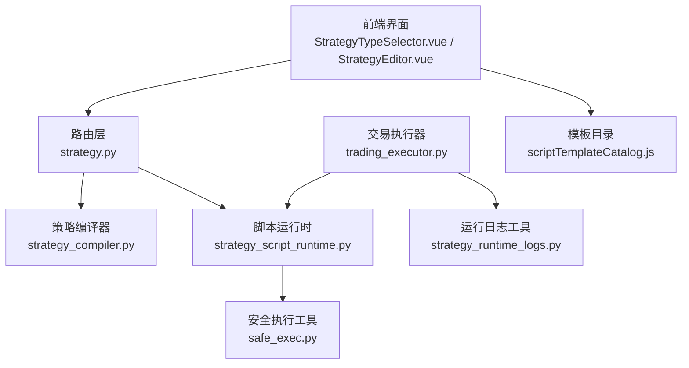
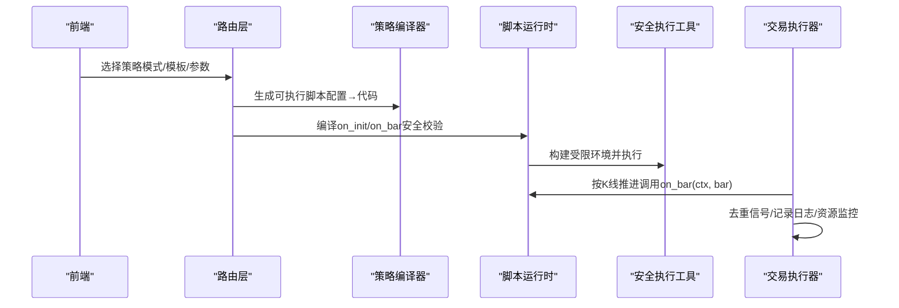
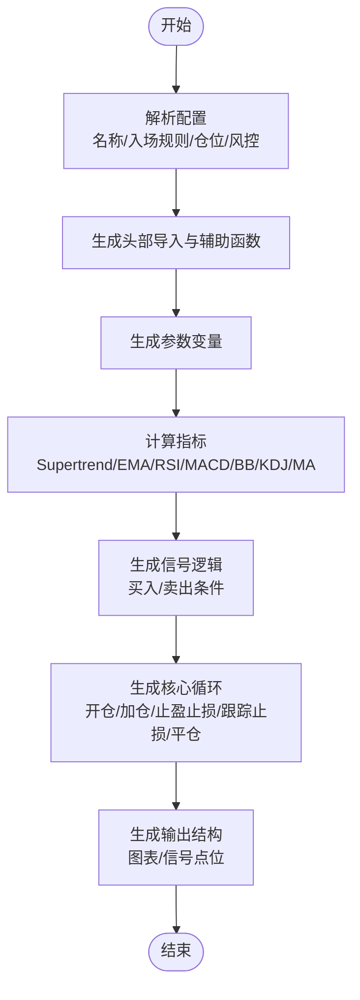
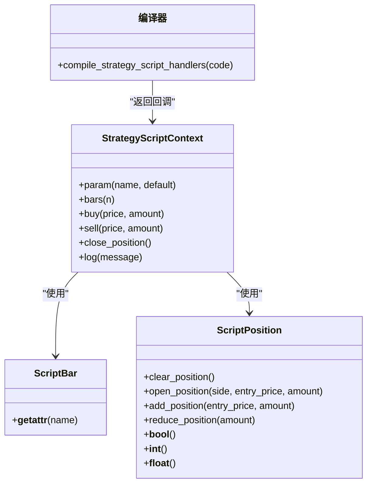
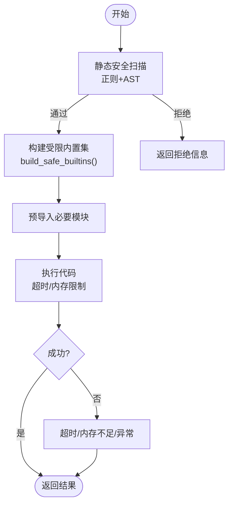
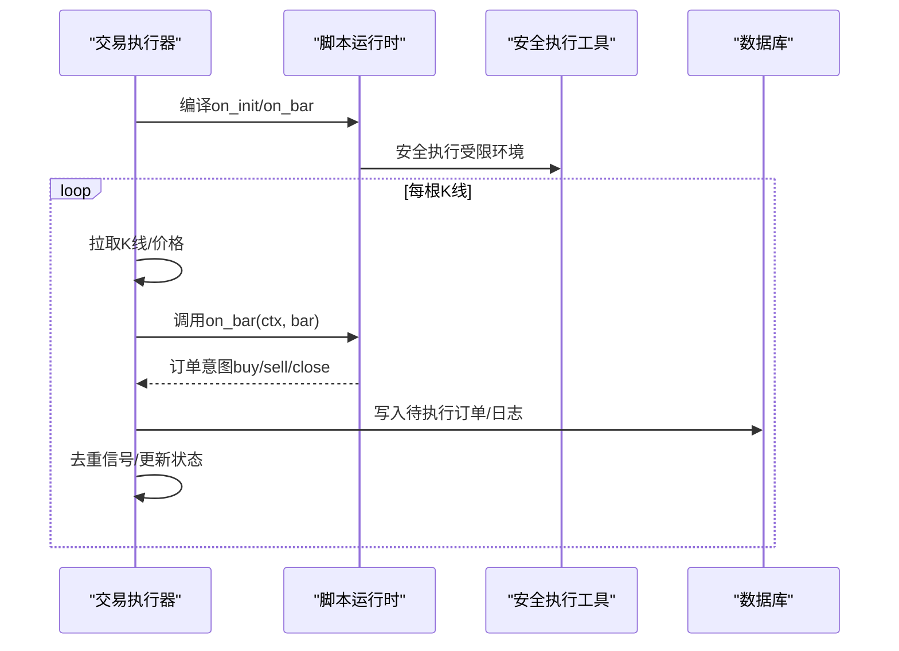
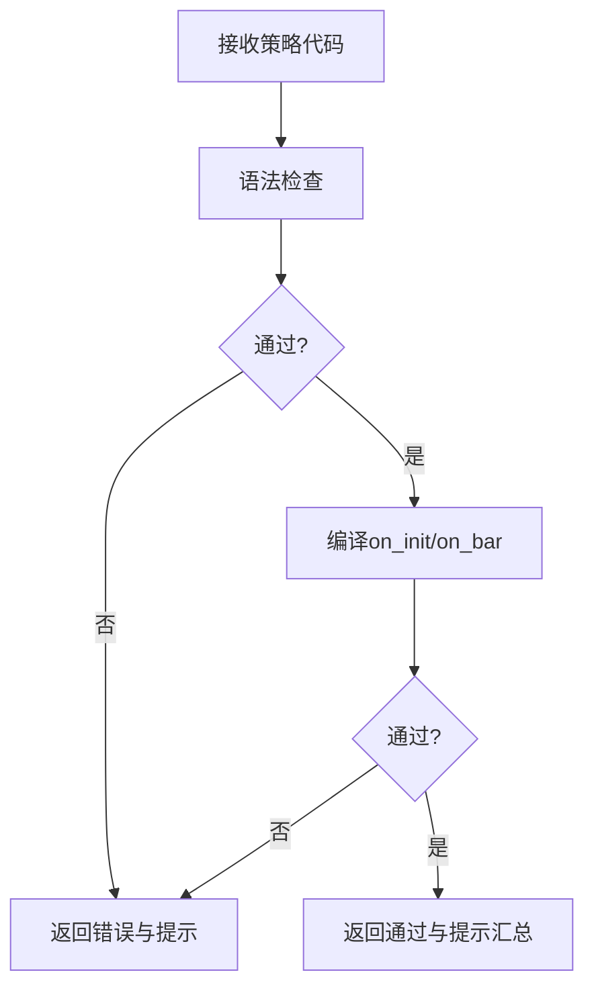
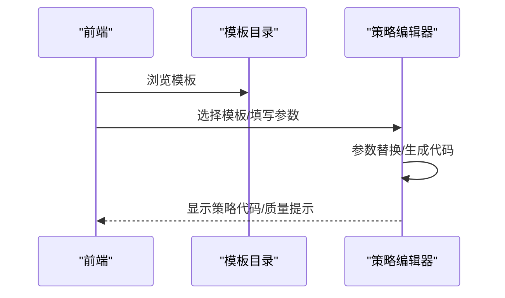
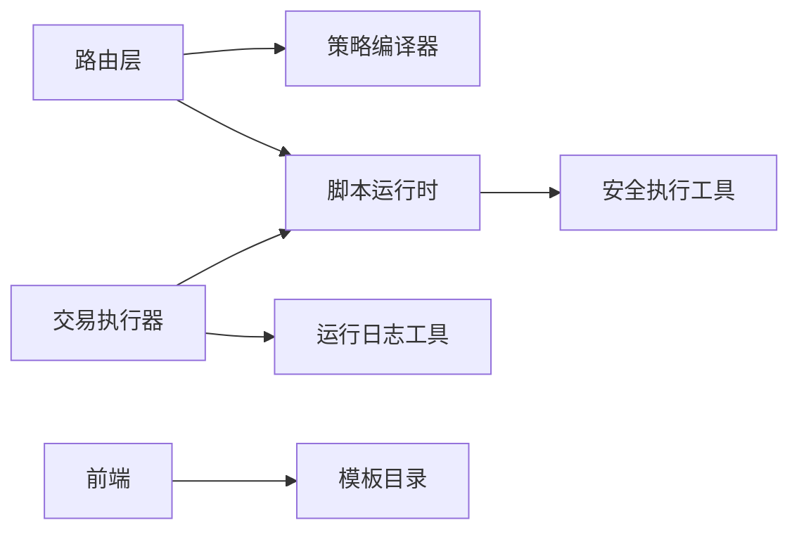

# 策略开发引擎

<cite>
**本文引用的文件**
- [strategy_compiler.py](file://backend_api_python/app/services/strategy_compiler.py)
- [strategy_script_runtime.py](file://backend_api_python/app/services/strategy_script_runtime.py)
- [safe_exec.py](file://backend_api_python/app/utils/safe_exec.py)
- [strategy.py](file://backend_api_python/app/routes/strategy.py)
- [trading_executor.py](file://backend_api_python/app/services/trading_executor.py)
- [strategy_runtime_logs.py](file://backend_api_python/app/utils/strategy_runtime_logs.py)
- [dual_ma_with_params.py](file://docs/examples/dual_ma_with_params.py)
- [multi_indicator_composite.py](file://docs/examples/multi_indicator_composite.py)
- [cross_sectional_momentum_rsi.py](file://docs/examples/cross_sectional_momentum_rsi.py)
- [StrategyTypeSelector.vue](file://frontend/src/views/trading-assistant/components/StrategyTypeSelector.vue)
- [StrategyEditor.vue](file://frontend/src/views/trading-assistant/components/StrategyEditor.vue)
- [scriptTemplateCatalog.js](file://frontend/src/views/trading-assistant/components/scriptTemplateCatalog.js)
</cite>

## 目录
1. [引言](#引言)
2. [项目结构](#项目结构)
3. [核心组件](#核心组件)
4. [架构总览](#架构总览)
5. [详细组件分析](#详细组件分析)
6. [依赖分析](#依赖分析)
7. [性能考虑](#性能考虑)
8. [故障排查指南](#故障排查指南)
9. [结论](#结论)
10. [附录](#附录)

## 引言
本文件面向QuantDinger的策略开发引擎，系统性阐述策略编译器与脚本运行时的工作原理，覆盖Python代码解析、语法检查、安全沙箱执行、运行时隔离与资源管理，并提供策略开发指南（含IndicatorStrategy与ScriptStrategy两种模式）、调试技巧、性能优化与代码质量检查机制。文档同时给出移动平均线、RSI、多指标组合等常见策略的示例路径，帮助开发者快速上手并构建稳健的自动化交易策略。

## 项目结构
策略开发引擎主要由以下层次构成：
- 后端路由层：负责策略模板加载、代码校验与质量提示、AI辅助修复等。
- 编译与运行时层：策略编译器将配置转换为可执行脚本；脚本运行时提供安全沙箱与上下文对象。
- 执行与监控层：交易执行器以线程方式驱动策略循环，结合日志与资源监控保障稳定运行。
- 前端交互层：提供策略类型选择、模板目录、编辑器与参数替换等功能。

图表来源
- [strategy.py:1-200](file://backend_api_python/app/routes/strategy.py#L1-L200)
- [strategy_compiler.py:1-689](file://backend_api_python/app/services/strategy_compiler.py#L1-L689)
- [strategy_script_runtime.py:1-191](file://backend_api_python/app/services/strategy_script_runtime.py#L1-L191)
- [safe_exec.py:1-471](file://backend_api_python/app/utils/safe_exec.py#L1-L471)
- [trading_executor.py:1-200](file://backend_api_python/app/services/trading_executor.py#L1-L200)
- [strategy_runtime_logs.py:1-30](file://backend_api_python/app/utils/strategy_runtime_logs.py#L1-L30)
- [StrategyTypeSelector.vue:36-82](file://frontend/src/views/trading-assistant/components/StrategyTypeSelector.vue#L36-L82)
- [StrategyEditor.vue:258-302](file://frontend/src/views/trading-assistant/components/StrategyEditor.vue#L258-L302)
- [scriptTemplateCatalog.js:511-537](file://frontend/src/views/trading-assistant/components/scriptTemplateCatalog.js#L511-L537)

章节来源
- [strategy.py:1-200](file://backend_api_python/app/routes/strategy.py#L1-L200)

## 核心组件
- 策略编译器（StrategyCompiler）
  - 将策略配置（名称、入场规则、仓位与金字塔、风控）转换为可执行的Python脚本，内置常用技术指标计算与信号生成逻辑。
- 脚本运行时（StrategyScriptContext + compile_strategy_script_handlers）
  - 提供on_init/on_bar回调编译、上下文对象（参数、K线窗口、下单意图、持仓状态、资金与权益）与安全沙箱执行。
- 安全执行工具（safe_exec）
  - 构建受限内置集、白名单导入模块、超时控制、内存限制、静态安全扫描与子进程隔离。
- 交易执行器（TradingExecutor）
  - 以线程驱动策略循环，拉取K线、调用on_bar、记录日志、去重信号、资源与线程上限控制。
- 路由与质量检查（strategy.py）
  - 提供策略模板、代码校验（语法、函数完整性、运行时编译）、质量提示（缺失函数、参数声明、风控配置等）。
- 前端模板与编辑器（StrategyTypeSelector.vue / StrategyEditor.vue / scriptTemplateCatalog.js）
  - 支持策略模式选择、模板目录浏览、参数替换与AI辅助生成/修复。

章节来源
- [strategy_compiler.py:1-689](file://backend_api_python/app/services/strategy_compiler.py#L1-L689)
- [strategy_script_runtime.py:1-191](file://backend_api_python/app/services/strategy_script_runtime.py#L1-L191)
- [safe_exec.py:1-471](file://backend_api_python/app/utils/safe_exec.py#L1-L471)
- [trading_executor.py:1-200](file://backend_api_python/app/services/trading_executor.py#L1-L200)
- [strategy.py:45-122](file://backend_api_python/app/routes/strategy.py#L45-L122)
- [StrategyTypeSelector.vue:36-82](file://frontend/src/views/trading-assistant/components/StrategyTypeSelector.vue#L36-L82)
- [StrategyEditor.vue:258-302](file://frontend/src/views/trading-assistant/components/StrategyEditor.vue#L258-L302)
- [scriptTemplateCatalog.js:511-537](file://frontend/src/views/trading-assistant/components/scriptTemplateCatalog.js#L511-L537)

## 架构总览
下图展示了策略从“配置/脚本”到“沙箱执行/实盘”的关键交互：

图表来源
- [strategy_compiler.py:1-689](file://backend_api_python/app/services/strategy_compiler.py#L1-L689)
- [strategy_script_runtime.py:159-191](file://backend_api_python/app/services/strategy_script_runtime.py#L159-L191)
- [safe_exec.py:207-244](file://backend_api_python/app/utils/safe_exec.py#L207-L244)
- [trading_executor.py:37-200](file://backend_api_python/app/services/trading_executor.py#L37-L200)

## 详细组件分析

### 组件A：策略编译器（StrategyCompiler）
- 职责
  - 将策略配置转换为可执行Python脚本，包含参数、指标计算、信号逻辑、核心循环与输出格式。
- 关键能力
  - 指标计算：支持超趋势、EMA、RSI、MACD、布林带、KDJ、MA等。
  - 信号逻辑：基于规则组合生成买入/卖出信号。
  - 核心循环：实现多信号触发、加仓、止盈止损、跟踪止损与平仓逻辑。
  - 输出：生成图表绘制配置与买卖信号点位。
- 性能与复杂度
  - 指标计算与信号逻辑均为O(N)遍历，适合大规模回测。
- 安全与隔离
  - 该组件本身不执行用户代码，仅生成代码字符串，后续由脚本运行时与安全执行工具负责沙箱执行。

图表来源
- [strategy_compiler.py:1-689](file://backend_api_python/app/services/strategy_compiler.py#L1-L689)

章节来源
- [strategy_compiler.py:1-689](file://backend_api_python/app/services/strategy_compiler.py#L1-L689)

### 组件B：脚本运行时（StrategyScriptContext + compile_strategy_script_handlers）
- 职责
  - 提供策略脚本的运行时上下文（参数、K线窗口、下单意图、持仓状态、资金与权益），并编译on_init/on_bar回调。
- 上下文对象
  - ScriptBar：封装K线字段访问。
  - ScriptPosition：封装开仓/加仓/减仓/平仓与布尔比较。
  - StrategyScriptContext：提供param/bars/buy/sell/close_position/log等API。
- 编译与安全
  - 通过安全执行工具构建受限内置集与白名单导入，执行前进行静态安全扫描与超时控制。

图表来源
- [strategy_script_runtime.py:17-191](file://backend_api_python/app/services/strategy_script_runtime.py#L17-L191)

章节来源
- [strategy_script_runtime.py:1-191](file://backend_api_python/app/services/strategy_script_runtime.py#L1-L191)

### 组件C：安全执行工具（safe_exec）
- 职责
  - 构建受限内置集、白名单导入模块、超时控制、内存限制、静态安全扫描与子进程隔离。
- 关键机制
  - 受限内置集：仅保留纯计算类内置，剔除open、eval、exec、__import__等危险项。
  - 白名单导入：仅允许numpy、pandas、json、datetime等模块。
  - 超时控制：跨平台（Unix信号+Windows异步异常）。
  - 内存限制：Linux可通过RLIMIT_AS限制。
  - 静态安全扫描：正则+AST双重检查，拦截危险模式与调用。
  - 子进程隔离：通过multiprocessing在独立进程中执行，失败或超时不会影响主进程。
- 适用场景
  - 代码质量检查与安全执行的统一入口，既可用于回测预演，也可用于实盘脚本编译与执行。

图表来源
- [safe_exec.py:207-244](file://backend_api_python/app/utils/safe_exec.py#L207-L244)
- [safe_exec.py:358-471](file://backend_api_python/app/utils/safe_exec.py#L358-L471)

章节来源
- [safe_exec.py:1-471](file://backend_api_python/app/utils/safe_exec.py#L1-L471)

### 组件D：交易执行器（TradingExecutor）
- 职责
  - 以线程方式驱动策略循环，拉取K线、调用on_bar、记录日志、去重信号、资源与线程上限控制。
- 关键特性
  - 线程池与线程上限：避免can't start new thread与内存溢出。
  - 价格缓存与信号去重：降低重复下单风险。
  - 资源监控：记录内存、线程数与运行状态，便于定位问题。
- 与脚本运行时协作
  - 通过compile_strategy_script_handlers获取on_init/on_bar，按K线推进调用on_bar(ctx, bar)。

图表来源
- [trading_executor.py:37-200](file://backend_api_python/app/services/trading_executor.py#L37-L200)
- [strategy_script_runtime.py:159-191](file://backend_api_python/app/services/strategy_script_runtime.py#L159-L191)
- [safe_exec.py:207-244](file://backend_api_python/app/utils/safe_exec.py#L207-L244)

章节来源
- [trading_executor.py:1-200](file://backend_api_python/app/services/trading_executor.py#L1-L200)
- [strategy_runtime_logs.py:1-30](file://backend_api_python/app/utils/strategy_runtime_logs.py#L1-L30)

### 组件E：路由与代码质量检查（strategy.py）
- 职责
  - 提供策略模板列表与详情、代码校验（语法、函数完整性、运行时编译）、质量提示（缺失函数、参数声明、风控配置等）。
- 质量检查要点
  - 缺失on_init/on_bar、未声明参数默认值、未检测到下单意图、空代码等。
- AI辅助修复
  - 当检测到可自动修复的问题时，通过LLM生成修复候选并二次验证。

图表来源
- [strategy.py:67-122](file://backend_api_python/app/routes/strategy.py#L67-L122)

章节来源
- [strategy.py:45-122](file://backend_api_python/app/routes/strategy.py#L45-L122)

### 组件F：前端策略开发与模板（StrategyTypeSelector.vue / StrategyEditor.vue / scriptTemplateCatalog.js）
- 职责
  - 提供策略模式选择（脚本/信号）、模板目录浏览、参数替换与AI辅助生成/修复。
- 模板机制
  - 通过模板定义与参数占位，动态生成最终策略代码；支持一键应用模板并自动生成策略名称。

图表来源
- [StrategyTypeSelector.vue:36-82](file://frontend/src/views/trading-assistant/components/StrategyTypeSelector.vue#L36-L82)
- [StrategyEditor.vue:258-302](file://frontend/src/views/trading-assistant/components/StrategyEditor.vue#L258-L302)
- [scriptTemplateCatalog.js:511-537](file://frontend/src/views/trading-assistant/components/scriptTemplateCatalog.js#L511-L537)

章节来源
- [StrategyTypeSelector.vue:36-82](file://frontend/src/views/trading-assistant/components/StrategyTypeSelector.vue#L36-L82)
- [StrategyEditor.vue:258-302](file://frontend/src/views/trading-assistant/components/StrategyEditor.vue#L258-L302)
- [scriptTemplateCatalog.js:511-537](file://frontend/src/views/trading-assistant/components/scriptTemplateCatalog.js#L511-L537)

## 依赖分析
- 组件耦合
  - 路由层依赖策略编译器与脚本运行时；脚本运行时依赖安全执行工具；交易执行器依赖脚本运行时与日志工具。
- 外部依赖
  - numpy/pandas用于数值计算；multiprocessing用于子进程隔离；psutil/resource用于资源监控。
- 循环依赖
  - 未发现循环依赖；模块间为单向依赖（路由→编译器/运行时→安全执行）。

图表来源
- [strategy.py:1-200](file://backend_api_python/app/routes/strategy.py#L1-L200)
- [strategy_compiler.py:1-689](file://backend_api_python/app/services/strategy_compiler.py#L1-L689)
- [strategy_script_runtime.py:1-191](file://backend_api_python/app/services/strategy_script_runtime.py#L1-L191)
- [safe_exec.py:1-471](file://backend_api_python/app/utils/safe_exec.py#L1-L471)
- [trading_executor.py:1-200](file://backend_api_python/app/services/trading_executor.py#L1-L200)
- [strategy_runtime_logs.py:1-30](file://backend_api_python/app/utils/strategy_runtime_logs.py#L1-L30)
- [StrategyTypeSelector.vue:36-82](file://frontend/src/views/trading-assistant/components/StrategyTypeSelector.vue#L36-L82)
- [scriptTemplateCatalog.js:511-537](file://frontend/src/views/trading-assistant/components/scriptTemplateCatalog.js#L511-L537)

章节来源
- [strategy.py:1-200](file://backend_api_python/app/routes/strategy.py#L1-L200)
- [strategy_compiler.py:1-689](file://backend_api_python/app/services/strategy_compiler.py#L1-L689)
- [strategy_script_runtime.py:1-191](file://backend_api_python/app/services/strategy_script_runtime.py#L1-L191)
- [safe_exec.py:1-471](file://backend_api_python/app/utils/safe_exec.py#L1-L471)
- [trading_executor.py:1-200](file://backend_api_python/app/services/trading_executor.py#L1-L200)
- [strategy_runtime_logs.py:1-30](file://backend_api_python/app/utils/strategy_runtime_logs.py#L1-L30)
- [StrategyTypeSelector.vue:36-82](file://frontend/src/views/trading-assistant/components/StrategyTypeSelector.vue#L36-L82)
- [scriptTemplateCatalog.js:511-537](file://frontend/src/views/trading-assistant/components/scriptTemplateCatalog.js#L511-L537)

## 性能考虑
- 指标与信号计算
  - 采用向量化与一次遍历，避免嵌套循环；合理设置指标周期与滑窗，平衡灵敏度与噪音。
- 线程与资源
  - 通过STRATEGY_MAX_THREADS限制并发线程数；利用价格缓存与信号去重减少重复请求与下单。
- 内存与超时
  - 安全执行工具提供超时与内存限制；生产环境建议开启RLIMIT_AS并配合容器资源限制。
- I/O与网络
  - 优先本地K线缓存与批量拉取；避免在on_bar中执行阻塞操作，将I/O移至初始化或后台任务。

## 故障排查指南
- 常见错误与定位
  - 空代码/语法错误：检查路由层返回的错误类型与行号，修正语法或补全函数。
  - 缺失on_init/on_bar：确保策略脚本包含必需函数签名。
  - 安全拒绝：查看安全执行工具的拒绝原因（危险模式/非法导入/AST解析失败）。
  - 超时/内存不足：缩短计算范围、减少指标数量、提升超时阈值或增加内存限制。
- 日志与监控
  - 使用运行日志工具记录策略状态；交易执行器提供资源状态打印，便于定位线程/内存问题。
- 去重与一致性
  - 检查信号去重缓存是否正确，避免重复下单；确认K线时间戳与信号时间戳匹配。

章节来源
- [strategy.py:67-122](file://backend_api_python/app/routes/strategy.py#L67-L122)
- [safe_exec.py:157-205](file://backend_api_python/app/utils/safe_exec.py#L157-L205)
- [trading_executor.py:147-174](file://backend_api_python/app/services/trading_executor.py#L147-L174)
- [strategy_runtime_logs.py:1-30](file://backend_api_python/app/utils/strategy_runtime_logs.py#L1-L30)

## 结论
QuantDinger的策略开发引擎以“配置/脚本双模”为核心，结合策略编译器、脚本运行时与安全执行工具，形成从设计到沙箱执行的完整闭环。前端模板与编辑器进一步降低了策略开发门槛。通过严格的代码质量检查、安全沙箱与资源监控，系统在保证安全性的同时兼顾性能与可维护性。建议开发者优先采用模板与参数化方式快速迭代，逐步引入自定义逻辑，并持续关注质量提示与日志反馈。

## 附录

### 开发模式对比：IndicatorStrategy 与 ScriptStrategy
- IndicatorStrategy（指标策略）
  - 以配置驱动生成脚本，适合快速验证多指标组合与信号逻辑；强调图表输出与可视化。
  - 优势：无需编写on_init/on_bar，快速回测与可视化。
  - 适用：多指标组合、截面研究、信号面板联动。
- ScriptStrategy（脚本策略）
  - 以Python脚本驱动，支持灵活的参数化、风控与下单意图；需提供on_init/on_bar。
  - 优势：灵活性强，可接入外部模型与复杂逻辑。
  - 适用：实盘交易、AI辅助决策、定制化风控。

章节来源
- [StrategyTypeSelector.vue:36-82](file://frontend/src/views/trading-assistant/components/StrategyTypeSelector.vue#L36-L82)
- [StrategyEditor.vue:258-302](file://frontend/src/views/trading-assistant/components/StrategyEditor.vue#L258-L302)
- [strategy.py:67-122](file://backend_api_python/app/routes/strategy.py#L67-L122)

### 策略示例与路径
- 双均线策略（参数化与默认风控）
  - 示例路径：[dual_ma_with_params.py:1-64](file://docs/examples/dual_ma_with_params.py#L1-L64)
- 多指标组合策略（均线+RSI+MACD+成交量过滤）
  - 示例路径：[multi_indicator_composite.py:1-109](file://docs/examples/multi_indicator_composite.py#L1-L109)
- 截面动量+RSI复合评分（研究参考）
  - 示例路径：[cross_sectional_momentum_rsi.py:1-71](file://docs/examples/cross_sectional_momentum_rsi.py#L1-L71)

章节来源
- [dual_ma_with_params.py:1-64](file://docs/examples/dual_ma_with_params.py#L1-L64)
- [multi_indicator_composite.py:1-109](file://docs/examples/multi_indicator_composite.py#L1-L109)
- [cross_sectional_momentum_rsi.py:1-71](file://docs/examples/cross_sectional_momentum_rsi.py#L1-L71)

### 调试技巧与最佳实践
- 调试技巧
  - 使用路由层的质量提示与人类可读摘要，快速定位缺失函数、参数未读取、风控缺失等问题。
  - 在脚本运行时中使用ctx.log输出中间状态，结合运行日志工具查看。
  - 利用交易执行器的日志与资源状态打印，排查线程/内存问题。
- 最佳实践
  - 优先参数化与注解（# @param / # @strategy），便于前端与AI识别。
  - 控制指标数量与计算复杂度，避免在on_bar中执行阻塞操作。
  - 启用风控（止损/止盈/跟踪止损），并在模板中明确默认配置。

章节来源
- [strategy.py:163-200](file://backend_api_python/app/routes/strategy.py#L163-L200)
- [strategy_runtime_logs.py:1-30](file://backend_api_python/app/utils/strategy_runtime_logs.py#L1-L30)
- [trading_executor.py:147-174](file://backend_api_python/app/services/trading_executor.py#L147-L174)