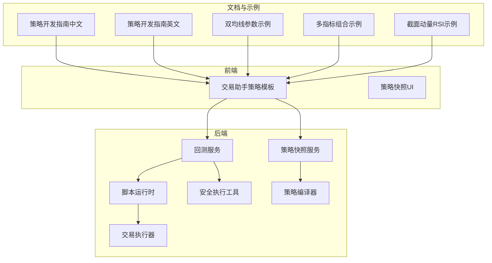
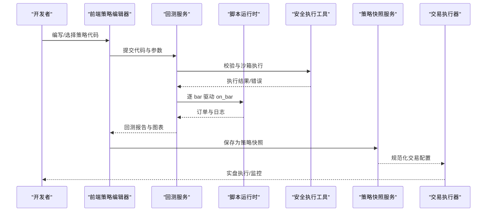
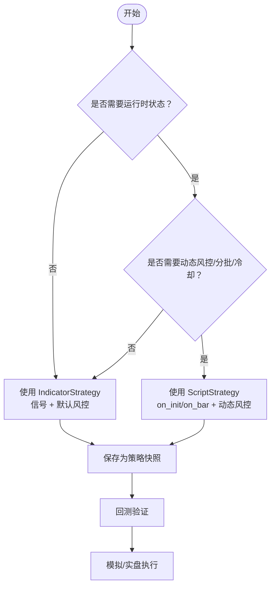
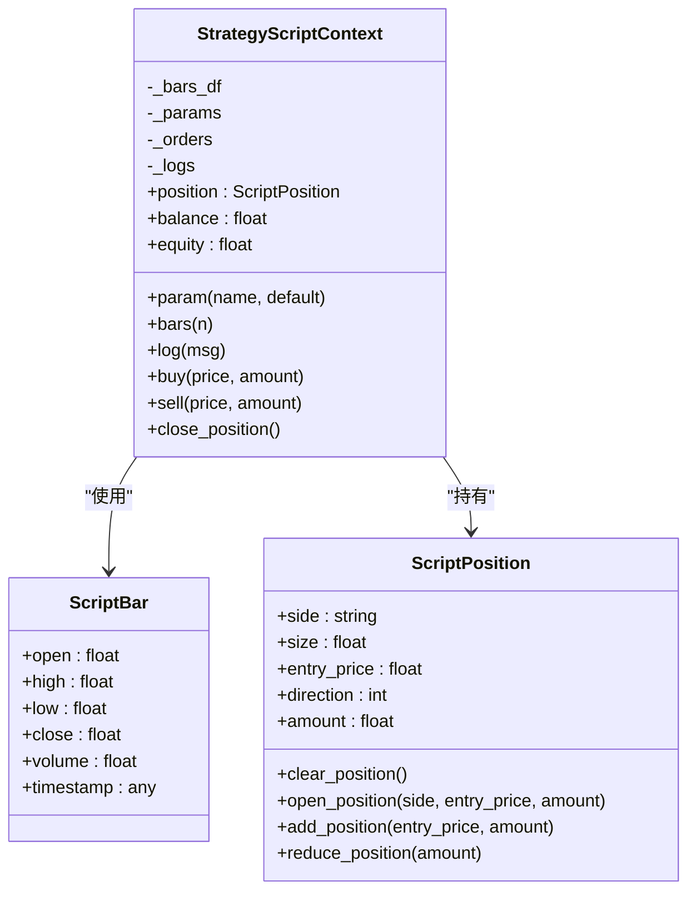
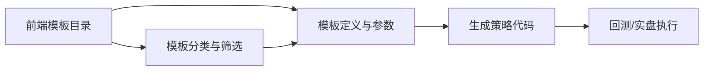
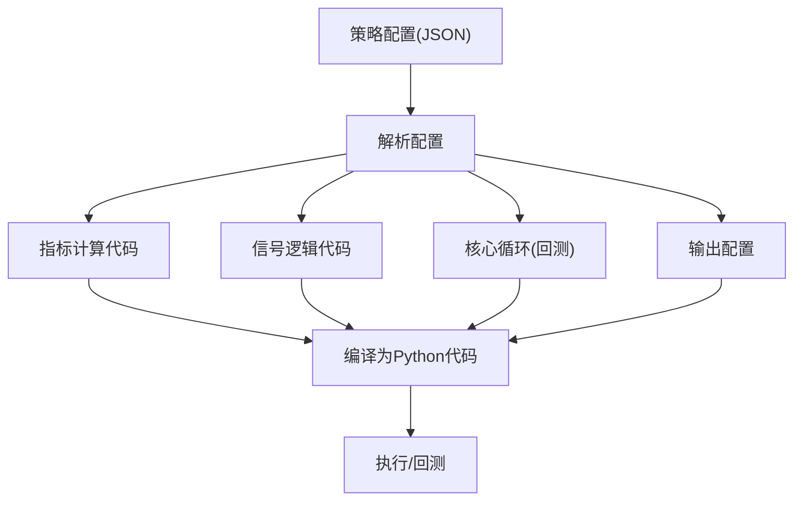
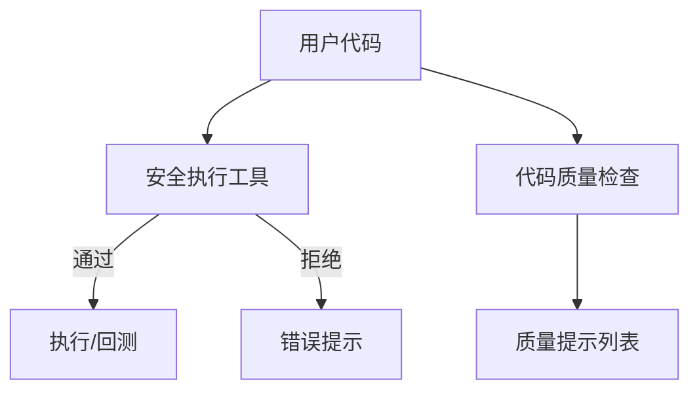
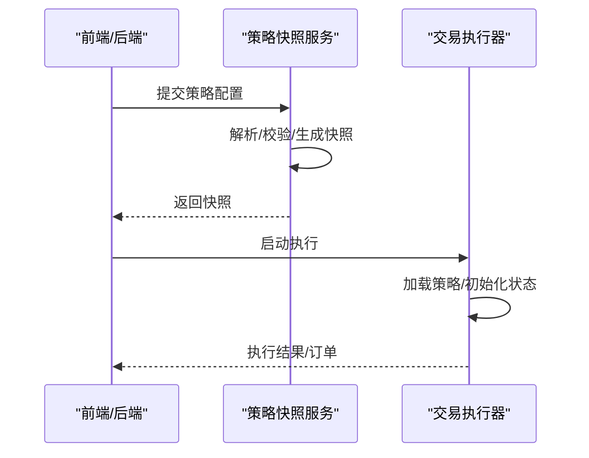
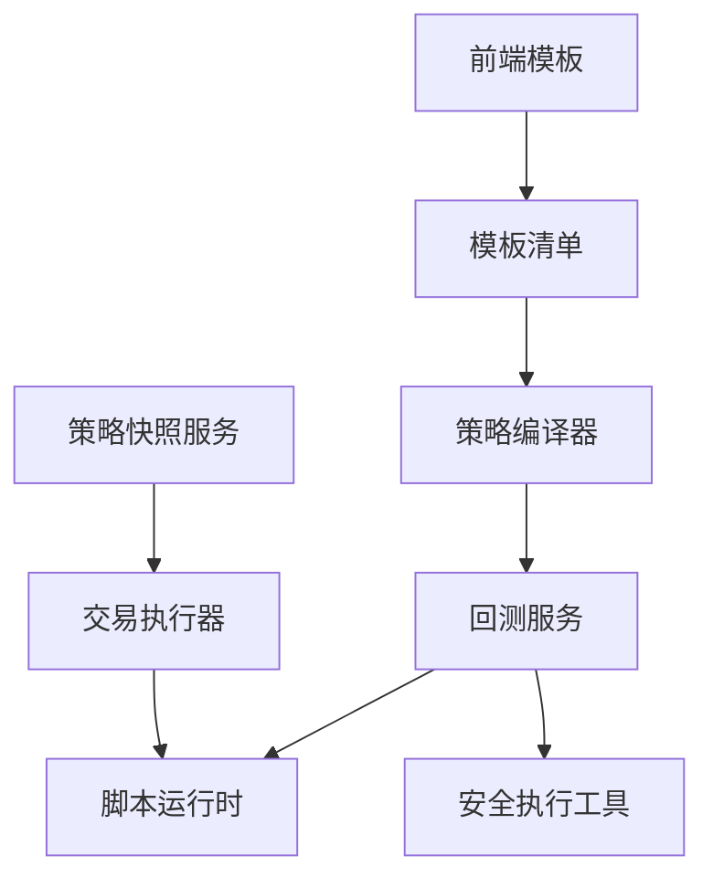

# 策略开发指南

<cite>
**本文引用的文件**   
- [策略开发指南（中文）](file://docs/STRATEGY_DEV_GUIDE_CN.md)
- [策略开发指南（英文）](file://docs/STRATEGY_DEV_GUIDE.md)
- [策略模板目录（前端）](file://frontend/src/views/trading-assistant/components/scriptTemplateCatalog.js)
- [策略模板清单](file://backend_api_python/app/data/strategy_templates.json)
- [策略编译器](file://backend_api_python/app/services/strategy_compiler.py)
- [策略脚本运行时](file://backend_api_python/app/services/strategy_script_runtime.py)
- [回测服务](file://backend_api_python/app/services/backtest.py)
- [指标代码质量检查](file://backend_api_python/app/services/indicator_code_quality.py)
- [安全执行工具](file://backend_api_python/app/utils/safe_exec.py)
- [策略快照服务](file://backend_api_python/app/services/strategy_snapshot.py)
- [交易执行器](file://backend_api_python/app/services/trading_executor.py)
- [双均线参数示例](file://docs/examples/dual_ma_with_params.py)
- [多指标组合示例](file://docs/examples/multi_indicator_composite.py)
- [截面动量RSI示例](file://docs/examples/cross_sectional_momentum_rsi.py)
- [脚本模板构建工具](file://frontend/src/views/trading-assistant/components/scriptTemplateCatalog.js)
</cite>

## 目录
1. [引言](#引言)
2. [项目结构](#项目结构)
3. [核心组件](#核心组件)
4. [架构总览](#架构总览)
5. [详细组件分析](#详细组件分析)
6. [依赖分析](#依赖分析)
7. [性能考虑](#性能考虑)
8. [故障排查指南](#故障排查指南)
9. [结论](#结论)
10. [附录](#附录)

## 引言
本指南面向策略开发者，系统阐述 QuantDinger 的两条 Python 开发路径：IndicatorStrategy（基于 df 的指标/信号脚本）与 ScriptStrategy（基于 on_init/on_bar 的事件驱动脚本）。文档覆盖两类模式的特性、适用场景、实现差异、开发流程、示例策略、代码质量检查、性能优化与调试技巧，帮助你从需求分析到代码部署形成完整闭环。

## 项目结构
QuantDinger 将策略开发与运行时分为三层：
- 文档与示例层：提供策略开发指南与示例脚本，便于理解模式差异与最佳实践。
- 前端交互层：提供策略模板、参数面板、可视化与调试入口。
- 后端服务层：包含回测引擎、脚本运行时、安全执行、策略编译与持久化。

**图表来源**
- [策略开发指南（中文）](file://docs/STRATEGY_DEV_GUIDE_CN.md)
- [策略开发指南（英文）](file://docs/STRATEGY_DEV_GUIDE.md)
- [策略模板目录（前端）](file://frontend/src/views/trading-assistant/components/scriptTemplateCatalog.js)
- [策略模板清单](file://backend_api_python/app/data/strategy_templates.json)
- [策略编译器](file://backend_api_python/app/services/strategy_compiler.py)
- [策略脚本运行时](file://backend_api_python/app/services/strategy_script_runtime.py)
- [回测服务](file://backend_api_python/app/services/backtest.py)
- [安全执行工具](file://backend_api_python/app/utils/safe_exec.py)
- [策略快照服务](file://backend_api_python/app/services/strategy_snapshot.py)
- [交易执行器](file://backend_api_python/app/services/trading_executor.py)

**章节来源**
- [策略开发指南（中文）](file://docs/STRATEGY_DEV_GUIDE_CN.md)
- [策略开发指南（英文）](file://docs/STRATEGY_DEV_GUIDE.md)
- [策略模板目录（前端）](file://frontend/src/views/trading-assistant/components/scriptTemplateCatalog.js)
- [策略模板清单](file://backend_api_python/app/data/strategy_templates.json)

## 核心组件
- 指标策略（IndicatorStrategy）
  - 特性：基于 df 计算指标序列，生成布尔型 buy/sell 信号，声明默认策略配置，输出图表与信号。
  - 适用：指标研究、信号型回测、参数调优、先信号后策略落地。
- 脚本策略（ScriptStrategy）
  - 特性：按 bar 逐根执行，读取 ctx.position，调用 ctx.buy/sell/close_position，处理动态止盈止损与分批加减仓。
  - 适用：有状态执行、机器人式策略、bot 风格执行、冷却与再平衡。

**章节来源**
- [策略开发指南（中文）](file://docs/STRATEGY_DEV_GUIDE_CN.md)
- [策略开发指南（英文）](file://docs/STRATEGY_DEV_GUIDE.md)

## 架构总览
策略从“想法”到“回测/实盘”的全链路如下：

**图表来源**
- [回测服务](file://backend_api_python/app/services/backtest.py)
- [策略脚本运行时](file://backend_api_python/app/services/strategy_script_runtime.py)
- [安全执行工具](file://backend_api_python/app/utils/safe_exec.py)
- [策略快照服务](file://backend_api_python/app/services/strategy_snapshot.py)
- [交易执行器](file://backend_api_python/app/services/trading_executor.py)

## 详细组件分析

### 组件A：策略模式对比与迁移决策
- 指标策略（IndicatorStrategy）
  - 信号来源：df['buy']/df['sell']，适合“条件 A 出现即入场”的静态信号。
  - 风险管理：通过 # @strategy 声明默认止损、止盈、跟踪止损与默认方向。
  - 退出策略：可由信号驱动（如均线死叉），也可由引擎按固定规则处理。
- 脚本策略（ScriptStrategy）
  - 信号来源：on_bar 中根据 ctx.position 与实时 bar 决策。
  - 动态风控：按持仓状态实时计算止损止盈，支持分批加减仓、冷却与再平衡。
  - 迁移条件：当逻辑需要“运行时状态”或复杂仓位管理时，应迁移到 ScriptStrategy。

**图表来源**
- [策略开发指南（中文）](file://docs/STRATEGY_DEV_GUIDE_CN.md)
- [策略开发指南（英文）](file://docs/STRATEGY_DEV_GUIDE.md)

**章节来源**
- [策略开发指南（中文）](file://docs/STRATEGY_DEV_GUIDE_CN.md)
- [策略开发指南（英文）](file://docs/STRATEGY_DEV_GUIDE.md)

### 组件B：回测引擎与脚本运行时
- 回测服务
  - 支持 IndicatorStrategy 的信号回测与 ScriptStrategy 的事件驱动回测。
  - 提供安全执行与超时控制，保证稳定性。
- 脚本运行时
  - 提供 ScriptBar/ScriptPosition/StrategyScriptContext，与回测行为一致。
  - 支持 ctx.bars(n)、ctx.buy/sell/close_position、ctx.log 等常用接口。

**图表来源**
- [策略脚本运行时](file://backend_api_python/app/services/strategy_script_runtime.py)

**章节来源**
- [回测服务](file://backend_api_python/app/services/backtest.py)
- [策略脚本运行时](file://backend_api_python/app/services/strategy_script_runtime.py)

### 组件C：策略模板与参数体系
- 前端策略模板
  - 提供多种模板（趋势跟踪、马丁格尔、网格、定投、均值回归、突破、RSI 均值回归、MACD 交叉）。
  - 模板内含参数定义与默认值，便于快速搭建策略。
- 策略模板清单
  - 后端提供策略模板清单，包含默认参数、难度、适用市场与标签，便于统一管理。

**图表来源**
- [策略模板目录（前端）](file://frontend/src/views/trading-assistant/components/scriptTemplateCatalog.js)
- [策略模板清单](file://backend_api_python/app/data/strategy_templates.json)

**章节来源**
- [策略模板目录（前端）](file://frontend/src/views/trading-assistant/components/scriptTemplateCatalog.js)
- [策略模板清单](file://backend_api_python/app/data/strategy_templates.json)

### 组件D：策略编译器（图形化策略到代码）
- 将可视化配置（指标、规则、风控、加仓）编译为可执行 Python 代码，覆盖指标计算、信号逻辑、核心循环与输出。
- 适合从配置快速生成 IndicatorStrategy 或回测脚本。

**图表来源**
- [策略编译器](file://backend_api_python/app/services/strategy_compiler.py)

**章节来源**
- [策略编译器](file://backend_api_python/app/services/strategy_compiler.py)

### 组件E：安全执行与代码质量检查
- 安全执行工具
  - 白名单内置函数与模块，禁止危险操作；支持超时与内存限制；提供跨平台超时机制。
- 指标代码质量检查
  - 检查元数据、df.copy、输出字典、参数使用、未知 @strategy 键、默认风控缺失等，输出提示列表。

**图表来源**
- [安全执行工具](file://backend_api_python/app/utils/safe_exec.py)
- [指标代码质量检查](file://backend_api_python/app/services/indicator_code_quality.py)

**章节来源**
- [安全执行工具](file://backend_api_python/app/utils/safe_exec.py)
- [指标代码质量检查](file://backend_api_python/app/services/indicator_code_quality.py)

### 组件F：策略快照与持久化
- 策略快照服务
  - 解析策略配置，生成回测/执行所需的快照，包含策略类型、模式、代码、指标配置与交易配置。
- 交易执行器
  - 支持 IndicatorStrategy 与 ScriptStrategy 的实盘执行，加载策略状态并驱动策略循环。

**图表来源**
- [策略快照服务](file://backend_api_python/app/services/strategy_snapshot.py)
- [交易执行器](file://backend_api_python/app/services/trading_executor.py)

**章节来源**
- [策略快照服务](file://backend_api_python/app/services/strategy_snapshot.py)
- [交易执行器](file://backend_api_python/app/services/trading_executor.py)

## 依赖分析
- 模块耦合
  - 回测服务依赖安全执行工具与脚本运行时，确保策略在沙箱内安全执行。
  - 前端模板与后端模板清单配合，统一策略模板的参数与默认值。
  - 策略编译器独立生成代码，降低 UI 与引擎之间的直接耦合。
- 外部依赖
  - pandas/numpy 等科学计算库在安全环境中可用。
  - 交易执行器依赖策略快照与交易配置，确保实盘一致性。

**图表来源**
- [策略模板目录（前端）](file://frontend/src/views/trading-assistant/components/scriptTemplateCatalog.js)
- [策略模板清单](file://backend_api_python/app/data/strategy_templates.json)
- [策略编译器](file://backend_api_python/app/services/strategy_compiler.py)
- [回测服务](file://backend_api_python/app/services/backtest.py)
- [策略脚本运行时](file://backend_api_python/app/services/strategy_script_runtime.py)
- [安全执行工具](file://backend_api_python/app/utils/safe_exec.py)
- [策略快照服务](file://backend_api_python/app/services/strategy_snapshot.py)
- [交易执行器](file://backend_api_python/app/services/trading_executor.py)

**章节来源**
- [策略模板目录（前端）](file://frontend/src/views/trading-assistant/components/scriptTemplateCatalog.js)
- [策略模板清单](file://backend_api_python/app/data/strategy_templates.json)
- [策略编译器](file://backend_api_python/app/services/strategy_compiler.py)
- [回测服务](file://backend_api_python/app/services/backtest.py)
- [策略脚本运行时](file://backend_api_python/app/services/strategy_script_runtime.py)
- [安全执行工具](file://backend_api_python/app/utils/safe_exec.py)
- [策略快照服务](file://backend_api_python/app/services/strategy_snapshot.py)
- [交易执行器](file://backend_api_python/app/services/trading_executor.py)

## 性能考虑
- 数据访问与计算
  - 优先使用向量化操作（pandas/numpy），避免逐行循环。
  - 控制窗口大小与数据长度，减少回测时间。
- 脚本执行
  - 合理设置超时与内存上限，防止长时间阻塞。
  - 使用 ctx.bars(n) 获取必要历史数据，避免过度拉取。
- 可视化与输出
  - 仅输出必要的 plots 与 signals，减少前端渲染压力。
- 策略复杂度
  - 复杂风控与多条件组合建议迁移到 ScriptStrategy，利用运行时状态提升效率与可控性。

[本节为通用性能建议，无需特定文件引用]

## 故障排查指南
- 常见问题与定位
  - 空代码/缺少输出：检查是否定义 output 字典。
  - 未复制 df：添加 df = df.copy()。
  - 未使用 params.get：检查声明的参数是否通过 params.get 读取。
  - 未知 @strategy 键：修正为受支持的风控键。
  - 缺少 buy/sell 列：确保生成布尔信号列。
- 安全执行失败
  - 检查是否使用了危险模式（如 eval/exec/open/__import__ 等），确认导入模块在白名单内。
  - 查看超时/内存限制是否过严。
- 回测与实盘差异
  - 注意成交语义（收盘确认/下一根开盘）与 bot 模式差异。
  - ScriptStrategy 的 amount 更偏向下单意图，最终仓位由交易配置主导。

**章节来源**
- [指标代码质量检查](file://backend_api_python/app/services/indicator_code_quality.py)
- [安全执行工具](file://backend_api_python/app/utils/safe_exec.py)
- [策略开发指南（中文）](file://docs/STRATEGY_DEV_GUIDE_CN.md)

## 结论
- 优先使用 IndicatorStrategy 原型化信号与参数，完成图表、信号与回测验证。
- 当策略需要运行时状态、动态风控或机器人式执行时，迁移到 ScriptStrategy。
- 借助模板与编译器快速搭建策略，结合质量检查与安全执行保障稳定性。
- 通过策略快照与交易执行器实现从回测到实盘的一致衔接。

[本节为总结性内容，无需特定文件引用]

## 附录

### A. 开发流程（从需求到部署）
- 需求分析：明确信号来源、风控与执行节奏。
- 原型验证：使用 IndicatorStrategy 验证信号与参数，完成图表与回测。
- 代码质量：通过质量检查修复提示，确保元数据、参数与输出完整。
- 保存快照：将策略保存为快照，核对交易配置与默认风控。
- 迁移与扩展：如需运行时状态，迁移到 ScriptStrategy 并补充 on_init/on_bar。
- 回测与模拟：先回测，再模拟，最后实盘。
- 持续优化：迭代参数、风控与执行逻辑，关注性能与稳定性。

**章节来源**
- [策略开发指南（中文）](file://docs/STRATEGY_DEV_GUIDE_CN.md)

### B. 策略示例索引
- 移动平均线策略（双均线交叉）
  - 示例路径：[双均线参数示例](file://docs/examples/dual_ma_with_params.py)
- RSI 指标策略
  - 示例路径：[多指标组合示例](file://docs/examples/multi_indicator_composite.py)
- 多指标组合策略
  - 示例路径：[多指标组合示例](file://docs/examples/multi_indicator_composite.py)
- 截面动量 RSI 策略（研究参考）
  - 示例路径：[截面动量RSI示例](file://docs/examples/cross_sectional_momentum_rsi.py)

**章节来源**
- [双均线参数示例](file://docs/examples/dual_ma_with_params.py)
- [多指标组合示例](file://docs/examples/multi_indicator_composite.py)
- [截面动量RSI示例](file://docs/examples/cross_sectional_momentum_rsi.py)

### C. 代码质量检查标准
- 必备项
  - 定义 my_indicator_name/my_indicator_description
  - df.copy()
  - 定义 output 字典
  - 声明 buy/sell 信号列
- 建议项
  - 使用 # @param 声明参数并通过 params.get 读取
  - 使用 # @strategy 声明默认风控
  - 未知 @strategy 键会触发警告
  - 未读取的参数会触发警告

**章节来源**
- [指标代码质量检查](file://backend_api_python/app/services/indicator_code_quality.py)

### D. 调试技巧
- 前端 AI 质检卡片：查看质量提示与自动修复建议。
- 回测面板：核对成交语义、参数与风控配置。
- 日志输出：在脚本中使用 ctx.log 记录关键节点。
- 模板参数：通过前端模板参数面板快速调整默认值，验证策略敏感性。

**章节来源**
- [策略模板目录（前端）](file://frontend/src/views/trading-assistant/components/scriptTemplateCatalog.js)
- [策略脚本运行时](file://backend_api_python/app/services/strategy_script_runtime.py)