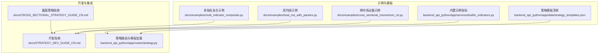
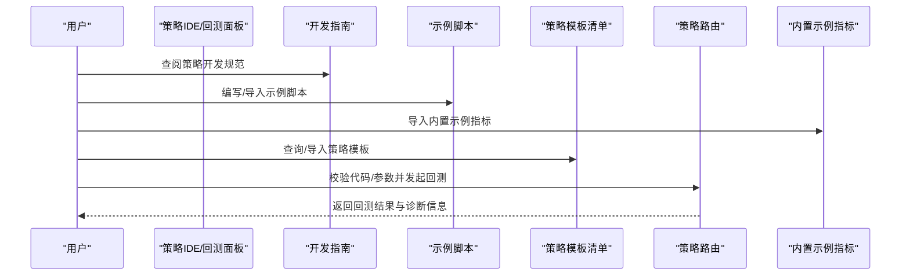
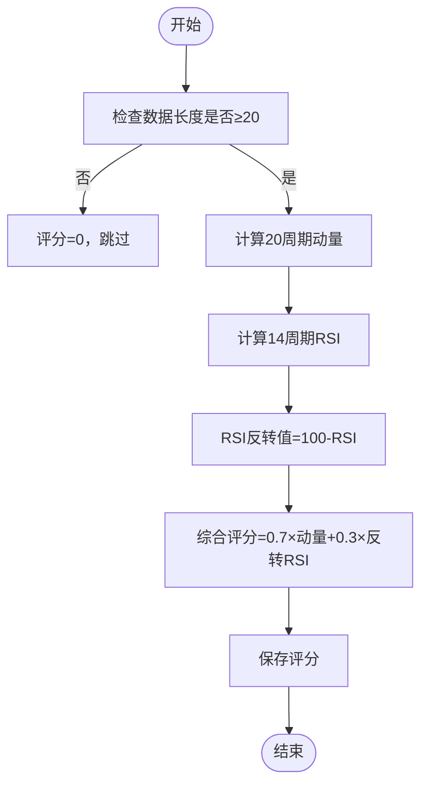
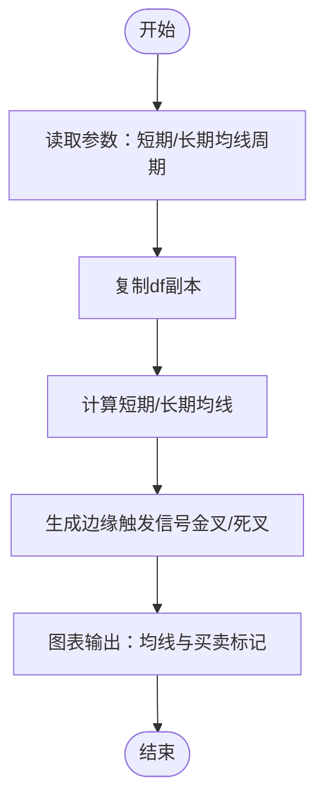
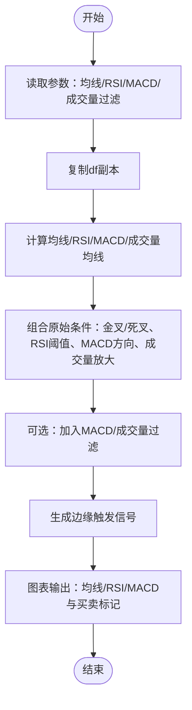
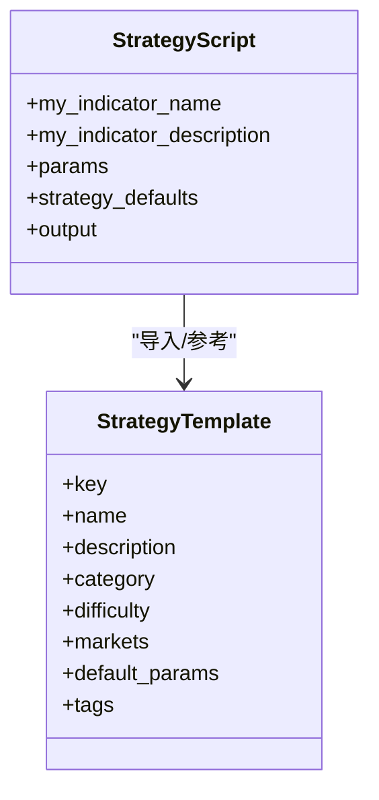
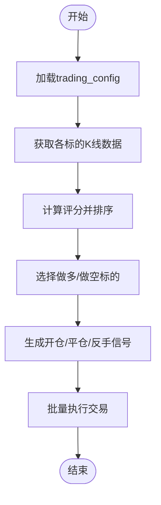
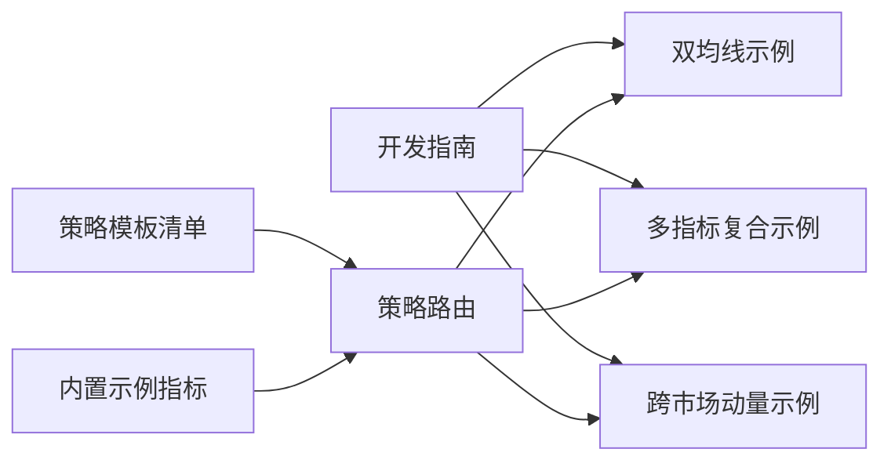

# 策略示例与模板

<cite>
**本文引用的文件**
- [cross_sectional_momentum_rsi.py](file://docs/examples/cross_sectional_momentum_rsi.py)
- [dual_ma_with_params.py](file://docs/examples/dual_ma_with_params.py)
- [multi_indicator_composite.py](file://docs/examples/multi_indicator_composite.py)
- [strategy_templates.json](file://backend_api_python/app/data/strategy_templates.json)
- [STRATEGY_DEV_GUIDE_CN.md](file://docs/STRATEGY_DEV_GUIDE_CN.md)
- [CROSS_SECTIONAL_STRATEGY_GUIDE_CN.md](file://docs/CROSS_SECTIONAL_STRATEGY_GUIDE_CN.md)
- [strategy.py](file://backend_api_python/app/routes/strategy.py)
- [builtin_indicators.py](file://backend_api_python/app/services/builtin_indicators.py)
</cite>

## 目录
1. [简介](#简介)
2. [项目结构](#项目结构)
3. [核心组件](#核心组件)
4. [架构总览](#架构总览)
5. [详细组件分析](#详细组件分析)
6. [依赖关系分析](#依赖关系分析)
7. [性能考量](#性能考量)
8. [故障排查指南](#故障排查指南)
9. [结论](#结论)
10. [附录](#附录)

## 简介
本文件系统化整理并深度解析 QuantDinger 提供的策略示例与模板，覆盖跨市场动量策略、双均线策略、多指标复合策略等典型实现，帮助用户快速理解设计思路、参数配置与使用方法，并掌握策略模板的结构与自定义方式。同时提供优化建议与最佳实践，便于用户构建符合自身需求的交易策略。

## 项目结构
QuantDinger 的策略示例与模板分布在以下位置：
- 文档示例：位于 docs/examples，包含跨市场动量、双均线、多指标复合等示例脚本
- 策略模板：位于 backend_api_python/app/data/strategy_templates.json，提供多种策略模板的元数据与默认参数
- 开发指南：位于 docs/STRATEGY_DEV_GUIDE_CN.md，系统阐述策略开发范式与最佳实践
- 截面策略指南：位于 docs/CROSS_SECTIONAL_STRATEGY_GUIDE_CN.md，详解多标的评分与调仓逻辑
- 内置示例：位于 backend_api_python/app/services/builtin_indicators.py，提供可直接导入的示例指标代码
- 策略路由与模板加载：位于 backend_api_python/app/routes/strategy.py，提供模板查询与加载能力

**图表来源**
- [cross_sectional_momentum_rsi.py:1-71](file://docs/examples/cross_sectional_momentum_rsi.py#L1-L71)
- [dual_ma_with_params.py:1-64](file://docs/examples/dual_ma_with_params.py#L1-L64)
- [multi_indicator_composite.py:1-109](file://docs/examples/multi_indicator_composite.py#L1-L109)
- [strategy_templates.json:1-191](file://backend_api_python/app/data/strategy_templates.json#L1-L191)
- [STRATEGY_DEV_GUIDE_CN.md:1-800](file://docs/STRATEGY_DEV_GUIDE_CN.md#L1-L800)
- [CROSS_SECTIONAL_STRATEGY_GUIDE_CN.md:1-224](file://docs/CROSS_SECTIONAL_STRATEGY_GUIDE_CN.md#L1-L224)
- [strategy.py:230-349](file://backend_api_python/app/routes/strategy.py#L230-L349)
- [builtin_indicators.py:1-200](file://backend_api_python/app/services/builtin_indicators.py#L1-L200)

**章节来源**
- [cross_sectional_momentum_rsi.py:1-71](file://docs/examples/cross_sectional_momentum_rsi.py#L1-L71)
- [dual_ma_with_params.py:1-64](file://docs/examples/dual_ma_with_params.py#L1-L64)
- [multi_indicator_composite.py:1-109](file://docs/examples/multi_indicator_composite.py#L1-L109)
- [strategy_templates.json:1-191](file://backend_api_python/app/data/strategy_templates.json#L1-L191)
- [STRATEGY_DEV_GUIDE_CN.md:1-800](file://docs/STRATEGY_DEV_GUIDE_CN.md#L1-L800)
- [CROSS_SECTIONAL_STRATEGY_GUIDE_CN.md:1-224](file://docs/CROSS_SECTIONAL_STRATEGY_GUIDE_CN.md#L1-L224)
- [strategy.py:230-349](file://backend_api_python/app/routes/strategy.py#L230-L349)
- [builtin_indicators.py:1-200](file://backend_api_python/app/services/builtin_indicators.py#L1-L200)

## 核心组件
- 策略示例脚本：提供可直接运行的策略逻辑与参数声明，便于快速验证与回测
- 策略模板清单：标准化策略元数据、默认参数与难度分类，支持一键导入
- 开发指南：明确策略分层（指标层、信号层、风险默认配置层）、参数与默认风控声明规范
- 截面策略指南：定义多标的评分、排序与调仓流程，支持批量执行与组合管理
- 内置示例指标：提供可直接导入的示例代码，便于快速起步与学习

**章节来源**
- [STRATEGY_DEV_GUIDE_CN.md:93-295](file://docs/STRATEGY_DEV_GUIDE_CN.md#L93-L295)
- [CROSS_SECTIONAL_STRATEGY_GUIDE_CN.md:1-123](file://docs/CROSS_SECTIONAL_STRATEGY_GUIDE_CN.md#L1-L123)
- [builtin_indicators.py:17-185](file://backend_api_python/app/services/builtin_indicators.py#L17-L185)

## 架构总览
策略开发与应用的整体流程如下：
- 通过开发指南确定策略分层与参数声明规范
- 使用示例脚本或内置示例指标快速搭建原型
- 导入策略模板清单，按类别与难度筛选并导入
- 在回测面板或策略路由中完成参数校验与回测运行
- 对于跨市场策略，遵循截面策略指南进行评分与调仓

**图表来源**
- [STRATEGY_DEV_GUIDE_CN.md:93-295](file://docs/STRATEGY_DEV_GUIDE_CN.md#L93-L295)
- [dual_ma_with_params.py:17-64](file://docs/examples/dual_ma_with_params.py#L17-L64)
- [multi_indicator_composite.py:13-109](file://docs/examples/multi_indicator_composite.py#L13-L109)
- [strategy_templates.json:1-191](file://backend_api_python/app/data/strategy_templates.json#L1-L191)
- [strategy.py:230-349](file://backend_api_python/app/routes/strategy.py#L230-L349)
- [builtin_indicators.py:17-185](file://backend_api_python/app/services/builtin_indicators.py#L17-L185)

## 详细组件分析

### 跨市场动量策略（截面研究参考）
- 设计思路
  - 对多个标的分别计算动量因子与RSI反转值，按权重合成综合评分
  - 基于评分排序，选择前N名做多、后N名做空
  - 当前平台文档明确：cross_sectional 尚未接入主策略快照回测/实盘链路，示例更适合作为研究参考
- 关键步骤
  - 遍历标的，确保数据长度足够
  - 计算20周期动量与14周期RSI，采用反转值（100 - RSI）提升稳定性
  - 综合评分：70%动量 + 30%RSI反转
  - 可选：手动指定排序，或由系统按评分自动排序
- 参数与使用
  - 适用于多市场、多标的的截面研究
  - 建议在回测阶段验证评分权重与排序窗口
- 优化建议
  - 引入波动率过滤（如ATR）以降低噪音
  - 结合趋势过滤（如均线方向）减少逆势交易
  - 对评分进行标准化或分位数归一化，提升跨周期稳定性

**图表来源**
- [cross_sectional_momentum_rsi.py:26-61](file://docs/examples/cross_sectional_momentum_rsi.py#L26-L61)

**章节来源**
- [cross_sectional_momentum_rsi.py:1-71](file://docs/examples/cross_sectional_momentum_rsi.py#L1-L71)
- [CROSS_SECTIONAL_STRATEGY_GUIDE_CN.md:124-136](file://docs/CROSS_SECTIONAL_STRATEGY_GUIDE_CN.md#L124-L136)

### 双均线策略（参数与默认风控示例）
- 设计思路
  - 使用短期/长期均线交叉生成买卖信号
  - 通过参数声明与默认风控配置，使策略具备可调参数与平台默认保护
- 关键步骤
  - 声明参数：短期/长期均线周期
  - 声明默认风控：止损、止盈、入场资金占比、跟踪止损等
  - 计算均线并生成边缘触发信号（避免连续触发）
  - 图表输出：绘制均线与买卖标记点
- 参数与使用
  - 参数通过 params.get 读取，避免硬编码
  - 默认风控通过 # @strategy 声明，便于回测与UI对齐
- 优化建议
  - 引入成交量过滤，减少假突破
  - 结合趋势过滤（如价格高于/低于均线）提升胜率
  - 调整入场资金占比与止盈止损比例，匹配不同市场波动性

**图表来源**
- [dual_ma_with_params.py:31-64](file://docs/examples/dual_ma_with_params.py#L31-L64)

**章节来源**
- [dual_ma_with_params.py:1-64](file://docs/examples/dual_ma_with_params.py#L1-L64)
- [STRATEGY_DEV_GUIDE_CN.md:93-295](file://docs/STRATEGY_DEV_GUIDE_CN.md#L93-L295)

### 多指标复合策略（参数、风控与图表输出）
- 设计思路
  - 组合均线、RSI、MACD与成交量过滤，形成更稳健的信号
  - 通过参数声明与默认风控，实现与平台UI一致的参数与保护机制
- 关键步骤
  - 声明参数：短期/长期均线、RSI周期与阈值、是否使用MACD/成交量过滤及倍数
  - 声明默认风控：止损、止盈、入场资金占比、跟踪止损与激活阈值
  - 计算指标：均线、RSI、MACD、成交量均线
  - 组合条件：金叉/死叉、RSI超卖/超买、MACD方向、成交量放大
  - 生成边缘触发信号并绘制图表
- 参数与使用
  - 参数通过 params.get 读取，确保一致性与可调性
  - 默认风控通过 # @strategy 声明，便于回测与UI对齐
- 优化建议
  - 根据市场风格动态切换过滤器（如震荡市强化RSI，趋势市强化均线）
  - 引入ATR止损或移动止损，提升风险控制能力
  - 对信号进行过滤（如相邻信号间隔、最大连续信号数）以减少噪音

**图表来源**
- [multi_indicator_composite.py:35-109](file://docs/examples/multi_indicator_composite.py#L35-L109)

**章节来源**
- [multi_indicator_composite.py:1-109](file://docs/examples/multi_indicator_composite.py#L1-L109)
- [STRATEGY_DEV_GUIDE_CN.md:93-295](file://docs/STRATEGY_DEV_GUIDE_CN.md#L93-L295)

### 策略模板与自定义方式
- 模板清单
  - 策略模板清单包含键、名称、描述、分类、难度、市场、默认参数与标签等元数据
  - 支持按类别与难度筛选，便于快速定位合适模板
- 自定义方式
  - 在策略脚本顶部声明元数据与默认参数，遵循开发指南的分层与声明规范
  - 使用 # @param 与 # @strategy 声明参数与默认风控，确保与回测面板与UI对齐
  - 对于跨市场策略，遵循截面策略指南进行评分与调仓

**图表来源**
- [strategy_templates.json:1-191](file://backend_api_python/app/data/strategy_templates.json#L1-L191)
- [STRATEGY_DEV_GUIDE_CN.md:93-295](file://docs/STRATEGY_DEV_GUIDE_CN.md#L93-L295)

**章节来源**
- [strategy_templates.json:1-191](file://backend_api_python/app/data/strategy_templates.json#L1-L191)
- [STRATEGY_DEV_GUIDE_CN.md:93-295](file://docs/STRATEGY_DEV_GUIDE_CN.md#L93-L295)

### 截面策略模板与调仓逻辑
- 模板结构
  - 截面策略通过 trading_config 指定 cs_strategy_type、symbol_list、portfolio_size、long_ratio、rebalance_frequency 等
  - 指标代码需返回 scores 与可选 rankings，系统据此生成买卖/平仓信号
- 调仓逻辑
  - 排序标的：按评分从高到低排序
  - 选择持仓：前 portfolio_size × long_ratio 做多，后 portfolio_size × (1 - long_ratio) 做空
  - 生成信号：新增标的开仓、移除标的平仓、方向变更先平后反
- 使用建议
  - 确保 symbol_list 与数据源匹配，避免因数据缺失导致策略失效
  - 合理设置调仓频率与批量并发，平衡执行效率与系统负载

**图表来源**
- [CROSS_SECTIONAL_STRATEGY_GUIDE_CN.md:124-136](file://docs/CROSS_SECTIONAL_STRATEGY_GUIDE_CN.md#L124-L136)

**章节来源**
- [CROSS_SECTIONAL_STRATEGY_GUIDE_CN.md:1-224](file://docs/CROSS_SECTIONAL_STRATEGY_GUIDE_CN.md#L1-L224)

## 依赖关系分析
- 示例脚本依赖开发指南中的参数与风控声明规范，确保与平台回测与UI一致
- 策略模板清单为策略导入提供标准化入口，路由模块负责模板加载与查询
- 内置示例指标为新用户提供即插即用的起点，便于快速学习与验证

**图表来源**
- [STRATEGY_DEV_GUIDE_CN.md:93-295](file://docs/STRATEGY_DEV_GUIDE_CN.md#L93-L295)
- [strategy_templates.json:1-191](file://backend_api_python/app/data/strategy_templates.json#L1-L191)
- [strategy.py:230-349](file://backend_api_python/app/routes/strategy.py#L230-L349)
- [builtin_indicators.py:17-185](file://backend_api_python/app/services/builtin_indicators.py#L17-L185)

**章节来源**
- [strategy.py:230-349](file://backend_api_python/app/routes/strategy.py#L230-L349)
- [builtin_indicators.py:17-185](file://backend_api_python/app/services/builtin_indicators.py#L17-L185)

## 性能考量
- 数据长度与计算复杂度
  - 截面策略需遍历多个标的，建议在评分前进行数据长度检查，避免无效计算
  - 指标计算（如RSI、MACD）可采用滚动窗口与指数平滑，注意窗口大小与性能平衡
- 批量执行与并发
  - 截面策略支持批量执行，建议合理设置并发上限，避免系统过载
- 参数与风控的可调性
  - 通过 # @param 与 # @strategy 声明参数与默认风控，便于在不同市场与时间尺度下快速调整

[本节为通用指导，无需特定文件来源]

## 故障排查指南
- 代码质量与校验
  - 策略路由提供代码质量检查与运行时校验，缺失必要函数或未声明参数/风控会返回提示
- 常见问题
  - 空代码或缺失函数：检查是否包含必要的函数与参数声明
  - 参数未通过 params.get 读取：避免硬编码，确保参数可调
  - 截面策略未生效：确认 cs_strategy_type、symbol_list、调仓频率等配置正确
- 建议
  - 先在回测面板验证参数与风控，再导入策略模板
  - 对于跨市场策略，先在小规模标的集上验证评分与调仓逻辑

**章节来源**
- [strategy.py:45-121](file://backend_api_python/app/routes/strategy.py#L45-L121)
- [CROSS_SECTIONAL_STRATEGY_GUIDE_CN.md:210-224](file://docs/CROSS_SECTIONAL_STRATEGY_GUIDE_CN.md#L210-L224)

## 结论
QuantDinger 提供了完善的策略示例与模板体系：从参数与风控声明规范，到可直接运行的示例脚本与内置指标，再到策略模板清单与路由加载，形成了从入门到进阶的完整路径。用户可基于示例快速搭建策略原型，结合模板与指南完成参数校验与回测验证，并针对跨市场策略遵循截面策略指南进行评分与调仓。通过合理的参数与风控配置、指标组合与过滤，以及对性能与并发的把控，用户能够高效构建稳定、可扩展的交易策略。

[本节为总结，无需特定文件来源]

## 附录
- 快速开始建议
  - 先阅读开发指南，明确策略分层与参数声明规范
  - 选择合适的示例脚本或内置指标作为起点
  - 导入策略模板清单，按类别与难度筛选并导入
  - 在回测面板验证参数与风控，确认策略逻辑与表现
  - 对于跨市场策略，参考截面策略指南完成评分与调仓配置

[本节为通用建议，无需特定文件来源]