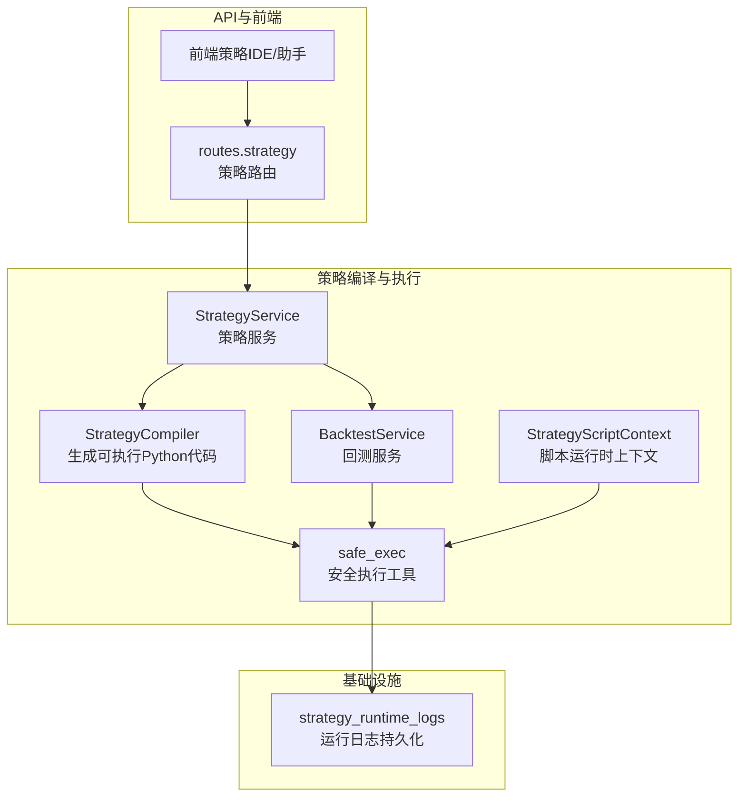
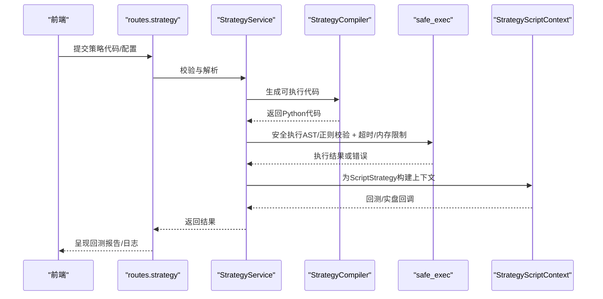
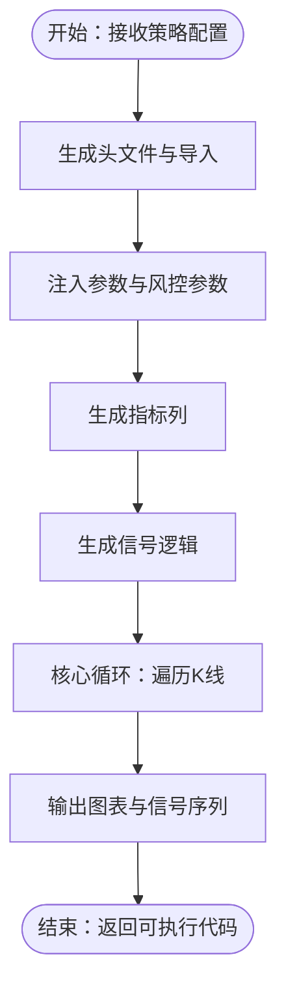
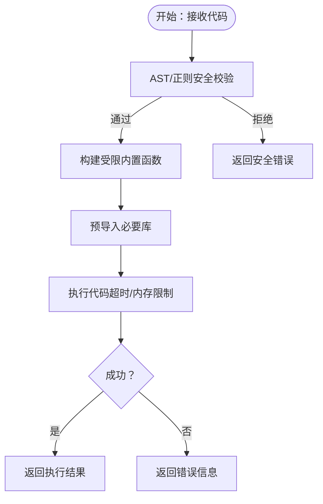
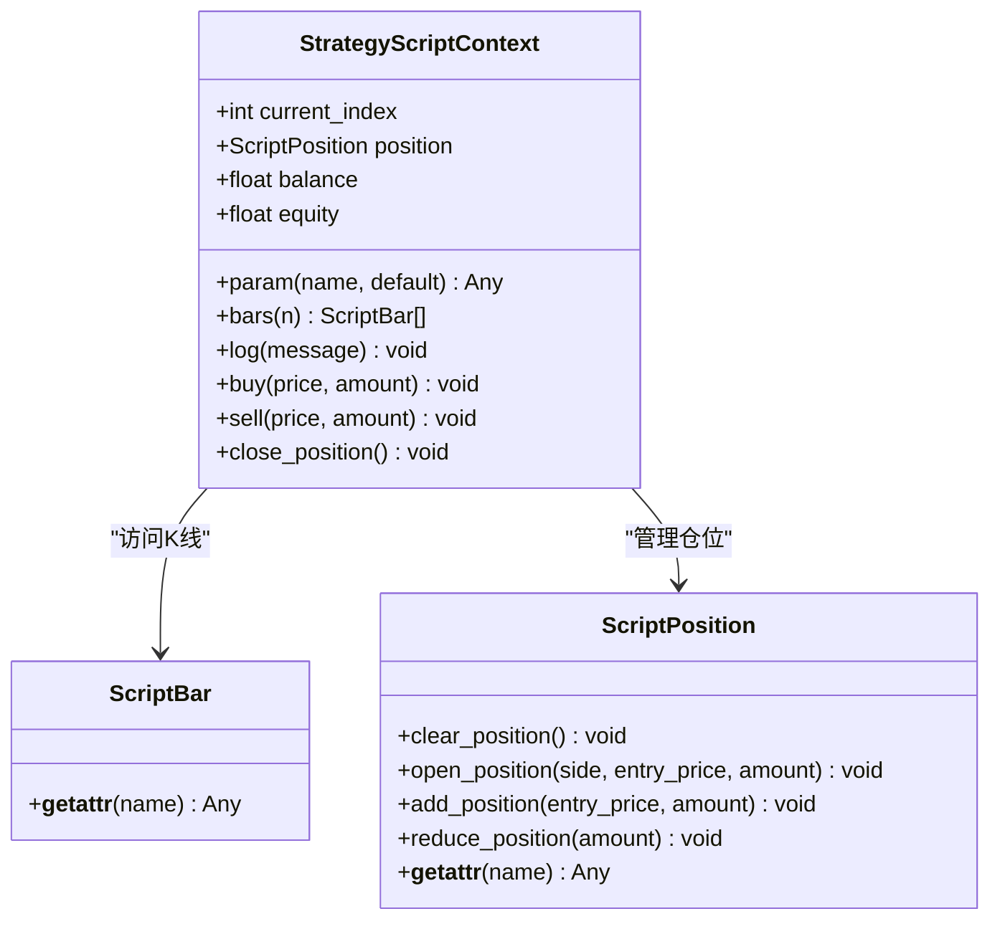
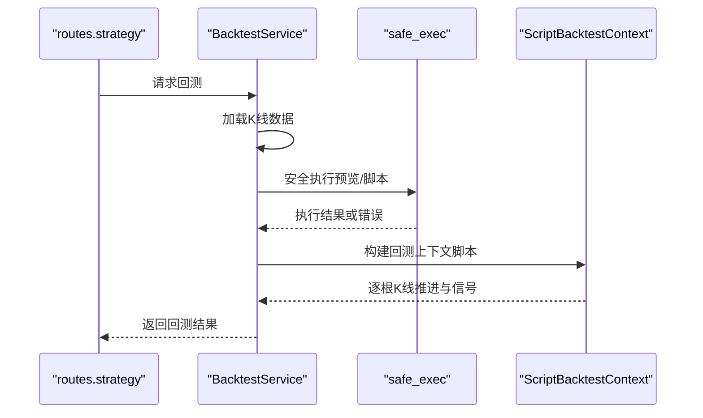
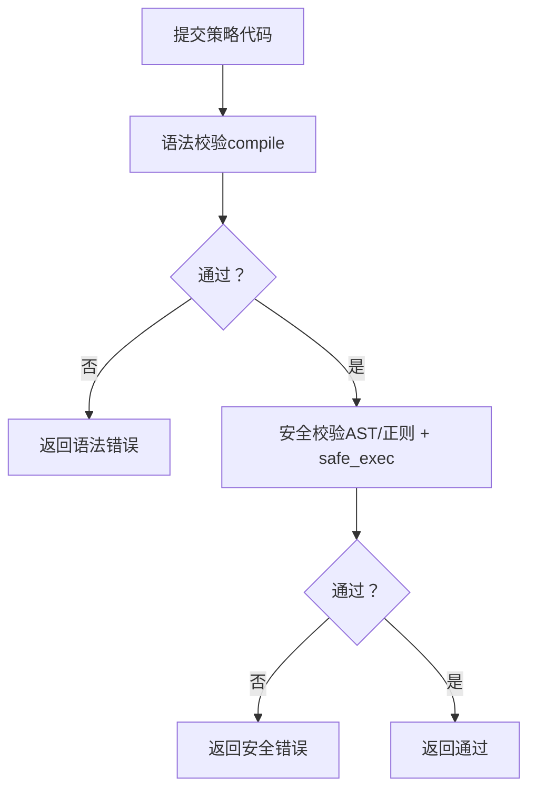
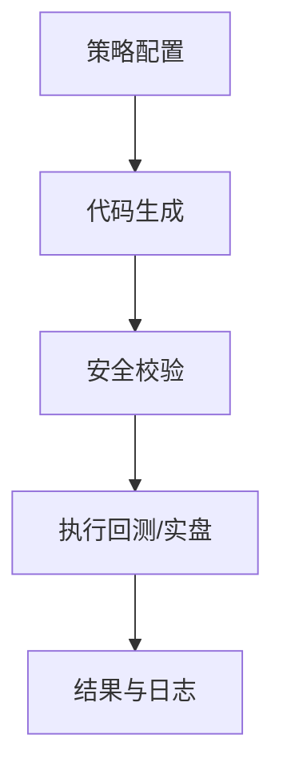
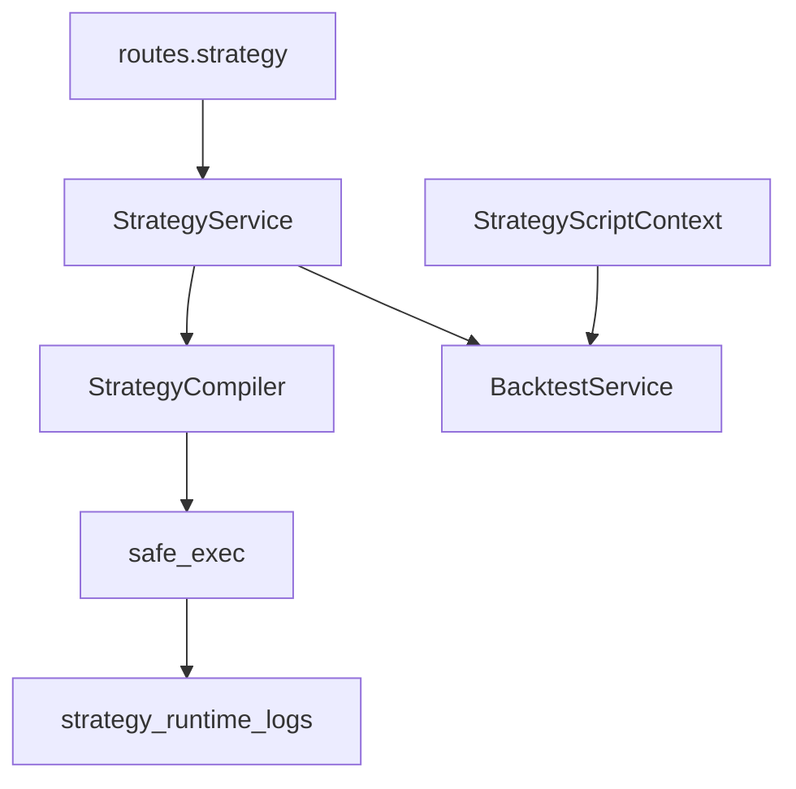

# 策略编译系统

<cite>
**本文档引用的文件**
- [strategy_compiler.py](file://backend_api_python/app/services/strategy_compiler.py)
- [safe_exec.py](file://backend_api_python/app/utils/safe_exec.py)
- [strategy_script_runtime.py](file://backend_api_python/app/services/strategy_script_runtime.py)
- [backtest.py](file://backend_api_python/app/services/backtest.py)
- [strategy.py](file://backend_api_python/app/services/strategy.py)
- [strategy_runtime_logs.py](file://backend_api_python/app/utils/strategy_runtime_logs.py)
- [dual_ma_with_params.py](file://docs/examples/dual_ma_with_params.py)
- [cross_sectional_momentum_rsi.py](file://docs/examples/cross_sectional_momentum_rsi.py)
- [strategy.py](file://backend_api_python/app/routes/strategy.py)
</cite>

## 目录
1. [简介](#简介)
2. [项目结构](#项目结构)
3. [核心组件](#核心组件)
4. [架构总览](#架构总览)
5. [详细组件分析](#详细组件分析)
6. [依赖关系分析](#依赖关系分析)
7. [性能考虑](#性能考虑)
8. [故障排查指南](#故障排查指南)
9. [结论](#结论)
10. [附录](#附录)

## 简介
本文件面向QuantDinger的策略编译系统，系统性阐述Python策略代码的编译与执行流程，涵盖以下关键主题：
- 编译过程：从配置到可执行Python代码的生成，包括语法解析、AST转换与字节码生成的前置准备。
- 安全沙箱执行：内置白名单、超时控制、内存限制与子进程隔离等多层防护。
- 策略类型差异：IndicatorStrategy与ScriptStrategy的语法与行为差异及编译/执行路径。
- 错误处理：静态校验、动态执行与日志持久化的协同机制。
- 性能优化与调试：执行超时、内存限制、日志记录与回测/实盘一致性。

## 项目结构
策略编译系统主要由以下模块构成：
- 策略编译器：将策略配置转换为可执行的Python代码字符串。
- 安全执行工具：提供白名单构建、AST/正则双重安全校验、超时与内存限制、子进程隔离等能力。
- 脚本运行时：定义ScriptStrategy的上下文对象与回调接口，确保与回测/实盘一致。
- 回测服务：封装IndicatorStrategy与ScriptStrategy的回测执行流程。
- 路由与服务：对外暴露策略模板、校验、回测与历史查询等API。
- 日志工具：将运行时日志持久化以便前端展示与排障。

**图表来源**
- [strategy_compiler.py:1-689](file://backend_api_python/app/services/strategy_compiler.py#L1-L689)
- [safe_exec.py:1-471](file://backend_api_python/app/utils/safe_exec.py#L1-L471)
- [strategy_script_runtime.py:1-191](file://backend_api_python/app/services/strategy_script_runtime.py#L1-L191)
- [backtest.py:1525-2182](file://backend_api_python/app/services/backtest.py#L1525-L2182)
- [strategy.py:1-800](file://backend_api_python/app/services/strategy.py#L1-L800)
- [strategy_runtime_logs.py:1-30](file://backend_api_python/app/utils/strategy_runtime_logs.py#L1-L30)

**章节来源**
- [strategy_compiler.py:1-689](file://backend_api_python/app/services/strategy_compiler.py#L1-L689)
- [safe_exec.py:1-471](file://backend_api_python/app/utils/safe_exec.py#L1-L471)
- [strategy_script_runtime.py:1-191](file://backend_api_python/app/services/strategy_script_runtime.py#L1-L191)
- [backtest.py:1525-2182](file://backend_api_python/app/services/backtest.py#L1525-L2182)
- [strategy.py:1-800](file://backend_api_python/app/services/strategy.py#L1-L800)
- [strategy_runtime_logs.py:1-30](file://backend_api_python/app/utils/strategy_runtime_logs.py#L1-L30)

## 核心组件
- 策略编译器（StrategyCompiler）
  - 将策略配置（名称、入场规则、仓位配置、加仓规则、风控等）转换为可执行的Python代码字符串。
  - 生成阶段包括：头文件与导入、参数与风控、指标计算、信号逻辑、核心循环与输出格式化。
- 安全执行工具（safe_exec）
  - 构建受限的内置函数白名单，仅允许纯计算类操作。
  - 提供AST与正则双重安全校验，拒绝危险导入与调用。
  - 支持跨平台超时控制与内存限制，必要时使用子进程隔离。
- 脚本运行时（StrategyScriptContext）
  - 定义ScriptStrategy的上下文对象，提供参数、K线访问、下单意图与日志接口。
  - 与回测上下文保持一致，确保实盘逐根K线推进时的行为稳定。
- 回测服务（BacktestService）
  - 封装IndicatorStrategy与ScriptStrategy的回测执行流程。
  - 对ScriptStrategy提供预览执行与严格的安全校验。
- 策略服务（StrategyService）
  - 提供策略类型判定、连接测试、显示信息构建等辅助能力。
- 运行日志（strategy_runtime_logs）
  - 将策略运行日志持久化至数据库，便于前端展示与排障。

**章节来源**
- [strategy_compiler.py:1-689](file://backend_api_python/app/services/strategy_compiler.py#L1-L689)
- [safe_exec.py:1-471](file://backend_api_python/app/utils/safe_exec.py#L1-L471)
- [strategy_script_runtime.py:1-191](file://backend_api_python/app/services/strategy_script_runtime.py#L1-L191)
- [backtest.py:1525-2182](file://backend_api_python/app/services/backtest.py#L1525-L2182)
- [strategy.py:534-547](file://backend_api_python/app/services/strategy.py#L534-L547)
- [strategy_runtime_logs.py:1-30](file://backend_api_python/app/utils/strategy_runtime_logs.py#L1-L30)

## 架构总览
策略编译系统采用“配置驱动 + 安全执行”的设计：
- 配置驱动：策略配置经编译器生成可执行代码，避免直接拼接字符串带来的脆弱性。
- 安全执行：所有用户代码在受限环境中执行，结合超时、内存限制与子进程隔离，降低风险。
- 一致性保障：脚本运行时与回测上下文对齐，确保回测与实盘行为一致。

**图表来源**
- [strategy.py:67-122](file://backend_api_python/app/routes/strategy.py#L67-L122)
- [strategy_compiler.py:1-689](file://backend_api_python/app/services/strategy_compiler.py#L1-L689)
- [safe_exec.py:207-243](file://backend_api_python/app/utils/safe_exec.py#L207-L243)
- [strategy_script_runtime.py:159-191](file://backend_api_python/app/services/strategy_script_runtime.py#L159-L191)

## 详细组件分析

### 组件A：策略编译器（StrategyCompiler）
- 职责
  - 将策略配置转换为可执行的Python代码，包含导入、参数、指标计算、信号逻辑、核心循环与输出。
- 关键流程
  - 头文件与导入：注入必要的库与辅助函数。
  - 参数与风控：将仓位、杠杆、加仓阈值、止盈止损等参数注入全局命名空间。
  - 指标计算：根据规则生成指标列（如EMA、RSI、MACD、布林带、KDJ、SuperTrend等）。
  - 信号逻辑：根据规则生成原始买卖信号列。
  - 核心循环：遍历K线，维护持仓状态、止盈止损、加仓与平仓逻辑。
  - 输出格式化：生成图表与信号序列，供回测/可视化使用。
- 数据结构与复杂度
  - 指标计算与信号逻辑以向量化为主，整体复杂度与数据长度线性相关。
  - 核心循环遍历一次K线，时间复杂度O(N)，空间复杂度O(N)。
- 优化建议
  - 合理复用中间列，避免重复计算。
  - 使用向量化操作替代显式循环，提升性能。
  - 控制指标数量与窗口大小，平衡精度与性能。

**图表来源**
- [strategy_compiler.py:4-35](file://backend_api_python/app/services/strategy_compiler.py#L4-L35)
- [strategy_compiler.py:86-222](file://backend_api_python/app/services/strategy_compiler.py#L86-L222)
- [strategy_compiler.py:224-376](file://backend_api_python/app/services/strategy_compiler.py#L224-L376)
- [strategy_compiler.py:378-565](file://backend_api_python/app/services/strategy_compiler.py#L378-L565)
- [strategy_compiler.py:567-687](file://backend_api_python/app/services/strategy_compiler.py#L567-L687)

**章节来源**
- [strategy_compiler.py:1-689](file://backend_api_python/app/services/strategy_compiler.py#L1-L689)

### 组件B：安全执行工具（safe_exec）
- 职责
  - 构建受限的内置函数白名单，仅允许纯计算类操作。
  - 提供AST与正则双重安全校验，拒绝危险导入与调用。
  - 支持跨平台超时控制与内存限制，必要时使用子进程隔离。
- 关键流程
  - 白名单构建：从内置模块中筛选安全函数与常量。
  - 导入限制：仅允许白名单模块导入。
  - 正则校验：扫描危险模式（如os、subprocess、eval、exec等）。
  - AST校验：遍历AST节点，拒绝危险导入、调用与属性访问。
  - 超时控制：Unix主线程使用SIGALRM，非主线程使用异步异常注入。
  - 内存限制：通过RLIMIT_AS限制子进程内存（Linux）。
  - 子进程隔离：将用户代码放入独立子进程，崩溃或超时仅影响子进程。
- 错误处理
  - 语法错误：AST解析失败或正则匹配失败时拒绝执行。
  - 超时/内存不足：捕获超时与MemoryError并返回错误信息。
  - 其他异常：记录堆栈并返回通用错误信息。

**图表来源**
- [safe_exec.py:358-471](file://backend_api_python/app/utils/safe_exec.py#L358-L471)
- [safe_exec.py:74-92](file://backend_api_python/app/utils/safe_exec.py#L74-L92)
- [safe_exec.py:207-243](file://backend_api_python/app/utils/safe_exec.py#L207-L243)
- [safe_exec.py:97-153](file://backend_api_python/app/utils/safe_exec.py#L97-L153)

**章节来源**
- [safe_exec.py:1-471](file://backend_api_python/app/utils/safe_exec.py#L1-L471)

### 组件C：脚本运行时（StrategyScriptContext）
- 职责
  - 定义ScriptStrategy的上下文对象，提供参数、K线访问、下单意图与日志接口。
  - 与回测上下文保持一致，确保实盘逐根K线推进时的行为稳定。
- 关键接口
  - 参数：通过ctx.param(name, default)声明与获取参数。
  - K线访问：通过ctx.bars(n)获取最近n根K线。
  - 下单意图：ctx.buy/ctx.sell/ctx.close_position记录订单意图。
  - 日志：ctx.log(message)记录运行日志。
- 编译与校验
  - 通过compile_strategy_script_handlers对脚本进行安全校验，确保存在on_bar回调，on_init可选。

**图表来源**
- [strategy_script_runtime.py:114-157](file://backend_api_python/app/services/strategy_script_runtime.py#L114-L157)
- [strategy_script_runtime.py:17-23](file://backend_api_python/app/services/strategy_script_runtime.py#L17-L23)
- [strategy_script_runtime.py:25-72](file://backend_api_python/app/services/strategy_script_runtime.py#L25-L72)

**章节来源**
- [strategy_script_runtime.py:1-191](file://backend_api_python/app/services/strategy_script_runtime.py#L1-L191)

### 组件D：回测服务（BacktestService）
- 职责
  - 封装IndicatorStrategy与ScriptStrategy的回测执行流程。
  - 对ScriptStrategy提供预览执行与严格的安全校验。
- 关键流程
  - 加载K线数据，准备执行环境（本地变量、NumPy/Pandas、安全内置）。
  - 执行用户代码，支持超时与内存限制。
  - 对于ScriptStrategy，构建回测上下文，逐根K线推进并记录信号与订单。
- 错误处理
  - 执行失败时返回错误信息，回测历史中记录失败原因。

**图表来源**
- [backtest.py:1542-1564](file://backend_api_python/app/services/backtest.py#L1542-L1564)
- [backtest.py:1594-1631](file://backend_api_python/app/services/backtest.py#L1594-L1631)
- [backtest.py:1994-2182](file://backend_api_python/app/services/backtest.py#L1994-L2182)

**章节来源**
- [backtest.py:1525-2182](file://backend_api_python/app/services/backtest.py#L1525-L2182)

### 组件E：策略类型与路由校验
- 策略类型
  - IndicatorStrategy：通过编译器生成可执行代码，返回图表与信号序列。
  - ScriptStrategy：通过on_init/on_bar回调与上下文交互，支持下单意图与日志。
- 路由校验
  - 对脚本策略进行语法与运行时校验，确保存在必需函数与安全执行。

**图表来源**
- [strategy.py:67-122](file://backend_api_python/app/routes/strategy.py#L67-L122)

**章节来源**
- [strategy.py:67-122](file://backend_api_python/app/routes/strategy.py#L67-L122)

### 概念性总览
策略编译系统通过“配置 → 代码生成 → 安全执行 → 结果呈现”的闭环，确保策略开发与部署的安全与高效。

[本图为概念性示意，无需图表来源]

## 依赖关系分析
- 组件耦合
  - StrategyCompiler与safe_exec：编译器生成的代码通过safe_exec执行，二者通过“可执行代码字符串”耦合。
  - StrategyScriptContext与BacktestService：脚本策略在回测中通过上下文逐根推进，二者强耦合。
  - routes.strategy与StrategyService：路由负责入口校验与调用服务层。
- 外部依赖
  - NumPy/Pandas：用于指标计算与向量化操作。
  - Python内置与白名单：通过受限内置函数保证安全。
  - 多进程：子进程隔离用于极端情况下的安全兜底。

**图表来源**
- [strategy_compiler.py:1-689](file://backend_api_python/app/services/strategy_compiler.py#L1-L689)
- [safe_exec.py:1-471](file://backend_api_python/app/utils/safe_exec.py#L1-L471)
- [strategy_script_runtime.py:1-191](file://backend_api_python/app/services/strategy_script_runtime.py#L1-L191)
- [backtest.py:1525-2182](file://backend_api_python/app/services/backtest.py#L1525-L2182)
- [strategy.py:1-800](file://backend_api_python/app/services/strategy.py#L1-L800)
- [strategy_runtime_logs.py:1-30](file://backend_api_python/app/utils/strategy_runtime_logs.py#L1-L30)

**章节来源**
- [strategy_compiler.py:1-689](file://backend_api_python/app/services/strategy_compiler.py#L1-L689)
- [safe_exec.py:1-471](file://backend_api_python/app/utils/safe_exec.py#L1-L471)
- [strategy_script_runtime.py:1-191](file://backend_api_python/app/services/strategy_script_runtime.py#L1-L191)
- [backtest.py:1525-2182](file://backend_api_python/app/services/backtest.py#L1525-L2182)
- [strategy.py:1-800](file://backend_api_python/app/services/strategy.py#L1-L800)
- [strategy_runtime_logs.py:1-30](file://backend_api_python/app/utils/strategy_runtime_logs.py#L1-L30)

## 性能考虑
- 向量化优先：尽量使用NumPy/Pandas的向量化操作，减少显式循环。
- 指标缓存：对重复使用的中间列进行缓存，避免重复计算。
- 窗口大小控制：合理设置指标窗口，兼顾响应速度与稳定性。
- 超时与内存限制：通过safe_exec的超时与内存限制防止长耗时与内存泄漏。
- 子进程隔离：在极端情况下启用子进程隔离，避免阻塞主进程。

[本节为通用指导，无需章节来源]

## 故障排查指南
- 常见错误类型
  - 语法错误：AST解析失败或正则匹配失败，需修正代码语法。
  - 安全拒绝：导入了非白名单模块或调用了危险函数，需调整导入与调用方式。
  - 超时/内存不足：执行时间过长或内存占用过高，需优化算法或降低数据规模。
  - 运行时错误：脚本抛出异常，需检查上下文与回调函数。
- 排查步骤
  - 使用路由中的校验接口先进行静态校验与运行时校验。
  - 查看回测历史中的错误信息与日志。
  - 启用子进程隔离进行隔离执行，定位问题来源。
  - 通过strategy_runtime_logs查看持久化日志，辅助定位。
- 调试技巧
  - 在脚本中使用ctx.log记录关键变量与状态。
  - 分段执行：先验证指标计算，再验证信号逻辑，最后验证核心循环。
  - 使用小数据集快速迭代，确认逻辑正确后再扩大范围。

**章节来源**
- [strategy.py:67-122](file://backend_api_python/app/routes/strategy.py#L67-L122)
- [safe_exec.py:157-205](file://backend_api_python/app/utils/safe_exec.py#L157-L205)
- [strategy_runtime_logs.py:11-30](file://backend_api_python/app/utils/strategy_runtime_logs.py#L11-L30)

## 结论
QuantDinger的策略编译系统通过“配置驱动 + 安全执行”的设计，在保证策略灵活性的同时，提供了多层安全防护与一致的执行体验。编译器将配置转化为可执行代码，安全执行工具提供严格的校验与隔离，脚本运行时与回测服务确保行为一致性。配合完善的日志与校验机制，系统能够有效支撑策略开发、回测与实盘部署的全流程。

[本节为总结，无需章节来源]

## 附录

### A. 策略类型与语法差异
- IndicatorStrategy
  - 通过编译器生成代码，返回图表与信号序列。
  - 示例：双均线策略（含参数声明与默认风控配置）。
- ScriptStrategy
  - 通过on_init/on_bar回调与上下文交互，支持下单意图与日志。
  - 示例：截面动量RSI复合评分（研究参考）。

**章节来源**
- [dual_ma_with_params.py:1-64](file://docs/examples/dual_ma_with_params.py#L1-L64)
- [cross_sectional_momentum_rsi.py:1-71](file://docs/examples/cross_sectional_momentum_rsi.py#L1-L71)

### B. API与路由要点
- 策略模板：提供预设模板供一键导入。
- 代码校验：对脚本策略进行语法与运行时校验。
- 回测接口：支持按日期范围与时间框架执行回测。
- 历史查询：支持查询回测历史与结果。

**章节来源**
- [strategy.py:251-303](file://backend_api_python/app/routes/strategy.py#L251-L303)
- [strategy.py:67-122](file://backend_api_python/app/routes/strategy.py#L67-L122)
- [strategy.py:467-611](file://backend_api_python/app/routes/strategy.py#L467-L611)
- [strategy.py:613-707](file://backend_api_python/app/routes/strategy.py#L613-L707)