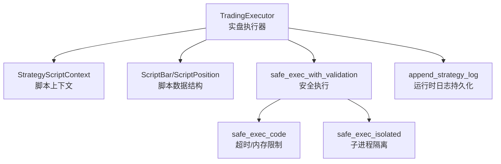
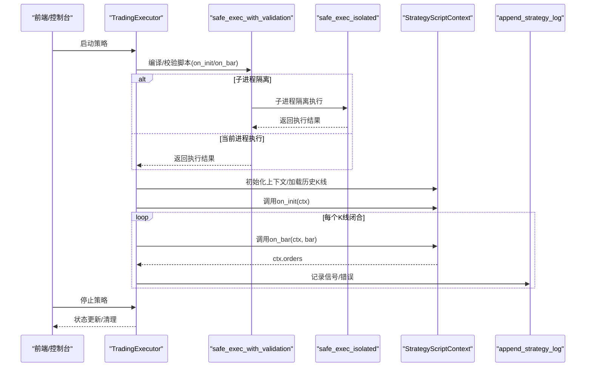
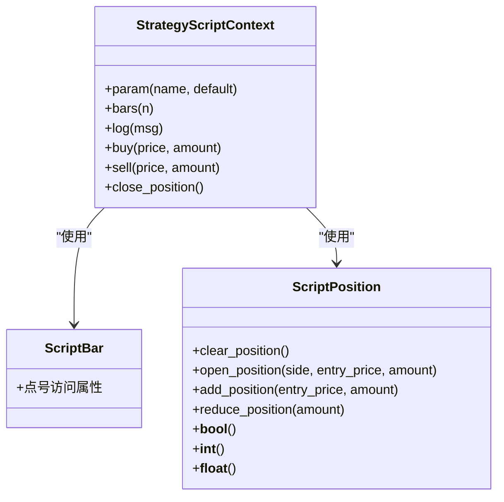
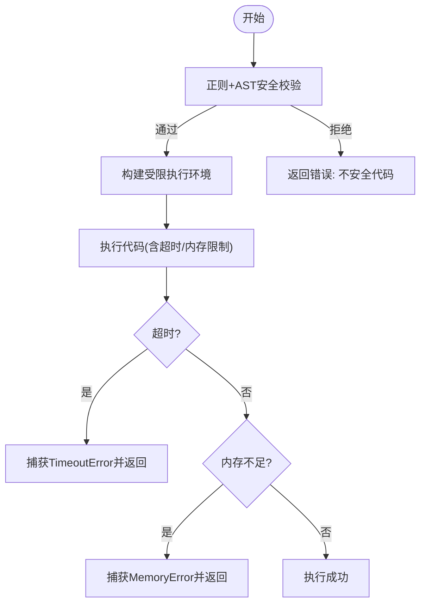
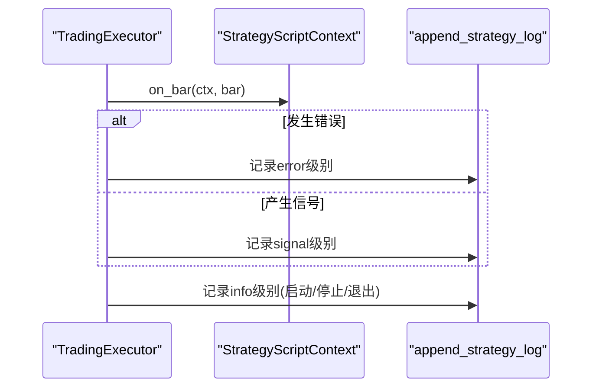
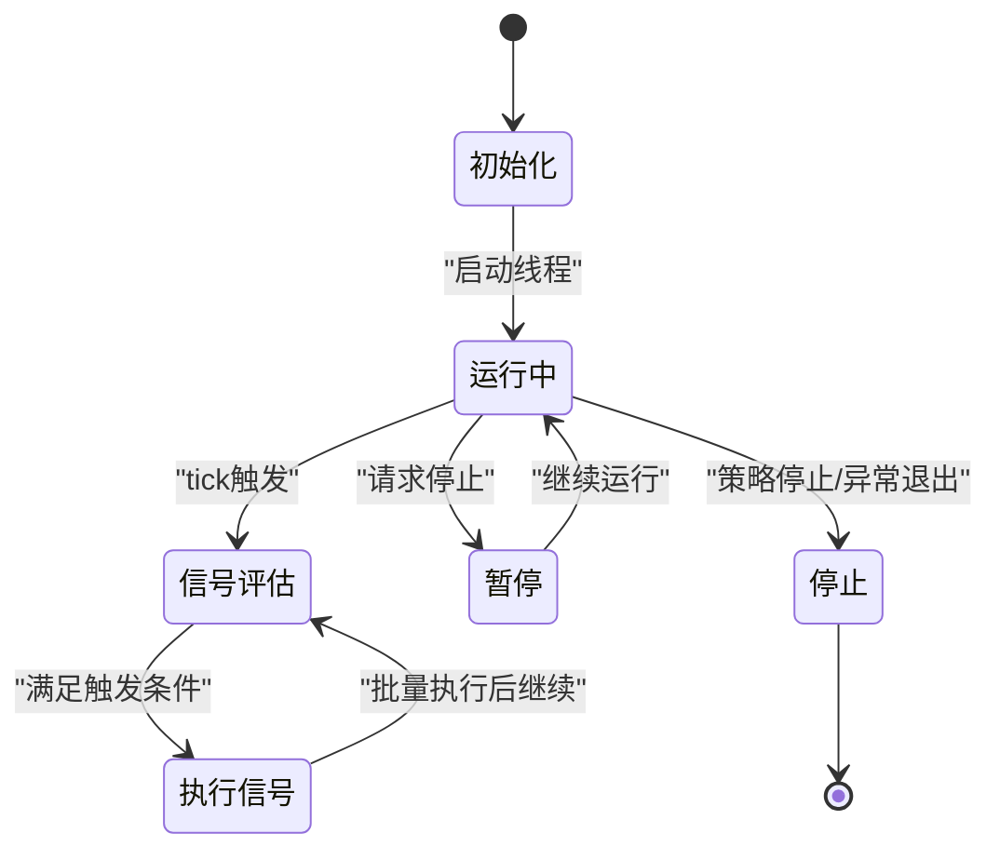
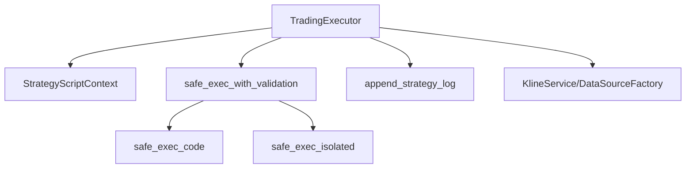

# 策略运行时环境

<cite>
**本文引用的文件**
- [strategy_script_runtime.py](file://backend_api_python/app/services/strategy_script_runtime.py)
- [safe_exec.py](file://backend_api_python/app/utils/safe_exec.py)
- [strategy_runtime_logs.py](file://backend_api_python/app/utils/strategy_runtime_logs.py)
- [trading_executor.py](file://backend_api_python/app/services/trading_executor.py)
</cite>

## 目录
1. [简介](#简介)
2. [项目结构](#项目结构)
3. [核心组件](#核心组件)
4. [架构总览](#架构总览)
5. [详细组件分析](#详细组件分析)
6. [依赖分析](#依赖分析)
7. [性能考量](#性能考量)
8. [故障排查指南](#故障排查指南)
9. [结论](#结论)
10. [附录](#附录)

## 简介
本文件面向QuantDinger的策略运行时环境，系统化阐述策略脚本的执行环境隔离机制、运行时日志体系、策略生命周期管理（启动、监控、暂停、终止）、以及性能监控、错误捕获与恢复机制。重点覆盖以下方面：
- 策略脚本的沙箱执行与超时/内存限制
- 进程级隔离与子进程隔离方案
- 日志采集、持久化与UI展示
- 实盘逐根K线驱动的策略生命周期
- 资源配额、线程上限与健康观测

## 项目结构
围绕策略运行时的关键文件与职责如下：
- 策略脚本运行时与上下文：strategy_script_runtime.py
- 安全执行与隔离：safe_exec.py
- 运行时日志持久化：strategy_runtime_logs.py
- 实盘执行器与生命周期：trading_executor.py

图表来源
- [trading_executor.py](file://backend_api_python/app/services/trading_executor.py)
- [strategy_script_runtime.py](file://backend_api_python/app/services/strategy_script_runtime.py)
- [safe_exec.py](file://backend_api_python/app/utils/safe_exec.py)
- [strategy_runtime_logs.py](file://backend_api_python/app/utils/strategy_runtime_logs.py)

章节来源
- [trading_executor.py](file://backend_api_python/app/services/trading_executor.py)
- [strategy_script_runtime.py](file://backend_api_python/app/services/strategy_script_runtime.py)
- [safe_exec.py](file://backend_api_python/app/utils/safe_exec.py)
- [strategy_runtime_logs.py](file://backend_api_python/app/utils/strategy_runtime_logs.py)

## 核心组件
- 策略脚本上下文与数据结构
  - ScriptBar：封装K线字段，支持点号访问
  - ScriptPosition：封装持仓状态与增减仓逻辑
  - StrategyScriptContext：策略脚本的执行上下文，提供param/bars/log/buy/sell/close_position等接口，并维护orders/logs/position/balance/equity等状态
- 策略脚本编译与加载
  - compile_strategy_script_handlers：校验并编译用户脚本，返回on_init/on_bar句柄，要求on_bar必须存在，on_init可选
- 安全执行与隔离
  - build_safe_builtins：构建受限内置集合，禁用危险能力
  - safe_exec_with_validation：双重校验（正则+AST）+受限执行+超时/内存限制
  - safe_exec_isolated：子进程隔离执行，独立内存空间，崩溃或死循环仅影响子进程
- 运行时日志
  - append_strategy_log：最佳努力持久化策略运行时日志至数据库表qd_strategy_logs，避免阻塞主流程

章节来源
- [strategy_script_runtime.py](file://backend_api_python/app/services/strategy_script_runtime.py)
- [safe_exec.py](file://backend_api_python/app/utils/safe_exec.py)
- [strategy_runtime_logs.py](file://backend_api_python/app/utils/strategy_runtime_logs.py)

## 架构总览
策略运行时采用“主线程策略循环 + 脚本沙箱执行”的双层架构：
- TradingExecutor负责策略生命周期、K线拉取、实时价格、信号评估与执行、风控（止损/止盈/追踪）
- 策略脚本在受限环境中执行，通过StrategyScriptContext与脚本交互，输出订单指令
- 安全执行模块提供超时与内存限制，必要时启用子进程隔离
- 运行时日志通过append_strategy_log异步持久化，保障UI可观测性

图表来源
- [trading_executor.py](file://backend_api_python/app/services/trading_executor.py)
- [strategy_script_runtime.py](file://backend_api_python/app/services/strategy_script_runtime.py)
- [safe_exec.py](file://backend_api_python/app/utils/safe_exec.py)
- [strategy_runtime_logs.py](file://backend_api_python/app/utils/strategy_runtime_logs.py)

## 详细组件分析

### 组件A：策略脚本运行时与上下文
- 数据结构
  - ScriptBar：封装open/high/low/close/volume/time字段，支持点号访问
  - ScriptPosition：封装side/size/entry_price/direction/amount，提供开仓/加仓/减仓/清仓语义
  - StrategyScriptContext：维护bars_df、params、orders、logs、position、balance、equity、current_index等，提供param/bars/log/buy/sell/close_position等接口
- 生命周期
  - 初始化：加载历史K线DataFrame，构建ScriptBar序列，初始化ctx
  - 执行：on_init(ctx)（可选），随后对每根闭合K线调用on_bar(ctx, bar)
  - 结果：ctx._orders累积为待执行信号，ctx._logs用于运行时日志
- 资源与隔离
  - 通过compile_strategy_script_handlers与safe_exec_with_validation共同保证安全与可控

图表来源
- [strategy_script_runtime.py](file://backend_api_python/app/services/strategy_script_runtime.py)

章节来源
- [strategy_script_runtime.py](file://backend_api_python/app/services/strategy_script_runtime.py)

### 组件B：安全执行与隔离
- 白名单内置与模块导入
  - 仅允许纯计算类内置与有限模块（如numpy/pandas/math/json/datetime等），禁止os/sys/subprocess等危险模块
- 超时机制
  - 跨平台：主线程使用SIGALRM（Unix），非主线程使用定时器+异步异常注入
  - 超时后抛出TimeoutError并被捕获返回错误信息
- 内存限制
  - 在支持的平台通过RLIMIT_AS设置最大地址空间（Linux/Unix），超出MemoryError被捕获
- 子进程隔离
  - safe_exec_isolated：在独立子进程中执行，父子通过管道传递picklable结果，异常/超时/崩溃均不影响父进程
- 代码安全校验
  - 正则匹配危险模式，AST遍历检查非法导入/调用/属性访问，拒绝高危代码

图表来源
- [safe_exec.py](file://backend_api_python/app/utils/safe_exec.py)

章节来源
- [safe_exec.py](file://backend_api_python/app/utils/safe_exec.py)

### 组件C：运行时日志系统
- 持久化
  - append_strategy_log：将日志写入qd_strategy_logs表，字段包含strategy_id/level/message，消息长度裁剪，异常静默
- UI可观测性
  - TradingExecutor每tick输出控制台心跳，便于快速定位问题
- 日志粒度
  - 包括策略启动/停止、信号提交/拒绝、循环错误、致命错误等

图表来源
- [strategy_runtime_logs.py](file://backend_api_python/app/utils/strategy_runtime_logs.py)
- [trading_executor.py](file://backend_api_python/app/services/trading_executor.py)

章节来源
- [strategy_runtime_logs.py](file://backend_api_python/app/utils/strategy_runtime_logs.py)
- [trading_executor.py](file://backend_api_python/app/services/trading_executor.py)

### 组件D：策略生命周期管理（启动/监控/暂停/终止）
- 启动
  - 线程池上限保护（STRATEGY_MAX_THREADS），避免线程爆炸
  - 加载策略配置、初始化K线、调用on_init（如有）
  - 进入统一tick循环（默认10秒），按K线周期更新与实时评估
- 监控
  - 每tick输出控制台心跳，记录pending_signals数量
  - 信号有效期清理（基于K线周期×2），避免陈旧信号
  - 严格状态机与优先级：先平仓/再减仓/再开仓，Bot模式可多跳状态转换
- 暂停/终止
  - stop_strategy：更新数据库状态为stopped，线程在下次循环检查时退出
  - _is_strategy_running：同时校验数据库状态与线程存活，修复“僵尸”状态
- 资源健康
  - _log_resource_status：尝试打印内存/线程数/运行中的策略数，辅助定位资源瓶颈

图表来源
- [trading_executor.py](file://backend_api_python/app/services/trading_executor.py)

章节来源
- [trading_executor.py](file://backend_api_python/app/services/trading_executor.py)

## 依赖分析
- TradingExecutor依赖
  - 策略脚本运行时：StrategyScriptContext/ScriptBar/compile_strategy_script_handlers
  - 安全执行：safe_exec_with_validation/safe_exec_isolated
  - 日志：append_strategy_log
  - 数据源：KlineService/DataSourceFactory（用于拉取K线与实时价格）
- 安全执行模块内部依赖
  - 正则与AST进行静态扫描
  - signal/threading/ctypes实现跨平台超时
  - multiprocessing实现子进程隔离
- 日志模块依赖
  - 数据库连接池与qd_strategy_logs表

图表来源
- [trading_executor.py](file://backend_api_python/app/services/trading_executor.py)
- [strategy_script_runtime.py](file://backend_api_python/app/services/strategy_script_runtime.py)
- [safe_exec.py](file://backend_api_python/app/utils/safe_exec.py)
- [strategy_runtime_logs.py](file://backend_api_python/app/utils/strategy_runtime_logs.py)

章节来源
- [trading_executor.py](file://backend_api_python/app/services/trading_executor.py)
- [strategy_script_runtime.py](file://backend_api_python/app/services/strategy_script_runtime.py)
- [safe_exec.py](file://backend_api_python/app/utils/safe_exec.py)
- [strategy_runtime_logs.py](file://backend_api_python/app/utils/strategy_runtime_logs.py)

## 性能考量
- 线程与CPU
  - 线程上限：STRATEGY_MAX_THREADS，默认64，避免过多线程导致“无法创建新线程”或OOM
  - tick间隔：STRATEGY_TICK_INTERVAL_SEC，默认10秒，平衡实时性与CPU占用
- 内存与超时
  - 当前进程执行：默认最大内存500MB，超时60秒；可通过环境变量调整
  - 子进程隔离：独立地址空间，崩溃/死循环不影响父进程，适合高风险脚本
- I/O与网络
  - 价格缓存：本地内存缓存+TTL，减少重复拉取
  - K线缓存：KlineService自动缓存，按周期刷新
- 数据处理
  - DataFrame数值列强制float64，缺失值剔除，避免后续计算误差
- 风控与信号去重
  - 信号有效期与去重键：避免同一根K线信号重复触发

[本节为通用性能建议，不直接分析具体文件]

## 故障排查指南
- 策略无法启动
  - 检查STRATEGY_MAX_THREADS是否已达上限
  - 查看控制台心跳与数据库状态一致性（_is_strategy_running）
- 脚本执行失败
  - 安全校验失败：查看正则/AST拒绝原因
  - 超时：增大超时或优化脚本逻辑
  - 内存不足：降低内存限制或优化脚本
  - 子进程异常：确认子进程隔离开关与返回结果
- 日志缺失
  - append_strategy_log静默失败：检查数据库连接与表结构
  - 控制台心跳：确认每tick输出是否正常
- 信号未触发
  - 检查exit_trigger_mode/entry_trigger_mode配置
  - 核对状态机与优先级：close_*优先于open/add
  - 核对信号有效期与去重键

章节来源
- [trading_executor.py](file://backend_api_python/app/services/trading_executor.py)
- [safe_exec.py](file://backend_api_python/app/utils/safe_exec.py)
- [strategy_runtime_logs.py](file://backend_api_python/app/utils/strategy_runtime_logs.py)

## 结论
QuantDinger的策略运行时环境通过“受限执行+超时/内存限制+可选子进程隔离”实现了对用户脚本的安全控制；通过TradingExecutor统一的生命周期管理与风控策略，保障了实盘执行的稳定性与可观测性；通过append_strategy_log与控制台心跳，提供了良好的运行时日志与监控体验。整体设计兼顾安全性、性能与可维护性。

[本节为总结性内容，不直接分析具体文件]

## 附录
- 关键环境变量
  - STRATEGY_MAX_THREADS：策略线程上限
  - STRATEGY_TICK_INTERVAL_SEC：tick间隔（秒）
  - PRICE_CACHE_TTL_SEC：价格缓存TTL（秒）
  - SAFE_EXEC_ENABLE_RLIMIT：是否启用RLIMIT_AS（Linux/Unix）
- 数据库表
  - qd_strategy_logs：运行时日志
  - qd_strategies_trading：策略配置与状态
  - qd_strategy_positions：策略持仓（含highest_price/lowest_price）

[本节为概要说明，不直接分析具体文件]