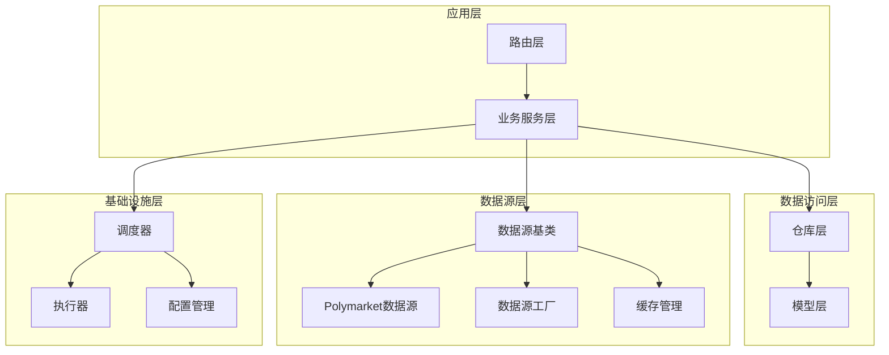
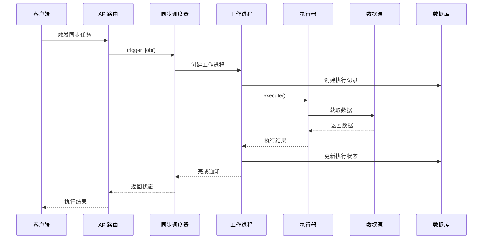
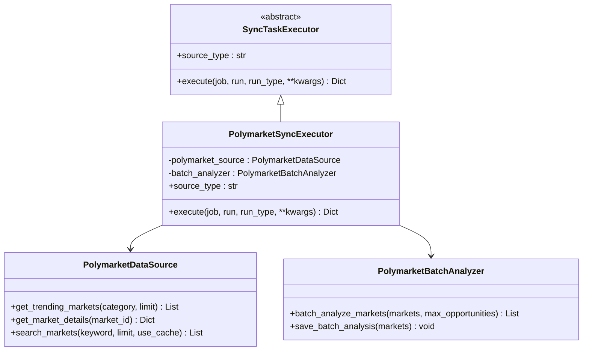
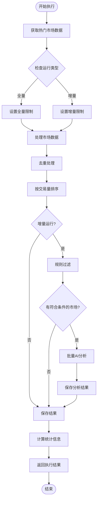
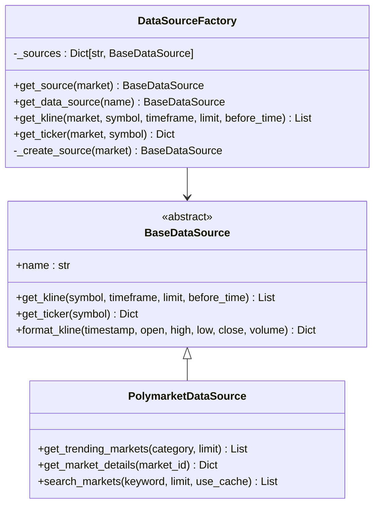
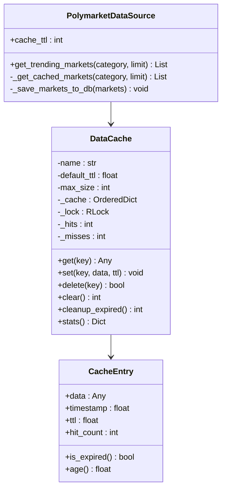
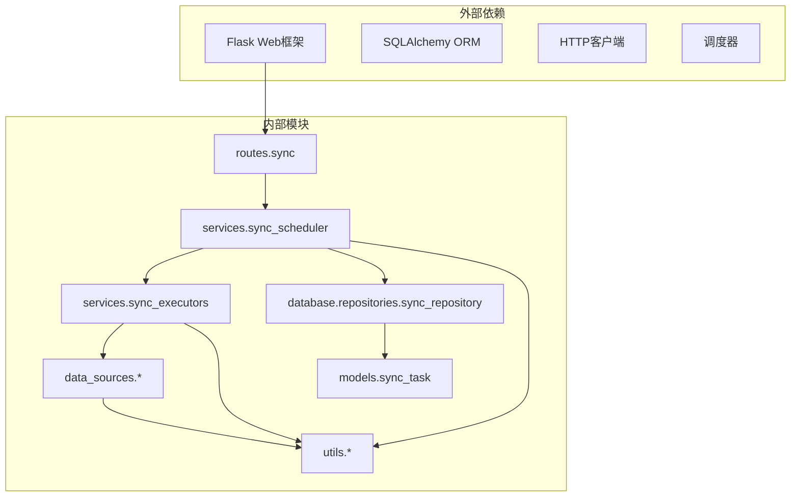

# 通用同步调度器系统

<cite>
**本文档引用的文件**
- [sync_scheduler.py](file://backend/app/services/sync_scheduler.py)
- [sync_executors.py](file://backend/app/services/sync_executors.py)
- [sync_task.py](file://backend/app/models/sync_task.py)
- [sync_repository.py](file://backend/app/database/repositories/sync_repository.py)
- [sync.py](file://backend/app/routes/sync.py)
- [polymarket.py](file://backend/app/data_sources/polymarket.py)
- [polymarket_batch_analyzer.py](file://backend/app/services/polymarket_batch_analyzer.py)
- [factory.py](file://backend/app/data_sources/factory.py)
- [cache_manager.py](file://backend/app/data_sources/cache_manager.py)
- [base.py](file://backend/app/data_sources/base.py)
- [settings.py](file://backend/app/config/settings.py)
- [002_sync_timestamp_columns.py](file://backend/migrations/versions/002_sync_timestamp_columns.py)
</cite>

## 目录
1. [简介](#简介)
2. [项目结构](#项目结构)
3. [核心组件](#核心组件)
4. [架构概览](#架构概览)
5. [详细组件分析](#详细组件分析)
6. [依赖关系分析](#依赖关系分析)
7. [性能考量](#性能考量)
8. [故障排除指南](#故障排除指南)
9. [结论](#结论)

## 简介

通用同步调度器系统是一个高度模块化的数据同步框架，专为量化交易和预测市场数据而设计。该系统提供了灵活的任务调度机制，支持多种数据源类型的自动同步，包括Polymarket预测市场、加密货币、股票、外汇等。

系统的核心特点包括：
- **多数据源支持**：统一的抽象层支持不同类型的金融数据源
- **可扩展的执行器架构**：通过插件化设计支持自定义数据源
- **智能缓存管理**：内置LRU缓存和TTL过期机制
- **完整的监控体系**：提供详细的执行状态和性能指标
- **安全的权限控制**：基于Flask的认证和授权机制

## 项目结构

系统采用清晰的分层架构，按照功能模块进行组织：

**图表来源**
- [sync_scheduler.py:1-307](file://backend/app/services/sync_scheduler.py#L1-L307)
- [sync_executors.py:1-119](file://backend/app/services/sync_executors.py#L1-L119)
- [polymarket.py:1-800](file://backend/app/data_sources/polymarket.py#L1-L800)

**章节来源**
- [sync_scheduler.py:1-307](file://backend/app/services/sync_scheduler.py#L1-L307)
- [sync_executors.py:1-119](file://backend/app/services/sync_executors.py#L1-L119)
- [sync_task.py:1-61](file://backend/app/models/sync_task.py#L1-L61)

## 核心组件

### 同步调度器 (SyncScheduler)

SyncScheduler是整个系统的核心协调器，负责管理多个同步任务的工作进程。它实现了以下关键功能：

- **任务生命周期管理**：启动、停止、重启同步任务
- **工作进程池**：维护每个任务的独立后台线程
- **状态监控**：提供实时的任务执行状态查询
- **手动触发**：支持即时执行同步任务

### 同步执行器 (SyncTaskExecutor)

SyncTaskExecutor定义了数据同步的标准接口，所有具体的数据源执行器都必须实现这些方法：

- **source_type属性**：标识支持的数据源类型
- **execute方法**：执行具体的同步逻辑
- **增量和全量同步**：支持不同的同步模式

### 数据模型

系统使用SQLAlchemy ORM定义了两个核心数据模型：

- **SyncJob**：存储同步任务的配置信息
- **SyncRun**：记录每次同步执行的历史和结果

**章节来源**
- [sync_scheduler.py:217-307](file://backend/app/services/sync_scheduler.py#L217-L307)
- [sync_executors.py:17-119](file://backend/app/services/sync_executors.py#L17-L119)
- [sync_task.py:12-61](file://backend/app/models/sync_task.py#L12-L61)

## 架构概览

系统采用分层架构设计，确保各层之间的职责分离和松耦合：

**图表来源**
- [sync.py:163-200](file://backend/app/routes/sync.py#L163-L200)
- [sync_scheduler.py:261-279](file://backend/app/services/sync_scheduler.py#L261-L279)
- [sync_executors.py:28-105](file://backend/app/services/sync_executors.py#L28-L105)

## 详细组件分析

### Polymarket同步执行器

Polymarket同步执行器展示了如何实现特定数据源的同步逻辑：

**图表来源**
- [sync_executors.py:17-119](file://backend/app/services/sync_executors.py#L17-L119)
- [polymarket.py:19-800](file://backend/app/data_sources/polymarket.py#L19-L800)
- [polymarket_batch_analyzer.py:16-222](file://backend/app/services/polymarket_batch_analyzer.py#L16-L222)

#### 执行流程分析

Polymarket同步执行器的处理流程如下：

**图表来源**
- [sync_executors.py:28-105](file://backend/app/services/sync_executors.py#L28-L105)

**章节来源**
- [sync_executors.py:17-119](file://backend/app/services/sync_executors.py#L17-L119)
- [polymarket.py:37-90](file://backend/app/data_sources/polymarket.py#L37-L90)

### 数据源工厂模式

数据源工厂提供了统一的数据源访问接口：

**图表来源**
- [factory.py:13-134](file://backend/app/data_sources/factory.py#L13-L134)
- [base.py:27-171](file://backend/app/data_sources/base.py#L27-L171)

**章节来源**
- [factory.py:13-134](file://backend/app/data_sources/factory.py#L13-L134)
- [base.py:27-171](file://backend/app/data_sources/base.py#L27-L171)

### 缓存管理系统

系统实现了智能的缓存管理机制：

**图表来源**
- [cache_manager.py:44-233](file://backend/app/data_sources/cache_manager.py#L44-L233)
- [polymarket.py:345-394](file://backend/app/data_sources/polymarket.py#L345-L394)

**章节来源**
- [cache_manager.py:44-233](file://backend/app/data_sources/cache_manager.py#L44-L233)
- [polymarket.py:345-394](file://backend/app/data_sources/polymarket.py#L345-L394)

## 依赖关系分析

系统采用了清晰的依赖层次结构：

**图表来源**
- [sync.py:1-360](file://backend/app/routes/sync.py#L1-L360)
- [sync_scheduler.py:1-307](file://backend/app/services/sync_scheduler.py#L1-L307)
- [sync_executors.py:1-119](file://backend/app/services/sync_executors.py#L1-L119)

**章节来源**
- [sync.py:1-360](file://backend/app/routes/sync.py#L1-L360)
- [sync_scheduler.py:1-307](file://backend/app/services/sync_scheduler.py#L1-L307)

## 性能考量

### 缓存策略

系统实现了多层次的缓存策略来优化性能：

- **TTL过期机制**：默认20分钟TTL，确保数据新鲜度
- **LRU淘汰策略**：当缓存满时自动淘汰最久未使用的条目
- **容量限制**：防止内存无限增长
- **统计监控**：提供命中率和性能指标

### 并发处理

系统采用多线程架构处理并发任务：

- **独立工作线程**：每个同步任务在独立线程中运行
- **线程安全**：使用锁机制保护共享资源
- **优雅关闭**：支持超时控制和资源清理

### 数据库优化

- **批量操作**：支持批量插入和更新操作
- **索引优化**：为常用查询字段建立索引
- **连接池管理**：复用数据库连接减少开销

## 故障排除指南

### 常见问题诊断

1. **任务无法启动**
   - 检查执行器是否正确注册
   - 验证数据源连接配置
   - 查看日志中的错误信息

2. **同步任务失败**
   - 检查API限流和配额
   - 验证网络连接稳定性
   - 确认数据库连接正常

3. **性能问题**
   - 监控缓存命中率
   - 检查数据库查询性能
   - 优化批量处理大小

### 调试工具

系统提供了丰富的调试和监控功能：

- **详细日志记录**：记录每个步骤的执行情况
- **状态查询接口**：实时查看系统状态
- **性能指标监控**：跟踪执行时间和资源使用

**章节来源**
- [sync_scheduler.py:138-205](file://backend/app/services/sync_scheduler.py#L138-L205)
- [polymarket.py:485-508](file://backend/app/data_sources/polymarket.py#L485-L508)

## 结论

通用同步调度器系统是一个设计精良的分布式数据同步框架，具有以下优势：

1. **高度模块化**：清晰的分层架构便于维护和扩展
2. **强大的可扩展性**：支持多种数据源和自定义执行器
3. **完善的监控体系**：提供全面的状态监控和性能指标
4. **健壮的错误处理**：具备完善的异常处理和恢复机制
5. **高效的性能表现**：通过缓存和并发处理优化性能

该系统为量化交易和预测市场数据分析提供了坚实的技术基础，能够满足各种复杂的数据同步需求。通过合理的架构设计和实现细节，系统在保证功能完整性的同时，也兼顾了性能和可维护性。