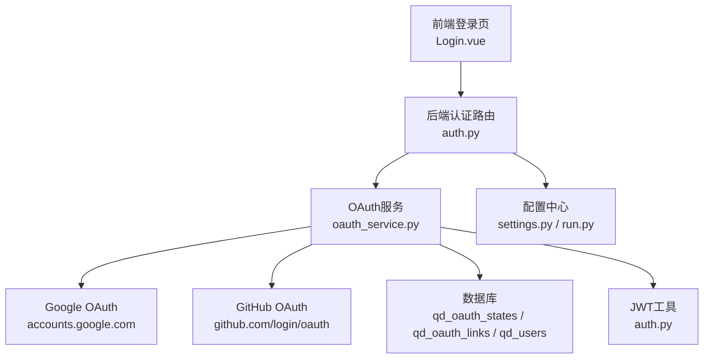
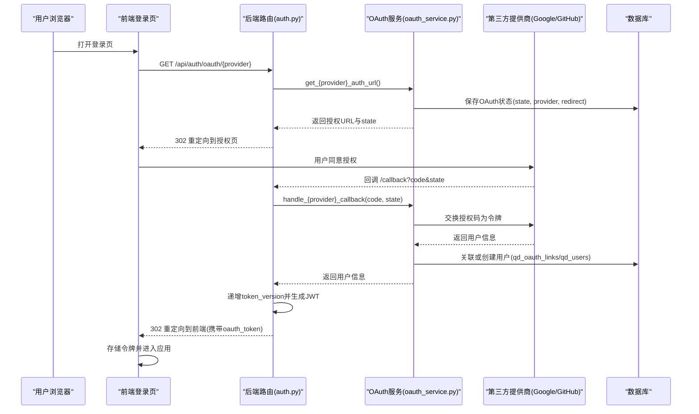
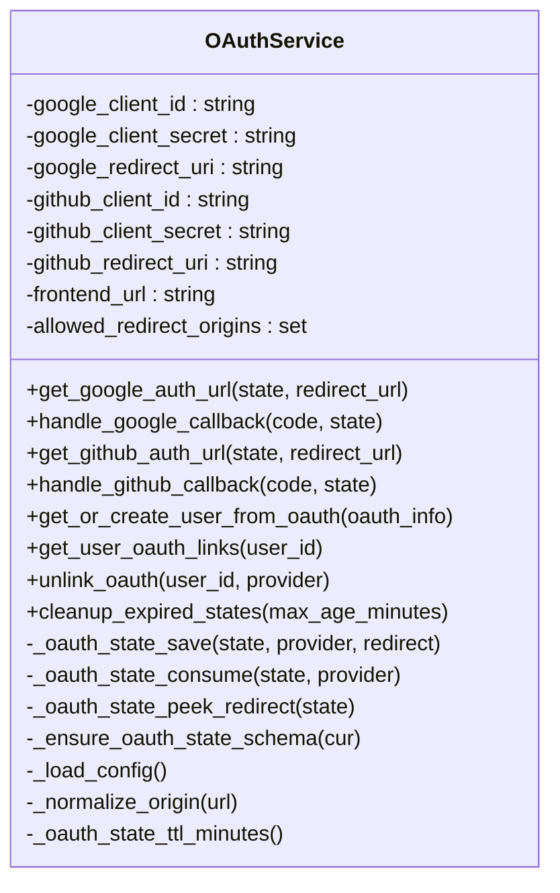
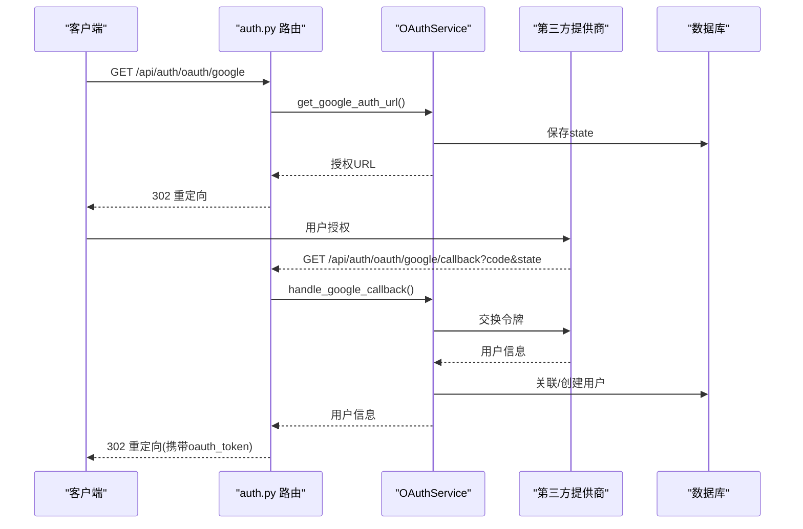
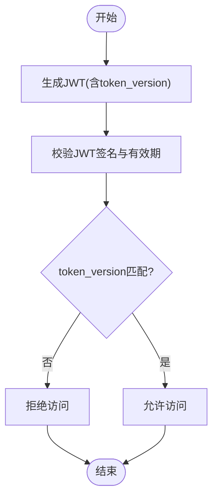
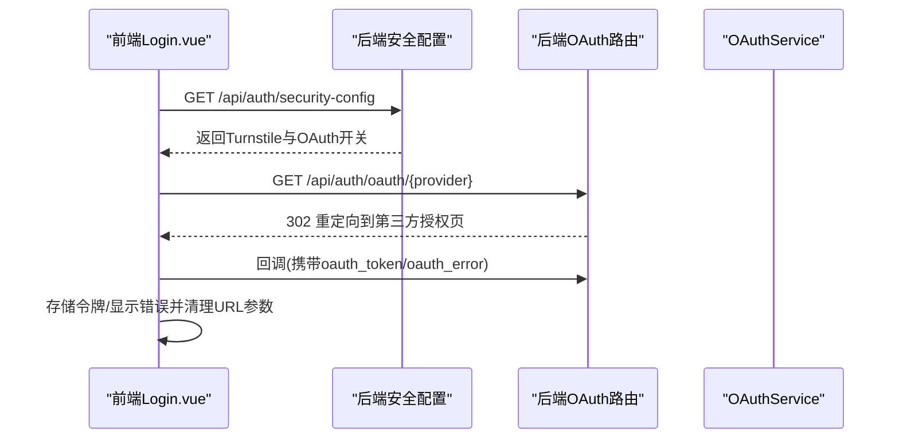
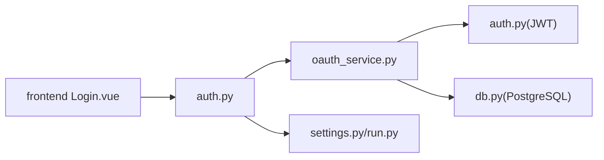

# OAuth认证集成

<cite>
**本文引用的文件**
- [oauth_service.py](file://backend_api_python/app/services/oauth_service.py)
- [auth.py](file://backend_api_python/app/routes/auth.py)
- [auth.py](file://backend_api_python/app/utils/auth.py)
- [settings.py](file://backend_api_python/app/config/settings.py)
- [db.py](file://backend_api_python/app/utils/db.py)
- [run.py](file://backend_api_python/run.py)
- [OAUTH_CONFIG_EN.md](file://docs/OAUTH_CONFIG_EN.md)
- [OAUTH_CONFIG_CN.md](file://docs/OAUTH_CONFIG_CN.md)
- [auth.js](file://frontend/src/api/auth.js)
- [Login.vue](file://frontend/src/views/user/Login.vue)
</cite>

## 目录
1. [简介](#简介)
2. [项目结构](#项目结构)
3. [核心组件](#核心组件)
4. [架构总览](#架构总览)
5. [详细组件分析](#详细组件分析)
6. [依赖关系分析](#依赖关系分析)
7. [性能考量](#性能考量)
8. [故障排查指南](#故障排查指南)
9. [结论](#结论)
10. [附录](#附录)

## 简介
本文件面向QuantDinger的OAuth认证集成，系统性阐述基于OAuth 2.0协议的第三方登录实现，覆盖Google、GitHub等主流提供商的接入流程与回调处理机制；同时解释OAuth服务架构、状态管理、令牌与用户信息同步策略，并提供配置选项、安全要点、错误处理与调试指南。文档还包含前端集成示例与自定义OAuth服务的扩展方法，帮助开发者快速落地与维护。

## 项目结构
QuantDinger的OAuth认证由后端服务与前端界面协同完成：
- 后端服务层：OAuthService负责与第三方提供商交互、状态持久化、用户账户映射与令牌管理；路由层提供/oauth/google与/oauth/github的授权入口与回调处理；工具层提供JWT令牌生成与校验、数据库连接等基础设施。
- 前端界面层：登录页根据后端安全配置动态展示第三方登录按钮，发起授权请求并在回调中接收令牌，完成本地登录态管理。

图表来源
- [auth.py:1108-1427](file://backend_api_python/app/routes/auth.py#L1108-L1427)
- [oauth_service.py:27-715](file://backend_api_python/app/services/oauth_service.py#L27-L715)
- [auth.py:18-157](file://backend_api_python/app/utils/auth.py#L18-L157)
- [settings.py:30-42](file://backend_api_python/app/config/settings.py#L30-L42)
- [run.py:104-134](file://backend_api_python/run.py#L104-L134)

章节来源
- [auth.py:1108-1427](file://backend_api_python/app/routes/auth.py#L1108-L1427)
- [oauth_service.py:27-715](file://backend_api_python/app/services/oauth_service.py#L27-L715)
- [auth.py:18-157](file://backend_api_python/app/utils/auth.py#L18-L157)
- [settings.py:30-42](file://backend_api_python/app/config/settings.py#L30-L42)
- [run.py:104-134](file://backend_api_python/run.py#L104-L134)

## 核心组件
- OAuth服务（OAuthService）
  - 加载第三方提供商配置（Google/GitHub）、生成授权URL、处理回调、拉取用户信息、创建或关联用户账户、管理OAuth状态表（qd_oauth_states）。
  - 支持允许的重定向目标白名单、OAuth状态过期清理、CSRF防护（state参数）。
- 认证路由（auth.py）
  - 提供/oauth/google与/oauth/github的授权入口与回调处理，整合安全事件记录、令牌版本递增与最终重定向至前端。
- JWT工具（auth.py）
  - 生成与校验JWT令牌，支持单客户端登录控制（token_version）。
- 配置与运行（settings.py, run.py）
  - 从环境变量加载密钥、主机、端口、调试模式等；启动时对默认密钥进行安全检查与自动替换。
- 数据库工具（db.py）
  - 统一PostgreSQL连接接口，OAuth状态与用户数据均通过该工具访问。

章节来源
- [oauth_service.py:27-715](file://backend_api_python/app/services/oauth_service.py#L27-L715)
- [auth.py:1108-1427](file://backend_api_python/app/routes/auth.py#L1108-L1427)
- [auth.py:18-157](file://backend_api_python/app/utils/auth.py#L18-L157)
- [settings.py:30-42](file://backend_api_python/app/config/settings.py#L30-L42)
- [run.py:104-134](file://backend_api_python/run.py#L104-L134)
- [db.py:19-66](file://backend_api_python/app/utils/db.py#L19-L66)

## 架构总览
OAuth认证采用“授权码”模式，结合CSRF防护与状态持久化，确保跨多进程/多实例的一致性与安全性。

图表来源
- [auth.py:1108-1427](file://backend_api_python/app/routes/auth.py#L1108-L1427)
- [oauth_service.py:200-426](file://backend_api_python/app/services/oauth_service.py#L200-L426)
- [auth.py:18-157](file://backend_api_python/app/utils/auth.py#L18-L157)

## 详细组件分析

### OAuth服务（OAuthService）
- 配置加载
  - 从环境变量读取Google/GitHub客户端ID、密钥、回调URI与前端URL；支持允许的重定向目标白名单。
- 授权URL生成与状态持久化
  - 生成state参数，保存到qd_oauth_states表，包含provider、redirect与过期时间；state TTL可通过环境变量配置。
- 回调处理
  - Google：交换授权码为令牌，调用用户信息接口，返回标准化用户信息。
  - GitHub：交换授权码为令牌，获取用户信息与邮箱（优先私有主邮箱，否则选择已验证邮箱）。
- 用户账户映射
  - 若存在OAuth链接则直接登录并更新令牌；若不存在则按邮箱查找已有用户并建立OAuth链接；否则创建新用户并初始化内置指标与积分奖励。
- OAuth状态清理
  - 提供过期清理方法，定期删除过期状态条目。

图表来源
- [oauth_service.py:27-715](file://backend_api_python/app/services/oauth_service.py#L27-L715)

章节来源
- [oauth_service.py:27-715](file://backend_api_python/app/services/oauth_service.py#L27-L715)

### 认证路由（auth.py）
- 授权入口
  - /oauth/google 与 /oauth/github：校验提供商启用状态，生成授权URL并302重定向。
- 回调处理
  - /oauth/google/callback 与 /oauth/github/callback：解析查询参数，peek状态重定向目标，处理错误参数，调用OAuthService完成回调与用户映射，生成JWT并重定向至前端。
- 安全事件记录
  - 记录OAuth登录事件，便于审计与风控。

图表来源
- [auth.py:1108-1267](file://backend_api_python/app/routes/auth.py#L1108-L1267)

章节来源
- [auth.py:1108-1267](file://backend_api_python/app/routes/auth.py#L1108-L1267)
- [auth.py:1270-1427](file://backend_api_python/app/routes/auth.py#L1270-L1427)

### JWT与令牌版本控制
- 令牌生成
  - 使用SECRET_KEY与HS256算法生成JWT，包含用户ID、用户名、角色与token_version。
- 令牌校验
  - 校验签名与有效期；同时对比数据库中当前token_version，实现单客户端登录控制（踢出旧会话）。
- 登录流程
  - OAuth登录成功后递增token_version并生成新令牌，确保旧令牌失效。

图表来源
- [auth.py:18-157](file://backend_api_python/app/utils/auth.py#L18-L157)

章节来源
- [auth.py:18-157](file://backend_api_python/app/utils/auth.py#L18-L157)

### 前端集成与OAuth回调处理
- 安全配置获取
  - 前端通过/api/auth/security-config获取Turnstile开关、OAuth开关与站点Key等配置，动态渲染登录界面。
- OAuth登录入口
  - 前端调用后端/oauth/google或/oauth/github接口，打开授权窗口。
- 回调处理
  - 监听URL中的oauth_token与oauth_error参数，存储令牌或展示错误提示，随后清理URL参数避免重复处理。

图表来源
- [Login.vue:744-800](file://frontend/src/views/user/Login.vue#L744-L800)
- [auth.js:19-131](file://frontend/src/api/auth.js#L19-L131)
- [auth.py:1108-1427](file://backend_api_python/app/routes/auth.py#L1108-L1427)

章节来源
- [Login.vue:744-800](file://frontend/src/views/user/Login.vue#L744-L800)
- [auth.js:19-131](file://frontend/src/api/auth.js#L19-L131)
- [auth.py:1108-1427](file://backend_api_python/app/routes/auth.py#L1108-L1427)

## 依赖关系分析
- 组件耦合
  - 路由层依赖OAuth服务；OAuth服务依赖数据库工具与第三方HTTP调用；JWT工具被路由与OAuth服务共同使用。
- 外部依赖
  - Google OAuth与GitHub OAuth的授权与用户信息接口；PostgreSQL数据库用于状态与用户数据持久化。
- 状态一致性
  - OAuth状态通过数据库共享，避免多进程或多实例导致的state不一致问题。

图表来源
- [auth.py:1108-1427](file://backend_api_python/app/routes/auth.py#L1108-L1427)
- [oauth_service.py:27-715](file://backend_api_python/app/services/oauth_service.py#L27-L715)
- [auth.py:18-157](file://backend_api_python/app/utils/auth.py#L18-L157)
- [db.py:19-66](file://backend_api_python/app/utils/db.py#L19-L66)
- [settings.py:30-42](file://backend_api_python/app/config/settings.py#L30-L42)
- [run.py:104-134](file://backend_api_python/run.py#L104-L134)
- [Login.vue:744-800](file://frontend/src/views/user/Login.vue#L744-L800)

章节来源
- [auth.py:1108-1427](file://backend_api_python/app/routes/auth.py#L1108-L1427)
- [oauth_service.py:27-715](file://backend_api_python/app/services/oauth_service.py#L27-L715)
- [auth.py:18-157](file://backend_api_python/app/utils/auth.py#L18-L157)
- [db.py:19-66](file://backend_api_python/app/utils/db.py#L19-L66)
- [settings.py:30-42](file://backend_api_python/app/config/settings.py#L30-L42)
- [run.py:104-134](file://backend_api_python/run.py#L104-L134)
- [Login.vue:744-800](file://frontend/src/views/user/Login.vue#L744-L800)

## 性能考量
- 状态持久化
  - OAuth状态存入数据库并建立索引，避免内存共享导致的多实例不一致；定期清理过期状态降低表膨胀。
- 请求超时
  - 对第三方提供商的令牌交换与用户信息请求设置合理超时，防止阻塞。
- 令牌版本控制
  - 单客户端登录通过token_version实现，避免并发会话冲突，减少无效重试。
- 数据库连接
  - 使用统一的PostgreSQL连接工具，确保连接池与事务一致性。

## 故障排查指南
- 常见错误与定位
  - redirect_uri_mismatch：检查后端GOOGLE_REDIRECT_URI/GITHUB_REDIRECT_URI与提供商后台配置是否一致（含协议、端口、路径）。
  - invalid state：确认state参数未被篡改且在qd_oauth_states中存在且未过期。
  - OAuth服务不可用：检查网络连通性与第三方提供商接口可用性。
  - Turnstile验证失败：确认站点Key与Secret Key正确，域名已加入Turnstile白名单。
- 日志与监控
  - 后端路由与OAuth服务均记录关键错误信息，便于定位问题。
- 安全检查
  - 生产环境务必设置非默认的SECRET_KEY，run.py会在启动时对默认密钥进行替换并提示。

章节来源
- [OAUTH_CONFIG_EN.md:185-228](file://docs/OAUTH_CONFIG_EN.md#L185-L228)
- [OAUTH_CONFIG_CN.md:185-228](file://docs/OAUTH_CONFIG_CN.md#L185-L228)
- [auth.py:1153-1155](file://backend_api_python/app/routes/auth.py#L1153-L1155)
- [oauth_service.py:247-297](file://backend_api_python/app/services/oauth_service.py#L247-L297)
- [run.py:109-120](file://backend_api_python/run.py#L109-L120)

## 结论
QuantDinger的OAuth认证体系以OAuth 2.0授权码模式为核心，结合CSRF防护、状态持久化与令牌版本控制，实现了跨多实例的安全第三方登录。后端通过OAuthService统一管理提供商对接与用户映射，前端依据安全配置动态展示登录入口并处理回调。配合完善的配置文档与故障排查指南，开发者可快速完成Google、GitHub等提供商的集成，并在此基础上扩展更多OAuth服务。

## 附录

### OAuth配置选项与环境变量
- Google OAuth
  - GOOGLE_CLIENT_ID、GOOGLE_CLIENT_SECRET、GOOGLE_REDIRECT_URI
- GitHub OAuth
  - GITHUB_CLIENT_ID、GITHUB_CLIENT_SECRET、GITHUB_REDIRECT_URI
- 公共配置
  - FRONTEND_URL（OAuth成功后的前端重定向地址）
  - OAUTH_ALLOWED_REDIRECTS（允许的重定向目标白名单，逗号分隔）
  - OAUTH_STATE_TTL_MINUTES（OAuth状态过期时间，默认20分钟，范围5-120）
  - ENABLE_REGISTRATION（是否允许注册）
  - CREDITS_REGISTER_BONUS（OAuth注册奖励积分）

章节来源
- [oauth_service.py:145-171](file://backend_api_python/app/services/oauth_service.py#L145-L171)
- [OAUTH_CONFIG_EN.md:49-88](file://docs/OAUTH_CONFIG_EN.md#L49-L88)
- [OAUTH_CONFIG_CN.md:49-88](file://docs/OAUTH_CONFIG_CN.md#L49-L88)

### 自定义OAuth服务扩展方法
- 新增提供商步骤
  - 在OAuthService中新增get_{provider}_auth_url与handle_{provider}_callback方法，遵循现有CSRF与状态管理逻辑。
  - 在路由层添加/oauth/{provider}与/oauth/{provider}/callback两个端点，复用现有回调处理流程。
  - 在安全配置中暴露提供商开关，前端动态渲染登录按钮。
- 数据模型
  - 用户OAuth链接存储于qd_oauth_links，OAuth状态存储于qd_oauth_states，用户信息存储于qd_users。
- 安全与合规
  - 严格校验redirect_uri白名单；对第三方接口调用设置超时；记录安全事件以便审计。

章节来源
- [oauth_service.py:200-426](file://backend_api_python/app/services/oauth_service.py#L200-L426)
- [auth.py:1108-1427](file://backend_api_python/app/routes/auth.py#L1108-L1427)
- [auth.py:18-157](file://backend_api_python/app/utils/auth.py#L18-L157)