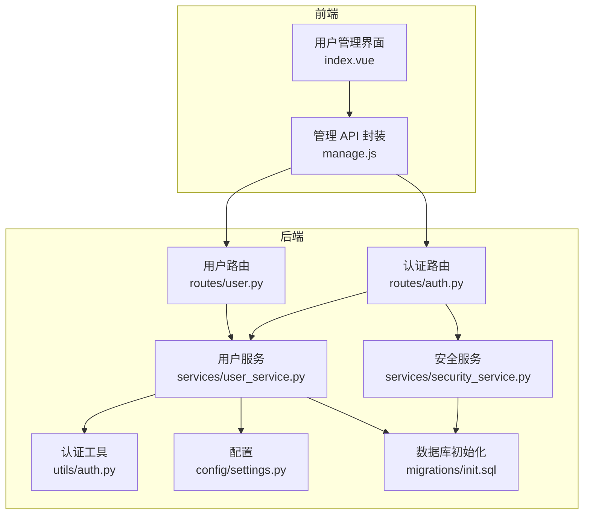
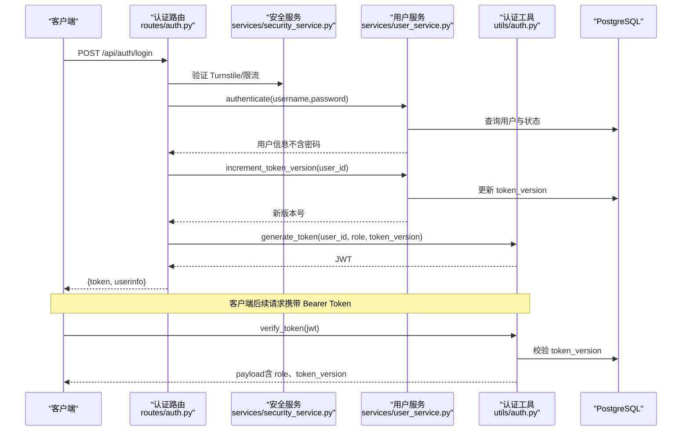
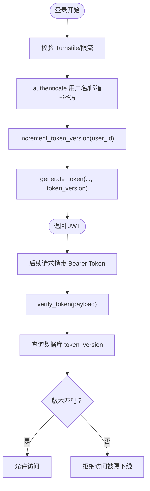
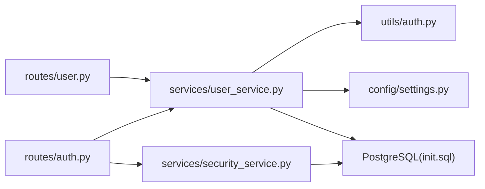

# 多用户系统

<cite>
**本文引用的文件**
- [backend_api_python/app/routers/user.py](file://backend_api_python/app/routes/user.py)
- [backend_api_python/app/services/user_service.py](file://backend_api_python/app/services/user_service.py)
- [backend_api_python/app/utils/auth.py](file://backend_api_python/app/utils/auth.py)
- [backend_api_python/app/config/settings.py](file://backend_api_python/app/config/settings.py)
- [backend_api_python/app/services/builtin_indicators.py](file://backend_api_python/app/services/builtin_indicators.py)
- [backend_api_python/app/data/market_symbols_seed.py](file://backend_api_python/app/data/market_symbols_seed.py)
- [backend_api_python/app/routers/auth.py](file://backend_api_python/app/routes/auth.py)
- [backend_api_python/app/services/security_service.py](file://backend_api_python/app/services/security_service.py)
- [backend_api_python/migrations/init.sql](file://backend_api_python/migrations/init.sql)
- [docs/multi-user-setup.md](file://docs/multi-user-setup.md)
- [frontend/src/views/user-manage/index.vue](file://frontend/src/views/user-manage/index.vue)
- [frontend/src/api/manage.js](file://frontend/src/api/manage.js)
</cite>

## 目录
1. [简介](#简介)
2. [项目结构](#项目结构)
3. [核心组件](#核心组件)
4. [架构总览](#架构总览)
5. [详细组件分析](#详细组件分析)
6. [依赖分析](#依赖分析)
7. [性能考虑](#性能考虑)
8. [故障排查指南](#故障排查指南)
9. [结论](#结论)
10. [附录](#附录)

## 简介
本文件系统化阐述 QuantDinger 的多用户系统设计与实现，覆盖用户角色权限模型（viewer、user、manager、admin）、用户生命周期管理、密码安全机制与会话管理、用户 CRUD 操作、权限验证、令牌版本控制与单一设备登录、用户数据模型、默认 watchlist 种子、内置指标模板、用户状态管理以及多用户部署配置与安全最佳实践。

## 项目结构
QuantDinger 后端采用 Flask 路由模块化组织，用户相关能力主要分布在以下层次：
- 路由层：用户管理与认证接口
- 服务层：用户业务逻辑、权限映射、密码哈希、令牌版本控制
- 工具层：JWT 生成与校验、装饰器、安全服务
- 数据层：PostgreSQL 初始化脚本与种子数据
- 前端：用户管理界面与 API 封装

图示来源
- [backend_api_python/app/routes/user.py](file://backend_api_python/app/routes/user.py)
- [backend_api_python/app/routes/auth.py](file://backend_api_python/app/routes/auth.py)
- [backend_api_python/app/services/user_service.py](file://backend_api_python/app/services/user_service.py)
- [backend_api_python/app/services/security_service.py](file://backend_api_python/app/services/security_service.py)
- [backend_api_python/app/utils/auth.py](file://backend_api_python/app/utils/auth.py)
- [backend_api_python/migrations/init.sql](file://backend_api_python/migrations/init.sql)

章节来源
- [docs/multi-user-setup.md](file://docs/multi-user-setup.md)
- [backend_api_python/app/routes/user.py](file://backend_api_python/app/routes/user.py)
- [backend_api_python/app/routes/auth.py](file://backend_api_python/app/routes/auth.py)

## 核心组件
- 用户服务（UserService）
  - 角色定义与权限映射
  - 密码哈希/校验（优先 bcrypt，降级 SHA256）
  - 用户 CRUD、状态管理、令牌版本控制
  - 默认 watchlist 种子与内置指标模板注入
- 认证工具（auth）
  - JWT 生成与校验，携带 token_version 实现单一设备登录
  - 登录/权限装饰器（@login_required、@admin_required、@permission_required）
- 安全服务（security_service）
  - Turnstile 人机验证、登录尝试记录与限流、验证码发送限流、安全事件审计
- 数据模型（PostgreSQL）
  - 用户表 qd_users、登录尝试、验证码、安全审计、积分流水等
- 前端用户管理界面
  - 用户列表、导出、创建/编辑、重置密码、积分与 VIP 管理、系统概览

章节来源
- [backend_api_python/app/services/user_service.py](file://backend_api_python/app/services/user_service.py)
- [backend_api_python/app/utils/auth.py](file://backend_api_python/app/utils/auth.py)
- [backend_api_python/app/services/security_service.py](file://backend_api_python/app/services/security_service.py)
- [backend_api_python/migrations/init.sql](file://backend_api_python/migrations/init.sql)
- [frontend/src/views/user-manage/index.vue](file://frontend/src/views/user-manage/index.vue)

## 架构总览
多用户系统围绕“JWT + 角色权限 + 令牌版本控制”的会话模型构建，配合安全服务实现防爆破与合规验证。

图示来源
- [backend_api_python/app/routes/auth.py](file://backend_api_python/app/routes/auth.py)
- [backend_api_python/app/services/security_service.py](file://backend_api_python/app/services/security_service.py)
- [backend_api_python/app/services/user_service.py](file://backend_api_python/app/services/user_service.py)
- [backend_api_python/app/utils/auth.py](file://backend_api_python/app/utils/auth.py)

## 详细组件分析

### 用户角色权限模型与继承
- 角色层级（按权限递增）：viewer → user → manager → admin
- 权限映射（部分列举）
  - viewer：dashboard、view
  - user：dashboard、view、indicator、backtest、strategy、portfolio
  - manager：在 user 基础上增加 settings
  - admin：在 manager 基础上增加 user_manage、credentials
- 权限验证方式
  - @permission_required('...') 在路由层动态校验
  - 管理员/经理装饰器在路由层强制约束

章节来源
- [backend_api_python/app/services/user_service.py](file://backend_api_python/app/services/user_service.py)
- [backend_api_python/app/utils/auth.py](file://backend_api_python/app/utils/auth.py)

### 用户生命周期管理
- 创建
  - 支持用户名/邮箱登录；密码长度校验；唯一性校验；可选邀请人字段
  - 新用户创建后自动注入默认 watchlist 与内置指标模板
- 更新
  - 允许更新昵称、头像、时区；角色与状态更新受权限限制
- 删除
  - 管理员可删除用户，禁止自删
- 状态管理
  - 支持 active/disabled/pending；禁用账户无法登录
- 密码管理
  - change_password：需旧密码（除“无密码”用户）
  - reset_password：管理员重置（无需旧密码）

章节来源
- [backend_api_python/app/services/user_service.py](file://backend_api_python/app/services/user_service.py)
- [backend_api_python/app/routes/user.py](file://backend_api_python/app/routes/user.py)

### 密码安全机制
- 哈希策略
  - 优先 bcrypt（可配置 rounds），失败时降级为 sha256+盐
- 密码强度
  - 注册时最小长度与字符类型要求
- 无密码登录
  - 邮件验证码快速登录场景支持“无密码”用户，登录时提示使用验证码登录或设置密码

章节来源
- [backend_api_python/app/services/user_service.py](file://backend_api_python/app/services/user_service.py)
- [backend_api_python/app/routes/auth.py](file://backend_api_python/app/routes/auth.py)
- [backend_api_python/app/services/security_service.py](file://backend_api_python/app/services/security_service.py)

### 会话管理与令牌版本控制（单一设备登录）
- 令牌结构
  - 包含 user_id、role、token_version、过期时间等
- 登录流程
  - 成功登录后递增用户 token_version，并以新版本生成 JWT
- 校验机制
  - verify_token 时查询数据库比对 token_version，不一致即判定失效
- 效果
  - 同一账户新登录会踢掉旧设备，实现单一设备登录

图示来源
- [backend_api_python/app/routes/auth.py](file://backend_api_python/app/routes/auth.py)
- [backend_api_python/app/utils/auth.py](file://backend_api_python/app/utils/auth.py)
- [backend_api_python/app/services/user_service.py](file://backend_api_python/app/services/user_service.py)

### 用户 CRU 操作与管理端点
- 管理端点（admin_required）
  - 列表/详情/创建/更新/删除/重置密码/角色列表/积分与 VIP 管理/导出
- 自服务端点（login_required）
  - 个人资料、更新资料、我的积分流水、我的邀请列表、通知设置等
- 前端用户管理界面
  - 提供创建/编辑弹窗、重置密码确认、积分与 VIP 设置、用户导出等功能

章节来源
- [backend_api_python/app/routes/user.py](file://backend_api_python/app/routes/user.py)
- [frontend/src/views/user-manage/index.vue](file://frontend/src/views/user-manage/index.vue)
- [frontend/src/api/manage.js](file://frontend/src/api/manage.js)

### 权限验证与装饰器
- @login_required：解析 Bearer Token，注入 g.user_id/g.user_role
- @admin_required/@manager_required：基于 g.user_role 强制管理员/经理权限
- @permission_required('...')：动态检查角色对应权限集合

章节来源
- [backend_api_python/app/utils/auth.py](file://backend_api_python/app/utils/auth.py)

### 令牌版本控制与单一设备登录
- 递增 token_version 并持久化，verify_token 时实时校验
- 任何新登录都会使旧 token 失效，确保单一设备在线

章节来源
- [backend_api_python/app/services/user_service.py](file://backend_api_python/app/services/user_service.py)
- [backend_api_python/app/utils/auth.py](file://backend_api_python/app/utils/auth.py)

### 用户数据模型与默认种子
- 用户表字段要点
  - 用户名/邮箱唯一、角色/状态、积分/VIP、时区、token_version、最后登录时间等
- 默认 watchlist 种子
  - 新用户自动插入若干标的的 watchlist
- 内置指标模板
  - 注册后写入示例指标包，幂等处理避免重复

章节来源
- [backend_api_python/migrations/init.sql](file://backend_api_python/migrations/init.sql)
- [backend_api_python/app/services/user_service.py](file://backend_api_python/app/services/user_service.py)
- [backend_api_python/app/services/builtin_indicators.py](file://backend_api_python/app/services/builtin_indicators.py)

### 多用户部署配置与安全最佳实践
- 部署
  - 使用 PostgreSQL，初始化 schema，关闭单用户模式
- 安全
  - 强制 HTTPS、强密码、Turnstile 人机验证、登录限流、验证码限流、审计日志
- 最佳实践
  - 立即修改默认管理员密码；定期备份数据库；统一 SECRET_KEY；限制数据库访问范围

章节来源
- [docs/multi-user-setup.md](file://docs/multi-user-setup.md)
- [backend_api_python/app/config/settings.py](file://backend_api_python/app/config/settings.py)
- [backend_api_python/app/services/security_service.py](file://backend_api_python/app/services/security_service.py)

## 依赖分析
- 组件耦合
  - 路由层依赖服务层；服务层依赖工具层与数据库；安全服务贯穿认证与审计
- 外部依赖
  - bcrypt（可选）、PostgreSQL、Cloudflare Turnstile
- 可能的循环依赖
  - 路由与服务通过函数调用解耦，未见循环导入

图示来源
- [backend_api_python/app/routes/user.py](file://backend_api_python/app/routes/user.py)
- [backend_api_python/app/routes/auth.py](file://backend_api_python/app/routes/auth.py)
- [backend_api_python/app/services/user_service.py](file://backend_api_python/app/services/user_service.py)
- [backend_api_python/app/services/security_service.py](file://backend_api_python/app/services/security_service.py)
- [backend_api_python/app/utils/auth.py](file://backend_api_python/app/utils/auth.py)
- [backend_api_python/migrations/init.sql](file://backend_api_python/migrations/init.sql)

## 性能考虑
- 数据库索引
  - 用户表、登录尝试、验证码、安全审计等均有索引，保障查询效率
- 缓存配置
  - 提供缓存配置项（可选启用），用于热点数据加速
- 分页与搜索
  - 用户列表与导出支持分页与模糊搜索，避免一次性加载过多数据

章节来源
- [backend_api_python/migrations/init.sql](file://backend_api_python/migrations/init.sql)
- [backend_api_python/app/config/database.py](file://backend_api_python/app/config/database.py)

## 故障排查指南
- 登录失败
  - 检查 Turnstile 配置与网络连通；查看安全服务限流与登录尝试记录
- 令牌无效或被踢下线
  - 确认 SECRET_KEY 一致；检查 token_version 是否被递增
- 用户状态异常
  - 禁用/待激活状态会导致登录受限
- 数据库连接问题
  - 确认 PostgreSQL 可达、凭据正确、schema 初始化完成

章节来源
- [backend_api_python/app/services/security_service.py](file://backend_api_python/app/services/security_service.py)
- [backend_api_python/app/utils/auth.py](file://backend_api_python/app/utils/auth.py)
- [docs/multi-user-setup.md](file://docs/multi-user-setup.md)

## 结论
QuantDinger 的多用户系统以清晰的角色权限模型、完善的密码与会话安全机制、可扩展的用户生命周期管理与前端管理界面为核心，结合 PostgreSQL 数据模型与安全服务，提供了生产可用的多用户基础能力。建议在生产环境中严格遵循安全最佳实践并持续监控审计日志。

## 附录
- 关键环境变量与配置
  - SECRET_KEY、ADMIN_USER/ADMIN_PASSWORD、ENABLE_REGISTRATION、TURNSTILE_*、REDIS_*、CACHE_* 等
- 前端管理界面功能清单
  - 用户列表、创建/编辑、重置密码、导出、积分与 VIP 管理、系统概览与订单统计等

章节来源
- [backend_api_python/app/config/settings.py](file://backend_api_python/app/config/settings.py)
- [frontend/src/views/user-manage/index.vue](file://frontend/src/views/user-manage/index.vue)
- [frontend/src/api/manage.js](file://frontend/src/api/manage.js)