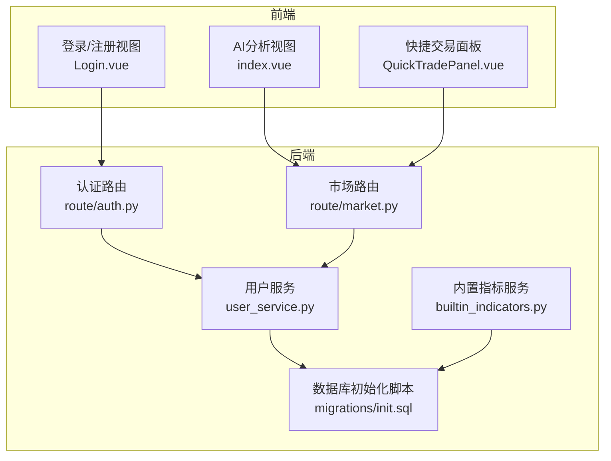
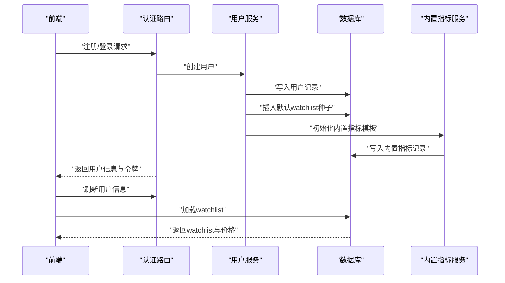
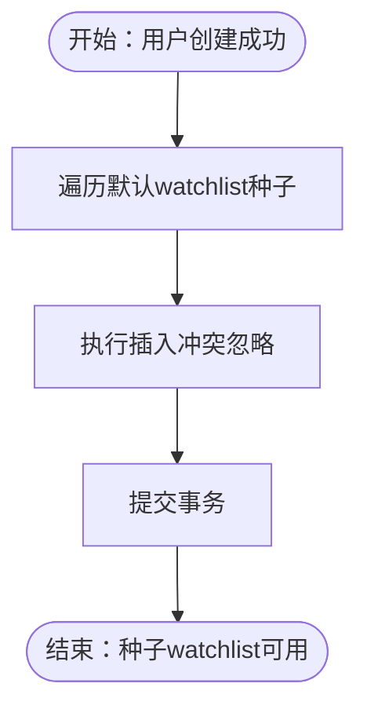
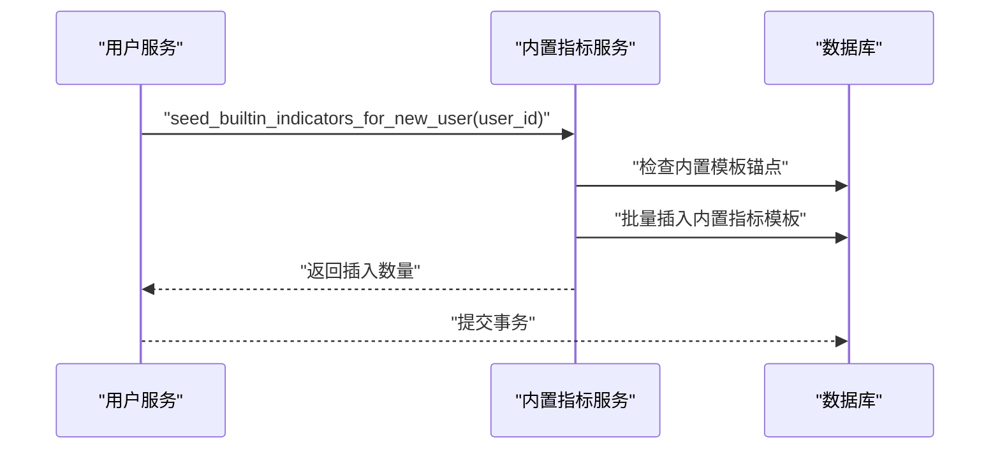
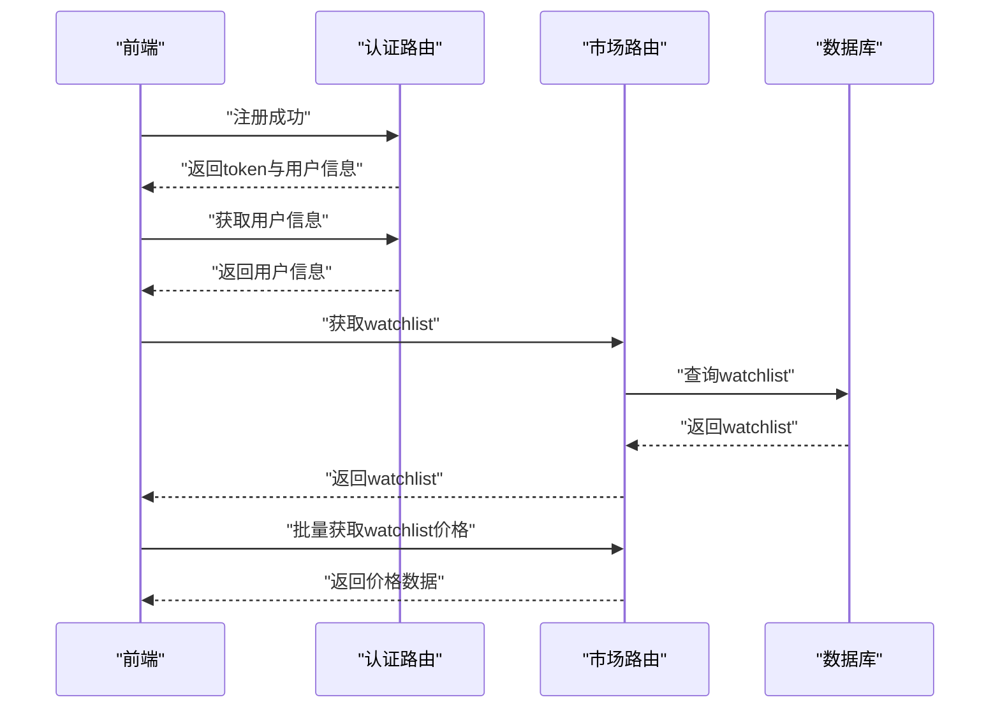
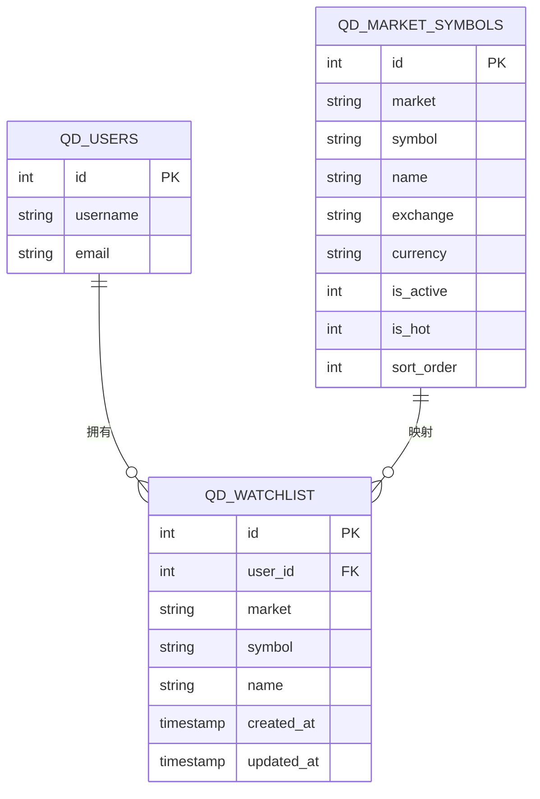
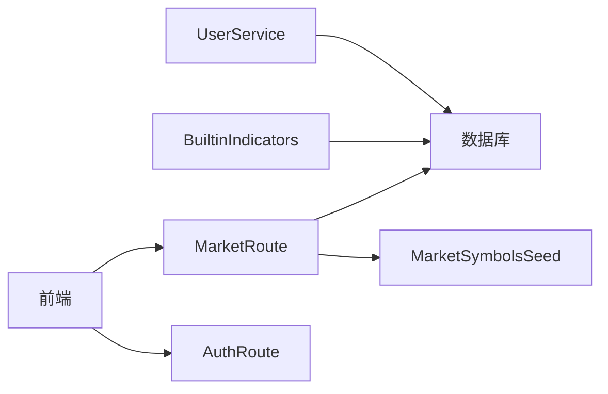

# 用户数据初始化

<cite>
**本文档引用的文件**
- [backend_api_python/app/services/user_service.py](file://backend_api_python/app/services/user_service.py)
- [backend_api_python/app/services/builtin_indicators.py](file://backend_api_python/app/services/builtin_indicators.py)
- [backend_api_python/app/data/market_symbols_seed.py](file://backend_api_python/app/data/market_symbols_seed.py)
- [backend_api_python/migrations/init.sql](file://backend_api_python/migrations/init.sql)
- [backend_api_python/app/route/auth.py](file://backend_api_python/app/route/auth.py)
- [backend_api_python/app/route/market.py](file://backend_api_python/app/route/market.py)
- [frontend/src/views/user/Login.vue](file://frontend/src/views/user/Login.vue)
- [frontend/src/views/ai-analysis/index.vue](file://frontend/src/views/ai-analysis/index.vue)
- [frontend/src/components/QuickTradePanel/QuickTradePanel.vue](file://frontend/src/components/QuickTradePanel/QuickTradePanel.vue)
</cite>

## 目录
1. [简介](#简介)
2. [项目结构](#项目结构)
3. [核心组件](#核心组件)
4. [架构总览](#架构总览)
5. [详细组件分析](#详细组件分析)
6. [依赖分析](#依赖分析)
7. [性能考虑](#性能考虑)
8. [故障排查指南](#故障排查指南)
9. [结论](#结论)
10. [附录](#附录)

## 简介
本文件面向QuantDinger的“用户数据初始化”子系统，系统性阐述新用户注册时的数据种子机制与首次体验优化（FTUE）。内容涵盖：
- 默认自选清单（watchlist）的自动填充逻辑与种子数据来源
- 内置指标模板的生成与用户专属隔离
- 首次用户体验（FTUE）设计与前端联动
- 默认watchlist覆盖的主流资产类别与数据库插入策略
- 完整流程、错误恢复机制与性能优化建议

## 项目结构
用户数据初始化涉及后端服务层、路由层、数据库迁移脚本以及前端视图与组件的协同：
- 后端服务层负责用户创建、默认watchlist种子与内置指标模板的初始化
- 路由层处理注册、登录与watchlist相关API
- 数据库迁移脚本提供种子数据表结构与初始数据
- 前端在注册完成后进行用户信息存储与watchlist加载，提升首屏体验

**图表来源**
- [backend_api_python/app/services/user_service.py:39-53](file://backend_api_python/app/services/user_service.py#L39-L53)
- [backend_api_python/app/services/builtin_indicators.py:203-249](file://backend_api_python/app/services/builtin_indicators.py#L203-L249)
- [backend_api_python/app/route/auth.py:408-439](file://backend_api_python/app/route/auth.py#L408-L439)
- [backend_api_python/app/route/market.py:430-468](file://backend_api_python/app/route/market.py#L430-L468)
- [backend_api_python/migrations/init.sql:618-772](file://backend_api_python/migrations/init.sql#L618-L772)
- [frontend/src/views/user/Login.vue:1100-1199](file://frontend/src/views/user/Login.vue#L1100-L1199)
- [frontend/src/views/ai-analysis/index.vue:1840-1881](file://frontend/src/views/ai-analysis/index.vue#L1840-L1881)
- [frontend/src/components/QuickTradePanel/QuickTradePanel.vue:611-665](file://frontend/src/components/QuickTradePanel/QuickTradePanel.vue#L611-L665)

**章节来源**
- [backend_api_python/app/services/user_service.py:28-53](file://backend_api_python/app/services/user_service.py#L28-L53)
- [backend_api_python/migrations/init.sql:618-772](file://backend_api_python/migrations/init.sql#L618-L772)
- [frontend/src/views/user/Login.vue:1100-1199](file://frontend/src/views/user/Login.vue#L1100-L1199)

## 核心组件
- 用户服务（UserService）
  - 负责用户创建、密码哈希、角色权限管理
  - 在新用户创建成功后，执行默认watchlist种子与内置指标模板初始化
- 内置指标服务（builtin_indicators）
  - 为新用户批量插入内置指标模板，保证用户拥有可即用的指标样例
- 市场路由（market）
  - 提供watchlist查询、添加、删除等接口；在查询时对历史空名称进行回填
- 数据库迁移（init.sql）
  - 定义用户、watchlist、指标代码、种子市场符号等表结构与初始数据
- 前端视图与组件
  - 登录/注册完成后的用户信息存储与watchlist加载，提升FTUE体验

**章节来源**
- [backend_api_python/app/services/user_service.py:314-409](file://backend_api_python/app/services/user_service.py#L314-L409)
- [backend_api_python/app/services/builtin_indicators.py:203-249](file://backend_api_python/app/services/builtin_indicators.py#L203-L249)
- [backend_api_python/app/route/market.py:430-468](file://backend_api_python/app/route/market.py#L430-L468)
- [backend_api_python/migrations/init.sql:424-439](file://backend_api_python/migrations/init.sql#L424-L439)

## 架构总览
用户数据初始化的关键流程如下：

**图表来源**
- [backend_api_python/app/route/auth.py:408-439](file://backend_api_python/app/route/auth.py#L408-L439)
- [backend_api_python/app/services/user_service.py:393-404](file://backend_api_python/app/services/user_service.py#L393-L404)
- [backend_api_python/app/services/builtin_indicators.py:203-249](file://backend_api_python/app/services/builtin_indicators.py#L203-L249)
- [backend_api_python/app/route/market.py:430-468](file://backend_api_python/app/route/market.py#L430-L468)
- [frontend/src/views/user/Login.vue:1100-1199](file://frontend/src/views/user/Login.vue#L1100-L1199)
- [frontend/src/views/ai-analysis/index.vue:1840-1881](file://frontend/src/views/ai-analysis/index.vue#L1840-L1881)

## 详细组件分析

### 默认watchlist种子机制
- 种子数据定义
  - 默认watchlist包含主流资产类别：加密货币（Crypto）、美国股票（USStock）等
  - 种子列表在用户服务中集中维护，便于统一管理与扩展
- 插入策略
  - 使用数据库UPSERT（冲突忽略）确保幂等性，避免重复插入
  - 插入时同时写入创建与更新时间戳
- 初始化时机
  - 在用户创建成功后立即执行，保证新用户首次登录即可看到种子数据
- 历史兼容
  - 查询watchlist时对历史空名称进行回填，保持UI一致性

**图表来源**
- [backend_api_python/app/services/user_service.py:28-53](file://backend_api_python/app/services/user_service.py#L28-L53)
- [backend_api_python/app/services/user_service.py:393-404](file://backend_api_python/app/services/user_service.py#L393-L404)
- [backend_api_python/app/route/market.py:442-462](file://backend_api_python/app/route/market.py#L442-L462)

**章节来源**
- [backend_api_python/app/services/user_service.py:28-53](file://backend_api_python/app/services/user_service.py#L28-L53)
- [backend_api_python/app/services/user_service.py:393-404](file://backend_api_python/app/services/user_service.py#L393-L404)
- [backend_api_python/app/route/market.py:442-462](file://backend_api_python/app/route/market.py#L442-L462)

### 内置指标模板生成
- 生成逻辑
  - 为新用户批量插入内置指标模板，避免用户从零开始编写
  - 检查是否已存在内置模板锚点，避免重复初始化
- 数据隔离
  - 每个用户拥有独立的指标记录，互不干扰
- 错误恢复
  - 初始化失败时记录警告并回滚，不影响用户创建主流程

**图表来源**
- [backend_api_python/app/services/user_service.py:399-404](file://backend_api_python/app/services/user_service.py#L399-L404)
- [backend_api_python/app/services/builtin_indicators.py:203-249](file://backend_api_python/app/services/builtin_indicators.py#L203-L249)

**章节来源**
- [backend_api_python/app/services/builtin_indicators.py:203-249](file://backend_api_python/app/services/builtin_indicators.py#L203-L249)
- [backend_api_python/app/services/user_service.py:399-404](file://backend_api_python/app/services/user_service.py#L399-L404)

### 首次用户体验（FTUE）设计
- 注册完成后的前端处理
  - 成功注册后，前端保存令牌、用户信息与角色，重置路由并跳转首页
  - 自动加载用户信息与watchlist，提升首屏体验
- watchlist加载与价格刷新
  - 前端在加载watchlist后，定时刷新价格，保证数据实时性
- 快捷交易面板联动
  - 从store或API获取用户ID后，加载watchlist中的加密货币符号，优化搜索体验

**图表来源**
- [frontend/src/views/user/Login.vue:1100-1199](file://frontend/src/views/user/Login.vue#L1100-L1199)
- [frontend/src/views/ai-analysis/index.vue:1840-1881](file://frontend/src/views/ai-analysis/index.vue#L1840-L1881)
- [frontend/src/components/QuickTradePanel/QuickTradePanel.vue:611-665](file://frontend/src/components/QuickTradePanel/QuickTradePanel.vue#L611-L665)
- [backend_api_python/app/route/market.py:430-468](file://backend_api_python/app/route/market.py#L430-L468)

**章节来源**
- [frontend/src/views/user/Login.vue:1100-1199](file://frontend/src/views/user/Login.vue#L1100-L1199)
- [frontend/src/views/ai-analysis/index.vue:1840-1881](file://frontend/src/views/ai-analysis/index.vue#L1840-L1881)
- [frontend/src/components/QuickTradePanel/QuickTradePanel.vue:611-665](file://frontend/src/components/QuickTradePanel/QuickTradePanel.vue#L611-L665)

### 默认watchlist覆盖的资产类别与种子数据
- 资产类别
  - 加密货币（Crypto）：包含主流币种与热门代币
  - 美国股票（USStock）：覆盖科技与金融等主流公司
- 种子数据来源
  - 通过数据库迁移脚本一次性写入，确保所有环境一致
  - 表结构支持活跃标志、热度排序与唯一约束，便于查询与去重

**图表来源**
- [backend_api_python/migrations/init.sql:618-772](file://backend_api_python/migrations/init.sql#L618-L772)
- [backend_api_python/migrations/init.sql:424-439](file://backend_api_python/migrations/init.sql#L424-L439)
- [backend_api_python/migrations/init.sql:8-31](file://backend_api_python/migrations/init.sql#L8-L31)

**章节来源**
- [backend_api_python/migrations/init.sql:618-772](file://backend_api_python/migrations/init.sql#L618-L772)
- [backend_api_python/app/data/market_symbols_seed.py:26-58](file://backend_api_python/app/data/market_symbols_seed.py#L26-L58)

## 依赖分析
- 组件耦合
  - 用户服务依赖数据库连接与日志模块，负责用户生命周期与初始化
  - 内置指标服务依赖用户ID与数据库，实现模板隔离
  - 市场路由依赖解析器与种子数据模块，保证watchlist名称一致性
- 外部依赖
  - 数据库：PostgreSQL（通过迁移脚本初始化）
  - 前端：Vue生态，通过API与后端交互

**图表来源**
- [backend_api_python/app/services/user_service.py:11-14](file://backend_api_python/app/services/user_service.py#L11-L14)
- [backend_api_python/app/services/builtin_indicators.py:203-249](file://backend_api_python/app/services/builtin_indicators.py#L203-L249)
- [backend_api_python/app/route/market.py:430-468](file://backend_api_python/app/route/market.py#L430-L468)
- [backend_api_python/app/data/market_symbols_seed.py:17-23](file://backend_api_python/app/data/market_symbols_seed.py#L17-L23)

**章节来源**
- [backend_api_python/app/services/user_service.py:11-14](file://backend_api_python/app/services/user_service.py#L11-L14)
- [backend_api_python/app/services/builtin_indicators.py:203-249](file://backend_api_python/app/services/builtin_indicators.py#L203-L249)
- [backend_api_python/app/route/market.py:430-468](file://backend_api_python/app/route/market.py#L430-L468)

## 性能考虑
- 批量插入与幂等性
  - 默认watchlist采用循环逐条插入，配合冲突忽略，保证幂等与低开销
- 缓存与回填
  - 市场路由在查询watchlist时对历史空名称进行回填，避免每次查询都触发外部解析
- 前端异步加载
  - 注册完成后前端异步加载用户信息与watchlist，避免阻塞主线程
- 定时刷新
  - 前端以固定间隔刷新watchlist价格，平衡实时性与网络开销

[本节为通用指导，无需特定文件引用]

## 故障排查指南
- 注册后未看到默认watchlist
  - 检查用户创建流程是否成功执行种子插入
  - 核对数据库中qd_watchlist是否包含对应用户记录
- watchlist名称为空或显示异常
  - 确认市场路由的名称回填逻辑是否正常执行
  - 检查种子数据表中是否存在对应symbol的name
- 内置指标模板未出现
  - 查看内置指标服务初始化日志，确认是否已存在锚点
  - 检查数据库中qd_indicator_codes是否写入模板记录
- 前端加载失败
  - 检查前端路由守卫与用户信息存储逻辑
  - 确认请求拦截器中token是否正确设置

**章节来源**
- [backend_api_python/app/services/user_service.py:393-404](file://backend_api_python/app/services/user_service.py#L393-L404)
- [backend_api_python/app/route/market.py:442-462](file://backend_api_python/app/route/market.py#L442-L462)
- [backend_api_python/app/services/builtin_indicators.py:203-249](file://backend_api_python/app/services/builtin_indicators.py#L203-L249)
- [frontend/src/views/user/Login.vue:1100-1199](file://frontend/src/views/user/Login.vue#L1100-L1199)

## 结论
QuantDinger的用户数据初始化系统通过“默认watchlist种子+内置指标模板”的双通道设计，结合数据库幂等插入与前端异步加载，实现了新用户的即开即用体验。系统在数据隔离、错误恢复与性能方面均有明确策略，能够稳定支撑多用户场景下的首次体验优化。

[本节为总结，无需特定文件引用]

## 附录
- 默认watchlist种子列表（示例）
  - 加密货币：比特币、以太坊、Solana等
  - 美国股票：苹果、英伟达、特斯拉、微软等
- 初始化流程关键路径
  - 用户创建成功 → 插入默认watchlist → 初始化内置指标模板 → 前端加载用户信息与watchlist

**章节来源**
- [backend_api_python/app/services/user_service.py:28-36](file://backend_api_python/app/services/user_service.py#L28-L36)
- [backend_api_python/migrations/init.sql:618-772](file://backend_api_python/migrations/init.sql#L618-L772)