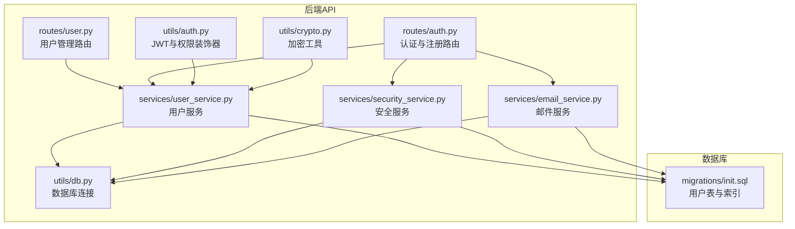
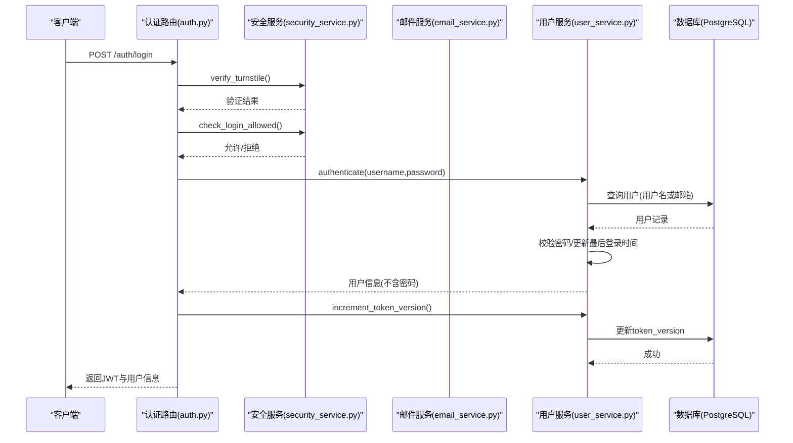
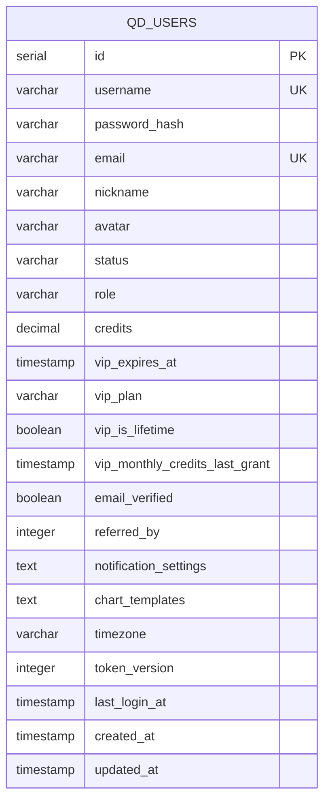
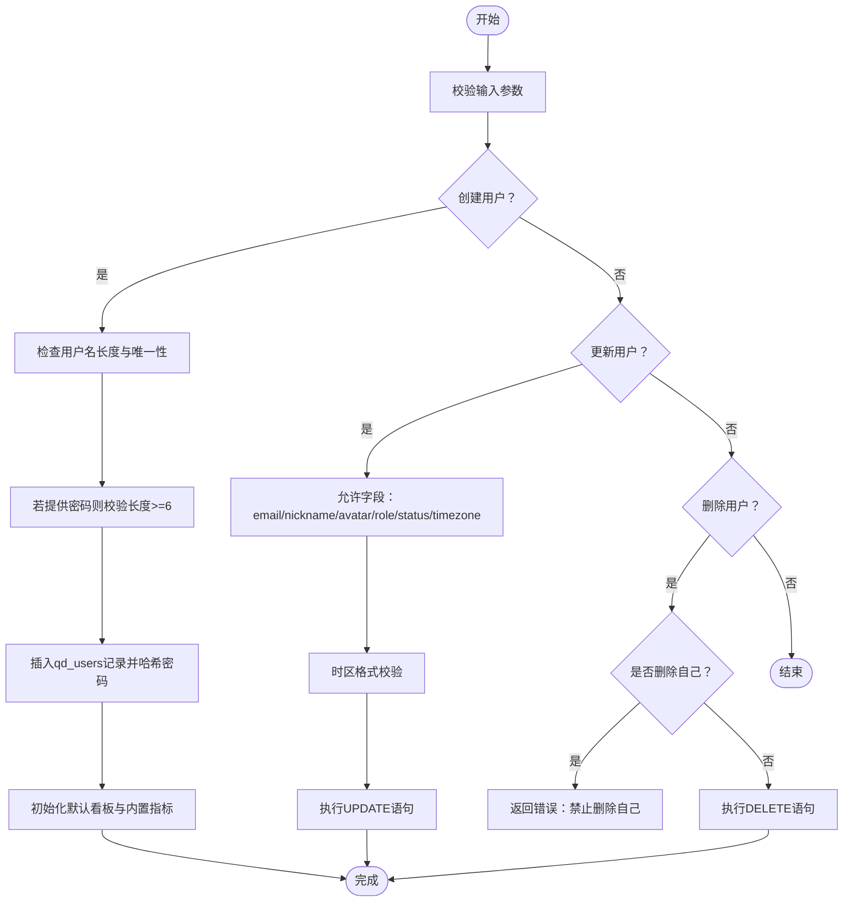
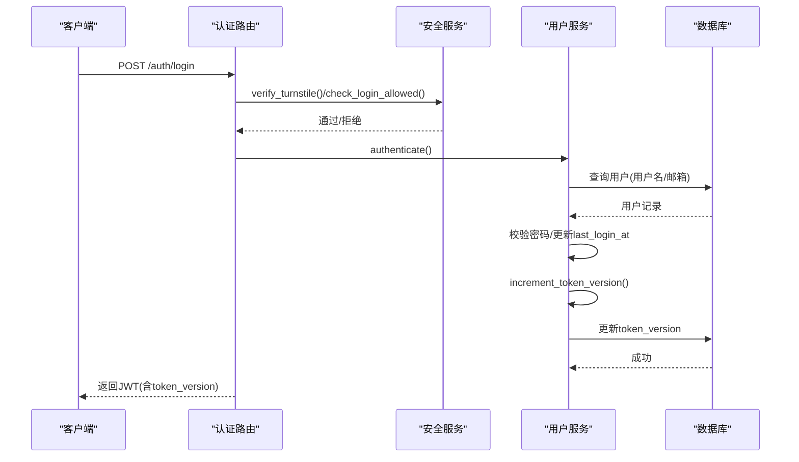
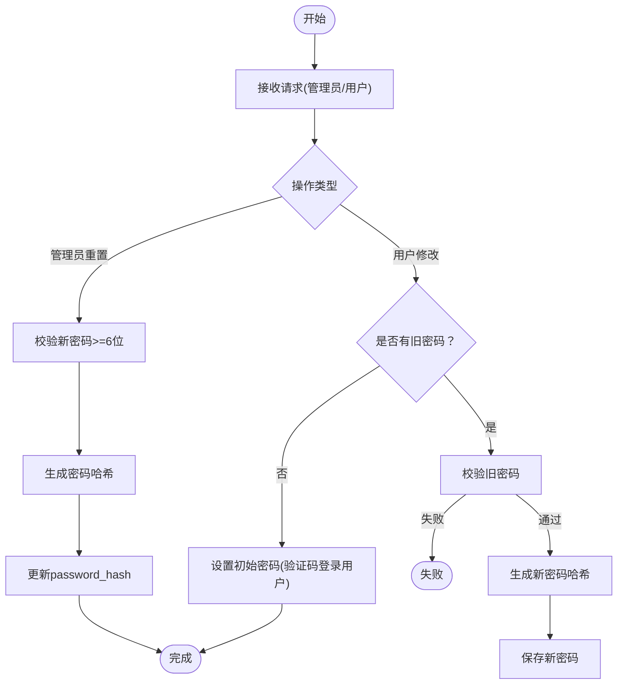
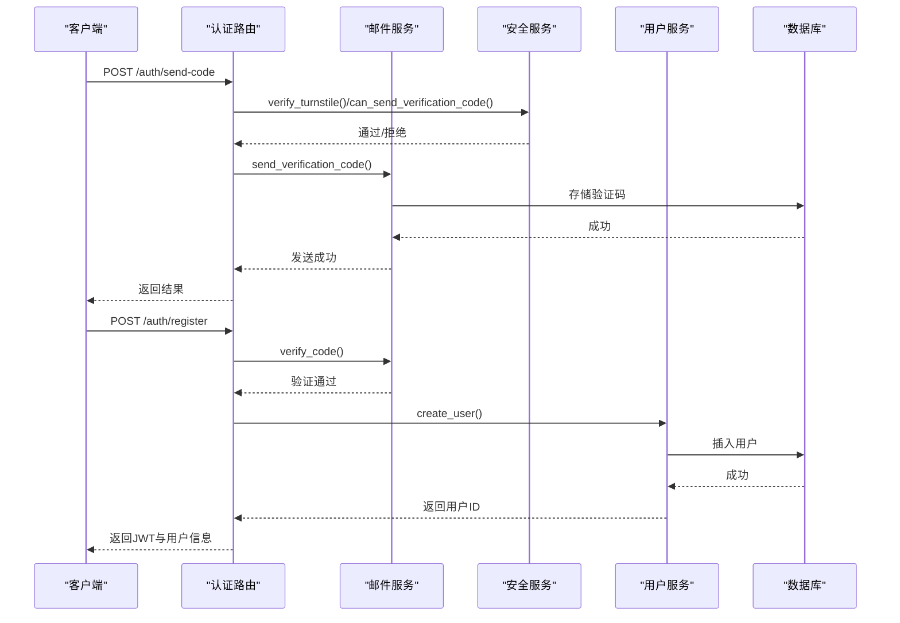
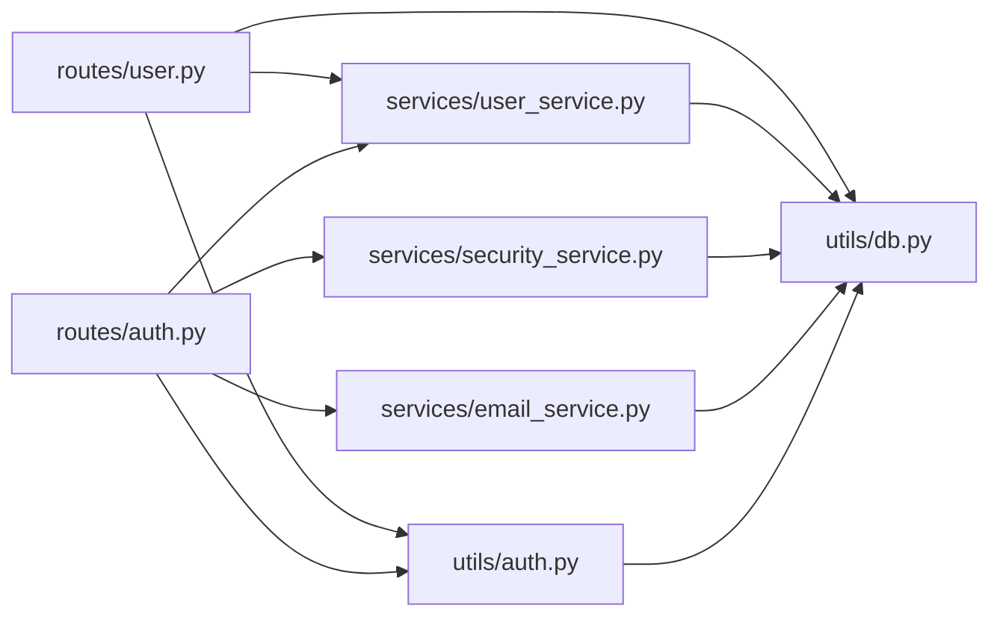

# 用户管理

<cite>
**本文引用的文件列表**
- [backend_api_python/app/routes/user.py](file://backend_api_python/app/routes/user.py)
- [backend_api_python/app/routes/auth.py](file://backend_api_python/app/routes/auth.py)
- [backend_api_python/app/services/user_service.py](file://backend_api_python/app/services/user_service.py)
- [backend_api_python/app/services/security_service.py](file://backend_api_python/app/services/security_service.py)
- [backend_api_python/app/services/email_service.py](file://backend_api_python/app/services/email_service.py)
- [backend_api_python/app/utils/auth.py](file://backend_api_python/app/utils/auth.py)
- [backend_api_python/app/utils/crypto.py](file://backend_api_python/app/utils/crypto.py)
- [backend_api_python/app/utils/db.py](file://backend_api_python/app/utils/db.py)
- [backend_api_python/migrations/init.sql](file://backend_api_python/migrations/init.sql)
</cite>

## 目录
1. [简介](#简介)
2. [项目结构](#项目结构)
3. [核心组件](#核心组件)
4. [架构总览](#架构总览)
5. [详细组件分析](#详细组件分析)
6. [依赖关系分析](#依赖关系分析)
7. [性能考量](#性能考量)
8. [故障排查指南](#故障排查指南)
9. [结论](#结论)
10. [附录](#附录)

## 简介
本文件面向QuantDinger的用户管理功能，系统性梳理用户CRUD操作、认证与授权、密码与邮箱验证、状态管理、数据模型与数据库约束、以及完整的业务流程（注册、登录、密码修改与重置）。文档同时给出关键流程的序列图与时序图，帮助开发者快速理解与扩展。

## 项目结构
用户管理相关代码主要分布在后端Python服务的路由层、服务层与工具层，并由PostgreSQL迁移脚本定义数据模型与索引。

**图表来源**
- [backend_api_python/app/routes/user.py:38-833](file://backend_api_python/app/routes/user.py#L38-L833)
- [backend_api_python/app/routes/auth.py:156-800](file://backend_api_python/app/routes/auth.py#L156-L800)
- [backend_api_python/app/services/user_service.py:56-701](file://backend_api_python/app/services/user_service.py#L56-L701)
- [backend_api_python/app/services/security_service.py:26-200](file://backend_api_python/app/services/security_service.py#L26-L200)
- [backend_api_python/app/services/email_service.py:29-200](file://backend_api_python/app/services/email_service.py#L29-L200)
- [backend_api_python/app/utils/auth.py:18-239](file://backend_api_python/app/utils/auth.py#L18-L239)
- [backend_api_python/app/utils/crypto.py:10-78](file://backend_api_python/app/utils/crypto.py#L10-L78)
- [backend_api_python/app/utils/db.py:19-66](file://backend_api_python/app/utils/db.py#L19-L66)
- [backend_api_python/migrations/init.sql:8-31](file://backend_api_python/migrations/init.sql#L8-L31)

**章节来源**
- [backend_api_python/app/routes/user.py:38-833](file://backend_api_python/app/routes/user.py#L38-L833)
- [backend_api_python/app/routes/auth.py:156-800](file://backend_api_python/app/routes/auth.py#L156-L800)
- [backend_api_python/app/services/user_service.py:56-701](file://backend_api_python/app/services/user_service.py#L56-L701)
- [backend_api_python/app/utils/auth.py:18-239](file://backend_api_python/app/utils/auth.py#L18-L239)
- [backend_api_python/migrations/init.sql:8-31](file://backend_api_python/migrations/init.sql#L8-L31)

## 核心组件
- 用户管理路由层：提供用户列表、详情、创建、更新、删除、重置密码、角色与账务管理等接口，均需管理员权限。
- 用户服务层：封装用户CRUD、认证、密码哈希与校验、令牌版本控制、默认看板与内置指标初始化等。
- 安全服务层：提供Turnstile人机验证、登录尝试记录与限流、验证码发送与校验、安全事件记录。
- 邮件服务层：生成与存储验证码、校验验证码、支持多种类型（注册、登录、重置密码、修改密码、修改邮箱）。
- 认证与权限工具：JWT生成与校验、基于角色的访问控制装饰器、单点登录（同一用户仅允许一个有效会话）。
- 数据库工具：统一PostgreSQL连接与初始化。
- 数据模型：PostgreSQL迁移脚本定义用户表及索引，支持邮箱唯一、用户名唯一、token版本等字段。

**章节来源**
- [backend_api_python/app/routes/user.py:41-833](file://backend_api_python/app/routes/user.py#L41-L833)
- [backend_api_python/app/services/user_service.py:56-701](file://backend_api_python/app/services/user_service.py#L56-L701)
- [backend_api_python/app/services/security_service.py:26-200](file://backend_api_python/app/services/security_service.py#L26-L200)
- [backend_api_python/app/services/email_service.py:29-200](file://backend_api_python/app/services/email_service.py#L29-L200)
- [backend_api_python/app/utils/auth.py:18-239](file://backend_api_python/app/utils/auth.py#L18-L239)
- [backend_api_python/app/utils/db.py:19-66](file://backend_api_python/app/utils/db.py#L19-L66)
- [backend_api_python/migrations/init.sql:8-31](file://backend_api_python/migrations/init.sql#L8-L31)

## 架构总览
用户管理采用“路由层-服务层-数据层”的分层架构，配合安全与邮件服务，形成完整的用户生命周期管理闭环。

**图表来源**
- [backend_api_python/app/routes/auth.py:156-325](file://backend_api_python/app/routes/auth.py#L156-L325)
- [backend_api_python/app/services/security_service.py:72-200](file://backend_api_python/app/services/security_service.py#L72-L200)
- [backend_api_python/app/services/user_service.py:194-313](file://backend_api_python/app/services/user_service.py#L194-L313)
- [backend_api_python/app/utils/auth.py:18-114](file://backend_api_python/app/utils/auth.py#L18-L114)

## 详细组件分析

### 用户数据模型与数据库约束
- 表：qd_users
- 字段要点：
  - id：自增主键
  - username：长度3-50字符，唯一
  - password_hash：密码哈希，bcrypt优先，降级SHA256
  - email：唯一，大小写不敏感查询
  - nickname、avatar、status、role、credits、vip_expires_at、vip_plan、vip_is_lifetime、vip_monthly_credits_last_grant、email_verified、referred_by、notification_settings、chart_templates、timezone、token_version、last_login_at、created_at、updated_at
- 索引：
  - idx_users_referred_by：邀请人索引
  - 其他表如qd_credits_log、qd_verification_codes、qd_login_attempts、qd_security_logs等均有相应索引以支撑查询与审计

**图表来源**
- [backend_api_python/migrations/init.sql:8-31](file://backend_api_python/migrations/init.sql#L8-L31)

**章节来源**
- [backend_api_python/migrations/init.sql:8-31](file://backend_api_python/migrations/init.sql#L8-L31)

### 用户CRUD与状态管理
- 列表与导出：支持分页、搜索（用户名/邮箱/昵称），导出CSV便于运营查看。
- 详情：按ID查询用户，聚合最近登录时间与注册IP。
- 创建：管理员创建用户，校验用户名长度与唯一性、密码长度（若提供）、角色合法性；默认激活状态；可设置邮箱已验证、推荐人等。
- 更新：允许更新邮箱、昵称、头像、角色、状态、时区；时区格式校验（IANA子集）。
- 删除：管理员删除用户，禁止删除自身；删除后无法恢复。
- 状态：支持active、disabled、pending三种状态；登录时对非active用户拒绝。
- 角色与权限：viewer、user、manager、admin四档，不同角色具备不同权限集合。

**图表来源**
- [backend_api_python/app/services/user_service.py:314-522](file://backend_api_python/app/services/user_service.py#L314-L522)
- [backend_api_python/app/routes/user.py:257-433](file://backend_api_python/app/routes/user.py#L257-L433)

**章节来源**
- [backend_api_python/app/routes/user.py:41-833](file://backend_api_python/app/routes/user.py#L41-L833)
- [backend_api_python/app/services/user_service.py:102-522](file://backend_api_python/app/services/user_service.py#L102-L522)

### 登录验证与单点登录
- 支持用户名/邮箱登录，密码校验通过bcrypt或SHA256降级方案。
- 登录成功后递增token_version，使旧令牌失效，实现单点登录（同一用户仅能保留一个有效会话）。
- JWT包含用户ID、用户名、角色、token_version，校验时会对比数据库中的token_version，不一致则视为失效。
- 登录尝试记录与限流：IP与账户维度分别统计失败次数，超过阈值进入封禁窗口。

**图表来源**
- [backend_api_python/app/routes/auth.py:156-325](file://backend_api_python/app/routes/auth.py#L156-L325)
- [backend_api_python/app/services/security_service.py:72-200](file://backend_api_python/app/services/security_service.py#L72-L200)
- [backend_api_python/app/services/user_service.py:194-313](file://backend_api_python/app/services/user_service.py#L194-L313)
- [backend_api_python/app/utils/auth.py:18-114](file://backend_api_python/app/utils/auth.py#L18-L114)

**章节来源**
- [backend_api_python/app/routes/auth.py:156-325](file://backend_api_python/app/routes/auth.py#L156-L325)
- [backend_api_python/app/services/security_service.py:115-200](file://backend_api_python/app/services/security_service.py#L115-L200)
- [backend_api_python/app/services/user_service.py:194-313](file://backend_api_python/app/services/user_service.py#L194-L313)
- [backend_api_python/app/utils/auth.py:18-114](file://backend_api_python/app/utils/auth.py#L18-L114)

### 密码修改与重置
- 管理员重置密码：无需旧密码，校验新密码长度≥6。
- 用户修改密码：需要旧密码校验；对于未设置密码的“邮箱验证码登录”用户，可直接设置初始密码。
- 密码哈希：优先bcrypt，失败时回退至SHA256+盐；验证时根据哈希前缀自动识别算法。

**图表来源**
- [backend_api_python/app/services/user_service.py:456-508](file://backend_api_python/app/services/user_service.py#L456-L508)
- [backend_api_python/app/routes/user.py:436-505](file://backend_api_python/app/routes/user.py#L436-L505)

**章节来源**
- [backend_api_python/app/services/user_service.py:456-508](file://backend_api_python/app/services/user_service.py#L456-L508)
- [backend_api_python/app/routes/user.py:436-505](file://backend_api_python/app/routes/user.py#L436-L505)

### 注册流程与邮箱验证
- 发送验证码：支持注册、登录、重置密码、修改密码、修改邮箱等类型；带人机验证与发送频率限制。
- 注册：校验邮箱有效性、验证码、用户名长度与格式、密码强度；可选推荐人；创建用户并发放注册奖励（可配置）。
- 邮箱验证码登录：支持邮箱+验证码快速登录/注册，自动创建用户并发放奖励与推荐奖励。

**图表来源**
- [backend_api_python/app/routes/auth.py:569-800](file://backend_api_python/app/routes/auth.py#L569-L800)
- [backend_api_python/app/services/email_service.py:67-200](file://backend_api_python/app/services/email_service.py#L67-L200)
- [backend_api_python/app/services/security_service.py:53-114](file://backend_api_python/app/services/security_service.py#L53-L114)
- [backend_api_python/app/services/user_service.py:314-410](file://backend_api_python/app/services/user_service.py#L314-L410)

**章节来源**
- [backend_api_python/app/routes/auth.py:569-800](file://backend_api_python/app/routes/auth.py#L569-L800)
- [backend_api_python/app/services/email_service.py:67-200](file://backend_api_python/app/services/email_service.py#L67-L200)
- [backend_api_python/app/services/security_service.py:53-114](file://backend_api_python/app/services/security_service.py#L53-L114)
- [backend_api_python/app/services/user_service.py:314-410](file://backend_api_python/app/services/user_service.py#L314-L410)

### 管理员操作与账务管理
- 管理员可批量列出用户、导出用户信息、设置用户积分、设置VIP状态（到期时间或天数）。
- 设置VIP支持两种方式：传入天数或到期时间字符串；到期时间为ISO格式；取消VIP传入非正值天数或明确到期时间为None。
- 积分日志与安全审计日志完善，便于追踪。

**章节来源**
- [backend_api_python/app/routes/user.py:41-833](file://backend_api_python/app/routes/user.py#L41-L833)
- [backend_api_python/migrations/init.sql:42-57](file://backend_api_python/migrations/init.sql#L42-L57)

## 依赖关系分析

**图表来源**
- [backend_api_python/app/routes/user.py:11-15](file://backend_api_python/app/routes/user.py#L11-L15)
- [backend_api_python/app/routes/auth.py:8-12](file://backend_api_python/app/routes/auth.py#L8-L12)
- [backend_api_python/app/services/user_service.py:10-14](file://backend_api_python/app/services/user_service.py#L10-L14)
- [backend_api_python/app/services/security_service.py:8-10](file://backend_api_python/app/services/security_service.py#L8-L10)
- [backend_api_python/app/services/email_service.py:11-13](file://backend_api_python/app/services/email_service.py#L11-L13)
- [backend_api_python/app/utils/auth.py:11-13](file://backend_api_python/app/utils/auth.py#L11-L13)
- [backend_api_python/app/utils/db.py:19-25](file://backend_api_python/app/utils/db.py#L19-L25)

**章节来源**
- [backend_api_python/app/routes/user.py:11-15](file://backend_api_python/app/routes/user.py#L11-L15)
- [backend_api_python/app/routes/auth.py:8-12](file://backend_api_python/app/routes/auth.py#L8-L12)
- [backend_api_python/app/services/user_service.py:10-14](file://backend_api_python/app/services/user_service.py#L10-L14)
- [backend_api_python/app/services/security_service.py:8-10](file://backend_api_python/app/services/security_service.py#L8-L10)
- [backend_api_python/app/services/email_service.py:11-13](file://backend_api_python/app/services/email_service.py#L11-L13)
- [backend_api_python/app/utils/auth.py:11-13](file://backend_api_python/app/utils/auth.py#L11-L13)
- [backend_api_python/app/utils/db.py:19-25](file://backend_api_python/app/utils/db.py#L19-L25)

## 性能考量
- 分页与搜索：用户列表与导出均支持分页与模糊搜索，建议前端合理设置page_size上限，避免过大请求。
- 索引优化：用户表与验证码、登录尝试、安全日志等表均有索引，保障查询效率。
- 密码哈希：bcrypt在高安全与性能间平衡，降级方案仅在缺少bcrypt时启用。
- 单点登录：token_version递增导致旧令牌失效，避免会话劫持，但需注意并发登录时的用户体验。

[本节为通用指导，不直接分析具体文件]

## 故障排查指南
- 登录失败
  - 检查Turnstile配置与网络连通性
  - 查看登录尝试记录与封禁状态
  - 确认用户状态为active
- 验证码问题
  - 检查SMTP配置与发送频率限制
  - 核对验证码有效期与尝试次数上限
- 密码相关
  - 确认新密码长度≥6
  - 若为“验证码登录”用户，旧密码为空时可直接设置初始密码
- 数据库连接
  - 确认DATABASE_URL可用，PostgreSQL可用性检测

**章节来源**
- [backend_api_python/app/routes/auth.py:200-325](file://backend_api_python/app/routes/auth.py#L200-L325)
- [backend_api_python/app/services/security_service.py:72-200](file://backend_api_python/app/services/security_service.py#L72-L200)
- [backend_api_python/app/services/email_service.py:67-200](file://backend_api_python/app/services/email_service.py#L67-L200)
- [backend_api_python/app/services/user_service.py:456-508](file://backend_api_python/app/services/user_service.py#L456-L508)
- [backend_api_python/app/utils/db.py:38-49](file://backend_api_python/app/utils/db.py#L38-L49)

## 结论
QuantDinger的用户管理模块以清晰的分层架构实现了从注册、登录、密码管理到用户治理的全链路能力。通过严格的输入校验、安全服务与邮件服务的协同、完善的数据库索引与审计日志，系统在安全性与可维护性上具备良好基础。建议在生产环境中启用Turnstile、合理配置验证码与登录限流策略，并持续监控用户状态与会话健康度。

[本节为总结性内容，不直接分析具体文件]

## 附录

### 用户字段定义与约束摘要
- 字段与类型：参考迁移脚本中的qd_users表定义
- 唯一性：username、email
- 默认值：role默认user，status默认active，avatar默认头像路径，timezone默认空字符串，token_version默认1
- 约束：用户名长度3-50；密码长度≥6（若提供）；时区格式校验（IANA子集）

**章节来源**
- [backend_api_python/migrations/init.sql:8-31](file://backend_api_python/migrations/init.sql#L8-L31)
- [backend_api_python/app/services/user_service.py:344-349](file://backend_api_python/app/services/user_service.py#L344-L349)
- [backend_api_python/app/services/user_service.py:428-431](file://backend_api_python/app/services/user_service.py#L428-L431)

### 接口与流程示例（路径指引）
- 用户创建（管理员）：[backend_api_python/app/routes/user.py:257-309](file://backend_api_python/app/routes/user.py#L257-L309)
- 用户更新（管理员）：[backend_api_python/app/routes/user.py:312-371](file://backend_api_python/app/routes/user.py#L312-L371)
- 用户删除（管理员）：[backend_api_python/app/routes/user.py:374-433](file://backend_api_python/app/routes/user.py#L374-L433)
- 管理员重置密码：[backend_api_python/app/routes/user.py:436-505](file://backend_api_python/app/routes/user.py#L436-L505)
- 用户登录（用户名/邮箱）：[backend_api_python/app/routes/auth.py:156-325](file://backend_api_python/app/routes/auth.py#L156-L325)
- 邮箱验证码登录/注册：[backend_api_python/app/routes/auth.py:331-562](file://backend_api_python/app/routes/auth.py#L331-L562)
- 发送验证码：[backend_api_python/app/routes/auth.py:569-688](file://backend_api_python/app/routes/auth.py#L569-L688)
- 用户列表与导出：[backend_api_python/app/routes/user.py:41-193](file://backend_api_python/app/routes/user.py#L41-L193)