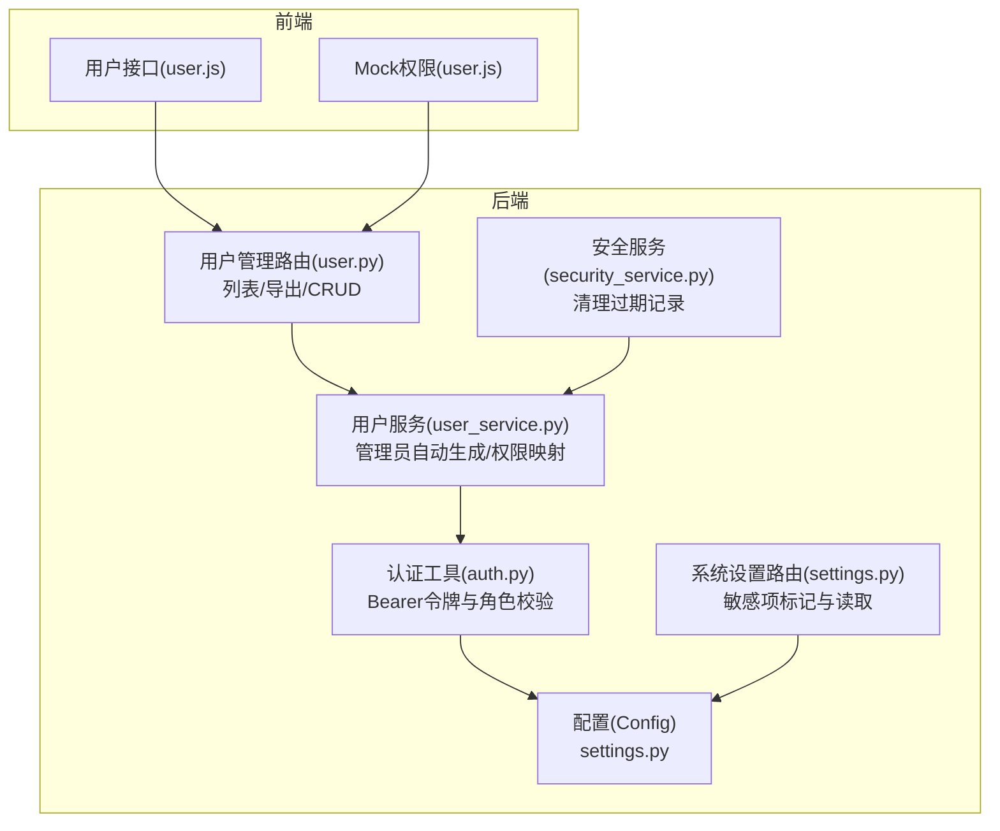
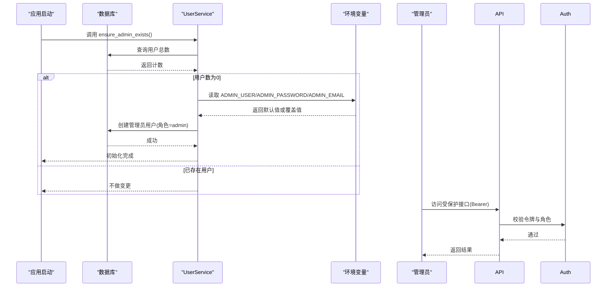
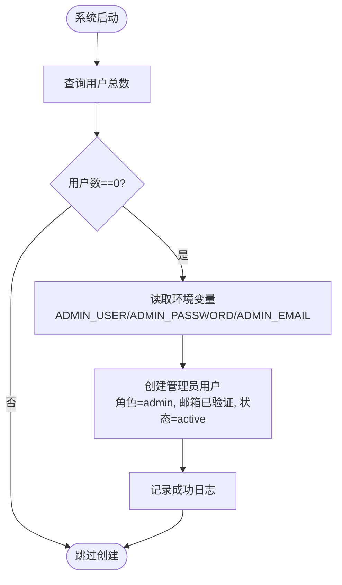
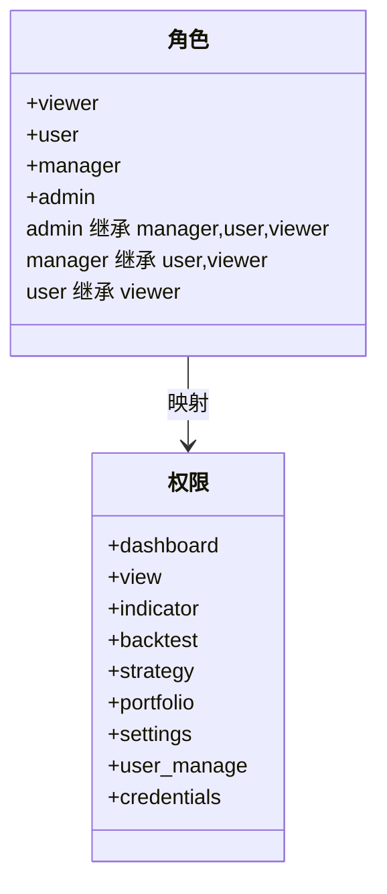
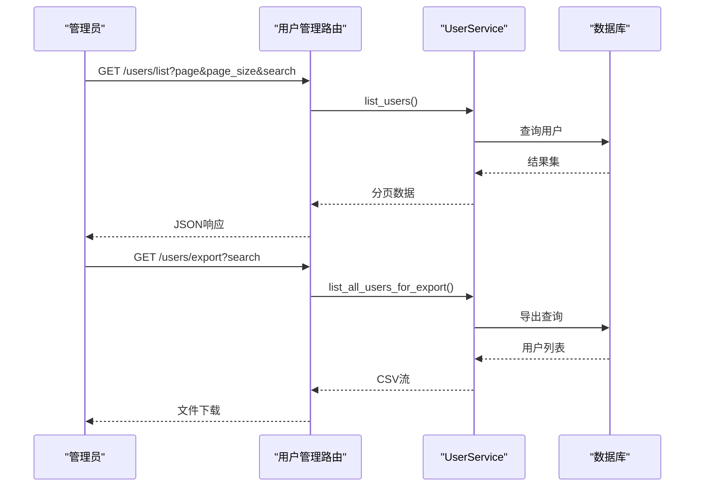
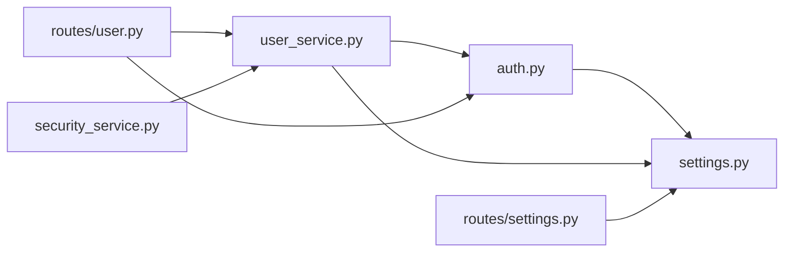

# 管理员管理

<cite>
**本文引用的文件**
- [settings.py](file://backend_api_python/app/config/settings.py)
- [user_service.py](file://backend_api_python/app/services/user_service.py)
- [auth.py](file://backend_api_python/app/utils/auth.py)
- [settings.py（后端路由）](file://backend_api_python/app/routes/settings.py)
- [user.py（用户管理路由）](file://backend_api_python/app/routes/user.py)
- [env.example](file://backend_api_python/env.example)
- [security_service.py](file://backend_api_python/app/services/security_service.py)
- [user.js（前端用户接口）](file://frontend/src/api/user.js)
- [user.js（前端Mock权限）](file://frontend/src/mock/services/user.js)
</cite>

## 目录
1. [简介](#简介)
2. [项目结构](#项目结构)
3. [核心组件](#核心组件)
4. [架构总览](#架构总览)
5. [详细组件分析](#详细组件分析)
6. [依赖分析](#依赖分析)
7. [性能考虑](#性能考虑)
8. [故障排查指南](#故障排查指南)
9. [结论](#结论)
10. [附录](#附录)

## 简介
本文件聚焦QuantDinger的管理员管理能力，系统性阐述以下主题：
- 管理员账户的自动生成机制与初始化流程
- 环境变量ADMIN_USER、ADMIN_PASSWORD、ADMIN_EMAIL的作用与安全配置建议
- 管理员权限范围与权限继承关系
- 系统配置管理与敏感项标记
- 用户批量导出与系统维护清理
- 管理员账户恢复、多管理员协作最佳实践与生产环境安全加固

## 项目结构
管理员管理涉及后端配置、认证授权、用户服务、系统设置与前端接口等多个模块协同工作。下图给出与管理员管理直接相关的模块关系。

图表来源
- [settings.py:35-41](file://backend_api_python/app/config/settings.py#L35-L41)
- [auth.py:126-171](file://backend_api_python/app/utils/auth.py#L126-L171)
- [user_service.py:60-68](file://backend_api_python/app/services/user_service.py#L60-L68)
- [settings.py（后端路由）:90-114](file://backend_api_python/app/routes/settings.py#L90-L114)
- [user.py（用户管理路由）:41-193](file://backend_api_python/app/routes/user.py#L41-L193)
- [security_service.py:362-398](file://backend_api_python/app/services/security_service.py#L362-L398)
- [user.js（前端用户接口）:1-81](file://frontend/src/api/user.js#L1-L81)
- [user.js（前端Mock权限）:290-324](file://frontend/src/mock/services/user.js#L290-L324)

章节来源
- [settings.py:35-41](file://backend_api_python/app/config/settings.py#L35-L41)
- [auth.py:126-171](file://backend_api_python/app/utils/auth.py#L126-L171)
- [user_service.py:60-68](file://backend_api_python/app/services/user_service.py#L60-L68)
- [settings.py（后端路由）:90-114](file://backend_api_python/app/routes/settings.py#L90-L114)
- [user.py（用户管理路由）:41-193](file://backend_api_python/app/routes/user.py#L41-L193)
- [security_service.py:362-398](file://backend_api_python/app/services/security_service.py#L362-L398)
- [user.js（前端用户接口）:1-81](file://frontend/src/api/user.js#L1-L81)
- [user.js（前端Mock权限）:290-324](file://frontend/src/mock/services/user.js#L290-L324)

## 核心组件
- 配置层：通过环境变量暴露管理员账号、密码与邮箱，并作为系统默认值。
- 认证层：基于Bearer令牌进行登录态校验，提供admin_required装饰器实现管理员访问控制。
- 用户服务：负责管理员自动生成、权限映射、用户批量导出等。
- 设置路由：集中展示系统配置，对密码类字段进行“已配置”标记。
- 用户管理路由：提供用户列表、导出、详情、增删改等接口，均受管理员保护。
- 安全服务：提供定期清理过期登录尝试与验证码记录的能力，保障系统维护。

章节来源
- [settings.py:35-41](file://backend_api_python/app/config/settings.py#L35-L41)
- [auth.py:126-171](file://backend_api_python/app/utils/auth.py#L126-L171)
- [user_service.py:60-68](file://backend_api_python/app/services/user_service.py#L60-L68)
- [settings.py（后端路由）:90-114](file://backend_api_python/app/routes/settings.py#L90-L114)
- [user.py（用户管理路由）:41-193](file://backend_api_python/app/routes/user.py#L41-L193)
- [security_service.py:362-398](file://backend_api_python/app/services/security_service.py#L362-L398)

## 架构总览
管理员管理的关键流程包括：系统启动时检查是否存在用户，若无则使用环境变量自动创建管理员；管理员通过Bearer令牌访问受保护接口；系统设置页面可查看敏感配置并标记其是否已配置；管理员可批量导出用户信息；安全服务定期清理历史记录。

图表来源
- [user_service.py:660-689](file://backend_api_python/app/services/user_service.py#L660-L689)
- [auth.py:126-171](file://backend_api_python/app/utils/auth.py#L126-L171)
- [user.py（用户管理路由）:41-193](file://backend_api_python/app/routes/user.py#L41-L193)

## 详细组件分析

### 管理员自动生成机制
- 触发时机：系统启动时，若检测到用户表为空，则自动创建管理员账户。
- 默认值来源：从环境变量读取ADMIN_USER、ADMIN_PASSWORD、ADMIN_EMAIL，未设置时采用内置默认值。
- 创建行为：以admin角色写入数据库，邮箱标记为已验证，状态为激活。
- 失败处理：异常会被捕获并记录错误日志，不影响系统继续运行。

图表来源
- [user_service.py:660-689](file://backend_api_python/app/services/user_service.py#L660-L689)

章节来源
- [user_service.py:660-689](file://backend_api_python/app/services/user_service.py#L660-L689)

### 环境变量配置与安全建议
- ADMIN_USER：管理员用户名，默认值来自环境变量，生产必须覆盖。
- ADMIN_PASSWORD：管理员密码，默认值来自环境变量，生产必须覆盖且满足复杂度要求。
- ADMIN_EMAIL：管理员邮箱，用于重置密码与通知，建议填写有效地址。
- SECRET_KEY：JWT签名密钥，生产必须更改，否则存在严重安全风险。
- 安全建议：
  - 在生产环境使用强口令策略，参考安全服务中的复杂度校验逻辑。
  - 使用只读的容器环境变量注入，避免明文落盘。
  - 定期轮换SECRET_KEY与管理员口令。
  - 限制数据库连接池与并发，降低口令暴力破解面。

章节来源
- [settings.py:35-41](file://backend_api_python/app/config/settings.py#L35-L41)
- [env.example:13-16](file://backend_api_python/env.example#L13-L16)
- [security_service.py:344-356](file://backend_api_python/app/services/security_service.py#L344-L356)

### 管理员权限范围与继承关系
- 角色定义：viewer → user → manager → admin，逐级增强。
- 权限映射：
  - viewer：仪表盘查看
  - user：指标、回测、策略、组合等基础功能
  - manager：在user基础上增加系统设置访问
  - admin：在manager基础上增加用户管理与凭证管理
- 权限继承：admin天然具备manager、user、viewer的所有权限；manager不具备admin权限。
- 接口保护：用户管理路由统一使用admin_required装饰器，确保仅管理员可访问。

图表来源
- [user_service.py:60-68](file://backend_api_python/app/services/user_service.py#L60-L68)
- [user.py（用户管理路由）:41-193](file://backend_api_python/app/routes/user.py#L41-L193)

章节来源
- [user_service.py:60-68](file://backend_api_python/app/services/user_service.py#L60-L68)
- [user.py（用户管理路由）:41-193](file://backend_api_python/app/routes/user.py#L41-L193)

### 系统配置管理与敏感项标记
- 配置项来源：系统设置路由集中列出配置项，包括ADMIN_USER、ADMIN_PASSWORD、ADMIN_EMAIL等。
- 敏感项标记：对密码类字段返回“已配置”布尔标记，便于前端提示。
- 实际值读取：返回当前生效值（含默认值），避免泄露真实环境变量。

章节来源
- [settings.py（后端路由）:90-114](file://backend_api_python/app/routes/settings.py#L90-L114)
- [settings.py（后端路由）:1059-1109](file://backend_api_python/app/routes/settings.py#L1059-L1109)

### 用户批量操作与系统维护
- 批量导出：管理员可导出所有用户为CSV，便于审计与迁移。
- 列表查询：支持分页、搜索，配合前端表格展示。
- 系统维护：安全服务提供定期清理过期登录尝试与验证码记录，降低存储压力与安全风险。

图表来源
- [user.py（用户管理路由）:41-193](file://backend_api_python/app/routes/user.py#L41-L193)
- [user_service.py:598-654](file://backend_api_python/app/services/user_service.py#L598-L654)

章节来源
- [user.py（用户管理路由）:41-193](file://backend_api_python/app/routes/user.py#L41-L193)
- [user_service.py:598-654](file://backend_api_python/app/services/user_service.py#L598-L654)

### 管理员账户恢复与多管理员协作
- 账户恢复：若管理员口令丢失，可在系统设置中查看“已配置”状态，结合环境变量与数据库记录进行恢复。
- 多管理员协作：通过创建多个admin账户实现多人协作；建议为不同职责划分角色（如只读审计员、策略管理员等），并利用权限继承关系最小化过度授权。
- 最佳实践：
  - 严格遵循最小权限原则，避免admin滥用。
  - 对admin账户启用二次验证与IP白名单。
  - 定期轮岗与审计，保留登录与操作日志。

章节来源
- [settings.py（后端路由）:90-114](file://backend_api_python/app/routes/settings.py#L90-L114)
- [user_service.py:60-68](file://backend_api_python/app/services/user_service.py#L60-L68)
- [user.py（用户管理路由）:41-193](file://backend_api_python/app/routes/user.py#L41-L193)

### 生产环境部署与安全加固
- 必须覆盖的环境变量：ADMIN_USER、ADMIN_PASSWORD、ADMIN_EMAIL、SECRET_KEY。
- 强口令策略：参考安全服务中的复杂度校验规则，确保长度与字符类型要求。
- 安全加固清单：
  - 使用独立数据库用户与最小权限。
  - 开启请求日志与访问审计，限制日志级别与大小。
  - 启用速率限制与防爆破策略。
  - 定期清理过期记录，保持数据库整洁。
  - 使用反向代理与TLS终止，限制暴露面。

章节来源
- [env.example:13-16](file://backend_api_python/env.example#L13-L16)
- [settings.py:66-72](file://backend_api_python/app/config/settings.py#L66-L72)
- [security_service.py:362-398](file://backend_api_python/app/services/security_service.py#L362-L398)

## 依赖分析
- 模块耦合：
  - 用户服务依赖数据库连接与环境变量，负责管理员自动生成与权限映射。
  - 认证工具依赖配置类读取管理员凭据，提供令牌校验与角色判断。
  - 用户管理路由依赖用户服务与认证装饰器，实现管理员保护。
  - 系统设置路由依赖配置Schema与环境文件读取，提供敏感项标记。
  - 安全服务独立于用户服务，提供系统维护清理能力。
- 外部依赖：
  - 数据库：PostgreSQL（通过连接池与事务保证一致性）。
  - 前端：通过用户接口访问后端受保护路由。

图表来源
- [auth.py:126-171](file://backend_api_python/app/utils/auth.py#L126-L171)
- [settings.py:35-41](file://backend_api_python/app/config/settings.py#L35-L41)
- [user_service.py:660-689](file://backend_api_python/app/services/user_service.py#L660-L689)
- [user.py（用户管理路由）:41-193](file://backend_api_python/app/routes/user.py#L41-L193)
- [settings.py（后端路由）:90-114](file://backend_api_python/app/routes/settings.py#L90-L114)
- [security_service.py:362-398](file://backend_api_python/app/services/security_service.py#L362-L398)

章节来源
- [auth.py:126-171](file://backend_api_python/app/utils/auth.py#L126-L171)
- [settings.py:35-41](file://backend_api_python/app/config/settings.py#L35-L41)
- [user_service.py:660-689](file://backend_api_python/app/services/user_service.py#L660-L689)
- [user.py（用户管理路由）:41-193](file://backend_api_python/app/routes/user.py#L41-L193)
- [settings.py（后端路由）:90-114](file://backend_api_python/app/routes/settings.py#L90-L114)
- [security_service.py:362-398](file://backend_api_python/app/services/security_service.py#L362-L398)

## 性能考虑
- 数据库连接池：合理配置最大连接数与超时时间，避免高并发下的连接耗尽。
- 导出性能：批量导出应分页与流式输出，避免一次性加载全部数据。
- 缓存策略：在允许的情况下启用缓存，减少重复查询开销。
- 清理任务：定期清理过期记录，保持查询效率与存储健康。

## 故障排查指南
- 管理员未生成：
  - 检查用户表是否为空，确认环境变量是否正确注入。
  - 查看日志中管理员创建失败的错误信息。
- 登录失败：
  - 确认口令是否符合复杂度要求。
  - 检查令牌是否有效、是否过期。
- 权限不足：
  - 确认用户角色是否为admin。
  - 检查权限映射与接口装饰器使用是否正确。
- 导出异常：
  - 检查搜索条件与分页参数。
  - 确认数据库连接与事务状态。

章节来源
- [user_service.py:660-689](file://backend_api_python/app/services/user_service.py#L660-L689)
- [auth.py:126-171](file://backend_api_python/app/utils/auth.py#L126-L171)
- [user.py（用户管理路由）:41-193](file://backend_api_python/app/routes/user.py#L41-L193)
- [security_service.py:362-398](file://backend_api_python/app/services/security_service.py#L362-L398)

## 结论
QuantDinger的管理员管理以“环境变量驱动 + 自动初始化 + Bearer令牌保护”为核心，辅以清晰的权限映射与批量操作能力。生产环境中务必覆盖关键环境变量、实施强口令策略与定期维护清理，确保系统安全与稳定。

## 附录
- 前端接口与权限对照：
  - 管理员可通过用户接口执行列表、导出、详情、创建、更新、删除等操作。
  - Mock权限中明确admin具备用户管理的增删改查与导入导出能力。

章节来源
- [user.js（前端用户接口）:1-81](file://frontend/src/api/user.js#L1-L81)
- [user.js（前端Mock权限）:290-324](file://frontend/src/mock/services/user.js#L290-L324)