# 角色权限系统

<cite>
**本文档引用的文件**
- [auth.py](file://backend/app/utils/auth.py)
- [user_service.py](file://backend/app/services/user_service.py)
- [permission.py](file://backend/app/models/permission.py)
- [permission.py](file://backend/app/routes/permission.py)
- [permission_service.py](file://backend/app/services/permission_service.py)
- [index.vue](file://frontend/src/views/role-manage/index.vue)
- [index.vue](file://frontend/src/views/permission-manage/index.vue)
- [permission.js](file://frontend/src/api/permission.js)
- [permission.js](file://frontend/src/core/permission/permission.js)
- [action.js](file://frontend/src/core/directives/action.js)
- [user.js](file://frontend/src/store/modules/user.js)
- [permission.js](file://frontend/src/permission.js)
</cite>

## 更新摘要
**所做更改**
- 更新了前端角色管理界面增强功能的文档
- 新增了权限管理工具改进的相关内容
- 补充了权限映射功能的详细说明
- 更新了权限验证机制和最佳实践指南

## 目录
1. [简介](#简介)
2. [项目结构](#项目结构)
3. [核心组件](#核心组件)
4. [架构概览](#架构概览)
5. [详细组件分析](#详细组件分析)
6. [前端角色管理界面增强](#前端角色管理界面增强)
7. [权限管理工具改进](#权限管理工具改进)
8. [权限映射功能详解](#权限映射功能详解)
9. [依赖关系分析](#依赖关系分析)
10. [性能考虑](#性能考虑)
11. [故障排除指南](#故障排除指南)
12. [结论](#结论)

## 简介

QuantDinger 的角色权限系统采用四层角色模型设计，通过 JWT 令牌实现多用户认证和基于角色的访问控制。系统支持 viewer、user、manager、admin 四个角色，每个角色具有明确的权限边界和继承关系。

**更新** 系统现已增强前端角色管理界面，提供更直观的权限分配体验，并改进了权限映射功能，支持复杂的权限树结构管理。

该权限系统的核心特点包括：
- **分层权限模型**：角色权限逐级递增，viewer → user → manager → admin
- **细粒度权限控制**：支持按功能模块和操作级别的权限控制
- **前后端协同验证**：后端严格验证，前端提供用户体验优化
- **安全的令牌管理**：支持单客户端登录控制和令牌版本管理
- **增强的前端管理界面**：提供直观的角色和权限管理功能

## 项目结构

权限系统主要分布在以下目录中：

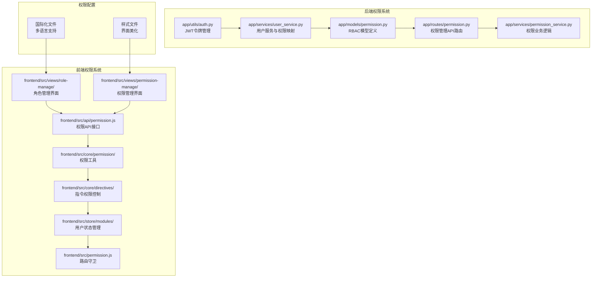

**图表来源**
- [permission.py:15-106](file://backend/app/models/permission.py#L15-L106)
- [permission.py:1-277](file://backend/app/routes/permission.py#L1-L277)
- [permission_service.py:16-346](file://backend/app/services/permission_service.py#L16-L346)
- [index.vue:125-286](file://frontend/src/views/role-manage/index.vue#L125-L286)
- [index.vue:138-332](file://frontend/src/views/permission-manage/index.vue#L138-L332)

## 核心组件

### 角色层次结构

系统采用严格的四层角色模型，角色权限呈线性递增关系：

| 角色 | 权限范围 | 主要功能 |
|------|----------|----------|
| **Viewer** | 最小权限 | 仅能访问仪表板查看功能 |
| **User** | 基础交易权限 | 策略开发、回测执行、组合管理 |
| **Manager** | 管理权限 | 设置修改、用户管理 |
| **Admin** | 最高权限 | 系统管理、凭证管理 |

### 权限映射表

```mermaid
erDiagram
ROLE {
string viewer
string user
string manager
string admin
}
PERMISSION {
string dashboard
string view
string indicator
string backtest
string strategy
string portfolio
string settings
string user_manage
string credentials
}
ROLE ||--o{ PERMISSION : "拥有"
viewer ||--|| dashboard
viewer ||--|| view
user ||--|| dashboard
user ||--|| view
user ||--|| indicator
user ||--|| backtest
user ||--|| strategy
user ||--|| portfolio
manager ||--|| dashboard
manager ||--|| view
manager ||--|| indicator
manager ||--|| backtest
manager ||--|| strategy
manager ||--|| portfolio
manager ||--|| settings
admin ||--|| dashboard
admin ||--|| view
admin ||--|| indicator
admin ||--|| backtest
admin ||--|| strategy
admin ||--|| portfolio
admin ||--|| settings
admin ||--|| user_manage
admin ||--|| credentials
```

**图表来源**
- [permission_service.py:153-161](file://backend/app/services/permission_service.py#L153-L161)

**章节来源**
- [permission_service.py:153-161](file://backend/app/services/permission_service.py#L153-L161)

## 架构概览

### 整体架构流程

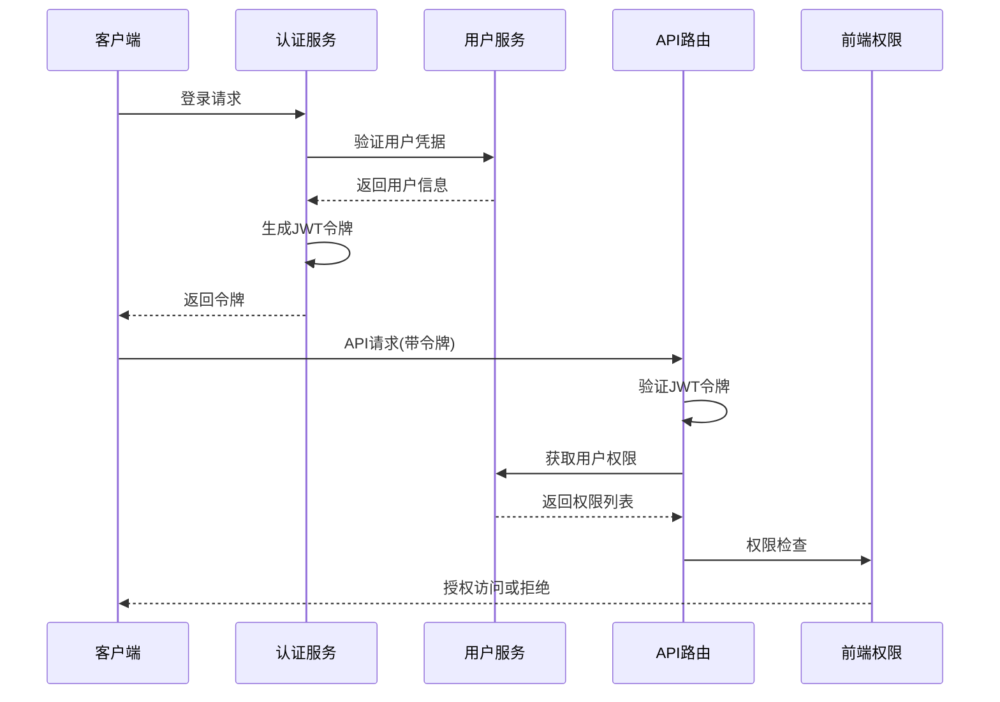

**图表来源**
- [auth.py:156-324](file://backend/app/utils/auth.py#L156-L324)
- [auth.py:126-157](file://backend/app/utils/auth.py#L126-L157)

### 权限验证流程

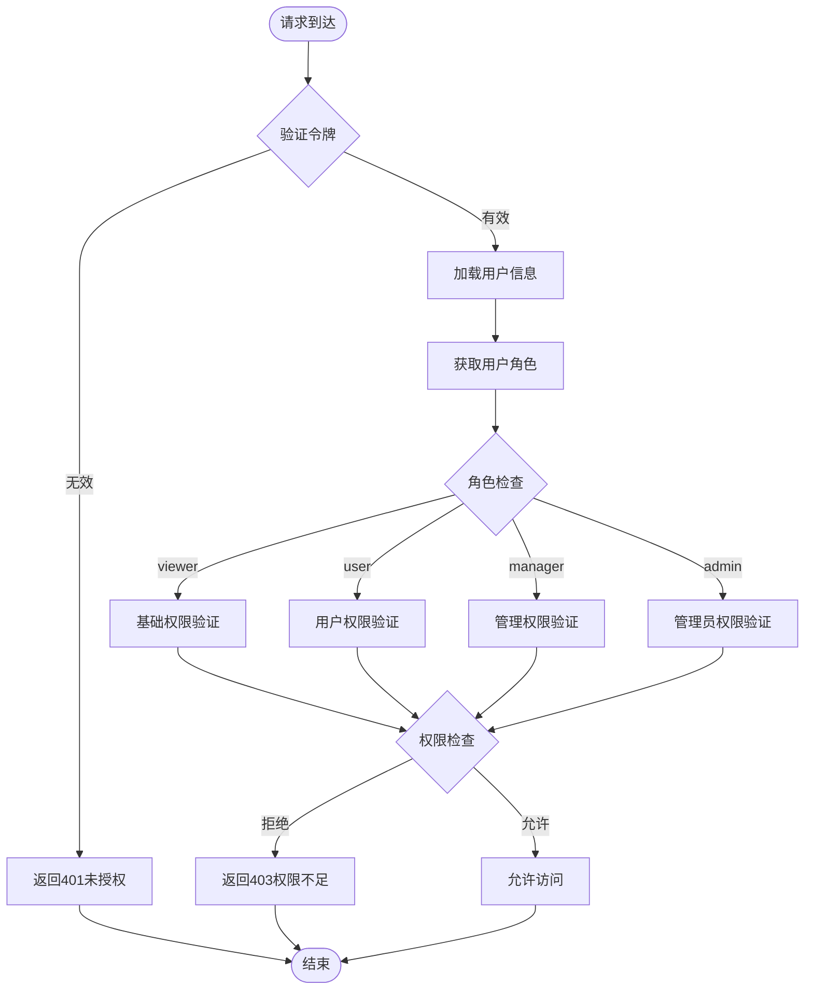

**图表来源**
- [auth.py:188-217](file://backend/app/utils/auth.py#L188-L217)
- [permission_service.py:331-334](file://backend/app/services/permission_service.py#L331-L334)

**章节来源**
- [auth.py:126-217](file://backend/app/utils/auth.py#L126-L217)
- [permission_service.py:331-334](file://backend/app/services/permission_service.py#L331-L334)

## 详细组件分析

### 后端权限验证组件

#### JWT 令牌管理

JWT 令牌包含以下关键信息：
- **用户标识**：user_id、username
- **角色信息**：role
- **令牌版本**：token_version（用于单客户端登录控制）
- **有效期**：7天

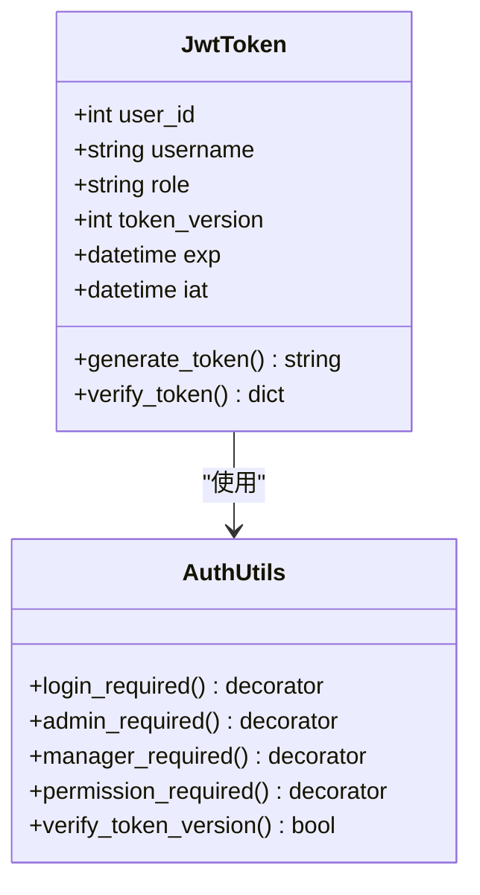

**图表来源**
- [auth.py:18-47](file://backend/app/utils/auth.py#L18-L47)
- [auth.py:126-185](file://backend/app/utils/auth.py#L126-L185)

#### RBAC 数据模型

系统采用标准的 RBAC（基于角色的访问控制）模型，包含以下核心实体：

**章节来源**
- [auth.py:18-47](file://backend/app/utils/auth.py#L18-L47)
- [permission.py:15-106](file://backend/app/models/permission.py#L15-L106)

### 前端权限控制组件

#### 权限工具类

前端提供了完整的权限控制工具集：

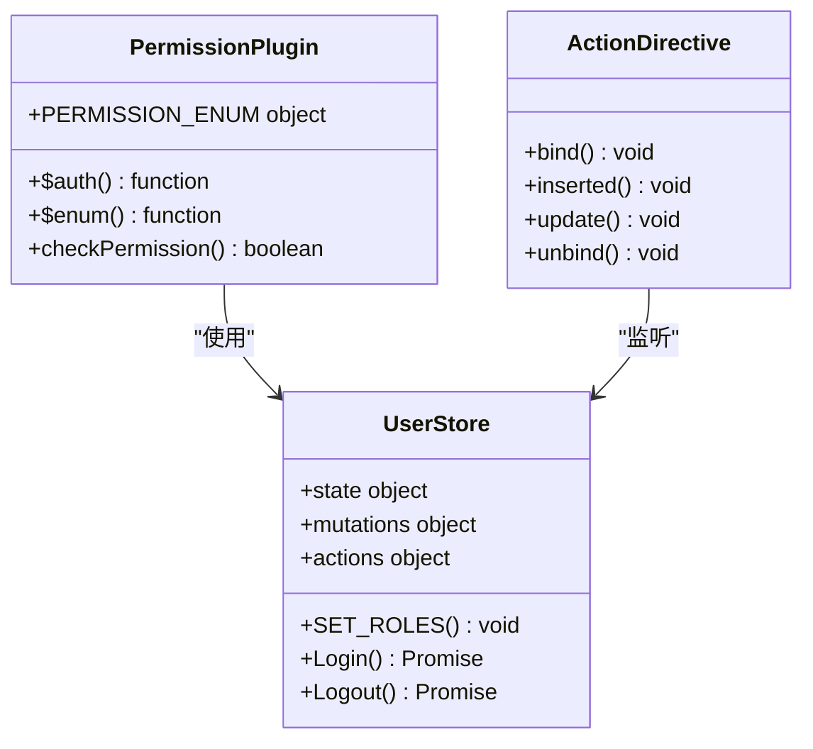

**图表来源**
- [permission.js:17-55](file://frontend/src/core/permission/permission.js#L17-L55)
- [action.js:17-34](file://frontend/src/core/directives/action.js#L17-L34)

#### 路由守卫权限控制

路由守卫实现了多层次的权限检查：

**章节来源**
- [permission.js:17-55](file://frontend/src/core/permission/permission.js#L17-L55)
- [action.js:17-34](file://frontend/src/core/directives/action.js#L17-L34)
- [user.js:52-118](file://frontend/src/store/modules/user.js#L52-L118)

### API 路由权限控制

#### 权限管理 API

权限管理提供完整的 CRUD 操作和权限分配功能：

**章节来源**
- [permission.py:1-277](file://backend/app/routes/permission.py#L1-L277)
- [permission_service.py:16-346](file://backend/app/services/permission_service.py#L16-L346)

## 前端角色管理界面增强

### 角色管理界面功能

**更新** 前端角色管理界面经过重大增强，提供更直观的用户体验：

#### 主要功能特性

1. **增强的表格界面**：支持搜索、状态显示、批量操作
2. **模态框表单**：完整的角色创建和编辑功能
3. **权限分配抽屉**：基于树形结构的权限分配界面
4. **实时权限映射**：支持复杂的权限树结构管理

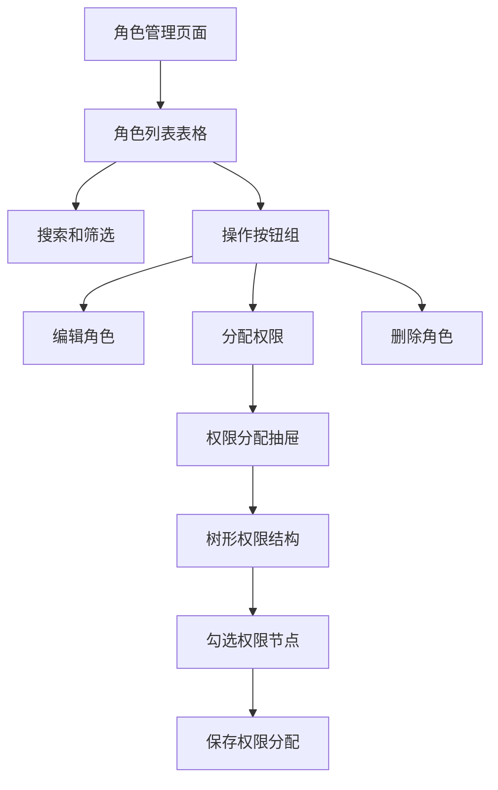

**图表来源**
- [index.vue:27-121](file://frontend/src/views/role-manage/index.vue#L27-L121)
- [index.vue:230-284](file://frontend/src/views/role-manage/index.vue#L230-L284)

#### 权限分配功能

权限分配界面支持以下特性：
- **树形结构展示**：清晰的权限层级关系
- **批量勾选**：支持一次性选择多个权限
- **实时映射**：treePermId 与真实权限 ID 的双向映射
- **异步加载**：权限树数据的异步加载和缓存

**章节来源**
- [index.vue:125-286](file://frontend/src/views/role-manage/index.vue#L125-L286)

### 权限管理界面功能

**更新** 权限管理界面提供完整的权限树结构管理能力：

#### 权限类型管理

界面支持三种权限类型：
- **目录（dir）**：权限树的根节点
- **菜单（menu）**：具体的菜单项，支持路由配置
- **按钮（button）**：页面上的具体操作按钮

#### 树形数据处理

权限树采用扁平化存储，支持：
- **层级展开**：支持多级权限树的展开和折叠
- **唯一键生成**：使用自增计数器确保行键唯一性
- **父级选择**：智能的父子关系验证和选择

**章节来源**
- [index.vue:138-332](file://frontend/src/views/permission-manage/index.vue#L138-L332)

## 权限管理工具改进

### API 接口增强

**更新** 权限管理 API 经过改进，提供更丰富的功能：

#### 权限树接口

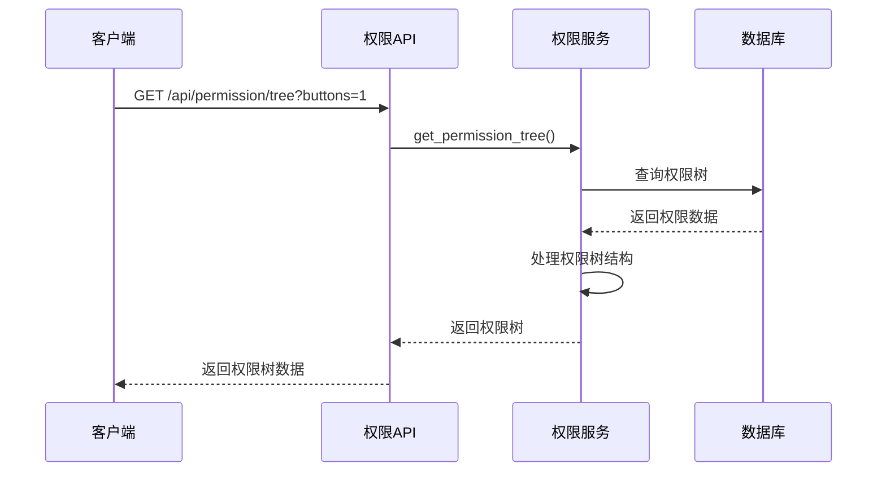

**图表来源**
- [permission.js:10-16](file://frontend/src/api/permission.js#L10-L16)
- [permission_service.py:65-73](file://backend/app/services/permission_service.py#L65-L73)

#### 角色权限分配

角色权限分配采用全新的映射机制：
- **权限 ID 映射**：treePermId ↔ realPermissionId
- **批量操作**：支持一次分配多个权限
- **实时同步**：权限变更的实时生效

**章节来源**
- [permission.js:97-103](file://frontend/src/api/permission.js#L97-L103)
- [permission_service.py:204-218](file://backend/app/services/permission_service.py#L204-L218)

### 权限验证工具

**更新** 前端权限验证工具得到显著改进：

#### 权限枚举管理

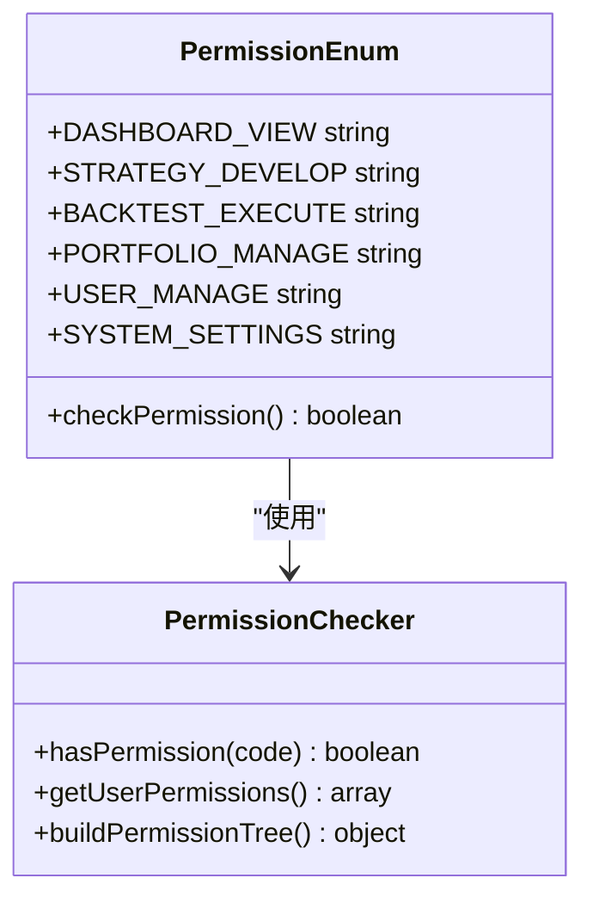

**图表来源**
- [permission.js:17-55](file://frontend/src/core/permission/permission.js#L17-L55)

#### 指令权限控制

Vue 指令权限控制系统：
- **v-hasPermi**：基于权限码的指令控制
- **动态权限检查**：运行时权限验证
- **DOM 级别控制**：精确的元素显示/隐藏控制

**章节来源**
- [permission.js:17-55](file://frontend/src/core/permission/permission.js#L17-L55)
- [action.js:17-34](file://frontend/src/core/directives/action.js#L17-L34)

## 权限映射功能详解

### 树形权限映射机制

**更新** 系统实现了复杂的树形权限映射功能：

#### 权限 ID 映射算法


**图表来源**
- [index.vue:240-272](file://frontend/src/views/role-manage/index.vue#L240-L272)

#### 权限树构建过程

权限树构建包含以下步骤：
1. **权限树获取**：从后端获取完整的权限树结构
2. **唯一键生成**：为每个节点生成唯一的 treePermId
3. **映射表建立**：建立 treePermId → realPermissionId 的映射关系
4. **前端渲染**：使用 treePermId 进行前端渲染和交互
5. **权限保存**：将用户选择的 treePermId 转换为真实权限 ID 并保存

**章节来源**
- [index.vue:230-284](file://frontend/src/views/role-manage/index.vue#L230-L284)

### 权限继承机制

**更新** 权限继承机制得到优化，支持更灵活的权限组合：

#### 多角色权限合并

用户可以拥有多个角色，系统自动合并各角色的权限：
- **权限去重**：自动去除重复的权限
- **权限优先级**：管理员权限优先于普通用户权限
- **实时更新**：角色变更时权限实时更新

#### 权限计算流程

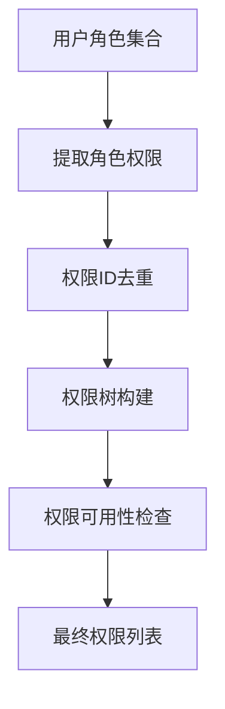

**图表来源**
- [permission_service.py:262-272](file://backend/app/services/permission_service.py#L262-L272)

**章节来源**
- [permission_service.py:262-272](file://backend/app/services/permission_service.py#L262-L272)

## 依赖关系分析

### 组件依赖图

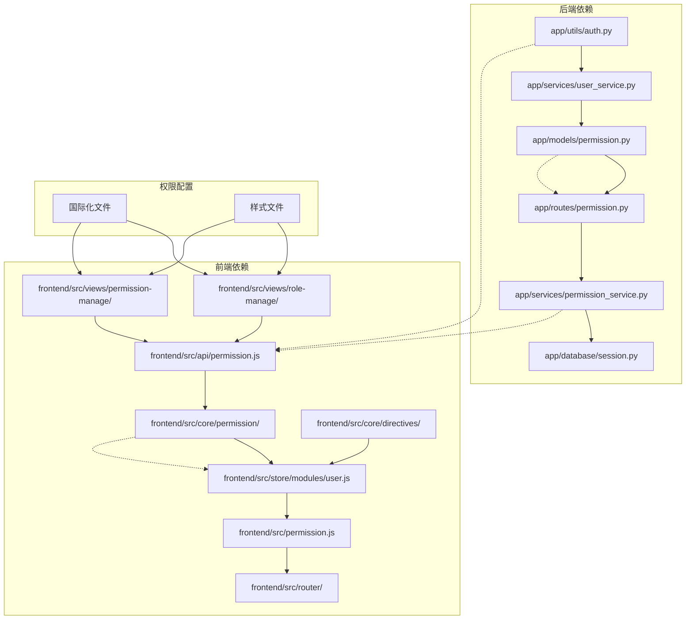

**图表来源**
- [auth.py:11-13](file://backend/app/utils/auth.py#L11-L13)
- [permission.py:10-12](file://backend/app/models/permission.py#L10-L12)
- [permission_service.py:8-11](file://backend/app/services/permission_service.py#L8-L11)

### 权限检查流程

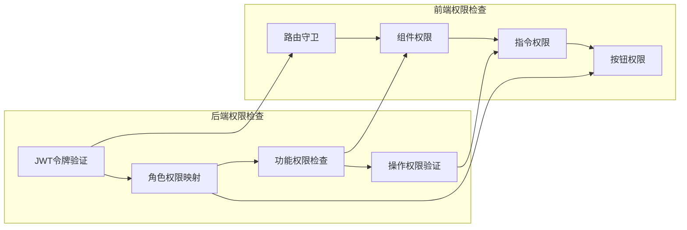

**图表来源**
- [auth.py:188-217](file://backend/app/utils/auth.py#L188-L217)
- [permission.js:22-35](file://frontend/src/core/permission/permission.js#L22-L35)

**章节来源**
- [auth.py:188-217](file://backend/app/utils/auth.py#L188-L217)
- [permission.js:22-35](file://frontend/src/core/permission/permission.js#L22-L35)

## 性能考虑

### 权限验证性能优化

1. **令牌缓存策略**：JWT 令牌有效期为7天，减少频繁验证开销
2. **权限映射缓存**：用户权限在会话期间缓存，避免重复查询
3. **懒加载服务**：策略服务和回测服务采用延迟初始化
4. **数据库连接池**：使用连接池管理数据库连接
5. **前端权限缓存**：权限树数据在前端进行缓存，减少重复请求

### 前端性能优化

1. **权限状态持久化**：用户权限状态存储在本地存储中
2. **路由动态生成**：根据用户权限动态生成路由，避免不必要的渲染
3. **指令权限检查**：使用 Vue 指令进行高效的 DOM 权限控制
4. **树形数据优化**：权限树采用扁平化存储，提高渲染性能
5. **异步加载机制**：权限数据采用异步加载，提升用户体验

## 故障排除指南

### 常见权限问题

#### 令牌验证失败

**问题症状**：
- API 请求返回 401 未授权
- 前端显示登录超时

**解决方案**：
1. 检查令牌是否过期（默认7天）
2. 验证令牌签名是否正确
3. 确认 token_version 是否匹配

#### 权限不足错误

**问题症状**：
- API 请求返回 403 权限不足
- 功能按钮不可见或禁用

**解决方案**：
1. 检查用户角色是否正确
2. 验证用户是否具备相应权限
3. 确认权限映射配置是否正确

#### 单客户端登录冲突

**问题症状**：
- 新登录导致旧会话失效
- 重复登录被拒绝

**解决方案**：
1. 检查 token_version 字段
2. 确认用户状态更新是否成功
3. 验证数据库连接配置

#### 权限树加载失败

**问题症状**：
- 角色管理界面权限树无法加载
- 权限分配功能异常

**解决方案**：
1. 检查后端权限 API 是否正常
2. 验证数据库连接是否正常
3. 确认权限树数据格式是否正确
4. 检查前端权限映射逻辑

#### 权限分配不生效

**问题症状**：
- 角色权限分配后用户权限未更新
- 权限变更后仍显示旧权限

**解决方案**：
1. 检查权限 ID 映射是否正确
2. 验证权限分配 API 是否正常
3. 确认用户权限缓存是否更新
4. 检查权限继承逻辑是否正确

**章节来源**
- [auth.py:82-113](file://backend/app/utils/auth.py#L82-L113)
- [auth.py:146-156](file://backend/app/utils/auth.py#L146-L156)

## 结论

QuantDinger 的角色权限系统通过严谨的四层角色模型和完善的前后端协同机制，实现了安全可靠的多用户权限管理。系统经过本次更新后，具有以下显著优势：

1. **增强的前端管理界面**：提供直观的角色和权限管理体验
2. **完善的权限映射功能**：支持复杂的权限树结构管理
3. **灵活的权限继承机制**：支持多角色权限的智能合并
4. **全面的安全保障**：JWT 令牌、单客户端登录控制、权限验证
5. **良好的用户体验**：前端权限控制提供即时反馈
6. **可扩展的设计**：模块化架构支持权限系统的扩展和定制

该权限系统为 QuantDinger 提供了坚实的安全基础，支持从个人用户到企业级部署的各种使用场景。新的前端界面增强了系统的易用性和管理效率，为用户提供更好的权限管理体验。