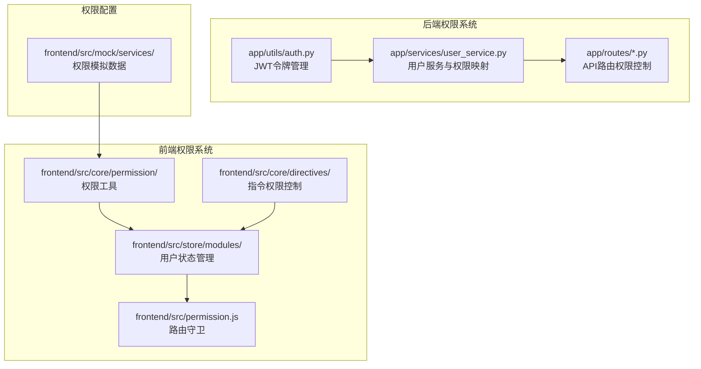
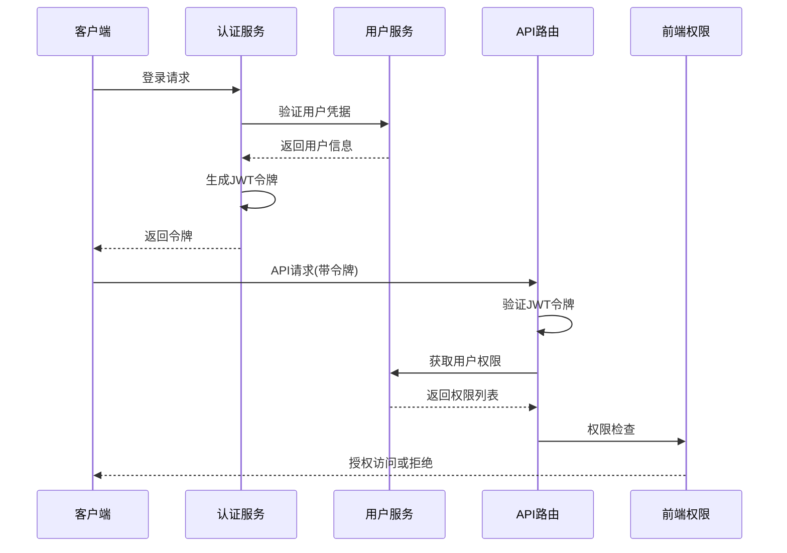
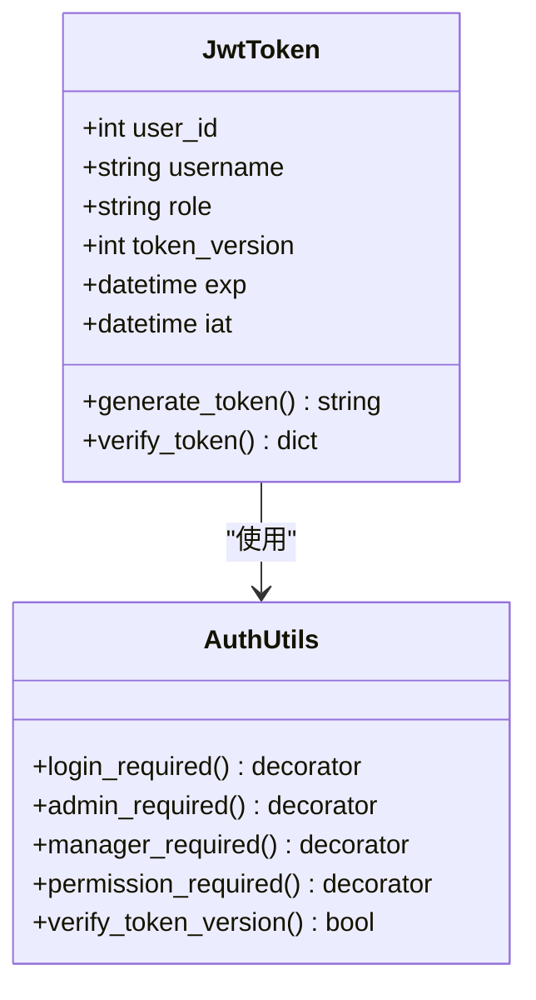
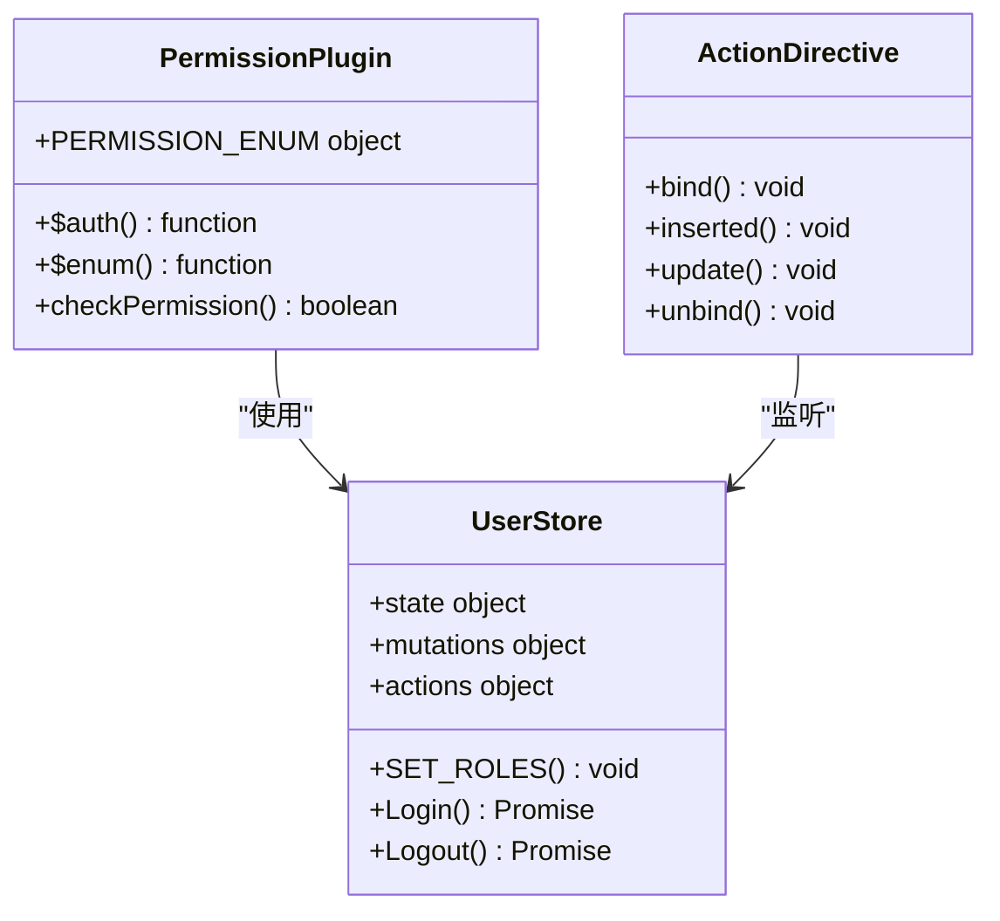
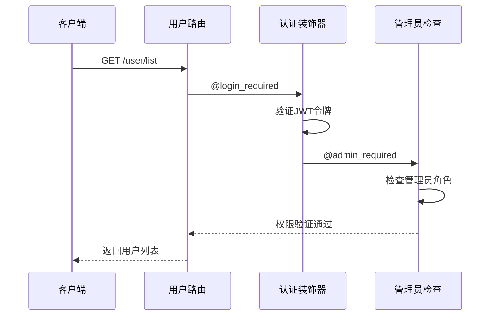
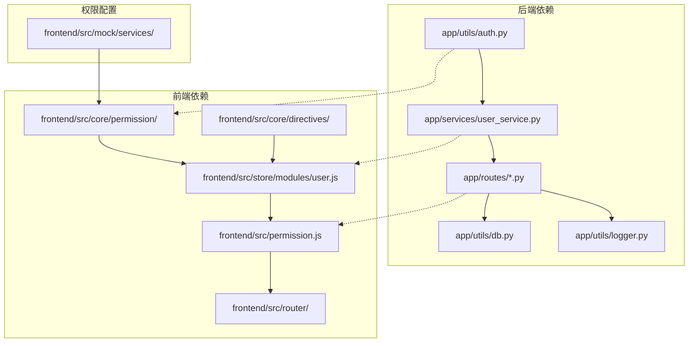
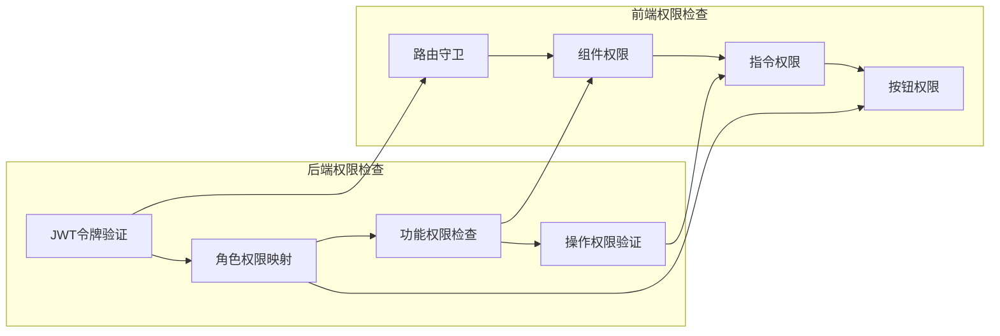

# 角色权限系统

<cite>
**本文档引用的文件**
- [auth.py](file://backend_api_python/app/utils/auth.py)
- [user_service.py](file://backend_api_python/app/services/user_service.py)
- [user.py](file://backend_api_python/app/routes/user.py)
- [auth.py](file://backend_api_python/app/routes/auth.py)
- [credentials.py](file://backend_api_python/app/routes/credentials.py)
- [permission.js](file://frontend/src/core/permission/permission.js)
- [action.js](file://frontend/src/core/directives/action.js)
- [user.js](file://frontend/src/store/modules/user.js)
- [permission.js](file://frontend/src/permission.js)
- [user.js](file://frontend/src/mock/services/user.js)
- [other.js](file://frontend/src/mock/services/other.js)
</cite>

## 目录
1. [简介](#简介)
2. [项目结构](#项目结构)
3. [核心组件](#核心组件)
4. [架构概览](#架构概览)
5. [详细组件分析](#详细组件分析)
6. [依赖关系分析](#依赖关系分析)
7. [性能考虑](#性能考虑)
8. [故障排除指南](#故障排除指南)
9. [结论](#结论)

## 简介

QuantDinger 的角色权限系统采用四层角色模型设计，通过 JWT 令牌实现多用户认证和基于角色的访问控制。系统支持 viewer、user、manager、admin 四个角色，每个角色具有明确的权限边界和继承关系。

该权限系统的核心特点包括：
- **分层权限模型**：角色权限逐级递增，viewer → user → manager → admin
- **细粒度权限控制**：支持按功能模块和操作级别的权限控制
- **前后端协同验证**：后端严格验证，前端提供用户体验优化
- **安全的令牌管理**：支持单客户端登录控制和令牌版本管理

## 项目结构

权限系统主要分布在以下目录中：



**图表来源**
- [auth.py:1-239](file://backend_api_python/app/utils/auth.py#L1-239)
- [user_service.py:56-68](file://backend_api_python/app/services/user_service.py#L56-68)
- [permission.js:1-56](file://frontend/src/core/permission/permission.js#L1-56)

**章节来源**
- [auth.py:1-239](file://backend_api_python/app/utils/auth.py#L1-239)
- [user_service.py:56-68](file://backend_api_python/app/services/user_service.py#L56-68)
- [permission.js:1-56](file://frontend/src/core/permission/permission.js#L1-56)

## 核心组件

### 角色层次结构

系统采用严格的四层角色模型，角色权限呈线性递增关系：

| 角色 | 权限范围 | 主要功能 |
|------|----------|----------|
| **Viewer** | 最小权限 | 仅能访问仪表板查看功能 |
| **User** | 基础交易权限 | 策略开发、回测执行、组合管理 |
| **Manager** | 管理权限 | 设置修改、用户管理 |
| **Admin** | 最高权限 | 系统管理、凭证管理 |

### 权限映射表

```mermaid
erDiagram
ROLE {
string viewer
string user
string manager
string admin
}
PERMISSION {
string dashboard
string view
string indicator
string backtest
string strategy
string portfolio
string settings
string user_manage
string credentials
}
ROLE ||--o{ PERMISSION : "拥有"
viewer ||--|| dashboard
viewer ||--|| view
user ||--|| dashboard
user ||--|| view
user ||--|| indicator
user ||--|| backtest
user ||--|| strategy
user ||--|| portfolio
manager ||--|| dashboard
manager ||--|| view
manager ||--|| indicator
manager ||--|| backtest
manager ||--|| strategy
manager ||--|| portfolio
manager ||--|| settings
admin ||--|| dashboard
admin ||--|| view
admin ||--|| indicator
admin ||--|| backtest
admin ||--|| strategy
admin ||--|| portfolio
admin ||--|| settings
admin ||--|| user_manage
admin ||--|| credentials
```

**图表来源**
- [user_service.py:62-68](file://backend_api_python/app/services/user_service.py#L62-68)

**章节来源**
- [user_service.py:59-68](file://backend_api_python/app/services/user_service.py#L59-68)

## 架构概览

### 整体架构流程



**图表来源**
- [auth.py:156-324](file://backend_api_python/app/routes/auth.py#L156-324)
- [auth.py:126-157](file://backend_api_python/app/utils/auth.py#L126-157)

### 权限验证流程


**图表来源**
- [auth.py:188-217](file://backend_api_python/app/utils/auth.py#L188-217)
- [user_service.py:656-658](file://backend_api_python/app/services/user_service.py#L656-658)

**章节来源**
- [auth.py:126-217](file://backend_api_python/app/utils/auth.py#L126-217)
- [user_service.py:656-658](file://backend_api_python/app/services/user_service.py#L656-658)

## 详细组件分析

### 后端权限验证组件

#### JWT 令牌管理

JWT 令牌包含以下关键信息：
- **用户标识**：user_id、username
- **角色信息**：role
- **令牌版本**：token_version（用于单客户端登录控制）
- **有效期**：7天



**图表来源**
- [auth.py:18-47](file://backend_api_python/app/utils/auth.py#L18-47)
- [auth.py:126-185](file://backend_api_python/app/utils/auth.py#L126-185)

#### 用户服务与权限映射

用户服务负责维护角色与权限的映射关系：

**章节来源**
- [auth.py:18-47](file://backend_api_python/app/utils/auth.py#L18-47)
- [user_service.py:59-68](file://backend_api_python/app/services/user_service.py#L59-68)

### 前端权限控制组件

#### 权限工具类

前端提供了完整的权限控制工具集：



**图表来源**
- [permission.js:17-55](file://frontend/src/core/permission/permission.js#L17-55)
- [action.js:17-34](file://frontend/src/core/directives/action.js#L17-34)

#### 路由守卫权限控制

路由守卫实现了多层次的权限检查：

**章节来源**
- [permission.js:17-55](file://frontend/src/core/permission/permission.js#L17-55)
- [action.js:17-34](file://frontend/src/core/directives/action.js#L17-34)
- [user.js:52-118](file://frontend/src/store/modules/user.js#L52-118)

### API 路由权限控制

#### 用户管理权限

用户管理路由要求管理员权限：



**图表来源**
- [user.py:41-108](file://backend_api_python/app/routes/user.py#L41-108)
- [auth.py:160-171](file://backend_api_python/app/utils/auth.py#L160-171)

#### 凭证管理权限

凭证管理路由要求用户具备相应的权限：

**章节来源**
- [user.py:41-108](file://backend_api_python/app/routes/user.py#L41-108)
- [credentials.py:32-99](file://backend_api_python/app/routes/credentials.py#L32-99)

## 依赖关系分析

### 组件依赖图



**图表来源**
- [auth.py:11-13](file://backend_api_python/app/utils/auth.py#L11-13)
- [user_service.py:10-12](file://backend_api_python/app/services/user_service.py#L10-12)

### 权限检查流程



**图表来源**
- [auth.py:188-217](file://backend_api_python/app/utils/auth.py#L188-217)
- [permission.js:22-35](file://frontend/src/core/permission/permission.js#L22-35)

**章节来源**
- [auth.py:188-217](file://backend_api_python/app/utils/auth.py#L188-217)
- [permission.js:22-35](file://frontend/src/core/permission/permission.js#L22-35)

## 性能考虑

### 权限验证性能优化

1. **令牌缓存策略**：JWT 令牌有效期为7天，减少频繁验证开销
2. **权限映射缓存**：用户权限在会话期间缓存，避免重复查询
3. **懒加载服务**：策略服务和回测服务采用延迟初始化
4. **数据库连接池**：使用连接池管理数据库连接

### 前端性能优化

1. **权限状态持久化**：用户权限状态存储在本地存储中
2. **路由动态生成**：根据用户权限动态生成路由，避免不必要的渲染
3. **指令权限检查**：使用 Vue 指令进行高效的 DOM 权限控制

## 故障排除指南

### 常见权限问题

#### 令牌验证失败

**问题症状**：
- API 请求返回 401 未授权
- 前端显示登录超时

**解决方案**：
1. 检查令牌是否过期（默认7天）
2. 验证令牌签名是否正确
3. 确认 token_version 是否匹配

#### 权限不足错误

**问题症状**：
- API 请求返回 403 权限不足
- 功能按钮不可见或禁用

**解决方案**：
1. 检查用户角色是否正确
2. 验证用户是否具备相应权限
3. 确认权限映射配置是否正确

#### 单客户端登录冲突

**问题症状**：
- 新登录导致旧会话失效
- 重复登录被拒绝

**解决方案**：
1. 检查 token_version 字段
2. 确认用户状态更新是否成功
3. 验证数据库连接配置

**章节来源**
- [auth.py:82-113](file://backend_api_python/app/utils/auth.py#L82-113)
- [auth.py:146-156](file://backend_api_python/app/utils/auth.py#L146-156)

## 结论

QuantDinger 的角色权限系统通过严谨的四层角色模型和完善的前后端协同机制，实现了安全可靠的多用户权限管理。系统的主要优势包括：

1. **清晰的权限层次**：角色权限逐级递增，便于理解和维护
2. **全面的安全保障**：JWT 令牌、单客户端登录控制、权限验证
3. **良好的用户体验**：前端权限控制提供即时反馈
4. **可扩展的设计**：模块化架构支持权限系统的扩展和定制

该权限系统为 QuantDinger 提供了坚实的安全基础，支持从个人用户到企业级部署的各种使用场景。