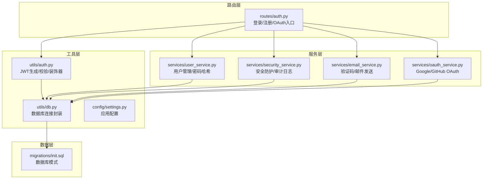
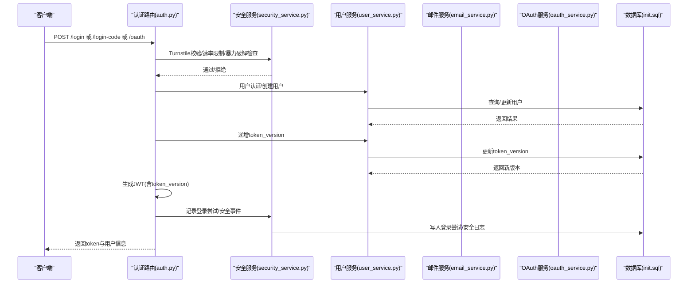
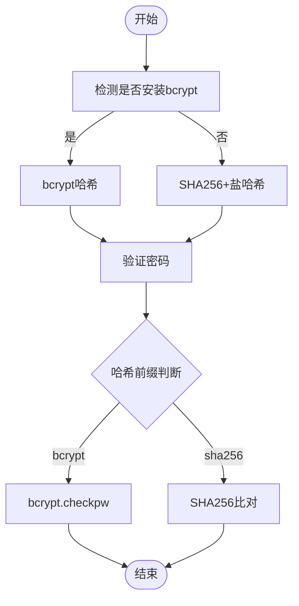
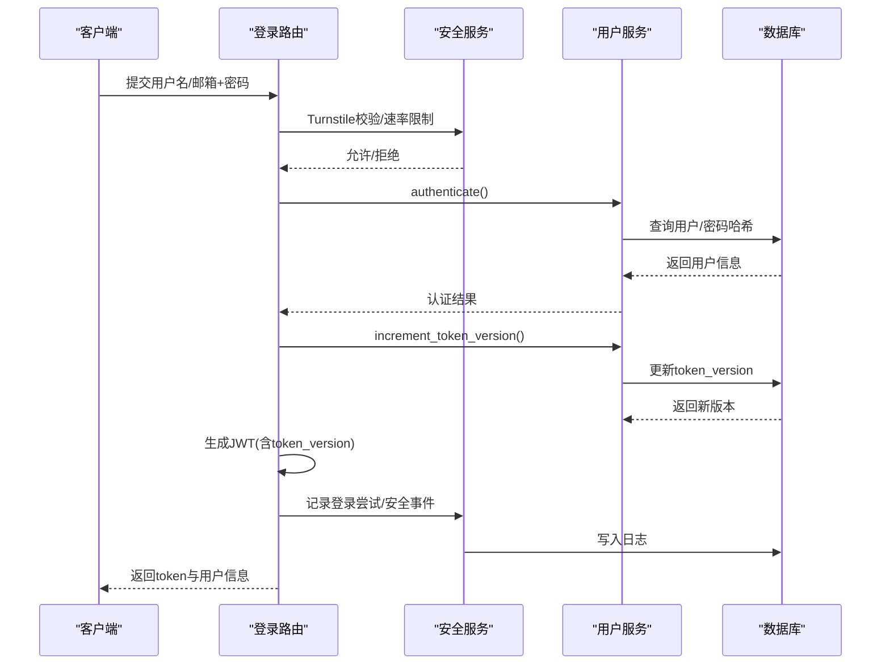
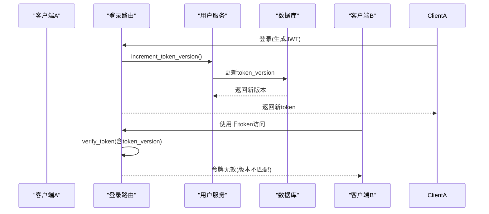
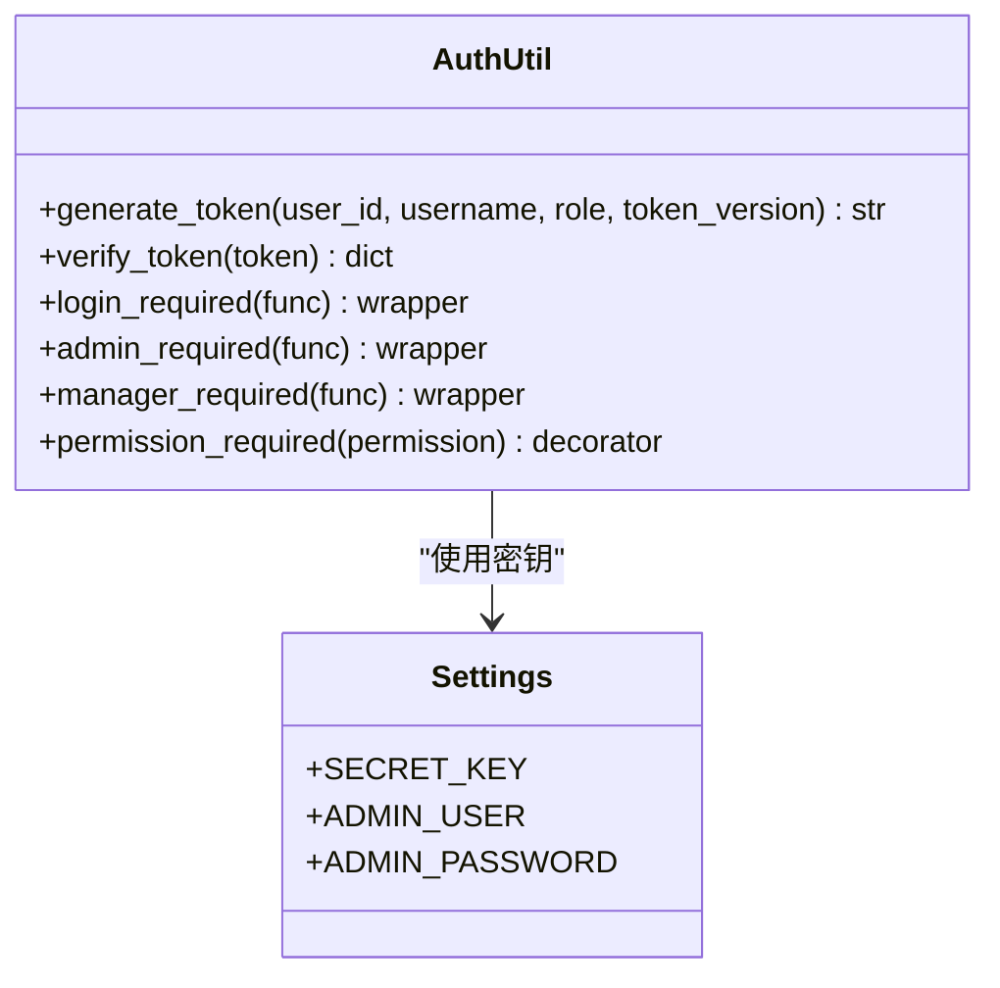
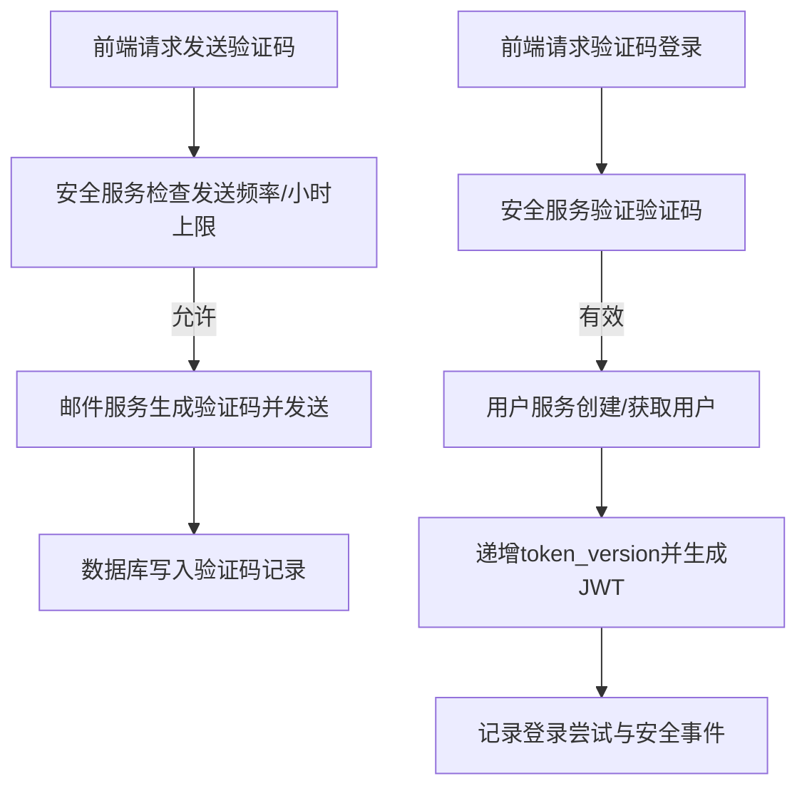
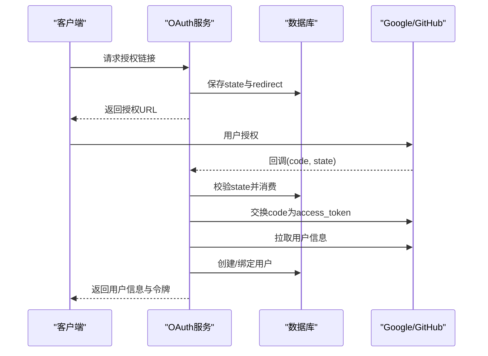
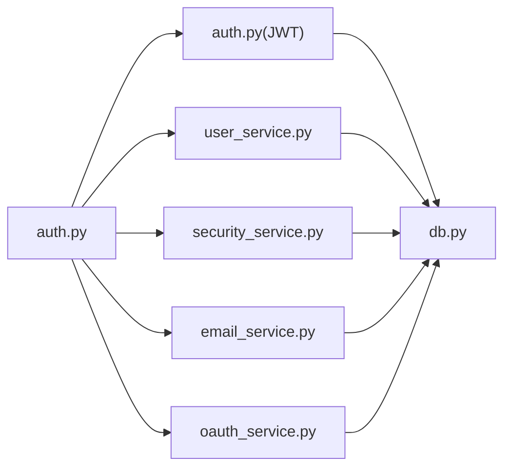

# 认证与会话管理

<cite>
**本文档引用的文件**
- [auth.py](file://backend_api_python/app/routes/auth.py)
- [auth_util.py](file://backend_api_python/app/utils/auth.py)
- [security_service.py](file://backend_api_python/app/services/security_service.py)
- [oauth_service.py](file://backend_api_python/app/services/oauth_service.py)
- [user_service.py](file://backend_api_python/app/services/user_service.py)
- [email_service.py](file://backend_api_python/app/services/email_service.py)
- [db.py](file://backend_api_python/app/utils/db.py)
- [settings.py](file://backend_api_python/app/config/settings.py)
- [init.sql](file://backend_api_python/migrations/init.sql)
</cite>

## 目录
1. [简介](#简介)
2. [项目结构](#项目结构)
3. [核心组件](#核心组件)
4. [架构总览](#架构总览)
5. [详细组件分析](#详细组件分析)
6. [依赖关系分析](#依赖关系分析)
7. [性能考量](#性能考量)
8. [故障排查指南](#故障排查指南)
9. [结论](#结论)

## 简介
本文件系统性阐述QuantDinger的认证与会话管理体系，覆盖以下关键主题：
- 密码哈希机制：优先采用bcrypt，回退至SHA256的安全策略与兼容性处理
- 用户认证流程：用户名/邮箱登录、验证码快速登录、OAuth第三方登录
- 令牌版本控制与单一设备登录：通过token_version实现“踢出其他设备”的单点登录
- 会话生命周期管理：JWT生成、校验、失效与清理
- 安全防护：速率限制、暴力破解防护、验证码防刷、Turnstile人机验证、安全审计日志
- 配置与扩展：环境变量驱动的配置、数据库模式、服务间协作

## 项目结构
认证相关代码主要分布在以下模块：
- 路由层：用户认证入口（登录、注册、验证码、OAuth）
- 工具层：JWT令牌生成与校验、IP/UA提取、数据库连接
- 服务层：安全防护（速率限制、暴力破解、审计日志）、OAuth集成、用户管理、邮件验证码
- 数据层：数据库模式定义（用户表、验证码表、登录尝试表、安全日志表、OAuth状态表）

**图表来源**
- [auth.py:156-324](file://backend_api_python/app/routes/auth.py#L156-L324)
- [auth_util.py:18-157](file://backend_api_python/app/utils/auth.py#L18-L157)
- [security_service.py:26-399](file://backend_api_python/app/services/security_service.py#L26-L399)
- [oauth_service.py:27-715](file://backend_api_python/app/services/oauth_service.py#L27-L715)
- [user_service.py:56-701](file://backend_api_python/app/services/user_service.py#L56-L701)
- [email_service.py:29-362](file://backend_api_python/app/services/email_service.py#L29-L362)
- [db.py:19-66](file://backend_api_python/app/utils/db.py#L19-L66)
- [init.sql:8-31](file://backend_api_python/migrations/init.sql#L8-L31)

**章节来源**
- [auth.py:1-1584](file://backend_api_python/app/routes/auth.py#L1-L1584)
- [auth_util.py:1-239](file://backend_api_python/app/utils/auth.py#L1-L239)
- [security_service.py:1-399](file://backend_api_python/app/services/security_service.py#L1-L399)
- [oauth_service.py:1-715](file://backend_api_python/app/services/oauth_service.py#L1-L715)
- [user_service.py:1-701](file://backend_api_python/app/services/user_service.py#L1-L701)
- [email_service.py:1-362](file://backend_api_python/app/services/email_service.py#L1-L362)
- [db.py:1-66](file://backend_api_python/app/utils/db.py#L1-L66)
- [init.sql:1-1026](file://backend_api_python/migrations/init.sql#L1-L1026)

## 核心组件
- JWT令牌生成与校验：支持HS256算法，携带token_version以实现单点登录
- 用户服务：密码哈希（bcrypt优先，SHA256回退）、用户认证、token_version递增
- 安全服务：Turnstile验证、登录尝试记录与阻断、验证码发送与验证、安全审计日志
- 邮件服务：验证码生成与发送、邮件格式化与SMTP发送
- OAuth服务：Google/GitHub授权链接生成、回调处理、OAuth状态持久化与CSRF保护
- 数据库模式：用户表、验证码表、登录尝试表、安全日志表、OAuth状态表

**章节来源**
- [auth_util.py:18-157](file://backend_api_python/app/utils/auth.py#L18-L157)
- [user_service.py:70-100](file://backend_api_python/app/services/user_service.py#L70-L100)
- [security_service.py:72-357](file://backend_api_python/app/services/security_service.py#L72-L357)
- [email_service.py:67-213](file://backend_api_python/app/services/email_service.py#L67-L213)
- [oauth_service.py:200-426](file://backend_api_python/app/services/oauth_service.py#L200-L426)
- [init.sql:8-31](file://backend_api_python/migrations/init.sql#L8-L31)

## 架构总览
认证与会话管理的整体流程如下：
- 客户端发起登录请求（用户名/邮箱+密码、验证码、或OAuth）
- 后端执行安全检查（Turnstile、速率限制、暴力破解防护）
- 执行认证（数据库用户或遗留单用户模式），必要时创建/更新用户
- 递增token_version以踢出旧会话，生成新JWT令牌
- 记录登录尝试与安全事件，返回用户信息与令牌

**图表来源**
- [auth.py:156-324](file://backend_api_python/app/routes/auth.py#L156-L324)
- [security_service.py:115-240](file://backend_api_python/app/services/security_service.py#L115-L240)
- [user_service.py:274-312](file://backend_api_python/app/services/user_service.py#L274-L312)
- [email_service.py:277-350](file://backend_api_python/app/services/email_service.py#L277-L350)
- [oauth_service.py:200-426](file://backend_api_python/app/services/oauth_service.py#L200-L426)
- [init.sql:8-31](file://backend_api_python/migrations/init.sql#L8-L31)

## 详细组件分析

### 密码哈希机制（bcrypt优先，SHA256回退）
- 优先策略：若安装bcrypt库，则使用bcrypt.gensalt与bcrypt.hashpw进行哈希
- 回退策略：未安装bcrypt时，使用SHA256加盐（格式为sha256$salt$hash）
- 验证逻辑：根据存储前缀判断哈希类型，分别调用bcrypt.checkpw或自定义SHA256比对
- 安全考虑：
  - bcrypt默认迭代轮数较高，抗暴力破解能力更强
  - SHA256回退仅在缺少bcrypt依赖时启用，提示安全性降低
  - 建议生产环境始终安装bcrypt依赖

**图表来源**
- [user_service.py:70-100](file://backend_api_python/app/services/user_service.py#L70-L100)

**章节来源**
- [user_service.py:19-100](file://backend_api_python/app/services/user_service.py#L19-L100)

### 用户认证流程与登录验证
- 登录入口：支持用户名/邮箱+密码登录；支持验证码快速登录；支持OAuth登录
- 安全前置：
  - Turnstile人机验证（可选）
  - 登录尝试记录与阻断（按IP与账户维度）
  - 速率限制（验证码发送频率与每小时上限）
- 认证步骤：
  - 多用户模式：查询用户并验证密码哈希
  - 遗留单用户模式：使用环境变量ADMIN_USER/ADMIN_PASSWORD
  - 验证通过后，递增token_version并生成JWT
- 成功后记录登录尝试、清除失败计数、写入安全日志

**图表来源**
- [auth.py:156-324](file://backend_api_python/app/routes/auth.py#L156-L324)
- [security_service.py:115-240](file://backend_api_python/app/services/security_service.py#L115-L240)
- [user_service.py:194-312](file://backend_api_python/app/services/user_service.py#L194-L312)

**章节来源**
- [auth.py:156-324](file://backend_api_python/app/routes/auth.py#L156-L324)
- [security_service.py:115-240](file://backend_api_python/app/services/security_service.py#L115-L240)
- [user_service.py:194-312](file://backend_api_python/app/services/user_service.py#L194-L312)

### 令牌版本控制与单一设备登录
- token_version字段：用户表新增token_version列，默认值为1
- 登录成功后递增token_version，旧令牌因版本不匹配而被拒绝
- JWT载荷包含token_version，验证时同时检查数据库中的当前版本
- 实现效果：同一账号在新设备登录时，旧设备令牌立即失效

**图表来源**
- [user_service.py:274-312](file://backend_api_python/app/services/user_service.py#L274-L312)
- [auth_util.py:82-113](file://backend_api_python/app/utils/auth.py#L82-L113)
- [init.sql:27-27](file://backend_api_python/migrations/init.sql#L27-L27)

**章节来源**
- [user_service.py:248-312](file://backend_api_python/app/services/user_service.py#L248-L312)
- [auth_util.py:82-113](file://backend_api_python/app/utils/auth.py#L82-L113)
- [init.sql:8-31](file://backend_api_python/migrations/init.sql#L8-L31)

### 会话生命周期管理
- 令牌生成：HS256算法，有效期7天，包含user_id、username、role、token_version
- 令牌校验：解码JWT并验证token_version一致性，过期则拒绝
- 中间件：login_required装饰器从Authorization头解析Bearer令牌并注入用户上下文
- 角色权限：基于角色映射的权限检查，支持admin/manager/user/viewer

**图表来源**
- [auth_util.py:18-217](file://backend_api_python/app/utils/auth.py#L18-L217)
- [settings.py:32-41](file://backend_api_python/app/config/settings.py#L32-L41)

**章节来源**
- [auth_util.py:18-217](file://backend_api_python/app/utils/auth.py#L18-L217)
- [settings.py:32-41](file://backend_api_python/app/config/settings.py#L32-L41)

### 密码强度验证
- 最低要求：长度≥8，包含至少一个大写字母、一个小写字母、一个数字
- 注册与密码变更时调用，失败直接拒绝请求
- 与验证码登录互补：验证码登录无需密码，适合快速访问场景

**章节来源**
- [security_service.py:331-356](file://backend_api_python/app/services/security_service.py#L331-L356)
- [auth.py:783-786](file://backend_api_python/app/routes/auth.py#L783-L786)

### 验证码登录与邮件服务
- 验证码生成：6位数字，有效期可配置，支持注册/登录/重置密码/修改密码/修改邮箱
- 验证码存储：数据库表qd_verification_codes，带过期时间、尝试次数、锁定机制
- 邮件发送：SMTP配置，HTML模板，支持TLS/SSL
- 登录流程：前端提交邮箱+验证码，后端验证通过后创建/获取用户并生成JWT

**图表来源**
- [auth.py:331-562](file://backend_api_python/app/routes/auth.py#L331-L562)
- [email_service.py:67-213](file://backend_api_python/app/services/email_service.py#L67-L213)
- [security_service.py:283-326](file://backend_api_python/app/services/security_service.py#L283-L326)
- [init.sql:117-128](file://backend_api_python/migrations/init.sql#L117-L128)

**章节来源**
- [auth.py:331-562](file://backend_api_python/app/routes/auth.py#L331-L562)
- [email_service.py:67-213](file://backend_api_python/app/services/email_service.py#L67-L213)
- [security_service.py:283-326](file://backend_api_python/app/services/security_service.py#L283-L326)
- [init.sql:117-128](file://backend_api_python/migrations/init.sql#L117-L128)

### OAuth集成（Google/GitHub）
- 授权链接生成：随机state参数，持久化到qd_oauth_states表，支持过期清理
- 回调处理：验证state有效性，交换授权码获取访问令牌，拉取用户信息
- 用户绑定：优先查找已有OAuth链接或同邮箱用户，否则创建新用户并绑定
- 安全保障：state跨worker/多实例共享，防止CSRF；回调时严格校验provider与过期时间

**图表来源**
- [oauth_service.py:200-426](file://backend_api_python/app/services/oauth_service.py#L200-L426)
- [init.sql:104-111](file://backend_api_python/migrations/init.sql#L104-L111)

**章节来源**
- [oauth_service.py:200-426](file://backend_api_python/app/services/oauth_service.py#L200-L426)
- [init.sql:104-111](file://backend_api_python/migrations/init.sql#L104-L111)

### 安全日志记录
- 登录/注册/重置密码/OAuth登录等关键事件均写入qd_security_logs
- 记录字段：user_id、action、ip_address、user_agent、details(JSON)
- 用于审计追踪、异常行为分析与合规要求

**章节来源**
- [security_service.py:246-277](file://backend_api_python/app/services/security_service.py#L246-L277)
- [init.sql:177-189](file://backend_api_python/migrations/init.sql#L177-L189)

## 依赖关系分析
- 组件耦合：
  - 路由层依赖工具层JWT与数据库连接，依赖服务层安全、用户、邮件、OAuth
  - 服务层相互协作：安全服务提供防护与审计，用户服务负责认证与token_version，邮件服务负责验证码，OAuth服务负责第三方登录
- 外部依赖：
  - bcrypt库（可选）：用于强密码哈希
  - Cloudflare Turnstile：人机验证
  - SMTP服务器：邮件发送
  - PostgreSQL：持久化用户、验证码、登录尝试、安全日志、OAuth状态

**图表来源**
- [auth.py:1-1584](file://backend_api_python/app/routes/auth.py#L1-L1584)
- [auth_util.py:1-239](file://backend_api_python/app/utils/auth.py#L1-L239)
- [security_service.py:1-399](file://backend_api_python/app/services/security_service.py#L1-L399)
- [user_service.py:1-701](file://backend_api_python/app/services/user_service.py#L1-L701)
- [email_service.py:1-362](file://backend_api_python/app/services/email_service.py#L1-L362)
- [oauth_service.py:1-715](file://backend_api_python/app/services/oauth_service.py#L1-L715)
- [db.py:1-66](file://backend_api_python/app/utils/db.py#L1-L66)

**章节来源**
- [auth.py:1-1584](file://backend_api_python/app/routes/auth.py#L1-L1584)
- [auth_util.py:1-239](file://backend_api_python/app/utils/auth.py#L1-L239)
- [security_service.py:1-399](file://backend_api_python/app/services/security_service.py#L1-L399)
- [user_service.py:1-701](file://backend_api_python/app/services/user_service.py#L1-L701)
- [email_service.py:1-362](file://backend_api_python/app/services/email_service.py#L1-L362)
- [oauth_service.py:1-715](file://backend_api_python/app/services/oauth_service.py#L1-L715)
- [db.py:1-66](file://backend_api_python/app/utils/db.py#L1-L66)

## 性能考量
- bcrypt成本：bcrypt哈希计算开销高于SHA256，建议在高并发场景下：
  - 使用连接池与异步I/O
  - 合理设置bcrypt轮数（当前为12）
  - 缓存热点用户信息（谨慎使用）
- 数据库优化：
  - 为qd_users、qd_verification_codes、qd_login_attempts、qd_security_logs建立索引
  - 定期清理过期验证码与旧登录尝试
- 网络与外部服务：
  - Turnstile API超时与失败策略（当前为拒绝）
  - SMTP发送失败重试与降级策略

[本节为通用指导，不直接分析具体文件]

## 故障排查指南
- Turnstile失败：
  - 检查TURNSTILE_SITE_KEY/TURNSTILE_SECRET_KEY配置
  - 查看安全服务日志，确认API响应与错误码
- 登录被限流：
  - 检查SECURITY_IP_MAX_ATTEMPTS/SECURITY_ACCOUNT_MAX_ATTEMPTS与窗口时间
  - 查看qd_login_attempts表统计
- 验证码问题：
  - 检查SMTP配置与网络连通性
  - 查看qd_verification_codes表是否过期或被锁定
- OAuth状态无效：
  - 检查qd_oauth_states表是否过期或被清理
  - 确认FRONTEND_URL与OAUTH_ALLOWED_REDIRECTS配置

**章节来源**
- [security_service.py:72-110](file://backend_api_python/app/services/security_service.py#L72-L110)
- [email_service.py:218-276](file://backend_api_python/app/services/email_service.py#L218-L276)
- [oauth_service.py:125-143](file://backend_api_python/app/services/oauth_service.py#L125-L143)
- [init.sql:138-149](file://backend_api_python/migrations/init.sql#L138-L149)

## 结论
QuantDinger的认证与会话管理通过多层安全防护与严谨的数据模型设计，实现了：
- 强密码哈希与回退策略
- 单一设备登录的即时生效机制
- 完整的登录审计与风险控制
- 验证码与OAuth的灵活接入
建议在生产环境中：
- 始终启用bcrypt依赖
- 合理配置Turnstile与速率限制
- 定期清理历史日志与验证码
- 加强密钥与SMTP配置的安全性