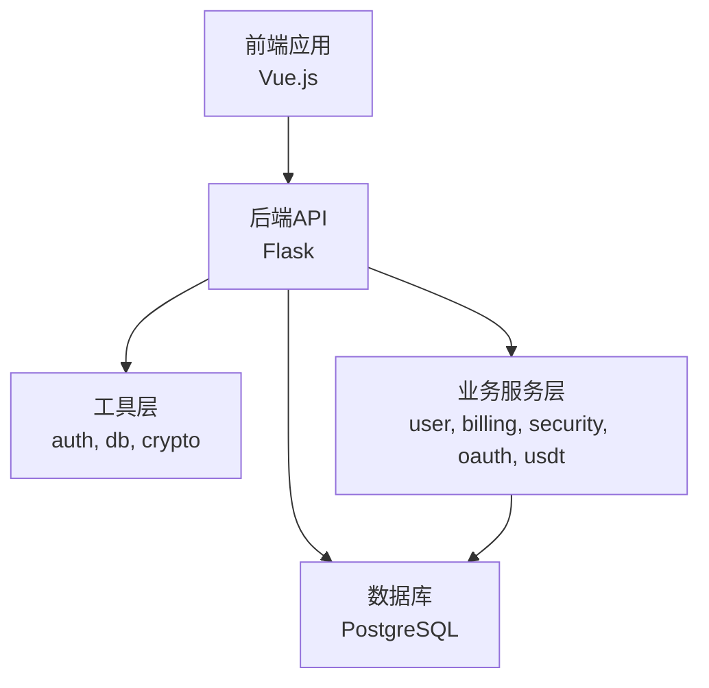
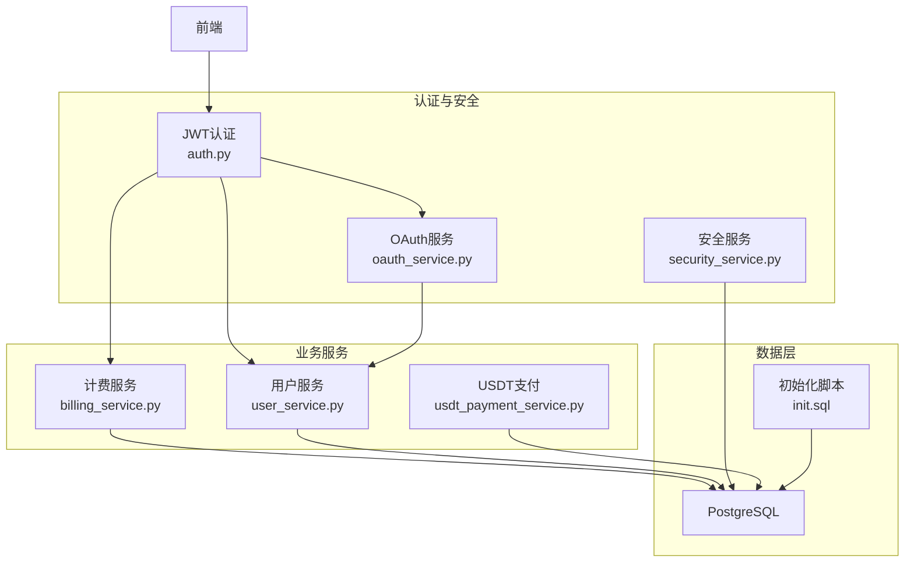
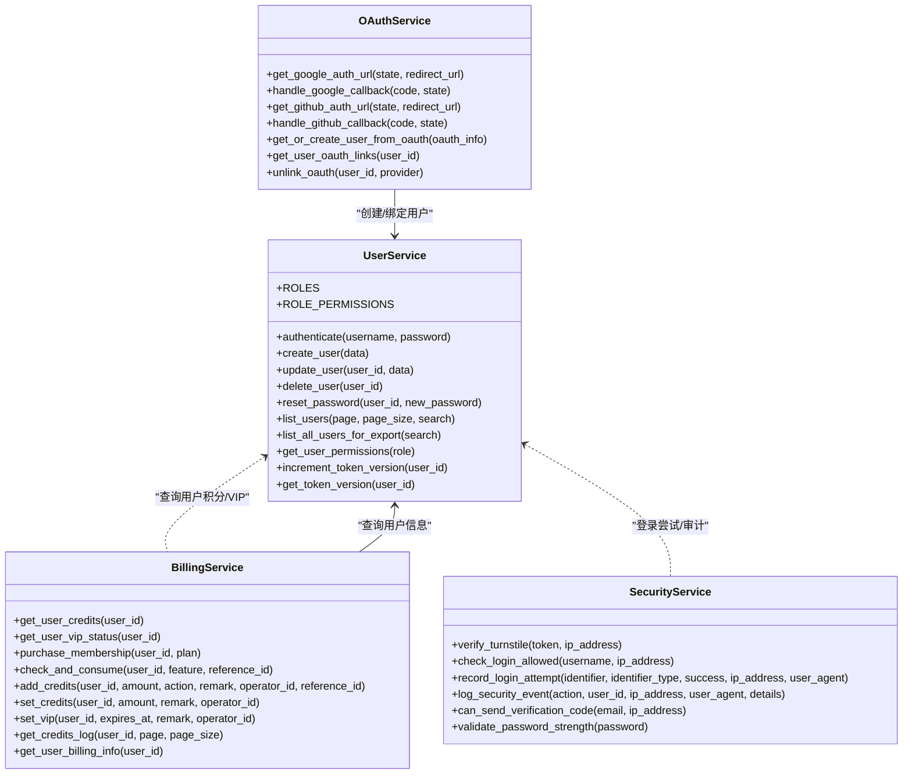
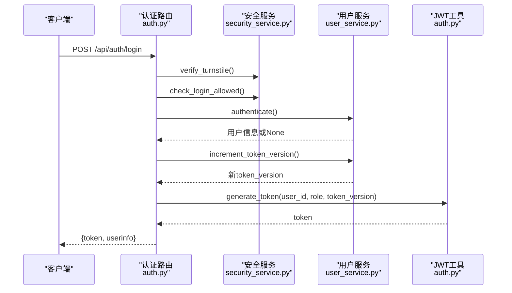
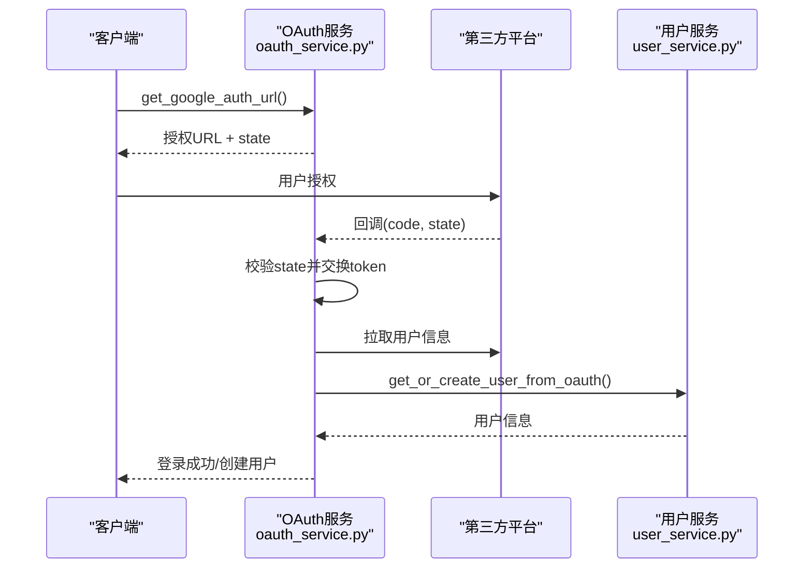
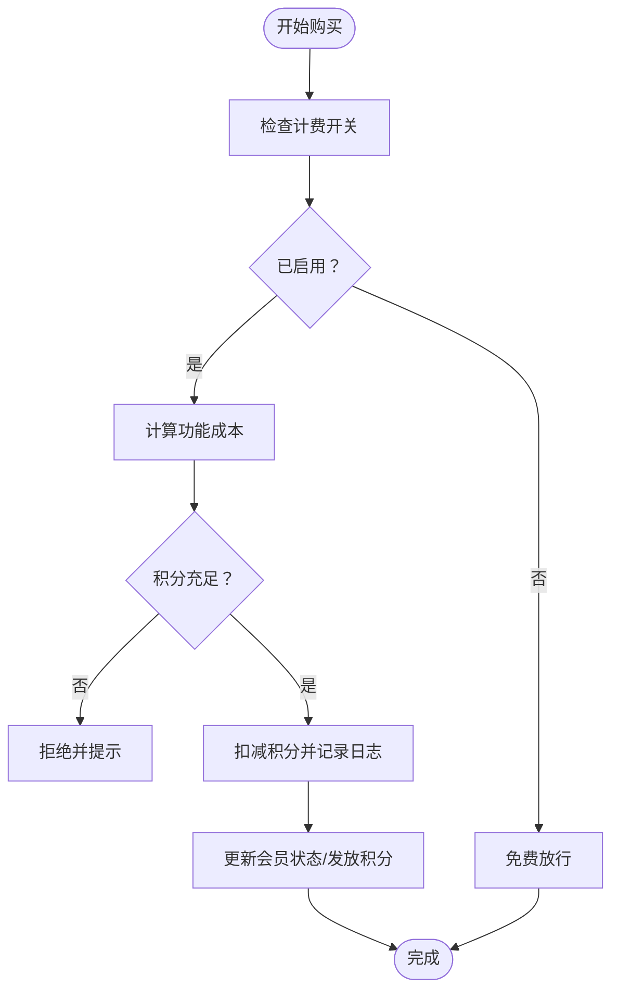
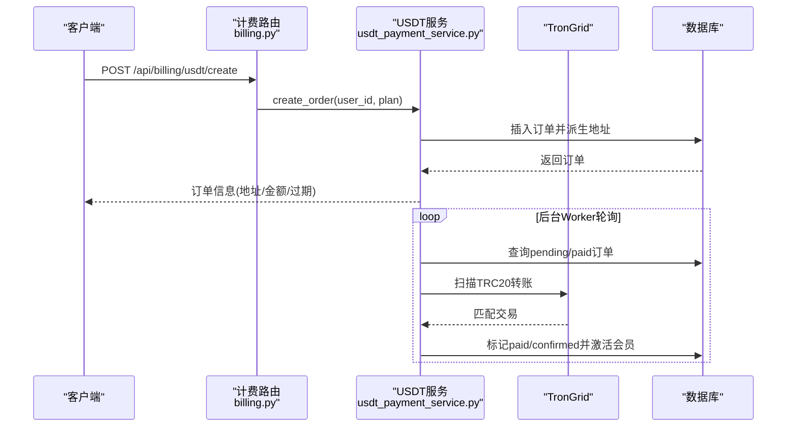
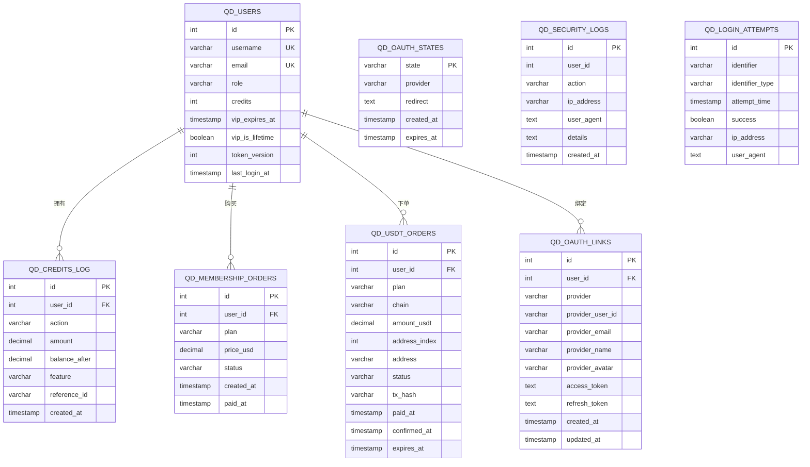
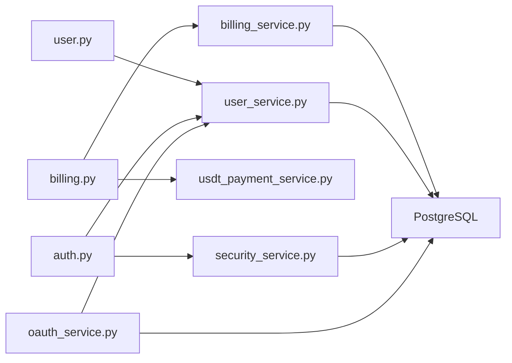

# 用户管理与商业化

<cite>
**本文引用的文件**
- [backend_api_python/app/routing/user.py](file://backend_api_python/app/routes/user.py)
- [backend_api_python/app/services/user_service.py](file://backend_api_python/app/services/user_service.py)
- [backend_api_python/app/routing/billing.py](file://backend_api_python/app/routes/billing.py)
- [backend_api_python/app/services/billing_service.py](file://backend_api_python/app/services/billing_service.py)
- [backend_api_python/app/routing/auth.py](file://backend_api_python/app/routes/auth.py)
- [backend_api_python/app/services/oauth_service.py](file://backend_api_python/app/services/oauth_service.py)
- [backend_api_python/app/utils/auth.py](file://backend_api_python/app/utils/auth.py)
- [backend_api_python/app/services/security_service.py](file://backend_api_python/app/services/security_service.py)
- [backend_api_python/app/services/usdt_payment_service.py](file://backend_api_python/app/services/usdt_payment_service.py)
- [backend_api_python/migrations/init.sql](file://backend_api_python/migrations/init.sql)
- [docs/multi-user-setup.md](file://docs/multi-user-setup.md)
</cite>

## 目录
1. [简介](#简介)
2. [项目结构](#项目结构)
3. [核心组件](#核心组件)
4. [架构总览](#架构总览)
5. [详细组件分析](#详细组件分析)
6. [依赖关系分析](#依赖关系分析)
7. [性能考量](#性能考量)
8. [故障排查指南](#故障排查指南)
9. [结论](#结论)
10. [附录](#附录)

## 简介
本文件面向QuantDinger的用户管理与商业化场景，系统性阐述多用户架构、OAuth集成、计费系统与管理面板的设计与实现。内容覆盖用户角色权限、会话管理、安全认证、数据隔离机制；会员制度设计、USDT支付集成、credits系统与admin控制台的实现细节；以及多用户部署、权限配置与商业运营的最佳实践。

## 项目结构
QuantDinger采用前后端分离架构，后端基于Flask提供REST API，数据库使用PostgreSQL，前端采用Vue.js。用户管理与商业化相关的核心模块集中在后端Python工程中，主要目录如下：
- app/routes：API路由层，包含用户管理、认证、计费、OAuth等接口
- app/services：业务服务层，封装用户、计费、安全、OAuth、USDT支付等核心逻辑
- app/utils：工具层，包含认证工具、数据库连接、加密等通用能力
- migrations：数据库初始化脚本，定义用户表、积分日志、会员订单、USDT订单等核心表结构
- docs：部署与多用户配置文档

**图示来源**
- [backend_api_python/app/routes/user.py:1-800](file://backend_api_python/app/routes/user.py#L1-L800)
- [backend_api_python/app/services/user_service.py:1-701](file://backend_api_python/app/services/user_service.py#L1-L701)
- [backend_api_python/migrations/init.sql:1-800](file://backend_api_python/migrations/init.sql#L1-L800)

**章节来源**
- [docs/multi-user-setup.md:1-214](file://docs/multi-user-setup.md#L1-L214)

## 核心组件
- 用户服务（UserService）：负责用户CRUD、密码哈希/校验、角色权限映射、登录态更新、token版本控制（单点登录）
- 计费服务（BillingService）：统一计费配置、积分余额查询、功能消费、会员购买、积分增减与日志
- 安全服务（SecurityService）：Turnstile验证、登录尝试记录、速率限制、暴力破解防护、安全审计日志
- OAuth服务（OAuthService）：Google/GitHub OAuth授权、CSRF状态持久化、第三方账号绑定与解绑
- USDT支付服务（UsdtPaymentService）：TRC20收款订单、地址派生、链上扫描、自动对账与后台Worker
- 认证工具（auth.py）：JWT生成/校验、装饰器（登录/管理员/权限）、单点登录强制下线

**章节来源**
- [backend_api_python/app/services/user_service.py:56-701](file://backend_api_python/app/services/user_service.py#L56-L701)
- [backend_api_python/app/services/billing_service.py:47-747](file://backend_api_python/app/services/billing_service.py#L47-L747)
- [backend_api_python/app/services/security_service.py:26-399](file://backend_api_python/app/services/security_service.py#L26-L399)
- [backend_api_python/app/services/oauth_service.py:27-715](file://backend_api_python/app/services/oauth_service.py#L27-L715)
- [backend_api_python/app/services/usdt_payment_service.py:23-820](file://backend_api_python/app/services/usdt_payment_service.py#L23-L820)
- [backend_api_python/app/utils/auth.py:18-239](file://backend_api_python/app/utils/auth.py#L18-L239)

## 架构总览
多用户系统以PostgreSQL为核心存储，后端通过Flask路由将请求分发至对应服务层，服务层完成业务逻辑与数据库交互。认证采用JWT，结合token版本实现单点登录；计费与会员体系通过环境变量配置灵活切换；OAuth支持第三方登录与账号绑定；USDT支付提供TRC20链上对账与后台Worker保障。

**图示来源**
- [backend_api_python/app/utils/auth.py:18-239](file://backend_api_python/app/utils/auth.py#L18-L239)
- [backend_api_python/app/services/security_service.py:26-399](file://backend_api_python/app/services/security_service.py#L26-L399)
- [backend_api_python/app/services/oauth_service.py:27-715](file://backend_api_python/app/services/oauth_service.py#L27-L715)
- [backend_api_python/app/services/user_service.py:56-701](file://backend_api_python/app/services/user_service.py#L56-L701)
- [backend_api_python/app/services/billing_service.py:47-747](file://backend_api_python/app/services/billing_service.py#L47-L747)
- [backend_api_python/app/services/usdt_payment_service.py:23-820](file://backend_api_python/app/services/usdt_payment_service.py#L23-L820)
- [backend_api_python/migrations/init.sql:1-800](file://backend_api_python/migrations/init.sql#L1-L800)

## 详细组件分析

### 用户管理与权限体系
- 角色与权限
  - 角色顺序：viewer < user < manager < admin
  - 权限映射：dashboard/view、indicator/backtest/strategy/portfolio/settings等
- 登录与会话
  - 成功登录后递增token版本，旧token失效，实现单点登录
  - JWT包含user_id、role、token_version，校验时对比数据库当前版本
- 用户CRUD与导出
  - 管理员可列表、详情、创建、更新、删除用户
  - 支持CSV导出用户信息，便于运营与审计

**图示来源**
- [backend_api_python/app/services/user_service.py:56-701](file://backend_api_python/app/services/user_service.py#L56-L701)
- [backend_api_python/app/services/billing_service.py:47-747](file://backend_api_python/app/services/billing_service.py#L47-L747)
- [backend_api_python/app/services/security_service.py:26-399](file://backend_api_python/app/services/security_service.py#L26-L399)
- [backend_api_python/app/services/oauth_service.py:27-715](file://backend_api_python/app/services/oauth_service.py#L27-L715)

**章节来源**
- [backend_api_python/app/services/user_service.py:56-701](file://backend_api_python/app/services/user_service.py#L56-L701)
- [backend_api_python/app/routes/user.py:41-800](file://backend_api_python/app/routes/user.py#L41-L800)
- [backend_api_python/app/utils/auth.py:18-239](file://backend_api_python/app/utils/auth.py#L18-L239)

### 认证与会话管理
- JWT生成与校验
  - 生成：包含exp、iat、sub、user_id、role、token_version
  - 校验：验证签名与过期，同时检查token_version与数据库一致
- 单点登录
  - 登录成功后递增token_version，旧token即刻失效
  - 装饰器login_required/admin_required/permission_required确保访问控制
- 安全增强
  - Turnstile人机验证
  - 登录尝试记录与速率限制（IP/账户维度）
  - 密码强度校验与验证码发送限制

**图示来源**
- [backend_api_python/app/routes/auth.py:156-325](file://backend_api_python/app/routes/auth.py#L156-L325)
- [backend_api_python/app/services/security_service.py:72-241](file://backend_api_python/app/services/security_service.py#L72-L241)
- [backend_api_python/app/services/user_service.py:248-313](file://backend_api_python/app/services/user_service.py#L248-L313)
- [backend_api_python/app/utils/auth.py:18-80](file://backend_api_python/app/utils/auth.py#L18-L80)

**章节来源**
- [backend_api_python/app/routes/auth.py:156-325](file://backend_api_python/app/routes/auth.py#L156-L325)
- [backend_api_python/app/utils/auth.py:18-239](file://backend_api_python/app/utils/auth.py#L18-L239)
- [backend_api_python/app/services/security_service.py:72-241](file://backend_api_python/app/services/security_service.py#L72-L241)

### OAuth集成（Google/GitHub）
- 授权流程
  - 生成state并持久化（跨worker/实例共享），重定向到第三方授权页
  - 回调时校验state有效性，交换access_token并获取用户信息
  - 将第三方账号与系统用户绑定（邮箱匹配或首次注册创建）
- 安全与兼容
  - state过期清理，防止CSRF
  - 支持邮箱隐私场景，回退到邮箱列表解析
  - 允许用户解绑第三方账号（需保留至少一种登录方式）

**图示来源**
- [backend_api_python/app/services/oauth_service.py:200-427](file://backend_api_python/app/services/oauth_service.py#L200-L427)
- [backend_api_python/app/services/user_service.py:314-410](file://backend_api_python/app/services/user_service.py#L314-L410)

**章节来源**
- [backend_api_python/app/services/oauth_service.py:27-715](file://backend_api_python/app/services/oauth_service.py#L27-L715)

### 计费系统与会员制度
- 计费配置
  - 通过环境变量控制全局开关与各功能单价
  - 支持按功能积分消费，不满足条件时拒绝执行
- 会员购买
  - 支持月卡、年卡、终身卡三种套餐
  - 购买后更新VIP到期时间、发放积分、记录日志
- 积分体系
  - 增加/调整/消费/日志查询
  - 管理员可直接设置积分，记录差异与备注
- 生命周期管理
  - 终身会员按月发放积分，后台Worker周期对账确认

**图示来源**
- [backend_api_python/app/services/billing_service.py:450-515](file://backend_api_python/app/services/billing_service.py#L450-L515)
- [backend_api_python/app/services/billing_service.py:202-335](file://backend_api_python/app/services/billing_service.py#L202-L335)

**章节来源**
- [backend_api_python/app/routes/billing.py:21-122](file://backend_api_python/app/routes/billing.py#L21-L122)
- [backend_api_python/app/services/billing_service.py:47-747](file://backend_api_python/app/services/billing_service.py#L47-L747)

### USDT支付集成（TRC20）
- 订单创建
  - 为每个订单派生独立TRC20地址，记录计划、金额、过期时间
- 链上对账
  - 定时扫描TronGrid交易，匹配收款金额与时间窗口
  - 达到确认延迟后标记paid/confirmed并激活会员
- 后台Worker
  - 循环扫描pending/paid订单，异步刷新状态，避免阻塞数据库连接

**图示来源**
- [backend_api_python/app/routes/billing.py:129-242](file://backend_api_python/app/routes/billing.py#L129-L242)
- [backend_api_python/app/services/usdt_payment_service.py:132-188](file://backend_api_python/app/services/usdt_payment_service.py#L132-L188)
- [backend_api_python/app/services/usdt_payment_service.py:538-600](file://backend_api_python/app/services/usdt_payment_service.py#L538-L600)

**章节来源**
- [backend_api_python/app/routes/billing.py:129-242](file://backend_api_python/app/routes/billing.py#L129-L242)
- [backend_api_python/app/services/usdt_payment_service.py:23-820](file://backend_api_python/app/services/usdt_payment_service.py#L23-L820)

### 数据模型与隔离
- 用户与会话
  - qd_users：用户名、邮箱、角色、状态、积分、VIP到期、时区、token_version等
  - qd_security_logs：安全事件审计
  - qd_login_attempts：登录尝试与封禁
- 计费与会员
  - qd_credits_log：积分变动明细
  - qd_membership_orders：会员订单
  - qd_usdt_orders：USDT收款订单
- 第三方登录
  - qd_oauth_states：OAuth状态表（跨实例共享）
  - qd_oauth_links：第三方账号绑定

**图示来源**
- [backend_api_python/migrations/init.sql:8-190](file://backend_api_python/migrations/init.sql#L8-L190)

**章节来源**
- [backend_api_python/migrations/init.sql:1-800](file://backend_api_python/migrations/init.sql#L1-L800)

## 依赖关系分析
- 路由到服务
  - user.py路由依赖user_service进行用户管理
  - billing.py路由依赖billing_service与usdt_payment_service
  - auth.py路由依赖security_service、user_service、email_service
- 服务到工具/数据库
  - user_service/billing_service依赖db连接与logger
  - security_service依赖db与外部API（Turnstile、TronGrid）
  - oauth_service依赖db与第三方HTTP接口
- 装饰器与中间件
  - auth.py装饰器依赖user_service获取权限与token版本校验

**图示来源**
- [backend_api_python/app/routes/user.py:1-800](file://backend_api_python/app/routes/user.py#L1-L800)
- [backend_api_python/app/routes/billing.py:1-243](file://backend_api_python/app/routes/billing.py#L1-L243)
- [backend_api_python/app/routes/auth.py:1-800](file://backend_api_python/app/routes/auth.py#L1-L800)
- [backend_api_python/app/services/user_service.py:1-701](file://backend_api_python/app/services/user_service.py#L1-L701)
- [backend_api_python/app/services/billing_service.py:1-747](file://backend_api_python/app/services/billing_service.py#L1-L747)
- [backend_api_python/app/services/security_service.py:1-399](file://backend_api_python/app/services/security_service.py#L1-L399)
- [backend_api_python/app/services/oauth_service.py:1-715](file://backend_api_python/app/services/oauth_service.py#L1-L715)
- [backend_api_python/app/services/usdt_payment_service.py:1-820](file://backend_api_python/app/services/usdt_payment_service.py#L1-L820)

**章节来源**
- [backend_api_python/app/routes/user.py:1-800](file://backend_api_python/app/routes/user.py#L1-L800)
- [backend_api_python/app/routes/billing.py:1-243](file://backend_api_python/app/routes/billing.py#L1-L243)
- [backend_api_python/app/routes/auth.py:1-800](file://backend_api_python/app/routes/auth.py#L1-L800)

## 性能考量
- 数据库连接池与事务
  - 保持短事务，避免长时间持有连接；USDT对账采用“短读txn + 外部HTTP + 短写txn”模式
- 缓存与索引
  - 为高频查询建立索引（用户ID、状态、时间戳等）
  - 计费配置带TTL缓存，降低频繁读取环境变量开销
- 并发与锁
  - OAuth state表只在进程内缓存DDL，避免Schema锁争用
  - USDT Worker轮询间隔可控，避免对TronGrid与数据库造成压力

[本节为通用指导，无需特定文件引用]

## 故障排查指南
- 登录失败
  - 检查Turnstile配置与网络连通
  - 查看登录尝试与封禁状态（ip/account维度）
  - 确认用户状态为active/pending
- JWT无效或过期
  - 核对SECRET_KEY一致性
  - 检查token_version是否被递增导致旧token失效
- OAuth回调失败
  - 校验state是否过期或跨实例丢失
  - 检查第三方回调参数与允许重定向域名
- USDT未到账
  - 确认订单状态与过期时间
  - 检查TronGrid访问密钥与合约地址
  - 启动/检查后台Worker日志

**章节来源**
- [backend_api_python/app/services/security_service.py:72-241](file://backend_api_python/app/services/security_service.py#L72-L241)
- [backend_api_python/app/utils/auth.py:50-114](file://backend_api_python/app/utils/auth.py#L50-L114)
- [backend_api_python/app/services/oauth_service.py:125-144](file://backend_api_python/app/services/oauth_service.py#L125-L144)
- [backend_api_python/app/services/usdt_payment_service.py:538-600](file://backend_api_python/app/services/usdt_payment_service.py#L538-L600)

## 结论
QuantDinger的用户管理与商业化体系以多用户架构为基础，通过JWT单点登录、严格的权限控制与安全服务，构建了稳定可靠的认证与授权框架。计费与会员系统以环境变量驱动，具备良好的灵活性与可扩展性；USDT支付集成提供TRC20链上对账与后台Worker保障，确保购买体验与数据一致性。配合完善的数据库模型与索引策略，系统在生产环境中具备良好的可维护性与可扩展性。

[本节为总结性内容，无需特定文件引用]

## 附录

### 多用户部署与最佳实践
- 部署建议
  - 使用Docker Compose一键启动PostgreSQL与后端API
  - 初始化数据库schema（init.sql），确保表结构与索引完备
  - 在.env中配置数据库连接、JWT密钥、第三方OAuth与USDT支付参数
- 权限配置
  - 初始管理员账户创建后立即修改默认密码
  - 严格区分admin/manager/user/viewer角色，最小权限原则
- 商业运营
  - 通过环境变量配置计费单价与会员价格，支持A/B测试
  - 开启Turnstile与登录速率限制，降低暴力破解风险
  - 定期备份数据库，监控USDT Worker运行状态

**章节来源**
- [docs/multi-user-setup.md:21-214](file://docs/multi-user-setup.md#L21-L214)
- [backend_api_python/migrations/init.sql:1-800](file://backend_api_python/migrations/init.sql#L1-L800)