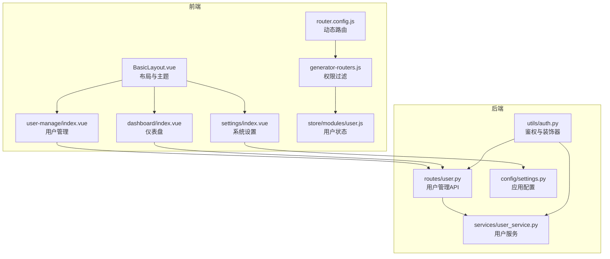
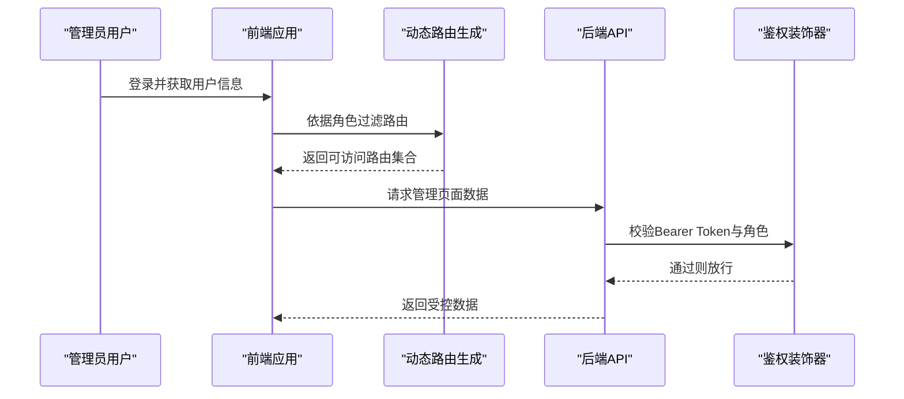
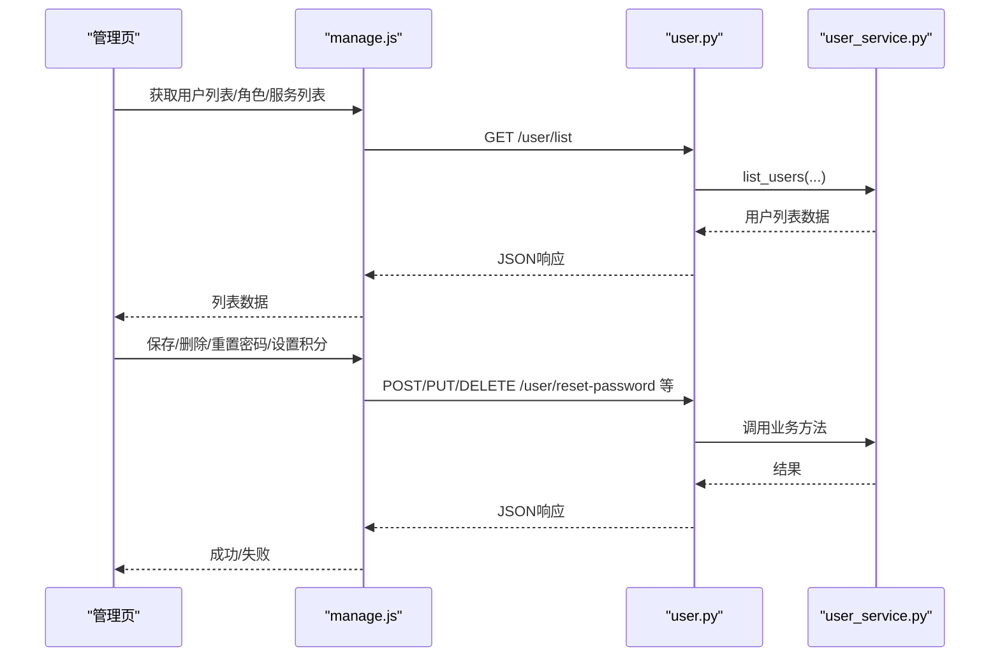
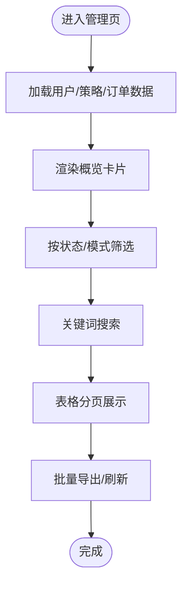
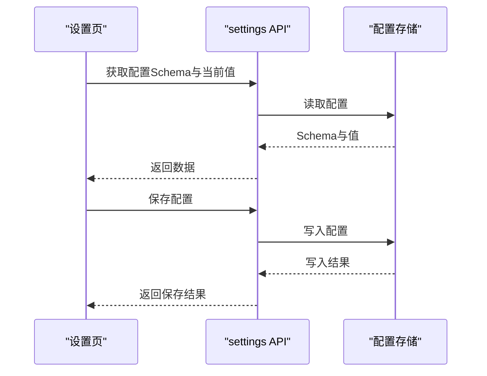
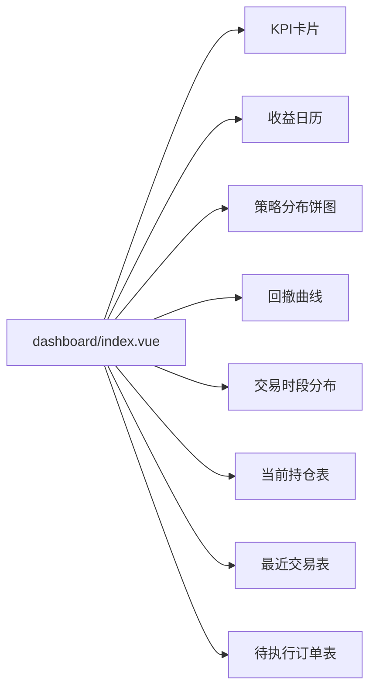
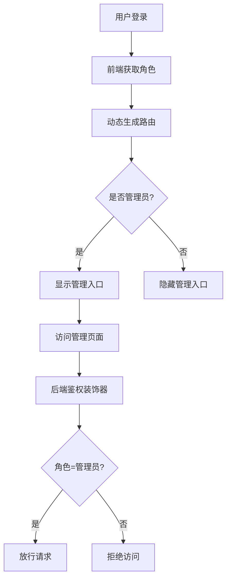
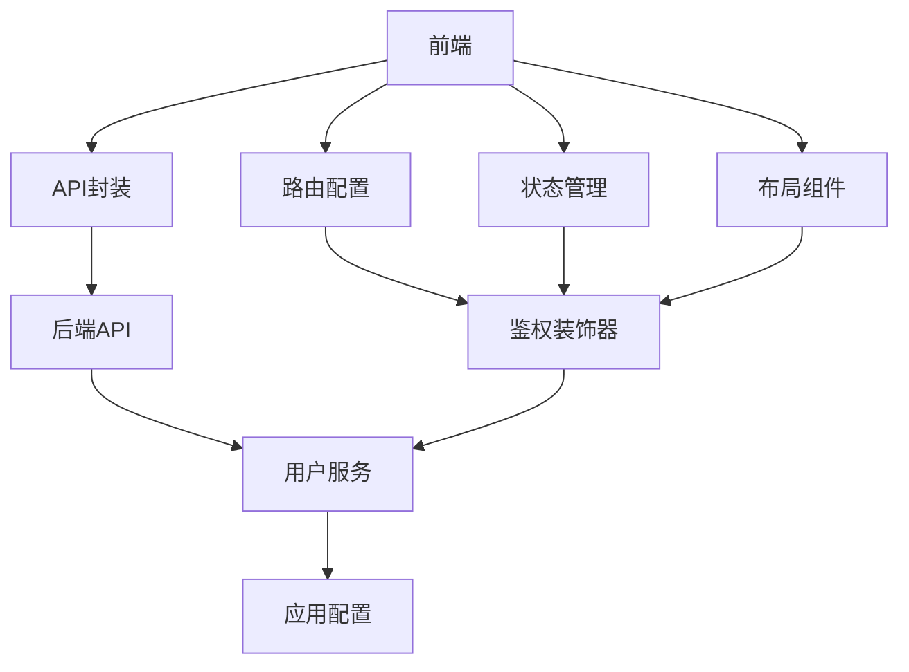

# 管理面板

<cite>
**本文档引用的文件**
- [frontend/src/views/user-manage/index.vue](file://frontend/src/views/user-manage/index.vue)
- [frontend/src/api/manage.js](file://frontend/src/api/manage.js)
- [backend_api_python/app/routes/user.py](file://backend_api_python/app/routes/user.py)
- [backend_api_python/app/services/user_service.py](file://backend_api_python/app/services/user_service.py)
- [frontend/src/layouts/BasicLayout.vue](file://frontend/src/layouts/BasicLayout.vue)
- [frontend/src/store/modules/user.js](file://frontend/src/store/modules/user.js)
- [backend_api_python/app/utils/auth.py](file://backend_api_python/app/utils/auth.py)
- [frontend/src/router/generator-routers.js](file://frontend/src/router/generator-routers.js)
- [frontend/src/mock/services/manage.js](file://frontend/src/mock/services/manage.js)
- [frontend/src/components/Charts/chart.less](file://frontend/src/components/Charts/chart.less)
- [frontend/src/views/settings/index.vue](file://frontend/src/views/settings/index.vue)
- [frontend/src/views/dashboard/index.vue](file://frontend/src/views/dashboard/index.vue)
- [backend_api_python/app/config/settings.py](file://backend_api_python/app/config/settings.py)
- [frontend/src/config/router.config.js](file://frontend/src/config/router.config.js)
</cite>

## 目录
1. [简介](#简介)
2. [项目结构](#项目结构)
3. [核心组件](#核心组件)
4. [架构总览](#架构总览)
5. [详细组件分析](#详细组件分析)
6. [依赖关系分析](#依赖关系分析)
7. [性能考虑](#性能考虑)
8. [故障排查指南](#故障排查指南)
9. [结论](#结论)
10. [附录](#附录)

## 简介
本文件面向QuantDinger管理面板的使用者与维护者，系统性阐述管理后台的界面设计、用户管理、系统监控与配置管理能力，以及前端Vue组件架构、后端API接口设计与权限控制机制。文档覆盖以下关键主题：
- 管理员界面设计与交互流程
- 用户列表管理、角色分配、积分与VIP管理
- 系统概览与订单、AI分析统计
- 系统设置与配置项管理
- 数据可视化与图表组件
- 权限控制与安全配置
- 性能优化与最佳实践

## 项目结构
管理面板采用前后端分离架构：
- 前端基于Vue 3 + Ant Design Vue，负责界面渲染、状态管理、路由守卫与权限过滤
- 后端基于Flask，提供REST风格API，包含用户管理、角色权限、系统配置等模块
- 管理面板主要页面包括：用户管理、系统概览、订单管理、AI分析统计、系统设置、仪表盘

**图表来源**
- [frontend/src/layouts/BasicLayout.vue:1-120](file://frontend/src/layouts/BasicLayout.vue#L1-L120)
- [frontend/src/views/user-manage/index.vue:1-120](file://frontend/src/views/user-manage/index.vue#L1-L120)
- [frontend/src/views/settings/index.vue:1-120](file://frontend/src/views/settings/index.vue#L1-L120)
- [frontend/src/views/dashboard/index.vue:1-120](file://frontend/src/views/dashboard/index.vue#L1-L120)
- [frontend/src/config/router.config.js:1-120](file://frontend/src/config/router.config.js#L1-L120)
- [frontend/src/router/generator-routers.js:1-86](file://frontend/src/router/generator-routers.js#L1-L86)
- [frontend/src/store/modules/user.js:1-120](file://frontend/src/store/modules/user.js#L1-L120)
- [backend_api_python/app/utils/auth.py:1-120](file://backend_api_python/app/utils/auth.py#L1-L120)
- [backend_api_python/app/routes/user.py:1-120](file://backend_api_python/app/routes/user.py#L1-L120)
- [backend_api_python/app/services/user_service.py:1-120](file://backend_api_python/app/services/user_service.py#L1-L120)
- [backend_api_python/app/config/settings.py:1-99](file://backend_api_python/app/config/settings.py#L1-L99)

**章节来源**
- [frontend/src/config/router.config.js:1-249](file://frontend/src/config/router.config.js#L1-L249)
- [frontend/src/router/generator-routers.js:1-86](file://frontend/src/router/generator-routers.js#L1-L86)
- [frontend/src/layouts/BasicLayout.vue:1-120](file://frontend/src/layouts/BasicLayout.vue#L1-L120)

## 核心组件
- 用户管理页：支持用户列表分页检索、创建/编辑/删除、重置密码、调整积分、设置VIP、导出用户等
- 系统概览页：展示策略总数、运行中数量、资金规模、总盈亏与ROI等关键指标
- 订单管理页：展示订单总量、已支付、待支付、收入统计等，并支持按状态筛选
- AI分析统计页：展示分析次数、活跃用户、分析过的标的、正确率等
- 系统设置页：集中管理各类配置项，支持分组、字段类型、默认值与说明
- 仪表盘页：汇总KPI、收益日历、策略分布、回撤曲线、交易时段分布、当前持仓与最近交易、待执行订单等

**章节来源**
- [frontend/src/views/user-manage/index.vue:1-200](file://frontend/src/views/user-manage/index.vue#L1-L200)
- [frontend/src/views/dashboard/index.vue:1-200](file://frontend/src/views/dashboard/index.vue#L1-L200)
- [frontend/src/views/settings/index.vue:1-200](file://frontend/src/views/settings/index.vue#L1-L200)

## 架构总览
管理面板的权限控制与路由生成遵循“前端路由权限过滤 + 后端接口鉴权”的双层保障：
- 前端：根据用户角色动态生成可访问路由，非管理员隐藏管理入口
- 后端：接口级装饰器校验令牌有效性与角色权限，管理员专用接口要求admin权限

**图表来源**
- [frontend/src/router/generator-routers.js:1-86](file://frontend/src/router/generator-routers.js#L1-L86)
- [backend_api_python/app/utils/auth.py:126-171](file://backend_api_python/app/utils/auth.py#L126-L171)
- [backend_api_python/app/routes/user.py:41-108](file://backend_api_python/app/routes/user.py#L41-L108)

**章节来源**
- [frontend/src/router/generator-routers.js:1-86](file://frontend/src/router/generator-routers.js#L1-L86)
- [backend_api_python/app/utils/auth.py:126-171](file://backend_api_python/app/utils/auth.py#L126-L171)
- [backend_api_python/app/routes/user.py:41-108](file://backend_api_python/app/routes/user.py#L41-L108)

## 详细组件分析

### 用户管理组件分析
用户管理页提供完整的用户生命周期管理能力，包含：
- 用户列表：分页、搜索、状态/角色/最后登录时间/注册IP/积分/VIP到期等列展示
- 操作按钮：编辑、调整积分、设置VIP、重置密码、删除
- 模态框：创建/编辑用户、重置密码、调整积分
- 导出：支持按关键词导出CSV

**图表来源**
- [frontend/src/views/user-manage/index.vue:1-200](file://frontend/src/views/user-manage/index.vue#L1-L200)
- [frontend/src/api/manage.js:1-71](file://frontend/src/api/manage.js#L1-L71)
- [backend_api_python/app/routes/user.py:41-193](file://backend_api_python/app/routes/user.py#L41-L193)
- [backend_api_python/app/services/user_service.py:523-596](file://backend_api_python/app/services/user_service.py#L523-L596)

**章节来源**
- [frontend/src/views/user-manage/index.vue:1-800](file://frontend/src/views/user-manage/index.vue#L1-L800)
- [frontend/src/api/manage.js:1-71](file://frontend/src/api/manage.js#L1-L71)
- [backend_api_python/app/routes/user.py:41-193](file://backend_api_python/app/routes/user.py#L41-L193)
- [backend_api_python/app/services/user_service.py:523-596](file://backend_api_python/app/services/user_service.py#L523-L596)

### 系统概览与订单统计
系统概览页聚合策略运行情况与资金状况，订单管理页提供订单维度的统计与筛选。

**图表来源**
- [frontend/src/views/user-manage/index.vue:135-496](file://frontend/src/views/user-manage/index.vue#L135-L496)

**章节来源**
- [frontend/src/views/user-manage/index.vue:135-496](file://frontend/src/views/user-manage/index.vue#L135-L496)

### 系统设置与配置管理
系统设置页支持按分组管理配置项，包含文本、密码、数字、布尔、下拉选择等多种字段类型，并提供“查询余额”等扩展能力。

**图表来源**
- [frontend/src/views/settings/index.vue:284-476](file://frontend/src/views/settings/index.vue#L284-L476)
- [backend_api_python/app/config/settings.py:1-99](file://backend_api_python/app/config/settings.py#L1-L99)

**章节来源**
- [frontend/src/views/settings/index.vue:1-800](file://frontend/src/views/settings/index.vue#L1-L800)
- [backend_api_python/app/config/settings.py:1-99](file://backend_api_python/app/config/settings.py#L1-L99)

### 仪表盘与数据可视化
仪表盘页整合KPI卡片、收益日历、策略分布、回撤曲线、交易时段分布、当前持仓与最近交易、待执行订单等，使用ECharts进行可视化渲染。

**图表来源**
- [frontend/src/views/dashboard/index.vue:1-200](file://frontend/src/views/dashboard/index.vue#L1-L200)
- [frontend/src/components/Charts/chart.less:1-14](file://frontend/src/components/Charts/chart.less#L1-L14)

**章节来源**
- [frontend/src/views/dashboard/index.vue:1-800](file://frontend/src/views/dashboard/index.vue#L1-L800)
- [frontend/src/components/Charts/chart.less:1-14](file://frontend/src/components/Charts/chart.less#L1-L14)

### 权限控制与路由生成
- 前端：根据用户角色过滤路由，管理员可见“用户管理”“系统设置”等入口
- 后端：接口装饰器校验令牌与角色，管理员接口要求admin权限

**图表来源**
- [frontend/src/router/generator-routers.js:13-67](file://frontend/src/router/generator-routers.js#L13-L67)
- [backend_api_python/app/utils/auth.py:126-171](file://backend_api_python/app/utils/auth.py#L126-L171)
- [frontend/src/config/router.config.js:132-152](file://frontend/src/config/router.config.js#L132-L152)

**章节来源**
- [frontend/src/router/generator-routers.js:1-86](file://frontend/src/router/generator-routers.js#L1-L86)
- [backend_api_python/app/utils/auth.py:126-171](file://backend_api_python/app/utils/auth.py#L126-L171)
- [frontend/src/config/router.config.js:132-152](file://frontend/src/config/router.config.js#L132-L152)

## 依赖关系分析
- 前端依赖
  - 路由配置与动态路由生成：router.config.js + generator-routers.js
  - 用户状态管理：store/modules/user.js
  - 布局与主题：layouts/BasicLayout.vue
  - API封装：api/manage.js、api/settings.js等
- 后端依赖
  - 鉴权工具：utils/auth.py
  - 用户管理API：routes/user.py
  - 用户服务：services/user_service.py
  - 应用配置：config/settings.py

**图表来源**
- [frontend/src/config/router.config.js:1-120](file://frontend/src/config/router.config.js#L1-L120)
- [frontend/src/router/generator-routers.js:1-86](file://frontend/src/router/generator-routers.js#L1-L86)
- [frontend/src/store/modules/user.js:1-120](file://frontend/src/store/modules/user.js#L1-L120)
- [frontend/src/layouts/BasicLayout.vue:1-120](file://frontend/src/layouts/BasicLayout.vue#L1-L120)
- [frontend/src/api/manage.js:1-71](file://frontend/src/api/manage.js#L1-L71)
- [backend_api_python/app/utils/auth.py:1-120](file://backend_api_python/app/utils/auth.py#L1-L120)
- [backend_api_python/app/routes/user.py:1-120](file://backend_api_python/app/routes/user.py#L1-L120)
- [backend_api_python/app/services/user_service.py:1-120](file://backend_api_python/app/services/user_service.py#L1-L120)
- [backend_api_python/app/config/settings.py:1-99](file://backend_api_python/app/config/settings.py#L1-L99)

**章节来源**
- [frontend/src/config/router.config.js:1-249](file://frontend/src/config/router.config.js#L1-L249)
- [frontend/src/router/generator-routers.js:1-86](file://frontend/src/router/generator-routers.js#L1-L86)
- [frontend/src/store/modules/user.js:1-120](file://frontend/src/store/modules/user.js#L1-L120)
- [frontend/src/layouts/BasicLayout.vue:1-120](file://frontend/src/layouts/BasicLayout.vue#L1-L120)
- [frontend/src/api/manage.js:1-71](file://frontend/src/api/manage.js#L1-L71)
- [backend_api_python/app/utils/auth.py:1-120](file://backend_api_python/app/utils/auth.py#L1-L120)
- [backend_api_python/app/routes/user.py:1-120](file://backend_api_python/app/routes/user.py#L1-L120)
- [backend_api_python/app/services/user_service.py:1-120](file://backend_api_python/app/services/user_service.py#L1-L120)
- [backend_api_python/app/config/settings.py:1-99](file://backend_api_python/app/config/settings.py#L1-L99)

## 性能考虑
- 前端
  - 表格分页与虚拟滚动：用户管理页对长列表启用横向滚动与分页，减少DOM压力
  - 图表懒加载：仪表盘图表在数据就绪后初始化，避免首屏阻塞
  - 缓存与本地存储：用户信息与令牌持久化，减少重复请求
- 后端
  - 分页参数校验与上限控制：用户列表接口对page_size进行范围限制，防止过大请求
  - 鉴权与权限检查：接口装饰器在进入业务逻辑前完成令牌与角色校验
  - 配置项读取：应用配置通过环境变量与附加配置加载，避免频繁IO

**章节来源**
- [frontend/src/views/user-manage/index.vue:44-53](file://frontend/src/views/user-manage/index.vue#L44-L53)
- [frontend/src/views/dashboard/index.vue:758-790](file://frontend/src/views/dashboard/index.vue#L758-L790)
- [backend_api_python/app/routes/user.py:94-98](file://backend_api_python/app/routes/user.py#L94-L98)
- [backend_api_python/app/utils/auth.py:126-171](file://backend_api_python/app/utils/auth.py#L126-L171)
- [backend_api_python/app/config/settings.py:66-90](file://backend_api_python/app/config/settings.py#L66-L90)

## 故障排查指南
- 登录与权限
  - 若无法访问管理入口，确认用户角色是否为管理员，前端路由是否正确过滤
  - 若接口返回401/403，检查Authorization头与令牌有效期，确认后端鉴权装饰器是否生效
- 用户管理
  - 创建/更新用户失败：检查用户名唯一性、密码长度、邮箱格式等约束
  - 删除用户失败：确认不是自我删除，后端有防自删保护
- 导出与数据
  - 导出CSV为空：确认搜索条件与数据范围，后端导出接口会按关键词筛选
- 设置保存
  - 保存后需重启服务：部分配置项修改后返回requires_restart，按提示执行重启命令

**章节来源**
- [frontend/src/router/generator-routers.js:46-67](file://frontend/src/router/generator-routers.js#L46-L67)
- [backend_api_python/app/utils/auth.py:126-171](file://backend_api_python/app/utils/auth.py#L126-L171)
- [backend_api_python/app/routes/user.py:257-310](file://backend_api_python/app/routes/user.py#L257-L310)
- [frontend/src/views/settings/index.vue:433-476](file://frontend/src/views/settings/index.vue#L433-L476)

## 结论
QuantDinger管理面板通过清晰的前后端职责划分与完善的权限控制，提供了从用户管理、系统监控到配置管理的一体化解决方案。前端采用模块化组件与可视化图表提升可维护性与用户体验，后端以装饰器与服务层实现安全可靠的接口能力。结合本文档的架构图、流程图与最佳实践，可快速上手并持续优化管理面板的功能与性能。

## 附录
- 管理面板UI组件使用要点
  - 用户管理：优先使用分页与搜索，批量导出CSV便于审计
  - 系统概览：关注策略运行与资金变动趋势，结合订单与AI统计综合判断
  - 系统设置：谨慎修改影响全局的配置项，保存后按提示重启服务
- 数据可视化实现
  - 仪表盘使用ECharts进行图表渲染，注意在组件销毁时释放实例
  - 图表样式通过Less进行主题化定制，支持明暗主题切换
- 安全配置与最佳实践
  - 强制管理员角色访问管理功能，接口层双重校验
  - 对敏感字段（如密码、密钥）采用密码输入框与默认隐藏
  - 合理设置速率限制与日志级别，保障系统稳定与可追踪性

**章节来源**
- [frontend/src/views/dashboard/index.vue:758-790](file://frontend/src/views/dashboard/index.vue#L758-L790)
- [frontend/src/components/Charts/chart.less:1-14](file://frontend/src/components/Charts/chart.less#L1-L14)
- [backend_api_python/app/config/settings.py:66-90](file://backend_api_python/app/config/settings.py#L66-L90)