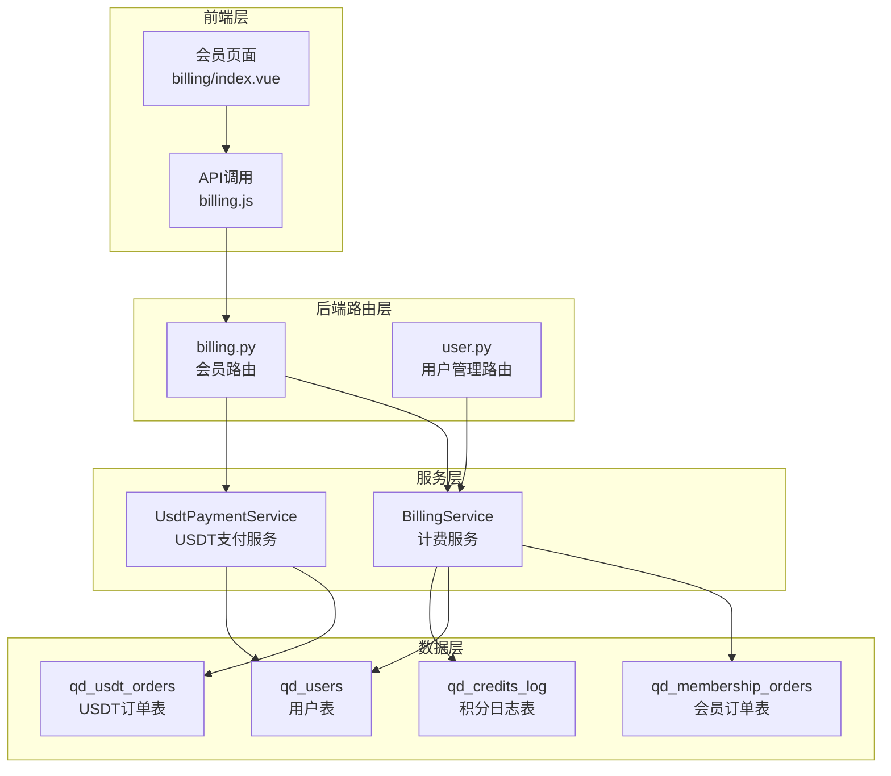
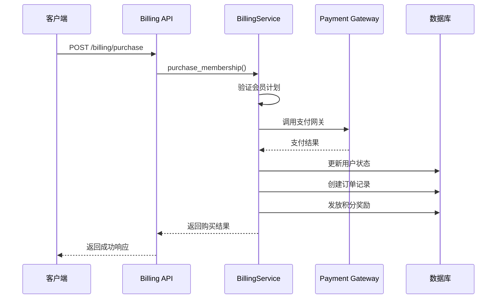
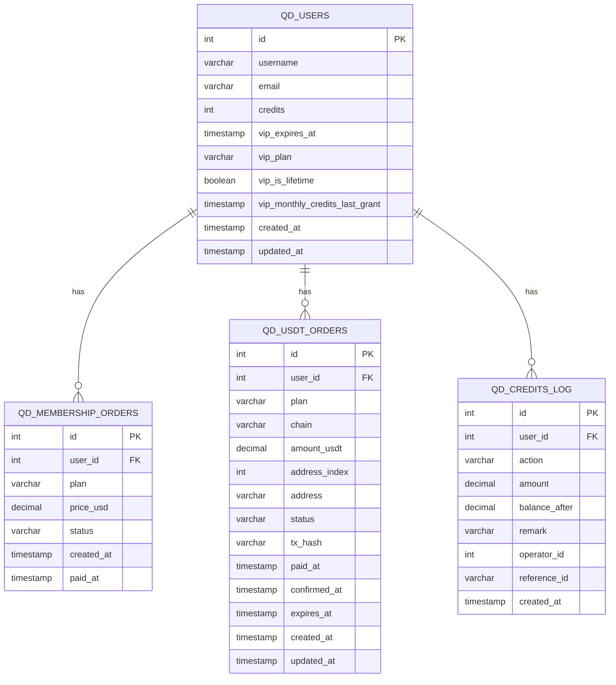
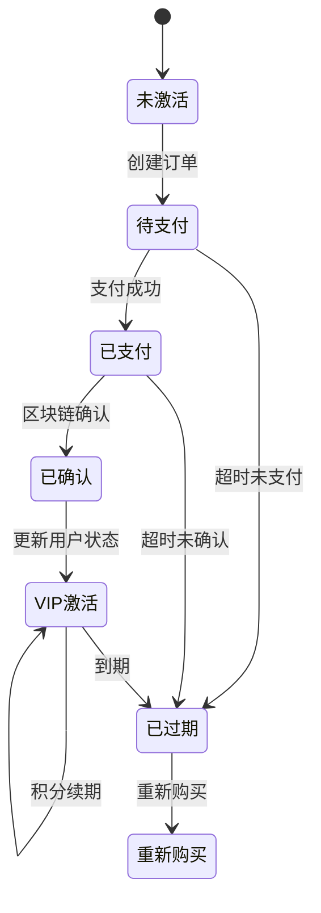
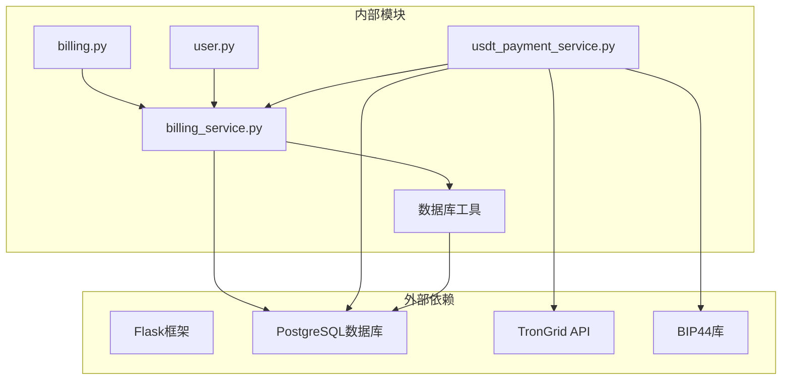
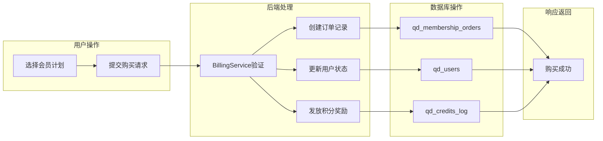

# 会员计划管理

<cite>
**本文档引用的文件**
- [billing.py](file://backend_api_python/app/routes/billing.py)
- [billing_service.py](file://backend_api_python/app/services/billing_service.py)
- [usdt_payment_service.py](file://backend_api_python/app/services/usdt_payment_service.py)
- [user.py](file://backend_api_python/app/routes/user.py)
- [init.sql](file://backend_api_python/migrations/init.sql)
- [index.vue](file://frontend/src/views/billing/index.vue)
- [settings.py](file://backend_api_python/app/routes/settings.py)
</cite>

## 目录
1. [简介](#简介)
2. [项目结构](#项目结构)
3. [核心组件](#核心组件)
4. [架构概览](#架构概览)
5. [详细组件分析](#详细组件分析)
6. [依赖关系分析](#依赖关系分析)
7. [性能考虑](#性能考虑)
8. [故障排除指南](#故障排除指南)
9. [结论](#结论)

## 简介

QuantDinger会员计划管理系统是一个完整的订阅制商业模式解决方案，支持月度、年度和终身三种会员计划。该系统实现了从配置管理到购买流程、从状态管理到权益分配的全流程自动化。

系统采用双通道支付架构：Mock支付通道用于快速验证业务流程，USDT支付通道提供真实的区块链支付体验。通过灵活的配置系统，管理员可以动态调整会员价格、积分奖励和有效期等参数。

## 项目结构



**图表来源**
- [billing.py:1-243](file://backend_api_python/app/routes/billing.py#L1-L243)
- [billing_service.py:1-747](file://backend_api_python/app/services/billing_service.py#L1-L747)
- [usdt_payment_service.py:1-820](file://backend_api_python/app/services/usdt_payment_service.py#L1-L820)

**章节来源**
- [billing.py:1-243](file://backend_api_python/app/routes/billing.py#L1-L243)
- [billing_service.py:1-747](file://backend_api_python/app/services/billing_service.py#L1-L747)

## 核心组件

### 会员计划配置系统

系统支持三种会员计划，所有配置都通过环境变量进行管理：

| 会员计划 | 价格(USD) | 首次积分奖励 | 有效期 | 终身会员特殊规则 |
|---------|-----------|-------------|--------|----------------|
| 月度会员 | 可配置 | 可配置(一次性) | 30天 | 不适用 |
| 年度会员 | 可配置 | 可配置(一次性) | 365天 | 不适用 |
| 终身会员 | 可配置 | 不适用 | 100年 | 每30天发放积分 |

### 支付网关集成点

系统设计了清晰的支付网关抽象层，支持多种支付方式：



**图表来源**
- [billing.py:65-122](file://backend_api_python/app/routes/billing.py#L65-L122)
- [billing_service.py:202-335](file://backend_api_python/app/services/billing_service.py#L202-L335)

**章节来源**
- [billing_service.py:160-200](file://backend_api_python/app/services/billing_service.py#L160-L200)
- [settings.py:746-788](file://backend_api_python/app/routes/settings.py#L746-L788)

## 架构概览

### 数据库架构设计



**图表来源**
- [init.sql:63-98](file://backend_api_python/migrations/init.sql#L63-L98)

### 状态管理机制

系统采用多维度的状态管理策略：



**图表来源**
- [billing_service.py:202-335](file://backend_api_python/app/services/billing_service.py#L202-L335)
- [usdt_payment_service.py:396-419](file://backend_api_python/app/services/usdt_payment_service.py#L396-L419)

**章节来源**
- [init.sql:63-98](file://backend_api_python/migrations/init.sql#L63-L98)
- [billing_service.py:117-156](file://backend_api_python/app/services/billing_service.py#L117-L156)

## 详细组件分析

### BillingService 会员管理核心

BillingService是会员计划管理的核心服务，负责以下关键功能：

#### 会员计划配置管理
- 从环境变量读取会员计划配置
- 支持动态配置更新
- 提供默认值回退机制

#### 购买流程控制
- 验证用户身份和权限
- 处理会员计划选择
- 管理购买状态转换
- 处理异常情况

#### 积分奖励系统
- 月度/年度会员：一次性积分奖励
- 终身会员：周期性积分发放
- 完整的审计日志记录

### USDT支付服务

USDT支付服务提供了完整的区块链支付解决方案：

#### 地址派生系统
- 支持BIP44标准的HD钱包派生
- 每单支付生成唯一地址
- 支持多种钱包导出格式

#### 区块链状态同步
- TronGrid API集成
- 自动对账和状态更新
- 异步后台工作线程

#### 安全保障机制
- 订单超时自动清理
- 重复支付检测
- 状态机严格约束

**章节来源**
- [billing_service.py:47-747](file://backend_api_python/app/services/billing_service.py#L47-L747)
- [usdt_payment_service.py:23-820](file://backend_api_python/app/services/usdt_payment_service.py#L23-L820)

### 前端交互界面

前端会员页面提供了直观的用户交互体验：

#### 会员计划展示
- 清晰的价格对比
- 积分奖励预览
- 购买按钮状态管理

#### 实时状态更新
- USDT支付流程可视化
- 订单状态实时刷新
- 支付确认进度指示

#### 用户体验优化
- 响应式设计适配
- 加载状态友好提示
- 错误信息清晰反馈

**章节来源**
- [index.vue:1-839](file://frontend/src/views/billing/index.vue#L1-L839)

## 依赖关系分析

### 组件间依赖关系



**图表来源**
- [billing.py:9-18](file://backend_api_python/app/routes/billing.py#L9-L18)
- [usdt_payment_service.py:7-18](file://backend_api_python/app/services/usdt_payment_service.py#L7-L18)

### 数据流分析



**图表来源**
- [billing_service.py:202-335](file://backend_api_python/app/services/billing_service.py#L202-L335)

**章节来源**
- [billing.py:21-122](file://backend_api_python/app/routes/billing.py#L21-L122)
- [billing_service.py:366-385](file://backend_api_python/app/services/billing_service.py#L366-L385)

## 性能考虑

### 数据库优化策略

1. **索引优化**
   - 会员订单表按用户ID建立索引
   - USDT订单表按状态建立索引
   - 积分日志表按用户ID和时间建立复合索引

2. **连接池管理**
   - 合理配置数据库连接池大小
   - 避免长事务持有连接
   - 使用短连接模式处理外部API调用

3. **查询优化**
   - 使用参数化查询防止SQL注入
   - 限制查询结果集大小
   - 缓存常用配置数据

### 缓存策略

1. **配置缓存**
   - BillingService配置缓存60秒
   - 减少环境变量读取开销
   - 支持配置热更新

2. **用户状态缓存**
   - VIP状态查询缓存
   - 积分余额缓存
   - 避免频繁数据库访问

### 异步处理

1. **后台工作线程**
   - USDT订单状态轮询
   - 区块链交易监控
   - 避免阻塞主线程

2. **异步API调用**
   - TronGrid API调用非阻塞
   - 网络超时合理设置
   - 错误重试机制

## 故障排除指南

### 常见问题诊断

#### 支付失败排查
1. **检查支付配置**
   ```bash
   # 验证USDT支付配置
   echo $USDT_PAY_ENABLED
   echo $USDT_TRC20_XPUB
   echo $TRONGRID_API_KEY
   ```

2. **查看日志信息**
   ```bash
   # 检查支付服务日志
   tail -f logs/app.log | grep "USDT"
   
   # 检查会员购买日志
   tail -f logs/app.log | grep "membership"
   ```

3. **验证数据库连接**
   ```sql
   -- 检查订单表结构
   \d qd_membership_orders
   
   -- 检查USDT订单表结构  
   \d qd_usdt_orders
   ```

#### 会员状态异常

1. **VIP状态检查**
   ```sql
   -- 查看用户VIP状态
   SELECT id, username, vip_expires_at, vip_plan, vip_is_lifetime 
   FROM qd_users 
   WHERE id = ?;
   ```

2. **积分余额核对**
   ```sql
   -- 查看积分变更历史
   SELECT * FROM qd_credits_log 
   WHERE user_id = ? 
   ORDER BY created_at DESC 
   LIMIT 50;
   ```

#### 性能问题诊断

1. **数据库性能监控**
   ```sql
   -- 检查慢查询
   SELECT query, calls, total_time, mean_time 
   FROM pg_stat_statements 
   ORDER BY total_time DESC 
   LIMIT 10;
   ```

2. **连接池状态检查**
   ```sql
   -- 查看数据库连接状态
   SELECT * FROM pg_stat_activity 
   WHERE state = 'active';
   ```

### 错误处理机制

系统实现了多层次的错误处理：

1. **API层错误处理**
   - 统一的错误响应格式
   - 详细的错误信息记录
   - 用户友好的错误提示

2. **服务层异常捕获**
   - 数据库操作异常处理
   - 外部API调用异常处理
   - 业务逻辑异常处理

3. **日志记录策略**
   - 结构化日志格式
   - 关键操作审计日志
   - 性能监控指标

**章节来源**
- [billing_service.py:332-335](file://backend_api_python/app/services/billing_service.py#L332-L335)
- [usdt_payment_service.py:780-799](file://backend_api_python/app/services/usdt_payment_service.py#L780-L799)

## 结论

QuantDinger会员计划管理系统展现了现代Web应用的优秀实践：

### 技术优势

1. **模块化设计**
   - 清晰的职责分离
   - 良好的接口抽象
   - 易于维护和扩展

2. **安全性考虑**
   - 多层身份验证
   - 数据库连接安全
   - 支付流程安全保障

3. **用户体验优化**
   - 直观的界面设计
   - 实时状态反馈
   - 多种支付方式支持

### 扩展性设计

系统具备良好的扩展基础：

1. **支付网关抽象**
   - 统一的支付接口定义
   - 易于集成新的支付方式
   - 支付流程可配置

2. **会员计划扩展**
   - 灵活的定价模型
   - 可配置的权益体系
   - 支持新的会员类型

3. **监控和运维**
   - 完善的日志系统
   - 性能监控指标
   - 故障自动恢复

### 未来发展建议

1. **增强支付能力**
   - 集成主流支付网关
   - 支持多种货币结算
   - 多币种汇率管理

2. **优化用户体验**
   - 移动端适配优化
   - 支付流程简化
   - 个性化推荐系统

3. **提升系统性能**
   - 分布式架构支持
   - 缓存策略优化
   - 数据库性能调优

该系统为QuantDinger平台的商业化运营奠定了坚实的技术基础，通过持续的优化和扩展，能够满足不断增长的业务需求。