# 支付处理系统

<cite>
**本文档引用的文件**
- [usdt_payment_service.py](file://backend_api_python/app/services/usdt_payment_service.py)
- [billing.py](file://backend_api_python/app/routes/billing.py)
- [billing_service.py](file://backend_api_python/app/services/billing_service.py)
- [settings.py](file://backend_api_python/app/routes/settings.py)
- [auth.py](file://backend_api_python/app/utils/auth.py)
- [db.py](file://backend_api_python/app/utils/db.py)
- [init.sql](file://backend_api_python/migrations/init.sql)
- [env.example](file://backend_api_python/env.example)
- [index.vue](file://frontend/src/views/billing/index.vue)
</cite>

## 目录
1. [简介](#简介)
2. [项目结构](#项目结构)
3. [核心组件](#核心组件)
4. [架构概览](#架构概览)
5. [详细组件分析](#详细组件分析)
6. [依赖关系分析](#依赖关系分析)
7. [性能考量](#性能考量)
8. [故障排除指南](#故障排除指南)
9. [结论](#结论)
10. [附录](#附录)

## 简介
QuantDinger USDT支付处理系统是一个基于TRON网络的去中心化支付解决方案，采用"每单独立地址+自动对账"的架构设计。该系统实现了完整的USDT-TRC20支付流程，包括订单创建、链上验证、状态跟踪和自动确认机制。

系统的核心特性包括：
- 基于HD钱包派生的每单独立收款地址
- 实时链上交易监控和自动对账
- 多层状态机管理（pending、paid、confirmed、expired）
- 异步后台工作线程处理批量对账
- 完善的错误处理和重试机制
- 安全的配置管理和环境隔离

## 项目结构
QuantDinger支付处理系统主要分布在以下模块中：

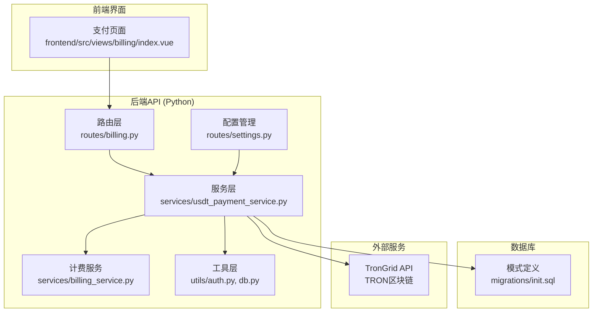

**图表来源**
- [billing.py:1-243](file://backend_api_python/app/routes/billing.py#L1-243)
- [usdt_payment_service.py:1-820](file://backend_api_python/app/services/usdt_payment_service.py#L1-820)
- [billing_service.py:1-747](file://backend_api_python/app/services/billing_service.py#L1-747)

**章节来源**
- [billing.py:1-243](file://backend_api_python/app/routes/billing.py#L1-243)
- [usdt_payment_service.py:1-820](file://backend_api_python/app/services/usdt_payment_service.py#L1-820)
- [billing_service.py:1-747](file://backend_api_python/app/services/billing_service.py#L1-747)

## 核心组件
系统由四个核心组件构成，每个组件都有明确的职责分工：

### 1. USDT支付服务 (UsdtPaymentService)
负责USDT支付的完整生命周期管理，包括订单创建、链上验证、状态更新和自动确认。

### 2. 计费服务 (BillingService)  
管理用户积分、会员状态和购买流程，与USDT支付服务协同工作。

### 3. 路由控制器 (Billing Routes)
提供RESTful API接口，处理前端请求和业务逻辑协调。

### 4. 后台工作线程 (UsdtOrderWorker)
异步处理批量订单对账，确保即使用户关闭浏览器也能完成支付确认。

**章节来源**
- [usdt_payment_service.py:23-820](file://backend_api_python/app/services/usdt_payment_service.py#L23-820)
- [billing_service.py:47-747](file://backend_api_python/app/services/billing_service.py#L47-747)
- [billing.py:129-242](file://backend_api_python/app/routes/billing.py#L129-242)

## 架构概览
系统采用分层架构设计，确保高可用性和可扩展性：

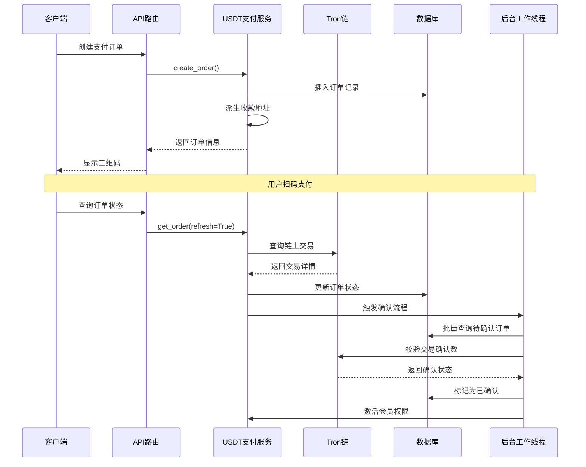

**图表来源**
- [billing.py:129-242](file://backend_api_python/app/routes/billing.py#L129-242)
- [usdt_payment_service.py:132-740](file://backend_api_python/app/services/usdt_payment_service.py#L132-740)

系统架构的关键特点：
- **异步处理**：后台工作线程独立处理批量对账，不影响主线程响应
- **幂等设计**：所有关键操作都具备幂等性，防止重复处理
- **状态隔离**：订单状态机确保状态转换的正确性和一致性
- **链上验证**：所有支付验证都基于区块链实际交易记录

## 详细组件分析

### USDT支付服务架构
UsdtPaymentService是整个支付系统的核心，负责处理所有USDT相关的业务逻辑。

#### 核心数据结构
系统使用qd_usdt_orders表存储所有USDT支付订单：

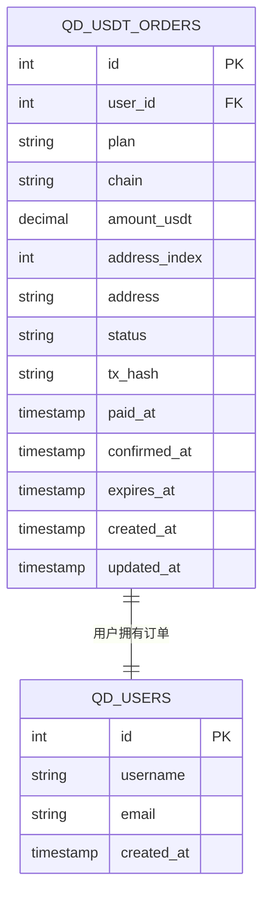

**图表来源**
- [init.sql:79-98](file://backend_api_python/migrations/init.sql#L79-98)

#### 订单状态机
系统实现了完整的订单状态管理机制：

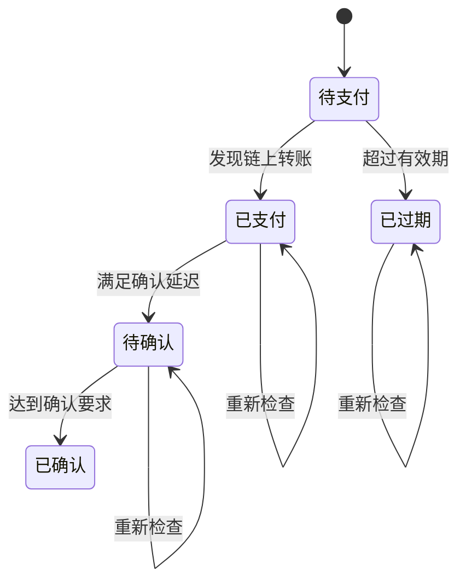

**图表来源**
- [usdt_payment_service.py:282-420](file://backend_api_python/app/services/usdt_payment_service.py#L282-420)

#### 地址派生机制
系统支持基于BIP44标准的HD钱包地址派生：

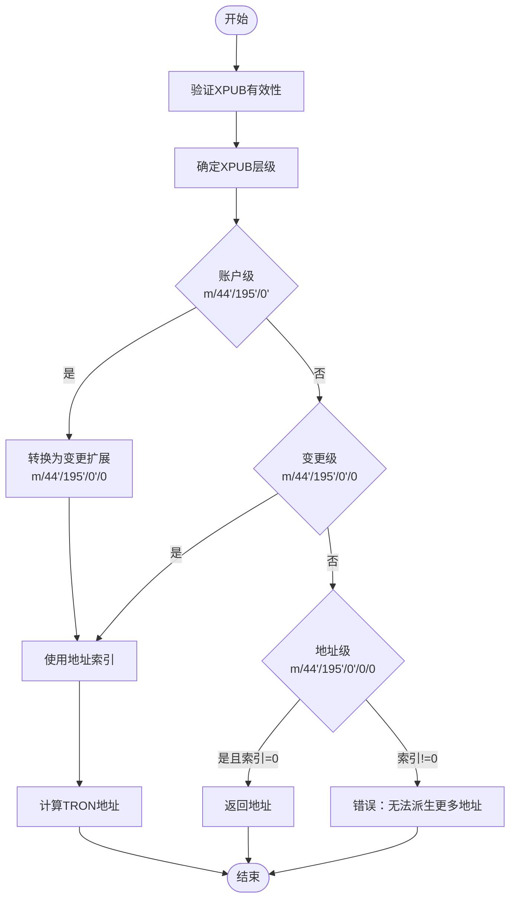

**图表来源**
- [usdt_payment_service.py:90-128](file://backend_api_python/app/services/usdt_payment_service.py#L90-128)

**章节来源**
- [usdt_payment_service.py:23-820](file://backend_api_python/app/services/usdt_payment_service.py#L23-820)
- [init.sql:79-98](file://backend_api_python/migrations/init.sql#L79-98)

### 计费服务集成
计费服务与USDT支付服务紧密集成，确保支付完成后能够正确激活会员权限。

#### 会员购买流程
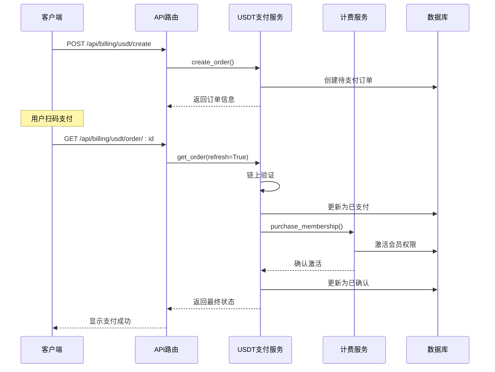

**图表来源**
- [billing.py:129-242](file://backend_api_python/app/routes/billing.py#L129-242)
- [usdt_payment_service.py:132-420](file://backend_api_python/app/services/usdt_payment_service.py#L132-420)
- [billing_service.py:202-334](file://backend_api_python/app/services/billing_service.py#L202-334)

**章节来源**
- [billing_service.py:202-334](file://backend_api_python/app/services/billing_service.py#L202-334)
- [billing.py:129-242](file://backend_api_python/app/routes/billing.py#L129-242)

### 后台工作线程
UsdtOrderWorker是系统的重要组成部分，负责异步处理批量订单对账。

#### 工作线程架构
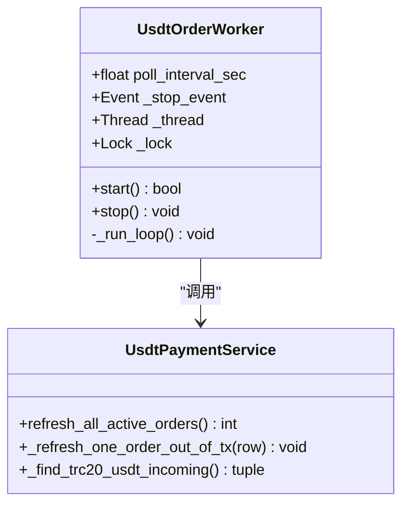

**图表来源**
- [usdt_payment_service.py:744-800](file://backend_api_python/app/services/usdt_payment_service.py#L744-800)

#### 批量处理流程
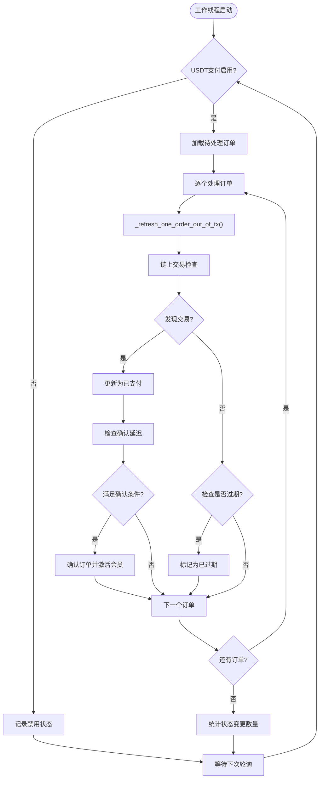

**图表来源**
- [usdt_payment_service.py:538-600](file://backend_api_python/app/services/usdt_payment_service.py#L538-600)

**章节来源**
- [usdt_payment_service.py:744-800](file://backend_api_python/app/services/usdt_payment_service.py#L744-800)
- [usdt_payment_service.py:538-600](file://backend_api_python/app/services/usdt_payment_service.py#L538-600)

### 接口安全与认证
系统实现了多层次的安全保护机制：

#### 认证流程
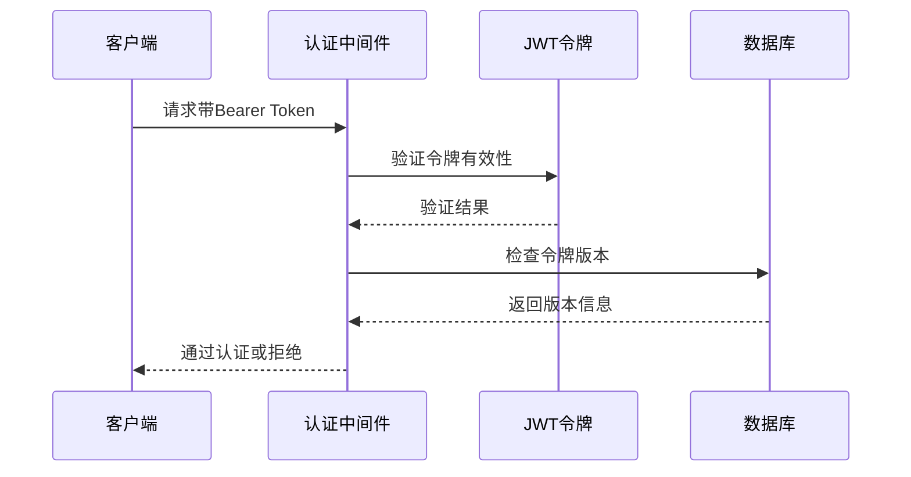

**图表来源**
- [auth.py:126-157](file://backend_api_python/app/utils/auth.py#L126-157)

#### 配置安全
系统通过环境变量管理敏感配置，支持多种安全模式：

| 配置项 | 类型 | 用途 | 安全级别 |
|--------|------|------|----------|
| USDT_TRC20_XPUB | 密钥 | 收款地址派生 | 高 |
| TRONGRID_API_KEY | 密钥 | 区块链查询 | 中 |
| SECRET_KEY | 密钥 | JWT签名 | 高 |
| SIGNAL_WEBHOOK_SIGNING_SECRET | 密钥 | Webhook签名 | 高 |

**章节来源**
- [auth.py:18-80](file://backend_api_python/app/utils/auth.py#L18-80)
- [env.example:153-162](file://backend_api_python/env.example#L153-162)

## 依赖关系分析

### 组件间依赖关系
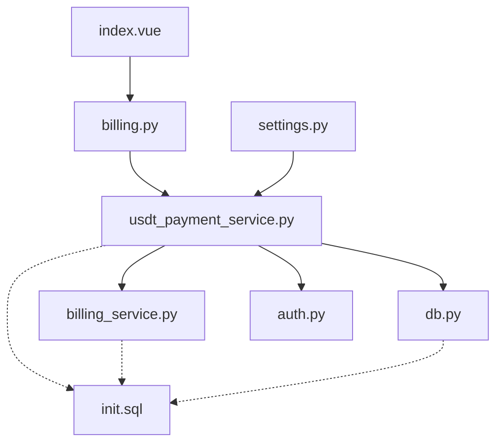

**图表来源**
- [billing.py:13-14](file://backend_api_python/app/routes/billing.py#L13-14)
- [usdt_payment_service.py:16-18](file://backend_api_python/app/services/usdt_payment_service.py#L16-18)

### 外部依赖
系统依赖以下外部服务：
- **TronGrid API**：TRON区块链数据查询
- **PostgreSQL**：订单数据持久化存储
- **JWT服务**：用户身份认证和授权

**章节来源**
- [usdt_payment_service.py:33-46](file://backend_api_python/app/services/usdt_payment_service.py#L33-46)
- [db.py:19-25](file://backend_api_python/app/utils/db.py#L19-25)

## 性能考量
系统在设计时充分考虑了性能优化：

### 数据库优化
- **连接池管理**：使用PostgreSQL连接池避免连接开销
- **索引优化**：为常用查询字段建立索引
- **事务分离**：将链上查询与数据库操作分离

### 缓存策略
- **配置缓存**：计费配置缓存60秒
- **Schema确保**：类级缓存避免重复DDL操作
- **连接复用**：数据库连接池复用

### 并发处理
- **异步工作线程**：后台处理批量对账
- **非阻塞I/O**：链上查询使用异步方式
- **限流控制**：TronGrid API请求限流

## 故障排除指南

### 常见问题诊断
1. **支付未到账**
   - 检查TronGrid API连接状态
   - 验证收款地址是否正确派生
   - 确认交易确认数是否满足要求

2. **订单状态异常**
   - 查看数据库订单状态更新日志
   - 检查后台工作线程运行状态
   - 验证JWT认证是否正常

3. **系统性能问题**
   - 监控数据库连接池使用情况
   - 检查PostgreSQL慢查询日志
   - 分析链上API调用延迟

### 错误处理机制
系统实现了完善的错误处理策略：

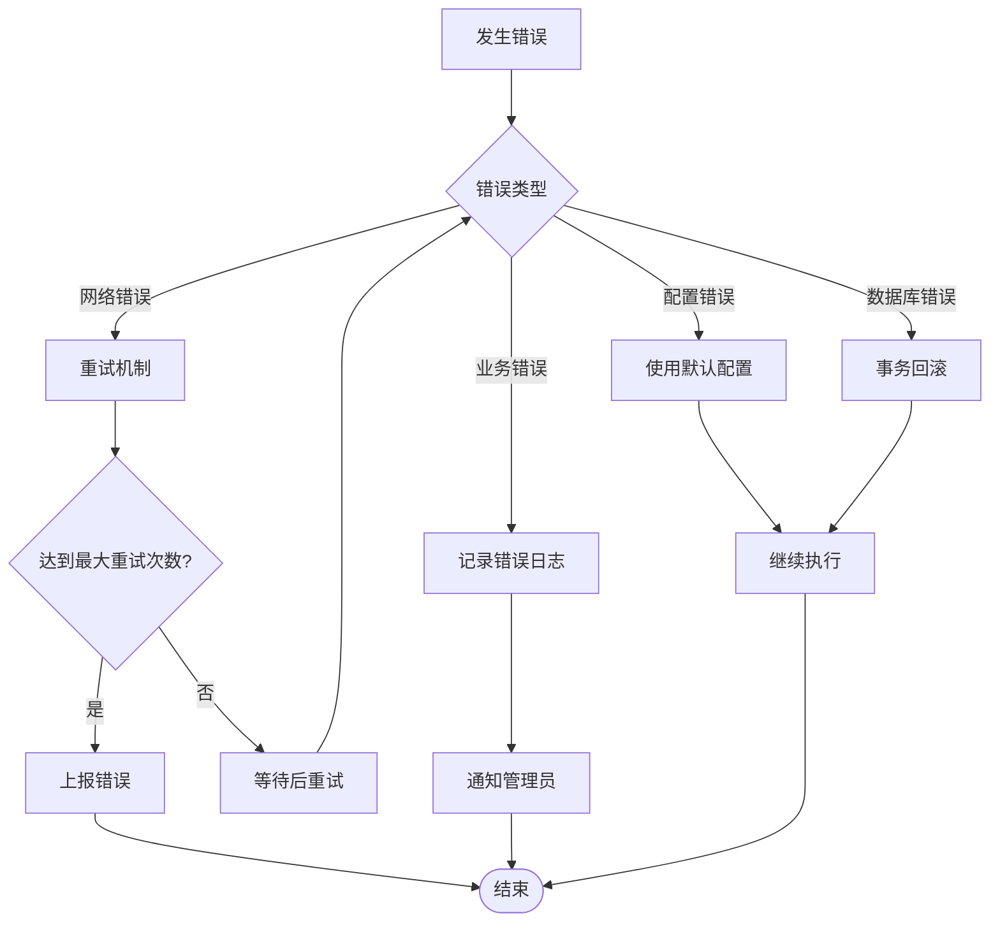

**章节来源**
- [usdt_payment_service.py:282-420](file://backend_api_python/app/services/usdt_payment_service.py#L282-420)
- [usdt_payment_service.py:538-600](file://backend_api_python/app/services/usdt_payment_service.py#L538-600)

## 结论
QuantDinger USDT支付处理系统是一个设计精良的去中心化支付解决方案。系统通过以下关键特性确保了高可靠性：

1. **架构完整性**：分层设计确保了模块间的清晰职责分离
2. **状态管理**：完善的状态机保证了订单处理的一致性
3. **异步处理**：后台工作线程提高了系统的响应性能
4. **安全保障**：多层次的安全机制保护了用户资金安全
5. **可扩展性**：模块化设计便于未来功能扩展

该系统为QuantDinger平台提供了可靠的USDT支付基础设施，支持未来的业务增长和技术演进。

## 附录

### 配置选项详解
系统支持丰富的配置选项，可通过.env文件进行定制：

| 配置项 | 默认值 | 描述 |
|--------|--------|------|
| USDT_PAY_ENABLED | false | 启用USDT支付功能 |
| USDT_PAY_CHAIN | TRC20 | 支付链类型 |
| USDT_TRC20_XPUB | 空 | watch-only xpub密钥 |
| TRONGRID_BASE_URL | https://api.trongrid.io | TronGrid API基础URL |
| USDT_PAY_CONFIRM_SECONDS | 30 | 确认延迟时间（秒） |
| USDT_PAY_EXPIRE_MINUTES | 30 | 订单过期时间（分钟） |
| USDT_WORKER_POLL_INTERVAL | 30 | 后台工作线程轮询间隔 |

### API接口规范
系统提供RESTful API接口，支持完整的支付流程：

- `POST /api/billing/usdt/create` - 创建USDT支付订单
- `GET /api/billing/usdt/order/<order_id>` - 查询支付订单状态
- `GET /api/billing/plans` - 获取会员套餐配置

**章节来源**
- [env.example:153-162](file://backend_api_python/env.example#L153-162)
- [billing.py:129-242](file://backend_api_python/app/routes/billing.py#L129-242)