# 积分管理系统

<cite>
**本文档引用的文件**
- [billing_service.py](file://backend_api_python/app/services/billing_service.py)
- [billing.py](file://backend_api_python/app/routes/billing.py)
- [user.py](file://backend_api_python/app/routes/user.py)
- [user_service.py](file://backend_api_python/app/services/user_service.py)
- [usdt_payment_service.py](file://backend_api_python/app/services/usdt_payment_service.py)
- [init.sql](file://backend_api_python/migrations/init.sql)
- [env.example](file://backend_api_python/env.example)
</cite>

## 目录
1. [项目概述](#项目概述)
2. [系统架构](#系统架构)
3. [核心组件](#核心组件)
4. [积分余额查询](#积分余额查询)
5. [积分消费流程](#积分消费流程)
6. [积分充值流程](#积分充值流程)
7. [积分调整流程](#积分调整流程)
8. [积分日志记录机制](#积分日志记录机制)
9. [操作类型分类](#操作类型分类)
10. [审计追踪](#审计追踪)
11. [原子性操作与并发控制](#原子性操作与并发控制)
12. [积分消费检查逻辑](#积分消费检查逻辑)
13. [管理员操作接口](#管理员操作接口)
14. [批量积分调整](#批量积分调整)
15. [积分统计分析](#积分统计分析)
16. [性能考虑](#性能考虑)
17. [故障排除指南](#故障排除指南)
18. [结论](#结论)

## 项目概述

QuantDinger积分管理系统是一个基于Python Flask框架构建的完整积分管理解决方案。该系统实现了完整的积分生命周期管理，包括积分余额查询、积分消费、积分充值和积分调整等功能。

系统采用模块化设计，主要包含以下核心模块：
- **计费服务层**：处理积分计算、余额管理和消费逻辑
- **路由层**：提供RESTful API接口
- **用户服务层**：管理用户信息和权限
- **支付服务层**：支持多种支付方式集成
- **数据库层**：基于PostgreSQL的关系型数据存储

## 系统架构

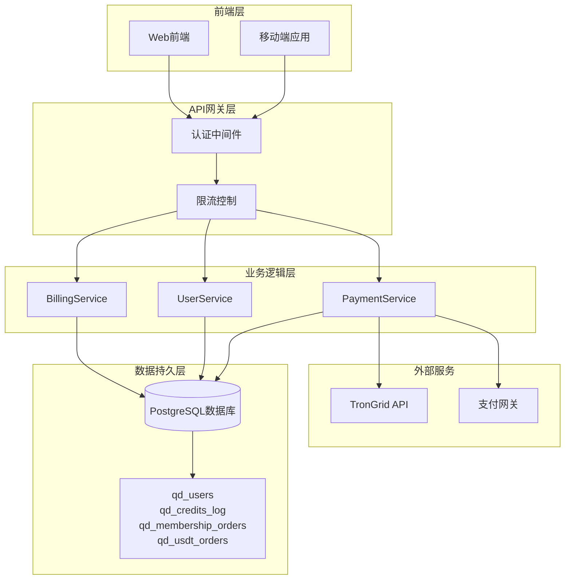

**图表来源**
- [billing_service.py:1-747](file://backend_api_python/app/services/billing_service.py#L1-L747)
- [user_service.py:1-701](file://backend_api_python/app/services/user_service.py#L1-L701)
- [usdt_payment_service.py:1-820](file://backend_api_python/app/services/usdt_payment_service.py#L1-L820)

## 核心组件

### 计费服务 (BillingService)

计费服务是整个积分系统的核心，负责处理所有与积分相关的业务逻辑：

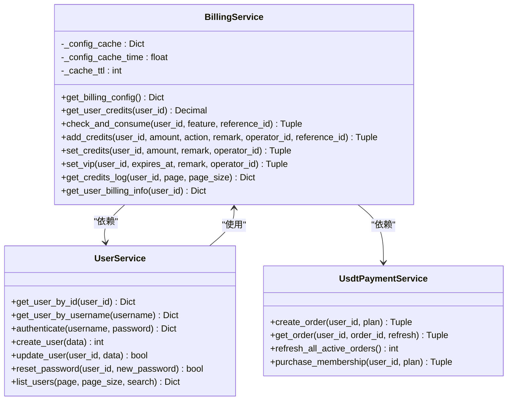

**图表来源**
- [billing_service.py:47-747](file://backend_api_python/app/services/billing_service.py#L47-L747)
- [user_service.py:56-701](file://backend_api_python/app/services/user_service.py#L56-L701)
- [usdt_payment_service.py:23-820](file://backend_api_python/app/services/usdt_payment_service.py#L23-L820)

**章节来源**
- [billing_service.py:47-747](file://backend_api_python/app/services/billing_service.py#L47-L747)
- [user_service.py:56-701](file://backend_api_python/app/services/user_service.py#L56-L701)

## 积分余额查询

积分余额查询功能提供了实时的用户积分余额信息获取能力。

### 查询流程

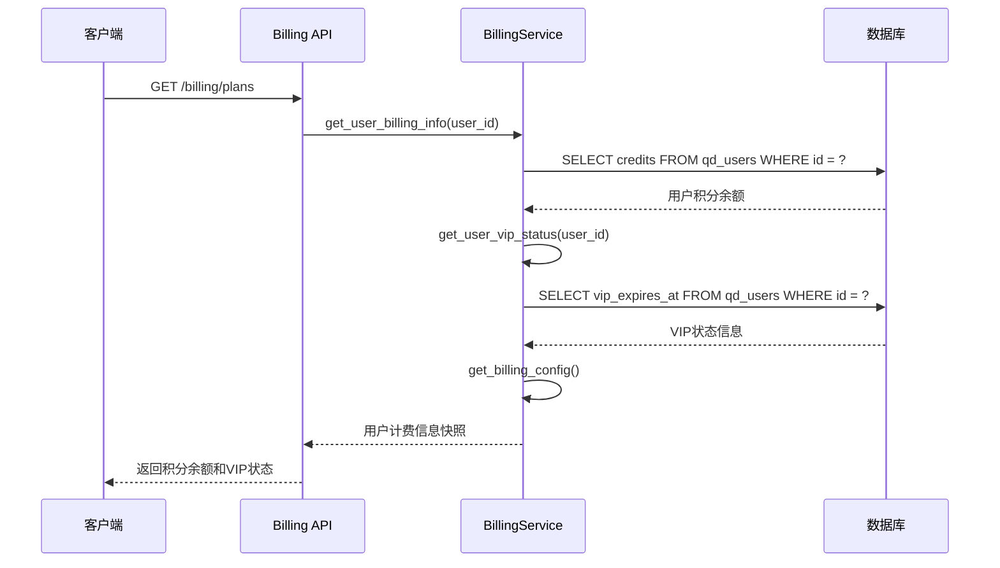

**图表来源**
- [billing.py:21-62](file://backend_api_python/app/routes/billing.py#L21-L62)
- [billing_service.py:718-734](file://backend_api_python/app/services/billing_service.py#L718-L734)

### 查询实现细节

积分余额查询通过以下步骤实现：

1. **用户认证**：通过登录中间件验证用户身份
2. **余额获取**：从`qd_users`表查询`credits`字段
3. **VIP状态检查**：获取用户的VIP过期时间和状态
4. **配置加载**：加载当前的计费配置
5. **数据组装**：将所有信息组合成响应格式

**章节来源**
- [billing.py:21-62](file://backend_api_python/app/routes/billing.py#L21-L62)
- [billing_service.py:98-156](file://backend_api_python/app/services/billing_service.py#L98-L156)

## 积分消费流程

积分消费流程是系统中最复杂的业务逻辑之一，涉及余额验证、扣费和日志记录等多个环节。

### 消费流程

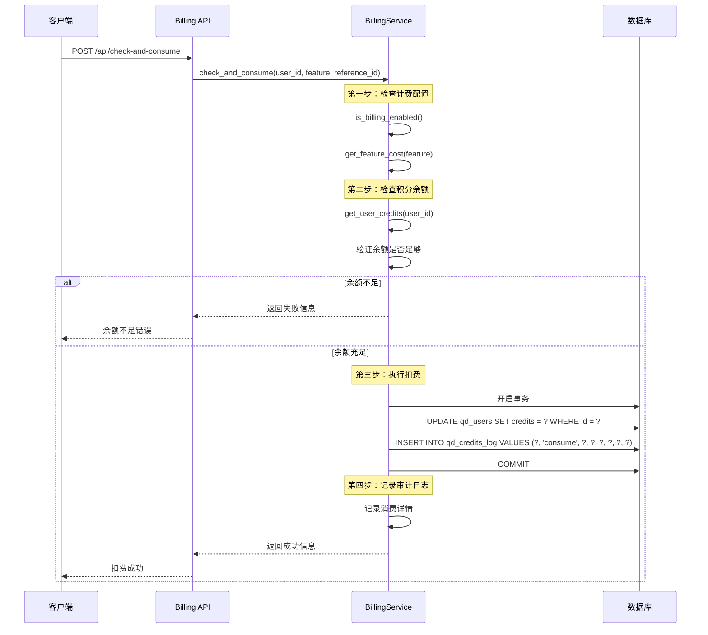

**图表来源**
- [billing_service.py:450-515](file://backend_api_python/app/services/billing_service.py#L450-L515)

### 消费检查逻辑

积分消费检查逻辑包含多个验证步骤：

1. **计费开关检查**：验证`BILLING_ENABLED`配置
2. **功能成本获取**：从配置中获取对应功能的积分成本
3. **免费功能处理**：成本为0的功能直接放行
4. **余额验证**：检查用户当前积分余额
5. **扣费执行**：执行积分扣除操作

**章节来源**
- [billing_service.py:450-515](file://backend_api_python/app/services/billing_service.py#L450-L515)
- [env.example:136-141](file://backend_api_python/env.example#L136-L141)

## 积分充值流程

积分充值流程支持多种充值方式，包括管理员手动充值和系统自动充值。

### 充值流程

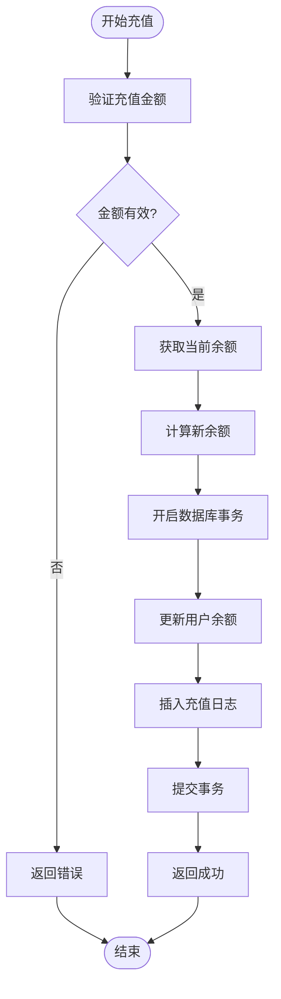

**图表来源**
- [billing_service.py:516-566](file://backend_api_python/app/services/billing_service.py#L516-L566)

### 充值类型

系统支持多种充值类型：

| 充值类型 | 描述 | 触发场景 |
|---------|------|----------|
| recharge | 用户充值 | 通过支付网关完成充值 |
| admin_adjust | 管理员调整 | 管理员手动调整用户积分 |
| refund | 退款 | 交易取消或退款处理 |
| referral_bonus | 推荐奖励 | 用户推荐新用户注册 |
| register_bonus | 注册奖励 | 新用户注册奖励 |

**章节来源**
- [billing_service.py:516-566](file://backend_api_python/app/services/billing_service.py#L516-L566)

## 积分调整流程

积分调整是管理员专用功能，允许对用户积分进行精确调整。

### 调整流程

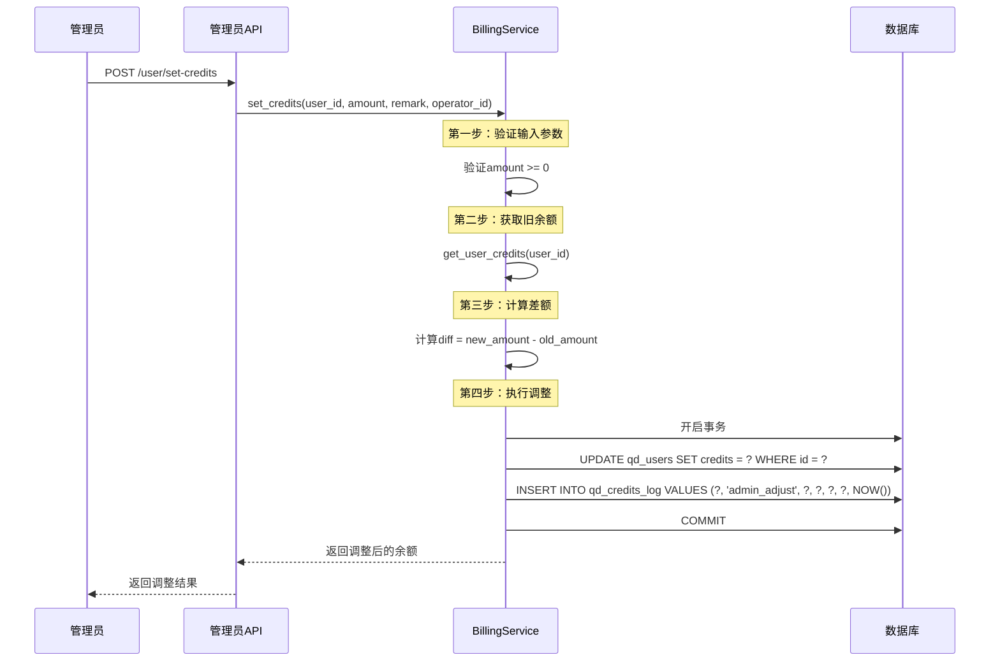

**图表来源**
- [billing_service.py:568-616](file://backend_api_python/app/services/billing_service.py#L568-L616)

**章节来源**
- [billing_service.py:568-616](file://backend_api_python/app/services/billing_service.py#L568-L616)

## 积分日志记录机制

积分日志记录机制提供了完整的审计追踪功能，确保所有积分变动都有据可查。

### 日志表结构

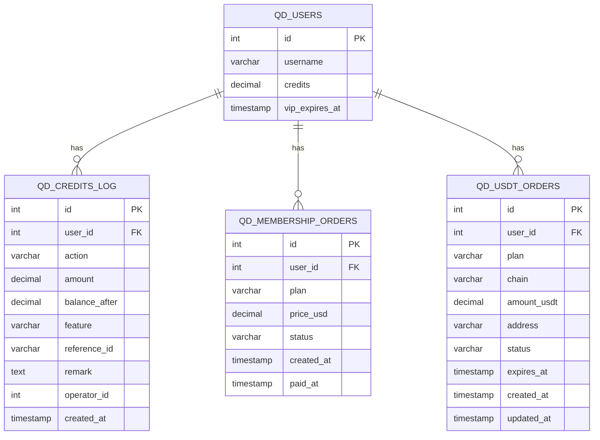

**图表来源**
- [init.sql:42-98](file://backend_api_python/migrations/init.sql#L42-L98)

### 日志记录策略

系统采用以下日志记录策略：

1. **实时记录**：每次积分变动都实时写入日志表
2. **事务保证**：日志记录与余额更新在同一事务中完成
3. **审计追踪**：记录操作类型、操作人、关联ID等信息
4. **时间戳**：使用UTC时间确保跨时区一致性

**章节来源**
- [init.sql:42-98](file://backend_api_python/migrations/init.sql#L42-L98)
- [billing_service.py:664-716](file://backend_api_python/app/services/billing_service.py#L664-L716)

## 操作类型分类

系统定义了多种操作类型来区分不同类型的积分变动：

### 操作类型定义

| 操作类型 | 用途 | 示例场景 |
|---------|------|----------|
| consume | 积分消费 | AI分析、代码生成、深度分析 |
| recharge | 积分充值 | 用户通过支付网关充值 |
| admin_adjust | 管理员调整 | 系统维护、补偿调整 |
| refund | 退款处理 | 交易取消、服务撤销 |
| membership_purchase | 会员购买 | 购买月卡、年卡、终身卡 |
| membership_monthly | 会员月度奖励 | 终身会员月度积分奖励 |
| vip_grant | VIP授予 | 管理员授予VIP权限 |
| vip_revoke | VIP撤销 | VIP权限到期或撤销 |

**章节来源**
- [billing_service.py:450-515](file://backend_api_python/app/services/billing_service.py#L450-L515)
- [billing_service.py:516-566](file://backend_api_python/app/services/billing_service.py#L516-L566)

## 审计追踪

审计追踪功能提供了完整的操作历史记录，支持管理员进行审计和问题排查。

### 审计功能特性

1. **操作记录**：记录所有管理员操作
2. **时间线追踪**：按时间顺序展示操作历史
3. **搜索过滤**：支持按用户、时间、操作类型筛选
4. **详细日志**：包含操作详情和影响范围

### 审计接口

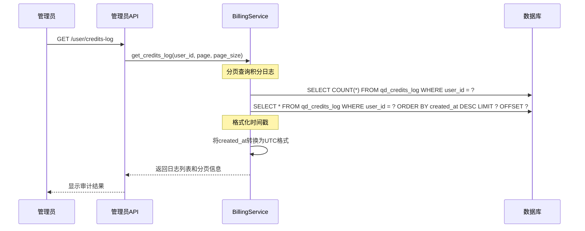

**图表来源**
- [user.py:735-803](file://backend_api_python/app/routes/user.py#L735-L803)
- [billing_service.py:664-716](file://backend_api_python/app/services/billing_service.py#L664-L716)

**章节来源**
- [user.py:735-803](file://backend_api_python/app/routes/user.py#L735-L803)

## 原子性操作与并发控制

系统通过数据库事务和锁机制确保积分操作的原子性和数据一致性。

### 并发控制机制

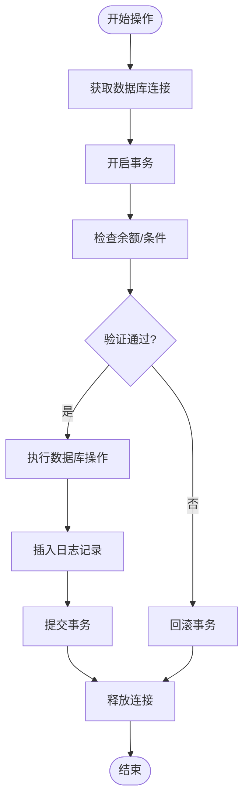

### 锁机制

1. **行级锁**：在更新用户余额时自动获取行级锁
2. **事务隔离**：使用适当的事务隔离级别防止脏读
3. **重试机制**：对于死锁情况自动重试
4. **超时控制**：设置合理的事务超时时间

**章节来源**
- [billing_service.py:450-515](file://backend_api_python/app/services/billing_service.py#L450-L515)
- [billing_service.py:516-566](file://backend_api_python/app/services/billing_service.py#L516-L566)

## 积分消费检查逻辑

积分消费检查逻辑确保只有在满足条件的情况下才允许消费积分。

### 检查流程

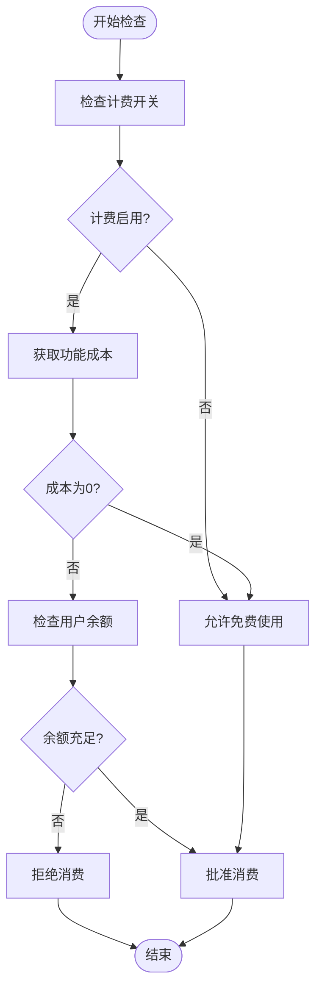

### 配置管理

系统通过环境变量管理计费配置：

| 配置项 | 默认值 | 说明 |
|--------|--------|------|
| BILLING_ENABLED | false | 是否启用计费系统 |
| BILLING_COST_AI_ANALYSIS | 10 | AI分析功能积分成本 |
| BILLING_COST_AI_CODE_GEN | 30 | AI代码生成积分成本 |
| BILLING_COST_POLYMARKET_DEEP_ANALYSIS | 15 | 深度分析功能积分成本 |

**章节来源**
- [billing_service.py:450-515](file://backend_api_python/app/services/billing_service.py#L450-L515)
- [env.example:136-141](file://backend_api_python/env.example#L136-L141)

## 管理员操作接口

管理员操作接口提供了对用户积分的完全控制能力。

### 管理员功能

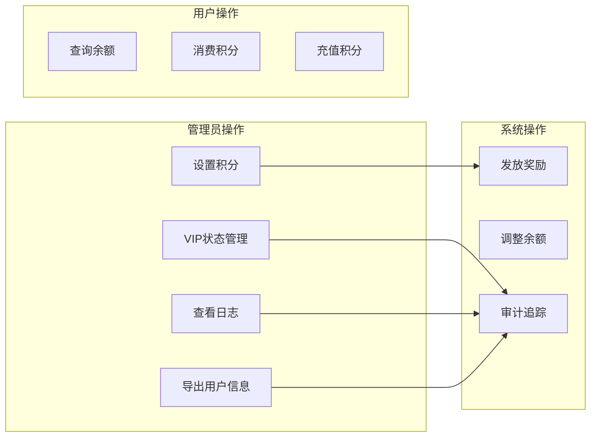

### 接口列表

| 接口 | 方法 | 权限 | 功能描述 |
|------|------|------|----------|
| `/user/set-credits` | POST | admin_required | 设置用户积分 |
| `/user/set-vip` | POST | admin_required | 设置用户VIP状态 |
| `/user/credits-log` | GET | admin_required | 获取用户积分日志 |
| `/user/list` | GET | admin_required | 列出所有用户 |
| `/user/export` | GET | admin_required | 导出用户信息 |

**章节来源**
- [user.py:563-803](file://backend_api_python/app/routes/user.py#L563-L803)

## 批量积分调整

系统支持批量积分调整功能，适用于大规模用户积分管理场景。

### 批量调整流程

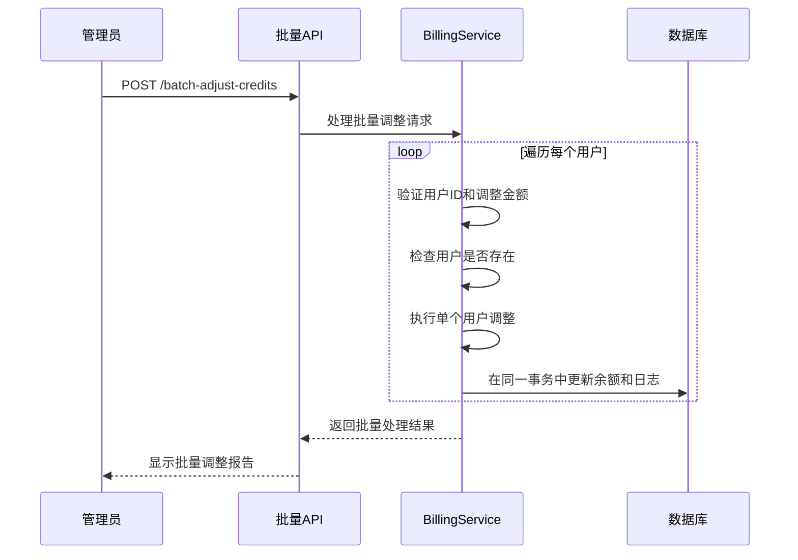

### 批量操作限制

1. **单次批量大小**：限制单次批量操作的用户数量
2. **事务超时**：设置批量操作的总超时时间
3. **错误处理**：单个用户失败不影响整体操作
4. **进度跟踪**：提供批量操作进度反馈

## 积分统计分析

系统提供了丰富的积分统计分析功能，帮助管理员了解积分使用情况。

### 统计指标

| 指标类型 | 统计内容 | 计算方式 |
|----------|----------|----------|
| 用户统计 | 活跃用户数、新增用户数 | 基于用户表统计 |
| 余额分布 | 不同余额区间用户数量 | 按余额范围分组统计 |
| 消费趋势 | 日/周/月消费量变化 | 基于日志表时间序列分析 |
| 收支平衡 | 总收入、总支出、净增长 | 按操作类型汇总统计 |

### 报表功能

1. **实时仪表板**：显示关键指标的实时状态
2. **历史趋势图**：展示积分使用的历史趋势
3. **用户行为分析**：分析用户的积分使用模式
4. **异常检测**：识别异常的积分变动模式

## 性能考虑

系统在设计时充分考虑了性能优化，采用多种技术手段提升系统性能。

### 性能优化策略

1. **数据库优化**
   - 合理的索引设计（用户ID、时间戳、操作类型）
   - 连接池管理，避免连接泄漏
   - 查询优化，避免N+1查询问题

2. **缓存策略**
   - 配置信息缓存（默认60秒缓存）
   - 热数据缓存（常用用户信息）
   - 缓存失效策略

3. **异步处理**
   - 后台任务处理耗时操作
   - 异步日志记录
   - 批量操作异步执行

### 监控指标

| 指标类别 | 监控内容 | 目标值 |
|----------|----------|--------|
| 响应时间 | API平均响应时间 | < 100ms |
| 吞吐量 | QPS | > 1000 |
| 错误率 | 业务错误率 | < 0.1% |
| 资源使用 | CPU、内存使用率 | < 80% |

## 故障排除指南

### 常见问题及解决方案

#### 1. 积分扣费失败

**问题现象**：用户消费积分时报错，但余额未减少

**可能原因**：
- 数据库连接异常
- 事务回滚
- 并发冲突导致的死锁

**解决步骤**：
1. 检查数据库连接状态
2. 查看事务日志
3. 重试操作
4. 检查是否有并发冲突

#### 2. 积分日志缺失

**问题现象**：用户积分变动后，日志表中没有相应记录

**可能原因**：
- 日志插入失败
- 事务未提交
- 数据库连接异常

**解决步骤**：
1. 检查日志表结构
2. 验证事务提交
3. 查看数据库错误日志

#### 3. VIP状态异常

**问题现象**：用户VIP状态显示不正确

**可能原因**：
- VIP过期时间计算错误
- 数据库字段更新失败
- 缓存数据过期

**解决步骤**：
1. 检查VIP过期时间计算逻辑
2. 验证数据库字段更新
3. 清除相关缓存

**章节来源**
- [billing_service.py:450-515](file://backend_api_python/app/services/billing_service.py#L450-L515)
- [billing_service.py:516-566](file://backend_api_python/app/services/billing_service.py#L516-L566)

## 结论

QuantDinger积分管理系统是一个功能完整、设计合理的积分管理解决方案。系统通过模块化的设计、完善的日志记录机制和严格的并发控制，确保了积分操作的安全性和可靠性。

### 系统优势

1. **功能完整性**：涵盖了积分管理的所有核心功能
2. **安全性保障**：通过事务和审计确保数据一致性
3. **扩展性强**：模块化设计便于功能扩展
4. **监控完善**：提供全面的性能监控和日志分析

### 技术特点

1. **高可用性**：通过连接池和异步处理提升系统稳定性
2. **高性能**：合理的数据库设计和缓存策略
3. **易维护性**：清晰的代码结构和完善的文档
4. **可扩展性**：支持多种支付方式和业务场景

该系统为QuantDinger平台的商业化运营提供了坚实的技术基础，能够满足不同规模用户群体的积分管理需求。