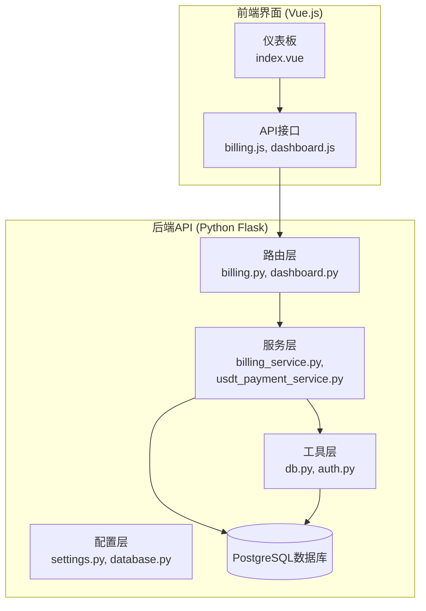
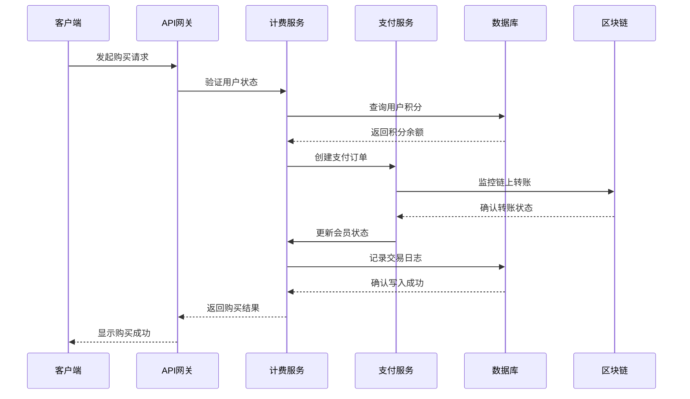
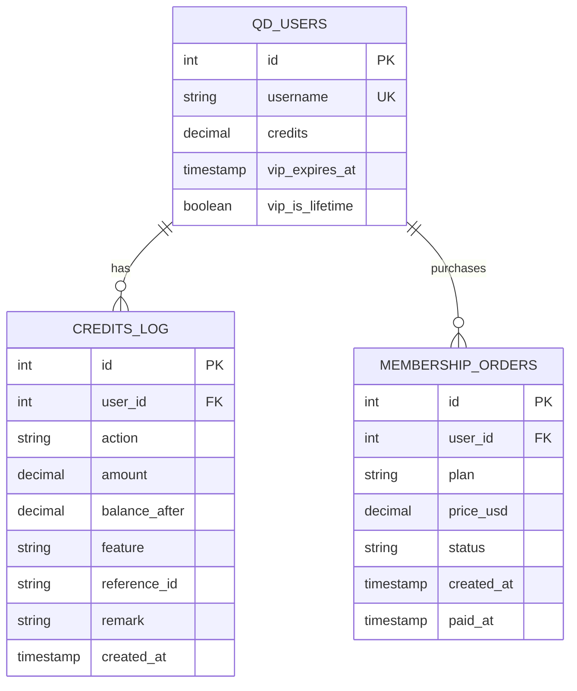
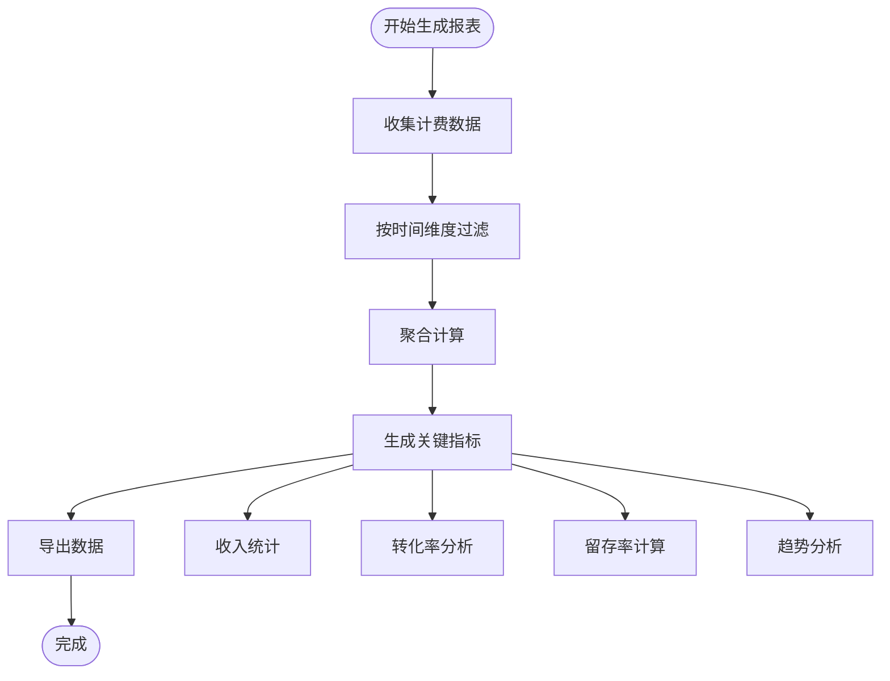
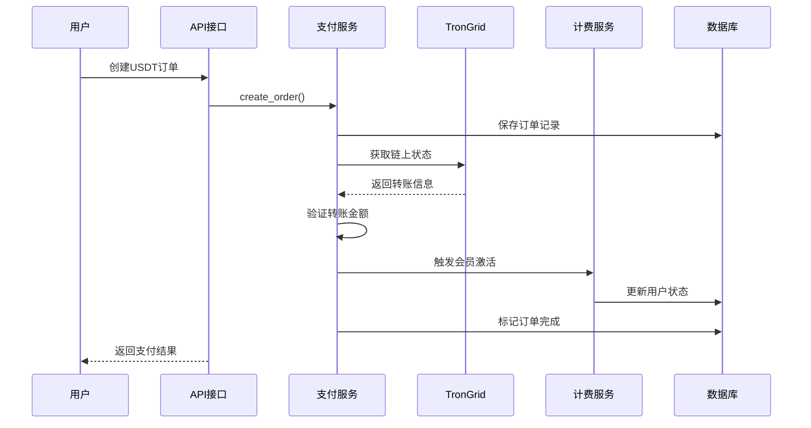
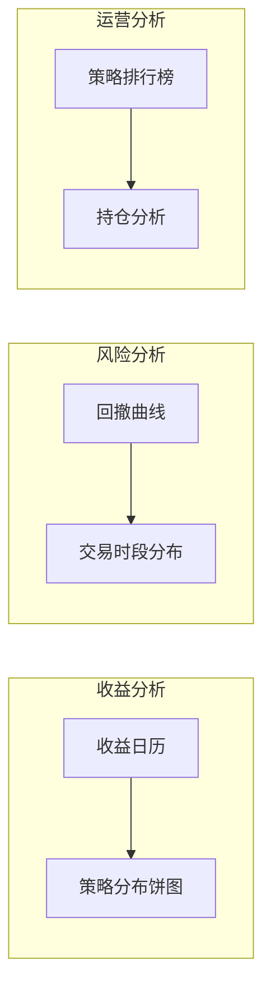
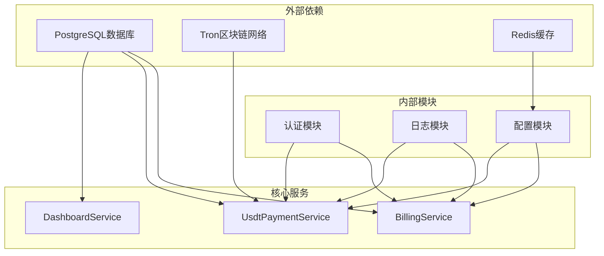

# 计费数据分析

<cite>
**本文档引用的文件**
- [billing.py](file://backend_api_python/app/routes/billing.py)
- [billing_service.py](file://backend_api_python/app/services/billing_service.py)
- [usdt_payment_service.py](file://backend_api_python/app/services/usdt_payment_service.py)
- [dashboard.py](file://backend_api_python/app/routes/dashboard.py)
- [init.sql](file://backend_api_python/migrations/init.sql)
- [index.vue](file://frontend/src/views/dashboard/index.vue)
- [settings.py](file://backend_api_python/app/config/settings.py)
- [database.py](file://backend_api_python/app/config/database.py)
- [db.py](file://backend_api_python/app/utils/db.py)
</cite>

## 目录
1. [简介](#简介)
2. [项目结构](#项目结构)
3. [核心组件](#核心组件)
4. [架构概览](#架构概览)
5. [详细组件分析](#详细组件分析)
6. [依赖关系分析](#依赖关系分析)
7. [性能考虑](#性能考虑)
8. [故障排除指南](#故障排除指南)
9. [结论](#结论)
10. [附录](#附录)

## 简介

QuantDinger计费数据分析系统是一个基于积分的订阅计费平台，专注于量化交易分析服务的商业化运营。该系统实现了完整的计费生命周期管理，包括会员购买、积分消费、收入统计和财务对账等功能。

系统采用模块化设计，通过积分流水统计、会员购买分析和收入报表生成三大核心机制，为企业提供全面的财务洞察和运营支持。计费数据的聚合计算、时间维度分析和用户行为洞察帮助管理者做出数据驱动的商业决策。

## 项目结构

QuantDinger项目采用前后端分离架构，计费系统主要分布在后端Python API和前端Vue.js界面中：

**图表来源**
- [billing.py:1-243](file://backend_api_python/app/routes/billing.py#L1-L243)
- [billing_service.py:1-747](file://backend_api_python/app/services/billing_service.py#L1-L747)
- [dashboard.py:1-843](file://backend_api_python/app/routes/dashboard.py#L1-L843)

**章节来源**
- [billing.py:1-243](file://backend_api_python/app/routes/billing.py#L1-L243)
- [billing_service.py:1-747](file://backend_api_python/app/services/billing_service.py#L1-L747)
- [dashboard.py:1-843](file://backend_api_python/app/routes/dashboard.py#L1-L843)

## 核心组件

### 计费服务层

计费服务是整个系统的核心，负责处理所有与计费相关的业务逻辑：

- **积分管理**: 实现积分的增发、扣除、查询和日志记录
- **会员管理**: 管理VIP状态、会员计划和自动续费
- **功能计费**: 基于功能的积分消耗机制
- **财务对账**: 自动生成财务报表和对账数据

### 支付服务层

系统支持多种支付方式，包括模拟支付和USDT链上支付：

- **模拟支付**: 用于测试环境的快速支付流程
- **USDT支付**: 基于Tron区块链的实时支付处理
- **订单管理**: 完整的订单生命周期管理

### 报表分析层

提供多维度的财务分析和可视化：

- **仪表板**: 实时展示关键财务指标
- **趋势分析**: 积分消耗和收入趋势分析
- **用户行为**: 付费转化率和留存率分析

**章节来源**
- [billing_service.py:47-747](file://backend_api_python/app/services/billing_service.py#L47-L747)
- [usdt_payment_service.py:23-820](file://backend_api_python/app/services/usdt_payment_service.py#L23-L820)

## 架构概览

系统采用分层架构设计，确保高内聚低耦合：

**图表来源**
- [billing.py:65-122](file://backend_api_python/app/routes/billing.py#L65-L122)
- [billing_service.py:202-335](file://backend_api_python/app/services/billing_service.py#L202-L335)
- [usdt_payment_service.py:132-188](file://backend_api_python/app/services/usdt_payment_service.py#L132-L188)

## 详细组件分析

### 计费服务核心机制

计费服务实现了完整的积分管理体系：

#### 积分流水统计

系统通过`qd_credits_log`表记录所有积分变动：

**图表来源**
- [init.sql:8-53](file://backend_api_python/migrations/init.sql#L8-L53)
- [init.sql:63-71](file://backend_api_python/migrations/init.sql#L63-L71)

#### 会员购买分析

系统支持三种会员计划的购买和管理：

| 会员类型 | 价格(美元) | 首次积分 | 有效期(天) | 生命周期 |
|---------|-----------|----------|-----------|----------|
| 月卡 | 19.90 | 500 | 30 | 不支持 |
| 年卡 | 199.00 | 8000 | 365 | 不支持 |
| 终身卡 | 499.00 | 0 | 36500 | 支持 |

#### 收入报表生成

系统自动生成多维度的财务报表：

**图表来源**
- [billing_service.py:664-717](file://backend_api_python/app/services/billing_service.py#L664-L717)
- [dashboard.py:307-618](file://backend_api_python/app/routes/dashboard.py#L307-L618)

**章节来源**
- [billing_service.py:158-335](file://backend_api_python/app/services/billing_service.py#L158-L335)
- [init.sql:63-99](file://backend_api_python/migrations/init.sql#L63-L99)

### USDT支付系统

系统实现了完整的USDT链上支付解决方案：

#### 支付流程

**图表来源**
- [usdt_payment_service.py:132-188](file://backend_api_python/app/services/usdt_payment_service.py#L132-L188)
- [usdt_payment_service.py:282-420](file://backend_api_python/app/services/usdt_payment_service.py#L282-L420)

#### 支付配置

系统支持灵活的支付配置：

| 配置项 | 默认值 | 描述 |
|-------|--------|------|
| USDT_PAY_ENABLED | false | 是否启用USDT支付 |
| USDT_PAY_CHAIN | TRC20 | 支付链类型 |
| CONFIRM_SECONDS | 30 | 确认等待时间 |
| EXPIRE_MINUTES | 30 | 订单过期时间 |
| TRONGRID_API_KEY | 空 | TronGrid API密钥 |

**章节来源**
- [usdt_payment_service.py:33-46](file://backend_api_python/app/services/usdt_payment_service.py#L33-L46)
- [usdt_payment_service.py:50-87](file://backend_api_python/app/services/usdt_payment_service.py#L50-L87)

### 仪表板与报表分析

前端仪表板提供了丰富的可视化分析功能：

#### 关键指标面板

系统实时展示以下核心指标：

- **总权益**: 用户总资产价值
- **胜率**: 交易成功率
- **盈亏比**: 盈利与亏损的比例
- **最大回撤**: 最大资金回撤幅度
- **总交易数**: 历史交易总次数
- **运行策略**: 正在运行的策略数量

#### 数据图表

**图表来源**
- [index.vue:168-408](file://frontend/src/views/dashboard/index.vue#L168-L408)

**章节来源**
- [index.vue:1-800](file://frontend/src/views/dashboard/index.vue#L1-L800)
- [dashboard.py:307-618](file://backend_api_python/app/routes/dashboard.py#L307-L618)

## 依赖关系分析

系统采用清晰的依赖层次结构：

**图表来源**
- [db.py:19-25](file://backend_api_python/app/utils/db.py#L19-L25)
- [settings.py:6-28](file://backend_api_python/app/config/settings.py#L6-L28)
- [database.py:6-36](file://backend_api_python/app/config/database.py#L6-L36)

**章节来源**
- [db.py:1-66](file://backend_api_python/app/utils/db.py#L1-L66)
- [settings.py:1-99](file://backend_api_python/app/config/settings.py#L1-L99)
- [database.py:1-90](file://backend_api_python/app/config/database.py#L1-L90)

## 性能考虑

系统在设计时充分考虑了性能优化：

### 数据库优化

- **索引优化**: 为常用查询字段建立复合索引
- **连接池**: 使用连接池管理数据库连接
- **批量操作**: 支持批量数据处理

### 缓存策略

- **配置缓存**: 计费配置缓存60秒
- **查询缓存**: 热点数据缓存
- **会话缓存**: 用户会话状态缓存

### 异步处理

- **后台任务**: 支付订单异步处理
- **定时任务**: 定期清理过期订单
- **事件驱动**: 基于事件的消息处理

## 故障排除指南

### 常见问题诊断

#### 计费服务异常

**症状**: 用户无法购买会员或积分不足

**排查步骤**:
1. 检查计费配置是否启用
2. 验证用户积分余额
3. 查看计费日志
4. 确认数据库连接

#### USDT支付失败

**症状**: 订单创建成功但支付未确认

**排查步骤**:
1. 验证TronGrid API密钥
2. 检查钱包地址派生
3. 确认链上转账记录
4. 查看支付日志

#### 仪表板数据异常

**症状**: 仪表板显示数据不准确

**排查步骤**:
1. 检查数据更新频率
2. 验证时间戳格式
3. 确认数据聚合逻辑
4. 查看前端缓存状态

**章节来源**
- [billing_service.py:117-156](file://backend_api_python/app/services/billing_service.py#L117-L156)
- [usdt_payment_service.py:282-360](file://backend_api_python/app/services/usdt_payment_service.py#L282-L360)

## 结论

QuantDinger计费数据分析系统通过模块化的架构设计和完善的业务逻辑，为企业提供了全面的量化交易计费解决方案。系统不仅支持传统的积分消费模式，还集成了区块链支付技术，确保了交易的安全性和透明性。

通过积分流水统计、会员购买分析和收入报表生成三大核心功能，系统能够为企业提供深入的财务洞察和运营支持。实时监控仪表板和灵活的报表定制功能，使得管理者能够随时掌握业务动态，做出数据驱动的商业决策。

未来可以进一步扩展的功能包括：
- 更多支付方式的支持
- 高级财务分析工具
- 自动化财务对账
- 多维度用户行为分析

## 附录

### 数据导出功能

系统支持多种数据导出格式：

| 导出类型 | 格式 | 字段 | 用途 |
|---------|------|------|------|
| 积分流水 | CSV | 用户ID, 操作类型, 金额, 余额, 时间 | 财务对账 |
| 会员订单 | JSON | 订单ID, 用户ID, 计划类型, 金额, 状态 | 销售分析 |
| 收入报表 | Excel | 日期, 收入, 成本, 利润 | 财务报告 |

### 报表定制选项

系统提供灵活的报表定制功能：

- **时间范围**: 日/周/月/季度/年度
- **指标选择**: 收入、成本、利润、转化率
- **数据粒度**: 按用户、按产品、按渠道
- **格式输出**: PDF、Excel、CSV

### 实时监控仪表板

仪表板提供以下监控能力：

- **关键指标**: 实时显示核心业务指标
- **趋势跟踪**: 展示历史趋势变化
- **异常告警**: 自动检测异常情况
- **移动端适配**: 支持移动设备访问