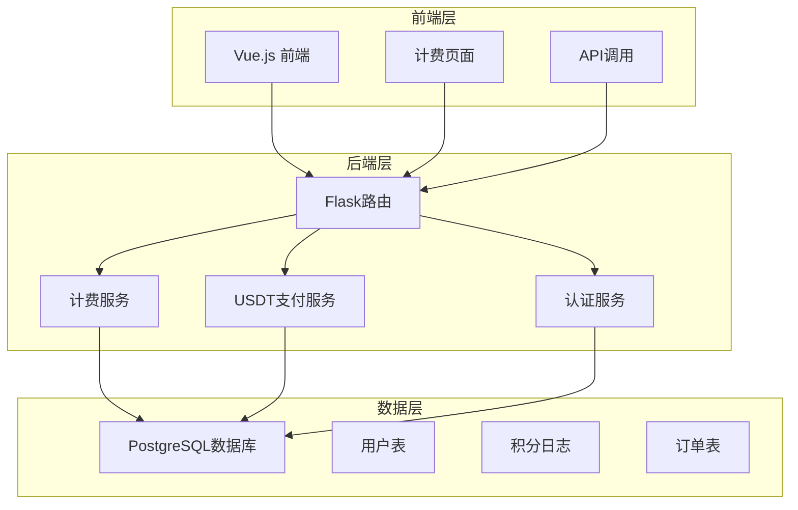
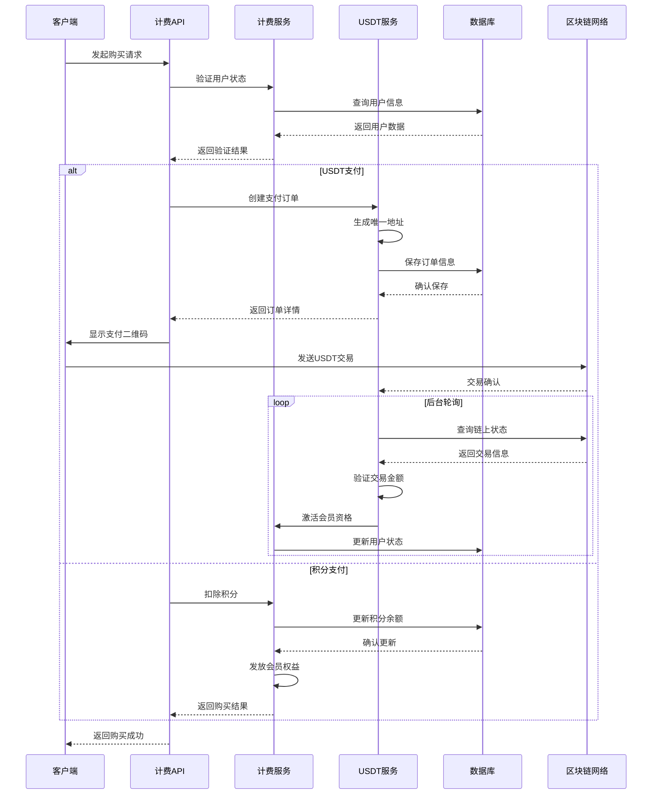
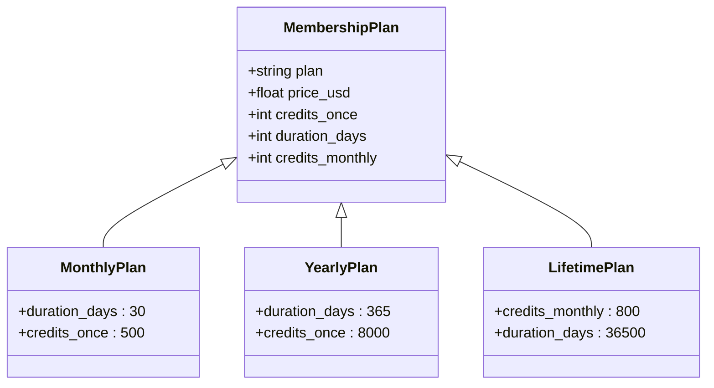
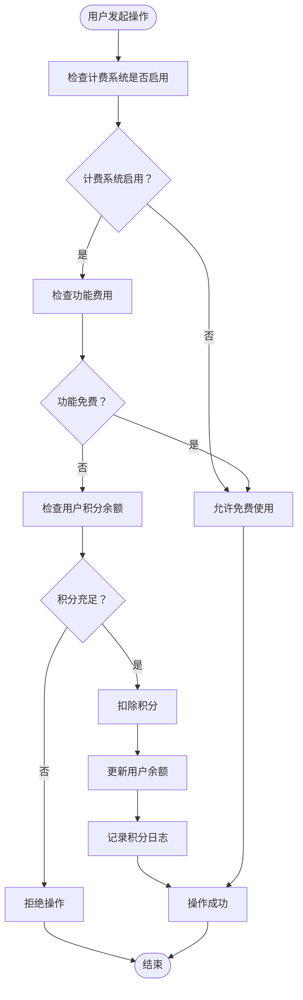
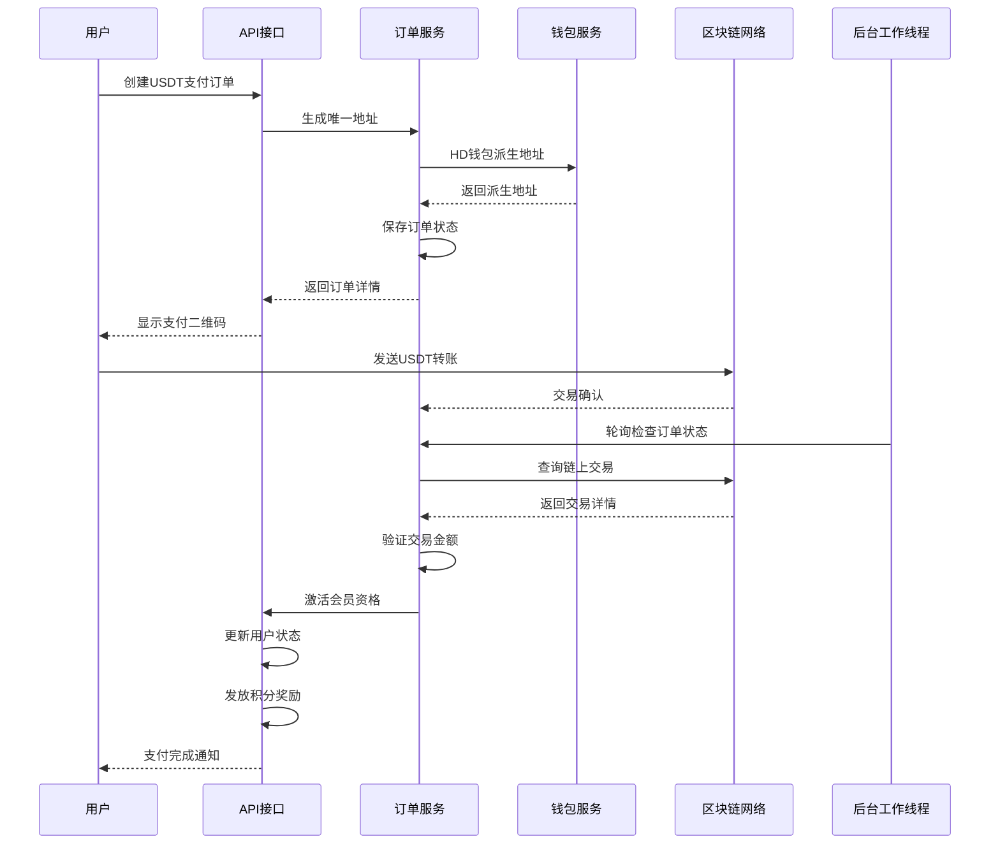
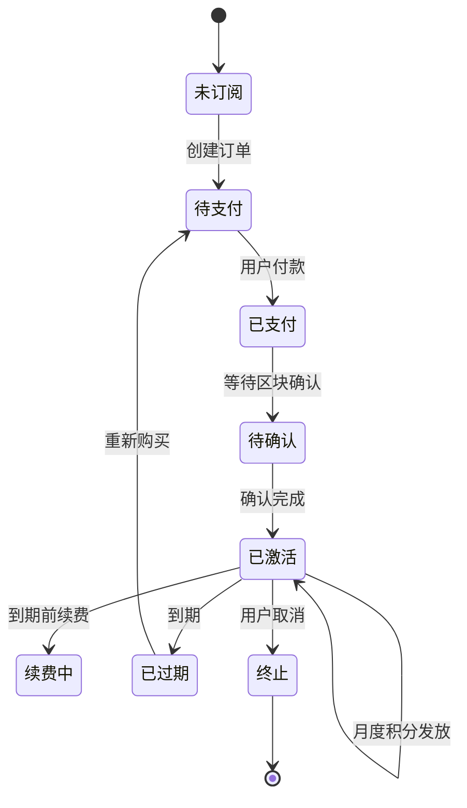
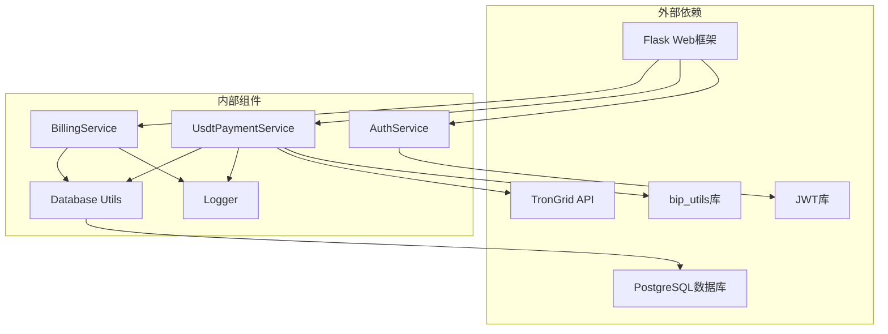

# 计费系统

<cite>
**本文档引用的文件**
- [billing.py](file://backend_api_python/app/routes/billing.py)
- [billing_service.py](file://backend_api_python/app/services/billing_service.py)
- [usdt_payment_service.py](file://backend_api_python/app/services/usdt_payment_service.py)
- [init.sql](file://backend_api_python/migrations/init.sql)
- [index.vue](file://frontend/src/views/billing/index.vue)
- [billing.js](file://frontend/src/api/billing.js)
- [auth.py](file://backend_api_python/app/utils/auth.py)
- [logger.py](file://backend_api_python/app/utils/logger.py)
- [settings.py](file://backend_api_python/app/route/settings.py)
</cite>

## 目录
1. [简介](#简介)
2. [项目结构](#项目结构)
3. [核心组件](#核心组件)
4. [架构概览](#架构概览)
5. [详细组件分析](#详细组件分析)
6. [依赖关系分析](#依赖关系分析)
7. [性能考虑](#性能考虑)
8. [故障排除指南](#故障排除指南)
9. [结论](#结论)

## 简介

QuantDinger计费系统是一个基于Python Flask的完整付费解决方案，集成了会员制度、积分系统、USDT支付和订阅管理功能。该系统采用模块化设计，支持多种支付方式和灵活的计费策略。

系统主要特点：
- **会员制度设计**：支持月卡、年卡和终身卡三种套餐
- **积分系统**：基于积分的消费模式，支持功能解锁和会员权益
- **USDT支付集成**：支持TRC20网络的USDT支付，提供实时状态跟踪
- **订阅管理**：完整的订阅生命周期管理，包括激活、续费和过期处理
- **安全防护**：内置防刷机制和安全审计功能

## 项目结构

计费系统采用前后端分离架构，主要分为以下层次：

**图表来源**
- [billing.py:1-243](file://backend_api_python/app/routes/billing.py#L1-243)
- [billing_service.py:1-747](file://backend_api_python/app/services/billing_service.py#L1-747)
- [usdt_payment_service.py:1-820](file://backend_api_python/app/services/usdt_payment_service.py#L1-820)

**章节来源**
- [billing.py:1-243](file://backend_api_python/app/routes/billing.py#L1-243)
- [billing_service.py:1-747](file://backend_api_python/app/services/billing_service.py#L1-747)
- [usdt_payment_service.py:1-820](file://backend_api_python/app/services/usdt_payment_service.py#L1-820)

## 核心组件

### 计费服务 (BillingService)

计费服务是整个系统的核心，负责处理所有计费相关的逻辑：

**主要功能**：
- 会员计划管理（月卡、年卡、终身卡）
- 积分余额查询和管理
- 功能费用计算和扣费
- 会员状态管理和续费
- 积分日志记录和审计

**关键特性**：
- 配置缓存机制，提高性能
- 支持动态配置更新
- 完整的事务处理保证数据一致性
- 详细的日志记录用于审计

### USDT支付服务 (UsdtPaymentService)

USDT支付服务实现了完整的加密货币支付流程：

**主要功能**：
- 每单独立地址生成（HD钱包派生）
- 实时链上状态监控
- 自动对账和确认
- 支付状态跟踪和通知
- 批量订单处理

**技术实现**：
- 支持TRC20网络
- 使用TronGrid API进行链上查询
- 智能重试机制
- 并发安全的订单状态管理

### 认证中间件

系统使用JWT令牌进行用户认证和授权：

**功能特性**：
- Bearer Token认证
- 单客户端登录控制
- 角色权限管理
- Token版本控制防止并发登录

**章节来源**
- [billing_service.py:47-747](file://backend_api_python/app/services/billing_service.py#L47-747)
- [usdt_payment_service.py:23-820](file://backend_api_python/app/services/usdt_payment_service.py#L23-820)
- [auth.py:126-157](file://backend_api_python/app/utils/auth.py#L126-157)

## 架构概览

计费系统采用分层架构设计，确保了良好的可维护性和扩展性：

**图表来源**
- [billing.py:65-122](file://backend_api_python/app/routes/billing.py#L65-122)
- [usdt_payment_service.py:132-187](file://backend_api_python/app/services/usdt_payment_service.py#L132-187)
- [billing_service.py:202-335](file://backend_api_python/app/services/billing_service.py#L202-335)

## 详细组件分析

### 会员制度设计

系统支持三种会员套餐，每种套餐都有独特的价值主张：

**图表来源**
- [billing_service.py:160-200](file://backend_api_python/app/services/billing_service.py#L160-200)

**套餐特性对比**：

| 套餐类型 | 价格(USD) | 首次积分 | 月度积分 | 有效期 | 适用场景 |
|---------|----------|---------|---------|--------|----------|
| 月卡 | $19.9 | 500 | 无 | 30天 | 新用户试用 |
| 年卡 | $199 | 8000 | 无 | 365天 | 长期用户 |
| 终身卡 | $499 | 一次性 | 800/月 | 永久 | 高价值用户 |

**章节来源**
- [billing_service.py:181-200](file://backend_api_python/app/services/billing_service.py#L181-200)

### 积分系统实现

积分系统是QuantDinger的核心经济模型，支持多种积分操作：

**图表来源**
- [billing_service.py:450-515](file://backend_api_python/app/services/billing_service.py#L450-515)

**积分操作类型**：
- **充值**：管理员或系统自动增加积分
- **消费**：使用功能时扣除相应积分
- **退款**：撤销错误收费或违规操作
- **调整**：管理员手动调整用户积分

**章节来源**
- [billing_service.py:516-617](file://backend_api_python/app/services/billing_service.py#L516-617)

### USDT支付服务实现

USDT支付服务提供了完整的加密货币支付解决方案：

**图表来源**
- [usdt_payment_service.py:132-187](file://backend_api_python/app/services/usdt_payment_service.py#L132-187)
- [usdt_payment_service.py:538-600](file://backend_api_python/app/services/usdt_payment_service.py#L538-600)

**支付流程特性**：
- **实时监控**：后台线程持续监控支付状态
- **自动确认**：满足条件时自动激活会员资格
- **异常处理**：完善的错误处理和重试机制
- **状态跟踪**：完整的支付状态生命周期管理

**章节来源**
- [usdt_payment_service.py:282-420](file://backend_api_python/app/services/usdt_payment_service.py#L282-420)

### 订阅管理机制

订阅管理系统实现了完整的会员生命周期管理：

**图表来源**
- [billing_service.py:202-335](file://backend_api_python/app/services/billing_service.py#L202-335)

**订阅特性**：
- **叠加续费**：支持月卡和年卡的叠加购买
- **自动续费**：终身卡的月度积分自动发放
- **状态同步**：实时同步链上支付状态
- **过期处理**：自动清理过期会员权限

**章节来源**
- [billing_service.py:386-448](file://backend_api_python/app/services/billing_service.py#L386-448)

## 依赖关系分析

计费系统各组件之间的依赖关系如下：

**图表来源**
- [billing_service.py:18-21](file://backend_api_python/app/services/billing_service.py#L18-21)
- [usdt_payment_service.py:16-18](file://backend_api_python/app/services/usdt_payment_service.py#L16-18)

**依赖关系特点**：
- **松耦合设计**：各组件通过清晰的接口交互
- **单一职责**：每个组件专注于特定功能领域
- **可测试性**：良好的依赖注入支持单元测试
- **可扩展性**：易于添加新的支付方式和计费规则

**章节来源**
- [billing_service.py:1-747](file://backend_api_python/app/services/billing_service.py#L1-747)
- [usdt_payment_service.py:1-820](file://backend_api_python/app/services/usdt_payment_service.py#L1-820)

## 性能考虑

### 数据库优化

系统采用了多项数据库优化策略：

**索引优化**：
- 用户表：用户名、邮箱、状态索引
- 积分日志：用户ID、创建时间、动作类型索引
- 订单表：用户ID、状态、创建时间索引
- USDT订单：地址唯一性索引、状态索引

**连接池管理**：
- 统一的数据库连接管理
- 连接超时和重试机制
- 连接池大小动态调整

### 缓存策略

**配置缓存**：
- 计费配置缓存60秒
- 避免频繁的环境变量读取
- 支持配置热更新

**会话缓存**：
- JWT令牌验证结果缓存
- 减少数据库查询压力
- 支持令牌版本控制

### 并发处理

**线程安全**：
- 订单状态更新的原子性保证
- 数据库事务的正确使用
- 避免竞态条件的发生

**异步处理**：
- 后台工作线程处理链上监控
- 非阻塞的HTTP请求处理
- 资源的有效利用

## 故障排除指南

### 常见问题诊断

**支付失败排查**：
1. 检查USDT配置是否正确
2. 验证TronGrid API密钥有效性
3. 确认钱包公钥格式正确
4. 检查区块链网络连接状态

**积分扣费异常**：
1. 验证用户积分余额
2. 检查功能费用配置
3. 确认计费系统状态
4. 查看积分日志记录

**会员状态异常**：
1. 检查VIP过期时间计算
2. 验证续费逻辑执行
3. 确认数据库更新状态
4. 查看相关日志信息

### 日志分析

系统提供了详细的日志记录机制：

**关键日志类别**：
- **USDT支付日志**：订单状态变更、链上查询结果
- **计费操作日志**：积分扣费、充值、退款记录
- **安全审计日志**：登录尝试、权限变更、异常访问
- **系统运行日志**：服务启动、配置加载、错误信息

**日志配置**：
- 支持不同级别的日志输出
- 文件轮转机制防止日志过大
- 自定义日志格式便于分析

**章节来源**
- [logger.py:9-48](file://backend_api_python/app/utils/logger.py#L9-48)
- [usdt_payment_service.py:604-600](file://backend_api_python/app/services/usdt_payment_service.py#L604-600)

## 结论

QuantDinger计费系统是一个功能完整、设计合理的付费解决方案。系统的主要优势包括：

**技术优势**：
- 模块化设计，易于维护和扩展
- 完善的错误处理和异常恢复机制
- 高性能的数据库和缓存策略
- 安全可靠的认证和授权机制

**业务价值**：
- 支持多种支付方式，提升用户体验
- 灵活的计费策略适应不同业务需求
- 完整的订阅管理简化运营流程
- 详细的日志记录便于财务对账

**未来改进方向**：
- 集成更多主流支付方式
- 优化移动端支付体验
- 增强数据分析和报表功能
- 完善风控和反作弊机制

该系统为QuantDinger平台提供了坚实的商业化基础，支持平台的长期发展和盈利模式实现。