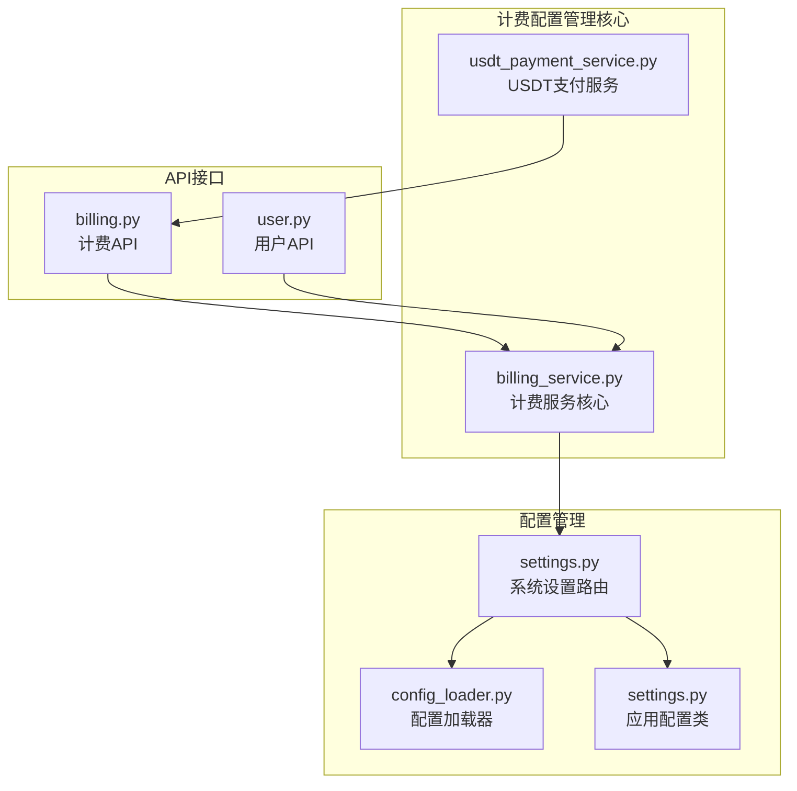
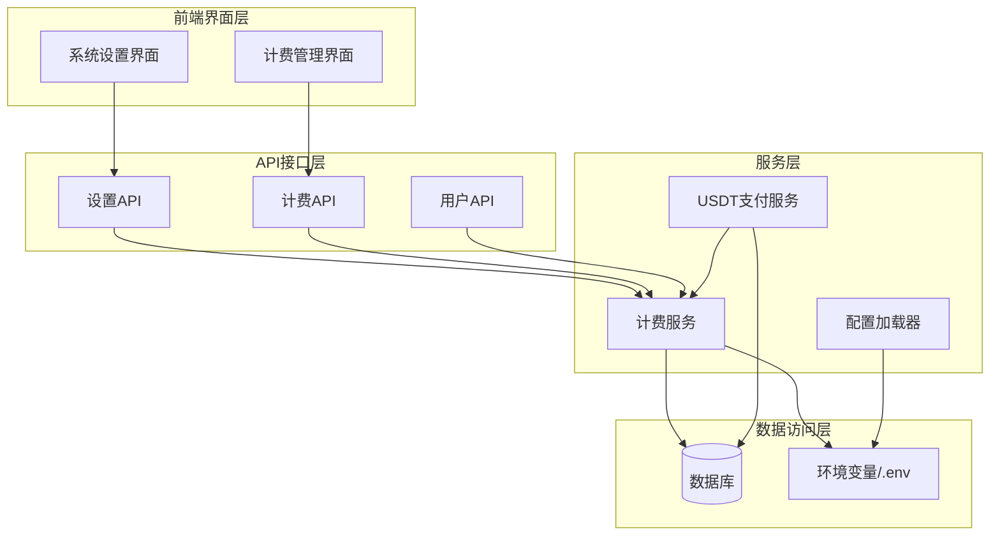
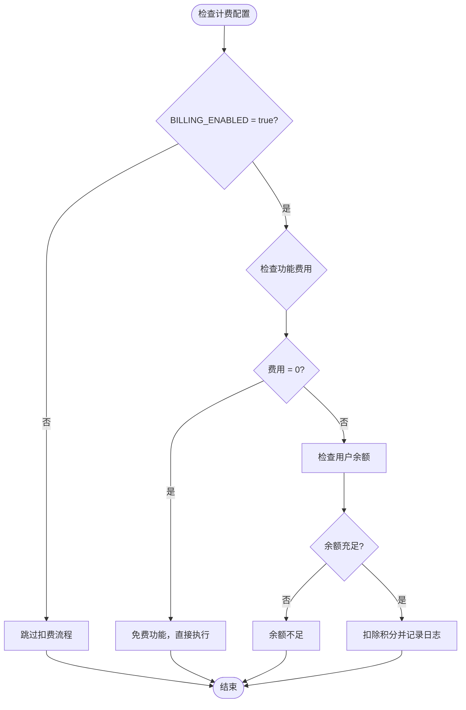
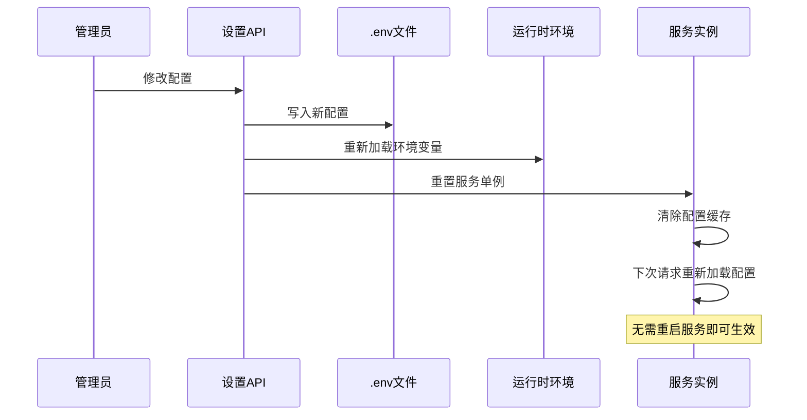
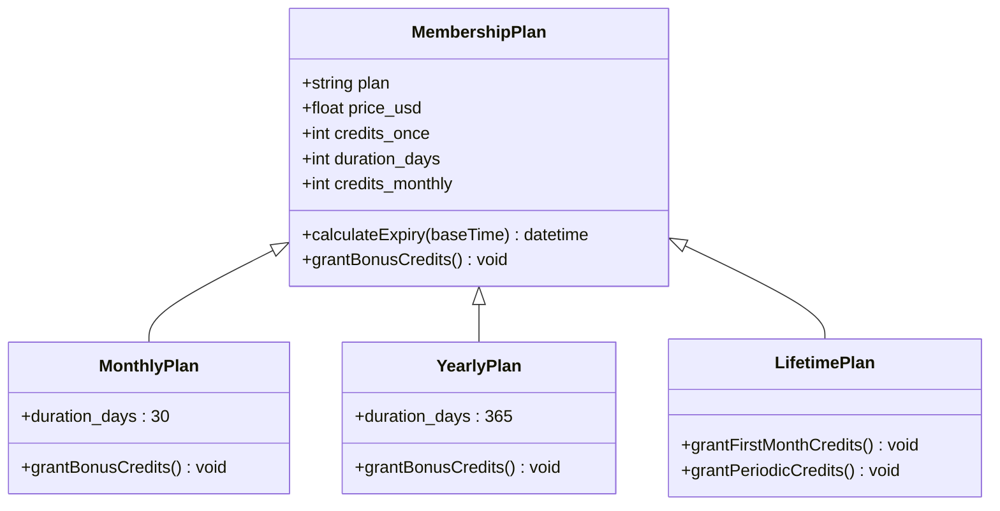
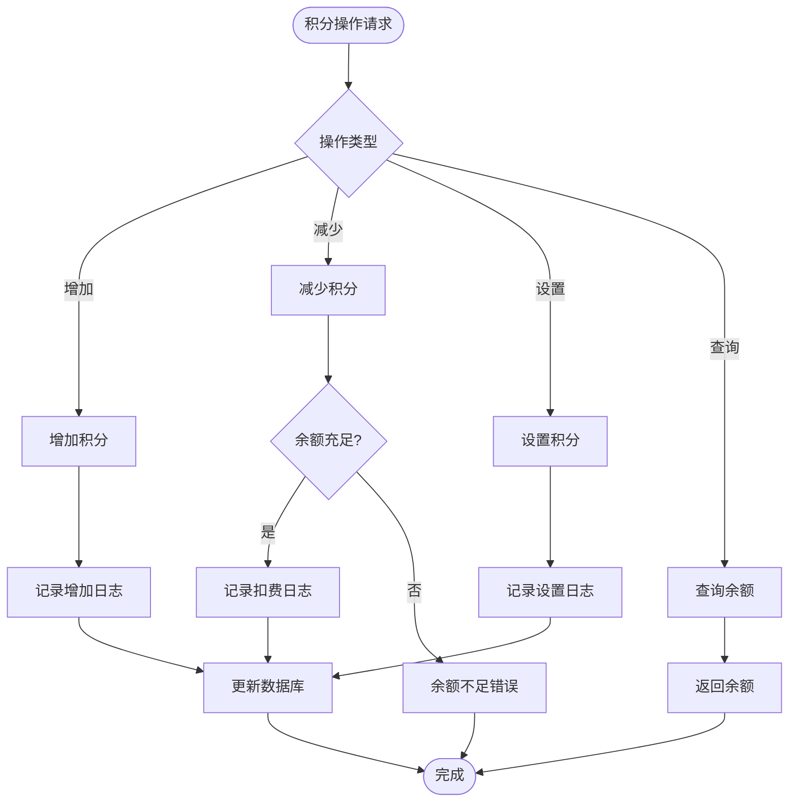
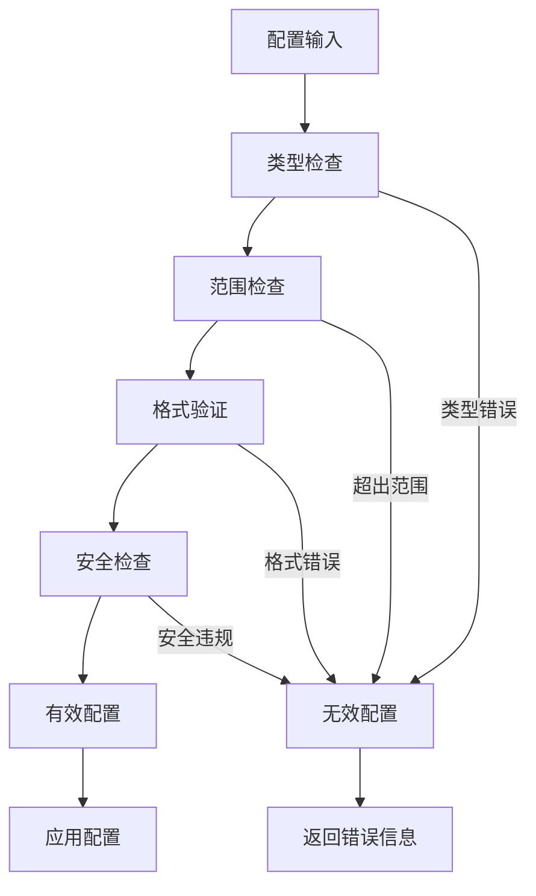
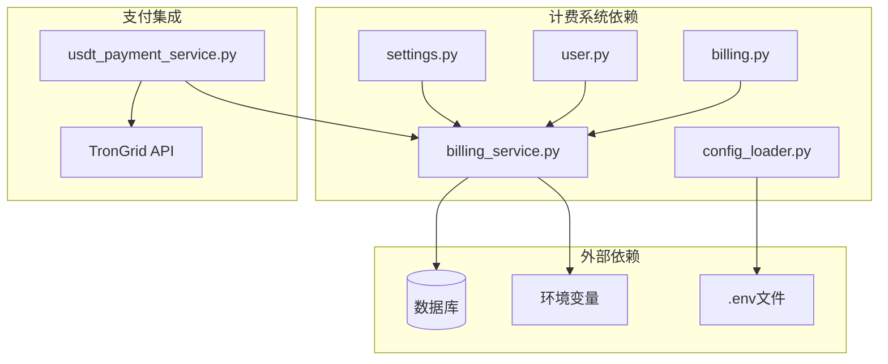
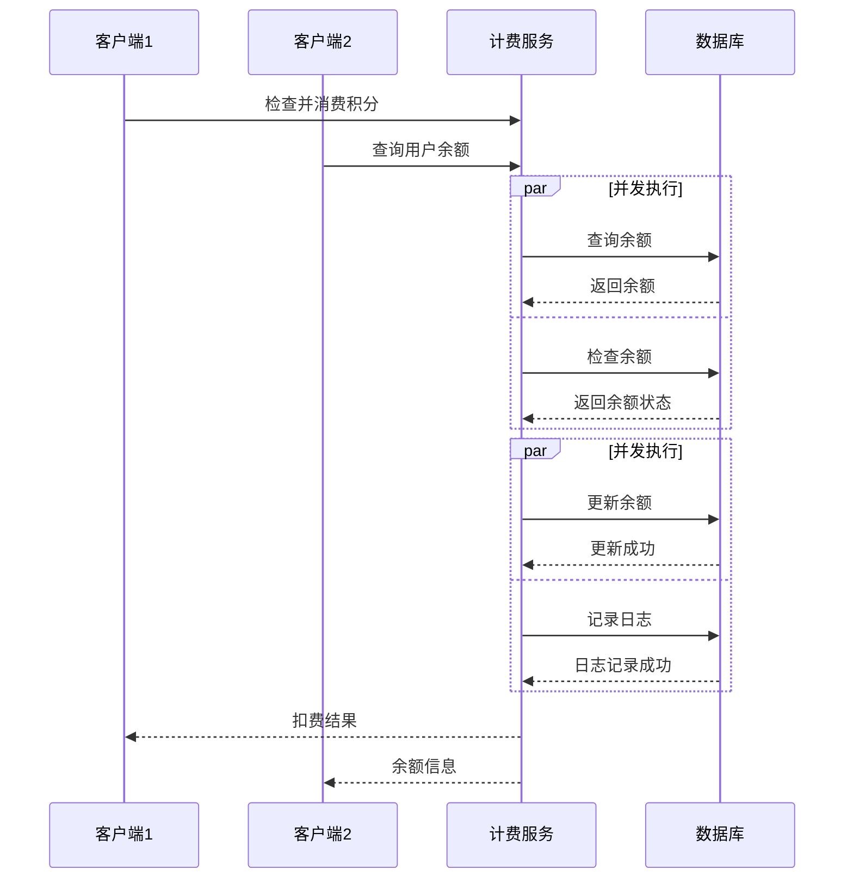
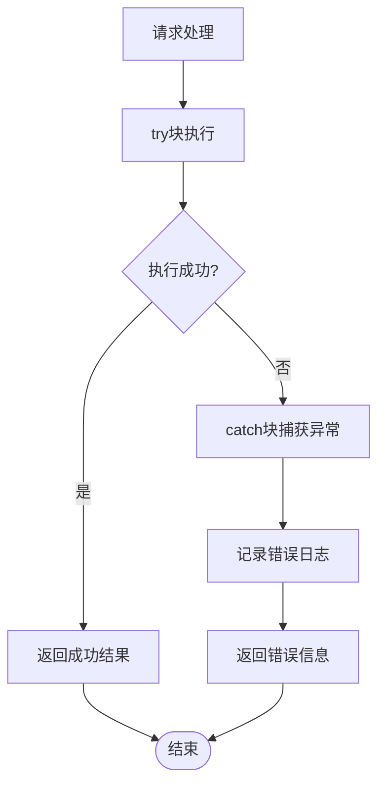

# 计费配置管理

<cite>
**本文档引用的文件**
- [billing_service.py](file://backend_api_python/app/services/billing_service.py)
- [billing.py](file://backend_api_python/app/routes/billing.py)
- [settings.py](file://backend_api_python/app/routes/settings.py)
- [config_loader.py](file://backend_api_python/app/utils/config_loader.py)
- [settings.py](file://backend_api_python/app/config/settings.py)
- [user.py](file://backend_api_python/app/routes/user.py)
- [usdt_payment_service.py](file://backend_api_python/app/services/usdt_payment_service.py)
</cite>

## 目录
1. [简介](#简介)
2. [项目结构](#项目结构)
3. [核心组件](#核心组件)
4. [架构概览](#架构概览)
5. [详细组件分析](#详细组件分析)
6. [依赖关系分析](#依赖关系分析)
7. [性能考量](#性能考量)
8. [故障排除指南](#故障排除指南)
9. [结论](#结论)
10. [附录](#附录)

## 简介

QuantDinger计费配置管理系统是一个完整的商业化解决方案，负责用户积分余额管理、功能扣费、会员状态与套餐发放。该系统采用环境变量驱动的配置管理模式，支持动态配置更新和热部署。

系统的核心特性包括：
- **全局计费开关控制**：通过BILLING_ENABLED实现全局功能收费控制
- **功能费用配置**：支持多种AI分析功能的成本定价（AI Analysis、AI Code Generation等）
- **动态配置更新机制**：支持运行时配置热更新，无需重启服务
- **会员套餐体系**：提供月卡、年卡、终身卡三种会员套餐
- **积分管理系统**：完整的积分增减、转账、审计功能

## 项目结构

计费配置管理相关的文件组织结构如下：

**图表来源**
- [billing_service.py:1-747](file://backend_api_python/app/services/billing_service.py#L1-L747)
- [settings.py:1-1418](file://backend_api_python/app/routes/settings.py#L1-L1418)
- [billing.py:1-243](file://backend_api_python/app/routes/billing.py#L1-L243)

**章节来源**
- [billing_service.py:1-747](file://backend_api_python/app/services/billing_service.py#L1-L747)
- [settings.py:1-1418](file://backend_api_python/app/routes/settings.py#L1-L1418)

## 核心组件

### 计费服务类（BillingService）

计费服务是整个计费系统的核心，负责处理所有与计费相关的业务逻辑。

**主要功能**：
- 计费配置管理（环境变量驱动）
- 用户积分余额查询与管理
- 功能费用计算与扣费
- 会员套餐购买与管理
- 积分日志记录与审计

**配置缓存机制**：
- 缓存TTL：60秒
- 支持配置热更新
- 类型安全的配置解析

**章节来源**
- [billing_service.py:47-86](file://backend_api_python/app/services/billing_service.py#L47-L86)

### 系统设置管理

系统设置模块提供了完整的配置管理界面，支持通过Web界面进行配置修改。

**配置分类**：
- 安全认证配置
- AI/LLM配置
- 数据源配置
- 计费配置（核心关注点）

**配置持久化**：
- .env文件持久化
- 支持密码字段安全存储
- 配置变更审计

**章节来源**
- [settings.py:732-877](file://backend_api_python/app/routes/settings.py#L732-L877)

## 架构概览

计费配置管理系统的整体架构采用分层设计，确保了高内聚低耦合的特性。

**图表来源**
- [billing_service.py:1-747](file://backend_api_python/app/services/billing_service.py#L1-L747)
- [settings.py:1-1418](file://backend_api_python/app/routes/settings.py#L1-L1418)
- [billing.py:1-243](file://backend_api_python/app/routes/billing.py#L1-L243)

## 详细组件分析

### 计费配置管理

#### 全局计费开关控制

系统通过环境变量实现全局计费开关控制，确保计费功能的灵活启停。

**图表来源**
- [billing_service.py:450-515](file://backend_api_python/app/services/billing_service.py#L450-L515)

#### 功能费用配置

系统支持多种AI分析功能的成本配置，每种功能都有独立的费用定价。

**功能费用配置键名**：
- `BILLING_COST_AI_ANALYSIS`：AI分析费用（每标的）
- `BILLING_COST_AI_CODE_GEN`：AI代码生成费用
- `BILLING_COST_POLYMARKET_DEEP_ANALYSIS`：深度分析费用

**费用计算规则**：
- AI分析：费用 = 单价 × 分析标的数量
- 代码生成：固定单价
- 深度分析：固定单价

**章节来源**
- [billing_service.py:24-44](file://backend_api_python/app/services/billing_service.py#L24-L44)
- [settings.py:849-861](file://backend_api_python/app/routes/settings.py#L849-L861)

### 动态配置更新机制

系统实现了完整的动态配置更新机制，支持运行时配置热更新。

**图表来源**
- [settings.py:1114-1206](file://backend_api_python/app/routes/settings.py#L1114-L1206)

**配置更新流程**：
1. 管理员通过Web界面修改配置
2. 系统将配置写入.env文件
3. 重新加载运行时环境变量
4. 重置相关服务单例
5. 清除配置缓存
6. 下次请求自动使用新配置

**章节来源**
- [settings.py:23-70](file://backend_api_python/app/routes/settings.py#L23-L70)
- [config_loader.py:244-251](file://backend_api_python/app/utils/config_loader.py#L244-L251)

### 会员套餐管理

系统提供三种会员套餐，支持不同的价格和权益。

**图表来源**
- [billing_service.py:160-200](file://backend_api_python/app/services/billing_service.py#L160-L200)

**会员套餐特性**：
- **月卡**：30天有效期，购买即获得一次性积分奖励
- **年卡**：365天有效期，购买即获得大量积分奖励  
- **终身卡**：长期有效，每月定期发放积分奖励

**章节来源**
- [billing_service.py:158-448](file://backend_api_python/app/services/billing_service.py#L158-L448)

### 积分管理系统

系统实现了完整的积分管理功能，包括积分增减、转账、审计等。

**图表来源**
- [billing_service.py:516-616](file://backend_api_python/app/services/billing_service.py#L516-L616)

**积分操作类型**：
- **充值**：用户购买或活动奖励
- **消费**：使用AI分析等功能
- **调整**：管理员手动调整
- **转账**：用户间转账（需额外权限）

**章节来源**
- [billing_service.py:98-116](file://backend_api_python/app/services/billing_service.py#L98-L116)
- [billing_service.py:516-716](file://backend_api_python/app/services/billing_service.py#L516-L716)

### 配置验证机制

系统实现了多层次的配置验证机制，确保配置的安全性和有效性。

**配置验证流程**：

**图表来源**
- [config_loader.py:164-216](file://backend_api_python/app/utils/config_loader.py#L164-L216)

**验证规则**：
- **类型验证**：确保配置值符合预期类型
- **范围验证**：检查数值是否在合理范围内
- **格式验证**：验证字符串格式（如邮箱、URL等）
- **安全验证**：防止注入攻击和恶意配置

**章节来源**
- [config_loader.py:164-216](file://backend_api_python/app/utils/config_loader.py#L164-L216)

## 依赖关系分析

计费配置管理系统与其他组件的依赖关系如下：

**图表来源**
- [billing_service.py:18-21](file://backend_api_python/app/services/billing_service.py#L18-L21)
- [usdt_payment_service.py:16-18](file://backend_api_python/app/services/usdt_payment_service.py#L16-L18)

**依赖特点**：
- **低耦合**：计费服务通过接口与外部组件交互
- **可扩展**：支持新增支付方式和服务提供商
- **可测试**：清晰的依赖边界便于单元测试

**章节来源**
- [billing_service.py:18-21](file://backend_api_python/app/services/billing_service.py#L18-L21)
- [usdt_payment_service.py:16-18](file://backend_api_python/app/services/usdt_payment_service.py#L16-L18)

## 性能考量

### 配置缓存策略

系统采用了多级缓存策略来优化性能：

**配置缓存层次**：
1. **内存缓存**：BillingService内部缓存（60秒TTL）
2. **配置缓存**：全局配置加载器缓存
3. **数据库缓存**：用户积分余额缓存

**缓存优化效果**：
- 减少环境变量读取次数
- 降低数据库查询压力
- 提高API响应速度

### 并发处理

系统支持高并发场景下的计费操作：

**图表来源**
- [billing_service.py:450-515](file://backend_api_python/app/services/billing_service.py#L450-L515)

## 故障排除指南

### 常见问题及解决方案

**配置更新不生效**：
1. 检查.env文件权限
2. 确认服务进程已重启
3. 验证配置键名正确性

**积分扣费异常**：
1. 检查用户余额是否充足
2. 验证功能费用配置
3. 查看积分日志记录

**会员购买失败**：
1. 确认支付配置正确
2. 检查数据库连接
3. 验证用户状态

**章节来源**
- [billing_service.py:516-716](file://backend_api_python/app/services/billing_service.py#L516-L716)

### 错误处理机制

系统实现了完善的错误处理机制：

**图表来源**
- [billing_service.py:113-115](file://backend_api_python/app/services/billing_service.py#L113-L115)

## 结论

QuantDinger计费配置管理系统是一个设计精良的商业化解决方案，具有以下优势：

**技术优势**：
- 环境变量驱动的配置管理，支持动态热更新
- 完整的积分管理和审计功能
- 多层次的配置验证机制
- 高性能的缓存策略

**业务价值**：
- 灵活的计费模式支持
- 完善的会员管理体系
- 安全可靠的支付集成
- 易于扩展的架构设计

**改进建议**：
- 增加配置版本管理
- 实现配置回滚机制
- 加强配置变更通知
- 优化批量配置更新

## 附录

### 配置项映射表

| 配置键名 | 类型 | 默认值 | 描述 |
|---------|------|--------|------|
| BILLING_ENABLED | boolean | False | 启用计费系统 |
| BILLING_COST_AI_ANALYSIS | integer | 10 | AI分析费用（每标的） |
| BILLING_COST_AI_CODE_GEN | integer | 30 | AI代码生成费用 |
| BILLING_COST_POLYMARKET_DEEP_ANALYSIS | integer | 15 | 深度分析费用 |
| MEMBERSHIP_MONTHLY_PRICE_USD | float | 19.9 | 月卡价格 |
| MEMBERSHIP_YEARLY_PRICE_USD | float | 199.0 | 年卡价格 |
| MEMBERSHIP_LIFETIME_PRICE_USD | float | 499.0 | 终身卡价格 |

### 安全配置建议

**敏感配置保护**：
- 使用强密码作为SECRET_KEY
- 定期轮换管理员凭据
- 启用HTTPS传输
- 实施访问控制

**配置审计功能**：
- 记录所有配置变更
- 监控异常访问行为
- 定期安全审查
- 备份重要配置