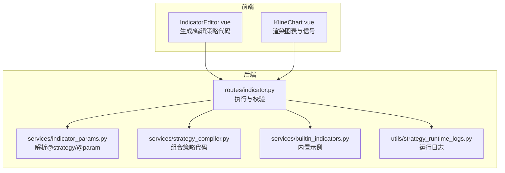
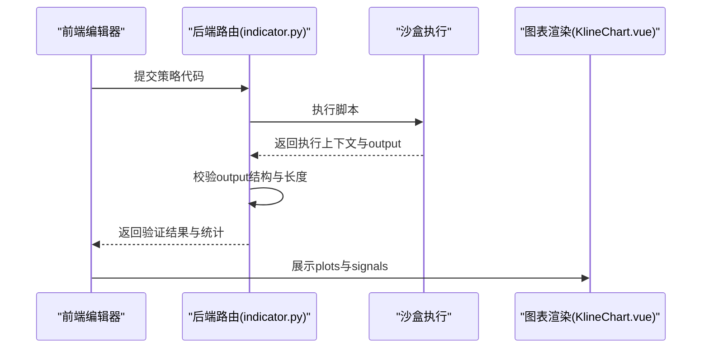
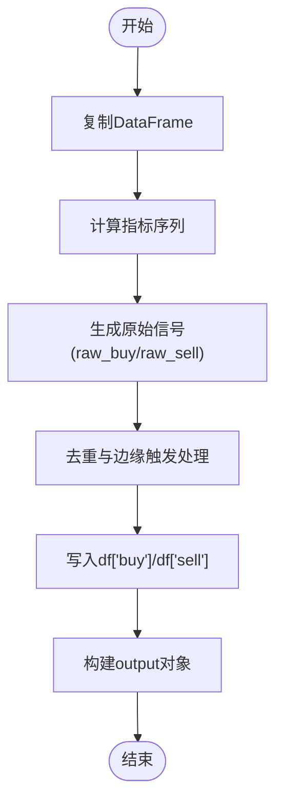
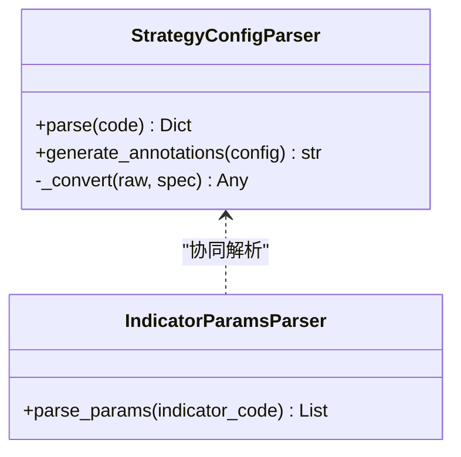
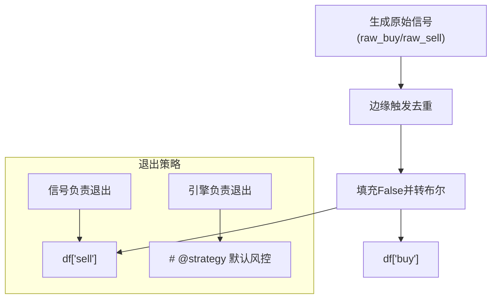
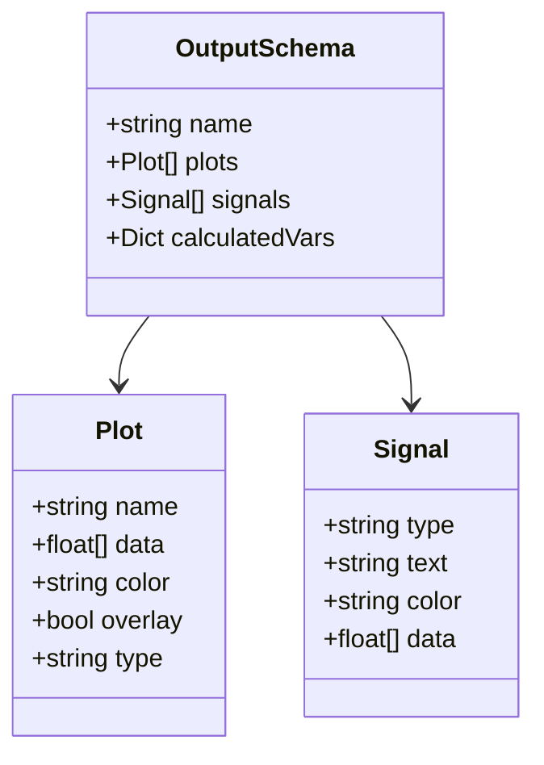
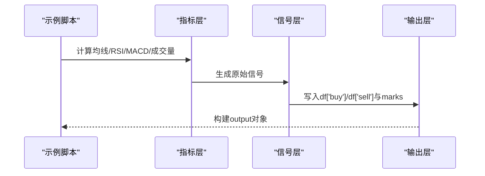
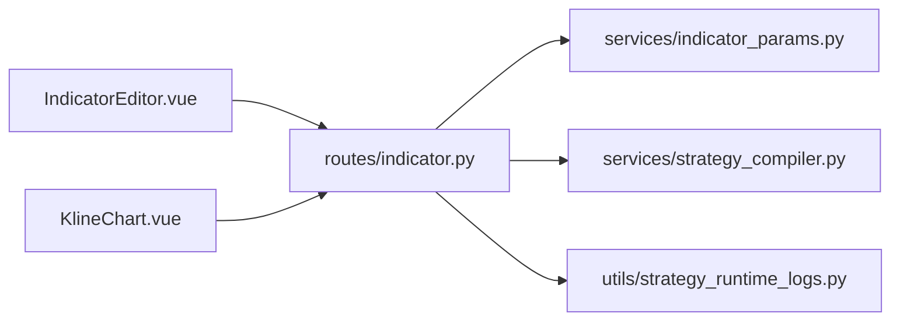
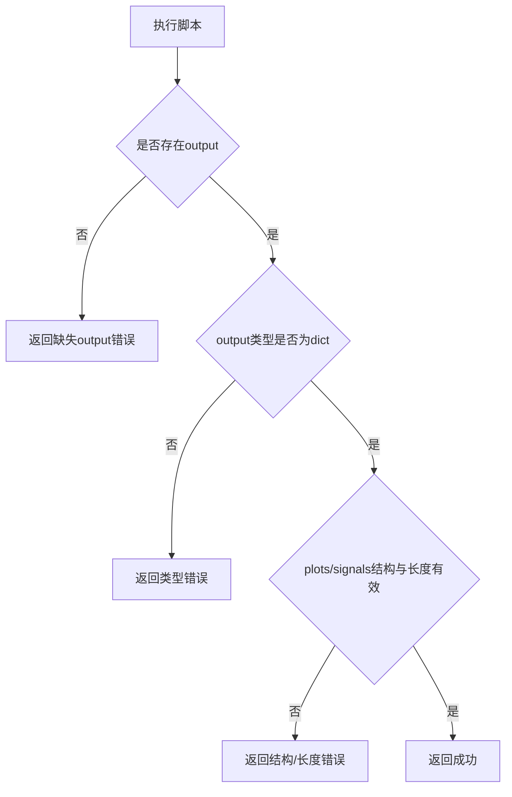

# IndicatorStrategy开发

<cite>
**本文引用的文件**   
- [STRATEGY_DEV_GUIDE_CN.md](file://docs/STRATEGY_DEV_GUIDE_CN.md)
- [STRATEGY_DEV_GUIDE.md](file://docs/STRATEGY_DEV_GUIDE.md)
- [dual_ma_with_params.py](file://docs/examples/dual_ma_with_params.py)
- [multi_indicator_composite.py](file://docs/examples/multi_indicator_composite.py)
- [cross_sectional_momentum_rsi.py](file://docs/examples/cross_sectional_momentum_rsi.py)
- [builtin_indicators.py](file://backend_api_python/app/services/builtin_indicators.py)
- [indicator_params.py](file://backend_api_python/app/services/indicator_params.py)
- [indicator.py](file://backend_api_python/app/routes/indicator.py)
- [strategy_compiler.py](file://backend_api_python/app/services/strategy_compiler.py)
- [KlineChart.vue](file://frontend/src/views/indicator-analysis/components/KlineChart.vue)
- [IndicatorEditor.vue](file://frontend/src/views/indicator-analysis/components/IndicatorEditor.vue)
- [strategy_runtime_logs.py](file://backend_api_python/app/utils/strategy_runtime_logs.py)
</cite>

## 目录
1. [引言](#引言)
2. [项目结构](#项目结构)
3. [核心组件](#核心组件)
4. [架构总览](#架构总览)
5. [详细组件分析](#详细组件分析)
6. [依赖关系分析](#依赖关系分析)
7. [性能考量](#性能考量)
8. [故障排查指南](#故障排查指南)
9. [结论](#结论)
10. [附录](#附录)

## 引言
本指南面向策略开发者，系统讲解基于DataFrame的IndicatorStrategy开发方法论与实践路径。内容覆盖元数据声明、默认参数设置、指标计算、信号生成、图表输出与回测语义，阐明三层次架构（指标层、信号层、风险默认层）的设计理念，并对比engine-managed与signal-managed两种退出策略的差异。文中提供多类示例与可视化图示，帮助读者快速掌握从原型到可回测、可落地的完整流程。

## 项目结构
QuantDinger后端提供两类策略开发路径：
- IndicatorStrategy：基于df的指标/信号脚本，用于IDE、图表渲染与信号型回测
- ScriptStrategy：基于事件驱动的运行时脚本，用于策略回测与实盘执行

本指南聚焦IndicatorStrategy的开发与集成，涉及的关键模块包括：
- 文档与示例：策略开发指南、示例脚本
- 后端服务：参数解析、策略编译、路由校验
- 前端组件：指标编辑器、K线图表渲染

**图表来源**
- [IndicatorEditor.vue:388-412](file://frontend/src/views/indicator-analysis/components/IndicatorEditor.vue#L388-L412)
- [KlineChart.vue:1181-1220](file://frontend/src/views/indicator-analysis/components/KlineChart.vue#L1181-L1220)
- [indicator.py:178-288](file://backend_api_python/app/routes/indicator.py#L178-L288)
- [indicator_params.py:37-149](file://backend_api_python/app/services/indicator_params.py#L37-L149)
- [strategy_compiler.py:1-200](file://backend_api_python/app/services/strategy_compiler.py#L1-L200)
- [builtin_indicators.py:17-185](file://backend_api_python/app/services/builtin_indicators.py#L17-L185)
- [strategy_runtime_logs.py:11-30](file://backend_api_python/app/utils/strategy_runtime_logs.py#L11-L30)

**章节来源**
- [STRATEGY_DEV_GUIDE_CN.md:1-120](file://docs/STRATEGY_DEV_GUIDE_CN.md#L1-L120)
- [STRATEGY_DEV_GUIDE.md:1-120](file://docs/STRATEGY_DEV_GUIDE.md#L1-L120)

## 核心组件
- 元数据与默认配置
  - # @param：声明可调参数，格式为“# @param 名称 类型 默认值 描述”
  - # @strategy：声明默认风控与仓位配置，如止损、止盈、跟踪止损、入场比例、交易方向等
- 指标层：计算技术指标序列（如均线、RSI、MACD、布林带等）
- 信号层：生成布尔型 buy/sell 信号列
- 图表输出：output对象包含name、plots、signals、calculatedVars等键
- 回测语义：引擎读取df['buy']/df['sell']，按“收盘确认、下一根开盘成交”语义回测

**章节来源**
- [STRATEGY_DEV_GUIDE_CN.md:93-160](file://docs/STRATEGY_DEV_GUIDE_CN.md#L93-L160)
- [STRATEGY_DEV_GUIDE_CN.md:243-295](file://docs/STRATEGY_DEV_GUIDE_CN.md#L243-L295)
- [indicator.py:178-288](file://backend_api_python/app/routes/indicator.py#L178-L288)

## 架构总览
IndicatorStrategy的执行链路如下：
- 前端编辑器生成策略代码
- 后端路由接收代码，执行沙盒运行
- 校验output结构与长度一致性
- 渲染图表与信号，供回测与分析使用

**图表来源**
- [indicator.py:178-288](file://backend_api_python/app/routes/indicator.py#L178-L288)
- [KlineChart.vue:1181-1220](file://frontend/src/views/indicator-analysis/components/KlineChart.vue#L1181-L1220)

**章节来源**
- [indicator.py:178-288](file://backend_api_python/app/routes/indicator.py#L178-L288)
- [KlineChart.vue:1181-1220](file://frontend/src/views/indicator-analysis/components/KlineChart.vue#L1181-L1220)

## 详细组件分析

### 三层次架构设计
- 指标层：计算各类技术指标序列，确保与DataFrame长度一致
- 信号层：生成df['buy']与df['sell']布尔信号，避免重复触发
- 风险默认层：通过# @strategy声明默认风控与仓位，不直接在代码中生成止损列

**图表来源**
- [STRATEGY_DEV_GUIDE_CN.md:150-200](file://docs/STRATEGY_DEV_GUIDE_CN.md#L150-L200)
- [STRATEGY_DEV_GUIDE_CN.md:243-295](file://docs/STRATEGY_DEV_GUIDE_CN.md#L243-L295)

**章节来源**
- [STRATEGY_DEV_GUIDE_CN.md:57-94](file://docs/STRATEGY_DEV_GUIDE_CN.md#L57-L94)
- [STRATEGY_DEV_GUIDE_CN.md:150-200](file://docs/STRATEGY_DEV_GUIDE_CN.md#L150-L200)

### 元数据与参数注解
- # @param：用于声明可调参数，便于前端与AI调参识别
- # @strategy：用于声明默认风控与仓位配置，后端解析器会校验键名与取值范围

**图表来源**
- [indicator_params.py:37-149](file://backend_api_python/app/services/indicator_params.py#L37-L149)

**章节来源**
- [indicator_params.py:37-149](file://backend_api_python/app/services/indicator_params.py#L37-L149)

### 信号生成规则与退出策略
- 信号生成：使用边缘触发避免重复信号，确保布尔列与DataFrame长度一致
- 退出策略两类：
  - 信号负责退出：在信号层直接生成sell信号
  - 引擎负责退出：通过# @strategy声明固定止损、止盈、跟踪止损等

**图表来源**
- [STRATEGY_DEV_GUIDE_CN.md:177-242](file://docs/STRATEGY_DEV_GUIDE_CN.md#L177-L242)

**章节来源**
- [STRATEGY_DEV_GUIDE_CN.md:177-242](file://docs/STRATEGY_DEV_GUIDE_CN.md#L177-L242)

### 图表输出与前端渲染
- output对象必须包含name、plots、signals等键
- plots与signals的data长度需与DataFrame一致，NaN转换为null
- 前端组件负责将信号点位绘制到K线图上

**图表来源**
- [KlineChart.vue:1181-1220](file://frontend/src/views/indicator-analysis/components/KlineChart.vue#L1181-L1220)
- [STRATEGY_DEV_GUIDE_CN.md:243-295](file://docs/STRATEGY_DEV_GUIDE_CN.md#L243-L295)

**章节来源**
- [KlineChart.vue:1181-1220](file://frontend/src/views/indicator-analysis/components/KlineChart.vue#L1181-L1220)
- [STRATEGY_DEV_GUIDE_CN.md:243-295](file://docs/STRATEGY_DEV_GUIDE_CN.md#L243-L295)

### 示例策略实现
- 双均线策略：演示# @param与# @strategy的标准写法
- 多指标组合：演示如何组合均线、RSI、MACD与成交量过滤
- 截面动量RSI：演示跨标的打分与排序思路（研究用途）

**图表来源**
- [dual_ma_with_params.py:17-64](file://docs/examples/dual_ma_with_params.py#L17-L64)
- [multi_indicator_composite.py:13-109](file://docs/examples/multi_indicator_composite.py#L13-L109)
- [cross_sectional_momentum_rsi.py:22-71](file://docs/examples/cross_sectional_momentum_rsi.py#L22-L71)

**章节来源**
- [dual_ma_with_params.py:17-64](file://docs/examples/dual_ma_with_params.py#L17-L64)
- [multi_indicator_composite.py:13-109](file://docs/examples/multi_indicator_composite.py#L13-L109)
- [cross_sectional_momentum_rsi.py:22-71](file://docs/examples/cross_sectional_momentum_rsi.py#L22-L71)

### 内置示例与模板
- 后端内置多种示例策略，涵盖RSI、双均线、MACD、布林带等，便于快速上手
- 示例遵循相同的元数据与输出规范，可直接导入到IDE中使用

**章节来源**
- [builtin_indicators.py:17-185](file://backend_api_python/app/services/builtin_indicators.py#L17-L185)

## 依赖关系分析
- 前端编辑器与图表组件依赖后端路由的执行与校验结果
- 后端路由依赖参数解析器与策略编译器
- 日志服务用于持久化策略运行日志，便于问题定位

**图表来源**
- [IndicatorEditor.vue:388-412](file://frontend/src/views/indicator-analysis/components/IndicatorEditor.vue#L388-L412)
- [KlineChart.vue:1181-1220](file://frontend/src/views/indicator-analysis/components/KlineChart.vue#L1181-L1220)
- [indicator.py:178-288](file://backend_api_python/app/routes/indicator.py#L178-L288)
- [indicator_params.py:37-149](file://backend_api_python/app/services/indicator_params.py#L37-L149)
- [strategy_compiler.py:1-200](file://backend_api_python/app/services/strategy_compiler.py#L1-L200)
- [strategy_runtime_logs.py:11-30](file://backend_api_python/app/utils/strategy_runtime_logs.py#L11-L30)

**章节来源**
- [indicator.py:178-288](file://backend_api_python/app/routes/indicator.py#L178-L288)
- [strategy_runtime_logs.py:11-30](file://backend_api_python/app/utils/strategy_runtime_logs.py#L11-L30)

## 性能考量
- 指标计算尽量使用向量化操作，避免循环
- 信号生成采用边缘触发，减少重复信号带来的回测噪音
- output对象的plots与signals数据长度与DataFrame一致，避免额外转换成本
- 前端渲染对NaN进行null转换，降低图表渲染负担

[本节为通用指导，无需特定文件引用]

## 故障排查指南
- 缺少output变量：确保脚本末尾定义output字典
- output结构非法：确保包含plots或signals键，且均为列表
- plots/signals缺少data字段或长度不匹配：确保data长度与DataFrame一致
- 未知的@strategy键：仅支持已知的有效键，避免拼写错误
- 运行时安全错误：检查是否使用了不允许的操作（如网络请求、文件读写等）

**图表来源**
- [indicator.py:178-288](file://backend_api_python/app/routes/indicator.py#L178-L288)

**章节来源**
- [indicator.py:178-288](file://backend_api_python/app/routes/indicator.py#L178-L288)

## 结论
IndicatorStrategy提供了从指标研究到信号型回测的高效路径。通过三层次架构分离关注点、严格遵守元数据与输出规范、明确退出策略归属，开发者可以在IDE中快速验证想法，并在保存后通过持久化策略回测进一步确认落地可行性。当策略需要运行时状态与动态风控时，再迁移至ScriptStrategy。

[本节为总结，无需特定文件引用]

## 附录
- 开发流程建议
  - 先用IndicatorStrategy把想法原型化
  - 验证图表、信号密度与next-bar-open回测行为
  - 补充# @param与# @strategy元数据
  - 明确退出是信号负责还是引擎负责
  - 保存策略后，从持久化记录跑策略回测
  - 仅在确实需要运行时仓位管理时，迁移到ScriptStrategy
  - 配置、凭证与市场语义确认后再进入模拟盘或实盘

**章节来源**
- [STRATEGY_DEV_GUIDE_CN.md:1260-1270](file://docs/STRATEGY_DEV_GUIDE_CN.md#L1260-L1270)
- [STRATEGY_DEV_GUIDE.md:1260-1270](file://docs/STRATEGY_DEV_GUIDE.md#L1260-L1270)