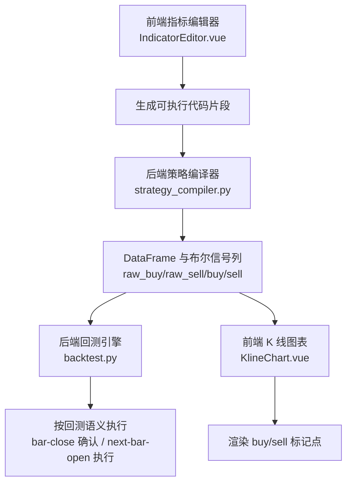
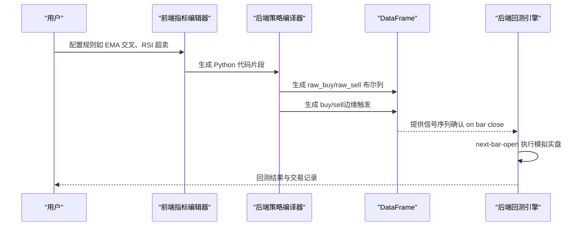
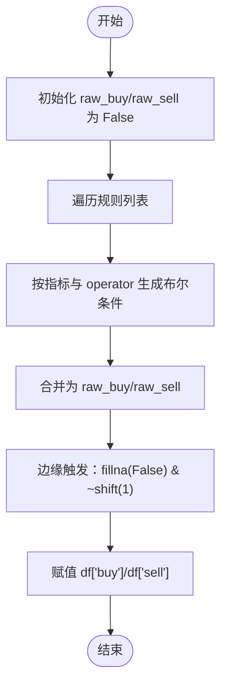
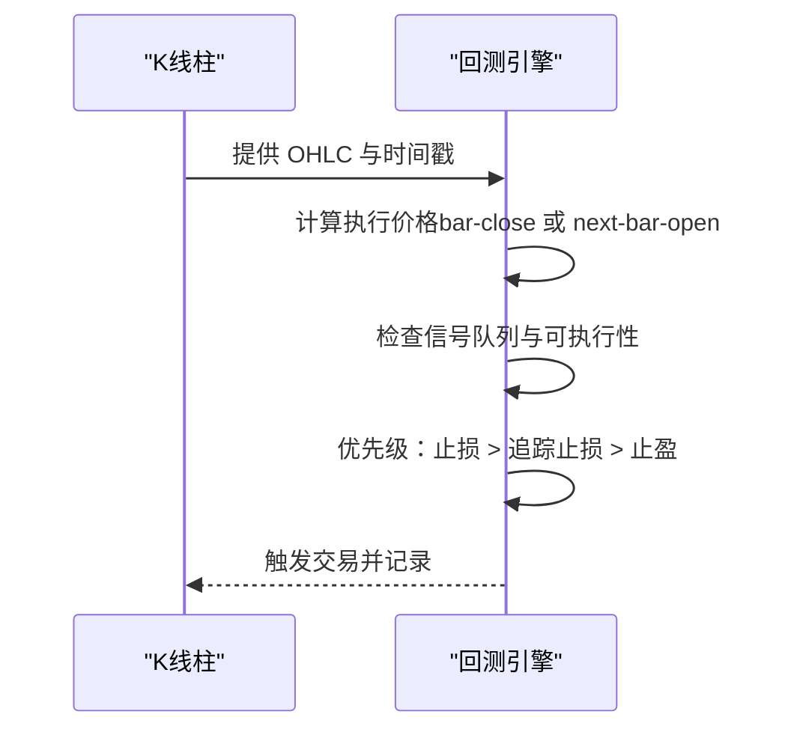
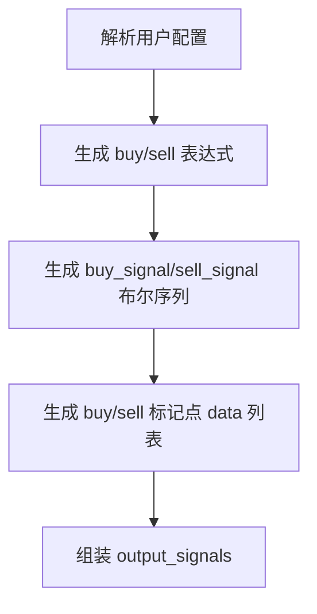
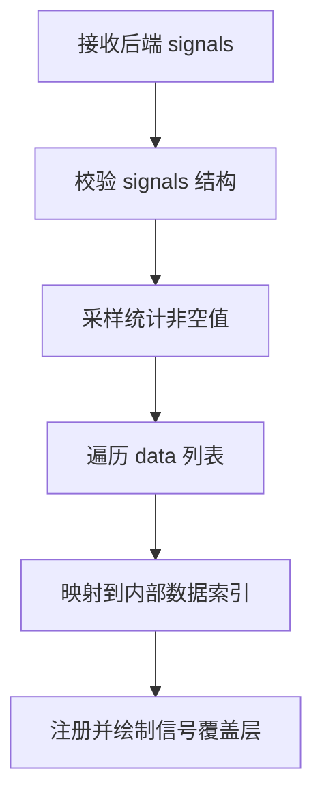
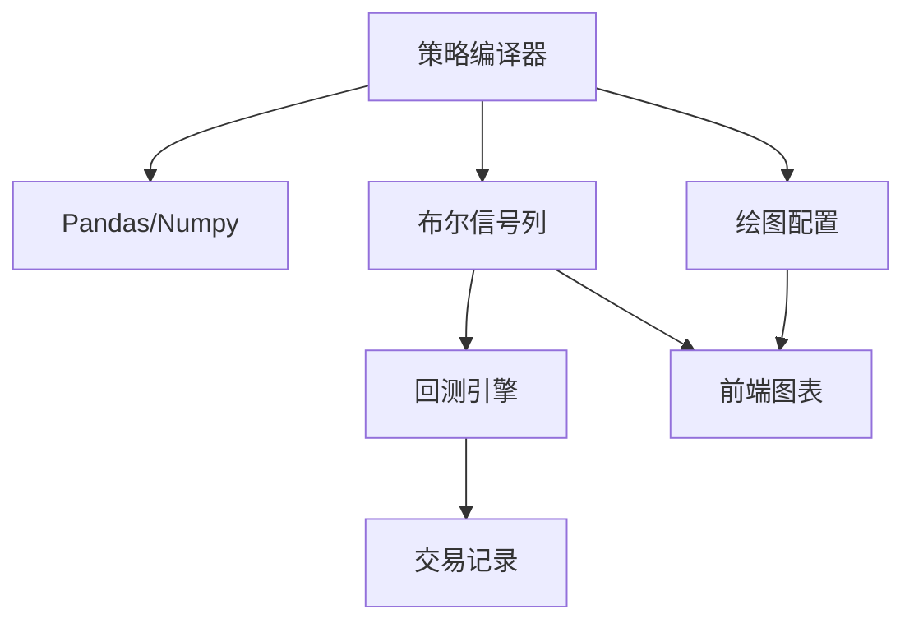

# 信号生成与布尔逻辑

<cite>
**本文引用的文件**
- [strategy_compiler.py](file://backend_api_python/app/services/strategy_compiler.py)
- [backtest.py](file://backend_api_python/app/services/backtest.py)
- [indicator.py](file://backend_api_python/app/routes/indicator.py)
- [IndicatorEditor.vue](file://frontend/src/views/indicator-analysis/components/IndicatorEditor.vue)
- [KlineChart.vue](file://frontend/src/views/indicator-analysis/components/KlineChart.vue)
- [dual_ma_with_params.py](file://docs/examples/dual_ma_with_params.py)
- [multi_indicator_composite.py](file://docs/examples/multi_indicator_composite.py)
- [cross_sectional_momentum_rsi.py](file://docs/examples/cross_sectional_momentum_rsi.py)
- [STRATEGY_DEV_GUIDE_CN.md](file://docs/STRATEGY_DEV_GUIDE_CN.md)
</cite>

## 目录
1. [引言](#引言)
2. [项目结构](#项目结构)
3. [核心组件](#核心组件)
4. [架构总览](#架构总览)
5. [详细组件分析](#详细组件分析)
6. [依赖分析](#依赖分析)
7. [性能考虑](#性能考虑)
8. [故障排查指南](#故障排查指南)
9. [结论](#结论)
10. [附录](#附录)

## 引言
本指南聚焦于 IndicatorStrategy 的信号生成与布尔逻辑设计，围绕以下目标展开：
- 如何将原始条件转换为清晰的 buy/sell 信号
- 如何创建与填充布尔列（raw_buy/raw_sell、buy/sell）
- 信号触发的时机与回测语义（bar-close 确认、next-bar-open 执行）
- 信号去重与边缘触发的最佳实践
- 信号逻辑设计原则（交叉、突破、反转）
- 信号组合策略与完整示例路径

## 项目结构
本项目在后端提供策略编译与回测服务，在前端提供指标 IDE 与图表渲染。与信号生成直接相关的关键模块如下：
- 后端策略编译器：将规则转化为 Pandas 代码，生成 raw_buy/raw_sell 与最终 buy/sell
- 后端回测引擎：按 bar-close 确认、next-bar-open 执行的回测语义
- 前端指标编辑器：将用户配置映射为可执行的 Python 代码片段
- 前端 K 线图表：渲染 buy/sell 标记点

**图表来源**
- [strategy_compiler.py](file://backend_api_python/app/services/strategy_compiler.py)
- [backtest.py](file://backend_api_python/app/services/backtest.py)
- [IndicatorEditor.vue](file://frontend/src/views/indicator-analysis/components/IndicatorEditor.vue)
- [KlineChart.vue](file://frontend/src/views/indicator-analysis/components/KlineChart.vue)

**章节来源**
- [strategy_compiler.py](file://backend_api_python/app/services/strategy_compiler.py)
- [backtest.py](file://backend_api_python/app/services/backtest.py)
- [IndicatorEditor.vue](file://frontend/src/views/indicator-analysis/components/IndicatorEditor.vue)
- [KlineChart.vue](file://frontend/src/views/indicator-analysis/components/KlineChart.vue)

## 核心组件
- 策略编译器（StrategyCompiler）
  - 负责将规则（entry_rules）转换为 Pandas 代码，生成 raw_buy/raw_sell，并在末尾追加 buy/sell
  - 支持多种指标（EMA、RSI、MACD、布林带、KDJ、均线等），并针对不同 operator 生成对应的布尔条件
- 回测引擎（BacktestService）
  - 严格遵循“bar-close 确认、next-bar-open 执行”的回测语义
  - 使用 OHLC 评估触发，支持 SL/TP/追踪止损优先级
- 前端指标编辑器（IndicatorEditor.vue）
  - 将用户配置（如交叉上/下、大于/小于）映射为 Python 条件表达式，并生成 buy/sell 标记点
- 前端 K 线图表（KlineChart.vue）
  - 解析后端返回的 signals，渲染 buy/sell 标记点

**章节来源**
- [strategy_compiler.py](file://backend_api_python/app/services/strategy_compiler.py)
- [backtest.py](file://backend_api_python/app/services/backtest.py)
- [IndicatorEditor.vue](file://frontend/src/views/indicator-analysis/components/IndicatorEditor.vue)
- [KlineChart.vue](file://frontend/src/views/indicator-analysis/components/KlineChart.vue)

## 架构总览
下图展示了从规则到信号再到回测执行的全链路：

**图表来源**
- [strategy_compiler.py](file://backend_api_python/app/services/strategy_compiler.py)
- [backtest.py](file://backend_api_python/app/services/backtest.py)
- [IndicatorEditor.vue](file://frontend/src/views/indicator-analysis/components/IndicatorEditor.vue)

## 详细组件分析

### 组件A：策略编译器（生成布尔信号）
- 设计要点
  - 先生成 raw_buy/raw_sell，再通过 fillna(False) 与 shift(1) 的异或实现“边缘触发”
  - 针对不同指标与 operator 生成布尔表达式，确保与 DataFrame 长度一致
  - 支持多规则组合（OR/AND），最终汇总到 raw_buy/raw_sell
- 关键流程
  - 初始化 raw_buy/raw_sell 为 False
  - 遍历规则，按指标类型与 operator 拼接条件
  - 若存在条件，合并为 df['raw_buy'] 与 df['raw_sell']
  - 生成 df['buy'] 与 df['sell']：边缘触发版本
- 性能与复杂度
  - 时间复杂度：O(N)（逐行布尔运算），规则数量影响拼接字符串长度
  - 布尔列长度与 DataFrame 一致，便于后续回测与渲染

**图表来源**
- [strategy_compiler.py](file://backend_api_python/app/services/strategy_compiler.py)

**章节来源**
- [strategy_compiler.py](file://backend_api_python/app/services/strategy_compiler.py)

### 组件B：回测引擎（确认与执行语义）
- 设计要点
  - 信号代表“bar-close 确认”，执行发生在“next bar open”
  - 使用 OHLC 评估触发，支持强优先级顺序：止损 > 追踪止损 > 止盈
  - 支持多方向（long/short/both），并按策略配置设置默认风控
- 关键流程
  - 读取当前 OHLC 与执行价格（bar-close 或 next-bar-open）
  - 按 position 与信号类型判定是否可执行
  - 依次检查止损、追踪止损、止盈与信号退出
  - 记录交易与权益曲线

**图表来源**
- [backtest.py](file://backend_api_python/app/services/backtest.py)

**章节来源**
- [backtest.py](file://backend_api_python/app/services/backtest.py)

### 组件C：前端指标编辑器（规则到代码）
- 设计要点
  - 将用户配置（如 buy_op/sell_op、交叉上/下、大于/小于）映射为 Python 表达式
  - 生成 buy_signal_xxx 与 sell_signal_xxx，再封装为 output_signals
  - 生成 buy/sell 标记点（低/高点附近），用于图表渲染
- 关键流程
  - 解析 buy_op/sell_op
  - 生成表达式字符串（比较或交叉函数）
  - 生成 output_signals 列表，包含 type/text/data/color

**图表来源**
- [IndicatorEditor.vue](file://frontend/src/views/indicator-analysis/components/IndicatorEditor.vue)

**章节来源**
- [IndicatorEditor.vue](file://frontend/src/views/indicator-analysis/components/IndicatorEditor.vue)

### 组件D：前端 K 线图表（信号渲染）
- 设计要点
  - 解析后端返回的 signals，统计非空样本
  - 遍历 data 列表，将非空值映射到对应 K 线的时间索引
  - 注册自定义信号覆盖层，绘制圆点与带背景的文字框
- 关键流程
  - 校验 result.signals 存在且为数组
  - 过滤非空值，构建信号点集合
  - 使用 registerOverlay 绘制 buy/sell 标记

**图表来源**
- [KlineChart.vue](file://frontend/src/views/indicator-analysis/components/KlineChart.vue)

**章节来源**
- [KlineChart.vue](file://frontend/src/views/indicator-analysis/components/KlineChart.vue)

### 信号去重与边缘触发最佳实践
- 边缘触发公式
  - buy = raw_buy.fillna(False) & (~raw_buy.shift(1).fillna(False))
  - sell = raw_sell.fillna(False) & (~raw_sell.shift(1).fillna(False))
- 去重机制
  - 通过与上一根的布尔差异消除连续触发
  - 若需连续触发，可在规则层面放宽条件或显式允许
- 建议
  - 默认采用边缘触发，避免同一趋势内重复发信号
  - 对于研究用途可保留连续触发，但需在注释中标明意图

**章节来源**
- [indicator.py](file://backend_api_python/app/routes/indicator.py)
- [strategy_compiler.py](file://backend_api_python/app/services/strategy_compiler.py)

### 信号逻辑设计原则
- 交叉信号
  - 使用 shift(1) 与当前对比，确保从不满足到满足的跨线切换
  - 示例：EMA 金叉/死叉、KDJ 黄金/死亡交叉
- 突破信号
  - 价格突破上轨/下轨或中轨，结合成交量过滤
  - 示例：布林带上轨突破、均线上穿
- 反转信号
  - RSI 超卖/超买反转，结合趋势过滤
  - 示例：RSI < 阈值做多，RSI > 100-阈值做空

**章节来源**
- [strategy_compiler.py](file://backend_api_python/app/services/strategy_compiler.py)
- [multi_indicator_composite.py](file://docs/examples/multi_indicator_composite.py)

### 信号组合策略
- 组合方式
  - 使用逻辑运算符（&、|）将多个原始条件合并为 raw_buy/raw_sell
  - 可叠加指标过滤（如 MACD、成交量）
- 示例路径
  - 双均线交叉：[dual_ma_with_params.py](file://docs/examples/dual_ma_with_params.py)
  - 多指标组合：[multi_indicator_composite.py](file://docs/examples/multi_indicator_composite.py)
  - 截面策略评分（研究参考）：[cross_sectional_momentum_rsi.py](file://docs/examples/cross_sectional_momentum_rsi.py)

**章节来源**
- [multi_indicator_composite.py](file://docs/examples/multi_indicator_composite.py)
- [dual_ma_with_params.py](file://docs/examples/dual_ma_with_params.py)
- [cross_sectional_momentum_rsi.py](file://docs/examples/cross_sectional_momentum_rsi.py)

## 依赖分析
- 编译器依赖 Pandas/Numpy，生成布尔列与绘图配置
- 回测引擎依赖 DataFrame 与 OHLC，按回测语义执行
- 前端编辑器与图表依赖后端输出的 signals 与 plots

**图表来源**
- [strategy_compiler.py](file://backend_api_python/app/services/strategy_compiler.py)
- [backtest.py](file://backend_api_python/app/services/backtest.py)
- [KlineChart.vue](file://frontend/src/views/indicator-analysis/components/KlineChart.vue)

**章节来源**
- [strategy_compiler.py](file://backend_api_python/app/services/strategy_compiler.py)
- [backtest.py](file://backend_api_python/app/services/backtest.py)
- [KlineChart.vue](file://frontend/src/views/indicator-analysis/components/KlineChart.vue)

## 性能考虑
- 布尔列计算为 O(N) 操作，规则数量增加会提升字符串拼接与 eval 成本
- 建议：
  - 控制规则数量与表达式复杂度
  - 使用 fillna(False) 与 shift(1) 的边缘触发减少冗余信号
  - 对长序列回测时注意内存占用与索引访问效率

## 故障排查指南
- 常见问题
  - 缺少 output 字典或字段：检查是否定义 output = {...}
  - 信号或绘图数据长度不匹配：确保 data 长度等于 len(df)
  - 未生成 df['buy']/df['sell']：确认边缘触发公式是否正确应用
  - 信号标记渲染异常：避免使用 where(..., None).tolist()，优先显式 None 列表
- 定位方法
  - 后端验证：查看验证返回的 hints 与错误类型
  - 前端渲染：检查 signals 数据结构与非空值分布

**章节来源**
- [indicator.py](file://backend_api_python/app/routes/indicator.py)

## 结论
- IndicatorStrategy 的信号生成应遵循“原始条件 → raw_buy/raw_sell → 边缘触发 → buy/sell”的分层设计
- 回测语义强调“bar-close 确认、next-bar-open 执行”，避免前瞻
- 通过交叉、突破、反转三类信号与多指标组合，可构建稳健的信号体系
- 建议优先采用边缘触发与去重策略，避免同一趋势内的重复触发

## 附录
- 开发指南与最佳实践参考：[STRATEGY_DEV_GUIDE_CN.md](file://docs/STRATEGY_DEV_GUIDE_CN.md)
- 示例路径
  - 双均线交叉：[dual_ma_with_params.py](file://docs/examples/dual_ma_with_params.py)
  - 多指标组合：[multi_indicator_composite.py](file://docs/examples/multi_indicator_composite.py)
  - 截面策略评分（研究参考）：[cross_sectional_momentum_rsi.py](file://docs/examples/cross_sectional_momentum_rsi.py)