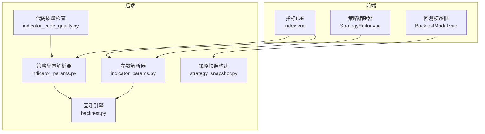
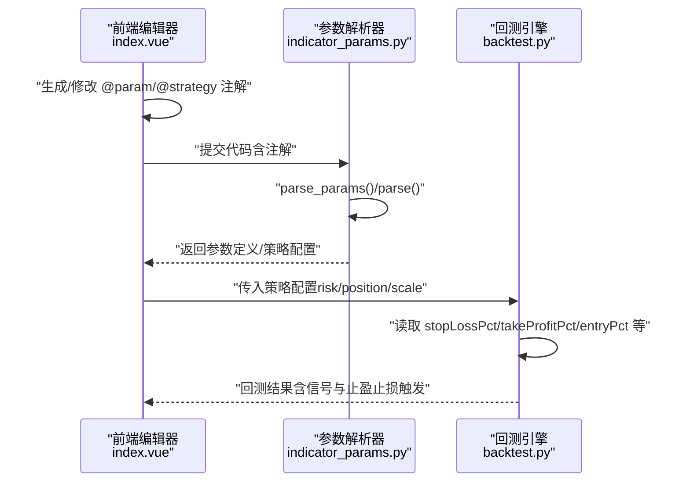
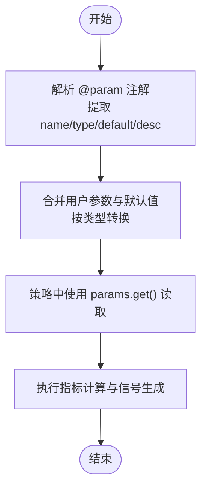
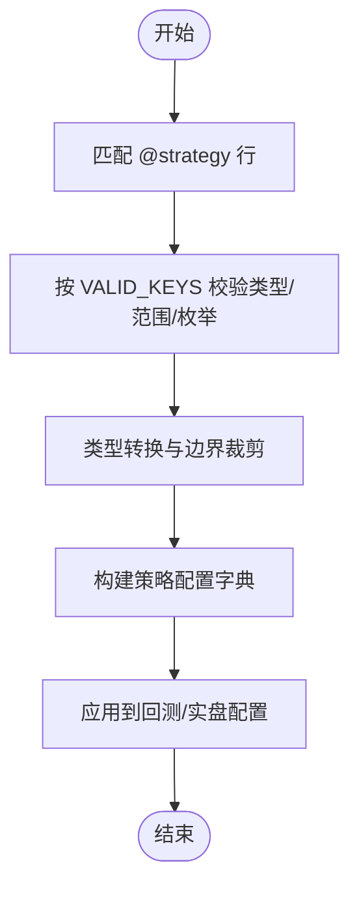
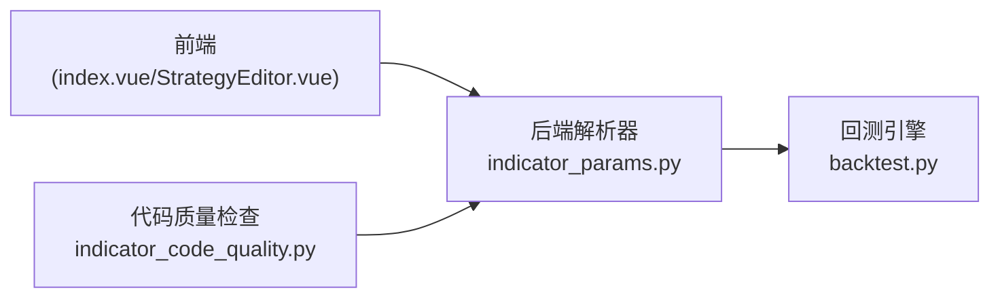
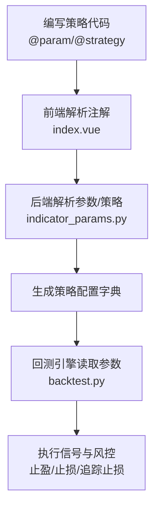

# 元数据与参数声明

<cite>
**本文引用的文件**
- [indicator_params.py](file://backend_api_python/app/services/indicator_params.py)
- [dual_ma_with_params.py](file://docs/examples/dual_ma_with_params.py)
- [multi_indicator_composite.py](file://docs/examples/multi_indicator_composite.py)
- [index.vue](file://frontend/src/views/indicator-ide/index.vue)
- [StrategyEditor.vue](file://frontend/src/views/trading-assistant/components/StrategyEditor.vue)
- [backtest.py](file://backend_api_python/app/services/backtest.py)
- [strategy.py](file://backend_api_python/app/routes/strategy.py)
- [BacktestModal.vue](file://frontend/src/views/indicator-analysis/components/BacktestModal.vue)
- [strategy_snapshot.py](file://backend_api_python/app/services/strategy_snapshot.py)
- [indicator_code_quality.py](file://backend_api_python/app/services/indicator_code_quality.py)
</cite>

## 目录
1. [简介](#简介)
2. [项目结构](#项目结构)
3. [核心组件](#核心组件)
4. [架构总览](#架构总览)
5. [详细组件分析](#详细组件分析)
6. [依赖关系分析](#依赖关系分析)
7. [性能考量](#性能考量)
8. [故障排查指南](#故障排查指南)
9. [结论](#结论)
10. [附录](#附录)

## 简介
本指南聚焦于 IndicatorStrategy 的元数据与参数声明，围绕以下主题展开：
- 如何使用 #@param 注解声明可调参数，涵盖参数类型（int、float、bool、str）、默认值与描述文本的格式规范
- 如何使用 #@strategy 注解声明策略默认设置，包括 stopLossPct、takeProfitPct、entryPct、trailingEnabled 等字段的含义与使用方法
- 参数读取的最佳实践：使用 params.get() 获取参数值，以及参数类型转换与验证的方法
- 完整示例路径：展示不同类型的参数声明与在策略中的使用方式

## 项目结构
本指南涉及的前后端关键模块如下：
- 后端服务层：参数解析与策略配置解析、回测引擎、策略快照构建
- 前端编辑器与实验工具：参数与策略注解的可视化、覆盖与生成
- 示例脚本：演示参数与策略注解的标准写法

图表来源
- [index.vue:2466-2565](file://frontend/src/views/indicator-ide/index.vue#L2466-L2565)
- [StrategyEditor.vue:83-110](file://frontend/src/views/trading-assistant/components/StrategyEditor.vue#L83-L110)
- [indicator_params.py:26-117](file://backend_api_python/app/services/indicator_params.py#L26-L117)
- [backtest.py:2416-2436](file://backend_api_python/app/services/backtest.py#L2416-L2436)
- [strategy_snapshot.py:52-72](file://backend_api_python/app/services/strategy_snapshot.py#L52-L72)
- [indicator_code_quality.py:135-161](file://backend_api_python/app/services/indicator_code_quality.py#L135-L161)

章节来源
- [index.vue:2466-2565](file://frontend/src/views/indicator-ide/index.vue#L2466-L2565)
- [StrategyEditor.vue:83-110](file://frontend/src/views/trading-assistant/components/StrategyEditor.vue#L83-L110)
- [indicator_params.py:26-117](file://backend_api_python/app/services/indicator_params.py#L26-L117)
- [backtest.py:2416-2436](file://backend_api_python/app/services/backtest.py#L2416-L2436)
- [strategy_snapshot.py:52-72](file://backend_api_python/app/services/strategy_snapshot.py#L52-L72)
- [indicator_code_quality.py:135-161](file://backend_api_python/app/services/indicator_code_quality.py#L135-L161)

## 核心组件
- 参数解析器（IndicatorParamsParser）
  - 解析指标代码中的 #@param 注解，提取参数名、类型、默认值与描述
  - 支持类型：int、float、bool、str；string 将规范化为 str
  - 默认值按类型转换，错误时保留原字符串
- 策略配置解析器（StrategyConfigParser）
  - 解析指标代码中的 #@strategy 注解，提取风控与仓位相关配置
  - 支持键：stopLossPct、takeProfitPct、entryPct、trailingEnabled、trailingStopPct、trailingActivationPct、tradeDirection
  - 数值按类型与范围校验，枚举值非法时回退到允许集合的第一个值
- 指标调用器（IndicatorCaller）
  - 支持在指标代码中调用其他指标，合并参数并通过安全执行环境运行
- 回测与策略快照
  - 回测引擎从策略配置中读取风险与仓位参数，结合杠杆进行有效阈值换算
  - 策略快照构建器将百分比输入转换为 0~1 的比率

章节来源
- [indicator_params.py:26-117](file://backend_api_python/app/services/indicator_params.py#L26-L117)
- [indicator_params.py:119-216](file://backend_api_python/app/services/indicator_params.py#L119-L216)
- [indicator_params.py:218-321](file://backend_api_python/app/services/indicator_params.py#L218-L321)
- [backtest.py:2416-2436](file://backend_api_python/app/services/backtest.py#L2416-L2436)
- [strategy_snapshot.py:44-72](file://backend_api_python/app/services/strategy_snapshot.py#L44-L72)

## 架构总览
下图展示了从前端注解生成到后端解析与回测的关键交互：

图表来源
- [index.vue:2485-2539](file://frontend/src/views/indicator-ide/index.vue#L2485-L2539)
- [indicator_params.py:57-117](file://backend_api_python/app/services/indicator_params.py#L57-L117)
- [backtest.py:2416-2436](file://backend_api_python/app/services/backtest.py#L2416-L2436)

## 详细组件分析

### 参数声明与读取（#@param）
- 注解格式
  - 语法：# @param 参数名 类型 默认值 描述
  - 支持类型：int、float、bool、str；string 将规范化为 str
- 解析与合并
  - 后端通过正则匹配提取参数定义
  - 合并用户提供的参数值与默认值，按类型转换
- 读取最佳实践
  - 在策略代码中使用 params.get('name', 默认值) 获取参数
  - 显式转换为目标类型（如 int/float/bool），确保后续计算稳定

图表来源
- [indicator_params.py:128-173](file://backend_api_python/app/services/indicator_params.py#L128-L173)
- [indicator_params.py:191-216](file://backend_api_python/app/services/indicator_params.py#L191-L216)

章节来源
- [indicator_params.py:8-15](file://backend_api_python/app/services/indicator_params.py#L8-L15)
- [indicator_params.py:122-173](file://backend_api_python/app/services/indicator_params.py#L122-L173)
- [indicator_params.py:174-189](file://backend_api_python/app/services/indicator_params.py#L174-L189)
- [indicator_params.py:191-216](file://backend_api_python/app/services/indicator_params.py#L191-L216)
- [dual_ma_with_params.py:20-36](file://docs/examples/dual_ma_with_params.py#L20-L36)
- [multi_indicator_composite.py:16-46](file://docs/examples/multi_indicator_composite.py#L16-L46)

### 策略默认设置（#@strategy）
- 注解格式
  - 语法：# @strategy 键 值 描述（可选）
  - 支持键与含义：
    - stopLossPct：止损比例（0~1，建议 0.01~0.1）
    - takeProfitPct：止盈比例（0~5，建议 0.01~0.1）
    - entryPct：入场仓位比例（0.01~1，默认 0.01~1）
    - trailingEnabled：是否启用追踪止损（布尔）
    - trailingStopPct：追踪止损比例（0~1）
    - trailingActivationPct：追踪激活比例（0~1）
    - tradeDirection：交易方向（long、short、both）
- 解析与生成
  - 后端解析器按类型与范围校验，非法枚举回退到允许集合第一个值
  - 可根据策略配置生成对应的 @strategy 注解行（用于AI自动生成）

图表来源
- [indicator_params.py:41-56](file://backend_api_python/app/services/indicator_params.py#L41-L56)
- [indicator_params.py:57-101](file://backend_api_python/app/services/indicator_params.py#L57-L101)
- [indicator_params.py:103-117](file://backend_api_python/app/services/indicator_params.py#L103-L117)

章节来源
- [indicator_params.py:26-56](file://backend_api_python/app/services/indicator_params.py#L26-L56)
- [indicator_params.py:57-101](file://backend_api_python/app/services/indicator_params.py#L57-L101)
- [indicator_params.py:103-117](file://backend_api_python/app/services/indicator_params.py#L103-L117)

### 参数读取最佳实践与类型转换
- 使用 params.get() 获取参数
  - 在策略中以 params.get('name', 默认值) 的形式读取
  - 显式转换为目标类型（int/float/bool），避免隐式类型错误
- 类型转换与验证
  - 后端解析器对字符串默认值进行类型转换，失败时保留原值
  - 前端编辑器对用户输入进行类型与范围校验，非法值拒绝更新
- 示例路径
  - 双均线策略：演示参数声明与读取
  - 多指标组合策略：演示多种类型参数的声明与使用

章节来源
- [dual_ma_with_params.py:33-36](file://docs/examples/dual_ma_with_params.py#L33-L36)
- [multi_indicator_composite.py:37-46](file://docs/examples/multi_indicator_composite.py#L37-L46)
- [StrategyEditor.vue:605-639](file://frontend/src/views/trading-assistant/components/StrategyEditor.vue#L605-L639)

### 前端注解生成与覆盖
- 注解生成
  - 前端可将策略配置转换为 @strategy 注解行插入到代码中
  - 支持布尔值格式化为 true/false
- 注解覆盖
  - 前端可将用户修改的参数值覆盖到现有 @param 行
  - 支持在实验模式下批量应用策略注解与指标参数覆盖

章节来源
- [index.vue:2485-2539](file://frontend/src/views/indicator-ide/index.vue#L2485-L2539)
- [index.vue:2540-2565](file://frontend/src/views/indicator-ide/index.vue#L2540-L2565)

### 回测与策略配置应用
- 回测引擎从策略配置中读取风险与仓位参数
- 结合杠杆进行有效阈值换算，处理追踪止损与止盈冲突规则
- 支持百分比输入（0~1 或 0~100）与最小仓位约束

章节来源
- [backtest.py:2416-2436](file://backend_api_python/app/services/backtest.py#L2416-L2436)
- [backtest.py:2438-2460](file://backend_api_python/app/services/backtest.py#L2438-L2460)
- [backtest.py:3662-3684](file://backend_api_python/app/services/backtest.py#L3662-L3684)

## 依赖关系分析
- 前端依赖后端解析器生成的参数与策略配置
- 后端解析器与回测引擎之间通过标准化的策略配置字典耦合
- 代码质量检查依赖策略解析器的结果进行提示

图表来源
- [index.vue:2466-2565](file://frontend/src/views/indicator-ide/index.vue#L2466-L2565)
- [StrategyEditor.vue:83-110](file://frontend/src/views/trading-assistant/components/StrategyEditor.vue#L83-L110)
- [indicator_params.py:26-117](file://backend_api_python/app/services/indicator_params.py#L26-L117)
- [backtest.py:2416-2436](file://backend_api_python/app/services/backtest.py#L2416-L2436)
- [indicator_code_quality.py:135-161](file://backend_api_python/app/services/indicator_code_quality.py#L135-L161)

章节来源
- [index.vue:2466-2565](file://frontend/src/views/indicator-ide/index.vue#L2466-L2565)
- [StrategyEditor.vue:83-110](file://frontend/src/views/trading-assistant/components/StrategyEditor.vue#L83-L110)
- [indicator_params.py:26-117](file://backend_api_python/app/services/indicator_params.py#L26-L117)
- [backtest.py:2416-2436](file://backend_api_python/app/services/backtest.py#L2416-L2436)
- [indicator_code_quality.py:135-161](file://backend_api_python/app/services/indicator_code_quality.py#L135-L161)

## 性能考量
- 参数解析与策略配置解析均为轻量级正则匹配与类型转换，开销极小
- 回测阶段的参数读取与阈值换算为常数时间操作，整体性能受数据规模与策略复杂度影响更大
- 建议在策略中尽量减少重复读取与不必要的类型转换，保持参数读取集中在初始化或信号生成前

## 故障排查指南
- 无策略注解
  - 代码质量检查会提示未声明策略注解，建议补充默认风控配置
- 无止盈且无止损
  - 代码质量检查会给出警告，建议至少设置其中之一
- 注解键无效
  - 解析器仅接受允许的键，非法键会被忽略；请检查键名拼写
- 前端参数覆盖无效
  - 确认参数类型与范围符合要求；布尔值需为 true/false 字符串
- 回测未成交
  - 若存在信号但未成交，检查信号时机（same_bar_close vs next_bar_open）与仓位状态

章节来源
- [indicator_code_quality.py:135-161](file://backend_api_python/app/services/indicator_code_quality.py#L135-L161)
- [index.vue:2485-2539](file://frontend/src/views/indicator-ide/index.vue#L2485-L2539)
- [StrategyEditor.vue:605-639](file://frontend/src/views/trading-assistant/components/StrategyEditor.vue#L605-L639)
- [backtest.py:1443-1455](file://backend_api_python/app/services/backtest.py#L1443-L1455)

## 结论
- 使用 #@param 与 #@strategy 注解可实现参数与策略配置的标准化声明
- 后端解析器与前端工具链协同，确保参数与策略配置在编辑、校验、回测各环节一致
- 严格遵循类型与范围约束，配合 params.get() 读取与显式类型转换，是编写健壮策略的关键

## 附录

### 参数与策略注解示例路径
- 双均线策略（含参数声明与策略默认设置）
  - [dual_ma_with_params.py:20-30](file://docs/examples/dual_ma_with_params.py#L20-L30)
  - [dual_ma_with_params.py:33-36](file://docs/examples/dual_ma_with_params.py#L33-L36)
- 多指标组合策略（含多种参数类型）
  - [multi_indicator_composite.py:16-34](file://docs/examples/multi_indicator_composite.py#L16-L34)
  - [multi_indicator_composite.py:37-46](file://docs/examples/multi_indicator_composite.py#L37-L46)

### 关键流程图：策略注解到回测应用

图表来源
- [index.vue:2485-2539](file://frontend/src/views/indicator-ide/index.vue#L2485-L2539)
- [indicator_params.py:57-117](file://backend_api_python/app/services/indicator_params.py#L57-L117)
- [backtest.py:2416-2436](file://backend_api_python/app/services/backtest.py#L2416-L2436)