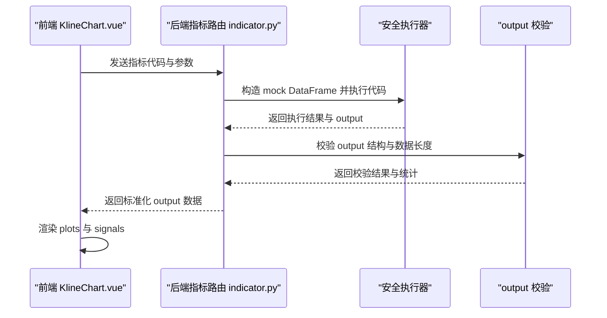
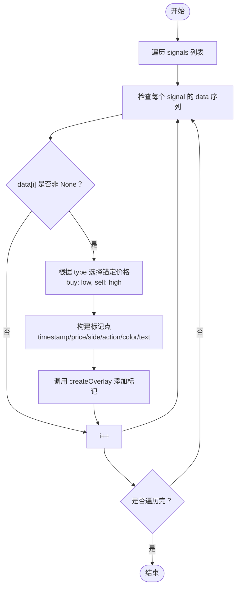
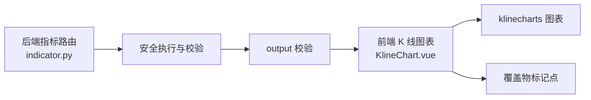

# 图表输出与可视化

<cite>
**本文档引用的文件**
- [KlineChart.vue](file://frontend/src/views/indicator-analysis/components/KlineChart.vue)
- [indicator.py](file://backend_api_python/app/routes/indicator.py)
- [builtin_indicators.py](file://backend_api_python/app/services/builtin_indicators.py)
- [dual_ma_with_params.py](file://docs/examples/dual_ma_with_params.py)
- [multi_indicator_composite.py](file://docs/examples/multi_indicator_composite.py)
- [IndicatorEditor.vue](file://frontend/src/views/indicator-analysis/components/IndicatorEditor.vue)
</cite>

## 目录
1. [简介](#简介)
2. [项目结构](#项目结构)
3. [核心组件](#核心组件)
4. [架构总览](#架构总览)
5. [详细组件分析](#详细组件分析)
6. [依赖分析](#依赖分析)
7. [性能考虑](#性能考虑)
8. [故障排查指南](#故障排查指南)
9. [结论](#结论)
10. [附录](#附录)

## 简介
本指南面向使用 QuantDinger 指标 IDE 与回测分析页面的开发者与策略作者，系统讲解如何通过指标代码输出 output 字典，将技术指标与交易信号在 K 线图上进行可视化展示。内容涵盖：
- output 字典的结构与必需字段
- 如何创建图表绘制项（plot 对象的 name、data、color、overlay 等属性）
- 信号标记的实现（buy/sell 的可视化与颜色配置）
- 图表数据格式要求（数据长度与 df 长度必须一致）
- 完整的图表输出示例，展示如何在 K 线图上叠加指标与标注买卖信号

## 项目结构
本项目的图表输出与可视化涉及前后端协作：
- 后端负责安全执行指标代码、校验 output 结构与数据长度、返回标准化结果
- 前端负责初始化 K 线图表、接收后端返回的 output、渲染指标曲线与信号标记

```mermaid
graph TB
subgraph "前端"
FE_KChart["KlineChart.vue<br/>图表初始化与渲染"]
FE_Editor["IndicatorEditor.vue<br/>策略编辑器信号模板"]
end
subgraph "后端"
BE_Route["indicator.py<br/>指标路由与校验"]
BE_Builtin["builtin_indicators.py<br/>内置示例指标"]
end
FE_KChart <- --> BE_Route
FE_Editor --> BE_Route
BE_Route --> BE_Builtin
```

**图表来源**
- [KlineChart.vue:169-208](file://frontend/src/views/indicator-analysis/components/KlineChart.vue#L169-L208)
- [indicator.py:1-80](file://backend_api_python/app/routes/indicator.py#L1-L80)
- [builtin_indicators.py:17-186](file://backend_api_python/app/services/builtin_indicators.py#L17-L186)

**章节来源**
- [KlineChart.vue:169-208](file://frontend/src/views/indicator-analysis/components/KlineChart.vue#L169-L208)
- [indicator.py:1-80](file://backend_api_python/app/routes/indicator.py#L1-L80)
- [builtin_indicators.py:17-186](file://backend_api_python/app/services/builtin_indicators.py#L17-L186)

## 核心组件
- 后端指标路由与校验：负责执行指标代码、构建 mock DataFrame、校验 output 字典结构与数据长度、返回统计信息与调试摘要
- 前端 K 线图表组件：负责初始化图表、订阅覆盖物事件、将后端返回的 output 渲染为指标曲线与信号标记
- 内置示例指标：提供标准的 output 结构示例，便于学习与复用
- 策略编辑器：辅助生成 buy/sell 信号与 output_signals 列表，便于快速可视化

**章节来源**
- [indicator.py:126-277](file://backend_api_python/app/routes/indicator.py#L126-L277)
- [KlineChart.vue:3415-3651](file://frontend/src/views/indicator-analysis/components/KlineChart.vue#L3415-L3651)
- [builtin_indicators.py:17-186](file://backend_api_python/app/services/builtin_indicators.py#L17-L186)
- [IndicatorEditor.vue:388-412](file://frontend/src/views/indicator-analysis/components/IndicatorEditor.vue#L388-L412)

## 架构总览
后端与前端的交互流程如下：



**图表来源**
- [indicator.py:126-277](file://backend_api_python/app/routes/indicator.py#L126-L277)
- [KlineChart.vue:3415-3651](file://frontend/src/views/indicator-analysis/components/KlineChart.vue#L3415-L3651)

## 详细组件分析

### output 字典结构与必需字段
- 必需键
  - name：指标名称（字符串）
  - plots：指标曲线数组（列表）
  - signals：信号数组（列表）
- 可选键
  - 其他扩展字段（如描述、参数等）可按需添加，但不影响图表渲染

校验规则要点
- output 必须为字典
- 至少包含 plots 或 signals 之一
- plots 中每个元素必须包含 data 字段
- signals 中每个元素必须包含 data 字段
- plots.data 与 signals.data 的长度必须与 mock DataFrame 长度一致

**章节来源**
- [indicator.py:126-277](file://backend_api_python/app/routes/indicator.py#L126-L277)

### 图表绘制项（plot）配置
- plot 对象的关键属性
  - name：曲线名称（用于图例与标识）
  - data：数值序列（长度必须与 df 长度一致）
  - color：颜色（十六进制字符串）
  - overlay：是否叠加在 K 线主图（布尔值）
- 前端渲染
  - 前端将后端返回的 plots 数组转换为图表绘制项，overlay=true 时叠加在 K 线图上，overlay=false 时绘制在独立子图

**章节来源**
- [builtin_indicators.py:52-61](file://backend_api_python/app/services/builtin_indicators.py#L52-L61)
- [dual_ma_with_params.py:52-63](file://docs/examples/dual_ma_with_params.py#L52-L63)
- [multi_indicator_composite.py:95-108](file://docs/examples/multi_indicator_composite.py#L95-L108)
- [KlineChart.vue:3415-3651](file://frontend/src/views/indicator-analysis/components/KlineChart.vue#L3415-L3651)

### 信号标记（buy/sell）实现
- 信号对象的关键属性
  - type：信号类型（"buy" 或 "sell"）
  - text：显示文本（如 "B"/"S"）
  - data：标注点序列（长度必须与 df 长度一致；仅在信号发生处填入数值，其余位置为 None）
  - color：颜色（十六进制字符串）
- 前端渲染
  - 前端遍历 signals，将 data 中非 None 的点转换为标记点，使用 createOverlay 在图表上绘制
  - 标记点的锚定价格依据信号类型选择 low/high，确保在 K 线图上合适位置显示



**图表来源**
- [KlineChart.vue:3415-3651](file://frontend/src/views/indicator-analysis/components/KlineChart.vue#L3415-L3651)

**章节来源**
- [builtin_indicators.py:57-61](file://backend_api_python/app/services/builtin_indicators.py#L57-L61)
- [dual_ma_with_params.py:48-63](file://docs/examples/dual_ma_with_params.py#L48-L63)
- [multi_indicator_composite.py:91-108](file://docs/examples/multi_indicator_composite.py#L91-L108)
- [IndicatorEditor.vue:388-412](file://frontend/src/views/indicator-analysis/components/IndicatorEditor.vue#L388-L412)

### 图表数据格式要求
- 数据长度约束
  - plots.data 与 signals.data 的长度必须与 mock DataFrame 长度一致
  - 任意一项长度不匹配将触发校验失败
- 数据类型与格式
  - 时间戳：前端期望毫秒级时间戳
  - 价格：数值型，按精度要求格式化显示
  - 信号 data：仅在信号发生处填入数值，其余位置为 None，以便前端正确渲染标记

**章节来源**
- [indicator.py:225-267](file://backend_api_python/app/routes/indicator.py#L225-L267)
- [KlineChart.vue:3430-3651](file://frontend/src/views/indicator-analysis/components/KlineChart.vue#L3430-L3651)

### 完整图表输出示例
以下示例展示了如何在 output 中定义指标曲线与买卖信号，并在 K 线图上进行可视化：

- 示例一：双均线交叉策略
  - plots：两条均线（overlay=true）
  - signals：买卖标记（overlay=false，前端在 K 线图上标注）
  - 参考路径：[dual_ma_with_params.py:52-63](file://docs/examples/dual_ma_with_params.py#L52-L63)

- 示例二：多指标组合策略
  - plots：均线、RSI、MACD（overlay=true/false 混合）
  - signals：买卖标记
  - 参考路径：[multi_indicator_composite.py:95-108](file://docs/examples/multi_indicator_composite.py#L95-L108)

- 示例三：内置示例指标
  - RSI 边界触发、双均线金叉死叉、MACD 柱穿越零轴、布林带触及
  - 参考路径：[builtin_indicators.py:17-186](file://backend_api_python/app/services/builtin_indicators.py#L17-L186)

**章节来源**
- [dual_ma_with_params.py:52-63](file://docs/examples/dual_ma_with_params.py#L52-L63)
- [multi_indicator_composite.py:95-108](file://docs/examples/multi_indicator_composite.py#L95-L108)
- [builtin_indicators.py:17-186](file://backend_api_python/app/services/builtin_indicators.py#L17-L186)

## 依赖分析
- 后端依赖
  - 安全执行：对指标代码进行沙箱执行与校验
  - 输出校验：严格校验 output 结构与数据长度
- 前端依赖
  - 图表库：klinecharts（初始化、订阅事件、创建覆盖物）
  - 事件驱动：通过 subscribeAction 监听覆盖物创建/移除与可见范围变化
  - 渲染管线：将后端返回的 plots 与 signals 转换为图表绘制项与标记点



**图表来源**
- [indicator.py:126-277](file://backend_api_python/app/routes/indicator.py#L126-L277)
- [KlineChart.vue:2933-3002](file://frontend/src/views/indicator-analysis/components/KlineChart.vue#L2933-L3002)

**章节来源**
- [indicator.py:126-277](file://backend_api_python/app/routes/indicator.py#L126-L277)
- [KlineChart.vue:2933-3002](file://frontend/src/views/indicator-analysis/components/KlineChart.vue#L2933-L3002)

## 性能考虑
- 指标计算节流：前端对指标更新进行节流与重入锁，避免实时刷新导致的性能抖动
- 数据长度一致性：确保 plots 与 signals 的 data 长度与 df 一致，减少前端二次校验成本
- 渲染优化：仅在信号发生处填充 data，避免大量 None 导致的渲染开销

[本节为通用指导，无需特定文件引用]

## 故障排查指南
- 缺失 output 字典
  - 现象：后端返回缺失 output
  - 排查：确认指标代码末尾定义了 output
  - 参考路径：[indicator.py:188-199](file://backend_api_python/app/routes/indicator.py#L188-L199)
- output 类型错误
  - 现象：后端返回 output 必须为字典
  - 排查：检查 output 是否为字典类型
  - 参考路径：[indicator.py:200-209](file://backend_api_python/app/routes/indicator.py#L200-L209)
- 缺少 plots 或 signals
  - 现象：后端返回 output 应包含 plots 或 signals
  - 排查：确认至少包含其中之一
  - 参考路径：[indicator.py:211-221](file://backend_api_python/app/routes/indicator.py#L211-L221)
- 缺少 data 字段
  - 现象：后端返回 plot/signal 缺少 data
  - 排查：为每个 plot/signal 补充 data
  - 参考路径：[indicator.py:225-267](file://backend_api_python/app/routes/indicator.py#L225-L267)
- 数据长度不匹配
  - 现象：后端返回长度不匹配
  - 排查：确保 data 长度与 mock DataFrame 长度一致
  - 参考路径：[indicator.py:236-267](file://backend_api_python/app/routes/indicator.py#L236-L267)
- 信号标记渲染异常
  - 现象：前端未显示买卖标记
  - 排查：确认 signals.data 中仅在信号发生处填入数值，其余为 None；时间戳为毫秒级
  - 参考路径：[KlineChart.vue:3430-3651](file://frontend/src/views/indicator-analysis/components/KlineChart.vue#L3430-L3651)

**章节来源**
- [indicator.py:188-267](file://backend_api_python/app/routes/indicator.py#L188-L267)
- [KlineChart.vue:3430-3651](file://frontend/src/views/indicator-analysis/components/KlineChart.vue#L3430-L3651)

## 结论
通过规范的 output 字典结构与严格的长度校验，QuantDinger 能够稳定地将技术指标与交易信号在 K 线图上进行可视化展示。遵循本文档的配置方法与示例，可快速实现高质量的图表输出与交互体验。

[本节为总结性内容，无需特定文件引用]

## 附录
- 参考示例文件
  - [dual_ma_with_params.py:52-63](file://docs/examples/dual_ma_with_params.py#L52-L63)
  - [multi_indicator_composite.py:95-108](file://docs/examples/multi_indicator_composite.py#L95-L108)
  - [builtin_indicators.py:17-186](file://backend_api_python/app/services/builtin_indicators.py#L17-L186)
- 前端图表组件
  - [KlineChart.vue:3415-3651](file://frontend/src/views/indicator-analysis/components/KlineChart.vue#L3415-L3651)
- 后端指标路由
  - [indicator.py:126-277](file://backend_api_python/app/routes/indicator.py#L126-L277)