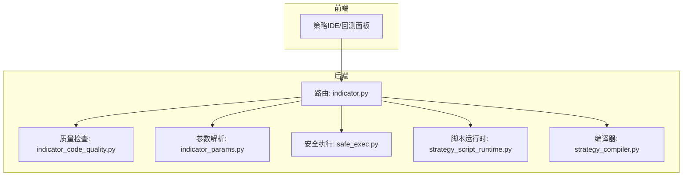
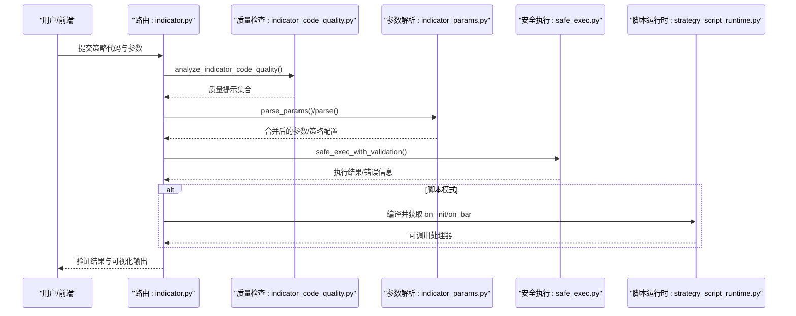
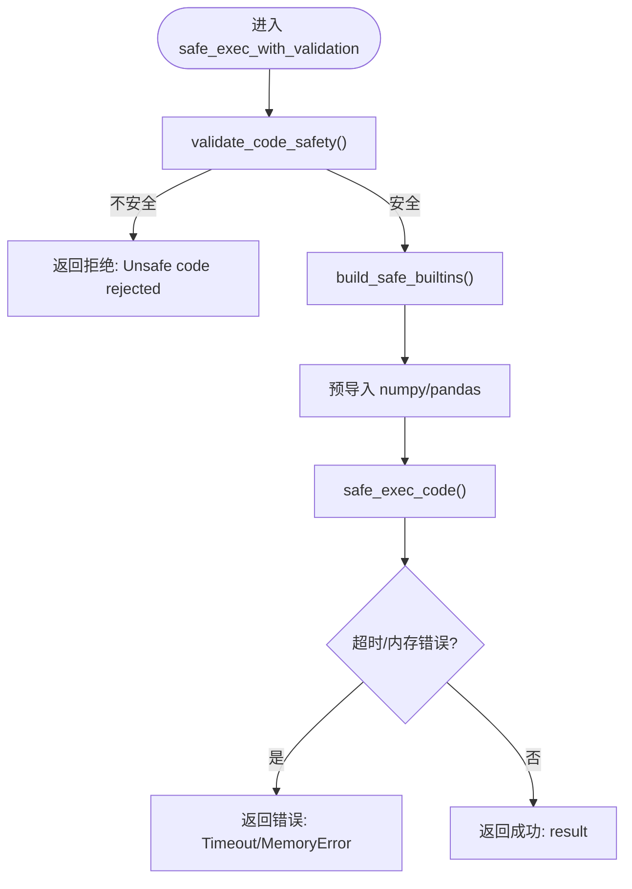
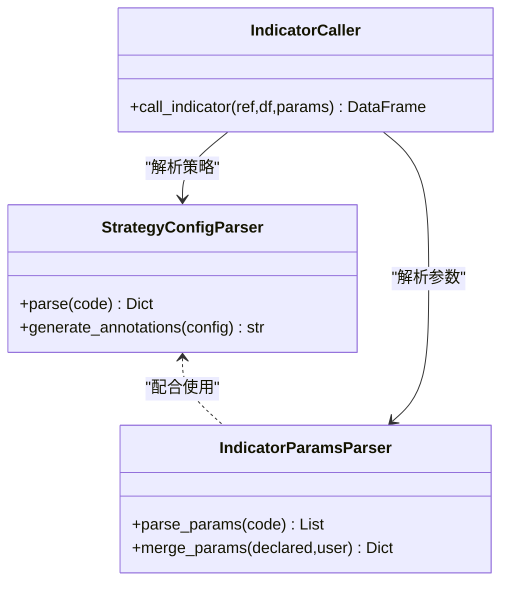
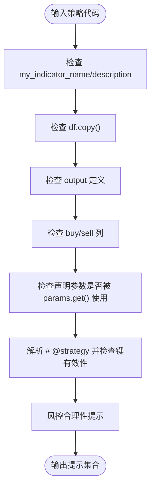
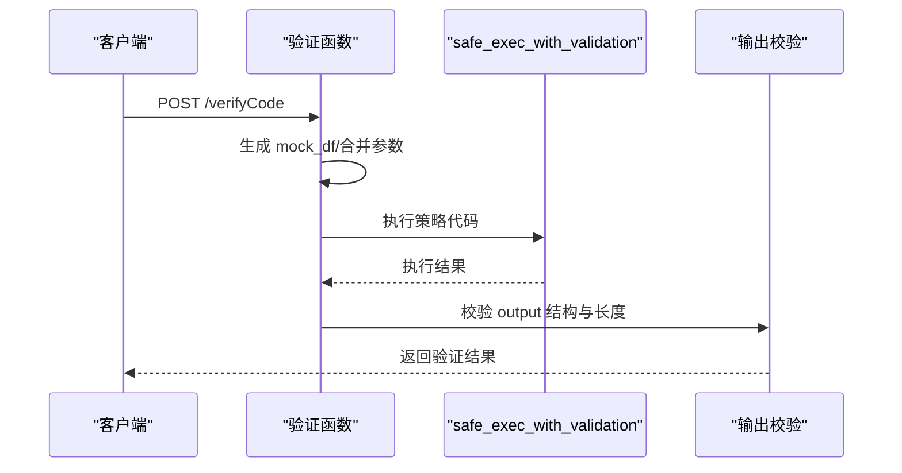
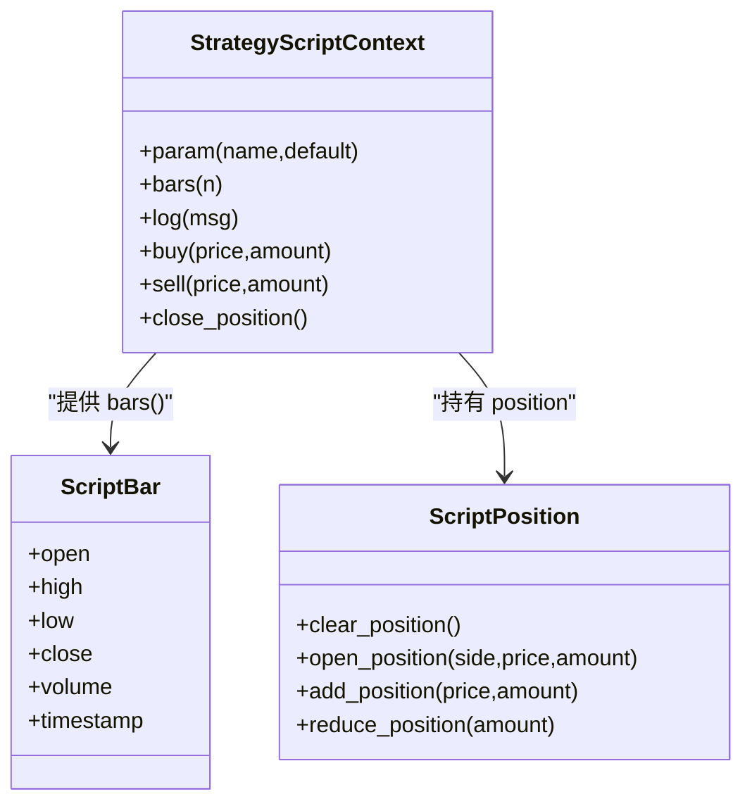
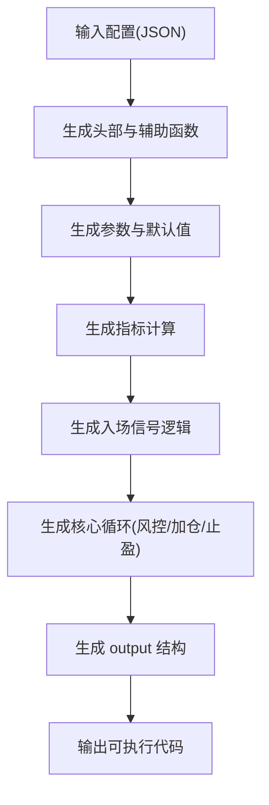
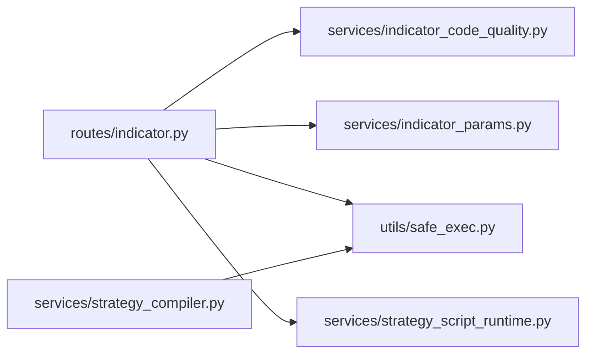

# 开发最佳实践与调试

<cite>
**本文引用的文件**
- [STRATEGY_DEV_GUIDE_CN.md](file://docs/STRATEGY_DEV_GUIDE_CN.md)
- [safe_exec.py](file://backend_api_python/app/utils/safe_exec.py)
- [indicator_params.py](file://backend_api_python/app/services/indicator_params.py)
- [indicator_code_quality.py](file://backend_api_python/app/services/indicator_code_quality.py)
- [indicator.py](file://backend_api_python/app/routes/indicator.py)
- [strategy_script_runtime.py](file://backend_api_python/app/services/strategy_script_runtime.py)
- [strategy_compiler.py](file://backend_api_python/app/services/strategy_compiler.py)
- [dual_ma_with_params.py](file://docs/examples/dual_ma_with_params.py)
- [multi_indicator_composite.py](file://docs/examples/multi_indicator_composite.py)
- [cross_sectional_momentum_rsi.py](file://docs/examples/cross_sectional_momentum_rsi.py)
- [test_indicator_code_quality.py](file://backend_api_python/tests/test_indicator_code_quality.py)
- [strategy_runtime_logs.py](file://backend_api_python/app/utils/strategy_runtime_logs.py)
</cite>

## 目录
1. [简介](#简介)
2. [项目结构](#项目结构)
3. [核心组件](#核心组件)
4. [架构总览](#架构总览)
5. [详细组件分析](#详细组件分析)
6. [依赖分析](#依赖分析)
7. [性能考虑](#性能考虑)
8. [故障排查指南](#故障排查指南)
9. [结论](#结论)
10. [附录](#附录)

## 简介
本指南聚焦于 IndicatorStrategy 的开发最佳实践与调试方法，系统阐述以下主题：
- IndicatorStrategy 与 ScriptStrategy 的选择原则与转换时机
- 代码质量检查与安全执行机制（沙箱、白名单、超时与内存限制）
- 策略开发推荐工作流程（从元数据声明到最终测试）
- 常见错误与调试技巧（参数解析、信号逻辑、图表输出）
- 性能优化与内存管理建议
- 从简单到复杂的完整开发示例

## 项目结构
QuantDinger 后端采用服务化与路由分离的组织方式，策略相关能力集中在以下模块：
- 路由与校验：/app/routes/indicator.py 提供指标代码校验、参数解析与验证
- 安全执行：/app/utils/safe_exec.py 提供沙箱、超时、内存限制与静态安全校验
- 参数与注解解析：/app/services/indicator_params.py 解析 # @param 与 # @strategy 注解
- 代码质量提示：/app/services/indicator_code_quality.py 提供启发式质量检查
- 脚本运行时：/app/services/strategy_script_runtime.py 提供 on_init/on_bar 运行时上下文
- 编译器：/app/services/strategy_compiler.py 将配置编译为可执行脚本
- 示例与测试：/docs/examples 与 /backend_api_python/tests 下的示例与测试

**图表来源**
- [indicator.py:121-277](file://backend_api_python/app/routes/indicator.py#L121-L277)
- [indicator_code_quality.py:79-205](file://backend_api_python/app/services/indicator_code_quality.py#L79-L205)
- [indicator_params.py:119-216](file://backend_api_python/app/services/indicator_params.py#L119-L216)
- [safe_exec.py:207-243](file://backend_api_python/app/utils/safe_exec.py#L207-L243)
- [strategy_script_runtime.py:159-191](file://backend_api_python/app/services/strategy_script_runtime.py#L159-L191)
- [strategy_compiler.py:1-689](file://backend_api_python/app/services/strategy_compiler.py#L1-L689)

**章节来源**
- [indicator.py:121-277](file://backend_api_python/app/routes/indicator.py#L121-L277)
- [safe_exec.py:1-471](file://backend_api_python/app/utils/safe_exec.py#L1-L471)
- [indicator_params.py:1-380](file://backend_api_python/app/services/indicator_params.py#L1-L380)
- [indicator_code_quality.py:1-206](file://backend_api_python/app/services/indicator_code_quality.py#L1-L206)
- [strategy_script_runtime.py:1-191](file://backend_api_python/app/services/strategy_script_runtime.py#L1-L191)
- [strategy_compiler.py:1-689](file://backend_api_python/app/services/strategy_compiler.py#L1-L689)

## 核心组件
- 安全执行与沙箱
  - 白名单内置函数与导入模块，严格限制危险操作
  - 超时与内存限制，跨平台超时注入
  - 静态安全校验（正则+AST），拒绝潜在危险模式
- 参数与注解解析
  - # @param：声明参数与默认值，支持 int/float/bool/str
  - # @strategy：声明默认风控与交易方向，支持 stopLossPct/takeProfitPct/entryPct/trailing 等
- 代码质量检查
  - 缺失元数据、缺失 output、缺失 buy/sell、未读取声明参数、未知策略键等启发式提示
- 脚本运行时
  - 提供 ctx.param/bars/position/buy/sell/close_position 等运行时接口
- 编译器
  - 将配置编译为可执行脚本，包含指标计算、信号逻辑与核心循环

**章节来源**
- [safe_exec.py:24-92](file://backend_api_python/app/utils/safe_exec.py#L24-L92)
- [safe_exec.py:358-471](file://backend_api_python/app/utils/safe_exec.py#L358-L471)
- [indicator_params.py:26-117](file://backend_api_python/app/services/indicator_params.py#L26-L117)
- [indicator_params.py:119-216](file://backend_api_python/app/services/indicator_params.py#L119-L216)
- [indicator_code_quality.py:79-205](file://backend_api_python/app/services/indicator_code_quality.py#L79-L205)
- [strategy_script_runtime.py:114-191](file://backend_api_python/app/services/strategy_script_runtime.py#L114-L191)
- [strategy_compiler.py:1-689](file://backend_api_python/app/services/strategy_compiler.py#L1-L689)

## 架构总览
下图展示了从策略代码提交到安全执行与回测的关键流程。

**图表来源**
- [indicator.py:121-277](file://backend_api_python/app/routes/indicator.py#L121-L277)
- [indicator_code_quality.py:79-205](file://backend_api_python/app/services/indicator_code_quality.py#L79-L205)
- [indicator_params.py:119-216](file://backend_api_python/app/services/indicator_params.py#L119-L216)
- [safe_exec.py:207-243](file://backend_api_python/app/utils/safe_exec.py#L207-L243)
- [strategy_script_runtime.py:159-191](file://backend_api_python/app/services/strategy_script_runtime.py#L159-L191)

## 详细组件分析

### 组件A：安全执行与沙箱（safe_exec.py）
- 白名单内置函数与导入模块，排除 eval/exec/open/__import__ 等危险能力
- 跨平台超时：Unix 主线程使用 SIGALRM，非主线程使用线程定时器+异步异常注入
- 内存限制：Linux 可通过 RLIMIT_AS 设置最大地址空间
- 静态安全校验：正则匹配危险模式 + AST 检查导入/调用/属性访问
- 执行封装：支持预导入 numpy/pandas，统一返回结构

**图表来源**
- [safe_exec.py:207-243](file://backend_api_python/app/utils/safe_exec.py#L207-L243)
- [safe_exec.py:157-205](file://backend_api_python/app/utils/safe_exec.py#L157-L205)
- [safe_exec.py:358-471](file://backend_api_python/app/utils/safe_exec.py#L358-L471)

**章节来源**
- [safe_exec.py:1-471](file://backend_api_python/app/utils/safe_exec.py#L1-L471)

### 组件B：参数与注解解析（indicator_params.py）
- # @param 解析：提取参数名、类型、默认值与描述
- # @strategy 解析：提取风控与交易方向配置，含类型转换与范围约束
- 合并策略：将声明参数与用户参数合并，优先用户输入
- 指标调用：支持在指标代码中调用其他指标，带深度限制与循环依赖检测

**图表来源**
- [indicator_params.py:26-117](file://backend_api_python/app/services/indicator_params.py#L26-L117)
- [indicator_params.py:119-216](file://backend_api_python/app/services/indicator_params.py#L119-L216)
- [indicator_params.py:218-354](file://backend_api_python/app/services/indicator_params.py#L218-L354)

**章节来源**
- [indicator_params.py:1-380](file://backend_api_python/app/services/indicator_params.py#L1-L380)

### 组件C：代码质量检查（indicator_code_quality.py）
- 启发式检查：缺失元数据、缺失 output、缺失 buy/sell、未读取声明参数、未知策略键
- 风控提示：无 stopLoss/takeProfit、trailing 未配置百分比、entryPct 过低等
- 仅静态分析，不执行用户代码

**图表来源**
- [indicator_code_quality.py:79-205](file://backend_api_python/app/services/indicator_code_quality.py#L79-L205)

**章节来源**
- [indicator_code_quality.py:1-206](file://backend_api_python/app/services/indicator_code_quality.py#L1-L206)

### 组件D：路由与验证（indicator.py）
- 验证流程：生成 mock DataFrame，合并参数，构建执行环境，安全执行，检查 output 结构
- 错误分类：安全错误（沙箱拒绝）、运行时错误（语法/类型/业务异常）
- 调试摘要：汇总 success/msg/error_type/hints

**图表来源**
- [indicator.py:121-277](file://backend_api_python/app/routes/indicator.py#L121-L277)

**章节来源**
- [indicator.py:121-277](file://backend_api_python/app/routes/indicator.py#L121-L277)

### 组件E：脚本运行时（strategy_script_runtime.py）
- ScriptBar：封装 bar 字段（open/high/low/close/volume/time）
- ScriptPosition：封装 position 字段（side/size/entry_price/direction/amount），支持清仓、加仓、减仓
- StrategyScriptContext：提供 ctx.param/bars/position/balance/equity/log/buy/sell/close_position
- 编译策略脚本：校验并返回 on_init/on_bar 可调用句柄

**图表来源**
- [strategy_script_runtime.py:17-113](file://backend_api_python/app/services/strategy_script_runtime.py#L17-L113)
- [strategy_script_runtime.py:114-191](file://backend_api_python/app/services/strategy_script_runtime.py#L114-L191)

**章节来源**
- [strategy_script_runtime.py:1-191](file://backend_api_python/app/services/strategy_script_runtime.py#L1-L191)

### 组件F：编译器（strategy_compiler.py）
- 将配置（指标、入场规则、仓位与风控）编译为可执行 Python 代码
- 自动生成指标计算、信号逻辑、核心循环与输出结构
- 支持 SuperTrend、EMA、RSI、MACD、布林带、KDJ、MA 等指标

**图表来源**
- [strategy_compiler.py:1-689](file://backend_api_python/app/services/strategy_compiler.py#L1-L689)

**章节来源**
- [strategy_compiler.py:1-689](file://backend_api_python/app/services/strategy_compiler.py#L1-L689)

## 依赖分析
- 路由依赖质量检查与参数解析，确保代码结构与注解有效
- 安全执行贯穿验证与脚本运行时，保障执行安全
- 脚本运行时依赖安全执行的白名单环境
- 编译器独立生成脚本，不依赖运行时上下文

**图表来源**
- [indicator.py:121-277](file://backend_api_python/app/routes/indicator.py#L121-L277)
- [indicator_code_quality.py:79-205](file://backend_api_python/app/services/indicator_code_quality.py#L79-L205)
- [indicator_params.py:119-216](file://backend_api_python/app/services/indicator_params.py#L119-L216)
- [safe_exec.py:207-243](file://backend_api_python/app/utils/safe_exec.py#L207-L243)
- [strategy_script_runtime.py:159-191](file://backend_api_python/app/services/strategy_script_runtime.py#L159-L191)
- [strategy_compiler.py:1-689](file://backend_api_python/app/services/strategy_compiler.py#L1-L689)

**章节来源**
- [indicator.py:121-277](file://backend_api_python/app/routes/indicator.py#L121-L277)
- [safe_exec.py:1-471](file://backend_api_python/app/utils/safe_exec.py#L1-L471)
- [indicator_params.py:1-380](file://backend_api_python/app/services/indicator_params.py#L1-L380)
- [indicator_code_quality.py:1-206](file://backend_api_python/app/services/indicator_code_quality.py#L1-L206)
- [strategy_script_runtime.py:1-191](file://backend_api_python/app/services/strategy_script_runtime.py#L1-L191)
- [strategy_compiler.py:1-689](file://backend_api_python/app/services/strategy_compiler.py#L1-L689)

## 性能考虑
- 沙箱与超时
  - 使用超时上下文避免无限循环与长时间阻塞
  - Linux 可启用 RLIMIT_AS 限制地址空间，Windows 通过进程级限制
- 内存管理
  - 限制最大内存（如 500MB），防止 OOM
  - 避免在策略中创建过大的中间数组或深拷贝
- 计算效率
  - 优先使用向量化操作（pandas/numpy），减少显式循环
  - 合理使用 shift/lag，避免未来数据泄漏
- I/O 与网络
  - 禁止网络请求与文件读写，避免阻塞与副作用

[本节为通用指导，无需特定文件引用]

## 故障排查指南

### 选择策略模式的原则与转换时机
- 何时用 IndicatorStrategy
  - 需要快速验证信号、叠加图表、进行信号型回测
  - 仅需固定默认风控（止损/止盈/跟踪止损/入场比例/交易方向）
- 何时迁移到 ScriptStrategy
  - 需要运行时状态（持仓、余额、权益）
  - 需要动态止损、分批加仓/减仓、部分止盈、冷却期等
  - 退出逻辑依赖当前持仓状态而非仅历史序列

**章节来源**
- [STRATEGY_DEV_GUIDE_CN.md:57-90](file://docs/STRATEGY_DEV_GUIDE_CN.md#L57-L90)

### 常见错误与定位
- 缺少 output
  - 现象：验证失败，提示缺少 output
  - 排查：确保脚本末尾定义 output 字典，包含 name/plots/signals
- output 结构错误
  - 现象：output 类型或键不正确
  - 排查：确认 output 为字典，至少包含 plots 或 signals
- 信号长度不匹配
  - 现象：信号长度与 DataFrame 不一致
  - 排查：确保 buy/sell 与 df 长度一致，必要时填充为 False
- 未读取声明参数
  - 现象：质量检查提示 DECLARED_PARAMS_NOT_READ_VIA_PARAMS_GET
  - 排查：使用 params.get() 读取声明参数，避免硬编码
- 未知策略键
  - 现象：质量检查提示 UNKNOWN_STRATEGY_KEY
  - 排查：仅使用受支持的 # @strategy 键（如 stopLossPct/takeProfitPct/entryPct/trailing 等）
- 安全拒绝
  - 现象：提示 Unsafe code rejected
  - 排查：移除 eval/exec/open/__import__ 等危险模式，仅使用白名单模块

**章节来源**
- [indicator.py:178-217](file://backend_api_python/app/routes/indicator.py#L178-L217)
- [indicator_code_quality.py:79-205](file://backend_api_python/app/services/indicator_code_quality.py#L79-L205)
- [test_indicator_code_quality.py:1-135](file://backend_api_python/tests/test_indicator_code_quality.py#L1-L135)

### 调试技巧
- 使用质量检查提示
  - 在提交前运行 analyze_indicator_code_quality，关注 warn/info/error 级别提示
- 逐步最小化
  - 保留最少信号与指标，逐步增加复杂度，定位问题范围
- 日志记录
  - 在脚本中使用 ctx.log 记录关键变量与状态，便于回放与分析
- 参数与注解对齐
  - 确保 # @param 与 # @strategy 与 UI/回测面板一致，避免语义偏差

**章节来源**
- [indicator_code_quality.py:79-205](file://backend_api_python/app/services/indicator_code_quality.py#L79-L205)
- [strategy_script_runtime.py:146-157](file://backend_api_python/app/services/strategy_script_runtime.py#L146-L157)

## 结论
- IndicatorStrategy 适合信号原型与回测验证，应遵循三层分离（指标/信号/风控默认配置）
- 安全执行与质量检查构成策略开发的双重保障，务必在提交前完成自检
- 当策略需要运行时状态与动态风控时，迁移至 ScriptStrategy
- 通过最小化、参数对齐与日志记录，可显著提升调试效率

[本节为总结，无需特定文件引用]

## 附录

### 推荐开发工作流程
- 原型化：先用 IndicatorStrategy 原型验证信号与图表
- 元数据与默认配置：补全 # @param 与 # @strategy
- 信号与风控：明确“谁负责退出”，避免混用两种退出来源
- 回测验证：验证图表、信号密度与 next-bar-open 回测行为
- 保存与二次回测：保存后从持久化记录跑策略回测
- 迁移决策：仅在需要运行时状态时迁移到 ScriptStrategy
- 上线前核验：确认配置、凭证与市场语义后再进入模拟/实盘

**章节来源**
- [STRATEGY_DEV_GUIDE_CN.md:1260-1269](file://docs/STRATEGY_DEV_GUIDE_CN.md#L1260-L1269)

### 开发示例（路径指引）
- 双均线策略（文档同步版）
  - 展示 # @param 与 # @strategy 的标准写法，以及边缘触发信号生成
  - 路径：[dual_ma_with_params.py:1-64](file://docs/examples/dual_ma_with_params.py#L1-L64)
- 多指标组合策略（文档同步版）
  - 展示如何组合均线、RSI、MACD、成交量过滤
  - 路径：[multi_indicator_composite.py:1-109](file://docs/examples/multi_indicator_composite.py#L1-L109)
- 截面策略指标示例（研究参考版）
  - 展示对多个标的打分与排序的基本写法
  - 路径：[cross_sectional_momentum_rsi.py:1-71](file://docs/examples/cross_sectional_momentum_rsi.py#L1-L71)

**章节来源**
- [dual_ma_with_params.py:1-64](file://docs/examples/dual_ma_with_params.py#L1-L64)
- [multi_indicator_composite.py:1-109](file://docs/examples/multi_indicator_composite.py#L1-L109)
- [cross_sectional_momentum_rsi.py:1-71](file://docs/examples/cross_sectional_momentum_rsi.py#L1-L71)

### 关键接口与数据结构（路径指引）
- 安全执行与沙箱
  - 路径：[safe_exec.py:1-471](file://backend_api_python/app/utils/safe_exec.py#L1-L471)
- 参数与注解解析
  - 路径：[indicator_params.py:1-380](file://backend_api_python/app/services/indicator_params.py#L1-L380)
- 代码质量检查
  - 路径：[indicator_code_quality.py:1-206](file://backend_api_python/app/services/indicator_code_quality.py#L1-L206)
- 路由与验证
  - 路径：[indicator.py:121-277](file://backend_api_python/app/routes/indicator.py#L121-L277)
- 脚本运行时
  - 路径：[strategy_script_runtime.py:1-191](file://backend_api_python/app/services/strategy_script_runtime.py#L1-L191)
- 编译器
  - 路径：[strategy_compiler.py:1-689](file://backend_api_python/app/services/strategy_compiler.py#L1-L689)
- 测试用例
  - 路径：[test_indicator_code_quality.py:1-135](file://backend_api_python/tests/test_indicator_code_quality.py#L1-L135)
- 运行日志
  - 路径：[strategy_runtime_logs.py:1-30](file://backend_api_python/app/utils/strategy_runtime_logs.py#L1-L30)