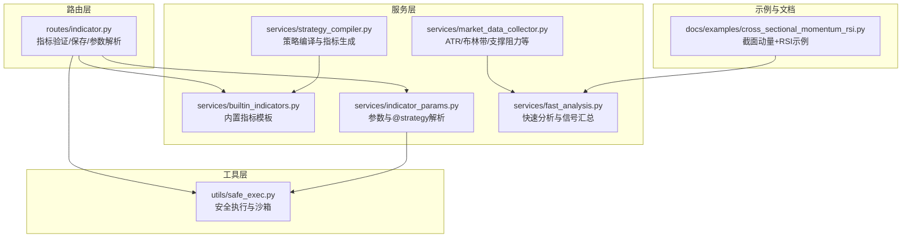
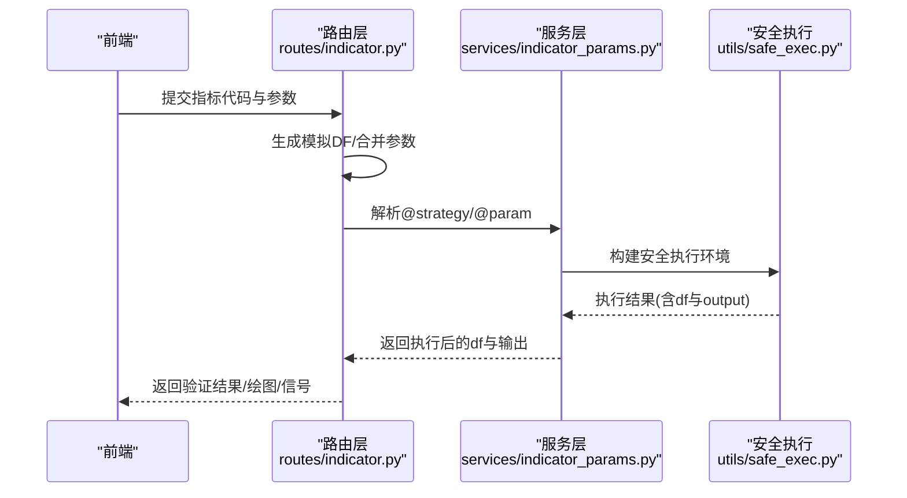
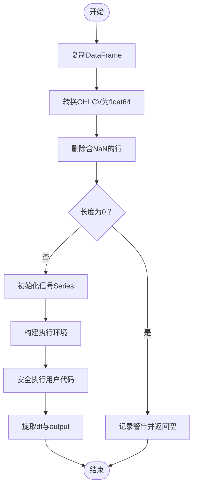
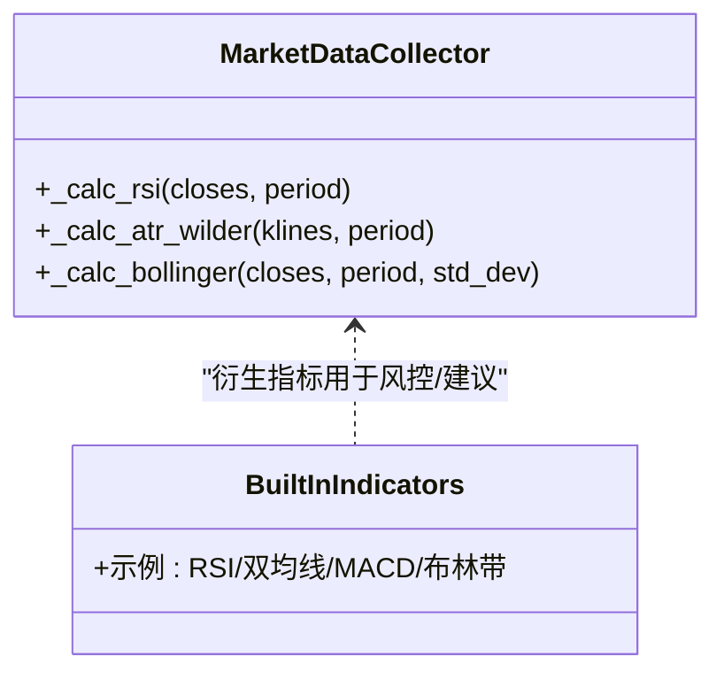
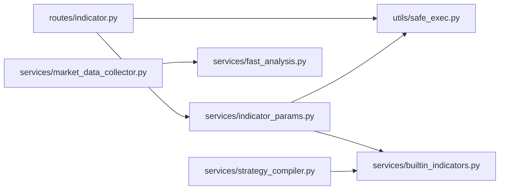

# 指标计算与数据处理

<cite>
**本文引用的文件**
- [indicator.py](file://backend_api_python/app/routes/indicator.py)
- [builtin_indicators.py](file://backend_api_python/app/services/builtin_indicators.py)
- [safe_exec.py](file://backend_api_python/app/utils/safe_exec.py)
- [indicator_params.py](file://backend_api_python/app/services/indicator_params.py)
- [market_data_collector.py](file://backend_api_python/app/services/market_data_collector.py)
- [fast_analysis.py](file://backend_api_python/app/services/fast_analysis.py)
- [strategy_compiler.py](file://backend_api_python/app/services/strategy_compiler.py)
- [cross_sectional_momentum_rsi.py](file://docs/examples/cross_sectional_momentum_rsi.py)
</cite>

## 目录
1. [简介](#简介)
2. [项目结构](#项目结构)
3. [核心组件](#核心组件)
4. [架构总览](#架构总览)
5. [详细组件分析](#详细组件分析)
6. [依赖分析](#依赖分析)
7. [性能考量](#性能考量)
8. [故障排查指南](#故障排查指南)
9. [结论](#结论)
10. [附录](#附录)

## 简介
本指南聚焦于 QuantDinger 后端的 IndicatorStrategy 指标计算与数据处理机制，围绕以下目标展开：
- 如何安全地复制 DataFrame 并进行数据预处理，避免网络访问、文件 I/O 等不安全操作；
- 常用技术指标的实现思路与最佳实践，包括移动平均线、RSI、ATR、布林带等；
- 标准金融数据列（open、high、low、close、volume）的使用规范；
- 时间列的处理与数据类型转换注意事项；
- 提供丰富的代码路径示例，展示正确的指标计算与数据预处理流程；
- 常见错误与解决方案。

## 项目结构
QuantDinger 的指标体系主要分布在以下模块：
- 路由层：提供指标的验证、保存、参数解析等接口；
- 服务层：内置指标模板、安全执行引擎、市场数据采集与衍生指标计算；
- 工具层：安全执行与沙箱环境构建；
- 示例与文档：跨市场动量与 RSI 复合评分示例。

**图表来源**
- [indicator.py:1-120](file://backend_api_python/app/routes/indicator.py#L1-L120)
- [builtin_indicators.py:1-185](file://backend_api_python/app/services/builtin_indicators.py#L1-L185)
- [safe_exec.py:1-120](file://backend_api_python/app/utils/safe_exec.py#L1-L120)
- [indicator_params.py:1-120](file://backend_api_python/app/services/indicator_params.py#L1-L120)
- [market_data_collector.py:400-505](file://backend_api_python/app/services/market_data_collector.py#L400-L505)
- [fast_analysis.py:310-345](file://backend_api_python/app/services/fast_analysis.py#L310-L345)
- [strategy_compiler.py:173-202](file://backend_api_python/app/services/strategy_compiler.py#L173-L202)
- [cross_sectional_momentum_rsi.py:1-71](file://docs/examples/cross_sectional_momentum_rsi.py#L1-L71)

**章节来源**
- [indicator.py:1-120](file://backend_api_python/app/routes/indicator.py#L1-L120)

## 核心组件
- 指标验证与执行环境构建：路由层负责生成模拟 DataFrame、注入全局变量、执行用户代码并校验输出结构。
- 安全执行引擎：严格白名单限制 I/O、导入与反射能力，提供超时与内存限制。
- 参数与策略注解解析：支持 @param 与 @strategy 注解，合并用户参数并生成策略默认项。
- 内置指标模板：提供 RSI、双均线、MACD、布林带等示例，便于学习与复用。
- 衍生指标计算：ATR、布林带、支撑阻力、波动率等，服务于交易建议与风控。

**章节来源**
- [indicator.py:126-277](file://backend_api_python/app/routes/indicator.py#L126-L277)
- [safe_exec.py:74-93](file://backend_api_python/app/utils/safe_exec.py#L74-L93)
- [indicator_params.py:26-117](file://backend_api_python/app/services/indicator_params.py#L26-L117)
- [builtin_indicators.py:17-185](file://backend_api_python/app/services/builtin_indicators.py#L17-L185)
- [market_data_collector.py:436-505](file://backend_api_python/app/services/market_data_collector.py#L436-L505)

## 架构总览
指标执行的关键流程如下：

**图表来源**
- [indicator.py:126-277](file://backend_api_python/app/routes/indicator.py#L126-L277)
- [indicator_params.py:288-314](file://backend_api_python/app/services/indicator_params.py#L288-L314)
- [safe_exec.py:207-243](file://backend_api_python/app/utils/safe_exec.py#L207-L243)

## 详细组件分析

### 数据帧复制与安全预处理
- 必须先复制 DataFrame 再进行任何修改，确保原始数据不被污染。
- 对 OHLCV 列进行数值类型转换与缺失值清理，保证后续向量化计算稳定。
- 在执行用户代码前，注入安全的 __builtins__ 与必要的库（如 pandas、numpy）。

**图表来源**
- [trading_executor.py:2300-2405](file://backend_api_python/app/services/trading_executor.py#L2300-L2405)
- [indicator.py:160-174](file://backend_api_python/app/routes/indicator.py#L160-L174)
- [safe_exec.py:74-93](file://backend_api_python/app/utils/safe_exec.py#L74-L93)

**章节来源**
- [trading_executor.py:2300-2405](file://backend_api_python/app/services/trading_executor.py#L2300-L2405)
- [indicator.py:156-174](file://backend_api_python/app/routes/indicator.py#L156-L174)

### 常用技术指标实现要点
- 移动平均线（MA）：滚动均值或指数平滑（EMA），注意最小周期与平滑系数。
- RSI：Wilder 平滑法，首段均幅为简单平均，后续递推；注意除零保护与边界长度。
- ATR：True Range 累计平均，Wilders 平滑；周期通常为 14。
- 布林带（BB）：中轨为 SMA，上下轨为中轨±标准差×倍数，宽度可标准化。

**图表来源**
- [market_data_collector.py:511-534](file://backend_api_python/app/services/market_data_collector.py#L511-L534)
- [market_data_collector.py:603-611](file://backend_api_python/app/services/market_data_collector.py#L603-L611)
- [market_data_collector.py:613-629](file://backend_api_python/app/services/market_data_collector.py#L613-L629)
- [builtin_indicators.py:20-183](file://backend_api_python/app/services/builtin_indicators.py#L20-L183)

**章节来源**
- [builtin_indicators.py:20-183](file://backend_api_python/app/services/builtin_indicators.py#L20-L183)
- [market_data_collector.py:511-534](file://backend_api_python/app/services/market_data_collector.py#L511-L534)
- [market_data_collector.py:603-629](file://backend_api_python/app/services/market_data_collector.py#L603-L629)

### 数据列与时间列处理
- 标准列：open、high、low、close、volume；必须为数值类型，缺失需清理。
- 时间列：路由层生成的模拟数据使用毫秒级时间戳；实际业务中需确保时间列可转换为时间类型并排序。
- 类型转换：优先使用数值类型 float64，避免字符串或混合类型引发计算异常。

**章节来源**
- [indicator.py:89-118](file://backend_api_python/app/routes/indicator.py#L89-L118)
- [trading_executor.py:2309-2316](file://backend_api_python/app/services/trading_executor.py#L2309-L2316)

### 安全执行与沙箱
- 白名单限制：仅允许纯计算类内置函数与有限模块导入（如 numpy、pandas、math 等）。
- 超时与内存限制：默认超时 30~60 秒，内存上限 500MB；可通过配置调整。
- 预导入：自动注入 numpy 与 pandas，确保用户代码可直接使用。

**章节来源**
- [safe_exec.py:24-61](file://backend_api_python/app/utils/safe_exec.py#L24-L61)
- [safe_exec.py:95-153](file://backend_api_python/app/utils/safe_exec.py#L95-L153)
- [safe_exec.py:207-243](file://backend_api_python/app/utils/safe_exec.py#L207-L243)

### 参数与策略注解
- @param：声明指标参数（类型、默认值、描述），支持 int、float、bool、str。
- @strategy：声明策略默认项（止损、止盈、仓位、交易方向等），用于回测与风控建议。
- 参数合并：将声明参数与用户输入合并，生成最终执行参数字典。

**章节来源**
- [indicator_params.py:26-117](file://backend_api_python/app/services/indicator_params.py#L26-L117)
- [indicator_params.py:119-216](file://backend_api_python/app/services/indicator_params.py#L119-L216)

### 内置指标模板
- RSI 边缘触发：演示信号边沿触发与绘图输出。
- 双均线金叉死叉：演示交叉信号与买卖标记。
- MACD 柱穿越零轴：演示动量切换信号。
- 布林带触及：演示通道突破信号与绘图。

**章节来源**
- [builtin_indicators.py:17-185](file://backend_api_python/app/services/builtin_indicators.py#L17-L185)

### 衍生指标与风控建议
- 支撑/阻力/枢轴：结合多种方法综合估算，提供稳健的交易区间。
- ATR 波动率：计算波动率等级与风险回报比，给出止盈止损建议。
- 布林带：提供上下轨与宽度，辅助判断价格位置与通道状态。
- 价格位置：计算相对区间位置，辅助趋势判断。

**章节来源**
- [market_data_collector.py:413-505](file://backend_api_python/app/services/market_data_collector.py#L413-L505)
- [fast_analysis.py:310-345](file://backend_api_python/app/services/fast_analysis.py#L310-L345)

### 截面策略与复合评分示例
- 截面动量与 RSI 复合评分：演示对多标的打分与排序思路，权重组合与反转逻辑。

**章节来源**
- [cross_sectional_momentum_rsi.py:15-60](file://docs/examples/cross_sectional_momentum_rsi.py#L15-L60)

## 依赖分析
- 路由层依赖服务层与工具层，负责组装执行环境与校验输出。
- 服务层内部模块相互协作：参数解析为指标执行提供输入，衍生指标为风控与建议提供基础。
- 安全执行引擎贯穿指标验证与执行阶段，确保系统安全。

**图表来源**
- [indicator.py:126-277](file://backend_api_python/app/routes/indicator.py#L126-L277)
- [indicator_params.py:288-314](file://backend_api_python/app/services/indicator_params.py#L288-L314)
- [safe_exec.py:207-243](file://backend_api_python/app/utils/safe_exec.py#L207-L243)
- [builtin_indicators.py:17-185](file://backend_api_python/app/services/builtin_indicators.py#L17-L185)
- [market_data_collector.py:436-505](file://backend_api_python/app/services/market_data_collector.py#L436-L505)
- [fast_analysis.py:310-345](file://backend_api_python/app/services/fast_analysis.py#L310-L345)
- [strategy_compiler.py:173-202](file://backend_api_python/app/services/strategy_compiler.py#L173-L202)

**章节来源**
- [indicator.py:126-277](file://backend_api_python/app/routes/indicator.py#L126-L277)
- [indicator_params.py:288-314](file://backend_api_python/app/services/indicator_params.py#L288-L314)
- [safe_exec.py:207-243](file://backend_api_python/app/utils/safe_exec.py#L207-L243)

## 性能考量
- 向量化优先：尽量使用 pandas/numpy 的向量化操作，避免逐行循环。
- 滚动窗口与指数平滑：合理设置窗口大小与平滑系数，平衡响应速度与稳定性。
- 内存与超时：注意数据长度与计算复杂度，避免超出内存或超时限制。
- 缺失值处理：提前清理 NaN，减少后续计算分支与异常开销。

[本节为通用指导，无需特定文件来源]

## 故障排查指南
- 缺少 output：指标必须定义 output 字典，否则验证失败。
- 缺少 df = df.copy()：可能导致原始数据被修改或索引错配。
- 信号列缺失：必须提供 df['buy'] 与 df['sell']，且为布尔类型。
- 参数未读取：声明的 @param 未通过 params.get(...) 读取会被提示。
- 安全拒绝：用户代码包含不允许的导入或调用将被拒绝执行。
- 数据类型错误：OHLCV 必须为数值类型，否则会报错或计算异常。

**章节来源**
- [indicator.py:188-277](file://backend_api_python/app/routes/indicator.py#L188-L277)
- [indicator.py:340-345](file://backend_api_python/app/routes/indicator.py#L340-L345)
- [safe_exec.py:358-471](file://backend_api_python/app/utils/safe_exec.py#L358-L471)

## 结论
QuantDinger 的指标体系通过严格的沙箱执行、参数与策略注解解析、以及丰富的内置模板与衍生指标，为用户提供安全、可复用、可扩展的指标开发与回测环境。遵循本文的数据处理与指标实现建议，可有效提升指标质量与系统稳定性。

[本节为总结，无需特定文件来源]

## 附录
- 代码路径示例（仅列出路径，不展示具体代码内容）：
  - [指标验证与输出校验:126-277](file://backend_api_python/app/routes/indicator.py#L126-L277)
  - [安全执行环境构建与超时控制:74-153](file://backend_api_python/app/utils/safe_exec.py#L74-L153)
  - [参数与@strategy注解解析:26-117](file://backend_api_python/app/services/indicator_params.py#L26-L117)
  - [内置指标模板（RSI/双均线/MACD/布林带）:17-185](file://backend_api_python/app/services/builtin_indicators.py#L17-L185)
  - [ATR与布林带计算:603-629](file://backend_api_python/app/services/market_data_collector.py#L603-L629)
  - [衍生指标（支撑/阻力/波动率/价格位置）:413-505](file://backend_api_python/app/services/market_data_collector.py#L413-L505)
  - [快速分析汇总（RSI/MACD/均线）:310-345](file://backend_api_python/app/services/fast_analysis.py#L310-L345)
  - [策略编译（自动生成指标代码片段）:173-202](file://backend_api_python/app/services/strategy_compiler.py#L173-L202)
  - [截面动量+RSI复合评分示例:15-60](file://docs/examples/cross_sectional_momentum_rsi.py#L15-L60)