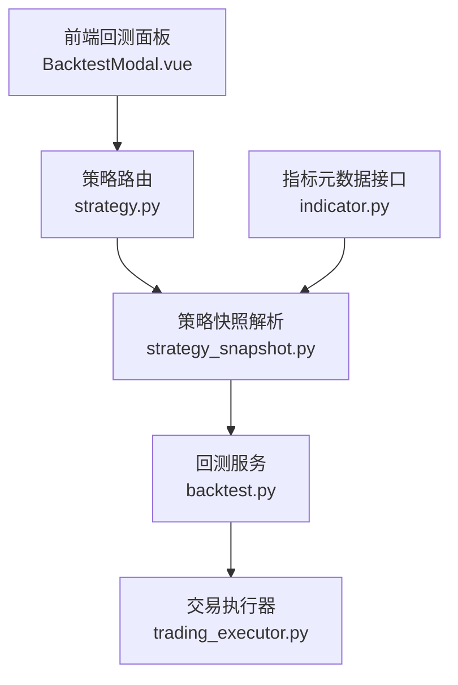
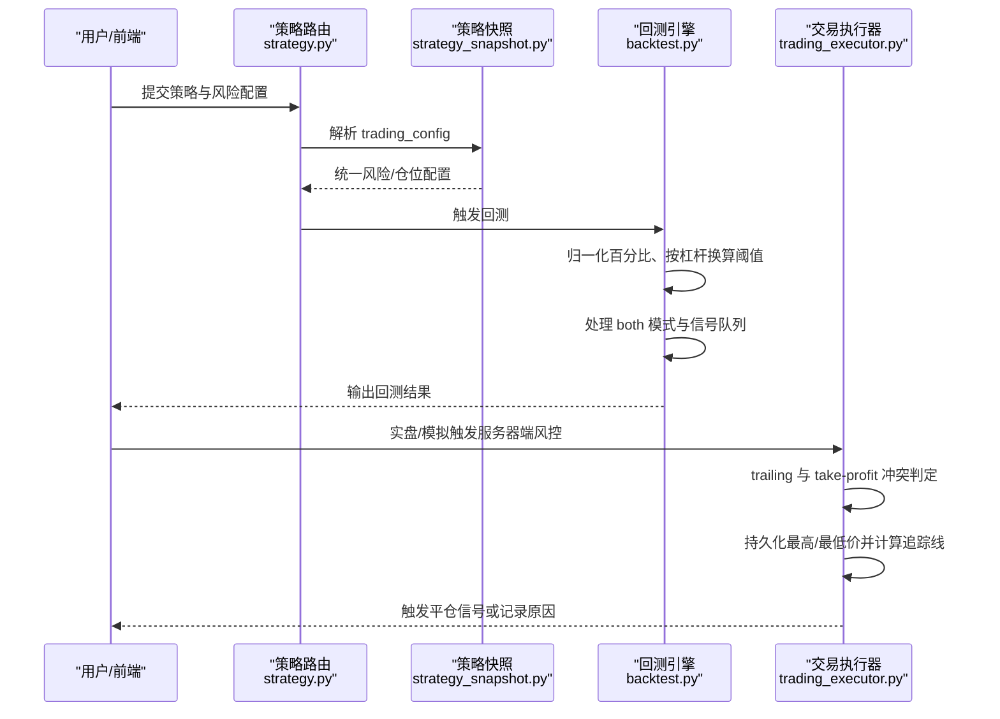
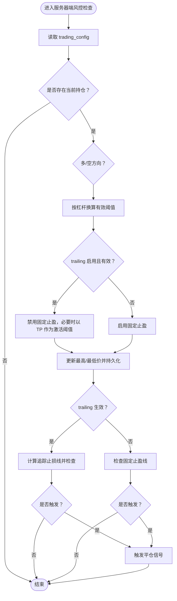
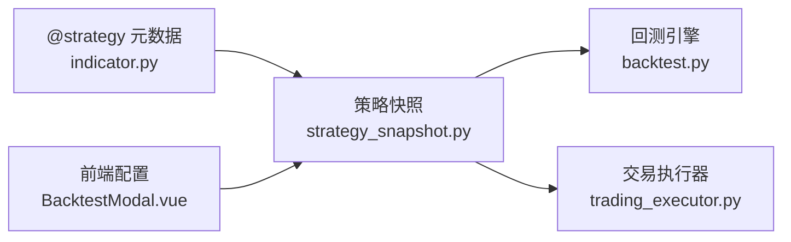

# 退出策略与风险管理

<cite>
**本文引用的文件**
- [STRATEGY_DEV_GUIDE.md](file://docs/STRATEGY_DEV_GUIDE.md)
- [STRATEGY_DEV_GUIDE_CN.md](file://docs/STRATEGY_DEV_GUIDE_CN.md)
- [trading_executor.py](file://backend_api_python/app/services/trading_executor.py)
- [backtest.py](file://backend_api_python/app/services/backtest.py)
- [strategy_snapshot.py](file://backend_api_python/app/services/strategy_snapshot.py)
- [indicator.py](file://backend_api_python/app/routes/indicator.py)
- [strategy.py](file://backend_api_python/app/routes/strategy.py)
- [dual_ma_with_params.py](file://docs/examples/dual_ma_with_params.py)
- [multi_indicator_composite.py](file://docs/examples/multi_indicator_composite.py)
- [BacktestModal.vue](file://frontend/src/views/indicator-analysis/components/BacktestModal.vue)
- [simulate_trading_executor.py](file://backend_api_python/scripts/simulate_trading_executor.py)
</cite>

## 目录
1. [简介](#简介)
2. [项目结构](#项目结构)
3. [核心组件](#核心组件)
4. [架构总览](#架构总览)
5. [详细组件分析](#详细组件分析)
6. [依赖关系分析](#依赖关系分析)
7. [性能考量](#性能考量)
8. [故障排查指南](#故障排查指南)
9. [结论](#结论)
10. [附录](#附录)

## 简介
本指南聚焦于 IndicatorStrategy 的退出策略与风险管理，系统阐述两类退出风格（信号管理式退出与引擎管理式退出）及其适用场景；详解固定止损、止盈与追踪止损的实现方式及参数 stopLossPct、takeProfitPct、trailingStopPct、trailingActivationPct 的使用；给出基于技术指标的动态退出与基于固定规则的简单退出示例；解释 tradeDirection 参数对策略行为的影响（long、short、both）；并总结风险管理最佳实践，帮助在风险控制与盈利机会之间取得平衡。

## 项目结构
围绕退出与风控的关键代码分布在以下模块：
- 后端服务层
  - 策略快照解析与标准化：strategy_snapshot.py
  - 回测执行与风控：backtest.py
  - 实盘/模拟引擎的服务器端风控：trading_executor.py
  - 指标策略元数据与参数校验：indicator.py
  - 策略路由与编译：strategy.py
- 前端交互层
  - 回测配置弹窗（含风险参数输入）：BacktestModal.vue
- 示例与脚本
  - 文档示例策略：dual_ma_with_params.py、multi_indicator_composite.py
  - 模拟引擎演示脚本：simulate_trading_executor.py

图表来源
- [strategy.py:1-200](file://backend_api_python/app/routes/strategy.py#L1-L200)
- [strategy_snapshot.py:52-101](file://backend_api_python/app/services/strategy_snapshot.py#L52-L101)
- [backtest.py:700-899](file://backend_api_python/app/services/backtest.py#L700-L899)
- [trading_executor.py:1770-1969](file://backend_api_python/app/services/trading_executor.py#L1770-L1969)
- [indicator.py:1030-1060](file://backend_api_python/app/routes/indicator.py#L1030-L1060)

章节来源
- [strategy.py:1-200](file://backend_api_python/app/routes/strategy.py#L1-L200)
- [strategy_snapshot.py:52-101](file://backend_api_python/app/services/strategy_snapshot.py#L52-L101)
- [backtest.py:700-899](file://backend_api_python/app/services/backtest.py#L700-L899)
- [trading_executor.py:1770-1969](file://backend_api_python/app/services/trading_executor.py#L1770-L1969)
- [indicator.py:1030-1060](file://backend_api_python/app/routes/indicator.py#L1030-L1060)

## 核心组件
- 策略快照解析（strategy_snapshot.py）
  - 将 trading_config 中的风险与仓位配置转换为统一格式，支持百分比归一化、信号时机选择（next_bar_open 或 same_bar_close）。
- 回测引擎（backtest.py）
  - 解析 stopLossPct、takeProfitPct、trailing* 配置，按杠杆换算有效阈值，处理 both 模式下的多空互平逻辑，构建信号队列并驱动回测。
- 交易执行器（trading_executor.py）
  - 提供服务器端止损、止盈与追踪止损检查，支持 trailing 与 take-profit 冲突规则（启用 trailing 则禁用固定止盈），并持久化最高/最低价格以延续追踪。
- 指标策略元数据（indicator.py）
  - 定义 @strategy 支持的键（stopLossPct、takeProfitPct、entryPct、trailingEnabled、trailingStopPct、trailingActivationPct、tradeDirection），并强调不将 leverage 放入 @strategy。
- 前端回测配置（BacktestModal.vue）
  - 将用户输入的风险参数（止损、止盈、追踪止损、激活阈值）转换为后端可接受的百分比格式，传递给策略快照与回测。

章节来源
- [strategy_snapshot.py:52-101](file://backend_api_python/app/services/strategy_snapshot.py#L52-L101)
- [backtest.py:700-899](file://backend_api_python/app/services/backtest.py#L700-L899)
- [trading_executor.py:1770-1969](file://backend_api_python/app/services/trading_executor.py#L1770-L1969)
- [indicator.py:1030-1060](file://backend_api_python/app/routes/indicator.py#L1030-L1060)
- [BacktestModal.vue:1227-1260](file://frontend/src/views/indicator-analysis/components/BacktestModal.vue#L1227-L1260)

## 架构总览
下图展示从用户配置到回测/实盘风控的整体流程，重点标注了风险参数的归一化、阈值换算与冲突处理。

图表来源
- [strategy.py:1-200](file://backend_api_python/app/routes/strategy.py#L1-L200)
- [strategy_snapshot.py:52-101](file://backend_api_python/app/services/strategy_snapshot.py#L52-L101)
- [backtest.py:700-899](file://backend_api_python/app/services/backtest.py#L700-L899)
- [trading_executor.py:1770-1969](file://backend_api_python/app/services/trading_executor.py#L1770-L1969)

## 详细组件分析

### 两类退出策略风格
- 信号管理式退出（Signal-managed exits）
  - 由指标逻辑直接决定何时退出，设置 df['sell'] 或反向信号作为退出条件。
  - 适合“入场即明确退出条件”的策略，如突破止损线、均值回归目标位等。
- 引擎管理式退出（Engine-managed exits）
  - 使用 # @strategy 声明固定止损、止盈与追踪止损，默认由引擎在运行时检查并触发。
  - 适合希望保持信号逻辑简洁、将风控作为默认保护的策略。

章节来源
- [STRATEGY_DEV_GUIDE.md:202-242](file://docs/STRATEGY_DEV_GUIDE.md#L202-L242)
- [STRATEGY_DEV_GUIDE_CN.md:320-365](file://docs/STRATEGY_DEV_GUIDE_CN.md#L320-L365)

### 固定止损、止盈与追踪止损实现
- 参数定义与范围
  - stopLossPct、takeProfitPct：0–1（引擎按 margin PnL 语义使用）
  - trailingStopPct、trailingActivationPct：0–1
  - trailingEnabled：布尔
  - entryPct：0.01–1.0（资金分配比例）
- 阈值换算与冲突规则
  - 回测与执行均按 leverage 换算有效阈值：有效阈值 = 用户阈值 / leverage
  - trailing 启用时，固定止盈被禁用，避免歧义；若未设置 trailing activation，则复用 takeProfit 作为激活阈值
- 服务器端风控检查（trading_executor.py）
  - 长/空分别计算追踪止损线与止盈线，满足条件即触发平仓
  - 持久化最高/最低价，重启后继续追踪
  - trailing 与 take-profit 冲突：启用 trailing 则禁用固定止盈

图表来源
- [trading_executor.py:1781-1937](file://backend_api_python/app/services/trading_executor.py#L1781-L1937)

章节来源
- [trading_executor.py:1781-1969](file://backend_api_python/app/services/trading_executor.py#L1781-L1969)
- [backtest.py:713-725](file://backend_api_python/app/services/backtest.py#L713-L725)
- [backtest.py:2438-2460](file://backend_api_python/app/services/backtest.py#L2438-L2460)

### 基于技术指标的动态退出示例
- 基于 ATR 的止损线示例（信号管理式退出）
  - 通过滚动最高价与 ATR 计算止损线，当收盘价跌破止损线且首次触发时生成 sell 信号
  - 适合趋势跟踪类策略将止损内生化
- 参考路径
  - [STRATEGY_DEV_GUIDE.md:326-345](file://docs/STRATEGY_DEV_GUIDE.md#L326-L345)
  - [STRATEGY_DEV_GUIDE_CN.md:320-345](file://docs/STRATEGY_DEV_GUIDE_CN.md#L320-L345)

章节来源
- [STRATEGY_DEV_GUIDE.md:326-345](file://docs/STRATEGY_DEV_GUIDE.md#L326-L345)
- [STRATEGY_DEV_GUIDE_CN.md:320-345](file://docs/STRATEGY_DEV_GUIDE_CN.md#L320-L345)

### 基于固定规则的简单退出示例
- 双均线交叉策略（引擎管理式退出）
  - 使用 # @strategy 设置 stopLossPct、takeProfitPct、entryPct、tradeDirection both
  - 信号仅表达入场意图，风控由引擎默认配置接管
- 参考路径
  - [dual_ma_with_params.py:24-30](file://docs/examples/dual_ma_with_params.py#L24-L30)

章节来源
- [dual_ma_with_params.py:24-30](file://docs/examples/dual_ma_with_params.py#L24-L30)

### tradeDirection 参数对策略行为的影响
- long：仅允许多头方向
- short：仅允许空头方向
- both：允许双向，且在入场新仓前自动平掉相反仓（互换方向）
- 回测与执行均尊重 tradeDirection，确保策略意图与实际行为一致

章节来源
- [indicator.py:1034-1037](file://backend_api_python/app/routes/indicator.py#L1034-L1037)
- [backtest.py:789-812](file://backend_api_python/app/services/backtest.py#L789-L812)
- [backtest.py:3204-3350](file://backend_api_python/app/services/backtest.py#L3204-L3350)

### 前端风险参数输入与归一化
- 前端将用户输入（百分比）转换为 0–1 的比例，传入后端
- 后端在 strategy_snapshot.py 中统一归一化，保证跨模块一致性

章节来源
- [BacktestModal.vue:1227-1260](file://frontend/src/views/indicator-analysis/components/BacktestModal.vue#L1227-L1260)
- [strategy_snapshot.py:44-50](file://backend_api_python/app/services/strategy_snapshot.py#L44-L50)

### 模拟引擎演示（追踪止损）
- 演示脚本通过设置 trailing_enabled、trailing_activation_pct、trailing_stop_pct 等参数，构建触发追踪止损的价格路径
- 便于验证 trailing 逻辑与阈值换算

章节来源
- [simulate_trading_executor.py:314-335](file://backend_api_python/scripts/simulate_trading_executor.py#L314-L335)

## 依赖关系分析
- 策略快照解析依赖 trading_config 的键集合，负责将百分比归一化与信号时机标准化
- 回测引擎依赖策略快照中的风险配置，按杠杆换算阈值并处理 both 模式
- 交易执行器在实盘/模拟阶段独立进行风控检查，与回测阈值换算保持一致语义
- 指标策略元数据接口约束 @strategy 键集合，避免将 leverage 放入策略源码

图表来源
- [indicator.py:1030-1060](file://backend_api_python/app/routes/indicator.py#L1030-L1060)
- [strategy_snapshot.py:52-101](file://backend_api_python/app/services/strategy_snapshot.py#L52-L101)
- [backtest.py:700-899](file://backend_api_python/app/services/backtest.py#L700-L899)
- [trading_executor.py:1770-1969](file://backend_api_python/app/services/trading_executor.py#L1770-L1969)
- [BacktestModal.vue:1227-1260](file://frontend/src/views/indicator-analysis/components/BacktestModal.vue#L1227-L1260)

章节来源
- [indicator.py:1030-1060](file://backend_api_python/app/routes/indicator.py#L1030-L1060)
- [strategy_snapshot.py:52-101](file://backend_api_python/app/services/strategy_snapshot.py#L52-L101)
- [backtest.py:700-899](file://backend_api_python/app/services/backtest.py#L700-L899)
- [trading_executor.py:1770-1969](file://backend_api_python/app/services/trading_executor.py#L1770-L1969)
- [BacktestModal.vue:1227-1260](file://frontend/src/views/indicator-analysis/components/BacktestModal.vue#L1227-L1260)

## 性能考量
- 阈值换算按杠杆进行，避免重复计算，提高回测/执行一致性
- trailing 通过持久化最高/最低价减少重启后的状态丢失
- both 模式下的互换平仓逻辑在回测中一次性完成，避免多次遍历

## 故障排查指南
- 阈值无效或过小
  - 检查是否正确按 leverage 换算有效阈值；确认 trailing 与 take-profit 冲突规则
- trailing 未生效
  - 确认 trailing_enabled 与 trailing_pct 已设置；若未设置 activation，需确保 takeProfit 已配置
- both 模式下方向切换异常
  - 检查是否在入场新仓前自动平掉相反仓；确认信号索引与 df 对齐
- 前端参数未生效
  - 确认前端已将百分比转换为 0–1；后端快照解析是否正确归一化

章节来源
- [trading_executor.py:1781-1969](file://backend_api_python/app/services/trading_executor.py#L1781-L1969)
- [backtest.py:713-725](file://backend_api_python/app/services/backtest.py#L713-L725)
- [backtest.py:2438-2460](file://backend_api_python/app/services/backtest.py#L2438-L2460)
- [BacktestModal.vue:1227-1260](file://frontend/src/views/indicator-analysis/components/BacktestModal.vue#L1227-L1260)

## 结论
- 信号管理式退出适合将止损/止盈内生化的策略，逻辑清晰、边界明确
- 引擎管理式退出适合保持信号简洁、将风控作为默认保护的策略
- 正确理解并使用 stopLossPct、takeProfitPct、trailingStopPct、trailingActivationPct 以及 tradeDirection，可在回测与实盘中获得一致的行为
- 遵循阈值换算与冲突规则，结合 both 模式与持久化追踪，可实现稳健的风险控制

## 附录
- 示例策略参考
  - 双均线交叉（引擎管理式退出）：[dual_ma_with_params.py:24-30](file://docs/examples/dual_ma_with_params.py#L24-L30)
  - 多指标组合（引擎管理式退出）：[multi_indicator_composite.py:26-34](file://docs/examples/multi_indicator_composite.py#L26-L34)
- 关键实现参考
  - 服务器端风控检查与冲突处理：[trading_executor.py:1781-1969](file://backend_api_python/app/services/trading_executor.py#L1781-L1969)
  - 回测阈值换算与 both 模式：[backtest.py:713-725](file://backend_api_python/app/services/backtest.py#L713-L725), [backtest.py:3204-3350](file://backend_api_python/app/services/backtest.py#L3204-L3350)
  - 快照解析与归一化：[strategy_snapshot.py:44-50](file://backend_api_python/app/services/strategy_snapshot.py#L44-L50), [strategy_snapshot.py:52-101](file://backend_api_python/app/services/strategy_snapshot.py#L52-L101)
  - 指标元数据与参数约束：[indicator.py:1030-1060](file://backend_api_python/app/routes/indicator.py#L1030-L1060)
  - 前端风险参数输入：[BacktestModal.vue:1227-1260](file://frontend/src/views/indicator-analysis/components/BacktestModal.vue#L1227-L1260)
  - 追踪止损模拟演示：[simulate_trading_executor.py:314-335](file://backend_api_python/scripts/simulate_trading_executor.py#L314-L335)