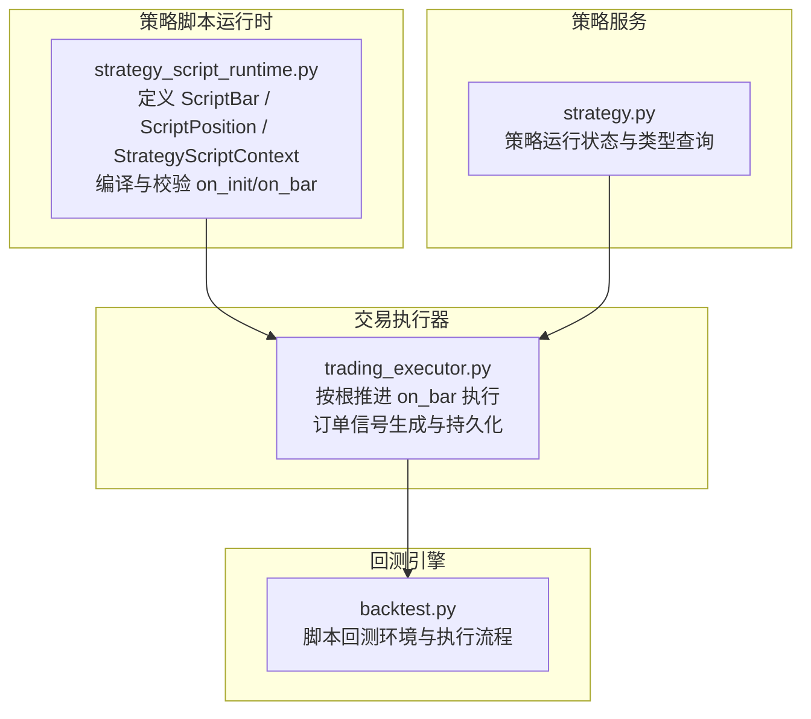
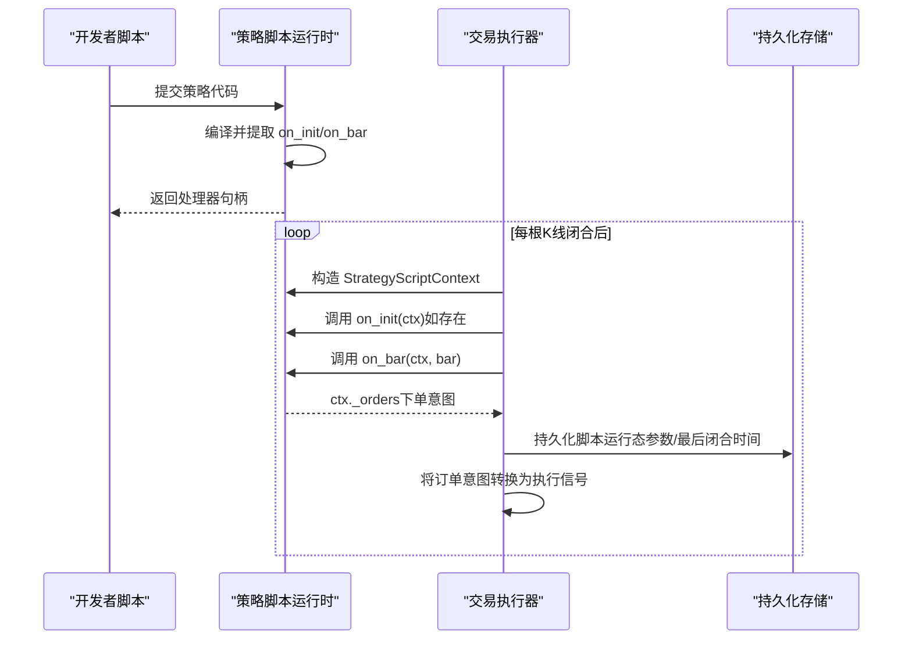
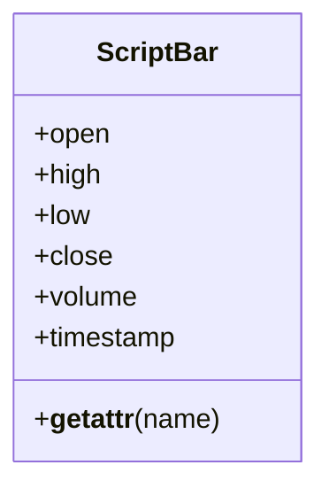
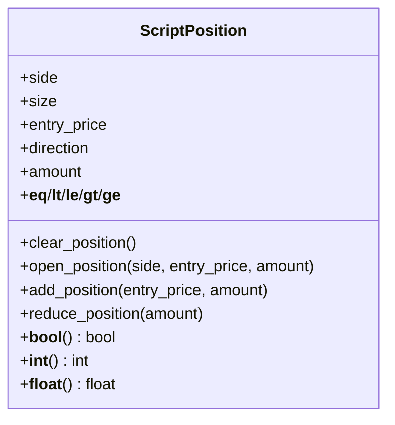
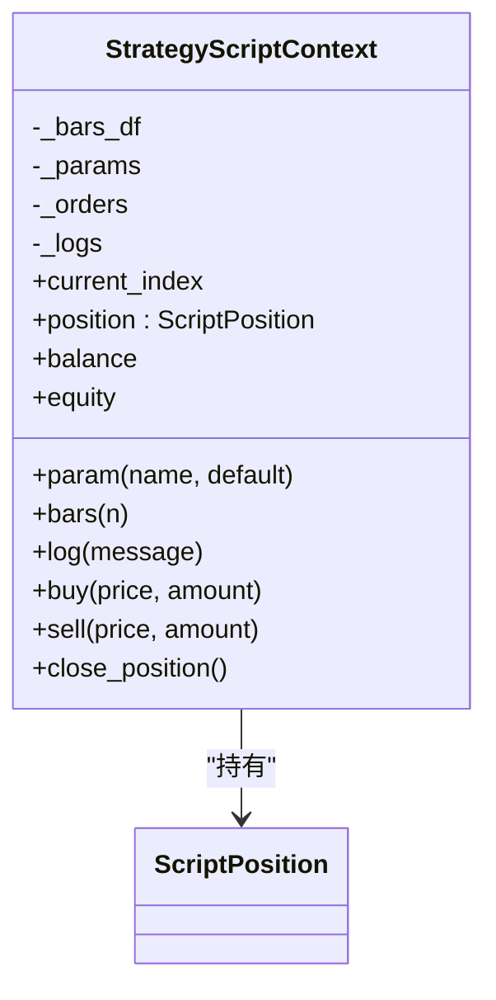
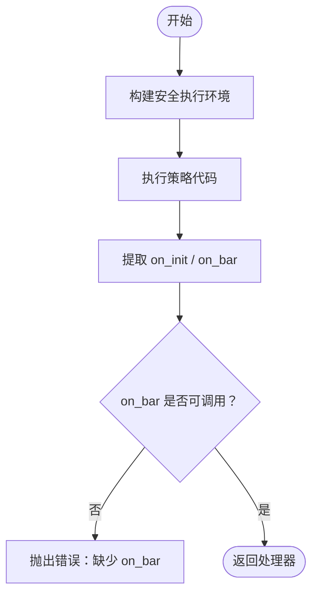
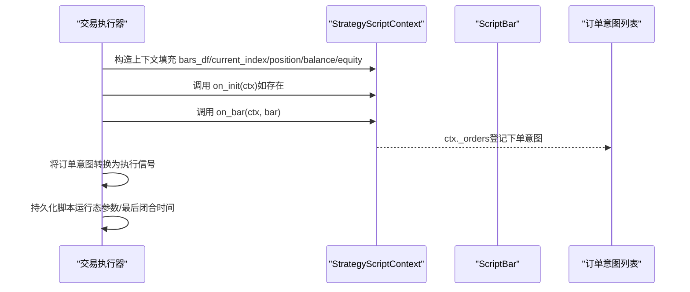
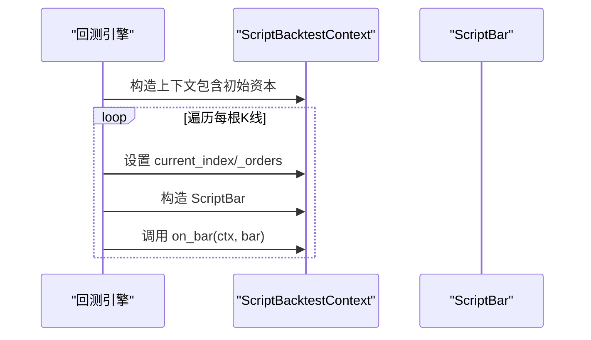
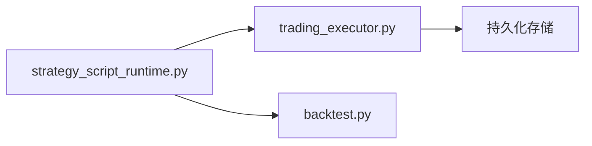

# ScriptStrategy开发

<cite>
**本文引用的文件**
- [strategy_script_runtime.py](file://backend_api_python/app/services/strategy_script_runtime.py)
- [trading_executor.py](file://backend_api_python/app/services/trading_executor.py)
- [STRATEGY_DEV_GUIDE.md](file://docs/STRATEGY_DEV_GUIDE.md)
- [backtest.py](file://backend_api_python/app/services/backtest.py)
- [strategy.py](file://backend_api_python/app/services/strategy.py)
</cite>

## 目录
1. [简介](#简介)
2. [项目结构](#项目结构)
3. [核心组件](#核心组件)
4. [架构总览](#架构总览)
5. [详细组件分析](#详细组件分析)
6. [依赖分析](#依赖分析)
7. [性能考虑](#性能考虑)
8. [故障排查指南](#故障排查指南)
9. [结论](#结论)
10. [附录](#附录)

## 简介
本指南面向希望开发事件驱动型策略（ScriptStrategy）的开发者，聚焦于需要运行时状态管理与精确执行控制的复杂策略。文档将系统讲解：
- 事件驱动策略的开发范式与运行机制
- on_init 与 on_bar 函数的职责、必要性与实现要点
- ctx 上下文对象的能力边界与使用方式（参数访问、K线数据获取、位置状态检查、买卖下单与平仓）
- bar 对象的数据结构与属性
- 实战示例路径：动态止损止盈、部分平仓、金字塔加仓等高级功能
- 与 IndicatorStrategy 的差异与适用场景

## 项目结构
围绕 ScriptStrategy 的核心实现位于后端服务层，主要涉及策略脚本运行时、交易执行器与回测引擎。下图展示了与 ScriptStrategy 相关的关键模块及其交互。

**图表来源**
- [strategy_script_runtime.py:17-191](file://backend_api_python/app/services/strategy_script_runtime.py#L17-L191)
- [trading_executor.py:536-773](file://backend_api_python/app/services/trading_executor.py#L536-L773)
- [backtest.py:1995-2182](file://backend_api_python/app/services/backtest.py#L1995-L2182)
- [strategy.py:14-57](file://backend_api_python/app/services/strategy.py#L14-L57)

**章节来源**
- [strategy_script_runtime.py:17-191](file://backend_api_python/app/services/strategy_script_runtime.py#L17-L191)
- [trading_executor.py:536-773](file://backend_api_python/app/services/trading_executor.py#L536-L773)
- [backtest.py:1995-2182](file://backend_api_python/app/services/backtest.py#L1995-L2182)
- [strategy.py:14-57](file://backend_api_python/app/services/strategy.py#L14-L57)

## 核心组件
- ScriptBar：封装单根K线数据，支持字典与属性两种访问方式，包含开盘、最高、最低、收盘、成交量与时间戳字段。
- ScriptPosition：封装当前持仓状态，支持布尔判断、数值比较与方向判断；提供开仓、加仓、减仓与清仓操作。
- StrategyScriptContext：策略运行时上下文，提供参数读取、历史K线访问、日志记录、下单意图登记与账户余额/净值快照。
- 编译器：校验并提取 on_init 与 on_bar，确保 on_bar 必须存在，on_init 可选但建议保留以初始化状态或记录日志。
- 交易执行器：按根推进 on_bar，将 ctx 订单意图转换为执行信号，持久化脚本运行态，支持 bot 模式下的 tick 推进。

**章节来源**
- [strategy_script_runtime.py:17-112](file://backend_api_python/app/services/strategy_script_runtime.py#L17-L112)
- [strategy_script_runtime.py:114-158](file://backend_api_python/app/services/strategy_script_runtime.py#L114-L158)
- [strategy_script_runtime.py:159-191](file://backend_api_python/app/services/strategy_script_runtime.py#L159-L191)
- [trading_executor.py:536-773](file://backend_api_python/app/services/trading_executor.py#L536-L773)

## 架构总览
下图展示了 ScriptStrategy 从脚本编译、按根推进执行到订单落地的全链路。

**图表来源**
- [strategy_script_runtime.py:159-191](file://backend_api_python/app/services/strategy_script_runtime.py#L159-L191)
- [trading_executor.py:536-773](file://backend_api_python/app/services/trading_executor.py#L536-L773)

**章节来源**
- [strategy_script_runtime.py:159-191](file://backend_api_python/app/services/strategy_script_runtime.py#L159-L191)
- [trading_executor.py:536-773](file://backend_api_python/app/services/trading_executor.py#L536-L773)

## 详细组件分析

### 组件一：ScriptBar 数据结构
- 字段：open、high、low、close、volume、timestamp
- 访问方式：既可通过字典键访问，也支持点号属性访问
- 用途：在 on_bar 中读取当前或历史K线的价格与成交量信息

**图表来源**
- [strategy_script_runtime.py:17-23](file://backend_api_python/app/services/strategy_script_runtime.py#L17-L23)

**章节来源**
- [strategy_script_runtime.py:17-23](file://backend_api_python/app/services/strategy_script_runtime.py#L17-L23)

### 组件二：ScriptPosition 持仓模型
- 支持布尔判断：当有持仓且size>0时为真
- 支持数值比较：通过方向与数值表达多空状态
- 方法：
  - open_position(side, entry_price, amount)：开仓
  - add_position(entry_price, amount)：加仓（均价更新）
  - reduce_position(amount)：减仓（接近0时清仓）
  - clear_position()：清仓

**图表来源**
- [strategy_script_runtime.py:25-112](file://backend_api_python/app/services/strategy_script_runtime.py#L25-L112)

**章节来源**
- [strategy_script_runtime.py:25-112](file://backend_api_python/app/services/strategy_script_runtime.py#L25-L112)

### 组件三：StrategyScriptContext 上下文
- 关键能力：
  - ctx.param(name, default)：读取或初始化脚本级参数
  - ctx.bars(n)：获取最近 n 根K线（包含当前根）
  - ctx.log(message)：记录日志
  - ctx.buy/sell/close_position：登记下单意图
  - ctx.position：当前持仓对象
  - ctx.balance / ctx.equity：账户余额与净值快照
- 运行时推进：
  - 交易执行器每根K线闭合后构造 ctx，填充 bars_df、current_index、position 等
  - 调用 on_bar(ctx, bar)，随后将 ctx._orders 转换为执行信号并持久化运行态

**图表来源**
- [strategy_script_runtime.py:114-158](file://backend_api_python/app/services/strategy_script_runtime.py#L114-L158)
- [trading_executor.py:719-773](file://backend_api_python/app/services/trading_executor.py#L719-L773)

**章节来源**
- [strategy_script_runtime.py:114-158](file://backend_api_python/app/services/strategy_script_runtime.py#L114-L158)
- [trading_executor.py:719-773](file://backend_api_python/app/services/trading_executor.py#L719-L773)

### 组件四：脚本编译与校验
- 编译流程：
  - 构建安全执行环境（内置库受限）
  - 执行策略代码，提取 on_init 与 on_bar
  - 校验：必须存在 on_bar；on_init 可选但需可调用
- 产物：返回 (on_init, on_bar) 处理器，供后续按根推进调用

**图表来源**
- [strategy_script_runtime.py:159-191](file://backend_api_python/app/services/strategy_script_runtime.py#L159-L191)

**章节来源**
- [strategy_script_runtime.py:159-191](file://backend_api_python/app/services/strategy_script_runtime.py#L159-L191)

### 组件五：按根推进与订单信号生成
- 推进逻辑：
  - 交易执行器在每根K线闭合后，构造 StrategyScriptContext
  - 填充 bars_df、current_index、position 等
  - 调用 on_bar(ctx, bar)，在其中登记下单意图
  - 将 ctx._orders 转换为执行信号（开多、开空、加仓、平仓等），并持久化脚本运行态
- bot 模式：
  - 在 bot 模式下，可能以 tick 为单位推进，合成“tick级”bar，适合网格、定投等实时策略

**图表来源**
- [trading_executor.py:536-773](file://backend_api_python/app/services/trading_executor.py#L536-L773)

**章节来源**
- [trading_executor.py:536-773](file://backend_api_python/app/services/trading_executor.py#L536-L773)

### 组件六：回测执行环境（脚本回测）
- 回测服务同样提供脚本回测环境，构造 ScriptBacktestContext，逐根推进执行 on_bar
- 该环境与实盘的 StrategyScriptContext 行为保持一致，便于一致性验证

**图表来源**
- [backtest.py:1995-2182](file://backend_api_python/app/services/backtest.py#L1995-L2182)

**章节来源**
- [backtest.py:1995-2182](file://backend_api_python/app/services/backtest.py#L1995-L2182)

## 依赖分析
- 模块耦合：
  - strategy_script_runtime.py 为独立运行时模块，提供 ScriptBar、ScriptPosition、StrategyScriptContext 与编译器
  - trading_executor.py 依赖 strategy_script_runtime.py 的上下文与编译器，负责按根推进与订单信号生成
  - backtest.py 提供脚本回测环境，行为与实盘上下文对齐
- 外部依赖：
  - pandas/numpy 用于数据结构与计算
  - 安全执行环境（受限内置库）保障脚本沙箱执行

**图表来源**
- [strategy_script_runtime.py:17-191](file://backend_api_python/app/services/strategy_script_runtime.py#L17-L191)
- [trading_executor.py:536-773](file://backend_api_python/app/services/trading_executor.py#L536-L773)
- [backtest.py:1995-2182](file://backend_api_python/app/services/backtest.py#L1995-L2182)

**章节来源**
- [strategy_script_runtime.py:17-191](file://backend_api_python/app/services/strategy_script_runtime.py#L17-L191)
- [trading_executor.py:536-773](file://backend_api_python/app/services/trading_executor.py#L536-L773)
- [backtest.py:1995-2182](file://backend_api_python/app/services/backtest.py#L1995-L2182)

## 性能考虑
- 计算复杂度：
  - ctx.bars(n) 通过切片与迭代构造 ScriptBar 列表，时间复杂度 O(n)
  - ScriptPosition 的加仓/减仓为 O(1)
- 内存占用：
  - bars_df 与 _orders 列表随回测/实盘推进增长，注意在长序列策略中避免过度缓存
- 执行效率：
  - on_bar 应尽量避免重复计算，利用 ctx.param 与缓存结果
  - 在 bot 模式下 tick 推进频率较高，应减少 IO 与外部依赖

## 故障排查指南
- 常见问题与定位：
  - 缺少 on_bar：编译阶段即报错，提示必须定义 on_bar
  - on_init 未导出或不可调用：不影响运行，但建议保留以初始化状态
  - 代码执行失败：检查沙箱限制与语法错误
  - 订单未生成：确认 on_bar 中是否正确登记了 ctx.buy/sell/close_position
  - 运行态未持久化：检查交易执行器的持久化逻辑与数据库连接
- 日志与可观测性：
  - 使用 ctx.log 记录关键状态
  - 查看交易执行器的日志输出，定位 on_bar 异常与信号生成过程

**章节来源**
- [strategy_script_runtime.py:159-191](file://backend_api_python/app/services/strategy_script_runtime.py#L159-L191)
- [trading_executor.py:588-599](file://backend_api_python/app/services/trading_executor.py#L588-L599)

## 结论
ScriptStrategy 通过事件驱动与运行时上下文，提供了对策略状态与执行的精细控制。其核心在于：
- 明确 on_init 与 on_bar 的职责边界
- 合理使用 ctx.param、ctx.bars、ctx.position、ctx.buy/sell/close_position
- 将动态风险与仓位管理逻辑置于 on_bar 中，结合 ScriptPosition 的加减仓能力实现金字塔、部分平仓等高级功能
- 与 IndicatorStrategy 的区别：前者强调“按根推进的事件驱动执行”，后者强调“基于DataFrame的信号生成与回测”

## 附录

### A. on_init 与 on_bar 的实现要点
- on_init：
  - 作用：初始化脚本级参数、状态或日志
  - 建议：即使为空也保留，确保产品侧校验通过
- on_bar：
  - 作用：接收 ctx 与 bar，基于当前状态与数据做出下单决策
  - 必须：必须存在且可调用
  - 最佳实践：先检查 ctx.position，再根据技术条件决定开仓、加仓、减仓或平仓

**章节来源**
- [strategy_script_runtime.py:159-191](file://backend_api_python/app/services/strategy_script_runtime.py#L159-L191)
- [STRATEGY_DEV_GUIDE.md:582-594](file://docs/STRATEGY_DEV_GUIDE.md#L582-L594)

### B. ctx 上下文对象能力清单
- 参数与数据
  - ctx.param(name, default)：读取或初始化脚本级参数
  - ctx.bars(n)：获取最近 n 根K线（包含当前根）
- 位置与账户
  - ctx.position：当前持仓对象（支持布尔/数值比较与字段访问）
  - ctx.balance / ctx.equity：账户余额与净值快照
- 下单与日志
  - ctx.buy(price=None, amount=None)：登记做多意图
  - ctx.sell(price=None, amount=None)：登记做空意图
  - ctx.close_position()：登记平仓意图
  - ctx.log(message)：记录日志

**章节来源**
- [strategy_script_runtime.py:114-158](file://backend_api_python/app/services/strategy_script_runtime.py#L114-L158)
- [STRATEGY_DEV_GUIDE.md:1174-1197](file://docs/STRATEGY_DEV_GUIDE.md#L1174-L1197)

### C. bar 对象数据结构
- 字段：open、high、low、close、volume、timestamp
- 访问方式：字典键或属性访问
- 用途：在 on_bar 中读取当前或历史K线的价格与成交量

**章节来源**
- [strategy_script_runtime.py:17-23](file://backend_api_python/app/services/strategy_script_runtime.py#L17-L23)
- [STRATEGY_DEV_GUIDE.md:1198-1208](file://docs/STRATEGY_DEV_GUIDE.md#L1198-L1208)

### D. 实战示例路径（代码片段路径）
以下示例展示了 ScriptStrategy 的典型用法，具体实现请参考对应路径：
- 基础示例（含动态止损止盈、多空切换、平仓逻辑）
  - 示例路径：[STRATEGY_DEV_GUIDE.md:711-765](file://docs/STRATEGY_DEV_GUIDE.md#L711-L765)
- 运行时退出示例（基于历史窗口与移动平均交叉）
  - 示例路径：[STRATEGY_DEV_GUIDE.md:637-681](file://docs/STRATEGY_DEV_GUIDE.md#L637-L681)

### E. 与 IndicatorStrategy 的区别与适用场景
- IndicatorStrategy：
  - 基于 DataFrame 的信号生成与回测
  - 适合“信号优先”的策略原型与参数优化
  - 默认风控（止损/止盈/移动止损）通常由引擎根据元数据注入
- ScriptStrategy：
  - 事件驱动，强调按根推进与运行时状态管理
  - 适合需要动态风控、部分平仓、金字塔加仓、bot风格逻辑的策略
  - 与产品配置（杠杆、符号、交易方向等）解耦，参数与风控逻辑放在脚本内

**章节来源**
- [STRATEGY_DEV_GUIDE.md:7-56](file://docs/STRATEGY_DEV_GUIDE.md#L7-L56)
- [STRATEGY_DEV_GUIDE.md:570-780](file://docs/STRATEGY_DEV_GUIDE.md#L570-L780)