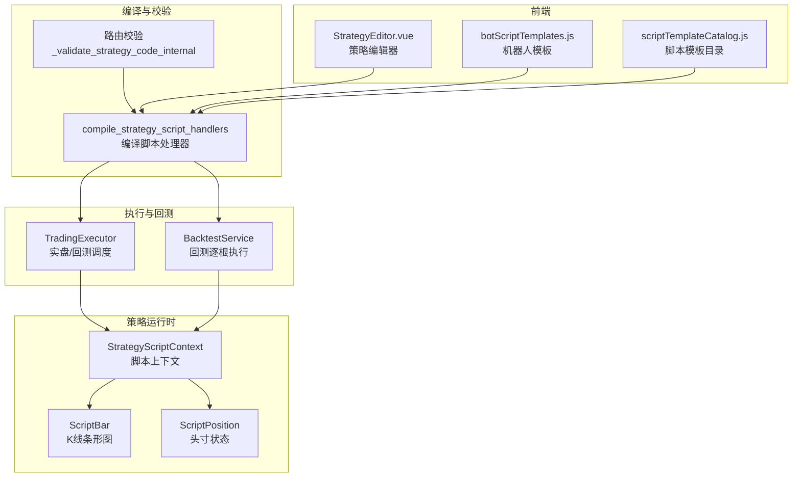
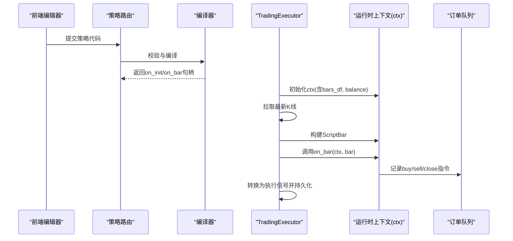
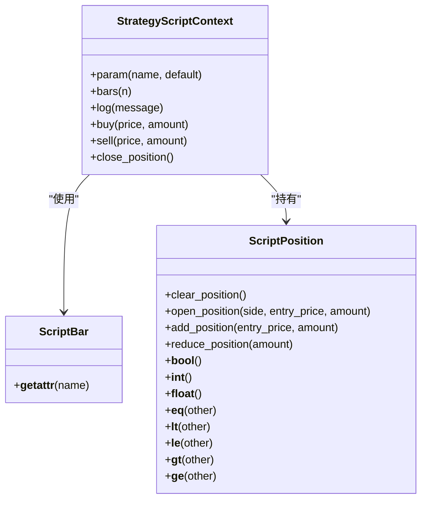
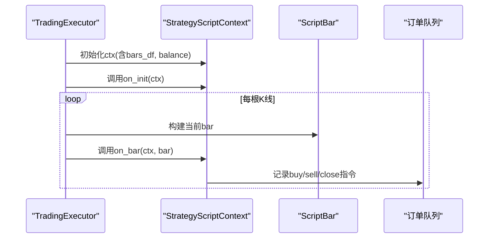
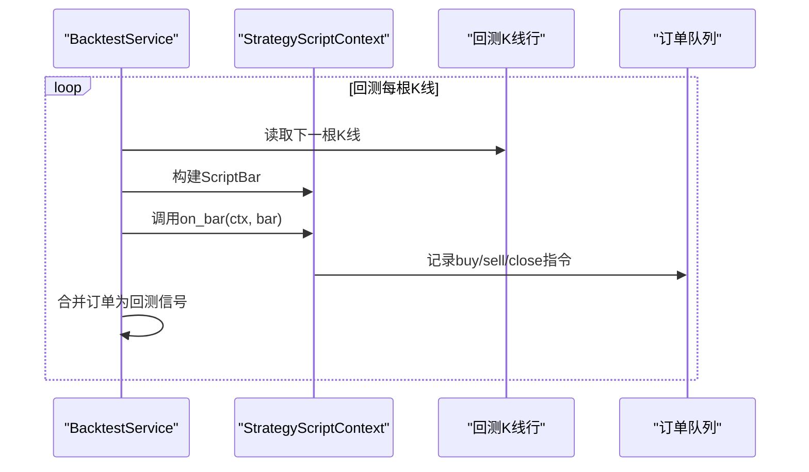
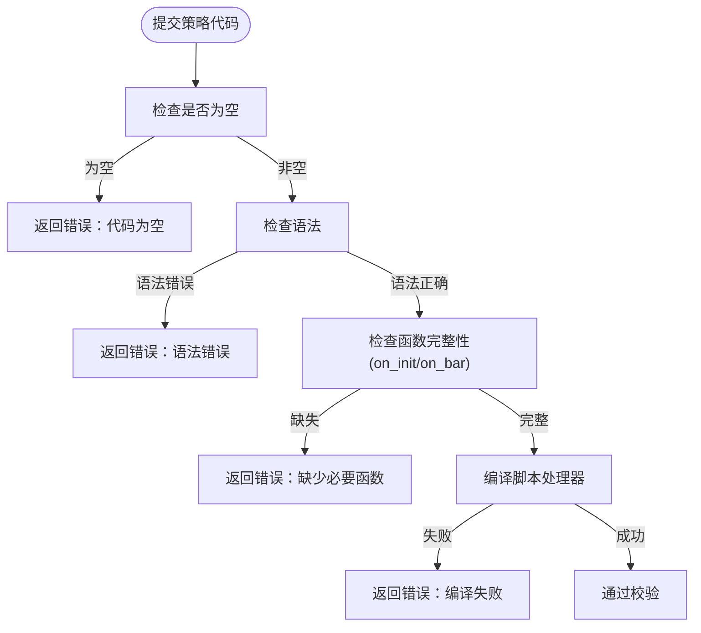
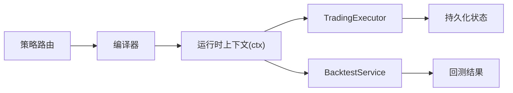

# ScriptStrategy核心概念

<cite>
**本文引用的文件**
- [strategy_script_runtime.py](file://backend_api_python/app/services/strategy_script_runtime.py)
- [trading_executor.py](file://backend_api_python/app/services/trading_executor.py)
- [backtest.py](file://backend_api_python/app/services/backtest.py)
- [strategy.py](file://backend_api_python/app/routes/strategy.py)
- [StrategyEditor.vue](file://frontend/src/views/trading-assistant/components/StrategyEditor.vue)
- [botScriptTemplates.js](file://frontend/src/views/trading-bot/components/botScriptTemplates.js)
- [scriptTemplateCatalog.js](file://frontend/src/views/trading-assistant/components/scriptTemplateCatalog.js)
- [STRATEGY_DEV_GUIDE_CN.md](file://docs/STRATEGY_DEV_GUIDE_CN.md)
</cite>

## 目录
1. [引言](#引言)
2. [项目结构](#项目结构)
3. [核心组件](#核心组件)
4. [架构总览](#架构总览)
5. [详细组件分析](#详细组件分析)
6. [依赖分析](#依赖分析)
7. [性能考虑](#性能考虑)
8. [故障排查指南](#故障排查指南)
9. [结论](#结论)
10. [附录](#附录)

## 引言
ScriptStrategy是QuantDinger平台提供的事件驱动型策略开发范式，面向需要“逐根K线”推进、具备运行时状态管理、动态仓位管理和精确执行控制的复杂交易策略。与基于DataFrame的IndicatorStrategy不同，ScriptStrategy以bar-by-bar的事件流为核心，通过on_init初始化状态、on_bar逐根处理逻辑，并通过ctx对象发出买卖指令，从而实现更贴近真实交易执行的策略生命周期。

## 项目结构
围绕ScriptStrategy的关键实现分布在以下模块：
- 运行时与上下文：StrategyScriptContext、ScriptBar、ScriptPosition
- 编译与校验：compile_strategy_script_handlers
- 执行引擎：TradingExecutor在实盘/回测中逐根调用on_bar
- 回测引擎：BacktestService在回测中逐根调用on_bar并生成信号
- API与质量检查：路由层对策略代码进行语法与函数完整性校验
- 前端模板与示例：提供策略编辑器与脚本模板

**图表来源**
- [strategy_script_runtime.py:17-191](file://backend_api_python/app/services/strategy_script_runtime.py#L17-L191)
- [trading_executor.py:1-200](file://backend_api_python/app/services/trading_executor.py#L1-L200)
- [backtest.py:2180-2209](file://backend_api_python/app/services/backtest.py#L2180-L2209)
- [strategy.py:67-122](file://backend_api_python/app/routes/strategy.py#L67-L122)
- [StrategyEditor.vue:395-423](file://frontend/src/views/trading-assistant/components/StrategyEditor.vue#L395-L423)
- [botScriptTemplates.js:66-84](file://frontend/src/views/trading-bot/components/botScriptTemplates.js#L66-L84)
- [scriptTemplateCatalog.js:79-99](file://frontend/src/views/trading-assistant/components/scriptTemplateCatalog.js#L79-L99)

**章节来源**
- [strategy_script_runtime.py:1-191](file://backend_api_python/app/services/strategy_script_runtime.py#L1-L191)
- [trading_executor.py:1-200](file://backend_api_python/app/services/trading_executor.py#L1-L200)
- [backtest.py:2180-2209](file://backend_api_python/app/services/backtest.py#L2180-L2209)
- [strategy.py:67-122](file://backend_api_python/app/routes/strategy.py#L67-L122)
- [StrategyEditor.vue:395-423](file://frontend/src/views/trading-assistant/components/StrategyEditor.vue#L395-L423)
- [botScriptTemplates.js:66-84](file://frontend/src/views/trading-bot/components/botScriptTemplates.js#L66-L84)
- [scriptTemplateCatalog.js:79-99](file://frontend/src/views/trading-assistant/components/scriptTemplateCatalog.js#L79-L99)

## 核心组件
- ScriptBar：封装单根K线的开盘、最高、最低、收盘、成交量与时间戳，支持属性访问。
- ScriptPosition：封装头寸方向、数量、均价等，提供开仓、加仓、减仓、清仓等操作。
- StrategyScriptContext：策略运行时上下文，持有bars历史、参数字典、订单队列、日志、当前索引、头寸、余额与净值；提供param、bars、log、buy、sell、close_position等方法。
- compile_strategy_script_handlers：编译用户脚本，提取on_init与on_bar函数，确保on_bar存在且可调用，on_init可选。

上述组件共同构成ScriptStrategy的事件驱动执行基础，使策略能够在每根K线到达时获得完整的市场信息与状态上下文，并以命令式的方式提交交易意图。

**章节来源**
- [strategy_script_runtime.py:17-191](file://backend_api_python/app/services/strategy_script_runtime.py#L17-L191)

## 架构总览
ScriptStrategy在平台中的执行路径如下：
- 用户在前端编辑策略代码，路由层进行语法与函数完整性校验。
- 编译器将策略脚本编译为可执行的on_init/on_bar句柄。
- TradingExecutor在实盘/回测中按K线推进，构建ScriptBar并调用on_bar。
- on_bar通过ctx发出买卖指令，TradingExecutor将其转换为待执行信号并持久化运行时状态。
- 回测引擎在回测中同样逐根调用on_bar，收集订单并生成回测结果。

**图表来源**
- [strategy.py:67-122](file://backend_api_python/app/routes/strategy.py#L67-L122)
- [strategy_script_runtime.py:159-191](file://backend_api_python/app/services/strategy_script_runtime.py#L159-L191)
- [trading_executor.py:739-771](file://backend_api_python/app/services/trading_executor.py#L739-L771)

**章节来源**
- [strategy.py:67-122](file://backend_api_python/app/routes/strategy.py#L67-L122)
- [strategy_script_runtime.py:159-191](file://backend_api_python/app/services/strategy_script_runtime.py#L159-L191)
- [trading_executor.py:739-771](file://backend_api_python/app/services/trading_executor.py#L739-L771)

## 详细组件分析

### 组件A：ScriptBar与ScriptPosition
ScriptBar与ScriptPosition分别负责单根K线数据与头寸状态的封装，二者通过StrategyScriptContext组合使用，形成策略逐根推进的数据与状态载体。

**图表来源**
- [strategy_script_runtime.py:17-126](file://backend_api_python/app/services/strategy_script_runtime.py#L17-L126)

**章节来源**
- [strategy_script_runtime.py:17-126](file://backend_api_python/app/services/strategy_script_runtime.py#L17-L126)

### 组件B：策略生命周期与事件流
ScriptStrategy采用事件驱动模式，策略生命周期由on_init与on_bar组成：
- on_init：策略初始化阶段，用于设置参数、状态与一次性逻辑。
- on_bar：每根K线触发，读取当前bar与历史bars，根据策略逻辑决定下单或平仓。

**图表来源**
- [strategy_script_runtime.py:159-191](file://backend_api_python/app/services/strategy_script_runtime.py#L159-L191)
- [trading_executor.py:739-771](file://backend_api_python/app/services/trading_executor.py#L739-L771)

**章节来源**
- [strategy_script_runtime.py:159-191](file://backend_api_python/app/services/strategy_script_runtime.py#L159-L191)
- [trading_executor.py:739-771](file://backend_api_python/app/services/trading_executor.py#L739-L771)

### 组件C：回测中的ScriptStrategy执行
回测服务在回测循环中逐根调用on_bar，收集策略产生的订单并生成回测信号与结果。

**图表来源**
- [backtest.py:2180-2209](file://backend_api_python/app/services/backtest.py#L2180-L2209)

**章节来源**
- [backtest.py:2180-2209](file://backend_api_python/app/services/backtest.py#L2180-L2209)

### 组件D：API质量检查与编译校验
路由层对策略代码进行质量检查，确保包含必要函数与基本规范，并通过编译器进行最终校验。

**图表来源**
- [strategy.py:67-122](file://backend_api_python/app/routes/strategy.py#L67-L122)
- [strategy_script_runtime.py:159-191](file://backend_api_python/app/services/strategy_script_runtime.py#L159-L191)

**章节来源**
- [strategy.py:67-122](file://backend_api_python/app/routes/strategy.py#L67-L122)
- [strategy_script_runtime.py:159-191](file://backend_api_python/app/services/strategy_script_runtime.py#L159-L191)

### 组件E：前端模板与示例
前端提供了策略编辑器与脚本模板，帮助开发者快速编写符合规范的ScriptStrategy。

- 策略编辑器提供默认模板，包含on_init与on_bar框架。
- 机器人模板与脚本模板目录展示了网格、马丁格尔等典型策略的实现思路。

**章节来源**
- [StrategyEditor.vue:395-423](file://frontend/src/views/trading-assistant/components/StrategyEditor.vue#L395-L423)
- [botScriptTemplates.js:66-84](file://frontend/src/views/trading-bot/components/botScriptTemplates.js#L66-L84)
- [scriptTemplateCatalog.js:79-99](file://frontend/src/views/trading-assistant/components/scriptTemplateCatalog.js#L79-L99)

## 依赖分析
ScriptStrategy的依赖关系围绕“编译—执行—回测—持久化”展开：
- 编译与校验：路由层依赖编译器，编译器依赖安全执行工具。
- 执行与回测：TradingExecutor与BacktestService均依赖StrategyScriptContext与ScriptBar。
- 前端：编辑器与模板为策略开发提供入口与参考。

**图表来源**
- [strategy.py:67-122](file://backend_api_python/app/routes/strategy.py#L67-L122)
- [strategy_script_runtime.py:159-191](file://backend_api_python/app/services/strategy_script_runtime.py#L159-L191)
- [trading_executor.py:739-771](file://backend_api_python/app/services/trading_executor.py#L739-L771)
- [backtest.py:2180-2209](file://backend_api_python/app/services/backtest.py#L2180-L2209)

**章节来源**
- [strategy.py:67-122](file://backend_api_python/app/routes/strategy.py#L67-L122)
- [strategy_script_runtime.py:159-191](file://backend_api_python/app/services/strategy_script_runtime.py#L159-L191)
- [trading_executor.py:739-771](file://backend_api_python/app/services/trading_executor.py#L739-L771)
- [backtest.py:2180-2209](file://backend_api_python/app/services/backtest.py#L2180-L2209)

## 性能考虑
- 逐根K线推进：ScriptStrategy在每根K线触发on_bar，适合需要精细执行控制的策略，但对高频回测与实盘的CPU与内存有一定压力。
- 订单队列与去重：执行器内置信号去重缓存，避免同一根K线重复下单。
- 价格缓存：执行器维护轻量级价格缓存，降低频繁查询成本。
- 多线程与资源限制：执行器限制最大线程数，防止资源耗尽。

**章节来源**
- [trading_executor.py:1-200](file://backend_api_python/app/services/trading_executor.py#L1-L200)

## 故障排查指南
- 代码为空或语法错误：路由层会返回明确的错误类型与消息，需先修正语法。
- 缺少必要函数：确保on_bar存在，on_init可选；若缺失将返回相应错误。
- 编译失败：检查脚本是否满足安全执行要求与超时限制。
- 运行时异常：on_bar抛出异常会被捕获并记录，需查看日志定位问题。
- 机器人模式实时性：机器人模式下会在每个tick评估脚本，需确保脚本逻辑轻量且高效。

**章节来源**
- [strategy.py:67-122](file://backend_api_python/app/routes/strategy.py#L67-L122)
- [trading_executor.py:739-771](file://backend_api_python/app/services/trading_executor.py#L739-L771)

## 结论
ScriptStrategy通过事件驱动的逐根K线推进，为需要运行时状态管理、动态仓位与精确执行控制的复杂策略提供了强大支撑。与IndicatorStrategy相比，ScriptStrategy更贴近真实交易执行，适合需要分批加减仓、动态止损、冷却期与机器人式执行的策略场景。开发者可先用IndicatorStrategy验证信号与回测语义，再在需要时迁移至ScriptStrategy以实现更复杂的执行逻辑。

## 附录
- 适用场景对比
  - IndicatorStrategy：信号驱动、参数调优、图表渲染、信号型回测。
  - ScriptStrategy：有状态执行、动态止盈止损、分批加减仓、冷却期与机器人执行。
- 何时升级：当策略需要依赖当前持仓状态、复杂运行时逻辑或机器人式执行时，应考虑迁移到ScriptStrategy。

**章节来源**
- [STRATEGY_DEV_GUIDE_CN.md:354-365](file://docs/STRATEGY_DEV_GUIDE_CN.md#L354-L365)