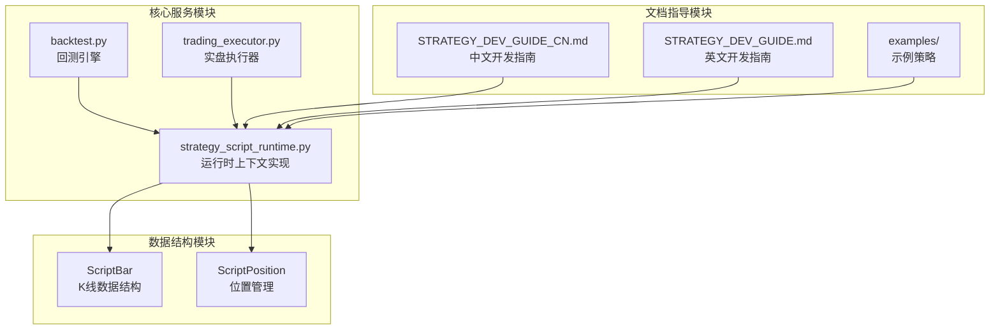
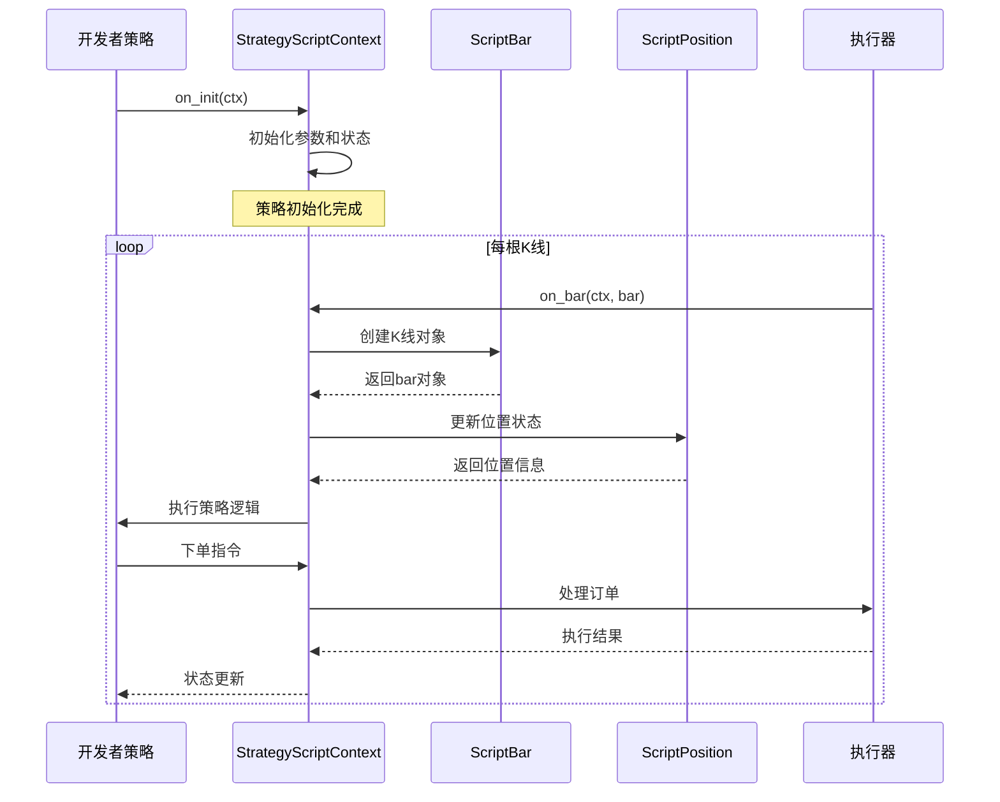
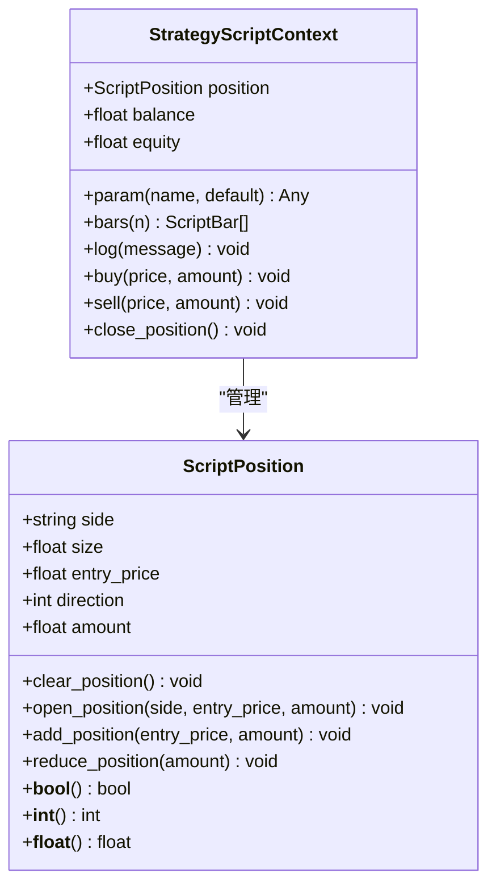
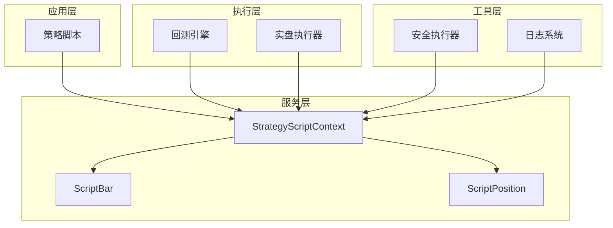

# 上下文API详解

<cite>
**本文档引用的文件**
- [strategy_script_runtime.py](file://backend_api_python/app/services/strategy_script_runtime.py)
- [backtest.py](file://backend_api_python/app/services/backtest.py)
- [trading_executor.py](file://backend_api_python/app/services/trading_executor.py)
- [STRATEGY_DEV_GUIDE_CN.md](file://docs/STRATEGY_DEV_GUIDE_CN.md)
- [STRATEGY_DEV_GUIDE.md](file://docs/STRATEGY_DEV_GUIDE.md)
- [dual_ma_with_params.py](file://docs/examples/dual_ma_with_params.py)
</cite>

## 目录
1. [简介](#简介)
2. [项目结构](#项目结构)
3. [核心组件](#核心组件)
4. [架构概览](#架构概览)
5. [详细组件分析](#详细组件分析)
6. [依赖关系分析](#依赖关系分析)
7. [性能考虑](#性能考虑)
8. [故障排除指南](#故障排除指南)
9. [结论](#结论)

## 简介

ScriptStrategy上下文API是QuantDinger平台的核心组件，为策略开发者提供了完整的市场数据访问、位置管理和资金控制功能。本文档详细介绍了ctx对象的所有功能方法，包括参数访问、历史数据获取、位置状态检查、资金管理以及日志记录等核心功能。

该API设计遵循事件驱动模式，通过`on_init`和`on_bar`回调函数提供策略执行环境，支持回测和实盘两种运行模式。开发者可以通过ctx对象访问实时市场数据，管理交易位置，并实现复杂的交易逻辑。

## 项目结构

QuantDinger平台采用模块化架构，ScriptStrategy上下文API主要分布在以下模块中：



**图表来源**
- [strategy_script_runtime.py:114-157](file://backend_api_python/app/services/strategy_script_runtime.py#L114-L157)
- [backtest.py:2106-2147](file://backend_api_python/app/services/backtest.py#L2106-L2147)
- [trading_executor.py:536-558](file://backend_api_python/app/services/trading_executor.py#L536-L558)

**章节来源**
- [strategy_script_runtime.py:1-191](file://backend_api_python/app/services/strategy_script_runtime.py#L1-L191)
- [backtest.py:2106-2240](file://backend_api_python/app/services/backtest.py#L2106-L2240)
- [trading_executor.py:536-558](file://backend_api_python/app/services/trading_executor.py#L536-L558)

## 核心组件

### StrategyScriptContext - 主要上下文类

StrategyScriptContext是ScriptStrategy的核心执行环境，提供了策略运行所需的所有功能接口：

| 方法/属性 | 类型 | 描述 |
|-----------|------|------|
| `param(name, default)` | 方法 | 获取或初始化脚本级参数 |
| `bars(n=1)` | 方法 | 获取历史K线数据 |
| `log(message)` | 方法 | 写入策略日志 |
| `buy(price=None, amount=None)` | 方法 | 表达买入意图 |
| `sell(price=None, amount=None)` | 方法 | 表达卖出意图 |
| `close_position()` | 方法 | 明确平仓操作 |
| `position` | 属性 | 当前位置状态对象 |
| `balance` | 属性 | 当前余额快照 |
| `equity` | 属性 | 当前权益快照 |

### ScriptBar - K线数据结构

ScriptBar封装了单根K线的所有必要信息：

| 字段 | 类型 | 描述 |
|------|------|------|
| `open` | float | 开盘价 |
| `high` | float | 最高价 |
| `low` | float | 最低价 |
| `close` | float | 收盘价 |
| `volume` | float | 成交量 |
| `timestamp` | datetime/timestamp | 时间戳 |

### ScriptPosition - 位置管理

ScriptPosition提供了完整的持仓状态管理功能：

| 字段 | 类型 | 描述 |
|------|------|------|
| `side` | string | 方向：'long'/'short'/'' |
| `size` | float | 持仓数量 |
| `entry_price` | float | 平均开仓价 |
| `direction` | int | 方向：1/-1/0 |
| `amount` | float | 数量镜像 |

**章节来源**
- [strategy_script_runtime.py:114-157](file://backend_api_python/app/services/strategy_script_runtime.py#L114-L157)
- [strategy_script_runtime.py:17-23](file://backend_api_python/app/services/strategy_script_runtime.py#L17-L23)
- [strategy_script_runtime.py:25-112](file://backend_api_python/app/services/strategy_script_runtime.py#L25-L112)

## 架构概览

ScriptStrategy上下文API采用分层架构设计，确保了功能的模块化和可扩展性：



**图表来源**
- [strategy_script_runtime.py:159-191](file://backend_api_python/app/services/strategy_script_runtime.py#L159-L191)
- [backtest.py:2178-2189](file://backend_api_python/app/services/backtest.py#L2178-L2189)
- [trading_executor.py:1157-1177](file://backend_api_python/app/services/trading_executor.py#L1157-L1177)

## 详细组件分析

### 参数访问系统 (ctx.param)

参数访问是ScriptStrategy的基础功能，提供了灵活的默认值管理机制：

```mermaid
flowchart TD
Start([调用 ctx.param(name, default)]) --> CheckParam{"参数是否存在?"}
CheckParam --> |否| SetDefault["设置默认值"]
CheckParam --> |是| ReturnParam["返回现有值"]
SetDefault --> StoreParam["存储到 _params"]
StoreParam --> ReturnParam
ReturnParam --> End([返回参数值])
```

**图表来源**
- [strategy_script_runtime.py:127-130](file://backend_api_python/app/services/strategy_script_runtime.py#L127-L130)

#### 参数访问最佳实践

1. **统一参数管理**：所有脚本级默认值都应该通过`ctx.param()`访问
2. **类型转换**：参数值通常需要显式转换为目标类型
3. **默认值设计**：为关键参数提供合理的默认值
4. **参数验证**：在使用前验证参数的有效性

**章节来源**
- [strategy_script_runtime.py:127-130](file://backend_api_python/app/services/strategy_script_runtime.py#L127-L130)
- [STRATEGY_DEV_GUIDE_CN.md:618-623](file://docs/STRATEGY_DEV_GUIDE_CN.md#L618-L623)

### 历史数据获取 (ctx.bars)

历史数据获取功能允许策略访问过去N根K线的数据，支持技术分析和趋势判断：

```mermaid
flowchart TD
Start([调用 ctx.bars(n)]) --> ValidateN{"n 是否有效?"}
ValidateN --> |否| SetDefault["设置默认值 n=1"]
ValidateN --> |是| CalcStart["计算起始索引"]
SetDefault --> CalcStart
CalcStart --> IterateRows["遍历DataFrame行"]
IterateRows --> CreateBar["创建ScriptBar对象"]
CreateBar --> AppendToList["添加到结果列表"]
AppendToList --> CheckEnd{"到达当前索引?"}
CheckEnd --> |否| IterateRows
CheckEnd --> |是| ReturnBars["返回bar列表"]
ReturnBars --> End([完成])
```

**图表来源**
- [strategy_script_runtime.py:132-144](file://backend_api_python/app/services/strategy_script_runtime.py#L132-L144)

#### 数据访问模式

1. **时间序列分析**：获取多根K线进行移动平均计算
2. **技术指标构建**：基于历史数据计算各种技术指标
3. **趋势判断**：通过多周期数据识别市场趋势
4. **风险管理**：利用历史波动性进行风险控制

**章节来源**
- [strategy_script_runtime.py:132-144](file://backend_api_python/app/services/strategy_script_runtime.py#L132-L144)

### 位置状态管理 (ctx.position)

位置状态管理是ScriptStrategy的核心功能，提供了完整的持仓生命周期管理：



**图表来源**
- [strategy_script_runtime.py:25-112](file://backend_api_python/app/services/strategy_script_runtime.py#L25-L112)
- [strategy_script_runtime.py:114-125](file://backend_api_python/app/services/strategy_script_runtime.py#L114-L125)

#### 位置状态检查模式

1. **数值判断**：`if ctx.position:` 检查是否有持仓
2. **方向判断**：`if ctx.position > 0:` 检查多头持仓
3. **字段访问**：`ctx.position["side"]` 获取具体方向
4. **金额检查**：`ctx.position["size"]` 获取持仓数量

**章节来源**
- [strategy_script_runtime.py:36-61](file://backend_api_python/app/services/strategy_script_runtime.py#L36-L61)
- [STRATEGY_DEV_GUIDE_CN.md:624-635](file://docs/STRATEGY_DEV_GUIDE_CN.md#L624-L635)

### 资金管理系统 (ctx.balance 和 ctx.equity)

资金管理系统提供了实时的资金状况监控功能：

| 属性 | 类型 | 描述 | 更新时机 |
|------|------|------|----------|
| `balance` | float | 可用余额快照 | 实盘执行时刷新 |
| `equity` | float | 总权益快照 | 实盘执行时刷新 |

#### 资金管理最佳实践

1. **资金规划**：基于balance进行仓位计算
2. **风险控制**：使用equity监控整体盈亏
3. **动态调整**：根据资金变化调整交易策略
4. **回撤监控**：通过资金曲线识别风险

**章节来源**
- [strategy_script_runtime.py:123-125](file://backend_api_python/app/services/strategy_script_runtime.py#L123-L125)
- [trading_executor.py:520-534](file://backend_api_python/app/services/trading_executor.py#L520-L534)

### 日志记录系统 (ctx.log)

日志记录系统提供了策略执行过程的完整追踪能力：

```mermaid
flowchart TD
Start([调用 ctx.log(message)]) --> ConvertString["转换为字符串"]
ConvertString --> AppendToLogs["添加到 _logs 列表"]
AppendToLogs --> CheckSize{"日志数量是否过多?"}
CheckSize --> |否| End([完成])
CheckSize --> |是| TruncateLogs["截断过长的日志"]
TruncateLogs --> End
```

**图表来源**
- [strategy_script_runtime.py:146-147](file://backend_api_python/app/services/strategy_script_runtime.py#L146-L147)

#### 日志记录策略

1. **关键节点记录**：在重要决策点记录日志
2. **参数变更记录**：记录关键参数的变化
3. **异常情况记录**：记录异常和错误信息
4. **性能监控记录**：记录执行时间和资源使用

**章节来源**
- [strategy_script_runtime.py:146-147](file://backend_api_python/app/services/strategy_script_runtime.py#L146-L147)

## 依赖关系分析

ScriptStrategy上下文API的依赖关系体现了清晰的分层架构：



**图表来源**
- [strategy_script_runtime.py:159-191](file://backend_api_python/app/services/strategy_script_runtime.py#L159-L191)
- [backtest.py:2148-2172](file://backend_api_python/app/services/backtest.py#L2148-L2172)
- [trading_executor.py:1157-1177](file://backend_api_python/app/services/trading_executor.py#L1157-L1177)

### 关键依赖关系

1. **策略脚本依赖**：策略脚本依赖StrategyScriptContext提供的完整API
2. **数据结构依赖**：上下文依赖ScriptBar和ScriptPosition提供数据封装
3. **执行依赖**：回测和实盘执行器依赖上下文的状态管理
4. **安全依赖**：安全执行器确保策略代码的安全执行

**章节来源**
- [strategy_script_runtime.py:159-191](file://backend_api_python/app/services/strategy_script_runtime.py#L159-L191)
- [backtest.py:2148-2240](file://backend_api_python/app/services/backtest.py#L2148-L2240)

## 性能考虑

ScriptStrategy上下文API在设计时充分考虑了性能优化：

### 内存管理
- 使用字典结构存储参数和状态，内存占用最小化
- K线数据通过迭代器访问，避免不必要的数据复制
- 日志系统采用列表存储，支持动态增长

### 计算效率
- 参数访问采用延迟初始化，只在首次使用时创建
- 位置状态检查使用快速的数值比较操作
- K线数据访问通过索引直接定位，避免循环遍历

### 缓存策略
- 历史数据缓存在DataFrame中，避免重复计算
- 参数值缓存在字典中，提供O(1)访问时间
- 位置状态通过属性访问，减少函数调用开销

## 故障排除指南

### 常见问题及解决方案

#### 参数访问问题
**问题**：`ctx.param()`返回意外类型
**解决方案**：始终进行显式类型转换
```python
# 错误示例
fast_len = ctx.param("fast_len")  # 可能是字符串

# 正确示例
fast_len = int(ctx.param("fast_len", 20))
```

#### 位置状态检查问题
**问题**：位置检查逻辑不生效
**解决方案**：使用正确的检查模式
```python
# 错误示例
if ctx.position == "long":  # 比较字符串

# 正确示例
if ctx.position["side"] == "long":  # 检查字段
```

#### 数据访问问题
**问题**：`ctx.bars()`返回空列表
**解决方案**：检查数据可用性和索引范围
```python
bars = ctx.bars(30)
if len(bars) < 20:
    return  # 数据不足，跳过
```

#### 资金管理问题
**问题**：资金数据显示异常
**解决方案**：确认资金更新时机和来源
```python
# 实盘执行时自动更新
# 回测模式下需要特殊处理
```

**章节来源**
- [STRATEGY_DEV_GUIDE_CN.md:618-623](file://docs/STRATEGY_DEV_GUIDE_CN.md#L618-L623)
- [trading_executor.py:520-534](file://backend_api_python/app/services/trading_executor.py#L520-L534)

## 结论

ScriptStrategy上下文API为量化策略开发提供了完整而强大的基础设施。通过精心设计的API接口，开发者可以专注于策略逻辑的实现，而不必担心底层的数据管理和执行细节。

该API的主要优势包括：

1. **完整性**：覆盖了策略开发的所有核心需求
2. **易用性**：简洁直观的API设计，降低学习成本
3. **灵活性**：支持多种运行模式和执行策略
4. **安全性**：内置安全机制，保护系统稳定运行

随着QuantDinger平台的不断发展，ScriptStrategy上下文API将继续演进，为开发者提供更好的策略开发体验。建议开发者密切关注官方文档更新，及时了解新功能和最佳实践。