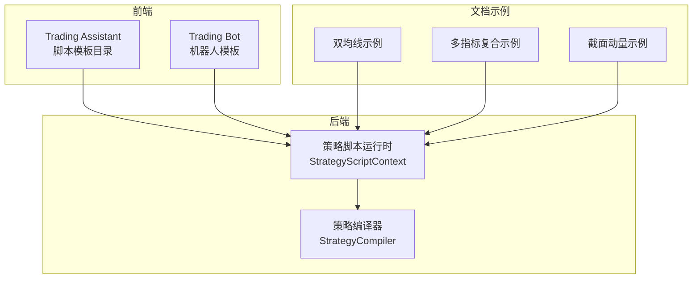
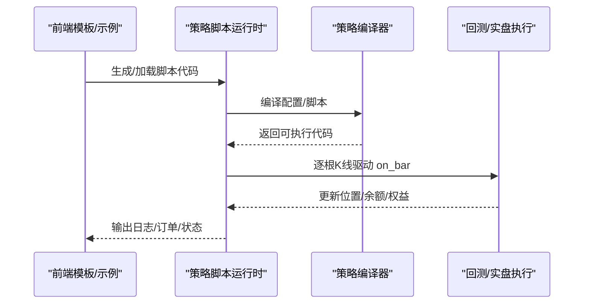
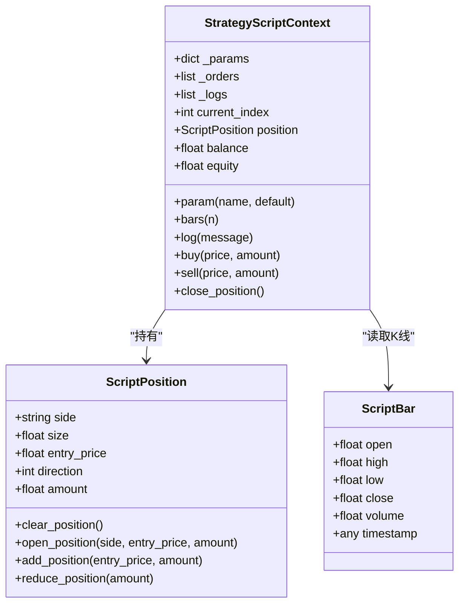
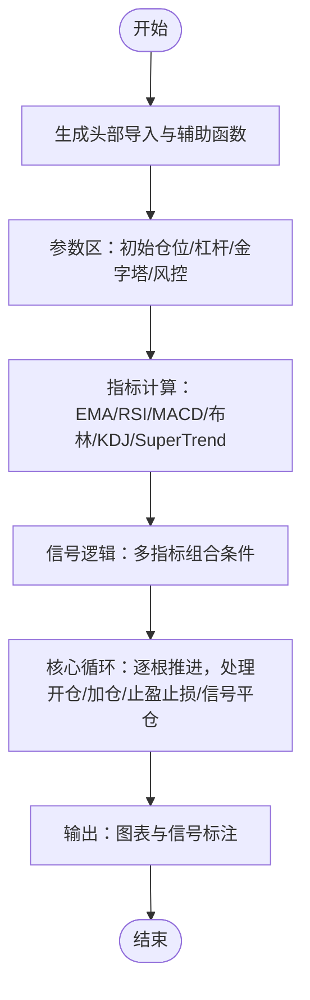
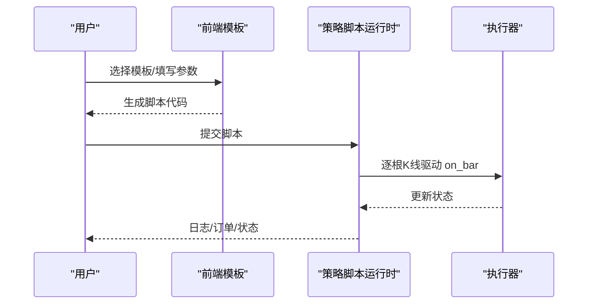
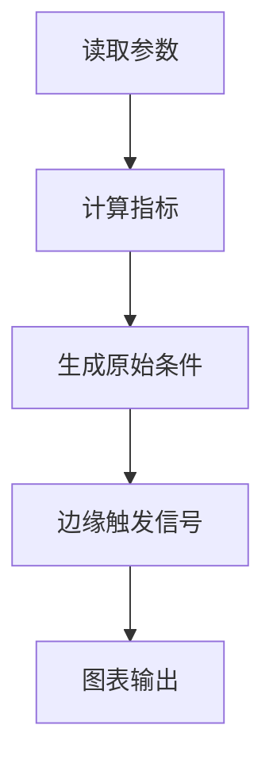
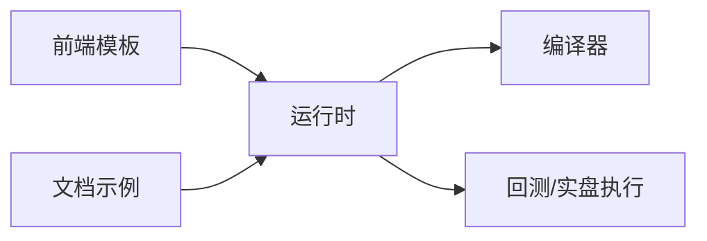

# 实战示例

<cite>
**本文引用的文件**
- [STRATEGY_DEV_GUIDE_CN.md](file://docs/STRATEGY_DEV_GUIDE_CN.md)
- [strategy_script_runtime.py](file://backend_api_python/app/services/strategy_script_runtime.py)
- [strategy_compiler.py](file://backend_api_python/app/services/strategy_compiler.py)
- [scriptTemplateCatalog.js](file://frontend/src/views/trading-assistant/components/scriptTemplateCatalog.js)
- [botScriptTemplates.js](file://frontend/src/views/trading-bot/components/botScriptTemplates.js)
- [dual_ma_with_params.py](file://docs/examples/dual_ma_with_params.py)
- [multi_indicator_composite.py](file://docs/examples/multi_indicator_composite.py)
- [cross_sectional_momentum_rsi.py](file://docs/examples/cross_sectional_momentum_rsi.py)
</cite>

## 目录
1. [引言](#引言)
2. [项目结构](#项目结构)
3. [核心组件](#核心组件)
4. [架构总览](#架构总览)
5. [详细组件分析](#详细组件分析)
6. [依赖关系分析](#依赖关系分析)
7. [性能考量](#性能考量)
8. [故障排查指南](#故障排查指南)
9. [结论](#结论)
10. [附录](#附录)

## 引言
本文件面向希望系统掌握 ScriptStrategy 实战开发的工程师，提供从基础到高级的完整示例集合，覆盖移动平均交叉、动态止损、多方向交易、参数化复杂策略等主题。文档重点讲解运行时状态管理、位置检查逻辑、动态风险控制等关键概念，并配套可直接使用的模板与最佳实践，帮助快速上手。

## 项目结构
围绕 ScriptStrategy 的实战示例，相关代码分布在以下区域：
- 后端服务层：策略脚本运行时与编译器，负责将脚本安全编译、执行并产出回测/实盘行为
- 前端模板库：提供多种策略模板（趋势跟踪、马丁格尔、网格、定投、均值回归、突破、RSI 均值回归、MACD 交叉），便于快速生成可运行脚本
- 文档示例：提供双均线、多指标复合、截面动量等示例，便于对照学习

**图表来源**
- [strategy_script_runtime.py:114-191](file://backend_api_python/app/services/strategy_script_runtime.py#L114-L191)
- [strategy_compiler.py:1-689](file://backend_api_python/app/services/strategy_compiler.py#L1-L689)
- [scriptTemplateCatalog.js:1-538](file://frontend/src/views/trading-assistant/components/scriptTemplateCatalog.js#L1-L538)
- [botScriptTemplates.js:1-435](file://frontend/src/views/trading-bot/components/botScriptTemplates.js#L1-L435)
- [dual_ma_with_params.py:1-64](file://docs/examples/dual_ma_with_params.py#L1-L64)
- [multi_indicator_composite.py:1-109](file://docs/examples/multi_indicator_composite.py#L1-L109)
- [cross_sectional_momentum_rsi.py:1-71](file://docs/examples/cross_sectional_momentum_rsi.py#L1-L71)

**章节来源**
- [strategy_script_runtime.py:1-191](file://backend_api_python/app/services/strategy_script_runtime.py#L1-L191)
- [strategy_compiler.py:1-689](file://backend_api_python/app/services/strategy_compiler.py#L1-L689)
- [scriptTemplateCatalog.js:1-538](file://frontend/src/views/trading-assistant/components/scriptTemplateCatalog.js#L1-L538)
- [botScriptTemplates.js:1-435](file://frontend/src/views/trading-bot/components/botScriptTemplates.js#L1-L435)
- [dual_ma_with_params.py:1-64](file://docs/examples/dual_ma_with_params.py#L1-L64)
- [multi_indicator_composite.py:1-109](file://docs/examples/multi_indicator_composite.py#L1-L109)
- [cross_sectional_momentum_rsi.py:1-71](file://docs/examples/cross_sectional_momentum_rsi.py#L1-L71)

## 核心组件
- 策略脚本运行时（StrategyScriptContext）
  - 提供参数读取、K 线窗口、位置状态、余额/权益、下单与日志能力
  - 通过 ctx.position 判断空仓/多头/空头状态，决定开仓、反手、减仓或平仓
- 策略编译器（StrategyCompiler）
  - 将配置转换为可执行的 Python 脚本，包含指标计算、信号生成、核心循环（含止盈止损、金字塔加仓、跟踪止损等）
- 前端模板库
  - 提供多种策略模板（趋势跟踪、马丁格尔、网格、定投、均值回归、突破、RSI 均值回归、MACD 交叉），便于快速生成可运行脚本
- 文档示例
  - 双均线、多指标复合、截面动量等示例，便于对照学习

**章节来源**
- [strategy_script_runtime.py:114-191](file://backend_api_python/app/services/strategy_script_runtime.py#L114-L191)
- [strategy_compiler.py:1-689](file://backend_api_python/app/services/strategy_compiler.py#L1-L689)
- [scriptTemplateCatalog.js:1-538](file://frontend/src/views/trading-assistant/components/scriptTemplateCatalog.js#L1-L538)
- [botScriptTemplates.js:1-435](file://frontend/src/views/trading-bot/components/botScriptTemplates.js#L1-L435)

## 架构总览
ScriptStrategy 的执行链路由前端模板/文档示例生成脚本，后端运行时编译并执行，最终在回测或实盘中推进 K 线驱动的 on_bar 流程。

**图表来源**
- [strategy_script_runtime.py:159-191](file://backend_api_python/app/services/strategy_script_runtime.py#L159-L191)
- [strategy_compiler.py:1-689](file://backend_api_python/app/services/strategy_compiler.py#L1-L689)

## 详细组件分析

### 组件A：策略脚本运行时（StrategyScriptContext）
- 关键职责
  - 提供 ctx.param(name, default) 读取/初始化参数
  - 提供 ctx.bars(n) 获取最近 n 根 K 线（ScriptBar）
  - 提供 ctx.position、ctx.balance、ctx.equity 等运行时状态
  - 提供 ctx.buy/sell/close_position 下单意图
- 位置状态
  - 支持 bool(ctx.position) 判断是否有仓位
  - 支持 ctx.position["side"]、ctx.position["size"]、ctx.position["entry_price"] 等字段访问
- 订单与日志
  - 所有下单操作记录在内部队列，最终由执行器处理
  - ctx.log 用于记录运行日志

**图表来源**
- [strategy_script_runtime.py:17-113](file://backend_api_python/app/services/strategy_script_runtime.py#L17-L113)
- [strategy_script_runtime.py:114-191](file://backend_api_python/app/services/strategy_script_runtime.py#L114-L191)

**章节来源**
- [strategy_script_runtime.py:17-113](file://backend_api_python/app/services/strategy_script_runtime.py#L17-L113)
- [strategy_script_runtime.py:114-191](file://backend_api_python/app/services/strategy_script_runtime.py#L114-L191)

### 组件B：策略编译器（StrategyCompiler）
- 功能概述
  - 将配置转换为可执行 Python 脚本，包含指标计算、信号生成、核心循环（止盈止损、金字塔加仓、跟踪止损等）
- 关键流程
  - 头部导入与辅助函数
  - 参数区（初始仓位、杠杆、金字塔、止损/跟踪止损）
  - 指标计算（EMA、RSI、MACD、布林带、KDJ、SuperTrend 等）
  - 信号逻辑（多指标组合条件）
  - 核心循环（逐根推进，处理开仓、加仓、止盈止损、信号平仓）
  - 输出（图表与信号标注）

**图表来源**
- [strategy_compiler.py:1-689](file://backend_api_python/app/services/strategy_compiler.py#L1-L689)

**章节来源**
- [strategy_compiler.py:1-689](file://backend_api_python/app/services/strategy_compiler.py#L1-L689)

### 组件C：前端模板库（Trading Assistant / Trading Bot）
- Trading Assistant 模板
  - 提供趋势跟踪、马丁格尔、网格、定投、均值回归、突破、RSI 均值回归、MACD 交叉等模板
  - 模板内封装 on_init/on_bar，参数通过 ctx.param 注入
- Trading Bot 模板
  - 提供网格、马丁格尔、趋势跟踪、定投等机器人风格策略
  - 支持预算控制、层位管理、时间间隔等高级特性

**图表来源**
- [scriptTemplateCatalog.js:1-538](file://frontend/src/views/trading-assistant/components/scriptTemplateCatalog.js#L1-L538)
- [botScriptTemplates.js:1-435](file://frontend/src/views/trading-bot/components/botScriptTemplates.js#L1-L435)

**章节来源**
- [scriptTemplateCatalog.js:1-538](file://frontend/src/views/trading-assistant/components/scriptTemplateCatalog.js#L1-L538)
- [botScriptTemplates.js:1-435](file://frontend/src/views/trading-bot/components/botScriptTemplates.js#L1-L435)

### 组件D：文档示例（双均线、多指标复合、截面动量）
- 双均线策略
  - 展示参数声明与默认风控配置，生成边缘触发买卖信号
- 多指标复合
  - 展示均线、RSI、MACD、成交量过滤的组合信号
- 截面动量
  - 展示对多个标的打分排序的研究思路

**图表来源**
- [dual_ma_with_params.py:1-64](file://docs/examples/dual_ma_with_params.py#L1-L64)
- [multi_indicator_composite.py:1-109](file://docs/examples/multi_indicator_composite.py#L1-L109)
- [cross_sectional_momentum_rsi.py:1-71](file://docs/examples/cross_sectional_momentum_rsi.py#L1-L71)

**章节来源**
- [dual_ma_with_params.py:1-64](file://docs/examples/dual_ma_with_params.py#L1-L64)
- [multi_indicator_composite.py:1-109](file://docs/examples/multi_indicator_composite.py#L1-L109)
- [cross_sectional_momentum_rsi.py:1-71](file://docs/examples/cross_sectional_momentum_rsi.py#L1-L71)

## 依赖关系分析
- 前端模板依赖后端运行时，后者负责安全编译与执行
- 策略编译器与运行时协同，前者生成脚本，后者驱动执行
- 文档示例与前端模板均可作为脚本输入，形成统一的策略开发工作流

**图表来源**
- [strategy_script_runtime.py:159-191](file://backend_api_python/app/services/strategy_script_runtime.py#L159-L191)
- [strategy_compiler.py:1-689](file://backend_api_python/app/services/strategy_compiler.py#L1-L689)
- [scriptTemplateCatalog.js:1-538](file://frontend/src/views/trading-assistant/components/scriptTemplateCatalog.js#L1-L538)
- [botScriptTemplates.js:1-435](file://frontend/src/views/trading-bot/components/botScriptTemplates.js#L1-L435)

**章节来源**
- [strategy_script_runtime.py:159-191](file://backend_api_python/app/services/strategy_script_runtime.py#L159-L191)
- [strategy_compiler.py:1-689](file://backend_api_python/app/services/strategy_compiler.py#L1-L689)
- [scriptTemplateCatalog.js:1-538](file://frontend/src/views/trading-assistant/components/scriptTemplateCatalog.js#L1-L538)
- [botScriptTemplates.js:1-435](file://frontend/src/views/trading-bot/components/botScriptTemplates.js#L1-L435)

## 性能考量
- 指标计算与信号生成尽量在向量化层面完成，减少循环开销
- 使用 ctx.bars(n) 获取必要窗口，避免全量数据遍历
- 控制金字塔层数与加仓阈值，防止过度加仓导致回撤放大
- 合理设置止损/止盈与跟踪止损参数，平衡胜率与盈亏比

## 故障排查指南
- 脚本为空或缺少 on_bar
  - 运行时编译器要求 on_bar 必须存在，否则抛出错误
- 位置状态判断
  - 使用 bool(ctx.position) 判断是否有仓位，避免直接比较对象
- 下单意图与实际执行
  - ctx.buy/sell 仅记录下单意图，实际执行取决于执行器与产品配置
- 日志与调试
  - 使用 ctx.log 记录关键节点，便于定位问题

**章节来源**
- [strategy_script_runtime.py:159-191](file://backend_api_python/app/services/strategy_script_runtime.py#L159-L191)

## 结论
通过前端模板、文档示例与后端运行时/编译器的协同，ScriptStrategy 提供了从基础到高级的完整实战路径。建议开发者先以前端模板快速验证策略思想，再逐步引入参数化与动态风控，最终形成可回测、可执行的稳定策略。

## 附录

### 示例清单与要点
- 移动平均交叉策略
  - 使用双均线金叉/死叉生成买卖信号，配合默认风控参数
  - 参考路径：[dual_ma_with_params.py:1-64](file://docs/examples/dual_ma_with_params.py#L1-L64)
- 带动态止损的策略
  - 基于运行时位置状态与收益回撤，动态触发止盈止损
  - 参考路径：[scriptTemplateCatalog.js:1-538](file://frontend/src/views/trading-assistant/components/scriptTemplateCatalog.js#L1-L538)
- 支持多方向交易的策略
  - 同时支持多头/空头/双向，依据市场状态切换方向
  - 参考路径：[STRATEGY_DEV_GUIDE_CN.md:711-765](file://docs/STRATEGY_DEV_GUIDE_CN.md#L711-L765)
- 包含参数调整的复杂策略
  - 通过前端模板参数面板调整周期、阈值、仓位等，快速迭代
  - 参考路径：[botScriptTemplates.js:1-435](file://frontend/src/views/trading-bot/components/botScriptTemplates.js#L1-L435)
- 截面动量策略（研究参考）
  - 对多个标的打分排序，作为研究参考而非直接实盘
  - 参考路径：[cross_sectional_momentum_rsi.py:1-71](file://docs/examples/cross_sectional_momentum_rsi.py#L1-L71)

### 最佳实践
- 先在 IndicatorStrategy 验证信号与参数，再迁移到 ScriptStrategy
- 将“信号逻辑”、“默认风控”、“参数化”分层，保持代码清晰
- 使用 ctx.position 与 ctx.bars(n) 构建稳健的状态机
- 通过前端模板快速生成脚本，减少重复劳动