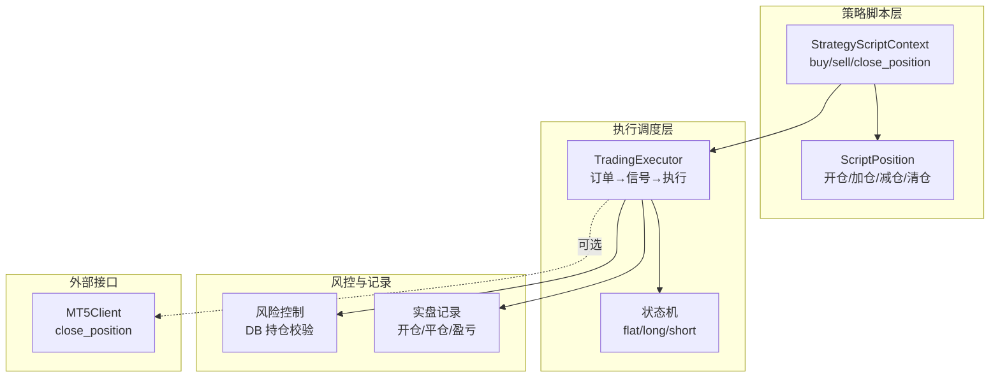
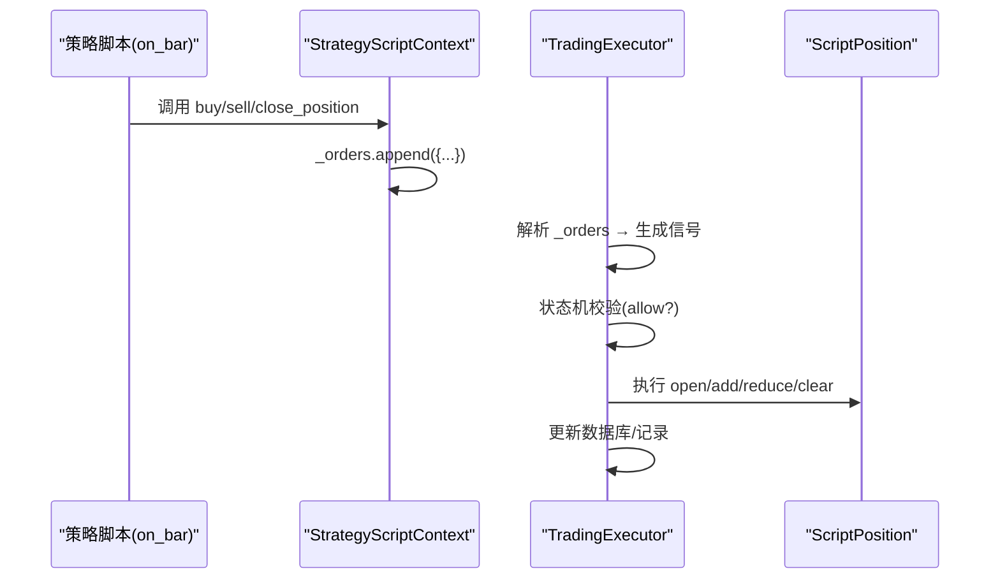
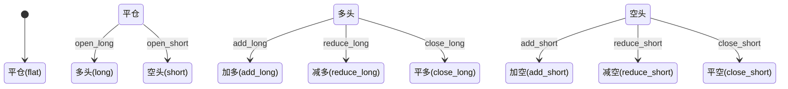
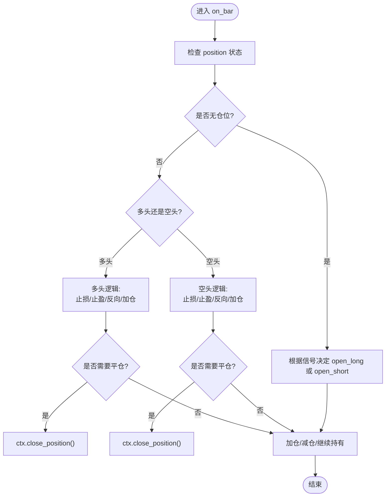
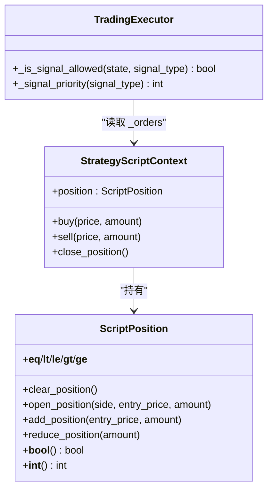
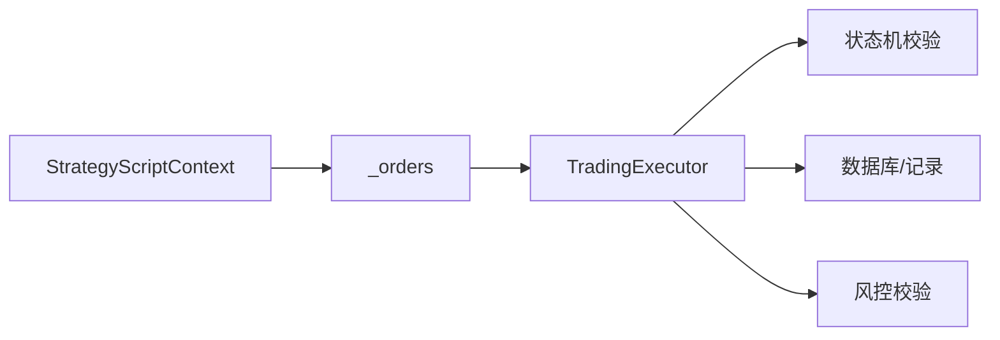

# 执行方法详解

<cite>
**本文引用的文件**
- [strategy_script_runtime.py](file://backend_api_python/app/services/strategy_script_runtime.py)
- [trading_executor.py](file://backend_api_python/app/services/trading_executor.py)
- [backtest.py](file://backend_api_python/app/services/backtest.py)
- [records.py](file://backend_api_python/app/services/live_trading/records.py)
- [pending_order_worker.py](file://backend_api_python/app/services/pending_order_worker.py)
- [client.py](file://backend_api_python/app/services/mt5_trading/client.py)
- [mt5.py](file://backend_api_python/app/routes/mt5.py)
- [STRATEGY_DEV_GUIDE.md](file://docs/STRATEGY_DEV_GUIDE.md)
</cite>

## 目录
1. [简介](#简介)
2. [项目结构](#项目结构)
3. [核心组件](#核心组件)
4. [架构总览](#架构总览)
5. [详细组件分析](#详细组件分析)
6. [依赖分析](#依赖分析)
7. [性能考虑](#性能考虑)
8. [故障排查指南](#故障排查指南)
9. [结论](#结论)
10. [附录](#附录)

## 简介
本文面向使用 ScriptStrategy 的开发者，系统讲解 ctx.buy()、ctx.sell()、ctx.close_position() 三大执行方法的实现原理、参数语义、在不同市场状态下的行为差异，以及如何结合位置状态检查实现动态止损止盈、部分平仓、反向开仓等高级功能。同时给出与位置状态检查的关系说明与常见错误规避建议。

## 项目结构
围绕 ScriptStrategy 执行方法的关键代码分布在以下模块：
- 策略脚本运行时：定义 ScriptPosition 与 StrategyScriptContext，暴露 buy/sell/close_position 三类执行入口
- 交易执行器：将脚本产生的订单转换为可执行信号，并按状态机规则调度
- 回测/实盘记录：记录开仓、加减仓、平仓过程中的盈亏与状态更新
- 风控与风险控制：对平仓数量、DB 持仓一致性进行校验与保护
- MT5 接口：提供 close_position 的原生实现（非 ScriptStrategy 调用路径）

**图表来源**
- [strategy_script_runtime.py:114-156](file://backend_api_python/app/services/strategy_script_runtime.py#L114-L156)
- [trading_executor.py:200-231](file://backend_api_python/app/services/trading_executor.py#L200-L231)
- [pending_order_worker.py:1125-1154](file://backend_api_python/app/services/pending_order_worker.py#L1125-L1154)
- [records.py:218-257](file://backend_api_python/app/services/live_trading/records.py#L218-L257)
- [client.py:445-551](file://backend_api_python/app/services/mt5_trading/client.py#L445-L551)

**章节来源**
- [strategy_script_runtime.py:114-156](file://backend_api_python/app/services/strategy_script_runtime.py#L114-L156)
- [trading_executor.py:200-231](file://backend_api_python/app/services/trading_executor.py#L200-L231)

## 核心组件
- StrategyScriptContext：策略脚本上下文，维护当前 K 线索引、参数、日志、账户余额与权益，提供 buy/sell/close_position 三类执行入口，内部以 _orders 列表收集待执行订单。
- ScriptPosition：轻量级位置对象，提供 clear_position/open_position/add_position/reduce_position 等方法，支持方向性比较（>、<、==），并以字典形式保存 side/size/entry_price/direction/amount 等字段。
- TradingExecutor：负责将脚本订单转换为执行信号，遵循严格的状态机规则（flat/long/short），并按优先级排序执行，最终落地到数据库与实盘记录。

**章节来源**
- [strategy_script_runtime.py:25-156](file://backend_api_python/app/services/strategy_script_runtime.py#L25-L156)
- [trading_executor.py:200-231](file://backend_api_python/app/services/trading_executor.py#L200-L231)

## 架构总览
ScriptStrategy 的执行链路如下：
- on_bar 中通过 ctx.buy()/ctx.sell()/ctx.close_position() 写入 _orders
- TradingExecutor 将 _orders 转换为信号类型（如 open_long/close_long 等）
- 根据当前 position 状态与 trade_direction，决定是否允许该信号
- 按优先级（close/reduce/open/add）执行信号，更新 ScriptPosition 与数据库记录

**图表来源**
- [strategy_script_runtime.py:149-156](file://backend_api_python/app/services/strategy_script_runtime.py#L149-L156)
- [trading_executor.py:647-717](file://backend_api_python/app/services/trading_executor.py#L647-L717)
- [trading_executor.py:200-231](file://backend_api_python/app/services/trading_executor.py#L200-L231)

## 详细组件分析

### 一、执行方法与参数语义
- ctx.buy(price=None, amount=None)
  - 将一条“买入”订单加入 _orders。price 与 amount 的解析与转换在 TradingExecutor 中完成。
  - price 为空时，通常回退到 bar_close 或触发价 trig；amount 为空时，按默认比例 default_ratio 计算本地手数 local_qty。
- ctx.sell(price=None, amount=None)
  - 将一条“卖出”订单加入 _orders。行为与 buy 类似，方向相反。
- ctx.close_position()
  - 将一条“平仓”订单加入 _orders。根据当前 ScriptPosition 的方向，生成对应 close_long 或 close_short 信号，并清空位置。

参数解析与转换要点（在 TradingExecutor 中）：
- price 解析：优先使用订单中的 price，否则回退到 bar_close 或 trig；若仍无效则使用当前触发价。
- amount 解析：raw_amt 若为正数则视为比例或绝对值，经 _to_local_qty(price, ratio) 转换为本地手数。
- 触发价 ref_px：当 price > 0 时使用 price，否则使用 trig；用于记录信号触发价与后续风控。

**章节来源**
- [strategy_script_runtime.py:149-156](file://backend_api_python/app/services/strategy_script_runtime.py#L149-L156)
- [trading_executor.py:647-663](file://backend_api_python/app/services/trading_executor.py#L647-L663)

### 二、在不同市场状态下的行为
状态机规则（flat/long/short）由 TradingExecutor 维护，决定哪些信号可被允许执行：
- flat：仅允许 open_long/open_short
- long：仅允许 add_long/reduce_long/close_long
- short：仅允许 add_short/reduce_short/close_short

**图表来源**
- [trading_executor.py:200-231](file://backend_api_python/app/services/trading_executor.py#L200-L231)

**章节来源**
- [trading_executor.py:200-231](file://backend_api_python/app/services/trading_executor.py#L200-L231)

### 三、多头、空头与无仓位调用差异
- 无仓位（flat）
  - buy → open_long；sell → open_short
  - close_position 无任何效果（无仓可平）
- 多头（long）
  - buy → add_long；sell → close_long 或 reduce_long（视 trade_direction 与网格策略）
  - close_position → close_long
- 空头（short）
  - buy → close_short 或 reduce_short；sell → add_short
  - close_position → close_short

网格机器人（grid bot）模式下，buy/sell 的行为会根据当前方向与是否为平仓/减仓/开仓/加仓进行分支处理，确保在同一根K线上实现复杂的网格挂单与反向开仓。

**章节来源**
- [trading_executor.py:672-717](file://backend_api_python/app/services/trading_executor.py#L672-L717)

### 四、动态止损止盈、部分平仓、反向开仓实战
- 动态止损止盈
  - 在 on_bar 中根据入场价与当前价格计算止损/止盈阈值，满足条件时调用 ctx.close_position() 平仓。
  - 参考示例路径：[STRATEGY_DEV_GUIDE.md:711-765](file://docs/STRATEGY_DEV_GUIDE.md#L711-L765)
- 部分平仓
  - 使用 ScriptPosition.reduce_position(amount) 或在脚本中构造 reduce_long/reduce_short 信号，逐步降低仓位规模。
  - 实盘记录中会按已平仓数量计算盈亏并更新最高/最低价。
- 反向开仓
  - 在多头时，若出现趋势反转信号，先 close_long 再 open_short（或反之），实现方向切换。
  - TradingExecutor 会优先执行 close/reduce，确保在同根K线上先平仓再新开。

**图表来源**
- [strategy_script_runtime.py:149-156](file://backend_api_python/app/services/strategy_script_runtime.py#L149-L156)
- [trading_executor.py:200-231](file://backend_api_python/app/services/trading_executor.py#L200-L231)
- [records.py:218-257](file://backend_api_python/app/services/live_trading/records.py#L218-L257)

**章节来源**
- [STRATEGY_DEV_GUIDE.md:711-765](file://docs/STRATEGY_DEV_GUIDE.md#L711-L765)
- [records.py:218-257](file://backend_api_python/app/services/live_trading/records.py#L218-L257)

### 五、执行方法与位置状态检查的关系
- ScriptPosition 提供方向性比较（__int__/__bool__/比较运算符），可直接用于 if/else 分支判断。
- TradingExecutor 在执行前调用 _is_signal_allowed(state, signal_type)，确保只在允许的状态下执行相应信号。
- 实盘记录阶段，按信号类型更新数据库中的 position size、entry_price、highest_price、lowest_price 等字段。

**图表来源**
- [strategy_script_runtime.py:25-156](file://backend_api_python/app/services/strategy_script_runtime.py#L25-L156)
- [trading_executor.py:200-231](file://backend_api_python/app/services/trading_executor.py#L200-L231)

**章节来源**
- [strategy_script_runtime.py:25-156](file://backend_api_python/app/services/strategy_script_runtime.py#L25-L156)
- [trading_executor.py:200-231](file://backend_api_python/app/services/trading_executor.py#L200-L231)

### 六、常见错误与规避
- 错误：在无仓位时调用 close_position
  - 现象：close 无效果，因为无仓可平
  - 规避：先检查 ctx.position，或在多头/空头状态下再 close
- 错误：amount 传入负数或非法格式
  - 现象：会被忽略或转换为 0，导致下单失败
  - 规避：确保 amount 为正数或合法比例；必要时在脚本中做边界检查
- 错误：平仓数量超过持有量
  - 现象：风控模块会将 amount 调整为持有量或置 0
  - 规避：在脚本侧先查询持有量，或依赖风控模块自动调整
- 错误：在错误状态执行信号
  - 现象：被 _is_signal_allowed 拒绝
  - 规避：遵循状态机规则，先 close 再 open，或在 flat 时只 open

**章节来源**
- [pending_order_worker.py:1125-1154](file://backend_api_python/app/services/pending_order_worker.py#L1125-L1154)
- [trading_executor.py:200-231](file://backend_api_python/app/services/trading_executor.py#L200-L231)

### 七、与 MT5 close_position 的区别
- ScriptStrategy 的 ctx.close_position() 是脚本层的抽象，最终由 TradingExecutor 转换为 close_long/close_short 信号并执行
- MT5Client.close_position() 是直接对接 MT5 的原生平仓接口，需提供 ticket 与可选 volume
- 两者不冲突，但不要混用：脚本内用 ctx.close_position()，原生接口用 MT5Client.close_position()

**章节来源**
- [client.py:445-551](file://backend_api_python/app/services/mt5_trading/client.py#L445-L551)
- [mt5.py:544-621](file://backend_api_python/app/routes/mt5.py#L544-L621)

## 依赖分析
- StrategyScriptContext 依赖 ScriptPosition 提供位置状态与变更能力
- TradingExecutor 依赖 StrategyScriptContext 的 _orders，将其转换为信号并受状态机约束
- 实盘记录依赖 TradingExecutor 的信号类型与当前价格，更新数据库中的 position 与盈亏
- 风控模块在执行前对平仓数量进行 DB 校验，防止超仓

**图表来源**
- [strategy_script_runtime.py:114-156](file://backend_api_python/app/services/strategy_script_runtime.py#L114-L156)
- [trading_executor.py:200-231](file://backend_api_python/app/services/trading_executor.py#L200-L231)
- [pending_order_worker.py:1125-1154](file://backend_api_python/app/services/pending_order_worker.py#L1125-L1154)
- [records.py:218-257](file://backend_api_python/app/services/live_trading/records.py#L218-L257)

**章节来源**
- [strategy_script_runtime.py:114-156](file://backend_api_python/app/services/strategy_script_runtime.py#L114-L156)
- [trading_executor.py:200-231](file://backend_api_python/app/services/trading_executor.py#L200-L231)
- [pending_order_worker.py:1125-1154](file://backend_api_python/app/services/pending_order_worker.py#L1125-L1154)
- [records.py:218-257](file://backend_api_python/app/services/live_trading/records.py#L218-L257)

## 性能考虑
- 订单批处理：TradingExecutor 会对候选信号按优先级排序并批量执行，减少重复下单与状态抖动
- 去重机制：同一根K线上的重复信号会被去重，避免高频 tick 导致的重复执行
- 本地缓存：价格缓存与信号去重缓存降低数据库压力

[本节为通用指导，无需特定文件引用]

## 故障排查指南
- 未产生预期订单
  - 检查 on_bar 是否正确调用 ctx.buy()/ctx.sell()/ctx.close_position()
  - 检查 amount/price 是否被转换为 0 或非法值
- 信号被拒绝
  - 检查当前 position 状态与 trade_direction 是否允许该信号
  - 查看状态机规则：flat 只能 open，long 只能 add/reduce/close
- 平仓数量异常
  - 检查风控模块日志，确认是否被调整为持有量或 0
- 盈亏统计异常
  - 检查实盘记录逻辑，确认平仓数量与入场价是否正确

**章节来源**
- [trading_executor.py:200-231](file://backend_api_python/app/services/trading_executor.py#L200-L231)
- [pending_order_worker.py:1125-1154](file://backend_api_python/app/services/pending_order_worker.py#L1125-L1154)
- [records.py:218-257](file://backend_api_python/app/services/live_trading/records.py#L218-L257)

## 结论
ScriptStrategy 的执行方法以最小 API 暴露强大能力：通过 ctx.buy/sell/close_position 与 ScriptPosition 的组合，开发者可在任意市场状态下实现稳健的开仓、加仓、减仓与平仓操作。配合 TradingExecutor 的状态机与风控机制，可安全地实现动态止损止盈、部分平仓与反向开仓等高级策略。建议在脚本中始终先检查 position 状态，合理设置 amount/price，并利用内置风控与记录模块保障策略稳定性。

[本节为总结性内容，无需特定文件引用]

## 附录
- 示例参考：动态止损止盈策略示例路径
  - [STRATEGY_DEV_GUIDE.md:711-765](file://docs/STRATEGY_DEV_GUIDE.md#L711-L765)

**章节来源**
- [STRATEGY_DEV_GUIDE.md:711-765](file://docs/STRATEGY_DEV_GUIDE.md#L711-L765)