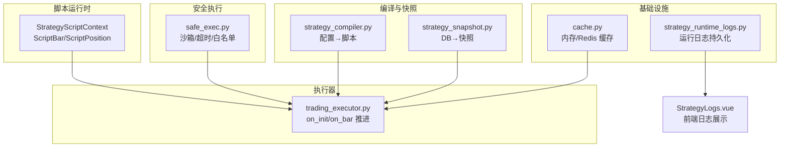
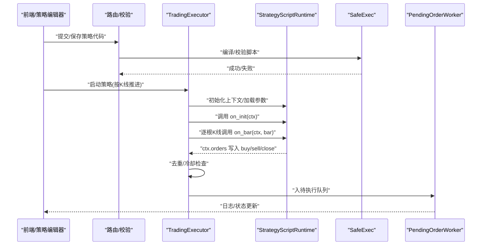
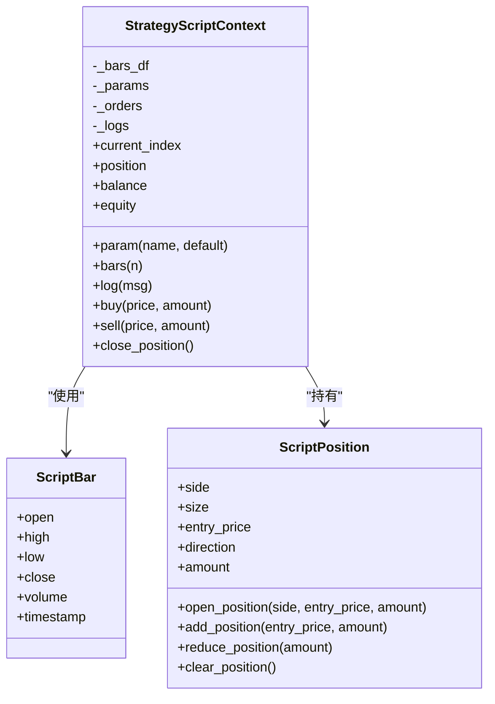
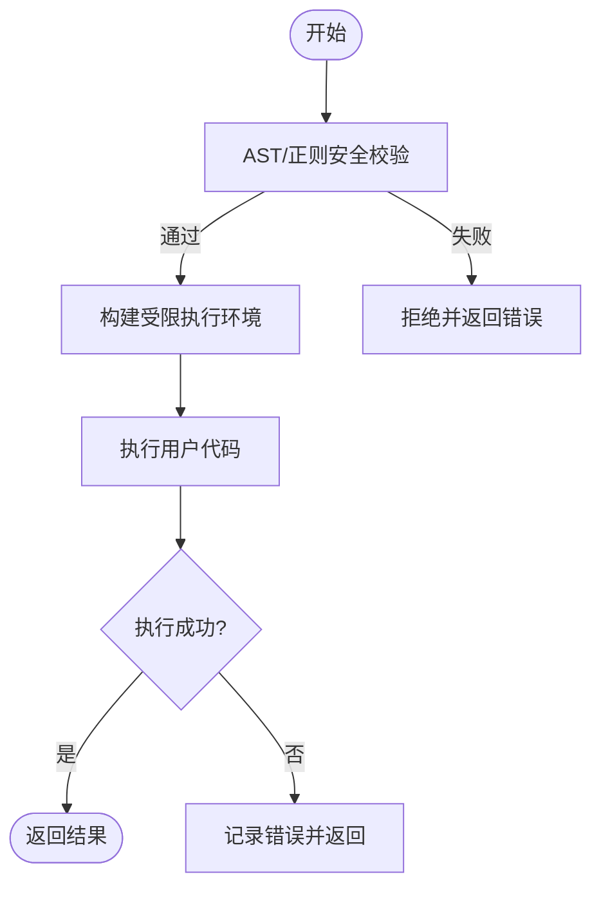
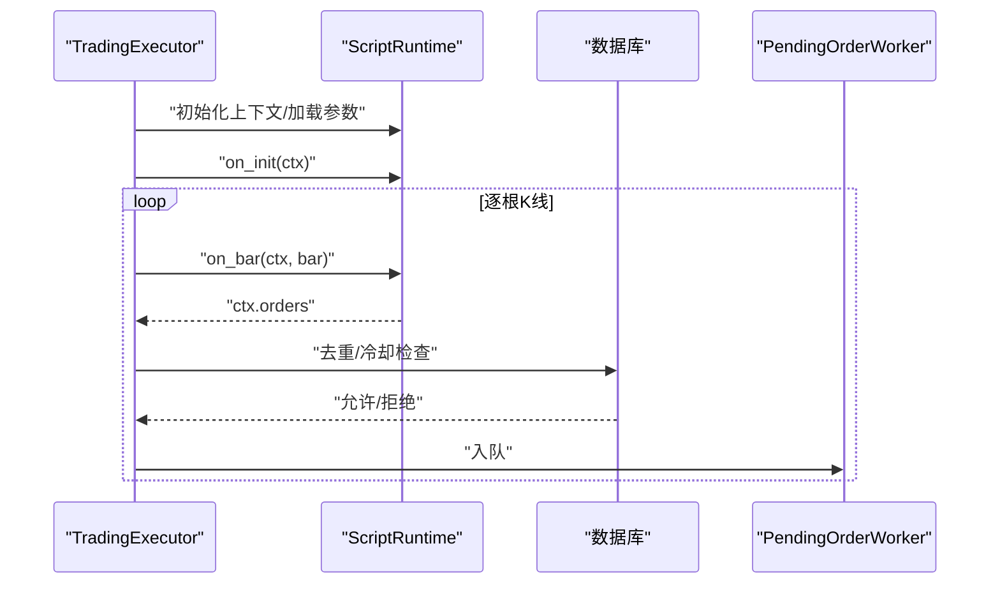
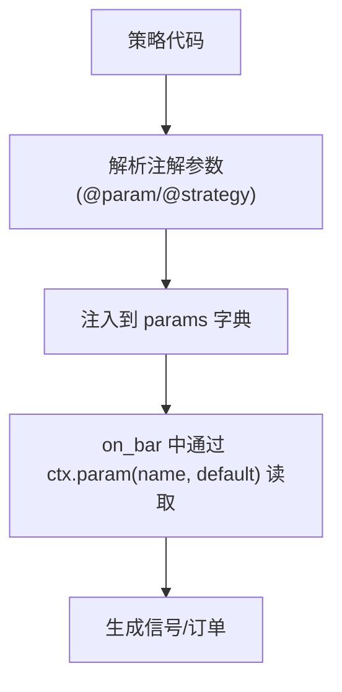
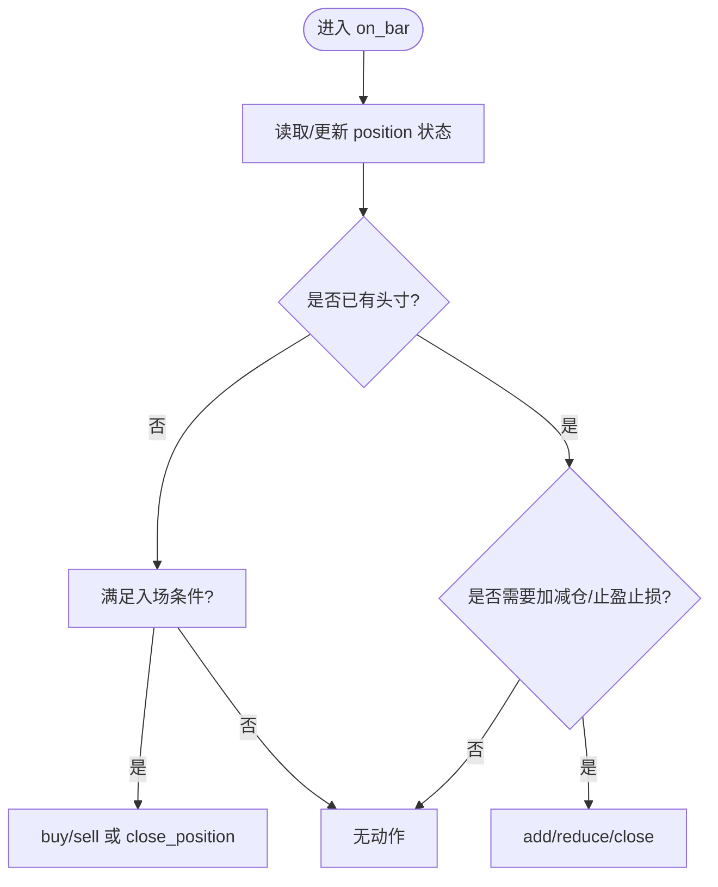
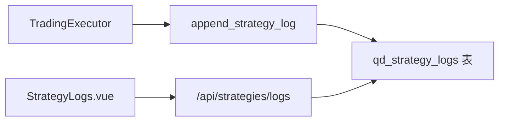
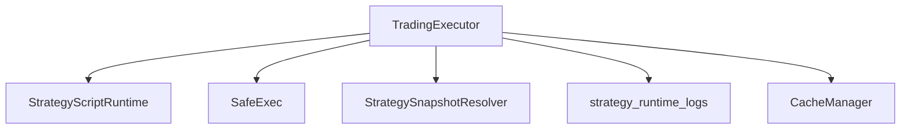

# 最佳实践指南

<cite>
**本文引用的文件**
- [strategy_script_runtime.py](file://backend_api_python/app/services/strategy_script_runtime.py)
- [trading_executor.py](file://backend_api_python/app/services/trading_executor.py)
- [safe_exec.py](file://backend_api_python/app/utils/safe_exec.py)
- [strategy.py](file://backend_api_python/app/routes/strategy.py)
- [strategy_compiler.py](file://backend_api_python/app/services/strategy_compiler.py)
- [strategy_snapshot.py](file://backend_api_python/app/services/strategy_snapshot.py)
- [cache.py](file://backend_api_python/app/utils/cache.py)
- [strategy_runtime_logs.py](file://backend_api_python/app/utils/strategy_runtime_logs.py)
- [StrategyLogs.vue](file://frontend/src/views/trading-assistant/components/StrategyLogs.vue)
- [dual_ma_with_params.py](file://docs/examples/dual_ma_with_params.py)
- [multi_indicator_composite.py](file://docs/examples/multi_indicator_composite.py)
- [cross_sectional_momentum_rsi.py](file://docs/examples/cross_sectional_momentum_rsi.py)
</cite>

## 目录
1. [简介](#简介)
2. [项目结构](#项目结构)
3. [核心组件](#核心组件)
4. [架构总览](#架构总览)
5. [详细组件分析](#详细组件分析)
6. [依赖分析](#依赖分析)
7. [性能考虑](#性能考虑)
8. [故障排查指南](#故障排查指南)
9. [结论](#结论)
10. [附录](#附录)

## 简介
本指南面向使用 ScriptStrategy 的开发者，聚焦于参数管理、位置状态检查、执行时机控制等关键实践，帮助规避重复下单、越权操作、状态检查不充分等常见问题。同时提供代码组织、注释规范、性能优化、测试与调试、以及生产部署与监控的建议。

## 项目结构
围绕 ScriptStrategy 的核心代码位于后端服务层与工具层：
- 运行时与上下文：ScriptStrategy 上下文、订单与位置模型
- 安全执行：沙箱与超时保护
- 执行器：按K线推进、脚本初始化与回调、去重与冷却
- 编译器与快照：将策略配置转换为可执行脚本，或从数据库快照恢复
- 缓存与日志：本地/Redis 缓存与策略运行日志持久化
- 前端日志展示：策略日志的可视化

**图表来源**
- [strategy_script_runtime.py:114-191](file://backend_api_python/app/services/strategy_script_runtime.py#L114-L191)
- [safe_exec.py:157-244](file://backend_api_python/app/utils/safe_exec.py#L157-L244)
- [trading_executor.py:536-771](file://backend_api_python/app/services/trading_executor.py#L536-L771)
- [strategy_compiler.py:1-689](file://backend_api_python/app/services/strategy_compiler.py#L1-L689)
- [strategy_snapshot.py:116-220](file://backend_api_python/app/services/strategy_snapshot.py#L116-L220)
- [cache.py:17-92](file://backend_api_python/app/utils/cache.py#L17-L92)
- [strategy_runtime_logs.py:11-29](file://backend_api_python/app/utils/strategy_runtime_logs.py#L11-L29)
- [StrategyLogs.vue:62-121](file://frontend/src/views/trading-assistant/components/StrategyLogs.vue#L62-L121)

**章节来源**
- [strategy_script_runtime.py:1-191](file://backend_api_python/app/services/strategy_script_runtime.py#L1-L191)
- [safe_exec.py:1-471](file://backend_api_python/app/utils/safe_exec.py#L1-L471)
- [trading_executor.py:536-771](file://backend_api_python/app/services/trading_executor.py#L536-L771)
- [strategy_compiler.py:1-689](file://backend_api_python/app/services/strategy_compiler.py#L1-L689)
- [strategy_snapshot.py:116-220](file://backend_api_python/app/services/strategy_snapshot.py#L116-L220)
- [cache.py:1-92](file://backend_api_python/app/utils/cache.py#L1-L92)
- [strategy_runtime_logs.py:1-29](file://backend_api_python/app/utils/strategy_runtime_logs.py#L1-L29)
- [StrategyLogs.vue:62-121](file://frontend/src/views/trading-assistant/components/StrategyLogs.vue#L62-L121)

## 核心组件
- ScriptStrategy 上下文与模型
  - 上下文持有参数、K线片段、账户余额、权益、当前索引、持仓与订单队列
  - 提供 param()、bars(n)、log()、buy()/sell()/close_position() 等 API
- 安全执行
  - 严格内置白名单、受限 import、超时与内存限制、AST/正则双重校验
- 执行器推进
  - 初始化脚本上下文、按K线推进 on_bar/on_bar_script、Hydrate 仓位与资金、生成执行信号、去重与冷却
- 编译器与快照
  - 将策略配置转换为可执行脚本；从数据库快照恢复运行所需配置
- 日志与缓存
  - 最佳努力持久化运行日志；本地/Redis 缓存

**章节来源**
- [strategy_script_runtime.py:114-191](file://backend_api_python/app/services/strategy_script_runtime.py#L114-L191)
- [safe_exec.py:157-244](file://backend_api_python/app/utils/safe_exec.py#L157-L244)
- [trading_executor.py:536-771](file://backend_api_python/app/services/trading_executor.py#L536-L771)
- [strategy_compiler.py:1-689](file://backend_api_python/app/services/strategy_compiler.py#L1-L689)
- [strategy_snapshot.py:116-220](file://backend_api_python/app/services/strategy_snapshot.py#L116-L220)
- [strategy_runtime_logs.py:11-29](file://backend_api_python/app/utils/strategy_runtime_logs.py#L11-L29)
- [cache.py:17-92](file://backend_api_python/app/utils/cache.py#L17-L92)

## 架构总览
ScriptStrategy 的执行路径从“策略代码”到“脚本回调”，再到“订单信号生成与去重”，最后进入“执行器”完成实盘下单。

**图表来源**
- [strategy.py:71-116](file://backend_api_python/app/routes/strategy.py#L71-L116)
- [safe_exec.py:207-244](file://backend_api_python/app/utils/safe_exec.py#L207-L244)
- [trading_executor.py:536-771](file://backend_api_python/app/services/trading_executor.py#L536-L771)
- [strategy_script_runtime.py:159-191](file://backend_api_python/app/services/strategy_script_runtime.py#L159-L191)
- [strategy_runtime_logs.py:11-29](file://backend_api_python/app/utils/strategy_runtime_logs.py#L11-L29)

## 详细组件分析

### 组件A：ScriptStrategy 上下文与模型
- 上下文职责
  - 维护参数字典、K线窗口、当前索引、账户余额/权益
  - 提供 param() 默认值填充、bars(n) 返回 ScriptBar 列表
  - 订单队列：buy/sell/close_position 写入 orders
- 模型要点
  - ScriptPosition 支持开仓、加仓、减仓、平仓、布尔判断
  - ScriptBar 包装 K线字段，支持 .attr 访问

**图表来源**
- [strategy_script_runtime.py:17-191](file://backend_api_python/app/services/strategy_script_runtime.py#L17-L191)

**章节来源**
- [strategy_script_runtime.py:17-191](file://backend_api_python/app/services/strategy_script_runtime.py#L17-L191)

### 组件B：安全执行与编译
- 安全执行
  - 仅允许白名单内置与受控模块；AST/正则双重校验；超时与内存限制
  - 提供当前进程内执行与子进程隔离两种模式
- 编译器
  - 将策略配置转换为可执行脚本，包含参数、指标计算、信号逻辑、核心循环与输出

**图表来源**
- [safe_exec.py:358-471](file://backend_api_python/app/utils/safe_exec.py#L358-L471)
- [safe_exec.py:157-244](file://backend_api_python/app/utils/safe_exec.py#L157-L244)
- [strategy_compiler.py:1-689](file://backend_api_python/app/services/strategy_compiler.py#L1-L689)

**章节来源**
- [safe_exec.py:157-471](file://backend_api_python/app/utils/safe_exec.py#L157-L471)
- [strategy_compiler.py:1-689](file://backend_api_python/app/services/strategy_compiler.py#L1-L689)

### 组件C：执行器推进与去重
- 推进流程
  - 初始化上下文、加载参数、Hydrate 仓位与资金、调用 on_init/on_bar/on_bar_script
  - 将 orders 转换为执行信号，写入待执行队列
- 去重与冷却
  - 同一根K线内对 open/close 类信号严格去重
  - 对同类信号检查“飞行中/待处理”状态与冷却时间

**图表来源**
- [trading_executor.py:536-771](file://backend_api_python/app/services/trading_executor.py#L536-L771)
- [trading_executor.py:3125-3196](file://backend_api_python/app/services/trading_executor.py#L3125-L3196)

**章节来源**
- [trading_executor.py:536-771](file://backend_api_python/app/services/trading_executor.py#L536-L771)
- [trading_executor.py:3125-3196](file://backend_api_python/app/services/trading_executor.py#L3125-L3196)

### 组件D：参数管理与注释规范
- 参数来源
  - 脚本上下文 param(name, default) 用于读取与默认值填充
  - 前端通过注解声明参数与策略默认配置，便于 UI 与 AI 识别
- 注释规范
  - 使用“# @param”声明参数，“# @strategy”声明策略默认配置
  - 示例策略展示了参数读取、信号生成与图表输出的标准写法

**图表来源**
- [dual_ma_with_params.py:20-30](file://docs/examples/dual_ma_with_params.py#L20-L30)
- [multi_indicator_composite.py:16-34](file://docs/examples/multi_indicator_composite.py#L16-L34)
- [strategy_script_runtime.py:127-130](file://backend_api_python/app/services/strategy_script_runtime.py#L127-L130)

**章节来源**
- [dual_ma_with_params.py:20-30](file://docs/examples/dual_ma_with_params.py#L20-L30)
- [multi_indicator_composite.py:16-34](file://docs/examples/multi_indicator_composite.py#L16-L34)
- [strategy_script_runtime.py:127-130](file://backend_api_python/app/services/strategy_script_runtime.py#L127-L130)

### 组件E：位置状态检查与执行时机
- 位置状态
  - 使用 ScriptPosition 的布尔与比较运算判断是否持有、方向与规模
  - 加仓/减仓/平仓逻辑需结合当前方向与规模，避免越界
- 执行时机
  - on_bar 按K线推进；on_bar_script 在机器人模式下按tick推进
  - Hydrate 仓位与资金确保上下文与实时行情一致

**图表来源**
- [strategy_script_runtime.py:36-112](file://backend_api_python/app/services/strategy_script_runtime.py#L36-L112)
- [trading_executor.py:1157-1177](file://backend_api_python/app/services/trading_executor.py#L1157-L1177)

**章节来源**
- [strategy_script_runtime.py:36-112](file://backend_api_python/app/services/strategy_script_runtime.py#L36-L112)
- [trading_executor.py:1157-1177](file://backend_api_python/app/services/trading_executor.py#L1157-L1177)

### 组件F：日志与监控
- 后端日志
  - 最佳努力持久化策略运行日志，避免影响主流程
- 前端展示
  - 策略日志页面支持筛选级别、自动刷新与滚动到底

**图表来源**
- [strategy_runtime_logs.py:11-29](file://backend_api_python/app/utils/strategy_runtime_logs.py#L11-L29)
- [StrategyLogs.vue:62-121](file://frontend/src/views/trading-assistant/components/StrategyLogs.vue#L62-L121)

**章节来源**
- [strategy_runtime_logs.py:11-29](file://backend_api_python/app/utils/strategy_runtime_logs.py#L11-L29)
- [StrategyLogs.vue:62-121](file://frontend/src/views/trading-assistant/components/StrategyLogs.vue#L62-L121)

## 依赖分析
- 组件耦合
  - TradingExecutor 依赖 StrategyScriptRuntime 与安全执行模块
  - 编译器与快照用于将配置/代码转换为可执行上下文
  - 日志与缓存为横切关注点
- 外部依赖
  - Redis（可选）用于分布式缓存；内存缓存为默认降级
  - 数据库用于持久化日志与策略状态

**图表来源**
- [trading_executor.py:536-771](file://backend_api_python/app/services/trading_executor.py#L536-L771)
- [strategy_script_runtime.py:114-191](file://backend_api_python/app/services/strategy_script_runtime.py#L114-L191)
- [safe_exec.py:157-244](file://backend_api_python/app/utils/safe_exec.py#L157-L244)
- [strategy_snapshot.py:116-220](file://backend_api_python/app/services/strategy_snapshot.py#L116-L220)
- [strategy_runtime_logs.py:11-29](file://backend_api_python/app/utils/strategy_runtime_logs.py#L11-L29)
- [cache.py:49-92](file://backend_api_python/app/utils/cache.py#L49-L92)

**章节来源**
- [trading_executor.py:536-771](file://backend_api_python/app/services/trading_executor.py#L536-L771)
- [strategy_script_runtime.py:114-191](file://backend_api_python/app/services/strategy_script_runtime.py#L114-L191)
- [safe_exec.py:157-244](file://backend_api_python/app/utils/safe_exec.py#L157-L244)
- [strategy_snapshot.py:116-220](file://backend_api_python/app/services/strategy_snapshot.py#L116-L220)
- [strategy_runtime_logs.py:11-29](file://backend_api_python/app/utils/strategy_runtime_logs.py#L11-L29)
- [cache.py:49-92](file://backend_api_python/app/utils/cache.py#L49-L92)

## 性能考虑
- 减少不必要的计算
  - 在脚本中仅对必要列进行滚动/指数平滑计算；避免在每根K线重复昂贵操作
  - 使用 param() 提前读取参数，避免在循环内反复解析
- 合理使用缓存
  - 利用 CacheManager 的内存/Redis 缓存，降低重复查询成本
  - TTL 设计遵循数据新鲜度与访问频率
- 优化数据访问
  - 使用 bars(n) 获取窗口数据，避免频繁 DataFrame 拷贝
  - 在 on_bar/on_bar_script 中尽量复用已计算中间变量

[本节为通用指导，无需特定文件引用]

## 故障排查指南
- 常见问题定位
  - 重复下单：检查同根K线内 open/close 信号是否被严格去重
  - 越权操作：确认 on_bar 中仅使用 buy/sell/close_position，不直接修改内部状态
  - 状态检查不充分：在加仓/减仓前检查 position 的布尔与方向
- 日志与诊断
  - 后端日志：通过 append_strategy_log 记录关键事件与错误
  - 前端日志：使用策略日志页面查看实时运行状态
- 安全与稳定性
  - 确保脚本通过安全执行校验；超时/内存限制防止卡顿
  - 对外部依赖（如交易所）做好连接测试与错误提示

**章节来源**
- [trading_executor.py:3125-3196](file://backend_api_python/app/services/trading_executor.py#L3125-L3196)
- [strategy_runtime_logs.py:11-29](file://backend_api_python/app/utils/strategy_runtime_logs.py#L11-L29)
- [StrategyLogs.vue:62-121](file://frontend/src/views/trading-assistant/components/StrategyLogs.vue#L62-L121)
- [safe_exec.py:157-244](file://backend_api_python/app/utils/safe_exec.py#L157-L244)

## 结论
ScriptStrategy 的最佳实践围绕“安全、可控、可观测”展开：以安全执行与严格的上下文 API 保障安全；以参数与注释规范提升可维护性；以去重与冷却机制避免重复下单；以日志与缓存增强可观测与性能。遵循这些实践，可在保证稳定性的前提下，快速迭代策略逻辑并安全上线。

[本节为总结性内容，无需特定文件引用]

## 附录

### A. 代码组织与注释规范
- 函数设计
  - 将复杂信号生成拆分为小函数，保持 on_bar 简洁
  - 使用 clear_position/add_position/reduce_position 等封装，避免手写状态转移
- 变量命名
  - 使用语义化名称：如 raw_buy/raw_sell、open_long_signals 等
- 注释规范
  - 使用“# @param”与“# @strategy”标注参数与默认策略配置
  - 在关键分支添加简要注释说明逻辑意图

**章节来源**
- [strategy_script_runtime.py:114-191](file://backend_api_python/app/services/strategy_script_runtime.py#L114-L191)
- [dual_ma_with_params.py:20-30](file://docs/examples/dual_ma_with_params.py#L20-L30)
- [multi_indicator_composite.py:16-34](file://docs/examples/multi_indicator_composite.py#L16-L34)

### B. 测试与调试建议
- 单元测试
  - 针对 on_bar 的输入输出进行断言，覆盖不同市场状态（多/空/震荡）
  - 使用最小数据集验证参数读取与信号生成
- 集成测试
  - 模拟 TradingExecutor 的推进流程，验证去重与冷却逻辑
  - 检查日志持久化与前端展示一致性

[本节为通用指导，无需特定文件引用]

### C. 生产部署与监控
- 部署
  - 使用容器化部署，开启 Redis 缓存（可选）与健康检查
- 监控
  - 关注策略日志、订单队列积压、执行延迟与错误率
  - 对关键信号与订单进行抽样观测，确保与预期一致

[本节为通用指导，无需特定文件引用]