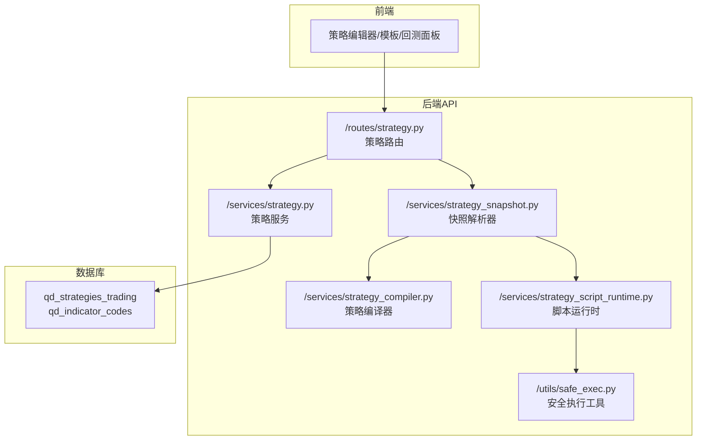
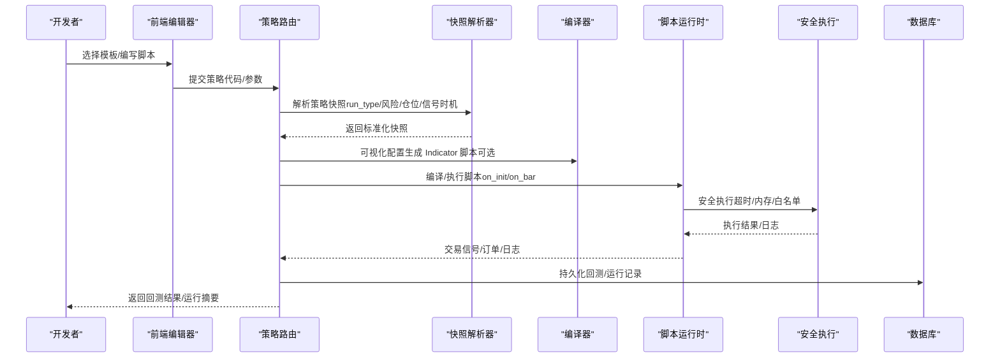
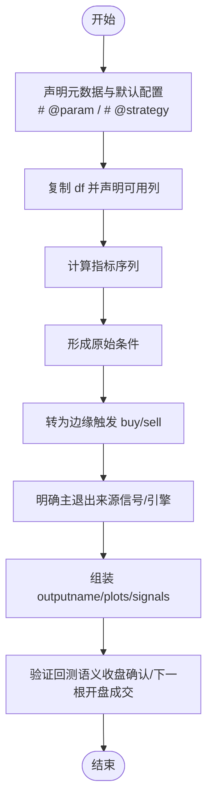
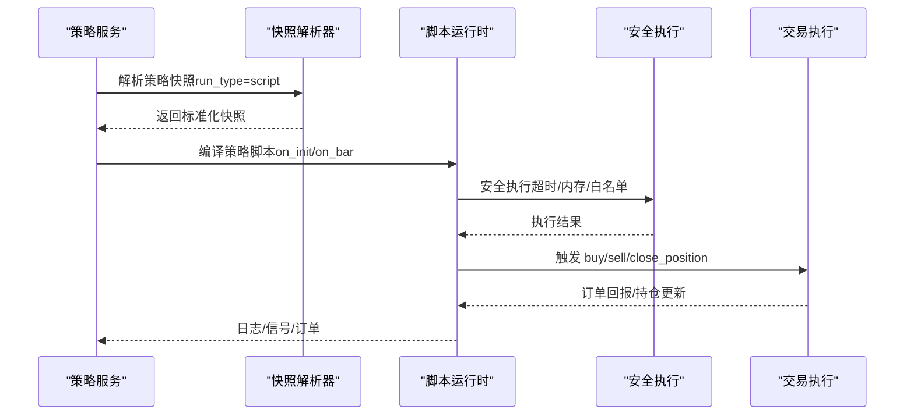
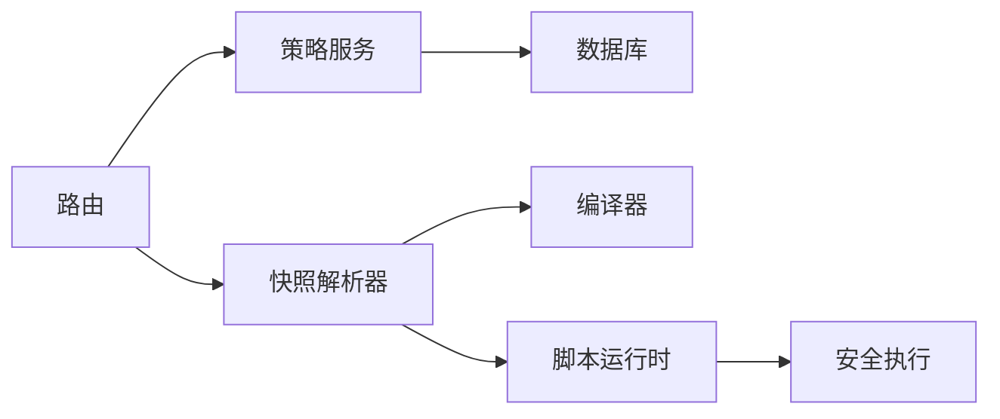

# 策略开发

<cite>
**本文引用的文件**
- [策略开发指南（中文）](file://docs/STRATEGY_DEV_GUIDE_CN.md)
- [策略开发指南（英文）](file://docs/STRATEGY_DEV_GUIDE.md)
- [策略模板清单](file://backend_api_python/app/data/strategy_templates.json)
- [策略路由](file://backend_api_python/app/routes/strategy.py)
- [策略服务](file://backend_api_python/app/services/strategy.py)
- [策略编译器](file://backend_api_python/app/services/strategy_compiler.py)
- [策略脚本运行时](file://backend_api_python/app/services/strategy_script_runtime.py)
- [策略快照解析器](file://backend_api_python/app/services/strategy_snapshot.py)
- [安全执行工具](file://backend_api_python/app/utils/safe_exec.py)
- [双均线示例](file://docs/examples/dual_ma_with_params.py)
- [多指标复合示例](file://docs/examples/multi_indicator_composite.py)
- [截面动量示例](file://docs/examples/cross_sectional_momentum_rsi.py)
</cite>

## 目录
1. [简介](#简介)
2. [项目结构](#项目结构)
3. [核心组件](#核心组件)
4. [架构总览](#架构总览)
5. [详细组件分析](#详细组件分析)
6. [依赖分析](#依赖分析)
7. [性能考虑](#性能考虑)
8. [故障排查指南](#故障排查指南)
9. [结论](#结论)
10. [附录](#附录)

## 简介
本指南面向策略开发者，系统讲解 QuantDinger 的两种策略开发模式：IndicatorStrategy（基于 DataFrame 的指标/信号脚本）与 ScriptStrategy（基于 on_init/on_bar 的事件驱动脚本）。内容覆盖开发心智模型、模式选择、完整开发流程、编译与运行时环境、调试技巧、模板与最佳实践，并提供多类策略示例的编写方法与参考路径。

## 项目结构
QuantDinger 的策略开发涉及前端交互、后端 API、策略编译与运行时、安全沙箱与回测链路。核心目录与职责概览：
- docs：策略开发指南与示例脚本
- backend_api_python/app/routes：策略相关 API（模板、回测、历史查询）
- backend_api_python/app/services：策略服务、编译器、运行时、快照解析器
- backend_api_python/app/utils：安全执行工具（沙箱、超时、资源限制）

**图表来源**
- [策略路由:1-800](file://backend_api_python/app/routes/strategy.py#L1-L800)
- [策略服务:1-800](file://backend_api_python/app/services/strategy.py#L1-L800)
- [策略快照解析器:1-220](file://backend_api_python/app/services/strategy_snapshot.py#L1-L220)
- [策略编译器:1-689](file://backend_api_python/app/services/strategy_compiler.py#L1-L689)
- [策略脚本运行时:1-191](file://backend_api_python/app/services/strategy_script_runtime.py#L1-L191)
- [安全执行工具:1-471](file://backend_api_python/app/utils/safe_exec.py#L1-L471)

**章节来源**
- [策略路由:1-800](file://backend_api_python/app/routes/strategy.py#L1-L800)
- [策略服务:1-800](file://backend_api_python/app/services/strategy.py#L1-L800)
- [策略快照解析器:1-220](file://backend_api_python/app/services/strategy_snapshot.py#L1-L220)
- [策略编译器:1-689](file://backend_api_python/app/services/strategy_compiler.py#L1-L689)
- [策略脚本运行时:1-191](file://backend_api_python/app/services/strategy_script_runtime.py#L1-L191)
- [安全执行工具:1-471](file://backend_api_python/app/utils/safe_exec.py#L1-L471)

## 核心组件
- 指标策略（IndicatorStrategy）：以 df 为基础，计算指标、生成布尔 buy/sell 信号，输出图表与信号标注，适合信号型回测与图表验证。
- 脚本策略（ScriptStrategy）：以 on_init/on_bar 事件驱动，读取 ctx.position、ctx.bars、ctx.param，发出 ctx.buy/sell/close_position，适合运行时状态管理与复杂执行逻辑。
- 快照解析器：将存储的策略记录解析为回测/执行所需的快照，统一 run_type、风险与仓位配置、信号时机等。
- 编译器：将可视化配置转换为可执行的 IndicatorStrategy 脚本（辅助生成与教学用途）。
- 运行时：将用户脚本编译并安全执行，提供与回测一致的上下文（bar、position、log、buy/sell/close）。
- 安全执行：限制内置函数、模块导入、超时与内存，防止破坏性操作。

**章节来源**
- [策略开发指南（中文）:1-1270](file://docs/STRATEGY_DEV_GUIDE_CN.md#L1-L1270)
- [策略开发指南（英文）:1-1270](file://docs/STRATEGY_DEV_GUIDE.md#L1-L1270)
- [策略快照解析器:1-220](file://backend_api_python/app/services/strategy_snapshot.py#L1-L220)
- [策略编译器:1-689](file://backend_api_python/app/services/strategy_compiler.py#L1-L689)
- [策略脚本运行时:1-191](file://backend_api_python/app/services/strategy_script_runtime.py#L1-L191)
- [安全执行工具:1-471](file://backend_api_python/app/utils/safe_exec.py#L1-L471)

## 架构总览
策略从“想法—验证—落地”的完整链路如下：

**图表来源**
- [策略路由:1-800](file://backend_api_python/app/routes/strategy.py#L1-L800)
- [策略快照解析器:1-220](file://backend_api_python/app/services/strategy_snapshot.py#L1-L220)
- [策略编译器:1-689](file://backend_api_python/app/services/strategy_compiler.py#L1-L689)
- [策略脚本运行时:1-191](file://backend_api_python/app/services/strategy_script_runtime.py#L1-L191)
- [安全执行工具:1-471](file://backend_api_python/app/utils/safe_exec.py#L1-L471)

## 详细组件分析

### 指标策略（IndicatorStrategy）开发
- 心智模型：将逻辑拆分为三层
  - 指标层：均线、RSI、ATR、布林带、过滤条件
  - 信号层：df['buy'] 与 df['sell']（布尔序列）
  - 风险默认配置层：# @strategy（止损、止盈、默认仓位、跟踪止损等）
- 关键步骤
  - 元数据与默认配置：my_indicator_name/description、# @param、# @strategy
  - 复制 df，避免原地修改
  - 计算指标，形成原始条件
  - 将原始条件转为边缘触发的 buy/sell
  - 明确“主退出来源”（信号或引擎）
  - 组装 output（name/plots/signals/calculatedVars）
  - 回测语义：以收盘确认、下一根开盘成交为准
- 示例参考
  - 双均线策略（含参数与默认风控）
  - 多指标复合策略（均线+RSI+MACD+成交量过滤）
  - 截面动量策略（研究参考，非主链路）

**图表来源**
- [策略开发指南（中文）:93-567](file://docs/STRATEGY_DEV_GUIDE_CN.md#L93-L567)
- [双均线示例:1-64](file://docs/examples/dual_ma_with_params.py#L1-L64)
- [多指标复合示例:1-109](file://docs/examples/multi_indicator_composite.py#L1-L109)
- [截面动量示例:1-71](file://docs/examples/cross_sectional_momentum_rsi.py#L1-L71)

**章节来源**
- [策略开发指南（中文）:93-567](file://docs/STRATEGY_DEV_GUIDE_CN.md#L93-L567)
- [双均线示例:1-64](file://docs/examples/dual_ma_with_params.py#L1-L64)
- [多指标复合示例:1-109](file://docs/examples/multi_indicator_composite.py#L1-L109)
- [截面动量示例:1-71](file://docs/examples/cross_sectional_momentum_rsi.py#L1-L71)

### 脚本策略（ScriptStrategy）开发
- 适用场景：需要运行时状态（持仓、余额、权益）、动态止损止盈、分批加减仓、bot 风格执行
- 必需函数：on_init(ctx)、on_bar(ctx, bar)
- 可用对象与方法
  - bar：open/high/low/close/volume/timestamp
  - ctx：param/name/default、bars(n)、position、balance/equity、log(msg)、buy/sell/ close_position
- 退出与仓位语义
  - 保存后的策略回测，仓位大小主要由规范化交易配置（如 entryPct）决定
  - ctx.buy/sell 的 amount 更适合表达运行时下单意图
  - “现在全部退出”优先使用 ctx.close_position
- 示例参考
  - 带运行时退出的脚本策略
  - 更贴近平台实盘的脚本策略（含参数、多空切换、动态止盈止损）

**图表来源**
- [策略快照解析器:1-220](file://backend_api_python/app/services/strategy_snapshot.py#L1-L220)
- [策略脚本运行时:1-191](file://backend_api_python/app/services/strategy_script_runtime.py#L1-L191)
- [安全执行工具:1-471](file://backend_api_python/app/utils/safe_exec.py#L1-L471)

**章节来源**
- [策略开发指南（中文）:570-780](file://docs/STRATEGY_DEV_GUIDE_CN.md#L570-L780)
- [策略脚本运行时:1-191](file://backend_api_python/app/services/strategy_script_runtime.py#L1-L191)
- [安全执行工具:1-471](file://backend_api_python/app/utils/safe_exec.py#L1-L471)

### 策略模板与最佳实践
- 模板分类：趋势、均值回归、波动率、网格、定投、动量轮动等
- 使用建议
  - 从模板入手，快速验证信号与参数
  - 明确 # @param 与 # @strategy 的边界
  - 将“信号负责退出”与“引擎负责退出”写得清晰可读
  - 保存策略后，用持久化记录跑策略回测，再决定是否迁移到脚本策略

**章节来源**
- [策略模板清单:1-191](file://backend_api_python/app/data/strategy_templates.json#L1-L191)
- [策略开发指南（中文）:1260-1270](file://docs/STRATEGY_DEV_GUIDE_CN.md#L1260-L1270)

## 依赖分析
- 模块耦合
  - 路由层依赖策略服务、快照解析器、回测服务
  - 策略服务依赖数据库与外部交易所连接测试
  - 快照解析器将存储的策略配置统一为回测/执行所需结构
  - 脚本运行时依赖安全执行工具，确保沙箱与超时
- 外部依赖
  - pandas/numpy（指标计算）
  - ccxt/REST（交易所连接测试）
  - 数据库（PostgreSQL 表 qd_strategies_trading、qd_indicator_codes）

**图表来源**
- [策略路由:1-800](file://backend_api_python/app/routes/strategy.py#L1-L800)
- [策略服务:1-800](file://backend_api_python/app/services/strategy.py#L1-L800)
- [策略快照解析器:1-220](file://backend_api_python/app/services/strategy_snapshot.py#L1-L220)
- [策略编译器:1-689](file://backend_api_python/app/services/strategy_compiler.py#L1-L689)
- [策略脚本运行时:1-191](file://backend_api_python/app/services/strategy_script_runtime.py#L1-L191)
- [安全执行工具:1-471](file://backend_api_python/app/utils/safe_exec.py#L1-L471)

**章节来源**
- [策略路由:1-800](file://backend_api_python/app/routes/strategy.py#L1-L800)
- [策略服务:1-800](file://backend_api_python/app/services/strategy.py#L1-L800)
- [策略快照解析器:1-220](file://backend_api_python/app/services/strategy_snapshot.py#L1-L220)
- [策略编译器:1-689](file://backend_api_python/app/services/strategy_compiler.py#L1-L689)
- [策略脚本运行时:1-191](file://backend_api_python/app/services/strategy_script_runtime.py#L1-L191)
- [安全执行工具:1-471](file://backend_api_python/app/utils/safe_exec.py#L1-L471)

## 性能考虑
- 指标策略
  - 避免未来函数（如 shift(-1)），严格遵循“收盘确认、下一根开盘成交”
  - 控制 plot 数量与数据长度，减少前端渲染压力
- 脚本策略
  - 降低 bars(n) 请求频率，缓存必要中间值
  - 避免频繁 close_position + 反手，减少滑点与手续费放大
- 运行时与安全
  - 合理设置超时与内存上限，防止长尾任务拖垮系统
  - 使用白名单导入，避免 IO 与网络调用

[本节为通用指导，无需特定文件引用]

## 故障排查指南
- 常见问题与定位
  - 缺少必需函数：on_init/on_bar 未定义或签名不正确
  - 代码不安全：包含 eval/exec/open/__import__ 等危险模式
  - 无交易意图：未检测到 ctx.buy/sell/close_position
  - 代码为空：提交空字符串
- 路由层校验
  - 提交策略代码后，路由会进行语法检查、函数完整性检查与运行时编译
  - 返回 hints 与 human-summary，帮助快速修复
- 安全执行
  - 超时：默认 60 秒，可通过 safe_exec 调整
  - 内存不足：默认 500MB，可通过 safe_exec 调整
  - 危险模式：正则 + AST 双重检查，拒绝导入/调用危险模块与函数
- 回测与实盘差异
  - 标准脚本回测与实盘以“已确认收盘的 bar”为核心
  - bot 模式可能用类 tick 的伪 bar 驱动
  - amount 更适合表达下单意图；保存后的策略回测，仓位大小主要受 entryPct 等规范化配置影响

**章节来源**
- [策略路由:45-122](file://backend_api_python/app/routes/strategy.py#L45-L122)
- [安全执行工具:1-471](file://backend_api_python/app/utils/safe_exec.py#L1-L471)

## 结论
- 优先使用 IndicatorStrategy 原型化想法、验证信号与图表，再根据是否需要运行时状态决定是否迁移到 ScriptStrategy
- 明确 # @param 与 # @strategy 的边界，将“信号负责退出”与“引擎负责退出”写清楚
- 使用模板与示例快速起步，结合回测与持久化记录核对成交语义与仓位暴露
- 严格遵守安全执行与超时/内存限制，确保策略稳定运行

[本节为总结，无需特定文件引用]

## 附录

### 开发流程（从需求到测试）
- 原型阶段：IndicatorStrategy
  - 选择模板或自定义，定义 # @param 与 # @strategy
  - 计算指标、生成 buy/sell、绘制图表与信号标注
  - 验证回测语义（收盘确认、下一根开盘成交）
- 持久化与二次验证
  - 保存策略，用持久化记录跑策略回测
  - 明确退出来源与风控配置
- 迁移阶段：ScriptStrategy
  - 仅在需要运行时状态、动态风控、分批执行时迁移
  - on_init 初始化参数与日志，on_bar 中读取 ctx.position 与 ctx.bars
  - 使用 ctx.buy/sell/close_position 表达意图，优先用 close_position 表达“全部平仓”
- 模拟/实盘
  - 确认配置、凭证与市场语义正确后再进入模拟或实盘

**章节来源**
- [策略开发指南（中文）:1260-1270](file://docs/STRATEGY_DEV_GUIDE_CN.md#L1260-L1270)

### 代码示例参考路径
- 双均线策略（含参数与默认风控）
  - [双均线示例:1-64](file://docs/examples/dual_ma_with_params.py#L1-L64)
- 多指标复合策略（均线+RSI+MACD+成交量过滤）
  - [多指标复合示例:1-109](file://docs/examples/multi_indicator_composite.py#L1-L109)
- 截面动量策略（研究参考）
  - [截面动量示例:1-71](file://docs/examples/cross_sectional_momentum_rsi.py#L1-L71)

**章节来源**
- [双均线示例:1-64](file://docs/examples/dual_ma_with_params.py#L1-L64)
- [多指标复合示例:1-109](file://docs/examples/multi_indicator_composite.py#L1-L109)
- [截面动量示例:1-71](file://docs/examples/cross_sectional_momentum_rsi.py#L1-L71)