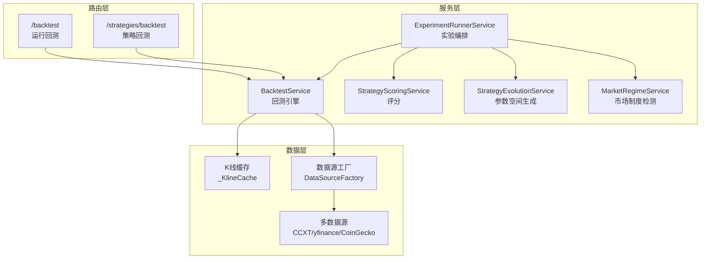
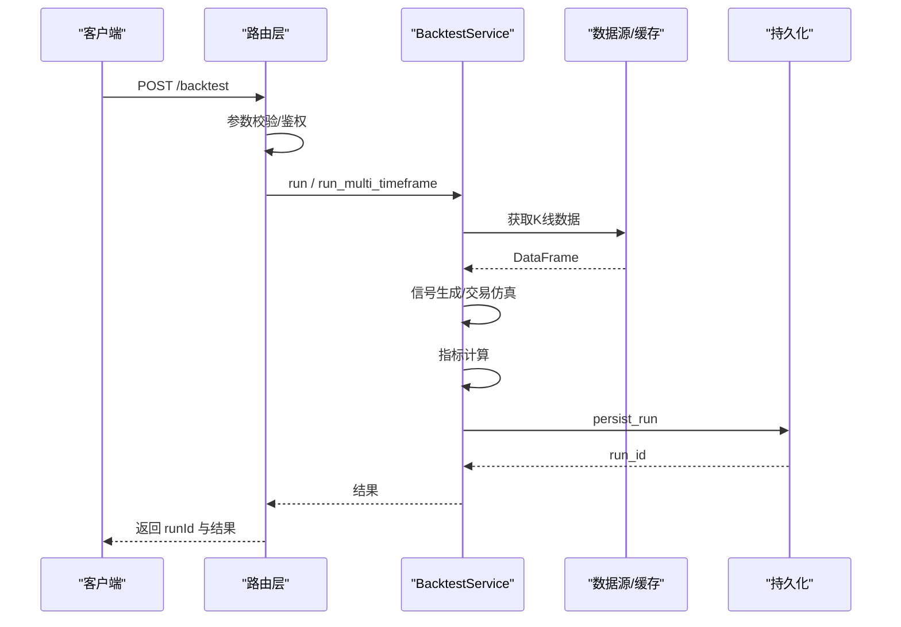
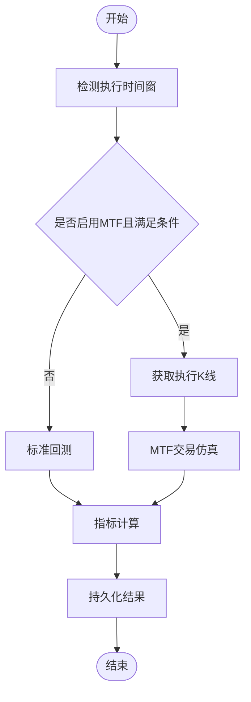
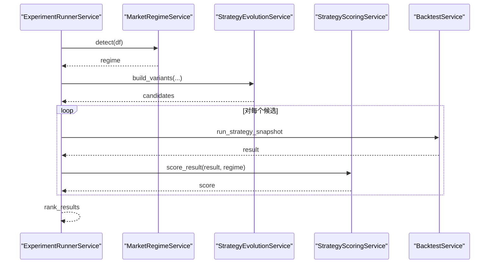
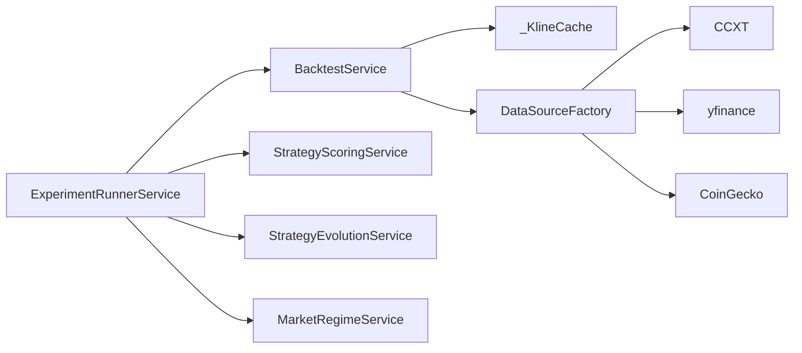

# 策略测试与验证

<cite>
**本文引用的文件**
- [backend_api_python/app/routes/backtest.py](file://backend_api_python/app/routes/backtest.py)
- [backend_api_python/app/services/backtest.py](file://backend_api_python/app/services/backtest.py)
- [backend_api_python/app/services/experiment/runner.py](file://backend_api_python/app/services/experiment/runner.py)
- [backend_api_python/app/services/experiment/scoring.py](file://backend_api_python/app/services/experiment/scoring.py)
- [backend_api_python/app/services/experiment/evolution.py](file://backend_api_python/app/services/experiment/evolution.py)
- [backend_api_python/app/services/experiment/regime.py](file://backend_api_python/app/services/experiment/regime.py)
- [backend_api_python/app/services/exchange_execution.py](file://backend_api_python/app/services/exchange_execution.py)
- [backend_api_python/app/data_providers/crypto.py](file://backend_api_python/app/data_providers/crypto.py)
- [backend_api_python/app/routes/strategy.py](file://backend_api_python/app/routes/strategy.py)
- [backend_api_python/app/services/strategy.py](file://backend_api_python/app/services/strategy.py)
- [docs/STRATEGY_DEV_GUIDE.md](file://docs/STRATEGY_DEV_GUIDE.md)
- [docs/examples/dual_ma_with_params.py](file://docs/examples/dual_ma_with_params.py)
- [docs/examples/multi_indicator_composite.py](file://docs/examples/multi_indicator_composite.py)
- [docs/examples/cross_sectional_momentum_rsi.py](file://docs/examples/cross_sectional_momentum_rsi.py)
</cite>

## 目录
1. [引言](#引言)
2. [项目结构](#项目结构)
3. [核心组件](#核心组件)
4. [架构总览](#架构总览)
5. [详细组件分析](#详细组件分析)
6. [依赖分析](#依赖分析)
7. [性能考量](#性能考量)
8. [故障排查指南](#故障排查指南)
9. [结论](#结论)
10. [附录](#附录)

## 引言
本指南面向策略开发者与量化研究人员，系统阐述 QuantDinger 平台的策略测试与验证体系，覆盖回测引擎、参数优化、实验编排、评分与排名、以及最佳实践。内容既适合初学者快速上手，也便于资深用户深入掌握回测流程、结果解读与过拟合防范。

## 项目结构
后端采用 Flask 路由 + 服务层的分层设计，策略测试相关的关键模块如下：
- 路由层：提供回测与策略相关 API，负责参数校验、鉴权与调用服务层
- 服务层：实现回测引擎、实验编排、评分与演化、市场制度检测等核心逻辑
- 数据层：提供多数据源与缓存机制，支撑历史数据获取
- 文档与示例：提供策略开发指南与示例脚本，指导参数与风控声明

图表来源
- [backend_api_python/app/routes/backtest.py:179-456](file://backend_api_python/app/routes/backtest.py#L179-L456)
- [backend_api_python/app/routes/strategy.py:467-610](file://backend_api_python/app/routes/strategy.py#L467-L610)
- [backend_api_python/app/services/backtest.py:64-142](file://backend_api_python/app/services/backtest.py#L64-L142)
- [backend_api_python/app/services/experiment/runner.py:32-237](file://backend_api_python/app/services/experiment/runner.py#L32-L237)
- [backend_api_python/app/services/experiment/scoring.py:10-140](file://backend_api_python/app/services/experiment/scoring.py#L10-L140)
- [backend_api_python/app/services/experiment/evolution.py:13-123](file://backend_api_python/app/services/experiment/evolution.py#L13-L123)
- [backend_api_python/app/services/experiment/regime.py:21-170](file://backend_api_python/app/services/experiment/regime.py#L21-L170)
- [backend_api_python/app/data_providers/crypto.py:13-169](file://backend_api_python/app/data_providers/crypto.py#L13-L169)

章节来源
- [backend_api_python/app/routes/backtest.py:179-456](file://backend_api_python/app/routes/backtest.py#L179-L456)
- [backend_api_python/app/routes/strategy.py:467-610](file://backend_api_python/app/routes/strategy.py#L467-L610)
- [backend_api_python/app/services/backtest.py:64-142](file://backend_api_python/app/services/backtest.py#L64-L142)
- [backend_api_python/app/services/experiment/runner.py:32-237](file://backend_api_python/app/services/experiment/runner.py#L32-L237)
- [backend_api_python/app/services/experiment/scoring.py:10-140](file://backend_api_python/app/services/experiment/scoring.py#L10-L140)
- [backend_api_python/app/services/experiment/evolution.py:13-123](file://backend_api_python/app/services/experiment/evolution.py#L13-L123)
- [backend_api_python/app/services/experiment/regime.py:21-170](file://backend_api_python/app/services/experiment/regime.py#L21-L170)
- [backend_api_python/app/data_providers/crypto.py:13-169](file://backend_api_python/app/data_providers/crypto.py#L13-L169)

## 核心组件
- 回测服务（BacktestService）
  - 支持标准回测与多时间框架（MTF）高精度回测
  - 提供 K 线缓存、执行时间窗选择、交易仿真、指标计算与结果持久化
- 实验编排（ExperimentRunnerService）
  - 市场制度检测、批量回测、评分与排名、参数空间探索（网格/随机）、多轮 LLM 优化
- 评分与演化（StrategyScoringService、StrategyEvolutionService）
  - 多因子评分、稳定性评估、权重与等级映射、参数空间枚举
- 市场制度检测（MarketRegimeService）
  - 基于特征的制度分类（趋势/震荡/高波动/盘整/过渡）
- 路由与策略服务
  - 提供回测 API、策略模板、策略代码质量校验与持久化

章节来源
- [backend_api_python/app/services/backtest.py:64-142](file://backend_api_python/app/services/backtest.py#L64-L142)
- [backend_api_python/app/services/experiment/runner.py:32-237](file://backend_api_python/app/services/experiment/runner.py#L32-L237)
- [backend_api_python/app/services/experiment/scoring.py:10-140](file://backend_api_python/app/services/experiment/scoring.py#L10-L140)
- [backend_api_python/app/services/experiment/evolution.py:13-123](file://backend_api_python/app/services/experiment/evolution.py#L13-L123)
- [backend_api_python/app/services/experiment/regime.py:21-170](file://backend_api_python/app/services/experiment/regime.py#L21-L170)
- [backend_api_python/app/routes/backtest.py:179-456](file://backend_api_python/app/routes/backtest.py#L179-L456)
- [backend_api_python/app/routes/strategy.py:467-610](file://backend_api_python/app/routes/strategy.py#L467-L610)

## 架构总览
回测从路由进入，经由安全校验与参数解析，调用 BacktestService 执行回测与仿真，随后进行指标计算与结果持久化。实验编排模块可选地接入市场制度检测与参数空间探索，形成闭环的策略验证流水线。

图表来源
- [backend_api_python/app/routes/backtest.py:179-456](file://backend_api_python/app/routes/backtest.py#L179-L456)
- [backend_api_python/app/services/backtest.py:444-667](file://backend_api_python/app/services/backtest.py#L444-L667)

章节来源
- [backend_api_python/app/routes/backtest.py:179-456](file://backend_api_python/app/routes/backtest.py#L179-L456)
- [backend_api_python/app/services/backtest.py:444-667](file://backend_api_python/app/services/backtest.py#L444-L667)

## 详细组件分析

### 回测服务（BacktestService）
- 多时间框架（MTF）高精度回测
  - 自动选择执行时间窗（1m/5m），在 15 天内使用 1 分钟精度，在 1 年内使用 5 分钟精度
  - 当满足条件时，使用更高频数据进行精确交易仿真，否则回退至标准回测
- 交易仿真与风险控制
  - 支持固定止盈止损、移动止盈、杠杆、佣金与滑点
  - 支持多信号模式（buy/sell 或 open/close long/short），并进行索引对齐与兼容性检查
- 指标计算与结果格式化
  - 计算总收益、年化收益、最大回撤、夏普比率、盈亏比、胜率、交易次数、权益曲线等
  - 结果持久化至数据库，包含交易明细与权益点序列
- K 线缓存
  - 内存级缓存与 TTL 控制，减少重复外部请求

图表来源
- [backend_api_python/app/services/backtest.py:170-224](file://backend_api_python/app/services/backtest.py#L170-L224)
- [backend_api_python/app/services/backtest.py:444-667](file://backend_api_python/app/services/backtest.py#L444-L667)

章节来源
- [backend_api_python/app/services/backtest.py:64-142](file://backend_api_python/app/services/backtest.py#L64-L142)
- [backend_api_python/app/services/backtest.py:170-224](file://backend_api_python/app/services/backtest.py#L170-L224)
- [backend_api_python/app/services/backtest.py:444-667](file://backend_api_python/app/services/backtest.py#L444-L667)

### 实验编排（ExperimentRunnerService）
- 市场制度检测
  - 基于价格变化、EMA 间距、波动率、ATR、方向效率与成交量等特征，识别趋势/震荡/高波动/盘整/过渡等制度
- 批量回测与评分
  - 从参数空间生成候选集（网格/随机），批量回测并评分，支持多轮 LLM 优化
- 结果聚合与最佳策略输出
  - 排序、生成最佳策略摘要与提示

图表来源
- [backend_api_python/app/services/experiment/runner.py:52-237](file://backend_api_python/app/services/experiment/runner.py#L52-L237)
- [backend_api_python/app/services/experiment/regime.py:54-75](file://backend_api_python/app/services/experiment/regime.py#L54-L75)
- [backend_api_python/app/services/experiment/evolution.py:16-86](file://backend_api_python/app/services/experiment/evolution.py#L16-L86)
- [backend_api_python/app/services/experiment/scoring.py:23-82](file://backend_api_python/app/services/experiment/scoring.py#L23-L82)

章节来源
- [backend_api_python/app/services/experiment/runner.py:32-237](file://backend_api_python/app/services/experiment/runner.py#L32-L237)
- [backend_api_python/app/services/experiment/regime.py:21-170](file://backend_api_python/app/services/experiment/regime.py#L21-L170)
- [backend_api_python/app/services/experiment/evolution.py:13-123](file://backend_api_python/app/services/experiment/evolution.py#L13-L123)
- [backend_api_python/app/services/experiment/scoring.py:10-140](file://backend_api_python/app/services/experiment/scoring.py#L10-L140)

### 评分与演化（StrategyScoringService、StrategyEvolutionService）
- 多因子评分
  - 总收益、年化收益、夏普比率、盈亏比、胜率、最大回撤、稳定性（单调性）、样本量
  - 加权合成综合得分，并按制度类型进行调节
- 稳定性评估
  - 基于权益曲线单调性评估策略稳定性
- 参数空间生成
  - 支持网格与随机两种方式，自动展开嵌套路径（如 strategy_config.risk.stopLossPct）

章节来源
- [backend_api_python/app/services/experiment/scoring.py:10-140](file://backend_api_python/app/services/experiment/scoring.py#L10-L140)
- [backend_api_python/app/services/experiment/evolution.py:13-123](file://backend_api_python/app/services/experiment/evolution.py#L13-L123)

### 路由与策略服务
- 回测路由
  - 支持多时间框架回测、MTF 切换、参数校验、持久化与错误回写
- 策略路由
  - 提供策略模板、策略代码质量校验（函数完整性、上下文参数、订单意图等）
- 策略服务
  - 提供策略列表、连接测试、显示参数构建等

章节来源
- [backend_api_python/app/routes/backtest.py:179-456](file://backend_api_python/app/routes/backtest.py#L179-L456)
- [backend_api_python/app/routes/strategy.py:467-610](file://backend_api_python/app/routes/strategy.py#L467-L610)
- [backend_api_python/app/services/strategy.py:14-1245](file://backend_api_python/app/services/strategy.py#L14-L1245)

## 依赖分析
- 组件耦合
  - ExperimentRunnerService 依赖 BacktestService、StrategyScoringService、StrategyEvolutionService、MarketRegimeService
  - BacktestService 依赖数据源工厂与 K 线缓存，结果持久化依赖数据库
- 外部依赖
  - 数据源：CCXT、yfinance、CoinGecko 等
  - 交换机连接测试：Binance、Bybit、Kraken、Gate、OKX、Bitget、Coinbase、HTX、Deepcoin 等
- 循环依赖
  - 未发现循环导入；服务间通过接口调用解耦

图表来源
- [backend_api_python/app/services/experiment/runner.py:32-46](file://backend_api_python/app/services/experiment/runner.py#L32-L46)
- [backend_api_python/app/services/backtest.py:25-61](file://backend_api_python/app/services/backtest.py#L25-L61)
- [backend_api_python/app/data_providers/crypto.py:13-169](file://backend_api_python/app/data_providers/crypto.py#L13-L169)

章节来源
- [backend_api_python/app/services/experiment/runner.py:32-46](file://backend_api_python/app/services/experiment/runner.py#L32-L46)
- [backend_api_python/app/services/backtest.py:25-61](file://backend_api_python/app/services/backtest.py#L25-L61)
- [backend_api_python/app/data_providers/crypto.py:13-169](file://backend_api_python/app/data_providers/crypto.py#L13-L169)

## 性能考量
- K 线缓存
  - 内存缓存 + TTL，高频分钟级数据显著降低外部请求次数
- 时间窗限制
  - 不同时间窗支持的最大回测天数限制，避免过长回测导致内存与计算压力
- MTF 回测
  - 仅在合适的时间范围内启用，避免不必要的高精度数据拉取
- 批量回测
  - 网格/随机参数空间生成需控制候选数量，避免资源耗尽

章节来源
- [backend_api_python/app/services/backtest.py:25-61](file://backend_api_python/app/services/backtest.py#L25-L61)
- [backend_api_python/app/services/backtest.py:68-81](file://backend_api_python/app/services/backtest.py#L68-L81)
- [backend_api_python/app/services/experiment/evolution.py:16-37](file://backend_api_python/app/services/experiment/evolution.py#L16-L37)

## 故障排查指南
- 回测失败
  - 检查时间窗限制、参数合法性、数据可用性与持久化异常
  - 查看错误回写记录，定位具体失败阶段
- 信号不生效
  - 确认 buy/sell 列布尔类型、索引对齐、信号边缘触发
- MTF 回测回退
  - 检查信号时间窗与执行时间窗关系、是否启用缩量规则或非标准信号时机
- 交换机连接测试
  - 根据返回的提示信息核对 API Key 权限、IP 白名单、市场类型与 Base URL

章节来源
- [backend_api_python/app/routes/backtest.py:415-456](file://backend_api_python/app/routes/backtest.py#L415-L456)
- [backend_api_python/app/services/backtest.py:506-554](file://backend_api_python/app/services/backtest.py#L506-L554)
- [backend_api_python/app/services/exchange_execution.py:23-149](file://backend_api_python/app/services/exchange_execution.py#L23-L149)

## 结论
QuantDinger 的策略测试与验证体系以 BacktestService 为核心，结合实验编排、评分与演化、市场制度检测，形成从参数探索到结果评估的闭环。通过路由层的统一入口与服务层的模块化设计，用户可在标准回测与 MTF 高精度回测之间灵活切换，并借助评分与制度检测规避过拟合与市场风格漂移风险。

## 附录

### 策略回测工作原理与执行流程
- 输入：策略代码、市场符号、时间窗、初始资金、手续费、滑点、杠杆、交易方向、策略配置
- 执行：信号生成 → K 线获取 → 交易仿真 → 指标计算 → 结果持久化
- 输出：回测报告（收益、风险、交易明细、权益曲线）

章节来源
- [backend_api_python/app/routes/backtest.py:179-456](file://backend_api_python/app/routes/backtest.py#L179-L456)
- [backend_api_python/app/services/backtest.py:444-667](file://backend_api_python/app/services/backtest.py#L444-L667)

### 不同策略类型的测试方法与注意事项
- IndicatorStrategy
  - 通过 buy/sell 信号驱动回测，建议明确默认风控（# @strategy），避免硬编码杠杆
- ScriptStrategy
  - 通过 on_bar/on_init 编写状态化逻辑，注意 amount 仅为意向，实际规模以交易配置为主
- 截面策略
  - 当前平台尚未纳入主回测链路，建议作为研究参考

章节来源
- [docs/STRATEGY_DEV_GUIDE.md:1-800](file://docs/STRATEGY_DEV_GUIDE.md#L1-L800)
- [docs/examples/dual_ma_with_params.py:1-64](file://docs/examples/dual_ma_with_params.py#L1-L64)
- [docs/examples/multi_indicator_composite.py:1-109](file://docs/examples/multi_indicator_composite.py#L1-L109)
- [docs/examples/cross_sectional_momentum_rsi.py:1-71](file://docs/examples/cross_sectional_momentum_rsi.py#L1-L71)

### 参数优化技术与策略
- 网格搜索
  - 在指定参数空间上穷举组合，适用于中小规模参数探索
- 随机搜索
  - 在参数空间内随机采样，适合大规模探索
- 多轮 LLM 优化
  - 基于市场制度与历史回测结果迭代生成候选，结合评分与排名筛选最优

章节来源
- [backend_api_python/app/services/experiment/evolution.py:16-86](file://backend_api_python/app/services/experiment/evolution.py#L16-L86)
- [backend_api_python/app/services/experiment/runner.py:394-487](file://backend_api_python/app/services/experiment/runner.py#L394-L487)
- [backend_api_python/app/services/experiment/runner.py:52-237](file://backend_api_python/app/services/experiment/runner.py#L52-L237)

### 测试结果解读：收益、风险与统计分析
- 收益类指标：总收益、年化收益
- 风险类指标：最大回撤、夏普比率、盈亏比、胜率
- 统计分析：样本量、稳定性（权益曲线单调性）、制度拟合度
- 解读要点：关注风险调整后收益与稳定性，避免仅看胜率或盈亏比

章节来源
- [backend_api_python/app/services/experiment/scoring.py:23-82](file://backend_api_python/app/services/experiment/scoring.py#L23-L82)

### 策略验证最佳实践
- 样本外测试
  - 使用独立时间段验证策略稳健性
- 压力测试
  - 在高波动/盘整等制度下评估策略表现
- 过拟合检测
  - 通过随机/网格搜索与制度检测，避免过度拟合特定市场阶段
- 代码质量
  - 保持 buy/sell 明确、默认风控清晰、避免硬编码杠杆

章节来源
- [backend_api_python/app/routes/strategy.py:45-121](file://backend_api_python/app/routes/strategy.py#L45-L121)
- [docs/STRATEGY_DEV_GUIDE.md:1-800](file://docs/STRATEGY_DEV_GUIDE.md#L1-L800)

### 测试数据准备与预处理
- 数据源
  - CCXT、yfinance、CoinGecko 等多源回退
- 预处理
  - 缺失值填充、OHLC 列标准化、时间索引一致性
- 缓存
  - K 线缓存提升回测效率

章节来源
- [backend_api_python/app/data_providers/crypto.py:13-169](file://backend_api_python/app/data_providers/crypto.py#L13-L169)
- [backend_api_python/app/services/backtest.py:25-61](file://backend_api_python/app/services/backtest.py#L25-L61)