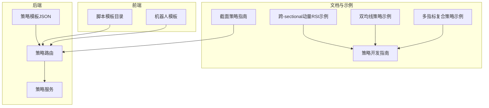
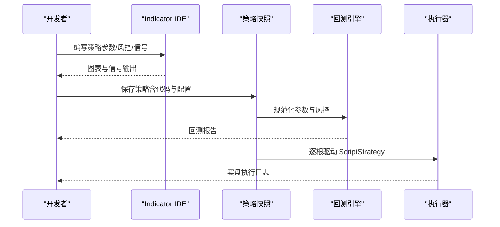
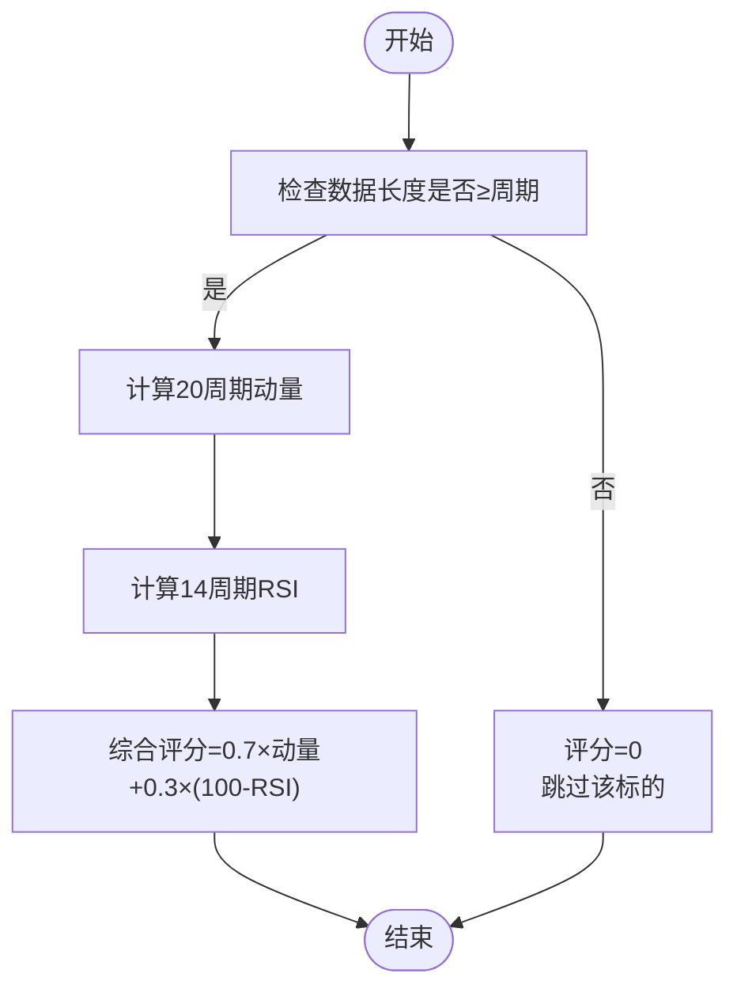
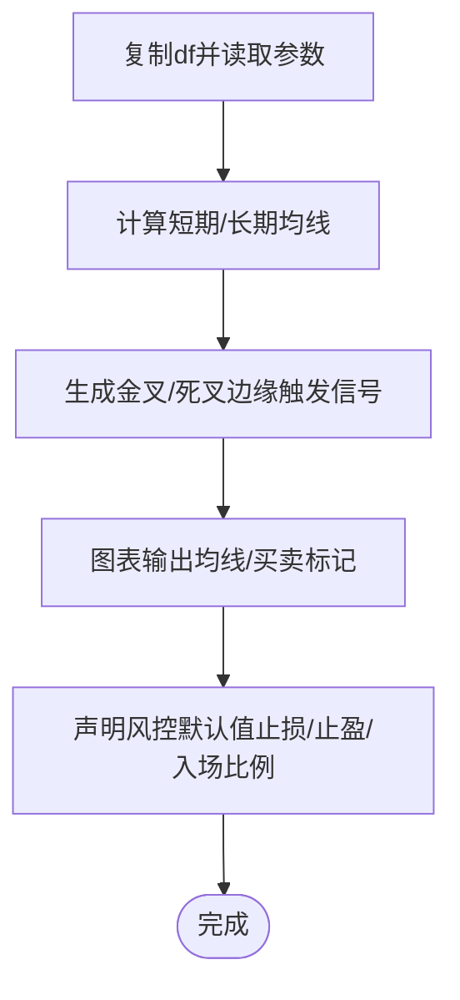
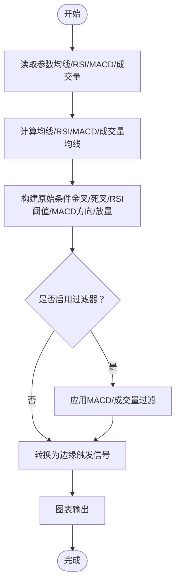
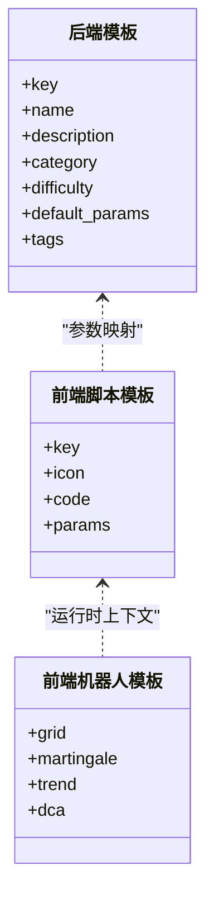
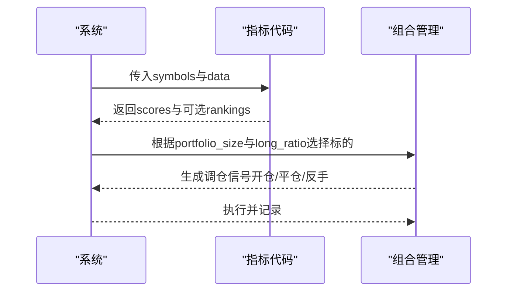
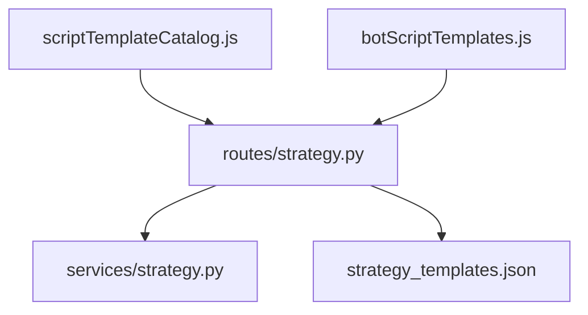

# 策略示例与模板

<cite>
**本文引用的文件**
- [cross_sectional_momentum_rsi.py](file://docs/examples/cross_sectional_momentum_rsi.py)
- [dual_ma_with_params.py](file://docs/examples/dual_ma_with_params.py)
- [multi_indicator_composite.py](file://docs/examples/multi_indicator_composite.py)
- [STRATEGY_DEV_GUIDE_CN.md](file://docs/STRATEGY_DEV_GUIDE_CN.md)
- [CROSS_SECTIONAL_STRATEGY_GUIDE_CN.md](file://docs/CROSS_SECTIONAL_STRATEGY_GUIDE_CN.md)
- [strategy_templates.json](file://backend_api_python/app/data/strategy_templates.json)
- [strategy.py](file://backend_api_python/app/routes/strategy.py)
- [strategy.py](file://backend_api_python/app/services/strategy.py)
- [scriptTemplateCatalog.js](file://frontend/src/views/trading-assistant/components/scriptTemplateCatalog.js)
- [botScriptTemplates.js](file://frontend/src/views/trading-bot/components/botScriptTemplates.js)
</cite>

## 目录
1. [引言](#引言)
2. [项目结构](#项目结构)
3. [核心组件](#核心组件)
4. [架构总览](#架构总览)
5. [详细组件分析](#详细组件分析)
6. [依赖分析](#依赖分析)
7. [性能考虑](#性能考虑)
8. [故障排查指南](#故障排查指南)
9. [结论](#结论)
10. [附录](#附录)

## 引言
本指南面向策略开发者，提供从入门到进阶的策略开发路径，覆盖指标型策略（IndicatorStrategy）与脚本型策略（ScriptStrategy）两类路径。文档包含：
- 完整策略示例：跨-sectional动量RSI、双均线、多指标复合策略等
- 策略模板库：基础框架与参数化模板
- 最佳实践与设计模式：信号生成、风控默认值、参数声明、边缘触发
- 常见陷阱与解决方案：未来函数、杠杆位置、混合退出机制
- 渐进式学习路径：从简单到复杂

## 项目结构
QuantDinger 提供后端策略服务与前端模板目录，支撑策略开发、验证、回测与执行：
- 文档示例：位于 docs/examples，包含三个策略示例脚本
- 策略开发指南：位于 docs/STRATEGY_DEV_GUIDE_CN.md，系统讲解开发流程与最佳实践
- 截面策略指南：位于 docs/CROSS_SECTIONAL_STRATEGY_GUIDE_CN.md，说明多标评分与调仓逻辑
- 后端模板与路由：backend_api_python/app/data/strategy_templates.json 与 routes/services 提供模板与策略接口
- 前端模板目录：frontend/src/views/trading-assistant/components/scriptTemplateCatalog.js 与 botScriptTemplates.js 提供脚本模板与参数注入

**图表来源**
- [cross_sectional_momentum_rsi.py:1-71](file://docs/examples/cross_sectional_momentum_rsi.py#L1-L71)
- [dual_ma_with_params.py:1-64](file://docs/examples/dual_ma_with_params.py#L1-L64)
- [multi_indicator_composite.py:1-109](file://docs/examples/multi_indicator_composite.py#L1-L109)
- [STRATEGY_DEV_GUIDE_CN.md:1-120](file://docs/STRATEGY_DEV_GUIDE_CN.md#L1-L120)
- [CROSS_SECTIONAL_STRATEGY_GUIDE_CN.md:1-120](file://docs/CROSS_SECTIONAL_STRATEGY_GUIDE_CN.md#L1-L120)
- [strategy_templates.json:1-191](file://backend_api_python/app/data/strategy_templates.json#L1-L191)
- [strategy.py:286-337](file://backend_api_python/app/routes/strategy.py#L286-L337)
- [strategy.py:1-200](file://backend_api_python/app/services/strategy.py#L1-L200)
- [scriptTemplateCatalog.js:1-538](file://frontend/src/views/trading-assistant/components/scriptTemplateCatalog.js#L1-L538)
- [botScriptTemplates.js:1-435](file://frontend/src/views/trading-bot/components/botScriptTemplates.js#L1-L435)

**章节来源**
- [STRATEGY_DEV_GUIDE_CN.md:1-120](file://docs/STRATEGY_DEV_GUIDE_CN.md#L1-L120)
- [CROSS_SECTIONAL_STRATEGY_GUIDE_CN.md:1-120](file://docs/CROSS_SECTIONAL_STRATEGY_GUIDE_CN.md#L1-L120)

## 核心组件
- 策略开发指南：定义两种开发路径（IndicatorStrategy 与 ScriptStrategy）、参数与风控默认值声明、信号生成与回测语义、常见陷阱与最佳实践
- 策略模板库：后端 JSON 模板与前端脚本模板目录，覆盖趋势跟踪、均值回归、网格、马丁格尔、定投等
- 示例策略：跨-sectional动量RSI、双均线、多指标复合策略，体现参数声明、信号生成、图表输出与风控默认值

**章节来源**
- [STRATEGY_DEV_GUIDE_CN.md:93-560](file://docs/STRATEGY_DEV_GUIDE_CN.md#L93-L560)
- [strategy_templates.json:1-191](file://backend_api_python/app/data/strategy_templates.json#L1-L191)
- [scriptTemplateCatalog.js:1-538](file://frontend/src/views/trading-assistant/components/scriptTemplateCatalog.js#L1-L538)
- [botScriptTemplates.js:1-435](file://frontend/src/views/trading-bot/components/botScriptTemplates.js#L1-L435)

## 架构总览
策略开发与执行链路：
- 开发阶段：在 Indicator IDE 中编写策略，声明参数与风控默认值，生成 buy/sell 信号并输出图表
- 保存阶段：策略代码与配置进入快照，统一进入回测或执行链路
- 执行阶段：ScriptStrategy 通过 on_init/on_bar 读取参数、读取 K 线、管理仓位与风控

**图表来源**
- [STRATEGY_DEV_GUIDE_CN.md:783-800](file://docs/STRATEGY_DEV_GUIDE_CN.md#L783-L800)
- [strategy.py:67-122](file://backend_api_python/app/routes/strategy.py#L67-L122)

## 详细组件分析

### 跨-sectional动量RSI策略
- 目标：对多标的进行动量与RSI评分，排序后做多/做空
- 关键点：
  - 动量因子：20周期价格变化率
  - RSI因子：14周期RSI，采用反转值（100 - RSI）
  - 综合评分：70%动量 + 30%反转RSI
  - 数据长度校验：不足周期则评分置零
  - 排序与调仓：可选手动排序，系统根据评分自动排序
- 技术要点：
  - RSI计算采用滚动均值与反转逻辑
  - 评分与权重可调，便于多因子扩展
  - 适用于截面策略的指标层

**图表来源**
- [cross_sectional_momentum_rsi.py:26-61](file://docs/examples/cross_sectional_momentum_rsi.py#L26-L61)

**章节来源**
- [cross_sectional_momentum_rsi.py:1-71](file://docs/examples/cross_sectional_momentum_rsi.py#L1-L71)
- [CROSS_SECTIONAL_STRATEGY_GUIDE_CN.md:60-123](file://docs/CROSS_SECTIONAL_STRATEGY_GUIDE_CN.md#L60-L123)

### 双均线策略（参数化与风控默认值）
- 目标：演示参数声明、风控默认值与图表输出
- 关键点：
  - 参数声明：短期/长期均线周期
  - 风控默认值：止损、止盈、入场比例、跟踪止损等
  - 信号生成：均线金叉/死叉的边缘触发
  - 图表输出：均线叠加与买卖标记
- 设计模式：
  - 将参数、风控、信号、图表分离，提升可读性与可维护性
  - 使用 tradeDirection 控制多/空/双向

**图表来源**
- [dual_ma_with_params.py:31-64](file://docs/examples/dual_ma_with_params.py#L31-L64)

**章节来源**
- [dual_ma_with_params.py:1-64](file://docs/examples/dual_ma_with_params.py#L1-L64)
- [STRATEGY_DEV_GUIDE_CN.md:93-296](file://docs/STRATEGY_DEV_GUIDE_CN.md#L93-L296)

### 多指标复合策略（均线+RSI+MACD+成交量）
- 目标：组合多种技术指标与过滤条件，形成稳健信号
- 关键点：
  - 参数声明：短期/长期均线、RSI周期与阈值、是否启用MACD/成交量过滤
  - 指标计算：均线、RSI、MACD直方图、成交量均线
  - 原始条件与组合：金叉/死叉、RSI超买/超卖、MACD方向、成交量放大
  - 边缘触发：避免连续信号
  - 图表输出：均线、RSI、MACD序列与买卖标记
- 设计模式：
  - 将原始条件与组合逻辑分离，增强可读性
  - 通过参数开关灵活启用过滤器

**图表来源**
- [multi_indicator_composite.py:35-109](file://docs/examples/multi_indicator_composite.py#L35-L109)

**章节来源**
- [multi_indicator_composite.py:1-109](file://docs/examples/multi_indicator_composite.py#L1-L109)
- [STRATEGY_DEV_GUIDE_CN.md:93-296](file://docs/STRATEGY_DEV_GUIDE_CN.md#L93-L296)

### 策略模板库（后端与前端）
- 后端模板：strategy_templates.json 提供策略类别、难度、默认参数与标签，覆盖趋势、均值回归、波动率、市场做市、被动投资等
- 前端模板：
  - trading-assistant 脚本模板目录：提供趋势跟踪、马丁格尔、网格、定投、均值回归、突破、RSI均值回归、MACD交叉等模板
  - trading-bot 机器人模板：网格、马丁格尔、趋势跟踪、定投等，支持参数注入与运行时上下文

**图表来源**
- [strategy_templates.json:1-191](file://backend_api_python/app/data/strategy_templates.json#L1-L191)
- [scriptTemplateCatalog.js:1-538](file://frontend/src/views/trading-assistant/components/scriptTemplateCatalog.js#L1-L538)
- [botScriptTemplates.js:1-435](file://frontend/src/views/trading-bot/components/botScriptTemplates.js#L1-L435)

**章节来源**
- [strategy_templates.json:1-191](file://backend_api_python/app/data/strategy_templates.json#L1-L191)
- [scriptTemplateCatalog.js:1-538](file://frontend/src/views/trading-assistant/components/scriptTemplateCatalog.js#L1-L538)
- [botScriptTemplates.js:1-435](file://frontend/src/views/trading-bot/components/botScriptTemplates.js#L1-L435)

### 截面策略（多标评分与调仓）
- 配置参数：cs_strategy_type、symbol_list、portfolio_size、long_ratio、rebalance_frequency
- 指标代码：返回 scores 与可选 rankings，系统据此生成买卖/平仓信号
- 调仓逻辑：按评分排序，选择做多/做空标的，新增/移除/方向变更时生成相应信号

**图表来源**
- [CROSS_SECTIONAL_STRATEGY_GUIDE_CN.md:124-198](file://docs/CROSS_SECTIONAL_STRATEGY_GUIDE_CN.md#L124-L198)

**章节来源**
- [CROSS_SECTIONAL_STRATEGY_GUIDE_CN.md:1-224](file://docs/CROSS_SECTIONAL_STRATEGY_GUIDE_CN.md#L1-L224)

## 依赖分析
- 后端路由与服务：
  - routes/strategy.py 提供策略模板查询、代码质量检查、策略验证等接口
  - services/strategy.py 提供运行中策略查询、交易所符号获取等服务
- 前端模板：
  - scriptTemplateCatalog.js 与 botScriptTemplates.js 提供模板与参数注入，支持运行时上下文

**图表来源**
- [strategy.py:286-337](file://backend_api_python/app/routes/strategy.py#L286-L337)
- [strategy.py:1-200](file://backend_api_python/app/services/strategy.py#L1-L200)
- [strategy_templates.json:1-191](file://backend_api_python/app/data/strategy_templates.json#L1-L191)
- [scriptTemplateCatalog.js:1-538](file://frontend/src/views/trading-assistant/components/scriptTemplateCatalog.js#L1-L538)
- [botScriptTemplates.js:1-435](file://frontend/src/views/trading-bot/components/botScriptTemplates.js#L1-L435)

**章节来源**
- [strategy.py:286-337](file://backend_api_python/app/routes/strategy.py#L286-L337)
- [strategy.py:1-200](file://backend_api_python/app/services/strategy.py#L1-L200)

## 性能考虑
- 指标计算复杂度：
  - 移动平均与RSI通常为O(n)线性扫描，适合大样本回测
  - 截面策略需遍历多标的，注意数据获取与评分排序的开销
- 信号生成：
  - 边缘触发减少重复信号，降低图表与回测噪声
- 执行与并发：
  - 截面策略支持批量执行，注意并发与风控一致性

[本节为通用指导，无需特定文件来源]

## 故障排查指南
- 代码质量检查：
  - 缺少 on_init/on_bar、未声明参数默认值、未检测到交易动作等提示
- 常见问题与修复：
  - 未来函数：避免使用 shift(-1) 引入未来信息
  - 杠杆位置：不要写入策略源码，应在产品配置中设置
  - 混合退出机制：明确主退出来源（信号/引擎），并在注释中说明
  - 仓位语义：amount 为运行时下单意图，回测尺寸主要由 entryPct 等规范化配置决定

**章节来源**
- [strategy.py:45-122](file://backend_api_python/app/routes/strategy.py#L45-L122)
- [STRATEGY_DEV_GUIDE_CN.md:988-1127](file://docs/STRATEGY_DEV_GUIDE_CN.md#L988-L1127)

## 结论
- 从 IndicatorStrategy 入门，先验证信号与回测语义，再根据需要升级到 ScriptStrategy
- 使用参数与风控默认值声明，分离指标、信号与图表输出
- 采用边缘触发与清晰的退出策略，避免未来函数与歧义
- 借助模板库与示例策略，快速搭建从简单到复杂的策略体系

[本节为总结，无需特定文件来源]

## 附录

### 渐进式学习路径
- 入门：双均线策略（参数化与风控默认值）
- 进阶：多指标复合策略（均线+RSI+MACD+成交量）
- 高级：跨-sectional动量RSI（多标评分与调仓）
- 实战：使用模板库快速搭建趋势跟踪、网格、马丁格尔、定投等策略

**章节来源**
- [dual_ma_with_params.py:1-64](file://docs/examples/dual_ma_with_params.py#L1-L64)
- [multi_indicator_composite.py:1-109](file://docs/examples/multi_indicator_composite.py#L1-L109)
- [cross_sectional_momentum_rsi.py:1-71](file://docs/examples/cross_sectional_momentum_rsi.py#L1-L71)
- [scriptTemplateCatalog.js:1-538](file://frontend/src/views/trading-assistant/components/scriptTemplateCatalog.js#L1-L538)
- [botScriptTemplates.js:1-435](file://frontend/src/views/trading-bot/components/botScriptTemplates.js#L1-L435)