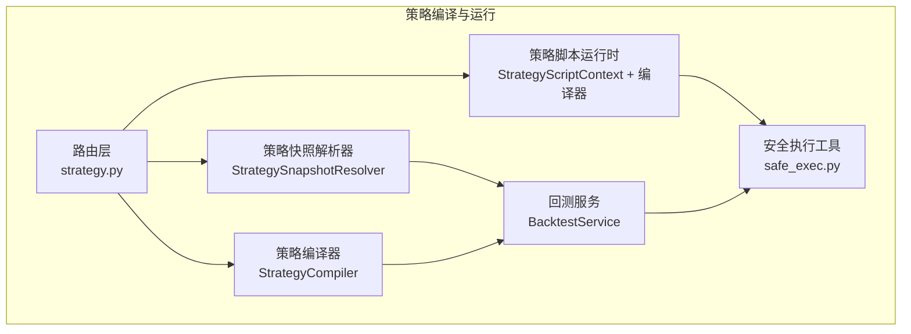
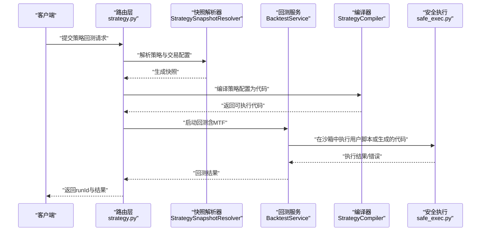
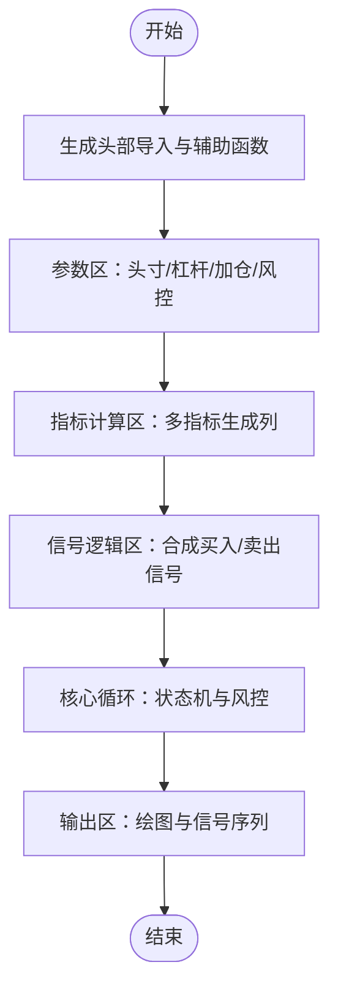
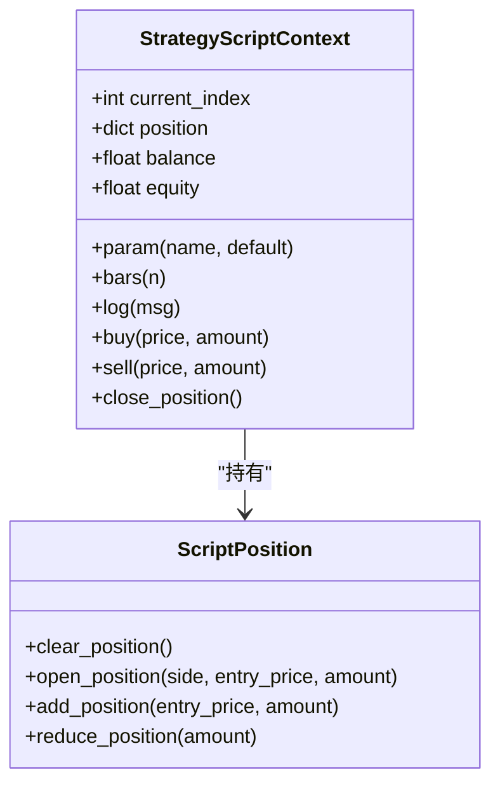
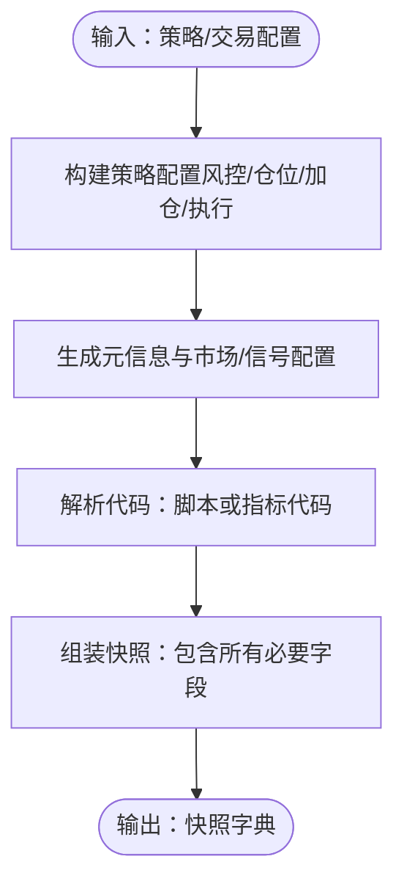
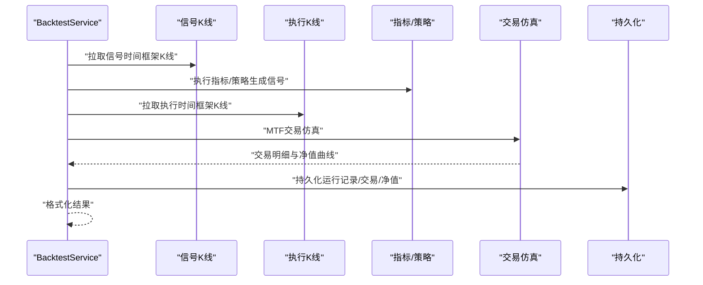
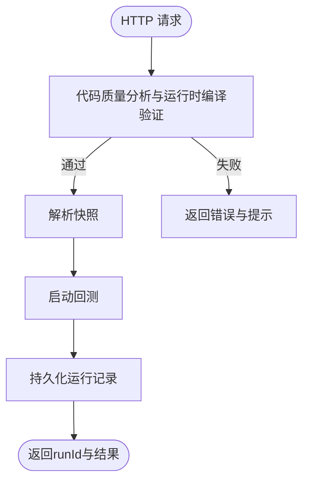
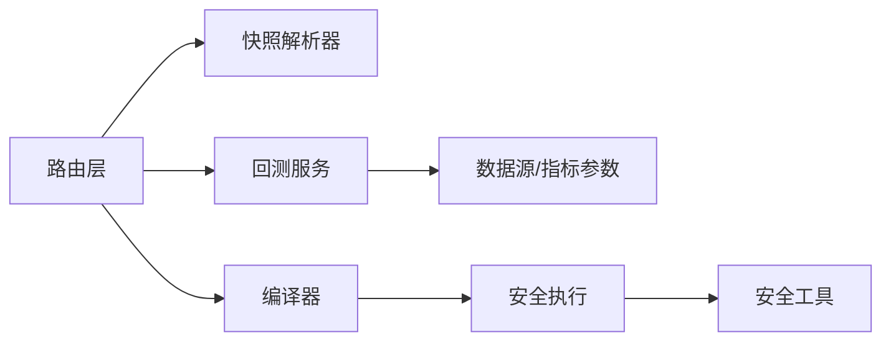

# 策略编译与运行

<cite>
**本文引用的文件**
- [backend_api_python/app/services/strategy_compiler.py](file://backend_api_python/app/services/strategy_compiler.py)
- [backend_api_python/app/services/strategy_script_runtime.py](file://backend_api_python/app/services/strategy_script_runtime.py)
- [backend_api_python/app/services/strategy_snapshot.py](file://backend_api_python/app/services/strategy_snapshot.py)
- [backend_api_python/app/utils/safe_exec.py](file://backend_api_python/app/utils/safe_exec.py)
- [backend_api_python/app/services/backtest.py](file://backend_api_python/app/services/backtest.py)
- [backend_api_python/app/routes/strategy.py](file://backend_api_python/app/routes/strategy.py)
- [backend_api_python/app/utils/strategy_runtime_logs.py](file://backend_api_python/app/utils/strategy_runtime_logs.py)
</cite>

## 目录
1. [引言](#引言)
2. [项目结构](#项目结构)
3. [核心组件](#核心组件)
4. [架构总览](#架构总览)
5. [详细组件分析](#详细组件分析)
6. [依赖分析](#依赖分析)
7. [性能考虑](#性能考虑)
8. [故障排查指南](#故障排查指南)
9. [结论](#结论)
10. [附录](#附录)

## 引言
本文件系统性阐述策略编译与运行机制，覆盖以下关键主题：
- 策略代码的编译过程与沙箱执行
- 策略快照（snapshot）的生成与持久化
- 运行时环境与内置库、全局变量及限制
- 策略生命周期管理：从加载、编译、验证、执行到结果返回
- 调试技巧与常见错误排查
- 性能优化建议与最佳实践

## 项目结构
围绕策略编译与运行的关键模块如下：
- 编译器：将策略配置转换为可执行的 Python 代码
- 快照解析器：将策略与交易配置整合为可回测/可实盘的快照
- 回测引擎：基于信号与多时间框架进行交易仿真
- 运行时：安全沙箱执行用户策略脚本，提供上下文与订单接口
- 路由层：对外暴露策略相关 API，负责输入校验与结果返回
- 日志与持久化：记录运行日志并持久化回测结果

**图表来源**
- [backend_api_python/app/services/strategy_compiler.py](file://backend_api_python/app/services/strategy_compiler.py)
- [backend_api_python/app/services/strategy_script_runtime.py](file://backend_api_python/app/services/strategy_script_runtime.py)
- [backend_api_python/app/services/strategy_snapshot.py](file://backend_api_python/app/services/strategy_snapshot.py)
- [backend_api_python/app/services/backtest.py](file://backend_api_python/app/services/backtest.py)
- [backend_api_python/app/routes/strategy.py](file://backend_api_python/app/routes/strategy.py)
- [backend_api_python/app/utils/safe_exec.py](file://backend_api_python/app/utils/safe_exec.py)

**章节来源**
- [backend_api_python/app/routes/strategy.py](file://backend_api_python/app/routes/strategy.py)
- [backend_api_python/app/services/strategy_compiler.py](file://backend_api_python/app/services/strategy_compiler.py)
- [backend_api_python/app/services/strategy_snapshot.py](file://backend_api_python/app/services/strategy_snapshot.py)
- [backend_api_python/app/services/backtest.py](file://backend_api_python/app/services/backtest.py)
- [backend_api_python/app/services/strategy_script_runtime.py](file://backend_api_python/app/services/strategy_script_runtime.py)
- [backend_api_python/app/utils/safe_exec.py](file://backend_api_python/app/utils/safe_exec.py)

## 核心组件
- 策略编译器（StrategyCompiler）
  - 将策略配置（名称、入场规则、参数、加仓/止盈止损等）转换为可执行的 Python 代码，包含指标计算、信号逻辑、核心循环与输出格式化。
- 策略脚本运行时（StrategyScriptContext + 编译器）
  - 提供 on_init/on_bar 的运行时上下文，封装订单意图（buy/sell/close_position）、参数缓存、历史K线访问、日志与头寸管理。
- 策略快照解析器（StrategySnapshotResolver）
  - 将策略与交易配置映射为统一快照，包含市场、符号、时间框架、初始资金、手续费/滑点、杠杆、风控与加仓等配置。
- 回测服务（BacktestService）
  - 支持标准回测与多时间框架（MTF）回测，负责数据拉取、信号生成、交易仿真、指标计算与结果持久化。
- 安全执行工具（safe_exec.py）
  - 提供白名单内置函数、受限导入模块、超时控制、内存限制与子进程隔离，保障用户代码在安全沙箱中执行。

**章节来源**
- [backend_api_python/app/services/strategy_compiler.py](file://backend_api_python/app/services/strategy_compiler.py)
- [backend_api_python/app/services/strategy_script_runtime.py](file://backend_api_python/app/services/strategy_script_runtime.py)
- [backend_api_python/app/services/strategy_snapshot.py](file://backend_api_python/app/services/strategy_snapshot.py)
- [backend_api_python/app/services/backtest.py](file://backend_api_python/app/services/backtest.py)
- [backend_api_python/app/utils/safe_exec.py](file://backend_api_python/app/utils/safe_exec.py)

## 架构总览
策略生命周期从“请求进入”到“结果返回”的端到端流程如下：

**图表来源**
- [backend_api_python/app/routes/strategy.py](file://backend_api_python/app/routes/strategy.py)
- [backend_api_python/app/services/strategy_snapshot.py](file://backend_api_python/app/services/strategy_snapshot.py)
- [backend_api_python/app/services/strategy_compiler.py](file://backend_api_python/app/services/strategy_compiler.py)
- [backend_api_python/app/services/backtest.py](file://backend_api_python/app/services/backtest.py)
- [backend_api_python/app/utils/safe_exec.py](file://backend_api_python/app/utils/safe_exec.py)

## 详细组件分析

### 组件A：策略编译器（StrategyCompiler）
- 功能要点
  - 头部导入与辅助函数注入
  - 参数区：初始头寸比例、杠杆、最大加仓次数、加仓阈值、止盈/止损与移动止盈参数
  - 指标计算区：支持 SuperTrend、EMA、RSI、MACD、布林带、KDJ、MA 等
  - 信号逻辑区：基于规则组合生成买入/卖出信号
  - 核心循环：逐根K线状态机，处理开仓、加仓、止盈止损、移动止盈与平仓
  - 输出区：生成绘图配置与买卖信号序列
- 数据流
  - 输入：策略配置（规则、参数、风控）
  - 输出：可执行 Python 代码字符串
- 复杂度与性能
  - 指标计算与信号逻辑以向量化为主，整体复杂度与K线数量线性相关
  - 核心循环为单次遍历，注意避免重复计算与冗余列

**图表来源**
- [backend_api_python/app/services/strategy_compiler.py](file://backend_api_python/app/services/strategy_compiler.py)

**章节来源**
- [backend_api_python/app/services/strategy_compiler.py](file://backend_api_python/app/services/strategy_compiler.py)

### 组件B：策略脚本运行时（StrategyScriptContext + 编译器）
- 功能要点
  - 上下文对象：提供 bars(n)、param(name, default)、log(msg)、buy/sell/close_position 等接口
  - 头寸对象：支持开仓、加仓、减仓与清仓，内部维护方向、价格与规模
  - 编译器：校验并编译用户脚本，返回 on_init/on_bar 句柄，注入安全内置与第三方库
- 运行时环境
  - 内置库：numpy、pandas
  - 安全限制：严格白名单内置函数、受限导入模块、超时与内存限制
- 生命周期
  - on_init：初始化阶段，用于声明参数与一次性准备
  - on_bar：每根K线回调，接收上下文与bar，发出订单意图

**图表来源**
- [backend_api_python/app/services/strategy_script_runtime.py](file://backend_api_python/app/services/strategy_script_runtime.py)

**章节来源**
- [backend_api_python/app/services/strategy_script_runtime.py](file://backend_api_python/app/services/strategy_script_runtime.py)
- [backend_api_python/app/utils/safe_exec.py](file://backend_api_python/app/utils/safe_exec.py)

### 组件C：策略快照解析器（StrategySnapshotResolver）
- 功能要点
  - 将策略与交易配置标准化为统一快照，包含市场、符号、时间框架、初始资金、手续费/滑点、杠杆、风控与加仓等
  - 支持从数据库读取指标代码，或直接使用策略脚本源码
  - 对跨市场符号进行规范化处理
- 输出
  - 字典形式的快照，包含元信息、市场配置、信号配置、风控配置、仓位配置、扩展配置等

**图表来源**
- [backend_api_python/app/services/strategy_snapshot.py](file://backend_api_python/app/services/strategy_snapshot.py)

**章节来源**
- [backend_api_python/app/services/strategy_snapshot.py](file://backend_api_python/app/services/strategy_snapshot.py)

### 组件D：回测服务（BacktestService）
- 功能要点
  - 标准回测：按策略时间框架生成信号，按执行时间框架进行精确仿真
  - 多时间框架（MTF）：在信号时间框架生成信号，在更高精度时间框架进行成交仿真
  - 执行假设与精度信息：根据回测范围与配置推断执行精度
  - 结果持久化：将回测运行记录、交易明细与净值曲线写入数据库
- 关键流程
  - 获取执行时间框架
  - 拉取K线数据
  - 执行指标/策略生成信号
  - 交易仿真与指标计算
  - 结果格式化与持久化

**图表来源**
- [backend_api_python/app/services/backtest.py](file://backend_api_python/app/services/backtest.py)

**章节来源**
- [backend_api_python/app/services/backtest.py](file://backend_api_python/app/services/backtest.py)

### 组件E：路由层（strategy.py）
- 功能要点
  - 提供策略模板查询、策略列表、详情、回测、历史查询与单次回测运行
  - 在回测流程中调用快照解析器与回测服务，并将结果持久化
  - 对策略代码进行基础质量分析与运行时编译验证
- 调试摘要
  - 返回人类可读的调试摘要，包含缺失函数、参数默认值、订单意图等提示

**图表来源**
- [backend_api_python/app/routes/strategy.py](file://backend_api_python/app/routes/strategy.py)

**章节来源**
- [backend_api_python/app/routes/strategy.py](file://backend_api_python/app/routes/strategy.py)

## 依赖分析
- 组件耦合
  - 路由层依赖快照解析器与回测服务
  - 回测服务依赖数据源工厂与指标参数解析器
  - 运行时依赖安全执行工具
- 外部依赖
  - pandas/numpy：数据处理与数值计算
  - PostgreSQL：回测结果与日志持久化
  - 可选：子进程隔离（multiprocessing）

**图表来源**
- [backend_api_python/app/routes/strategy.py](file://backend_api_python/app/routes/strategy.py)
- [backend_api_python/app/services/strategy_snapshot.py](file://backend_api_python/app/services/strategy_snapshot.py)
- [backend_api_python/app/services/backtest.py](file://backend_api_python/app/services/backtest.py)
- [backend_api_python/app/services/strategy_compiler.py](file://backend_api_python/app/services/strategy_compiler.py)
- [backend_api_python/app/utils/safe_exec.py](file://backend_api_python/app/utils/safe_exec.py)

**章节来源**
- [backend_api_python/app/routes/strategy.py](file://backend_api_python/app/routes/strategy.py)
- [backend_api_python/app/services/backtest.py](file://backend_api_python/app/services/backtest.py)
- [backend_api_python/app/utils/safe_exec.py](file://backend_api_python/app/utils/safe_exec.py)

## 性能考虑
- 数据缓存
  - K线缓存（带TTL）减少重复外部API调用，提升回测吞吐
- 时间框架选择
  - 根据回测区间自动选择执行时间框架，平衡精度与性能
- 向量化计算
  - 指标与信号逻辑尽量使用pandas/numpy向量化操作，避免显式循环
- 内存与超时
  - 安全执行工具提供内存上限与超时保护，防止长耗时或内存泄漏导致系统不稳定
- 并发与限流
  - 路由层与连接测试处采用信号量限制并发，避免资源争用

[本节为通用指导，无需特定文件引用]

## 故障排查指南
- 常见错误类型
  - 语法错误：代码无法通过编译
  - 缺少必需函数：on_bar 或 on_init 缺失
  - 运行时错误：沙箱执行失败（超时、内存不足、非法导入）
  - 配置错误：符号为空、跨市场符号不规范、MTF不支持的配置
- 排查步骤
  - 使用路由层的质量分析与运行时编译验证接口，获取人类可读提示
  - 查看回测持久化记录中的错误信息与执行假设
  - 检查安全执行日志与沙箱限制
  - 对于脚本策略，确认上下文接口使用正确（bars/param/log/buy/sell/close_position）
- 日志与持久化
  - 运行时日志写入专用表，便于定位问题

**章节来源**
- [backend_api_python/app/routes/strategy.py](file://backend_api_python/app/routes/strategy.py)
- [backend_api_python/app/utils/strategy_runtime_logs.py](file://backend_api_python/app/utils/strategy_runtime_logs.py)
- [backend_api_python/app/utils/safe_exec.py](file://backend_api_python/app/utils/safe_exec.py)

## 结论
该系统通过“编译器 + 快照解析器 + 回测服务 + 安全执行工具”的分层设计，实现了从策略配置到可执行代码、从多时间框架回测到安全沙箱执行的完整闭环。配合严格的沙箱限制、内存与超时保护以及完善的日志与持久化，既保证了灵活性与可扩展性，也确保了运行时的安全与稳定。

[本节为总结性内容，无需特定文件引用]

## 附录
- 策略生命周期（从加载到执行再到结果返回）
  - 加载：路由层接收请求，解析策略与交易配置
  - 编译：编译器将配置转为可执行代码
  - 解析：快照解析器生成统一快照
  - 回测：回测服务按信号与执行时间框架进行仿真
  - 执行：安全执行工具在沙箱中执行用户脚本或生成代码
  - 结果：持久化运行记录、交易明细与净值曲线，返回给客户端

**章节来源**
- [backend_api_python/app/routes/strategy.py](file://backend_api_python/app/routes/strategy.py)
- [backend_api_python/app/services/strategy_compiler.py](file://backend_api_python/app/services/strategy_compiler.py)
- [backend_api_python/app/services/strategy_snapshot.py](file://backend_api_python/app/services/strategy_snapshot.py)
- [backend_api_python/app/services/backtest.py](file://backend_api_python/app/services/backtest.py)
- [backend_api_python/app/utils/safe_exec.py](file://backend_api_python/app/utils/safe_exec.py)