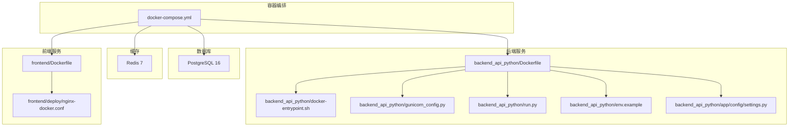
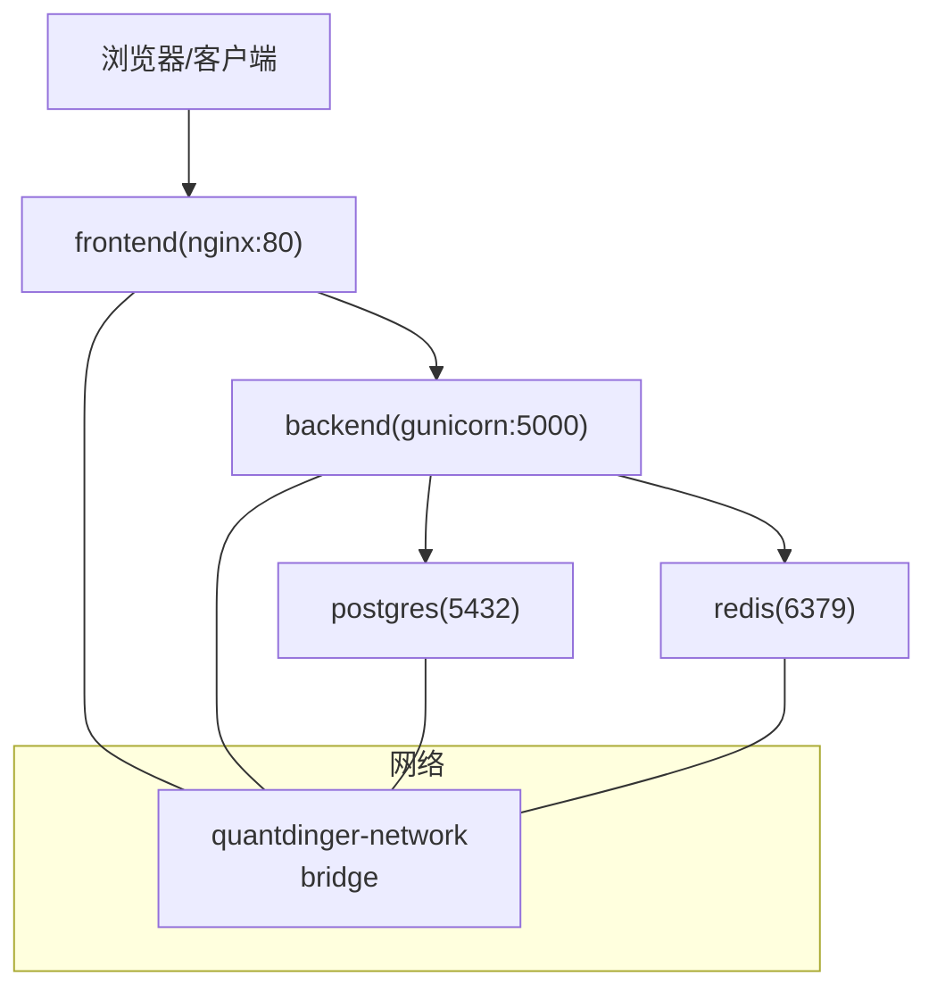
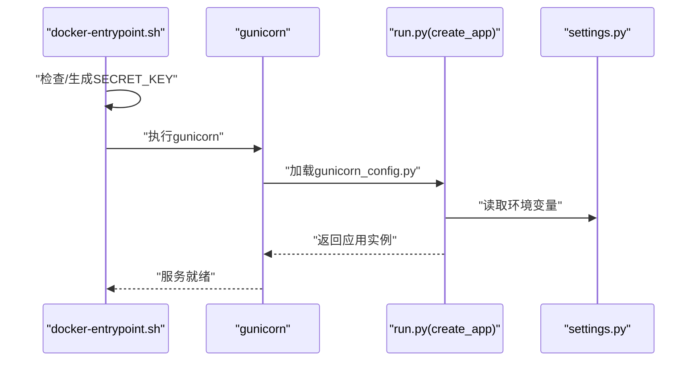
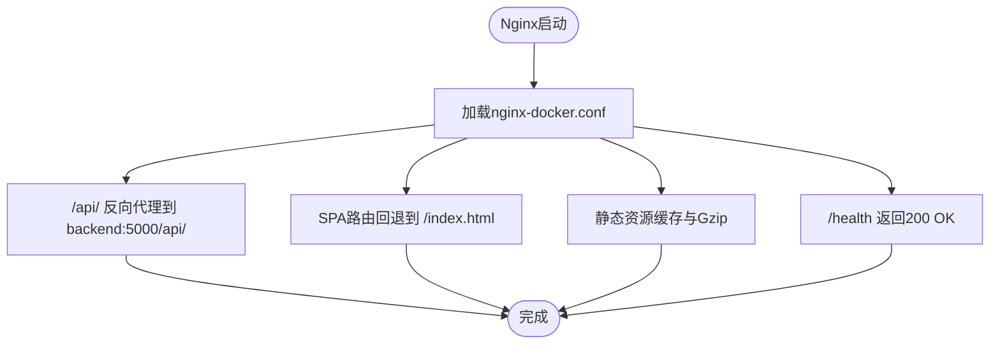
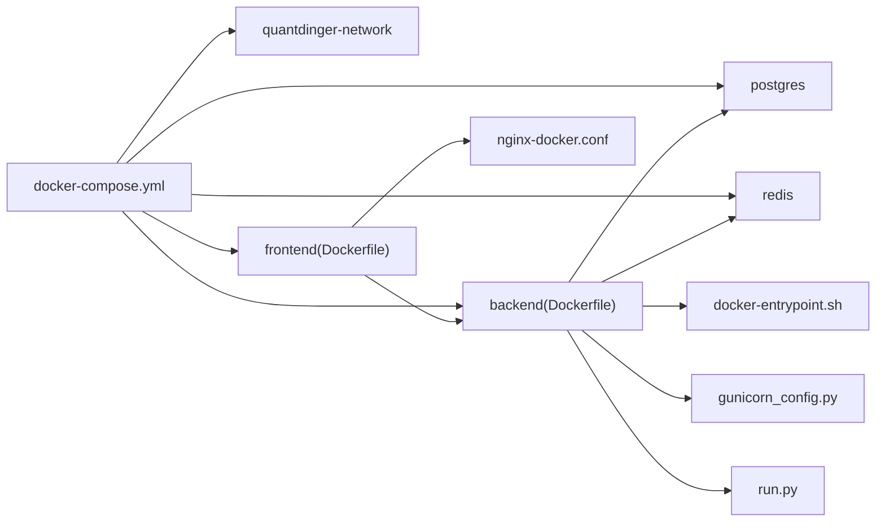

# Docker容器化部署

<cite>
**本文引用的文件**
- [docker-compose.yml](file://docker-compose.yml)
- [backend_api_python/Dockerfile](file://backend_api_python/Dockerfile)
- [frontend/Dockerfile](file://frontend/Dockerfile)
- [backend_api_python/docker-entrypoint.sh](file://backend_api_python/docker-entrypoint.sh)
- [backend_api_python/env.example](file://backend_api_python/env.example)
- [backend_api_python/gunicorn_config.py](file://backend_api_python/gunicorn_config.py)
- [frontend/deploy/nginx-docker.conf](file://frontend/deploy/nginx-docker.conf)
- [backend_api_python/run.py](file://backend_api_python/run.py)
- [backend_api_python/.dockerignore](file://backend_api_python/.dockerignore)
- [frontend/.dockerignore](file://frontend/.dockerignore)
- [backend_api_python/start.sh](file://backend_api_python/start.sh)
- [backend_api_python/requirements.txt](file://backend_api_python/requirements.txt)
- [frontend/package.json](file://frontend/package.json)
- [backend_api_python/app/config/settings.py](file://backend_api_python/app/config/settings.py)
</cite>

## 目录
1. [简介](#简介)
2. [项目结构](#项目结构)
3. [核心组件](#核心组件)
4. [架构总览](#架构总览)
5. [详细组件分析](#详细组件分析)
6. [依赖关系分析](#依赖关系分析)
7. [性能考虑](#性能考虑)
8. [故障排查指南](#故障排查指南)
9. [结论](#结论)
10. [附录](#附录)

## 简介
本指南面向希望以Docker方式一键部署QuantDinger的用户，覆盖docker-compose编排中各服务组件（PostgreSQL数据库、Redis缓存、后端API、前端Nginx）的配置与运行机制，详解Dockerfile构建流程、镜像构建参数、容器间网络通信、健康检查、数据卷挂载与端口映射，并提供从环境准备到容器启动的完整部署步骤及常见问题排查方法。

## 项目结构
QuantDinger采用多模块仓库组织：后端API（Python/Flask）、前端（Vue）与容器编排（docker-compose）。容器编排通过单个compose文件统一管理数据库、缓存、后端与前端服务，形成可直接启动的一体化部署方案。

图表来源
- [docker-compose.yml:23-163](file://docker-compose.yml#L23-L163)
- [backend_api_python/Dockerfile:1-56](file://backend_api_python/Dockerfile#L1-L56)
- [frontend/Dockerfile:1-33](file://frontend/Dockerfile#L1-L33)
- [backend_api_python/docker-entrypoint.sh:1-49](file://backend_api_python/docker-entrypoint.sh#L1-L49)
- [backend_api_python/gunicorn_config.py:1-36](file://backend_api_python/gunicorn_config.py#L1-L36)
- [backend_api_python/run.py:1-134](file://backend_api_python/run.py#L1-L134)
- [backend_api_python/env.example:1-268](file://backend_api_python/env.example#L1-L268)
- [backend_api_python/app/config/settings.py:1-99](file://backend_api_python/app/config/settings.py#L1-L99)
- [frontend/deploy/nginx-docker.conf:1-45](file://frontend/deploy/nginx-docker.conf#L1-L45)

章节来源
- [docker-compose.yml:1-163](file://docker-compose.yml#L1-L163)

## 核心组件
- 数据库（PostgreSQL）
  - 版本：16-alpine
  - 环境变量：数据库名、用户名、密码、时区
  - 命令参数：调整最大连接数与共享缓冲
  - 卷：持久化数据与初始化SQL
  - 端口：默认5432，支持本地绑定
  - 健康检查：基于pg_isready
- 缓存（Redis）
  - 版本：7-alpine
  - 命令参数：限制内存与淘汰策略
  - 端口：默认6379，支持本地绑定
  - 健康检查：redis-cli ping
- 后端API（Python/Flask + Gunicorn）
  - 构建上下文：backend_api_python
  - 入口：docker-entrypoint.sh负责SECRET_KEY校验与生成
  - 运行：gunicorn按gunicorn_config.py配置启动
  - 环境变量：数据库URL、Redis连接、连接池参数、并发线程等
  - 卷：日志与业务数据目录、.env挂载用于运行时配置
  - 健康检查：访问/api/health
- 前端（Nginx）
  - 多阶段构建：Node构建产物，Nginx提供静态服务
  - 配置：反向代理/api/至后端、SPA路由回退、静态资源缓存、健康检查端点
  - 端口：默认80，映射宿主机端口
  - 健康检查：/health返回200

章节来源
- [docker-compose.yml:27-56](file://docker-compose.yml#L27-L56)
- [docker-compose.yml:61-74](file://docker-compose.yml#L61-L74)
- [docker-compose.yml:79-127](file://docker-compose.yml#L79-L127)
- [docker-compose.yml:132-150](file://docker-compose.yml#L132-L150)
- [backend_api_python/Dockerfile:1-56](file://backend_api_python/Dockerfile#L1-L56)
- [frontend/Dockerfile:1-33](file://frontend/Dockerfile#L1-L33)
- [backend_api_python/docker-entrypoint.sh:1-49](file://backend_api_python/docker-entrypoint.sh#L1-L49)
- [backend_api_python/gunicorn_config.py:1-36](file://backend_api_python/gunicorn_config.py#L1-L36)
- [frontend/deploy/nginx-docker.conf:1-45](file://frontend/deploy/nginx-docker.conf#L1-L45)

## 架构总览
下图展示容器间的网络通信与请求流向：前端Nginx作为入口，反向代理/api/到后端；后端通过环境变量连接数据库与Redis；数据库与缓存均通过独立容器提供服务。

图表来源
- [docker-compose.yml:23-163](file://docker-compose.yml#L23-L163)
- [frontend/deploy/nginx-docker.conf:18-32](file://frontend/deploy/nginx-docker.conf#L18-L32)
- [backend_api_python/gunicorn_config.py:12-18](file://backend_api_python/gunicorn_config.py#L12-L18)

## 详细组件分析

### PostgreSQL数据库服务
- 镜像与版本：postgres:16-alpine
- 环境变量
  - POSTGRES_DB、POSTGRES_USER、POSTGRES_PASSWORD、TZ
- 初始化与持久化
  - 挂载初始化SQL：/docker-entrypoint-initdb.d/01-init.sql
  - 数据卷：postgres_data
- 性能与稳定性
  - 通过command参数提升max_connections与shared_buffers
- 健康检查
  - 使用pg_isready检测连接可用性

章节来源
- [docker-compose.yml:27-56](file://docker-compose.yml#L27-L56)

### Redis缓存服务
- 镜像与版本：redis:7-alpine
- 命令参数
  - 限制内存为128MB，淘汰策略LRU
- 健康检查
  - 使用redis-cli ping

章节来源
- [docker-compose.yml:61-74](file://docker-compose.yml#L61-L74)

### 后端API服务（Python/Flask + Gunicorn）
- 构建与入口
  - Dockerfile：基础镜像、依赖安装、复制代码、设置入口脚本、暴露端口、默认CMD
  - docker-entrypoint.sh：检查并自动生成/替换SECRET_KEY，确保安全
- 运行时配置
  - gunicorn_config.py：绑定地址与端口、工作进程与线程、超时与日志级别
  - run.py：加载.env、应用代理设置、创建应用实例、安全检查与启动
  - settings.py：集中读取环境变量，提供配置属性
- 环境变量（示例）
  - DATABASE_URL、DB_TYPE、REDIS_HOST、REDIS_PORT、CACHE_ENABLED
  - 连接池参数：DB_POOL_MIN、DB_POOL_MAX、DB_POOL_ACQUIRE_TIMEOUT、DB_POOL_HEALTH_CHECK
  - 并发参数：MARKET_EXECUTOR_WORKERS、PORTFOLIO_EXECUTOR_WORKERS、GUNICORN_WORKERS、GUNICORN_THREADS
- 卷
  - 后端日志与数据目录
  - .env挂载用于运行时配置更新
- 健康检查
  - 访问/api/health

图表来源
- [backend_api_python/docker-entrypoint.sh:25-44](file://backend_api_python/docker-entrypoint.sh#L25-L44)
- [backend_api_python/gunicorn_config.py:10-36](file://backend_api_python/gunicorn_config.py#L10-L36)
- [backend_api_python/run.py:96-101](file://backend_api_python/run.py#L96-L101)
- [backend_api_python/app/config/settings.py:30-33](file://backend_api_python/app/config/settings.py#L30-L33)

章节来源
- [backend_api_python/Dockerfile:1-56](file://backend_api_python/Dockerfile#L1-L56)
- [backend_api_python/docker-entrypoint.sh:1-49](file://backend_api_python/docker-entrypoint.sh#L1-L49)
- [backend_api_python/gunicorn_config.py:1-36](file://backend_api_python/gunicorn_config.py#L1-L36)
- [backend_api_python/run.py:1-134](file://backend_api_python/run.py#L1-L134)
- [backend_api_python/app/config/settings.py:1-99](file://backend_api_python/app/config/settings.py#L1-L99)

### 前端服务（Nginx）
- 多阶段构建
  - 阶段1：Node安装依赖并构建生产包
  - 阶段2：Nginx镜像拷贝dist与配置
- Nginx配置要点
  - 反向代理/api/至backend:5000/api/
  - SPA路由回退到/index.html
  - 静态资源缓存与Gzip压缩
  - /health健康检查端点
- 端口映射：默认80，映射宿主机端口

图表来源
- [frontend/Dockerfile:1-33](file://frontend/Dockerfile#L1-L33)
- [frontend/deploy/nginx-docker.conf:1-45](file://frontend/deploy/nginx-docker.conf#L1-L45)

章节来源
- [frontend/Dockerfile:1-33](file://frontend/Dockerfile#L1-L33)
- [frontend/deploy/nginx-docker.conf:1-45](file://frontend/deploy/nginx-docker.conf#L1-L45)

## 依赖关系分析
- 组件耦合
  - 后端依赖数据库与缓存，通过环境变量进行连接配置
  - 前端依赖后端提供的API，通过Nginx反向代理
- 依赖链
  - compose定义网络与服务依赖顺序
  - 后端依赖entrypoint进行安全检查
  - 前端依赖构建产物与Nginx配置

图表来源
- [docker-compose.yml:23-163](file://docker-compose.yml#L23-L163)
- [backend_api_python/Dockerfile:1-56](file://backend_api_python/Dockerfile#L1-L56)
- [frontend/Dockerfile:1-33](file://frontend/Dockerfile#L1-L33)
- [backend_api_python/docker-entrypoint.sh:1-49](file://backend_api_python/docker-entrypoint.sh#L1-L49)
- [backend_api_python/gunicorn_config.py:1-36](file://backend_api_python/gunicorn_config.py#L1-L36)
- [backend_api_python/run.py:1-134](file://backend_api_python/run.py#L1-L134)
- [frontend/deploy/nginx-docker.conf:1-45](file://frontend/deploy/nginx-docker.conf#L1-L45)

章节来源
- [docker-compose.yml:23-163](file://docker-compose.yml#L23-L163)

## 性能考虑
- 数据库连接池
  - 通过DB_POOL_MIN、DB_POOL_MAX、DB_POOL_ACQUIRE_TIMEOUT、DB_POOL_HEALTH_CHECK调节并发与超时
  - PostgreSQL最大连接数需高于连接池上限
- Gunicorn并发模型
  - 默认gthread模型，可通过GUNICORN_WORKERS与GUNICORN_THREADS提升吞吐
- 缓存与内存
  - Redis内存限制与淘汰策略控制缓存容量与命中率
- 网络与代理
  - run.py对代理环境变量进行统一处理，避免不必要的海外代理往返

章节来源
- [docker-compose.yml:108-120](file://docker-compose.yml#L108-L120)
- [backend_api_python/gunicorn_config.py:14-28](file://backend_api_python/gunicorn_config.py#L14-L28)
- [backend_api_python/run.py:60-91](file://backend_api_python/run.py#L60-L91)

## 故障排查指南
- 启动失败与安全密钥
  - 现象：容器无法启动或提示默认密钥
  - 排查：确认backend/.env中的SECRET_KEY已修改；entrypoint会自动检测并生成随机密钥
  - 参考
    - [backend_api_python/docker-entrypoint.sh:25-44](file://backend_api_python/docker-entrypoint.sh#L25-L44)
    - [backend_api_python/env.example:13-15](file://backend_api_python/env.example#L13-L15)
- 数据库连接异常
  - 现象：后端健康检查失败或连接池耗尽
  - 排查：检查DATABASE_URL、DB_POOL_MAX与PostgreSQL max_connections；确认数据库健康状态
  - 参考
    - [docker-compose.yml:103-114](file://docker-compose.yml#L103-L114)
    - [docker-compose.yml:39-44](file://docker-compose.yml#L39-L44)
- 缓存不可用
  - 现象：缓存相关功能异常
  - 排查：确认Redis健康检查与CACHE_ENABLED；检查后端Redis连接参数
  - 参考
    - [docker-compose.yml:65-66](file://docker-compose.yml#L65-L66)
    - [docker-compose.yml:105-107](file://docker-compose.yml#L105-L107)
- 前端无法访问API
  - 现象：页面空白或API 502/504
  - 排查：确认Nginx反向代理配置、后端健康状态、端口映射
  - 参考
    - [frontend/deploy/nginx-docker.conf:18-32](file://frontend/deploy/nginx-docker.conf#L18-L32)
    - [docker-compose.yml:142-143](file://docker-compose.yml#L142-L143)
- 代理与SSL证书问题
  - 现象：访问外部数据源失败或证书验证错误
  - 排查：根据run.py注释配置PROXY_URL、LIVE_TRADING_CA_BUNDLE或禁用TLS校验（仅测试）
  - 参考
    - [backend_api_python/run.py:60-91](file://backend_api_python/run.py#L60-L91)
    - [backend_api_python/env.example:110-117](file://backend_api_python/env.example#L110-L117)

章节来源
- [backend_api_python/docker-entrypoint.sh:25-44](file://backend_api_python/docker-entrypoint.sh#L25-L44)
- [backend_api_python/env.example:13-15](file://backend_api_python/env.example#L13-L15)
- [docker-compose.yml:103-114](file://docker-compose.yml#L103-L114)
- [docker-compose.yml:39-44](file://docker-compose.yml#L39-L44)
- [frontend/deploy/nginx-docker.conf:18-32](file://frontend/deploy/nginx-docker.conf#L18-L32)

## 结论
通过docker-compose统一编排，QuantDinger实现了数据库、缓存、后端与前端的快速部署。遵循本文档的配置参数、健康检查与数据卷挂载规范，可在本地或生产环境中稳定运行。建议在生产环境进一步完善密钥管理、备份策略与监控告警。

## 附录

### 部署步骤（从零到运行）
- 准备环境
  - 安装Docker与Docker Compose
- 复制并编辑环境
  - 将env.example复制为.env并设置SECRET_KEY
  - 参考：[backend_api_python/env.example:1-31](file://backend_api_python/env.example#L1-L31)
- 构建与启动
  - 执行：docker-compose up -d --build
  - 参考：[docker-compose.yml:1-16](file://docker-compose.yml#L1-L16)
- 访问服务
  - 前端：http://localhost:8888
  - 后端健康检查：http://localhost:5000/api/health
  - 参考：[docker-compose.yml:140-141](file://docker-compose.yml#L140-L141), [docker-compose.yml:123-127](file://docker-compose.yml#L123-L127)

章节来源
- [docker-compose.yml:1-16](file://docker-compose.yml#L1-L16)
- [backend_api_python/env.example:1-31](file://backend_api_python/env.example#L1-L31)

### 关键配置清单
- 数据库（PostgreSQL）
  - 环境变量：POSTGRES_DB、POSTGRES_USER、POSTGRES_PASSWORD、TZ
  - 命令参数：max_connections、shared_buffers
  - 卷：postgres_data、初始化SQL
  - 端口：127.0.0.1:5432
  - 健康检查：pg_isready
  - 参考：[docker-compose.yml:27-56](file://docker-compose.yml#L27-L56)
- 缓存（Redis）
  - 命令参数：maxmemory、maxmemory-policy
  - 端口：127.0.0.1:6379
  - 健康检查：redis-cli ping
  - 参考：[docker-compose.yml:61-74](file://docker-compose.yml#L61-L74)
- 后端API（Python/Flask + Gunicorn）
  - 构建上下文：./backend_api_python
  - 入口：docker-entrypoint.sh
  - 环境变量：DATABASE_URL、REDIS_HOST、REDIS_PORT、CACHE_ENABLED、DB_POOL_*、GUNICORN_WORKERS、GUNICORN_THREADS
  - 卷：backend_logs、backend_data、.env挂载
  - 健康检查：/api/health
  - 参考：[docker-compose.yml:79-127](file://docker-compose.yml#L79-L127), [backend_api_python/Dockerfile:1-56](file://backend_api_python/Dockerfile#L1-L56), [backend_api_python/gunicorn_config.py:1-36](file://backend_api_python/gunicorn_config.py#L1-L36)
- 前端（Nginx）
  - 构建上下文：./frontend
  - 配置：反向代理/api/、SPA路由、静态资源缓存、/health
  - 端口：80
  - 健康检查：/health
  - 参考：[docker-compose.yml:132-150](file://docker-compose.yml#L132-L150), [frontend/Dockerfile:1-33](file://frontend/Dockerfile#L1-L33), [frontend/deploy/nginx-docker.conf:1-45](file://frontend/deploy/nginx-docker.conf#L1-L45)

章节来源
- [docker-compose.yml:27-150](file://docker-compose.yml#L27-L150)
- [backend_api_python/Dockerfile:1-56](file://backend_api_python/Dockerfile#L1-L56)
- [frontend/Dockerfile:1-33](file://frontend/Dockerfile#L1-L33)
- [backend_api_python/gunicorn_config.py:1-36](file://backend_api_python/gunicorn_config.py#L1-L36)
- [frontend/deploy/nginx-docker.conf:1-45](file://frontend/deploy/nginx-docker.conf#L1-L45)