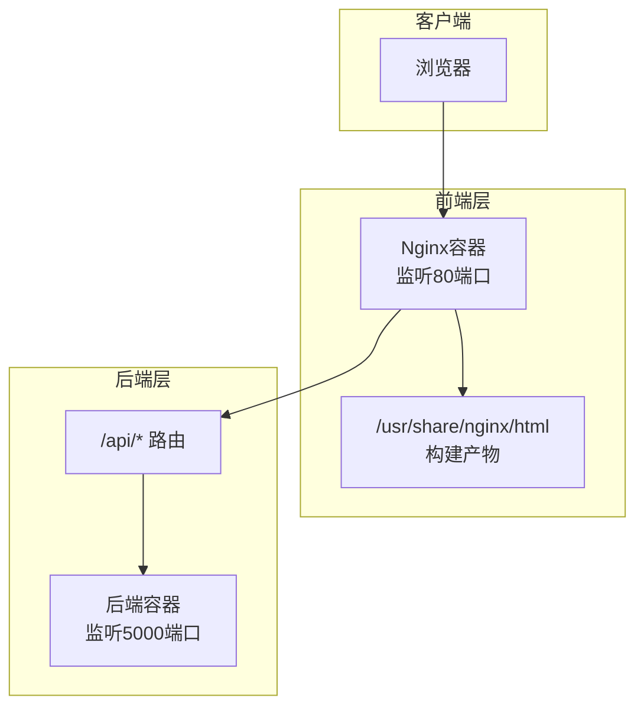
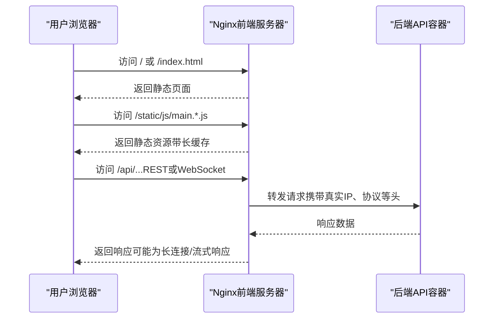
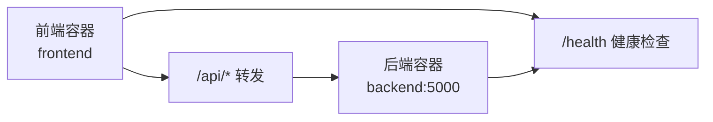

# Nginx反向代理配置

<cite>
**本文档引用的文件**
- [nginx.conf](file://frontend/nginx.conf)
- [nginx-docker.conf](file://frontend/deploy/nginx-docker.conf)
- [nginx.conf（部署）](file://frontend/deploy/nginx.conf)
- [caddy.conf](file://frontend/deploy/caddy.conf)
- [Dockerfile（前端）](file://frontend/Dockerfile)
- [Dockerfile（后端）](file://backend_api_python/Dockerfile)
- [docker-compose.yml](file://docker-compose.yml)
- [CLOUD_DEPLOYMENT_EN.md](file://docs/CLOUD_DEPLOYMENT_EN.md)
</cite>

## 目录
1. [简介](#简介)
2. [项目结构](#项目结构)
3. [核心组件](#核心组件)
4. [架构总览](#架构总览)
5. [详细组件分析](#详细组件分析)
6. [依赖关系分析](#依赖关系分析)
7. [性能考虑](#性能考虑)
8. [故障排除指南](#故障排除指南)
9. [结论](#结论)
10. [附录](#附录)

## 简介
本文件面向运维与开发人员，系统性阐述如何在本项目中使用Nginx作为前端静态资源服务器与反向代理，覆盖以下主题：
- 静态文件服务：根目录、MIME类型、SPA路由回退
- 反向代理：到后端API的请求转发、WebSocket升级、超时与上传限制
- 缓存策略：静态资源长期缓存与immutable头
- 安全与压缩：安全头、gzip压缩
- 替代方案：Caddy配置对比
- 性能优化与常见问题排查

## 项目结构
前端通过Nginx容器提供静态资源服务，并将/api前缀的请求转发至后端服务。后端服务由Python应用提供REST API，二者通过Docker网络通信。

图表来源
- [Dockerfile（前端）:1-33](file://frontend/Dockerfile#L1-L33)
- [Dockerfile（后端）:1-56](file://backend_api_python/Dockerfile#L1-L56)
- [docker-compose.yml:132-150](file://docker-compose.yml#L132-L150)

章节来源
- [Dockerfile（前端）:1-33](file://frontend/Dockerfile#L1-L33)
- [Dockerfile（后端）:1-56](file://backend_api_python/Dockerfile#L1-L56)
- [docker-compose.yml:132-150](file://docker-compose.yml#L132-L150)

## 核心组件
- Nginx静态资源服务器：提供构建产物的静态访问，支持SPA路由回退
- Nginx反向代理：将/api前缀请求转发至后端容器
- 后端API服务：提供REST接口与健康检查
- Docker编排：统一管理前后端容器与网络

章节来源
- [nginx.conf:1-56](file://frontend/nginx.conf#L1-L56)
- [nginx-docker.conf:1-45](file://frontend/deploy/nginx-docker.conf#L1-L45)
- [docker-compose.yml:79-150](file://docker-compose.yml#L79-L150)

## 架构总览
下图展示从浏览器到后端API的完整请求链路，以及静态资源与API的分流逻辑。

图表来源
- [nginx.conf:15-47](file://frontend/nginx.conf#L15-L47)
- [nginx-docker.conf:18-32](file://frontend/deploy/nginx-docker.conf#L18-L32)
- [docker-compose.yml:132-150](file://docker-compose.yml#L132-L150)

## 详细组件分析

### Nginx静态资源与SPA路由
- 根目录与索引：指定静态资源根路径与默认首页
- MIME类型：加载标准MIME类型映射
- SPA路由回退：对未匹配的路径回退到/index.html，支持前端路由
- 示例路径参考
  - [根目录与索引:2-5](file://frontend/nginx.conf#L2-L5)
  - [SPA路由回退:44-47](file://frontend/nginx.conf#L44-L47)
  - [根目录与索引（部署版）:12-16](file://frontend/deploy/nginx.conf#L12-L16)

章节来源
- [nginx.conf:1-56](file://frontend/nginx.conf#L1-L56)
- [nginx.conf（部署）:1-25](file://frontend/deploy/nginx.conf#L1-L25)

### Nginx反向代理与上游设置
- API前缀：/api/ 路由转发至后端容器的/api/
- 升级支持：WebSocket与HTTP/1.1升级头透传
- 关键头透传：Host、X-Real-IP、X-Forwarded-For、X-Forwarded-Proto
- 超时与上传限制：读取、连接、发送超时；允许较大上传体
- 示例路径参考
  - [/api/代理规则:26-42](file://frontend/nginx.conf#L26-L42)
  - [/api/代理规则（部署版）:19-23](file://frontend/deploy/nginx.conf#L19-L23)

章节来源
- [nginx.conf:26-42](file://frontend/nginx.conf#L26-L42)
- [nginx-docker.conf:18-32](file://frontend/deploy/nginx-docker.conf#L18-L32)

### 缓存策略与安全头
- 静态资源缓存：对JS/CSS/图片/字体等设置一年过期与immutable头
- 访问日志：静态资源访问日志关闭以降低I/O
- 安全头：X-Frame-Options、X-Content-Type-Options、X-XSS-Protection
- 示例路径参考
  - [静态资源缓存与日志:19-24](file://frontend/nginx.conf#L19-L24)
  - [安全头:7-11](file://frontend/nginx.conf#L7-L11)

章节来源
- [nginx.conf:7-24](file://frontend/nginx.conf#L7-L24)

### 健康检查端点
- /health：返回简单文本“OK”，用于容器健康检查
- 示例路径参考
  - [健康检查端点:49-54](file://frontend/nginx.conf#L49-L54)
  - [健康检查端点（部署版）:19-23](file://frontend/deploy/nginx.conf#L19-L23)

章节来源
- [nginx.conf:49-54](file://frontend/nginx.conf#L49-L54)
- [nginx-docker.conf:39-43](file://frontend/deploy/nginx-docker.conf#L39-L43)

### Caddy作为替代方案
- 简化配置：启用gzip，设置根目录，重写规则
- 适用场景：快速部署、简化维护
- 示例路径参考
  - [Caddy配置:1-9](file://frontend/deploy/caddy.conf#L1-L9)

章节来源
- [caddy.conf:1-9](file://frontend/deploy/caddy.conf#L1-L9)

## 依赖关系分析
- 前端容器依赖后端容器的/api/路径
- Docker网络隔离，容器间通过服务名通信
- 健康检查确保后端可用后再对外提供服务

图表来源
- [docker-compose.yml:132-150](file://docker-compose.yml#L132-L150)
- [nginx.conf:26-42](file://frontend/nginx.conf#L26-L42)

章节来源
- [docker-compose.yml:79-150](file://docker-compose.yml#L79-L150)
- [nginx.conf:26-42](file://frontend/nginx.conf#L26-L42)

## 性能考虑
- 静态资源长期缓存：对哈希命名的静态文件设置一年过期与immutable，显著减少带宽与CPU
- gzip压缩：开启并限定压缩类型，提升传输效率
- 超时与上传：针对长时间任务（如回测）延长读取与发送超时，合理设置上传大小上限
- 日志优化：静态资源访问日志关闭，降低I/O开销
- 参考路径
  - [静态资源缓存与日志:19-24](file://frontend/nginx.conf#L19-L24)
  - [gzip配置:12-17](file://frontend/nginx.conf#L12-L17)
  - [超时与上传限制:37-42](file://frontend/nginx.conf#L37-L42)

章节来源
- [nginx.conf:12-24](file://frontend/nginx.conf#L12-L24)
- [nginx.conf:37-42](file://frontend/nginx.conf#L37-L42)

## 故障排除指南
- 502/504错误排查清单
  - 检查容器状态与健康检查
  - 验证Nginx配置语法
  - 分别访问前端与后端健康端点
  - 参考路径
    - [故障排查命令:422-431](file://docs/CLOUD_DEPLOYMENT_EN.md#L422-L431)
- 端口暴露与安全
  - 数据库与后端仅本地绑定，仅对外暴露80/443
  - 参考路径
    - [端口暴露建议:433-449](file://docs/CLOUD_DEPLOYMENT_EN.md#L433-L449)
- 常见问题定位
  - 前端静态资源无法加载：确认根目录与SPA回退规则
  - API请求失败：检查代理头透传与超时设置
  - 参考路径
    - [SPA回退:44-47](file://frontend/nginx.conf#L44-L47)
    - [代理头与超时:26-42](file://frontend/nginx.conf#L26-L42)

章节来源
- [CLOUD_DEPLOYMENT_EN.md:422-451](file://docs/CLOUD_DEPLOYMENT_EN.md#L422-L451)
- [nginx.conf:26-47](file://frontend/nginx.conf#L26-L47)

## 结论
本项目的Nginx配置以“静态资源服务 + 反向代理”为核心，结合合理的缓存与安全策略，满足生产环境的性能与稳定性要求。配合Docker编排实现前后端解耦与健康检查，便于部署与维护。若追求更简化的运维体验，可考虑Caddy作为替代方案。

## 附录

### Nginx配置要点速查
- server块
  - 监听端口与server_name
  - 根目录与默认索引
  - 参考路径
    - [server块（示例）:1-6](file://frontend/nginx.conf#L1-L6)
- location规则
  - 静态资源缓存与immutable头
  - SPA路由回退
  - API代理与头透传
  - 健康检查
  - 参考路径
    - [静态缓存与日志:19-24](file://frontend/nginx.conf#L19-L24)
    - [SPA回退:44-47](file://frontend/nginx.conf#L44-L47)
    - [/api/代理:26-42](file://frontend/nginx.conf#L26-L42)
    - [/health:49-54](file://frontend/nginx.conf#L49-L54)
- gzip与安全头
  - gzip开关、类型、最小长度、vary
  - 安全头：X-Frame-Options、X-Content-Type-Options、X-XSS-Protection
  - 参考路径
    - [gzip与安全头:12-17](file://frontend/nginx.conf#L12-L17)
    - [安全头:7-11](file://frontend/nginx.conf#L7-L11)

章节来源
- [nginx.conf:1-56](file://frontend/nginx.conf#L1-L56)