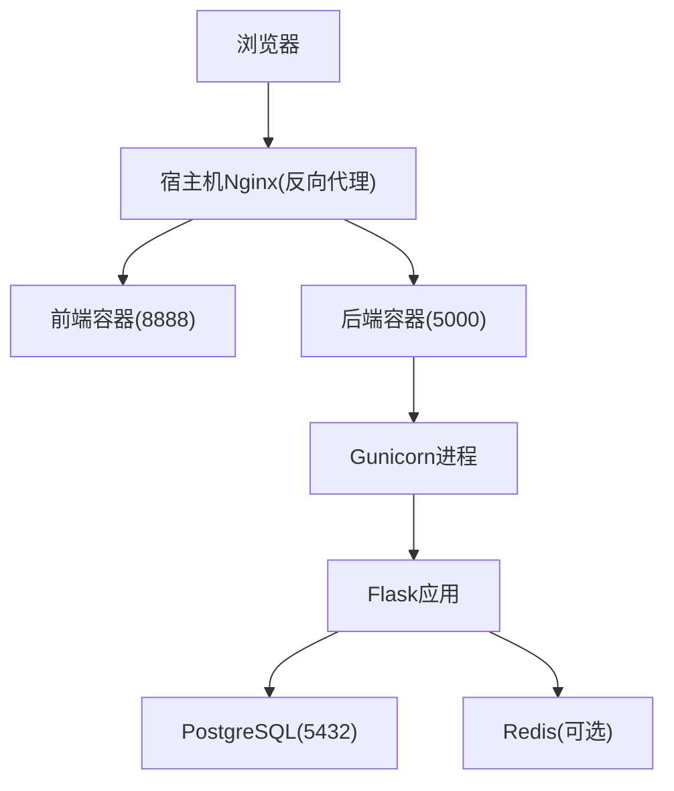
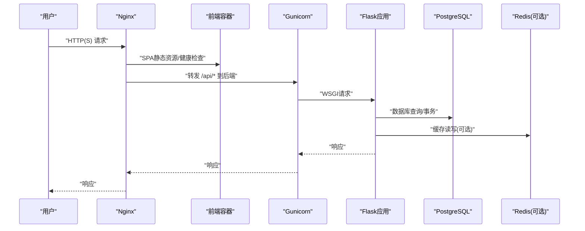
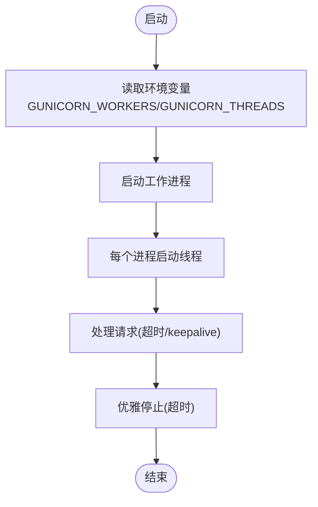
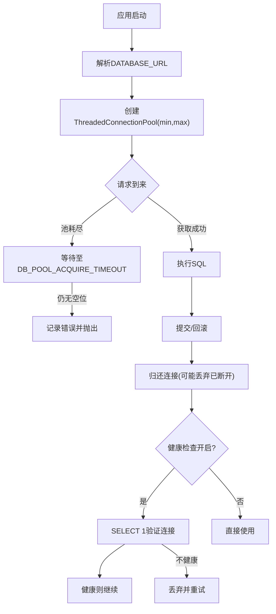
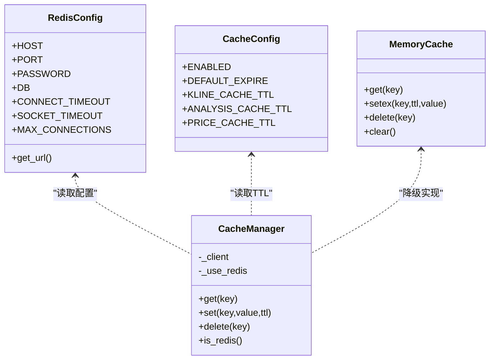
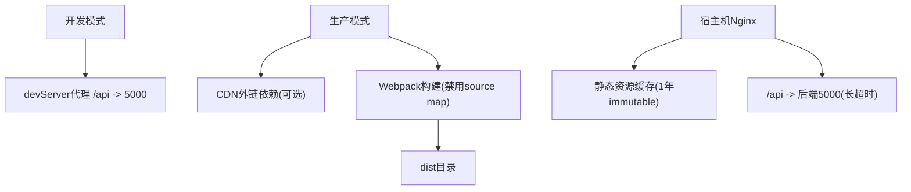
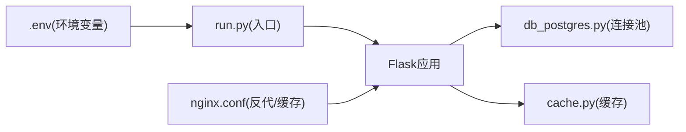

# 性能优化与调优

<cite>
**本文引用的文件**
- [gunicorn_config.py](file://backend_api_python/gunicorn_config.py)
- [run.py](file://backend_api_python/run.py)
- [database.py](file://backend_api_python/app/config/database.py)
- [db_postgres.py](file://backend_api_python/app/utils/db_postgres.py)
- [settings.py](file://backend_api_python/app/config/settings.py)
- [cache.py](file://backend_api_python/app/utils/cache.py)
- [env.example](file://backend_api_python/env.example)
- [vue.config.js](file://frontend/vue.config.js)
- [nginx.conf](file://frontend/deploy/nginx.conf)
- [CLOUD_DEPLOYMENT_EN.md](file://docs/CLOUD_DEPLOYMENT_EN.md)
- [README.md（后端）](file://backend_api_python/README.md)
</cite>

## 目录
1. [简介](#简介)
2. [项目结构](#项目结构)
3. [核心组件](#核心组件)
4. [架构总览](#架构总览)
5. [详细组件分析](#详细组件分析)
6. [依赖关系分析](#依赖关系分析)
7. [性能考量](#性能考量)
8. [故障排查指南](#故障排查指南)
9. [结论](#结论)
10. [附录](#附录)

## 简介
本指南面向QuantDinger的运维与开发团队，聚焦于后端Gunicorn配置、数据库连接池、Redis缓存、前端静态资源与CDN、以及性能测试与基准测试方法。内容基于仓库中现有实现与配置文件进行提炼，帮助在生产环境中获得稳定且可扩展的性能表现。

## 项目结构
QuantDinger采用前后端分离架构：前端通过Nginx反向代理访问后端；后端以Flask应用运行，生产环境通过Gunicorn承载；数据库为PostgreSQL，使用连接池；缓存层支持本地内存与Redis（可选）。

图示来源
- [CLOUD_DEPLOYMENT_EN.md:150-186](file://docs/CLOUD_DEPLOYMENT_EN.md#L150-L186)
- [nginx.conf:26-42](file://frontend/deploy/nginx.conf#L26-L42)
- [gunicorn_config.py:10-36](file://backend_api_python/gunicorn_config.py#L10-L36)
- [run.py:96-101](file://backend_api_python/run.py#L96-L101)

章节来源
- [CLOUD_DEPLOYMENT_EN.md:1-451](file://docs/CLOUD_DEPLOYMENT_EN.md#L1-L451)
- [README.md（后端）:1-241](file://backend_api_python/README.md#L1-L241)

## 核心组件
- 后端Web服务器：Gunicorn（多线程模型），通过环境变量控制worker数量与线程数。
- 数据库：PostgreSQL，使用psycopg2的ThreadedConnectionPool，支持最小/最大连接数、获取超时与健康检查。
- 缓存：本地内存缓存优先；可选启用Redis，支持TTL与自动降级。
- 前端构建与部署：Vue CLI + Webpack，支持CDN外链与生产资源压缩；Nginx提供静态资源缓存与反代。

章节来源
- [gunicorn_config.py:10-36](file://backend_api_python/gunicorn_config.py#L10-L36)
- [db_postgres.py:53-56](file://backend_api_python/app/utils/db_postgres.py#L53-L56)
- [cache.py:49-99](file://backend_api_python/app/utils/cache.py#L49-L99)
- [vue.config.js:34-50](file://frontend/vue.config.js#L34-L50)
- [nginx.conf:12-24](file://frontend/deploy/nginx.conf#L12-L24)

## 架构总览
下图展示生产部署中的请求流与关键性能点：

图示来源
- [CLOUD_DEPLOYMENT_EN.md:150-186](file://docs/CLOUD_DEPLOYMENT_EN.md#L150-L186)
- [nginx.conf:26-42](file://frontend/deploy/nginx.conf#L26-L42)
- [gunicorn_config.py:10-36](file://backend_api_python/gunicorn_config.py#L10-L36)
- [db_postgres.py:402-438](file://backend_api_python/app/utils/db_postgres.py#L402-L438)
- [cache.py:100-124](file://backend_api_python/app/utils/cache.py#L100-L124)

## 详细组件分析

### Gunicorn配置与并发调优
- 工作模型：gthread（单进程多线程），便于保持I/O并发同时维持熟悉的单进程模型。
- 关键参数：
  - workers：默认1，建议根据CPU核数与任务特性提升，注意与数据库连接池上限协调。
  - threads：默认4，可根据I/O密集程度适度增加。
  - timeout：默认120秒，长任务（如回测）需结合代理层超时设置。
  - graceful_timeout：默认30秒，优雅停止窗口。
  - keepalive：默认5秒，降低空闲连接开销。
  - limit_request_line/fields：请求行与字段限制，避免恶意请求。
  - loglevel：日志级别，生产建议info以上。
  - preload_app：禁用，避免后台线程在master进程内失效。
- 启动方式：生产使用gunicorn -c gunicorn_config.py "run:app"，开发使用Flask内置服务器。

图示来源
- [gunicorn_config.py:10-36](file://backend_api_python/gunicorn_config.py#L10-L36)
- [run.py:96-101](file://backend_api_python/run.py#L96-L101)

章节来源
- [gunicorn_config.py:1-36](file://backend_api_python/gunicorn_config.py#L1-L36)
- [run.py:96-134](file://backend_api_python/run.py#L96-L134)
- [env.example:59-62](file://backend_api_python/env.example#L59-L62)

### 数据库连接池配置与健康检查
- 连接池参数（均来自环境变量）：
  - DB_POOL_MIN：最小连接数，默认5。
  - DB_POOL_MAX：最大连接数，默认50。
  - DB_POOL_ACQUIRE_TIMEOUT：连接获取超时（秒），默认10。
  - DB_POOL_HEALTH_CHECK：是否执行轻量健康检查（默认开启）。
- 连接池创建与使用：
  - 使用psycopg2的ThreadedConnectionPool，设置连接超时、时区选项、keepalives等。
  - 获取连接时支持等待至超时，而非立即失败；健康检查失败会丢弃连接并重试。
- 上下文管理：get_pg_connection()确保异常时回滚并正确归还连接，避免泄漏。
- 可用性检测：is_postgres_available()用于健康检查端点。

图示来源
- [db_postgres.py:107-161](file://backend_api_python/app/utils/db_postgres.py#L107-L161)
- [db_postgres.py:184-234](file://backend_api_python/app/utils/db_postgres.py#L184-L234)
- [db_postgres.py:402-438](file://backend_api_python/app/utils/db_postgres.py#L402-L438)

章节来源
- [db_postgres.py:1-495](file://backend_api_python/app/utils/db_postgres.py#L1-L495)
- [env.example:42-57](file://backend_api_python/env.example#L42-L57)

### Redis缓存配置与过期策略
- Redis配置（环境变量）：
  - REDIS_HOST/PORT/PASSWORD/DB：连接参数。
  - REDIS_CONNECT_TIMEOUT/REDIS_SOCKET_TIMEOUT：连接与套接字超时。
  - REDIS_MAX_CONNECTIONS：最大连接数。
  - CACHE_ENABLED：是否启用Redis（默认关闭）。
  - CACHE_EXPIRE：默认TTL。
- TTL策略：
  - K线缓存按周期设置不同TTL（如1分钟到日线不等）。
  - 分析结果与价格缓存分别设定TTL。
- 缓存管理器：
  - 默认使用本地内存缓存；当CACHE_ENABLED为真时尝试连接Redis并Ping校验。
  - 失败时静默降级为内存缓存，保证启动与运行稳定性。

图示来源
- [database.py:6-89](file://backend_api_python/app/config/database.py#L6-L89)
- [cache.py:49-129](file://backend_api_python/app/utils/cache.py#L49-L129)

章节来源
- [database.py:1-90](file://backend_api_python/app/config/database.py#L1-L90)
- [cache.py:1-129](file://backend_api_python/app/utils/cache.py#L1-L129)
- [env.example:261-265](file://backend_api_python/env.example#L261-L265)

### 前端静态资源优化、CDN与浏览器缓存
- CDN外链：在生产模式下可将Vue、Vuex、Axios等依赖替换为CDN链接，减小打包体积。
- 生产构建：禁用source map，减少产物体积与泄露风险。
- Nginx静态资源缓存：对带哈希名的JS/CSS/媒体文件设置一年缓存与immutable标志，显著提升二次加载性能。
- 反向代理：将/api前缀代理到后端5000端口，设置较长读取/发送超时以适配长回测任务。
- 开发代理：devServer将/api代理到后端5000，支持WebSocket与长请求场景。

图示来源
- [vue.config.js:34-50](file://frontend/vue.config.js#L34-L50)
- [vue.config.js:150-155](file://frontend/vue.config.js#L150-L155)
- [vue.config.js:136-148](file://frontend/vue.config.js#L136-L148)
- [nginx.conf:12-24](file://frontend/deploy/nginx.conf#L12-L24)
- [nginx.conf:26-42](file://frontend/deploy/nginx.conf#L26-L42)

章节来源
- [vue.config.js:1-166](file://frontend/vue.config.js#L1-L166)
- [nginx.conf:1-56](file://frontend/deploy/nginx.conf#L1-L56)

## 依赖关系分析
- 后端应用通过run.py加载.env并创建Flask应用实例，供Gunicorn调用。
- 数据库连接池在db_postgres.py中全局单例化，被各服务模块复用。
- 缓存管理器在cache.py中按需初始化Redis或内存实现。
- 前端通过Nginx统一暴露静态资源与API，简化跨域与缓存策略。

图示来源
- [run.py:17-30](file://backend_api_python/run.py#L17-L30)
- [db_postgres.py:107-161](file://backend_api_python/app/utils/db_postgres.py#L107-L161)
- [cache.py:49-99](file://backend_api_python/app/utils/cache.py#L49-L99)
- [nginx.conf:26-42](file://frontend/deploy/nginx.conf#L26-L42)

章节来源
- [run.py:1-134](file://backend_api_python/run.py#L1-L134)
- [db_postgres.py:1-495](file://backend_api_python/app/utils/db_postgres.py#L1-L495)
- [cache.py:1-129](file://backend_api_python/app/utils/cache.py#L1-L129)
- [nginx.conf:1-56](file://frontend/deploy/nginx.conf#L1-L56)

## 性能考量
- Gunicorn并发调优
  - worker数量：建议与CPU核心数匹配，或略高于核心数以应对I/O等待；避免超过数据库最大连接数。
  - threads：I/O密集型可适当提高；注意线程上下文切换成本。
  - 超时与代理：结合Nginx与后端超时设置，确保长任务（回测）不被中断。
- 数据库连接池
  - DB_POOL_MAX应小于或等于PostgreSQL max_connections；监控连接池耗尽错误并调整。
  - DB_POOL_ACQUIRE_TIMEOUT设置合理等待时间，避免瞬时峰值导致请求失败。
  - DB_POOL_HEALTH_CHECK建议开启，但注意每次获取增加一次轻量查询。
- Redis缓存
  - 启用CACHE_ENABLED后，确保Redis可达；不可用时自动降级为内存缓存。
  - 合理设置TTL，热点数据短TTL、冷数据长TTL；避免缓存穿透与雪崩。
- 前端静态资源
  - 生产构建禁用source map；使用CDN可降低首包体积（视网络与合规权衡）。
  - 静态资源强缓存与immutable策略显著提升命中率。
- 反向代理
  - 对长回测与大文件上传设置足够超时；限制请求体大小防止资源滥用。

章节来源
- [gunicorn_config.py:14-28](file://backend_api_python/gunicorn_config.py#L14-L28)
- [env.example:42-62](file://backend_api_python/env.example#L42-L62)
- [db_postgres.py:164-234](file://backend_api_python/app/utils/db_postgres.py#L164-L234)
- [cache.py:77-99](file://backend_api_python/app/utils/cache.py#L77-L99)
- [vue.config.js:150-155](file://frontend/vue.config.js#L150-L155)
- [nginx.conf:37-42](file://frontend/deploy/nginx.conf#L37-L42)

## 故障排查指南
- 数据库连接池耗尽
  - 现象：出现“连接池耗尽”相关错误。
  - 排查：检查DB_POOL_MAX与PostgreSQL max_connections；确认是否存在长时间事务未提交。
  - 处理：提升DB_POOL_MAX或缩短事务；优化慢查询。
- Redis不可用
  - 现象：启用CACHE_ENABLED但Redis不可达，系统降级为内存缓存。
  - 排查：检查Redis连接参数与网络连通性。
  - 处理：修复Redis或关闭CACHE_ENABLED。
- Nginx 502/504
  - 现象：反代后端失败。
  - 排查：检查后端容器状态、健康检查端点、代理超时设置。
  - 处理：调整proxy_read/send_timeout，确保后端正常启动。
- Gunicorn启动失败
  - 现象：启动时报错或无法访问。
  - 排查：确认GUNICORN_WORKERS/GUNICORN_THREADS与系统资源匹配；检查日志级别与绑定地址端口。
  - 处理：调整参数并观察日志。

章节来源
- [db_postgres.py:204-210](file://backend_api_python/app/utils/db_postgres.py#L204-L210)
- [cache.py:94-98](file://backend_api_python/app/utils/cache.py#L94-L98)
- [CLOUD_DEPLOYMENT_EN.md:422-431](file://docs/CLOUD_DEPLOYMENT_EN.md#L422-L431)
- [gunicorn_config.py:10-36](file://backend_api_python/gunicorn_config.py#L10-L36)

## 结论
通过合理配置Gunicorn并发模型、数据库连接池与Redis缓存，并配合前端静态资源与Nginx缓存策略，可在生产环境中获得稳定且高效的用户体验。建议以监控指标为依据持续迭代调优参数，确保在高负载下仍保持低延迟与高吞吐。

## 附录
- 性能测试与基准测试建议
  - 后端接口：使用wrk或ab对关键接口（如分析、回测）进行并发压测，观察P95/P99延迟与错误率。
  - 数据库：使用pgbench或自定义脚本模拟高并发读写，评估连接池上限与慢查询。
  - Redis：使用redis-benchmark对常用命令进行压力测试，评估网络与内存瓶颈。
  - 前端：使用Lighthouse或WebPageTest评估首屏加载与交互性能，关注CDN命中与缓存策略效果。
- 部署与运维
  - 参考官方云部署指南，确保仅暴露80/443端口，数据库与后端容器不直接对外。
  - 使用Let’s Encrypt启用HTTPS，定期更新证书。

章节来源
- [README.md（后端）:225-230](file://backend_api_python/README.md#L225-L230)
- [CLOUD_DEPLOYMENT_EN.md:1-451](file://docs/CLOUD_DEPLOYMENT_EN.md#L1-L451)